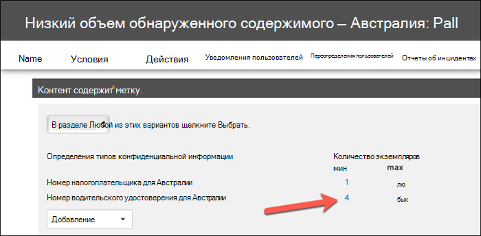

# Создание, тестирование и настройка политики защиты от потери данныхCreate, test, and tune a DLP policy

Предотвращение потери данных (DLP) помогает предотвратить непреднамеренное или случайное распространение конфиденциальной информации.Data loss prevention (DLP) helps you prevent the unintentional or accidental sharing of sensitive information.

DLP проверяет сообщения электронной почты и файлы для получения конфиденциальной информации, например номера кредитной карты.DLP examines email messages and files for sensitive information, like a credit card number. С помощью DLP вы можете обнаруживать конфиденциальные сведения и принимать меры, такие как:Using DLP you can detect sensitive information, and take action such as:

- Журнал события для целей аудитаLog the event for auditing purposes
- Отображение предупреждения конечному пользователю, который отправляет электронную почту или делится файломDisplay a warning to the end user who is sending the email or sharing the file
- Активно блокировать доступ к электронной почте или файлуActively block the email or file sharing from taking place

## РазрешенияPermissions

Членам группы обеспечения соответствия требованиям, которые будут создавать политики защиты от потери данных, потребуются разрешения для работы в Центре соответствия требованиям.Members of your compliance team who will create DLP policies need permissions to the Compliance Center. По умолчанию администратор клиента будет иметь доступ к сотрудникам по обеспечению соответствия требованиям и другим людям.By default, your tenant admin will have access can give compliance officers and other people access. Выполните следующие действия.Follow these steps:
  
1. Создайте группу в Microsoft 365 и добавьте в нее сотрудников, ответственных за обеспечение соответствия требованиям.Create a group in Microsoft 365 and add compliance officers to it.
    
2. Создайте группу ролей на странице **Разрешения** в Центре безопасности и соответствия требованиям.Create a role group on the **Permissions** page of the Security &amp; Compliance Center. 

3. При создании группы ролей используйте раздел **Выбор** ролей, чтобы добавить следующую роль в группу ролей: управление соответствием **требованиям DLP.**While creating the role group, use the **Choose Roles** section to add the following role to the role group: **DLP Compliance Management**.
    
4. Используйте раздел **Выбор участников**, чтобы добавить созданную ранее группу Microsoft 365 в эту группу ролей.Use the **Choose Members** section to add the Microsoft 365 group you created before to the role group.

Используйте роль управления соответствием требованиям только для просмотра для **DLP,** чтобы создать группу ролей с привилегиями только для просмотра политик DLP и отчетов DLP.Use the **View-Only DLP Compliance Management** role to create role group with view-only privileges to the DLP policies and DLP reports.

Дополнительные сведения см. в статье [Предоставление пользователям доступа к Центру безопасности и соответствия требованиям Office 365](../security/office-365-security/grant-access-to-the-security-and-compliance-center.md).For more information, see [Give users access to the Office 365 Compliance Center](../security/office-365-security/grant-access-to-the-security-and-compliance-center.md).
  
Эти разрешения необходимы для создания и применения политики DLP, чтобы не применять политики.These permissions are required to create and apply a DLP policy not to enforce policies.

## Обнаружение конфиденциальной информации DLPHow sensitive information is detected by DLP

DLP находит конфиденциальную информацию путем регулярного совпадения шаблона выражения (RegEx) в сочетании с другими показателями, такими как близость определенных ключевых слов к шаблонам.DLP finds sensitive information by regular expression (RegEx) pattern matching, in combination with other indicators such as the proximity of certain keywords to the matching patterns. Например, номер кредитной карты VISA имеет 16 цифр.For example, a VISA credit card number has 16 digits. Но эти цифры могут быть написаны по-разному, например 1111-1111-1111-1111, 1111 1111 1111 1111 или 11111111111111111111111.But, those digits can be written in different ways, such as 1111-1111-1111-1111, 1111 1111 1111 1111, or 1111111111111111.

Любая 16-значная строка не обязательно является номером кредитной карты, это может быть номер билета из системы службы поддержки или серийный номер части оборудования.Any 16-digit string is not necessarily a credit card number, it could be a ticket number from a help desk system, or a serial number of a piece of hardware. Чтобы отличить номер кредитной карты от безобидной 16-значной строки, выполняется вычисление (checksum), чтобы подтвердить, что номера соответствуют известному шаблону различных брендов кредитных карт.To tell the difference between a credit card number and a harmless 16-digit string, a calculation is performed (checksum) to confirm that the numbers match a known pattern from the various credit card brands.

Если DLP находит ключевые слова, такие как "VISA" или "AMEX", значения даты, которые могут быть датой истечения срока действия кредитной карты, DLP также использует эти данные, чтобы помочь ей решить, является ли строка номером кредитной карты или нет.If DLP finds keywords such as "VISA" or "AMEX", near date values that might be the credit card expiry date, DLP also uses that data to help it decide whether the string is a credit card number or not.

Другими словами, DLP достаточно умен, чтобы распознать разницу между этими двумя строками текста в электронной почте:In other words, DLP is smart enough to recognize the difference between these two strings of text in an email:

- "Можете ли вы заказать мне новый ноутбук."Can you order me a new laptop. Используйте мой номер VISA 1111-1111-1111-1111 с истечением срока действия 11/22 и отправьте мне ориентировочная дата доставки, когда она будет у вас".Use my VISA number 1111-1111-1111-1111, expiry 11/22, and send me the estimated delivery date when you have it."
- "Мой серийный номер ноутбука 2222-2222-2222-2222 и был приобретен 11/2010."My laptop serial number is 2222-2222-2222-2222 and it was purchased on 11/2010. Кстати, моя выездная виза еще утверждена?By the way, is my travel visa approved yet?"

См. [определения типа](sensitive-information-type-entity-definitions.md) конфиденциальной информации, которые объясняют обнаружение каждого типа информации.See [Sensitive information type entity definitions](sensitive-information-type-entity-definitions.md) that explains how each information type is detected.

## С чего начать с предотвращения потери данныхWhere to start with data loss prevention

Если риски утечки данных не совсем очевидны, трудно определить, с чего именно следует начать с реализации DLP.When the risks of data leakage aren't entirely obvious, it's difficult to work out where exactly you should start with implementing DLP. К счастью, политики DLP можно запускать в "тестовом режиме", что позволяет оценить их эффективность и точность, прежде чем включить их.Fortunately, DLP policies can be run in "test mode", allowing you to gauge their effectiveness and accuracy before you turn them on.

Политики DLP для Exchange Online можно управлять через центр администрирования Exchange администратора.DLP policies for Exchange Online can be managed through the Exchange admin center. Но вы можете настроить политики DLP для всех рабочих нагрузок через Центр соответствия требованиям & безопасности, так что это то, что я буду использовать для демонстраций в этой статье.But you can configure DLP policies for all workloads through the Security & Compliance Center, so that's what I'll use for demonstrations in this article. В Центре & безопасности вы найдете политики DLP в политике предотвращения **потери**  >  **данных.**In the Security & Compliance Center, you'll find the DLP policies under **Data loss prevention** > **Policy**. Выберите **Создать политику для** запуска.Choose **Create a policy** to start.

Microsoft 365 предоставляет ряд шаблонов [политики DLP,](what-the-dlp-policy-templates-include.md) которые можно использовать для создания политик.Microsoft 365 provides a range of [DLP policy templates](what-the-dlp-policy-templates-include.md) you can use to create policies. Допустим, вы австралийский бизнес.Let's say that you're an Australian business. Вы можете фильтровать шаблоны в Австралии, а также выбрать финансовые, медицинские и медицинские и конфиденциальности.You can filter the templates on Australia, and choose Financial, Medical and Health, and Privacy.

Для этой демонстрации я выберу данные австралийских персональных данных (PII), которые включают типы сведений о номере австралийских налоговых файлов (TFN) и номере лицензии водителя.For this demonstration I'll choose Australian Personally Identifiable Information (PII) Data, which includes the information types of Australian Tax File Number (TFN) and Driver's License Number.

Дайте новой политике DLP имя.Give your new DLP policy a name. Имя по умолчанию будет соответствовать шаблону политики DLP, но следует выбрать собственное имя, так как из одного шаблона можно создать несколько политик.The default name will match the DLP policy template, but you should choose a more descriptive name of your own, because multiple policies can be created from the same template.

Выберите расположения, к которые будет применяться политика.Choose the locations that the policy will apply to. Политики DLP могут применяться к Exchange Online, SharePoint Online и OneDrive для бизнеса.DLP policies can apply to Exchange Online, SharePoint Online, and OneDrive for Business. Я оставлю эту политику настроенной для применения во всех расположениях.I am going to leave this policy configured to apply to all locations.

На первом **шаге Параметры** только примите по умолчанию.At the first **Policy Settings** step, just accept the defaults for now. Вы можете настроить политики DLP, но по умолчанию это прекрасное место для начала.You can customize DLP policies, but the defaults are a fine place to start.

После нажатия кнопку Далее\*\*\* вам  будет представлена дополнительная страница Параметры политики с дополнительными настройками.After clicking Next,\*\* you'll be presented with an additional **Policy Settings** page with more customization options. Для политики, которую вы только тестируете, здесь можно приступить к внесению некоторых изменений.For a policy that you are just testing, here's where you can start to make some adjustments.

- На данный момент я отключил советы по политике, что является разумным шагом, если вы просто тестируете все и еще не хотите отображать что-либо пользователям.I've turned off policy tips for now, which is a reasonable step to take if you're just testing things out and don't want to display anything to users yet. Советы по политике отображают предупреждения пользователям о том, что они нарушают политику DLP.Policy tips display warnings to users that they're about to violate a DLP policy. Например, Outlook пользователь увидит предупреждение о том, что присоединенный им файл содержит номера кредитных карт и приведет к отклонению электронной почты.For example, an Outlook user will see a warning that the file they've attached contains credit card numbers and will cause their email to be rejected. Цель советов политики заключается в том, чтобы остановить поведение, не соблюдаемое до того, как оно произойдет.The goal of policy tips is to stop the non-compliant behaviour before it happens.
- Кроме того, я сократил число экземпляров с 10 до 1, чтобы эта политика обнаружила любое совместное использование австралийских данных PII, а не просто массовый обмен данными.I've also decreased the number of instances from 10 to 1, so that this policy will detect any sharing of Australian PII data, not just bulk sharing of the data.
- Я также добавила другого получателя в сообщение отчета об инциденте.I've also added another recipient to the incident report email.

Наконец, я настроил эту политику на первоначальное запуск в тестовом режиме.Finally, I've configured this policy to run in test mode initially. Обратите внимание, что здесь также можно отключить советы по политике в тестовом режиме.Notice there's also an option here to disable policy tips while in test mode. Это обеспечивает гибкость включения советов политик в политике, а затем принимает решение о том, следует ли показывать или пресекать их во время тестирования.This gives you the flexibility to have policy tips enabled in the policy, but then decide whether to show or suppress them during your testing.

На заключительном экране обзора нажмите **кнопку Создать,** чтобы завершить создание политики.On the final review screen click **Create** to finish creating the policy.

## Тестирование политики DLPTest a DLP policy

Ваша новая политика DLP начнет действовать в течение примерно 1 часа.Your new DLP policy will begin to take effect within about 1 hour. Вы можете сидеть и ждать, пока она будет вызвана нормальной активностью пользователя, или вы можете попытаться вызвать его самостоятельно.You can sit and wait for it to be triggered by normal user activity, or you can try to trigger it yourself. Ранее я соединяла с определениями сущности типа конфиденциальной информации, которая предоставляет вам сведения о том, как запускать совпадения DLP. Earlier I linked to [Sensitive information type entity definitions](sensitive-information-type-entity-definitions.md), which provides you with information about how to trigger DLP matches.

Например, политика DLP, созданная для этой статьи, определяет австралийские номера налоговых файлов (TFN).As an example, the DLP policy I created for this article will detect Australian tax file numbers (TFN). Согласно документации, совпадение основано на следующих критериях.According to the documentation, the match is based on the following criteria.

 
Чтобы продемонстрировать обнаружение TFN довольно тупым образом, без проблем будет проходить сообщение со словами "Номер налогового файла" и строка из 9 цифр в непосредственной близости.To demonstrate TFN detection in a rather blunt manner, an email with the words "Tax file number" and a 9 digit string in close proximity will sail through without any issues. Причина, по которой политика DLP не запускается, заключается в том, что 9-значная строка должна пройти проверку, которая указывает, что это допустимый TFN, а не только безобидная строка чисел.The reason it does not trigger the DLP policy is that the 9-digit string must pass the checksum that indicates it is a valid TFN and not just a harmless string of numbers.

Для сравнения, с помощью электронной почты со словами "Номер налогового файла" и действительным TFN, который проходит проверку, запускает политику.In comparison, an email with the words "Tax file number" and a valid TFN that passes the checksum will trigger the policy. Для записи здесь используется TFN, который я использую, был взят с веб-сайта, который создает допустимые, но не подлинные TFNs.For the record here, the TFN I'm using was taken from a website that generates valid, but not genuine, TFNs. Такие сайты очень полезны, так как одна из наиболее распространенных ошибок при тестировании политики DLP — использование поддельного номера, который не является допустимым и не будет проходить проверку (поэтому политика не запускается).Such sites are very useful because one of the most common mistakes when testing a DLP policy is using a fake number that's not valid and won't pass the checksum (and therefore won't trigger the policy).

Сообщение отчета об инциденте включает тип обнаруженной конфиденциальной информации, количество обнаруженных экземпляров и уровень уверенности в обнаружении.The incident report email includes the type of sensitive information that was detected, how many instances were detected, and the confidence level of the detection.

Если оставить политику DLP в тестовом режиме и проанализировать сообщения отчетов об инцидентах, вы можете начать ощущать точность политики DLP и ее эффективность при ее принудительном обеспечении.If you leave your DLP policy in test mode and analyze the incident report emails, you can start to get a feel for the accuracy of the DLP policy and how effective it will be when it is enforced. В дополнение к отчетам об инцидентах можно использовать отчеты [DLP](view-the-dlp-reports.md) для просмотра сводного представления совпадений политик в клиенте.In addition to the incident reports, you can [use the DLP reports](view-the-dlp-reports.md) to see an aggregated view of policy matches across your tenant.

## Настройка политики защиты от потери данныхTune a DLP policy

При анализе хитов политики может потребоваться внести некоторые изменения в поведение политик.As you analyze your policy hits you might want to make some adjustments to how the policies behave. В качестве простого примера можно определить, что один TFN в электронной почте не является проблемой (я думаю, что это все еще есть, но давайте пойдем с ним ради демонстрации), но два или более экземпляров является проблемой.As a simple example, you might determine that one TFN in email is not a problem (I think it still is, but let's go with it for the sake of demonstration), but two or more instances is a problem. Несколько экземпляров могут быть рискованным сценарием, например, если сотрудник по электронной почте передает экспорт CSV из базы данных кадров во внешнюю сторону, например внешнюю службу бухгалтерского учета.Multiple instances could be a risky scenario such as an employee emailing a CSV export from the HR database to an external party, for example an external accounting service. Определенно то, что вы предпочитаете обнаруживать и блокировать.Definitely something you would prefer to detect and block.

В Центре & безопасности можно изменить существующую политику, чтобы изменить поведение.In the Security & Compliance Center you can edit an existing policy to adjust the behaviour.

 
Параметры расположения можно настроить так, чтобы политика применялась только к определенным рабочим нагрузкам или определенным сайтам и учетным записям.You can adjust the location settings so that the policy is applied only to specific workloads, or to specific sites and accounts.

Вы также можете изменить параметры политики и изменить правила в соответствии с вашими потребностями.You can also adjust the policy settings and edit the rules to better suit your needs.

При редактировании правила в политике DLP можно изменить:When editing a rule within a DLP policy you can change:

- Условия, в том числе тип и количество экземпляров конфиденциальных данных, которые будут запускать правило.The conditions, including the type and number of instances of sensitive data that will trigger the rule.
- Действия, которые принимаются, например ограничение доступа к содержимому.The actions that are taken, such as restricting access to the content.
- Уведомления пользователей, которые являются советами политики, отображаемой пользователю в клиенте электронной почты или веб-браузере.User notifications, which are policy tips that are displayed to the user in their email client or web browser.
- Пользователь переопределяет, могут ли пользователи все равно перейти к обмену электронной почтой или файлами.User overrides determines whether users can choose to proceed with their email or file sharing anyway.
- Отчеты об инцидентах, чтобы уведомить администраторов.Incident reports, to notify administrators.

Для этой демонстрации я добавил уведомления пользователей в политику (будьте осторожны, не занимайтесь этим без надлежащей подготовки по информированию пользователей) и разрешил пользователям переопределять политику с помощью бизнес-обоснования или помиловки ее как ложного срабатывания.For this demonstration I've added user notifications to the policy (be careful of doing this without adequate user awareness training), and allowed users to override the policy with a business justification or by flagging it as a false positive. Обратите внимание, что вы также можете настроить текст отзывов по электронной почте и политике, если вы хотите включить какие-либо дополнительные сведения о политиках организации, или побудить пользователей обращаться в службу поддержки, если у них есть вопросы.Note that you can also customize the email and policy tip text if you want to include any additional information about your organization's policies, or prompt users to contact support if they have questions.

Политика содержит два правила для обработки с большим объемом и низким объемом, поэтому не забудьте изменить оба действия, которые вы хотите.The policy contains two rules for handling of high volume and low volume, so be sure to edit both with the actions that you want. Это возможность по-разному относиться к случаям в зависимости от их характеристик.This is an opportunity to treat cases differently depending on their characteristics. Например, можно разрешить переопределения для нарушений с низким объемом, но не разрешить переопределения для нарушений с высоким уровнем громкости.For example, you might allow overrides for low volume violations, but not allow overrides for high volume violations.

Кроме того, если вы хотите фактически заблокировать или ограничить доступ к контенту, нарушаемому политикой, для этого необходимо настроить действие по правилу.Also, if you want to actually block or restrict access to content that is in violation of policy, you need to configure an action on the rule to do so.

После сохранения этих изменений в параметрах политики мне также необходимо вернуться на страницу основных параметров политики и включить возможность показывать пользователям советы по политике, пока политика находится в тестовом режиме.After saving those changes to the policy settings, I also need to return to the main settings page for the policy and enable the option to show policy tips to users while the policy is in test mode. Это эффективный способ ввести политики DLP для конечных пользователей и сделать обучение осведомленности пользователей, не рискуя слишком много ложных срабатывающих срабатывающих факторов, которые влияют на их производительность.This is an effective way to introduce DLP policies to your end users, and do user awareness training, without risking too many false positives that impact their productivity.

На стороне сервера (или облачной стороне, если хотите), изменение может не вступает в силу сразу из-за различных интервалов обработки.On the server side (or cloud side if you prefer), the change may not take effect immediately, due to various processing intervals. Если вы делаете изменение политики DLP, которое отображает новые советы политики пользователю, пользователь может не увидеть, как изменения вступает в силу непосредственно в Outlook клиенте, который проверяет изменения политики каждые 24 часа.If you're making a DLP policy change that will display new policy tips to a user, the user may not see the changes take effect immediately in their Outlook client, which checks for policy changes every 24 hours. Если вы хотите ускорить процесс тестирования, вы можете использовать это исправление реестра, чтобы очистить последний отпечаток времени загрузки из ключа [PolicyNudges](https://support.microsoft.com/en-au/help/2823261/changes-to-a-data-loss-prevention-policy-don-t-take-effect-in-outlook?__hstc=18650278.46377037dc0a82baa8a30f0ef07a7b2f.1538687978676.1538693509953.1540315763430.3&__hssc=18650278.1.1540315763430&__hsfp=3446956451).If you want to speed things up for testing, you can use this registry fix to [clear the last download time stamp from the PolicyNudges key](https://support.microsoft.com/en-au/help/2823261/changes-to-a-data-loss-prevention-policy-don-t-take-effect-in-outlook?__hstc=18650278.46377037dc0a82baa8a30f0ef07a7b2f.1538687978676.1538693509953.1540315763430.3&__hssc=18650278.1.1540315763430&__hsfp=3446956451). Outlook загрузит последнюю информацию о политике при следующем ее перезапуске и приступить к сочинению сообщения электронной почты.Outlook will download the latest policy information the next time you restart it and begin composing an email message.

Если у вас есть советы по политике, пользователь начнет видеть советы в Outlook и может сообщить вам о ложных срабатывавах, когда они происходят.If you have policy tips enabled, the user will begin to see the tips in Outlook, and can report false positives to you when they occur.

## Исследование ложных срабатываInvestigate false positives

Шаблоны политики DLP не являются идеальными прямо из окна.DLP policy templates are not perfect straight out of the box. Скорее всего, в среде будут происходить ложные срабатывания, поэтому так важно облегчить путь в развертывание DLP, устроив надлежащую проверку и настройку политик.It's likely that you'll find some false positives occurring in your environment, which is why it's so important to ease your way into a DLP deployment, taking the time to adequately test and tune your policies.

Вот пример ложного срабатыва.Here's an example of a false positive. Эта электронная почта довольно безвредна.This email is quite harmless. Пользователь предоставляет кому-то свой номер мобильного телефона, в том числе подпись электронной почты.The user is providing their mobile phone number to someone, and including their email signature.

 
Но пользователь видит подсказку политики, предупреждая их о том, что электронная почта содержит конфиденциальные сведения, в частности, номер лицензии австралийского водителя.But the user sees a policy tip warning them that the email contains sensitive information, specifically, an Australian driver's license number.

Пользователь может сообщить о ложном срабатыве, а администратор может и посмотреть, почему он произошел.The user can report the false positive, and the administrator can look into why it has occurred. В сообщении об инциденте сообщение помечено как ложное срабатыва.In the incident report email, the email is flagged as a false positive.

Этот случай лицензии водителя является хорошим примером для копать.This driver's license case is a good example to dig into. Причиной этого ложного срабатыва- является то, что тип "Лицензия австралийского водителя" запускается с помощью любой 9-значной строки (даже одной из которых является частью 10-значной строки), в пределах 300 символов в непосредственной близости от ключевых слов "sydney nsw" (не чувствительный к делу).The reason this false positive has occurred is that the "Australian Driver's License" type will be triggered by any 9-digit string (even one that is part of a 10-digit string), within 300 characters proximity to the keywords "sydney nsw" (not case sensitive). Поэтому он запускается по номеру телефона и подписи электронной почты, только потому, что пользователь, случается, в Сиднее.So it's triggered by the phone number and email signature, only because the user happens to be in Sydney.

Один из вариантов заключается в том, чтобы удалить из политики тип сведений о водительских правах Австралии.One option is to remove the Australian driver's license information type from the policy. Он там, потому что он является частью шаблона политики DLP, но мы не вынуждены его использовать.It's in there because it's part of the DLP policy template, but we're not forced to use it. Если вас интересуют только номера налоговых файлов, а не водительские права, вы можете просто удалить их.If you're only interested in Tax File Numbers and not driver's licenses, you can just remove it. Например, вы можете удалить его из правила низкой громкости в политике, но оставить его в правиле высокой громкости, чтобы списки нескольких лицензий драйверов по-прежнему обнаружены.For example, you can remove it from the low volume rule in the policy, but leave it in the high volume rule so that lists of multiple drivers licenses are still detected.
 
Другим вариантом является увеличение числа экземпляров, чтобы низкий объем водительских прав был обнаружен только при нескольких экземплярах.Another option is to increase the instance count, so that a low volume of driver's licenses is only detected when there are multiple instances.

В дополнение к изменению подсчета экземпляров можно также настроить точность совпадения (или уровень доверия).In addition to changing the instance count, you can also adjust the match accuracy (or confidence level). Если тип конфиденциальной информации имеет несколько шаблонов, можно настроить точность совпадения в правиле, чтобы правило совпадает только с определенными шаблонами.If your sensitive information type has multiple patterns, you can adjust the match accuracy in your rule, so that your rule matches only specific patterns. Например, чтобы уменьшить количество ложных срабатывай, можно установить соответствие точности правила, чтобы оно совпадает только с шаблоном с наивысшим уровнем уверенности.For example, to help reduce false positives, you can set the match accuracy of your rule so that it matches only the pattern with the highest confidence level. Дополнительные сведения об уровнях уверенности см. в дополнительных сведениях о том, как использовать уровень доверия [для настройки правил.](data-loss-prevention-policies.md#match-accuracy)For more information on confidence levels, see [How to use confidence level to tune your rules](data-loss-prevention-policies.md#match-accuracy).

Наконец, если вы хотите получить еще немного более продвинутый, вы можете настроить любой тип конфиденциальной информации , например, можно удалить "Sydney NSW" из списка ключевых слов для номера лицензии водителя Австралии, чтобы устранить ложное срабатываемый срабатываемый выше срабатываний.Finally, if you want to get even a bit more advanced, you can customize any sensitive information type -- for example, you can remove "Sydney NSW" from the list of keywords for [Australia driver's license number](sensitive-information-type-entity-definitions.md#australia-drivers-license-number), to eliminate the false positive triggered above. Сведения о том, как это сделать с помощью XML и PowerShell, см. в настройках встроенного [типа конфиденциальной информации.](customize-a-built-in-sensitive-information-type.md)To learn how to do this by using XML and PowerShell, see [customizing a built-in sensitive information type](customize-a-built-in-sensitive-information-type.md).

## Включи политику DLPTurn on a DLP policy

Если вы довольны тем, что политика DLP точно и эффективно определяет типы конфиденциальной информации и что конечные пользователи готовы работать с политиками, которые находятся на месте, вы можете включить политику.When you're happy that your DLP policy is accurately and effectively detecting sensitive information types, and that your end users are ready to deal with the policies being in place, then you can enable the policy.

 
Если вы ожидаете, когда политика вступает в силу, Подключение центру обеспечения безопасности & [PowerShell](/powershell/exchange/connect-to-scc-powershell) и запустите комдлет [Get-DlpCompliancePolicy,](/powershell/module/exchange/get-dlpcompliancepolicy) чтобы увидеть DistributionStatus.If you're waiting to see when the policy will take effect, [Connect to Security & Compliance Center PowerShell](/powershell/exchange/connect-to-scc-powershell) and run the [Get-DlpCompliancePolicy cmdlet](/powershell/module/exchange/get-dlpcompliancepolicy) to see the DistributionStatus.

После включив политику DLP, необходимо выполнить некоторые заключительные тесты, чтобы убедиться, что ожидаемые действия политики происходят.After turning on the DLP policy, you should run some final tests of your own to make sure that the expected policy actions are occurring. Если вы пытаетесь проверить такие вещи, как данные кредитных карт, в Интернете есть веб-сайты с информацией о том, как создать пример кредитной карты или другую личную информацию, которая будет проходить проверки и запускать политики.If you're trying to test things like credit card data, there are websites online with information on how to generate sample credit card or other personal information that will pass checksums and trigger your policies.

Политики, позволяющие переопределять пользователя, представят этот параметр пользователю в качестве части подсказки политики.Policies that allow user overrides will present that option to the user as part of the policy tip.

Политики, ограничивающие контент, представят предупреждение пользователю в качестве части подсказки политики и не будут препятствовать отправке электронной почты.Policies that restrict content will present the warning to the user as part of the policy tip, and prevent them from sending the email.

## СводкаSummary

Политики предотвращения потери данных полезны для организаций всех типов.Data loss prevention policies are useful for organizations of all types. Тестирование некоторых политик DLP — это упражнение с низким уровнем риска из-за контроля над действиями, например советами по политике, переопределениями конечных пользователей и отчетами об инцидентах.Testing some DLP policies is a low risk exercise due to the control you have over things like policy tips, end user overrides, and incident reports. Вы можете спокойно проверить некоторые политики DLP, чтобы узнать, какие нарушения уже происходят в организации, а затем разработать политики с низкими коэффициентами ложного срабатывания, обучить пользователей тому, что разрешено и не разрешено, а затем вывести политики DLP в организацию.You can quietly test some DLP policies to see what type of violations are already occurring in your organization, and then craft policies with low false positive rates, educate your users on what is allowed and not allowed, and then roll out your DLP policies to the organization.