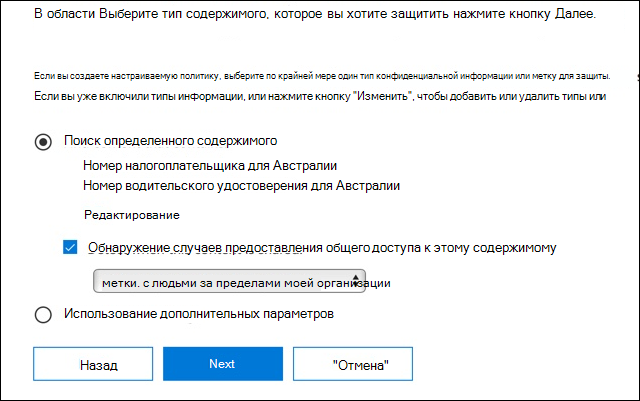
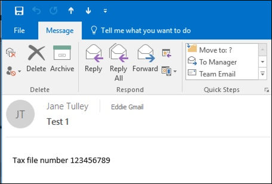
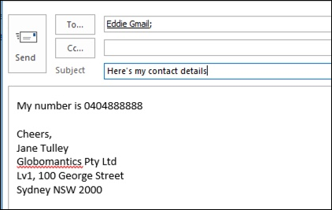

# Создание, тестирование и настройка политики защиты от потери данныхCreate, test, and tune a DLP policy

Предотвращение потери данных (DLP) помогает предотвратить непреднамеренный или случайный обмен конфиденциальной информацией.Data loss prevention (DLP) helps you prevent the unintentional or accidental sharing of sensitive information.

DLP проверяет сообщения электронной почты и файлы для получения конфиденциальной информации, например номер кредитной карты.DLP examines email messages and files for sensitive information, like a credit card number. Используя DLP, вы можете обнаружить конфиденциальную информацию и принять такие меры, как:Using DLP you can detect sensitive information, and take action such as:

- Войти в событие для целей аудитаLog the event for auditing purposes
- Отображение предупреждения конечному пользователю, который отправляет электронное письмо или делится файломDisplay a warning to the end user who is sending the email or sharing the file
- Активно блокировать электронную почту или совместное использование файлов от происходящихActively block the email or file sharing from taking place

## РазрешенияPermissions

Членам группы обеспечения соответствия требованиям, которые будут создавать политики защиты от потери данных, потребуются разрешения для работы в Центре соответствия требованиям.Members of your compliance team who will create DLP policies need permissions to the Compliance Center. По умолчанию администратор-арендатор будет иметь доступ может предоставить сотрудникам по соблюдению нормативных требований и другим людям доступ.By default, your tenant admin will have access can give compliance officers and other people access. Выполните следующие действия.Follow these steps:
  
1. Создайте группу в Microsoft 365 и добавьте в нее сотрудников, ответственных за обеспечение соответствия требованиям.Create a group in Microsoft 365 and add compliance officers to it.
    
2. Создайте группу ролей на странице **Разрешения** в Центре безопасности и соответствия требованиям.Create a role group on the **Permissions** page of the Security &amp; Compliance Center. 

3. При создании ролевой группы используйте **раздел «Выбрать роли»,** чтобы добавить следующую роль в ролевую группу: **Управление соответствием требованиям DLP.**While creating the role group, use the **Choose Roles** section to add the following role to the role group: **DLP Compliance Management**.
    
4. Используйте раздел **Выбор участников**, чтобы добавить созданную ранее группу Microsoft 365 в эту группу ролей.Use the **Choose Members** section to add the Microsoft 365 group you created before to the role group.

Используйте **роль управления соответствием только для просмотра DLP** для создания ролевой группы с привилегиями только для просмотра политик DLP и отчетов DLP.Use the **View-Only DLP Compliance Management** role to create role group with view-only privileges to the DLP policies and DLP reports.

Дополнительные сведения см. в статье [Предоставление пользователям доступа к Центру безопасности и соответствия требованиям Office 365](../security/office-365-security/grant-access-to-the-security-and-compliance-center.md).For more information, see [Give users access to the Office 365 Compliance Center](../security/office-365-security/grant-access-to-the-security-and-compliance-center.md).
  
Эти разрешения необходимы для создания и применения политики DLP для обеспечения соблюдения политик.These permissions are required to create and apply a DLP policy not to enforce policies.

## Как конфиденциальная информация обнаруживается DLPHow sensitive information is detected by DLP

DLP находит конфиденциальную информацию путем регулярного сопоставления шаблонов выражения (RegEx) в сочетании с другими индикаторами, такими как близость некоторых ключевых слов к соответствующим шаблонам.DLP finds sensitive information by regular expression (RegEx) pattern matching, in combination with other indicators such as the proximity of certain keywords to the matching patterns. Например, номер кредитной карты VISA имеет 16 цифр.For example, a VISA credit card number has 16 digits. Но эти цифры могут быть написаны по-разному, такие как 1111-1111-1111-1111, 1111 1111 1111 1111, или 1111111111111111.But, those digits can be written in different ways, such as 1111-1111-1111-1111, 1111 1111 1111 1111, or 1111111111111111.

Любая 16-значная строка не обязательно является номером кредитной карты, это может быть номер билета из системы службы поддержки или серийный номер части оборудования.Any 16-digit string is not necessarily a credit card number, it could be a ticket number from a help desk system, or a serial number of a piece of hardware. Чтобы отличить номер кредитной карты от безобидной 16-значной строки, выполняется расчет (checksum), чтобы подтвердить, что номера соответствуют известному шаблону от различных марок кредитных карт.To tell the difference between a credit card number and a harmless 16-digit string, a calculation is performed (checksum) to confirm that the numbers match a known pattern from the various credit card brands.

Если DLP находит ключевые слова, такие как "VISA" или "AMEX", близкие к значениям даты, которые могут быть датой истечения срока действия кредитной карты, DLP также использует эти данные, чтобы помочь ему решить, является ли строка номером кредитной карты или нет.If DLP finds keywords such as "VISA" or "AMEX", near date values that might be the credit card expiry date, DLP also uses that data to help it decide whether the string is a credit card number or not.

Другими словами, DLP достаточно умен, чтобы распознать разницу между этими двумя строками текста в электронной почте:In other words, DLP is smart enough to recognize the difference between these two strings of text in an email:

- "Можете ли вы заказать мне новый ноутбук."Can you order me a new laptop. Используйте мой номер VISA 1111-1111-1111-1111, срок действия 11/22, и пришлите мне ориентировочную дату доставки, когда она у вас есть».Use my VISA number 1111-1111-1111-1111, expiry 11/22, and send me the estimated delivery date when you have it."
- "Мой серийный номер ноутбука 2222-2222-2222-2222 и он был приобретен 11/2010."My laptop serial number is 2222-2222-2222-2222 and it was purchased on 11/2010. Кстати, моя туристическая виза уже одобрена?»By the way, is my travel visa approved yet?"

Можно [просмотреть определения сущности типа конфиденциальной](sensitive-information-type-entity-definitions.md) информации, которые объясняют, как обнаруживается каждый тип информации.See [Sensitive information type entity definitions](sensitive-information-type-entity-definitions.md) that explains how each information type is detected.

## С чего начать с профилактики потери данныхWhere to start with data loss prevention

Когда риски утечки данных не совсем очевидны, трудно понять, где именно вы должны начать с реализации DLP.When the risks of data leakage aren't entirely obvious, it's difficult to work out where exactly you should start with implementing DLP. К счастью, политики DLP можно запускать в «тестовом режиме», что позволяет оценить их эффективность и точность перед их включить.Fortunately, DLP policies can be run in "test mode", allowing you to gauge their effectiveness and accuracy before you turn them on.

Политиками DLP для Exchange Online можно управлять через Exchange центр.DLP policies for Exchange Online can be managed through the Exchange admin center. Но вы можете настроить политики DLP для всех рабочих нагрузок через Центр & безопасности, так что это то, что я буду использовать для демонстраций в этой статье.But you can configure DLP policies for all workloads through the Security & Compliance Center, so that's what I'll use for demonstrations in this article. В Центре & безопасности вы найдете политики DLP в соответствии с Политикой **предотвращения потери**  >  **данных.**In the Security & Compliance Center, you'll find the DLP policies under **Data loss prevention** > **Policy**. Выберите **Создать политику** для запуска.Choose **Create a policy** to start.

Microsoft 365 предоставляет ряд шаблонов [политики DLP, которые](what-the-dlp-policy-templates-include.md) можно использовать для создания политик.Microsoft 365 provides a range of [DLP policy templates](what-the-dlp-policy-templates-include.md) you can use to create policies. Допустим, вы австралийский бизнес.Let's say that you're an Australian business. Вы можете фильтровать шаблоны по Австралии, а также выбрать финансовые, медицинские и медицинские, и конфиденциальности.You can filter the templates on Australia, and choose Financial, Medical and Health, and Privacy.

Для этой демонстрации я выберу данные австралийской персональной идентифицируемой информации (PII), которые включают в себя информационные типы австралийского номера налогового файла (TFN) и номер водительских прав.For this demonstration I'll choose Australian Personally Identifiable Information (PII) Data, which includes the information types of Australian Tax File Number (TFN) and Driver's License Number.

Назовите свою новую политику DLP.Give your new DLP policy a name. Имя по умолчанию будет соответствовать шаблону политики DLP, но вы должны выбрать более описательное имя самостоятельно, потому что несколько политик могут быть созданы из одного шаблона.The default name will match the DLP policy template, but you should choose a more descriptive name of your own, because multiple policies can be created from the same template.

Выберите места, к которые будет применяться политика.Choose the locations that the policy will apply to. Политики DLP могут применяться к Exchange Online, SharePoint Интернету и OneDrive для бизнеса.DLP policies can apply to Exchange Online, SharePoint Online, and OneDrive for Business. Я собираюсь оставить эту политику настроенной, чтобы применяться ко всем местам.I am going to leave this policy configured to apply to all locations.

На первом **шаге Параметры,** просто принять по умолчанию на данный момент.At the first **Policy Settings** step, just accept the defaults for now. Вы можете настроить политики DLP, но по умолчанию являются прекрасным местом для начала.You can customize DLP policies, but the defaults are a fine place to start.

После нажатия Далее, вы будете представлены с более политики **Параметры** с более параметры настройки.After clicking Next,\*\* you'll be presented with an more **Policy Settings** page with more customization options. Для политики, которую вы только тестируете, вот где вы можете начать вносить некоторые коррективы.For a policy that you are just testing, here's where you can start to make some adjustments.

- Я выключил советы по политике на данный момент, что является разумным шагом, чтобы принять, если вы просто тестирования вещи и не хотят, чтобы показать что-нибудь для пользователей еще.I've turned off policy tips for now, which is a reasonable step to take if you're just testing things out and don't want to display anything to users yet. Советы по политике отображают предупреждения пользователей о том, что они собираются нарушить политику DLP.Policy tips display warnings to users that they're about to violate a DLP policy. Например, пользователь Outlook увидит предупреждение о том, что файл, к которому он прикреплен, содержит номера кредитных карт и приведет к отклонению их электронной почты.For example, an Outlook user will see a warning that the file they've attached contains credit card numbers and will cause their email to be rejected. Цель советов по политике состоит в том, чтобы остановить несовместимые поведение, прежде чем это произойдет.The goal of policy tips is to stop the non-compliant behavior before it happens.
- Я также сократил число экземпляров с 10 до 1, так что эта политика будет обнаружить любой обмен австралийскими данными PII, а не только массовый обмен данными.I've also decreased the number of instances from 10 to 1, so that this policy will detect any sharing of Australian PII data, not just bulk sharing of the data.
- Я также добавил еще одного получателя в отчет об инциденте электронной почты.I've also added another recipient to the incident report email.

Наконец, я настроил эту политику для первоначального запуска в тестовом режиме.Finally, I've configured this policy to run in test mode initially. Обратите внимание, что здесь также есть возможность отключить советы по политике во время тестирования.Notice there's also an option here to disable policy tips while in test mode. Это дает вам возможность использовать советы по политике в политике, но затем решить, показывать или подавлять их во время тестирования.This gives you the flexibility to have policy tips enabled in the policy, but then decide whether to show or suppress them during your testing.

На экране окончательного обзора нажмите **Создайте,** чтобы закончить создание политики.On the final review screen, click **Create** to finish creating the policy.

## Проверка политики DLPTest a DLP policy

Ваша новая политика DLP начнет вступят в силу в течение примерно 1 часа.Your new DLP policy will begin to take effect within about 1 hour. Вы можете сидеть и ждать, пока он будет вызван нормальной активностью пользователя, или вы можете попытаться запустить его самостоятельно.You can sit and wait for it to be triggered by normal user activity, or you can try to trigger it yourself. Ранее я связан с [чувствительной информации типа лица определений](sensitive-information-type-entity-definitions.md), которая предоставляет вам информацию о том, как вызвать DLP матчей.Earlier I linked to [Sensitive information type entity definitions](sensitive-information-type-entity-definitions.md), which provides you with information about how to trigger DLP matches.

Например, политика DLP, созданная для этой статьи, позволит обнаружить австралийские номера налоговых файлов (TFN).As an example, the DLP policy I created for this article will detect Australian tax file numbers (TFN). Согласно документации, матч основан на следующих критериях.According to the documentation, the match is based on the following criteria.

 
Чтобы продемонстрировать обнаружение TFN в довольно тупой манере, электронная почта с словами "Налоговый номер файла" и девятизначная строка в непосредственной близости будет плыть через без каких-либо проблем.To demonstrate TFN detection in a rather blunt manner, an email with the words "Tax file number" and a nine digit string in close proximity will sail through without any issues. Причина, по которой она не запускает политику DLP, заключается в том, что девятизначная строка должна пройти проверку, которая указывает, что она является действительной TFN, а не просто безобидной строкой чисел.The reason it does not trigger the DLP policy is that the nine digit string must pass the checksum that indicates it is a valid TFN and not just a harmless string of numbers.

Для сравнения, электронная почта со словами "Налоговый номер файла" и действительный TFN, который проходит проверку вызовет политику.In comparison, an email with the words "Tax file number" and a valid TFN that passes the checksum will trigger the policy. Для записи здесь, TFN я использую был взят из веб-сайта, который генерирует действительные, но не подлинные, TFNs.For the record here, the TFN I'm using was taken from a website that generates valid, but not genuine, TFNs. Такие сайты полезны, потому что одна из наиболее распространенных ошибок при тестировании политики DLP использует поддельный номер, который не действителен и не пройдет проверку (и, следовательно, не будет инициировать политику).Such sites are useful because one of the most common mistakes when testing a DLP policy is using a fake number that's not valid and won't pass the checksum (and therefore won't trigger the policy).

Электронная почта отчета об инциденте включает тип конфиденциальной информации, которая была обнаружена, сколько случаев было обнаружено, и уровень доверия обнаружения.The incident report email includes the type of sensitive information that was detected, how many instances were detected, and the confidence level of the detection.

Если вы оставите свою политику DLP в тестовом режиме и проанализируете электронную почту отчета об инциденте, вы можете начать чувствовать себя для точности политики DLP и насколько эффективной она будет, когда она будет применяться.If you leave your DLP policy in test mode and analyze the incident report emails, you can start to get a feel for the accuracy of the DLP policy and how effective it will be when it is enforced. В дополнение к отчетам об инцидентах [можно использовать отчеты DLP для](view-the-dlp-reports.md) просмотра агрегированного представления совпадений политики вашего арендатора.In addition to the incident reports, you can [use the DLP reports](view-the-dlp-reports.md) to see an aggregated view of policy matches across your tenant.

## Настройка политики защиты от потери данныхTune a DLP policy

При анализе показов политики может потребоваться внести некоторые коррективы в поведение политик.As you analyze your policy hits, you might want to make some adjustments to how the policies behave. В качестве простого примера можно определить, что один TFN в электронной почте не является проблемой (я думаю, что это все еще есть, но давайте пойдем с ним ради демонстрации), но два или более экземпляров являются проблемой.As a simple example, you might determine that one TFN in an email is not a problem (I think it still is, but let's go with it for the sake of demonstration), but two or more instances are a problem. Несколько экземпляров могут быть рискованным сценарием, таким как сотрудник, ото электронному ех-му экспорту csV из базы данных отдела кадров внешней стороне, например внешней бухгалтерской службе.Multiple instances could be a risky scenario such as an employee emailing a CSV export from the HR database to an external party, for example an external accounting service. Определенно то, что вы предпочли бы обнаружить и заблокировать.Definitely something you would prefer to detect and block.

В Центре соответствия требованиям можно редактировать существующую политику для корректировки поведения.In the Compliance Center you can edit an existing policy to adjust the behavior.

 
Можно настроить параметры местоположения таким образом, чтобы политика применялась только к определенным рабочим нагрузкам или к конкретным сайтам и учетным записям.You can adjust the location settings so that the policy is applied only to specific workloads, or to specific sites and accounts.

Вы также можете настроить параметры политики и редактировать правила, чтобы лучше соответствовать вашим потребностям.You can also adjust the policy settings and edit the rules to better suit your needs.

При редактировании правила в рамках политики DLP можно изменить:When editing a rule within a DLP policy, you can change:

- Условия, включая тип и количество экземпляров конфиденциальных данных, которые будут инициировать правило.The conditions, including the type and number of instances of sensitive data that will trigger the rule.
- Действия, которые принимаются, такие как ограничение доступа к содержимому.The actions that are taken, such as restricting access to the content.
- Уведомления пользователей, которые являются советами по политике, которые отображаются пользователю в их почтовом клиенте или веб-браузере.User notifications, which are policy tips that are displayed to the user in their email client or web browser.
- Пользователь переопределяет определяет, могут ли пользователи выбрать, чтобы продолжить свою электронную почту или файлообмеся в любом случае.User overrides determines whether users can choose to proceed with their email or file sharing anyway.
- Отчеты об инцидентах, чтобы уведомить администраторов.Incident reports, to notify administrators.

Для этой демонстрации я добавил уведомления пользователей в политику (будьте осторожны, делая это без надлежащего обучения осведомленности пользователей), и позволил пользователям переопределить политику с бизнес-обоснованием или пометив ее как ложное срабатывание.For this demonstration I've added user notifications to the policy (be careful of doing this without adequate user awareness training), and allowed users to override the policy with a business justification or by flagging it as a false positive. Вы также можете настроить текст отзыва по электронной почте и политике, если вы хотите включить какую-либо дополнительную информацию о политике вашей организации, или побудить пользователей обратиться в поддержку, если у них есть вопросы.You can also customize the email and policy tip text if you want to include any additional information about your organization's policies, or prompt users to contact support if they have questions.

Политика содержит два правила для обработки большого объема и низкого объема, так что не забудьте редактировать оба с действиями, которые вы хотите.The policy contains two rules for handling of high volume and low volume, so be sure to edit both with the actions that you want. Это возможность по-разному относиться к случаям в зависимости от их характеристик.This is an opportunity to treat cases differently depending on their characteristics. Например, можно разрешить переопределения для нарушений низкого объема, но не допускать переопределения для нарушений большого объема.For example, you might allow overrides for low volume violations, but not allow overrides for high volume violations.

Кроме того, если вы хотите фактически заблокировать или ограничить доступ к содержимому, которое является нарушением политики, необходимо настроить действие на правило, чтобы сделать это.Also, if you want to actually block or restrict access to content that is in violation of policy, you need to configure an action on the rule to do so.

После сохранения этих изменений в настройках политики мне также необходимо вернуться к главной странице настроек политики и включить возможность показывать пользователям советы по политике во время тестирования политики.After saving those changes to the policy settings, I also need to return to the main settings page for the policy and enable the option to show policy tips to users while the policy is in test mode. Это эффективный способ внедрения политик DLP для конечных пользователей и обучения осведомленности пользователей, не рискуя слишком много ложных срабатываний, которые влияют на их производительность.This is an effective way to introduce DLP policies to your end users, and do user awareness training, without risking too many false positives that impact their productivity.

На стороне сервера (или облачной стороне, если вы предпочитаете), изменение не может вступят в силу немедленно, из-за различных интервалов обработки.On the server side (or cloud side if you prefer), the change may not take effect immediately, due to various processing intervals. Если вы внести изменения в политику DLP, которые будут отображать новые советы по политике для пользователя, пользователь не может видеть изменения вступят в силу немедленно в их Outlook клиента, который проверяет изменения политики каждые 24 часа.If you're making a DLP policy change that will display new policy tips to a user, the user may not see the changes take effect immediately in their Outlook client, which checks for policy changes every 24 hours. Если вы хотите ускорить процесс тестирования, вы можете использовать это исправление реестра, [чтобы очистить последнюю марку времени загрузки из ключа PolicyNudges.](https://support.microsoft.com/en-au/help/2823261/changes-to-a-data-loss-prevention-policy-don-t-take-effect-in-outlook?__hstc=18650278.46377037dc0a82baa8a30f0ef07a7b2f.1538687978676.1538693509953.1540315763430.3&__hssc=18650278.1.1540315763430&__hsfp=3446956451)If you want to speed things up for testing, you can use this registry fix to [clear the last download time stamp from the PolicyNudges key](https://support.microsoft.com/en-au/help/2823261/changes-to-a-data-loss-prevention-policy-don-t-take-effect-in-outlook?__hstc=18650278.46377037dc0a82baa8a30f0ef07a7b2f.1538687978676.1538693509953.1540315763430.3&__hssc=18650278.1.1540315763430&__hsfp=3446956451). Outlook загрузит последнюю информацию о политике при следующем перезапуске и начнете составление сообщения электронной почты.Outlook will download the latest policy information the next time you restart it and begin composing an email message.

Если у вас включены советы по политике, пользователь начнет видеть советы в Outlook и может сообщить вам ложные срабатывания, когда они происходят.If you have policy tips enabled, the user will begin to see the tips in Outlook, and can report false positives to you when they occur.

## Расследование ложных срабатыванийInvestigate false positives

Шаблоны политики DLP не являются совершенными прямо из коробки.DLP policy templates are not perfect straight out of the box. Вполне вероятно, что вы обнаружите некоторые ложные срабатывания, происходящие в вашей среде, поэтому так важно облегчить вам путь в развертывание DLP, найдите время, чтобы адекватно протестировать и настроить ваши политики.It's likely that you'll find some false positives occurring in your environment, which is why it's so important to ease your way into a DLP deployment, taking the time to adequately test and tune your policies.

Вот пример ложного срабатывания.Here's an example of a false positive. Это письмо является весьма безвредным.This email is quite harmless. Пользователь предоставляет кому-то свой номер мобильного телефона, включая его электронную подпись.The user is providing their mobile phone number to someone, and including their email signature.

 
Но пользователь видит отзыв политики, предупреждающий их о том, что письмо содержит конфиденциальную информацию, в частности, номер австралийского водительного удостоверения.But the user sees a policy tip warning them that the email contains sensitive information, specifically, an Australian driver's license number.

Пользователь может сообщить о ложном срабатывании, и администратор может узнать, почему это произошло.The user can report the false positive, and the administrator can look into why it has occurred. В сообщении об инциденте электронная почта помечена как ложное срабатывание.In the incident report email, the email is flagged as a false positive.

Это дело водительских прав является хорошим примером, чтобы копаться в.This driver's license case is a good example to dig into. Причина этого ложного срабатывания произошло в том, что "Австралийская лицензия водителя" тип будет вызван любой 9-значный строка (даже тот, который является частью 10-значной строки), в пределах 300 символов близость к ключевым словам "Sydney nsw" (не чувствительный к делу).The reason this false positive has occurred is that the "Australian Driver's License" type will be triggered by any 9-digit string (even one that is part of a 10-digit string), within 300 characters proximity to the keywords "Sydney nsw" (not case sensitive). Так что это вызвано номером телефона и подписью электронной почты, только потому, что пользователь оказывается в Сиднее.So it's triggered by the phone number and email signature, only because the user happens to be in Sydney.

Один из вариантов заключается в удалении австралийского типа информации о водительских правах из полиса.One option is to remove the Australian driver's license information type from the policy. Он там, потому что он является частью шаблона политики DLP, но мы не вынуждены использовать его.It's in there because it's part of the DLP policy template, but we're not forced to use it. Если вас интересуют только номера налоговых файлов, а не водительские права, вы можете просто удалить его.If you're only interested in Tax File Numbers and not driver's licenses, you can just remove it. Например, его можно удалить из правила низкого объема в политике, но оставить в правиле большого объема, чтобы списки нескольких водительских удостоверений все еще были обнаружены.For example, you can remove it from the low volume rule in the policy, but leave it in the high volume rule so that lists of multiple drivers licenses are still detected.
 
Другим вариантом является увеличение количества экземпляров, так что низкий объем водительских удостоверений обнаруживается только при нескольких экземплярах.Another option is to increase the instance count, so that a low volume of driver's licenses is only detected when there are multiple instances.

В дополнение к изменению отсчета экземпляров, вы также можете настроить точность матча (или уровень достоверности).In addition to changing the instance count, you can also adjust the match accuracy (or confidence level). Если тип конфиденциальной информации имеет несколько шаблонов, вы можете настроить точность совпадения в правиле, чтобы правило соответствовало только определенным шаблонам.If your sensitive information type has multiple patterns, you can adjust the match accuracy in your rule, so that your rule matches only specific patterns. Например, чтобы уменьшить ложные срабатывания, можно установить точность совпадения вашего правила так, чтобы оно соответствовало только шаблону с наивысшим уровнем доверия.For example, to help reduce false positives, you can set the match accuracy of your rule so that it matches only the pattern with the highest confidence level. Для получения дополнительной информации об уровнях [доверия, узнайте, как использовать уровень доверия для настройки правил.](data-loss-prevention-policies.md#match-accuracy)For more information on confidence levels, see [How to use confidence level to tune your rules](data-loss-prevention-policies.md#match-accuracy).

Наконец, если вы хотите получить еще немного более продвинутые, вы можете настроить любой тип конфиденциальной информации - например, вы можете удалить "Сидней NSW" из списка ключевых слов для [Австралии водительские права номер](sensitive-information-type-entity-definitions.md#australia-drivers-license-number), чтобы устранить ложноположие срабатывает выше.Finally, if you want to get even a bit more advanced, you can customize any sensitive information type -- for example, you can remove "Sydney NSW" from the list of keywords for [Australia driver's license number](sensitive-information-type-entity-definitions.md#australia-drivers-license-number), to eliminate the false positive triggered above. Чтобы узнать, как это сделать с помощью XML и PowerShell, [см.](customize-a-built-in-sensitive-information-type.md)To learn how to do this by using XML and PowerShell, see [customizing a built-in sensitive information type](customize-a-built-in-sensitive-information-type.md).

## Включите политику DLPTurn on a DLP policy

Когда вы счастливы, что ваша политика DLP точно и эффективно обнаруживает типы конфиденциальной информации, и что конечные пользователи готовы иметь дело с политиками, которые находятся на месте, то вы можете включить политику.When you're happy that your DLP policy is accurately and effectively detecting sensitive information types, and that your end users are ready to deal with the policies being in place, then you can enable the policy.

 
Если вы ждете, когда политика вступят в [силу, Подключение в Центр соответствия требованиям Security & PowerShell](/powershell/exchange/connect-to-scc-powershell) и [запустите cmdlet Get-DlpCompliancePolicy,](/powershell/module/exchange/get-dlpcompliancepolicy) чтобы увидеть DistributionStatus.If you're waiting to see when the policy will take effect, [Connect to Security & Compliance Center PowerShell](/powershell/exchange/connect-to-scc-powershell) and run the [Get-DlpCompliancePolicy cmdlet](/powershell/module/exchange/get-dlpcompliancepolicy) to see the DistributionStatus.

После включив политику DLP, следует провести некоторые заключительные тесты самостоятельно, чтобы убедиться, что ожидаемые действия политики происходят.After turning on the DLP policy, you should run some final tests of your own to make sure that the expected policy actions are occurring. Если вы пытаетесь проверить такие вещи, как данные кредитных карт, Есть веб-сайты в Интернете с информацией о том, как генерировать образец кредитной карты или другой личной информации, которая будет проходить проверки и инициировать ваши политики.If you're trying to test things like credit card data, there are websites online with information on how to generate sample credit card or other personal information that will pass checksums and trigger your policies.

Политики, позволяющие переопределению пользователя, представят эту опцию пользователю как часть наконечника политики.Policies that allow user overrides will present that option to the user as part of the policy tip.

Политики, ограничивающие содержание, представят предупреждение пользователю в качестве части наконечника политики и не позволяют ему отправлять электронное письмо.Policies that restrict content will present the warning to the user as part of the policy tip, and prevent them from sending the email.

## СводкаSummary

Политика предотвращения потери данных полезна для организаций всех типов.Data loss prevention policies are useful for organizations of all types. Тестирование некоторых политик DLP является упражнением низкого риска из-за контроля над такими вещами, как советы по политике, переопределения конечных пользователей и отчеты об инцидентах.Testing some DLP policies is a low risk exercise due to the control you have over things like policy tips, end-user overrides, and incident reports. Вы можете спокойно протестировать некоторые политики DLP, чтобы увидеть, какие типы нарушений уже происходят в вашей организации, а затем разработать политики с низкими ложноположимыми показателями, просвещать пользователей о том, что разрешено и не допускается, а затем раскатать ваши политики DLP в организации.You can quietly test some DLP policies to see what type of violations are already occurring in your organization, and then craft policies with low false positive rates, educate your users on what is allowed and not allowed, and then roll out your DLP policies to the organization.