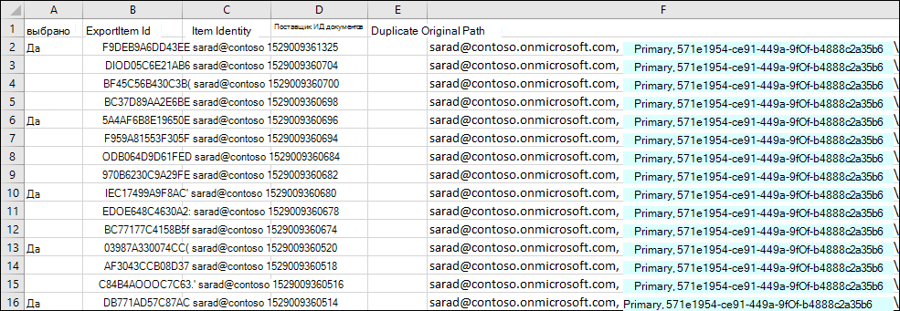
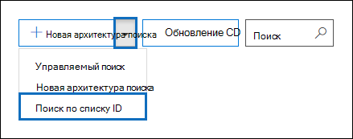

# Подготовка CSV-файла для поиска контента по списку идентификаторовPrepare a CSV file for an ID list Content Search

Вы можете искать определенные сообщения электронной почты и другие элементы почтового ящика, используя список ИД Exchange.You can search for specific mailbox email messages and other mailbox items using a list of Exchange IDs. Чтобы создать поиск в списке идентификаторов (официально называемый целевым поиском), необходимо отправить CSV-файл, в котором указаны конкретные элементы почтового ящика, которые необходимо найти.To create an ID list search (formally called a targeted search), you submit a comma separated value (CSV) file that identifies the specific mailbox items to search for. Для этого CSV-файла  используетсяResults.csv-файл или файл **Items.csv,которые** включаются при экспорте результатов поиска контента или экспорте отчета о поиске контента из существующего и существующего поиска контента.For this CSV file you use the **Results.csv** file or the **Unindexed Items.csv** file that are included when you export the Content Search results or export a Content Search report from and existing Content Search. Затем вы редактируете один из этих файлов, чтобы указать конкретные элементы для поиска, а затем создадите новый поиск в списке ИД и отправьте CSV-файл.Then you edit one of these files to indicate the specific items to search for, and then create a new ID list search and submit the CSV file.

Ниже представлен краткий обзор процесса создания поиска в списке ID.Here's a quick overview of the process for creating an ID list search.

1. Создайте и запустите новый или управляемый поиск контента в Центре & соответствия требованиям.Create and run a new or guided Content Search in the Security & Compliance Center.

2. Экспорт результатов поиска контента или экспорт отчета о поиске контента.Export the content search results or export the content search report. Дополнительные сведения см. в указанных ниже статьях.For more information, see:

    - [Экспорт результатов поиска контентаExport Content Search results](export-search-results.md)

    - [Экспорт отчета о поиске контентаExport a Content Search report](export-a-content-search-report.md)

3. **Отредактируете** Results.csvили **неиndexed Items.csv** и определите конкретные элементы почтового ящика, которые необходимо включить в поиск в списке ID.Edit the **Results.csv** file or the **Unindexed Items.csv** and identify the specific mailbox items that you want to include in the ID list search. См. [инструкции по](#prepare-the-csv-file-for-an-id-list-search) подготовке CSV-файла для поиска в списке ID.See the [instructions](#prepare-the-csv-file-for-an-id-list-search) for preparing a CSV file for an ID list search.

4. Создайте новый поиск по списку ID (см. [инструкции)](#create-an-id-list-search)и отправьте CSV-файл, который вы подготовили.Create a new ID list search (see the [instructions](#create-an-id-list-search)) and submit the CSV file that you prepared. Созданный поисковый запрос будет искать только элементы, выбранные в CSV-файле.The search query that's created will only search for the items selected in the CSV file.

> [!NOTE]
> Поиск в списке ID поддерживается только для элементов почтового ящика.ID list searches are only supported for mailbox items. Вы не можете искать документы SharePoint и OneDrive в поиске по списку ID.You can't search for SharePoint and OneDrive documents in an ID list search.

 **Зачем создавать поиск в списке ID?****Why create an ID list search?** Если вы не можете определить, отвечает ли элемент на запрос на eDiscovery на основе метаданных в файлах **Results.csv** или **Unindexed Items.csv,** вы можете использовать поиск в списке ID, чтобы найти, просмотреть и экспортировать этот элемент, чтобы определить, отвечает ли он на исследуемого дела.If you're unable to determine if an item is responsive to an eDiscovery request based on the metadata in the **Results.csv** or **Unindexed Items.csv** files, you can use an ID list search to find, preview, and then export that item to determine if it's responsive to the case you're investigating. Поиск в списке ID обычно используется для поиска и возврата определенного набора неиndexed элементов.ID list searches are typically used to search for and return a specific set of unindexed items.

## Подготовка CSV-файла для поиска в списке IDPrepare the CSV file for an ID list search

После экспорта результатов поиска или отчета для поиска контента можно выполнить следующие действия, чтобы подготовить CSV-файл для поиска в списке ID.After you export the search results or report for a content search, you can perform the following steps to prepare the CSV file for an ID list search. Этот CSV-файл определяет каждый элемент в поиске в списке ID.This CSV file will identify every item in the ID list search.

Обратите внимание, что вы можете использовать CSV-файл из поиска, включаемую  сайты SharePoint и учетные записи OneDrive, но для поиска в списке ID можно выбрать только элементы почтового ящика.Note that you can use a CSV file from a search that included SharePoint sites and OneDrive accounts, but you can select  *only*  mailbox items for an ID list search. Если вы выберете документ в SharePoint или OneDrive, CSV-файл не пройдет проверку при создании поиска в списке ID.If you select a document in SharePoint or OneDrive, the CSV file will fail validation when you create an ID list search.

1. Откройте файл **Results.csv** **или Items.csv** в Excel.Open the **Results.csv** or **Unindexed Items.csv** file in Excel.

2. В **столбце "Выбранный"** введите **"Да"** в ячейке, соответствующей элементу, который нужно найти.In the **Selected** column, type **Yes** in the cell that corresponds to the item that you want to search for. Повторите этот шаг для каждого элемента, который нужно найти.Repeat this step for every item that you want to search for.

    > [!IMPORTANT]
    > При открываемом CSV-файле в Excel формат данных для столбца **"ИД** документа" меняется на **"Общие".**When you open the CSV file in Excel, the data format for the **Document ID** column is changed to **General**. Это приводит к отобралку ИД документа для элемента в нотации в социуме.This results in displaying the document ID for an item in scientific notation. Например, код документа "481037338205" отображается как "4.81037E+11". Чтобы восстановить правильный формат для ИД  документа, необходимо  выполнить следующие действия, чтобы изменить формат данных столбца "Код документа" на "Номер".For example, the document ID of "481037338205" is displayed as "4.81037E+11" You have to perform the next steps to change the data format of the **Document ID** column to **Number** to restore the correct format for the document ID. Если этого не сделать, поиск в списке ID, использующий CSV-файл, не удастся.If you don't do this, the ID list search that uses the CSV file will fail.

3. Щелкните правой кнопкой мыши весь **столбец "ИД документа"** и выберите **"Формат ячеек".**Right-click the entire **Document ID** column and select **Format Cells**.

4. В поле **"Категория"** щелкните **"Номер".**In the **Category** box, click **Number**.

5. Измените число десятичных заметок на **0** и нажмите кнопку **"ОК",** чтобы сохранить изменения.Change the number of decimal places to **0**, and then click **OK** to save your changes. Обратите внимание, что значения в столбце "ИД документа" изменены на числа.Notice that the values in the Document ID column are changed to numbers.

    Вот пример CSV-файла, который готов к отправке для поиска контента в списке ID.Here's an example of the a CSV file that's ready to be submitted for a ID list content search.

    

6. Сохраните CSV-файл или используйте "Сохранить **как"** для сохранения файла с другим именем.Save the CSV file or use **Save As** to the save the file with different file name. В обоих случаях сохраните файл в формате CSV.In both cases, be sure to save the file with the CSV format.

## Создание поиска в списке IDCreate an ID list search

Следующим шагом является создание нового списка ID Content Search и отправка CSV-файла, подготовленного на предыдущем шаге.The next step is to create a new ID list Content Search and submit the CSV file that you prepared in the previous step.

> [!IMPORTANT]
> Поиск по списку ID следует создавать не более чем через 2 дня после экспорта результатов или отчетов из поиска контента.You should create an ID list search no more than 2 days after exporting the results or report from a Content Search. Если результаты поиска или отчет, экспорт которых был экспортируется более 2 дней назад, следует повторно экспортировать результаты поиска или отчет для создания обновленных CSV-файлов.If the search results or report where exported more than 2 days ago, you should re-export the search results or report to generate updated CSV files. Затем можно подготовить один из обновленных CSV-файлов и использовать его для создания поиска в списке ID.Then you can prepare one of the updated CSV files and use it to create an ID list search.

1. В Центре безопасности & соответствия требованиям перейдите к **поиску** \> **контента поиска.**In the Security & Compliance Center, go to **Search** \> **Content search**.

2. На странице **поиска щелкните** стрелку рядом со значком "Добавить новый поиск" и выберите "Поиск   **списку ID".**On the **Search** page, click the arrow next to  **New search**, and then click **Search by ID List**.

    

3. Во **flyout search by ID List** name the search (and optionally describe it) and then click **Browse** and select the CSV file that you prepared in the previous step.On the **Search by ID List** flyout, name the search (and optionally describe it) and then click **Browse** and select the CSV file that you prepared in the previous step.

    Microsoft 365 пытается проверить CSV-файл.Microsoft 365 attempts to validate the CSV file. Если проверка неуспешна, отображается сообщение об ошибке, которое может помочь устранить ошибки проверки.If the validation is unsuccessful, an error message is displayed that might help you troubleshoot the validation errors. Чтобы создать поиск в списке ID, необходимо успешно проверить CSV-файл.The CSV file has to be successfully validated to create an ID list search.

4. После успешной проверки CSV-файла нажмите кнопку **"Поиск",** чтобы создать поиск в списке ID.After the CSV file is successfully validated, click **Search** to create the ID list search.

    Ниже приводится пример предполагаемых результатов поиска и запроса, сгенерированного для поиска в списке ID.Here's an example of the estimated search results and the query that's generated for an ID list search.

    

    Обратите внимание, что число предполагаемых элементов, отображаемого в статистике для поиска по ИД, должно соответствовать количеству элементов, выбранных в CSV-файле.Note that the number of estimated items displayed in statistics for the ID search should match the number of items that you selected in the CSV file.

5. Предварительный просмотр или экспорт элементов, возвращенных при поиске в списке ID.Preview or export the items returned by the ID list search.

> [!NOTE]
> Если почтовый ящик перемещается после создания поиска в списке ID, запрос на поиск не возвращает указанные элементы.If you move a mailbox after creating an ID list search, the query for the search won't return the specified items. Это происходит потому, что свойство **DocumentId** для элементов почтового ящика меняется при перемещении почтового ящика.That's because the **DocumentId** property for mailbox items are changed when a mailbox is moved. В редких случаях, когда почтовый ящик перемещается после создания поиска в списке ID, необходимо создать новый поиск контента (или обновить результаты поиска для существующего поиска контента), а затем экспортировать результаты поиска или отчет для создания обновленных CSV-файлов, которые можно использовать для создания нового поиска в списке ID.In the rare instance when a mailbox is moved after you create an ID list search, you should create a new content search (or update the search results for the existing content search) and then export the search results or report to generate updated CSV files that can be used to create a new ID list search.
