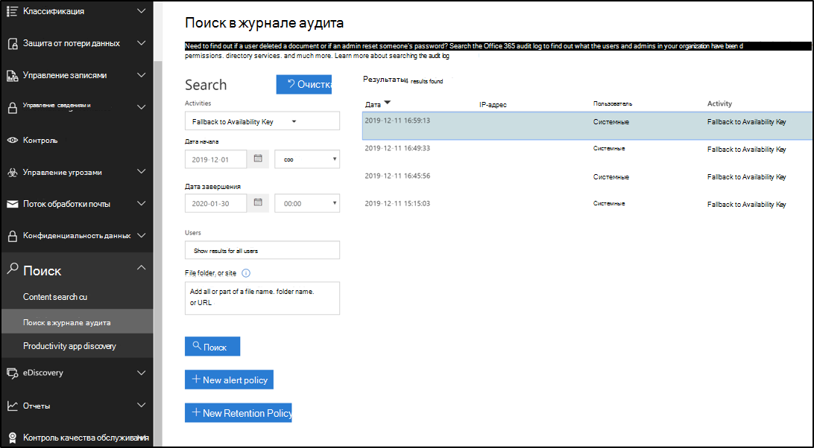
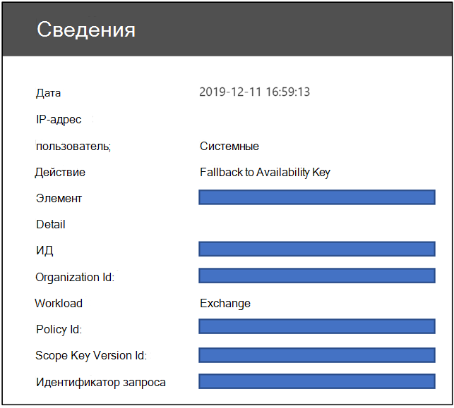

# Сведения о ключе доступности для ключа клиента

Ключ доступности — это корневой ключ, автоматически создаваемый и подготовленный при создании политики шифрования данных. Microsoft 365 сохраняет и защищает ключ доступности. Ключ доступности функционально аналогичен двум корневым ключам, которые вы указали для шифрования службы с помощью ключа клиента. Ключ доступности включает в себя перенос ключей на один уровень ниже в иерархии ключей. В отличие от ключей, предоставляемых и управляемых в Azure Key Vault, вы не можете напрямую получить доступ к ключу доступности. Автоматизированные службы Microsoft 365 управляют ключом доступности программным путем. Эти службы инициируют автоматические операции, которые никогда не задействуют прямой доступ к ключу доступности.

Основная цель ключа доступности заключается в предоставлении возможности восстановления от непредвиденного потери корневых ключей, которыми вы управляете. Потеря может быть следствием неправильного управления или вредоносных действий. Если вы потеряли контроль над корневыми ключами, обратитесь в службу поддержки Майкрософт, а Майкрософт поможет вам выполнить процесс восстановления с помощью ключа доступности. Ключ доступности используется для перехода на новую политику шифрования данных с новыми корневыми ключами, которые вы предоставиме.

Хранение и контроль ключа доступности, как это сделано, отличается от ключей Azure Key Vault по трем причинам:

- Ключ доступности обеспечивает возможность восстановления, "разбивки на стекла", если управление ключами Azure Key Vault теряется.
- Разделение логических элементов управления и защищенные места хранения обеспечивают глубокую защиту и защищает от потери всех ключей и данных от одной атаки или точки отказа.
- Ключ доступности предоставляет возможность высокого уровня доступности, если службы Microsoft 365 не могут получить доступ к ключам, размещенным в Azure Key Vault из-за временных ошибок. Это правило применяется только к службе шифрования Exchange Online и Skype для бизнеса. Файлы SharePoint Online, OneDrive для бизнеса и Teams никогда не используют ключ доступности, если вы явно не укажете корпорации Майкрософт начать процесс восстановления.

Совместное использование полномочий для защиты данных с помощью различных средств защиты и процессов для управления ключами, в конечном итоге уменьшает риск потери или уничтожения всех ключей (и, следовательно, данных). Корпорация Майкрософт предоставляет единственный контроль за невозможность или уничтожение ключа доступности при выходе из службы. По дизайну никто из Майкрософт не имеет доступа к ключу доступности: он доступен только для кода службы Microsoft 365.

Дополнительные сведения о ключах безопасности можно найти в [центре управления безопасностью Майкрософт](https://www.microsoft.com/trustcenter/Privacy/govt-requests-for-data) .
  
## Ключ доступности использует

Ключ доступности обеспечивает возможность восстановления для сценариев, в которых внешняя малефактор или вредоносная функция, которая позволяет злоумышленнику получить контроль над вашим ключевыми сведениями, или при непреднамеренном неправильном управлении приводить к потере корневых ключей. Эта возможность восстановления применяется ко всем службам Microsoft 365, совместимым с ключом клиента. Отдельные службы используют ключ доступности по-разному. Microsoft 365 использует ключ доступности только в соответствии с описанными ниже способами.

### Использование Exchange Online и Skype для бизнеса

В дополнение к возможностям восстановления, Exchange Online и Skype для бизнеса используют ключ доступности для обеспечения доступности данных во время временной или периодически работающей операционной системы, связанной со службой, обращающейся к корневым ключам. Если служба не может связаться ни с одним из ключей клиента в Azure Key Vault из-за временных ошибок, служба автоматически использует ключ доступности. Служба никогда не передается непосредственно в ключ доступности.

Автоматические системы в Exchange Online и Skype для бизнеса могут использовать ключ доступности во время временных ошибок для поддержки автоматических внутренних служб, таких как защита от вирусов, обнаружения вирусов, защита от потери данных, перемещение почтовых ящиков и индексирование данных.

### Использование файлов SharePoint Online, OneDrive для бизнеса и Teams

Для файлов SharePoint Online, OneDrive для бизнеса и Teams ключ доступности никогда не используется за пределами возможности восстановления, и клиенты должны явным образом сообщить корпорации Майкрософт о необходимости инициировать использование ключа доступности во время сценария восстановления. Автоматизированные операции службы основываются только на ключах клиентов в Azure Key Vault. Для получения подробных сведений о том, как иерархия ключей работает для этих служб, посмотрите, [как SharePoint Online, OneDrive для бизнеса и файлы Teams используют ключ доступности](#how-sharepoint-online-onedrive-for-business-and-teams-files-use-the-availability-key).

## Безопасность ключей доступности

Корпорация Майкрософт разделяет ответственность за защиту данных с помощью создания экземпляра ключа доступности и получения значительных мер для ее защиты. Корпорация Майкрософт не предоставляет клиентам прямой контроль над ключом доступности. Например, можно выполнить только сведение (поворот) ключей, которыми вы владеете в Azure Key Vault. Для получения дополнительных сведений ознакомьтесь [с разделом или поворачивайте ключ клиента или ключ доступности](customer-key-availability-key-roll.md).

### Секретные хранилища ключей доступности

Майкрософт обеспечивает защиту ключей доступности в контролируемом доступе, внутренним хранилищах, таких как клиентский Azure Key Vault. Мы реализуем элементы управления доступом, чтобы предотвратить прямой доступ администраторов Майкрософт к секреты, которые находятся в. Операции с секретным хранилищем, включая поворот и удаление ключа, происходят через автоматизированные команды, которые никогда не обращаются к ключу доступности напрямую. Операции управления хранением в секрете ограничены определенными специалистами и требуют укрупнения прав через внутреннее средство, защищенное хранилище. Эскалация прав требует утверждения и обоснования руководителя перед предоставлением. Защищенное хранилище обеспечивает ограниченный доступ к времени доступа с помощью автоматического отзыва доступа после истечения срока действия или завершения инженерного выхода.

Ключи доступности **Exchange Online и Skype для бизнеса** хранятся в секретном хранилище Active Directory в Exchange Online. Ключи доступности безопасно хранятся в отдельных контейнерах клиента на контроллере домена Active Directory. Это безопасное место хранения является отдельным и изолированным из облачного хранилища SharePoint Online, OneDrive для бизнеса и файлов Teams.

Ключи доступности **файлов SharePoint Online, OneDrive для бизнеса и Teams** хранятся во внутреннем секретном хранилище, управляемом группой обслуживания. Защищенная, Секретная служба хранения содержит серверы переднего плана с конечными точками приложений и базой данных SQL в качестве серверной части. Ключи доступности хранятся в базе данных SQL и упаковываются (шифруются) ключами шифрования банка, которые используют сочетание AES-256 и HMAC для шифрования ключа доступности в REST. Ключи шифрования для секретного хранилища хранятся в логически изолированном компоненте той же базы данных SQL и дополнительно шифруются с помощью ключей RSA-2048, которые содержатся в сертификатах, управляемых центром сертификации (ЦС) Майкрософт. Эти сертификаты хранятся на серверах переднего плана банка, которые выполняют операции с базой данных.

### Глубокая защита

Корпорация Майкрософт использует стратегию защиты от несанкционированного доступа, чтобы предотвратить влияние вредоносных субъектов на конфиденциальность, целостность или доступность данных клиентов, хранящихся в облаке Майкрософт. Для защиты секретного хранилища и ключа доступности в рамках стратегии безопасности с перегрузкой применяются определенные профилактическые элементы управления и элементы управления обнаруживающее.

Microsoft 365 создана для предотвращения неправильного использования ключа доступности. Уровень приложений — единственный способ, с помощью которого можно шифровать и расшифровывать данные с помощью ключей, включая ключ доступности. Только код службы Microsoft 365 может интерпретировать и просматривать ключевую иерархию для действий шифрования и расшифровки. Существует логическая изоляция между местами хранения ключей клиентов, ключей доступности, другими иерархическими ключами и данными клиентов. Такая изоляция снижает риск риска потери данных в случае нарушения безопасности одного или нескольких расположений. Каждый слой в иерархии содержит Круглосуточная возможность обнаружения вторжений для защиты конфиденциальных данных и конфиденциальных данных.

Элементы управления доступом реализуются для предотвращения несанкционированного доступа к внутренним системам, в том числе хранилищ секретных ключей доступности. У инженеров Майкрософт нет прямого доступа к секретным хранилищам ключей доступности. Для получения дополнительных сведений об элементах управления доступом просмотрите [элементы управления административным доступом в Microsoft 365](https://docs.microsoft.com/Office365/securitycompliance/office-365-administrative-access-controls-overview).

Технические элементы управления предотвращают вход сотрудников Майкрософт в учетные записи с повышенными привилегиями, которые могут быть использованы злоумышленниками для олицетворения служб Майкрософт. Например, эти элементы управления запрещают интерактивный вход.

Элементы управления ведения журнала и мониторинга безопасности — это еще одна глубокая защита, которая позволяет снизить риск для служб Майкрософт и данных. Microsoft Service Teams развернула активные решения мониторинга, которые создают оповещения и журналы аудита. Все сервисные группы отправляют свои журналы в центральный репозиторий, в котором журналы объединяются и обрабатываются. Внутренние средства автоматически проверяют записи, чтобы убедиться, что службы работают в оптимальном, надежном и безопасном состоянии. Необычные действия помечаются для дальнейшей проверки.

Любое событие в журнале, которое указывает на потенциальное нарушение политики безопасности Майкрософт, немедленно передается на интересующие вас команды Microsoft Security Teams. Microsoft 365 Security настроила оповещения для обнаружения попытки доступа к секретным хранилищам ключей доступности. Кроме того, оповещения создаются, если сотрудники Майкрософт пытаются интерактивно войти в учетные записи служб, что запрещено и защищено средствами управления доступом. Microsoft 365 Security также обнаруживает и оповещает об отклонениях службы Microsoft 365 от обычных базовых операций. Малефакторс попытка использования неправильного использования служб Microsoft 365 приводит к срабатыванию оповещений, которые приводят к вытеснению нежелательной стороны из облачной среды Майкрософт.

## Использование ключа доступности для восстановления после потери ключа

Если вы потеряли возможности управления ключами клиентов, ключ доступности позволяет восстановить и повторно зашифровать данные.

### Процедура восстановления для Exchange Online и Skype для бизнеса

Если вы потеряете контроль над ключами клиентов, ключ доступности предоставляет возможность восстановления данных и переводит затронутые ресурсы Microsoft 365 обратно в оперативный режим. Ключ доступности продолжает защищать ваши данные при восстановлении. На высоком уровне, чтобы полностью восстановиться после потери ключа, вам потребуется создать новую функцию DEP и переместить затронутые ресурсы в новую политику.

Чтобы зашифровать данные с помощью новых ключей клиентов, создайте новые ключи в Azure Key Vault, создайте новую функцию DEP с помощью новых ключей клиентов, а затем назначьте новую функцию DEP почтовым ящикам, которые в настоящее время зашифрованы с помощью функции DEP, для которых были утрачены или скомпрометированы ключи.

Этот процесс повторного шифрования может занять до 72 часов. Это стандартная длительность изменения функции DEP.
  
### Процедура восстановления для файлов SharePoint Online, OneDrive для бизнеса и Teams

Для SharePoint Online, OneDrive для бизнеса и файлов Teams ключ доступности никогда не используется за пределами возможности восстановления. Необходимо явным образом сообщить корпорации Майкрософт о необходимости инициировать использование ключа доступности во время сценария восстановления. Чтобы начать процесс восстановления, обратитесь в корпорацию Майкрософт, чтобы активировать ключ доступности. После активации ключ доступности автоматически используется для расшифровки данных с возможностью шифрования данных с помощью вновь созданной функции DEP, связанной с новыми ключами клиентов.  

Эта операция пропорциональна количеству сайтов в Организации. Когда вы звоните в корпорацию Майкрософт, чтобы использовать ключ доступности, вы должны быть полностью подключены примерно в течение четырех часов.

## Использование ключа доступности в Exchange Online и Skype для бизнеса

При создании функции DEP с помощью ключа клиента Microsoft 365 создает ключ политики шифрования данных (ключ DEP), связанный с этой функцией предотвращения выполнения данных. Служба шифрует ключ DEP три раза: один раз с каждым из ключей клиента и один раз с ключом доступности. Хранятся только зашифрованные версии ключа DEP, а ключ DEP можно расшифровать только с помощью ключей клиента или доступности. Затем ключ DEP используется для шифрования ключей почтовых ящиков, которые шифруют отдельные почтовые ящики.
  
Microsoft 365 использует эту процедуру для расшифровки и предоставления данных, когда клиенты используют службу:
  
1. Расшифровать ключ DEP с помощью ключа клиента.

2. Используйте расшифрованную клавишу DEP для расшифровки ключа почтового ящика.

3. Используйте расшифрованный ключ для почтового ящика, чтобы расшифровать сам почтовый ящик, позволяя получить доступ к данным в почтовом ящике.

## Как SharePoint Online, OneDrive для бизнеса и файлы Teams используют ключ доступности

Архитектура SharePoint Online и OneDrive для бизнеса и реализация ключа клиента и ключа доступности отличаются от Exchange Online и Skype для бизнеса.
  
Когда Организация перемещается на управляемые пользователем ключи, Microsoft 365 создает промежуточный ключ, зависящий от Организации (тик). Microsoft 365 шифрует тик дважды, один раз с каждым из ключей клиента и сохраняет две зашифрованные версии тик. Хранятся только зашифрованные версии тик, и тик можно расшифровать только с помощью ключей клиентов. Затем Тик используется для шифрования ключей сайта, которые затем используются для шифрования ключей больших двоичных объектов (также называемых ключами фрагментов файлов). В зависимости от размера файла служба может разделить файл на несколько фрагментов файлов с уникальным ключом. Сами большие двоичные объекты (блоки файлов) шифруются с помощью ключей больших двоичных объектов и хранятся в службе хранилища больших двоичных объектов Microsoft Azure.
  
Microsoft 365 использует эту процедуру для расшифровки и предоставления файлов клиентов при использовании службы клиентами:

1. Расшифровать тик с помощью ключа клиента.

2. Используйте расшифрованную тик для расшифровки ключа сайта.

3. Используйте расшифрованный ключ сайта для расшифровки ключа большого двоичного объекта.

4. Используйте расшифрованный ключ BLOB, чтобы расшифровать большой двоичный объект.

Microsoft 365 расшифровывает тик, выдавая два запроса на расшифровку в хранилище ключей Azure с небольшим смещением. Первый из них, для которого завершается результат, отменяющий другой запрос.
  
Если вы потеряли доступ к ключам клиента, Microsoft 365 также шифрует тик с помощью ключа доступности и сохраняет его вместе с ТИКС, зашифрованным с каждым ключом клиента. Тик, зашифрованный с помощью ключа доступности, используется только в том случае, если клиент обращается в корпорацию Майкрософт, чтобы прикрепить путь восстановления, когда он потеряет доступ к их ключам, злонамеренно или случайно.
  
В целях обеспечения доступности и масштабирования расшифрованные ТИКС кэшируются в кэше памяти с ограниченным временем. На два часа до истечения срока действия кэша тик Microsoft 365 пытается расшифровать каждую тик. Расшифровка ТИКС увеличивает время существования кэша. Если не удается выполнить расшифровку тик в течение значительного периода времени, Microsoft 365 создает оповещение о проектировании до истечения срока действия кэша. Только если клиент звонит в корпорацию Майкрософт, то Microsoft 365 инициирует операцию восстановления, которая включает в себя расшифровку тик с помощью ключа доступности, хранящегося в тайном банке корпорации Майкрософт и последующего подключения клиента, с помощью расшифрованного тик и нового набора ключей Azure Key Vault.
  
На сегодняшний день ключ клиента участвует в цепочке шифрования и расшифровки данных файлов SharePoint Online, хранящихся в хранилище больших двоичных объектов Azure, но не в SharePoint Online элементы списка или метаданные, хранящиеся в базе данных SQL. В Microsoft 365 не используется ключ доступности для Exchange Online, Skype для бизнеса, SharePoint Online, OneDrive для бизнеса и файлов Teams, кроме описанного выше варианта, который инициируется клиентом. Доступ людей к данным клиентов защищается с помощью защищенного хранилища клиента.

## Триггеры ключей доступности

Microsoft 365 активирует ключ доступности только в определенных обстоятельствах. Эти обстоятельства отличаются службой.

### Триггеры для Exchange Online и Skype для бизнеса
  
1. Microsoft 365 считывает компонент DEP, к которому назначен почтовый ящик, чтобы определить расположение двух ключей клиентов в Azure Key Vault.

2. Microsoft 365 случайным образом выбирает один из двух ключей клиентов из DEP и отправляет запрос в Azure Key Vault для распаковки ключа DEP с помощью ключа клиента.

3. Если запрос на распаковку ключа DEP с помощью ключа клиента завершается с ошибкой, Microsoft 365 отправляет второй запрос в Azure Key Vault, на этот раз предписывает ему использовать альтернативный (второй) ключ клиента.

4. Если второй запрос для распаковки ключа DEP с помощью ключа клиента завершается сбоем, Microsoft 365 проверяет результаты обоих запросов.

    - Если исследование определяет, что запросы не удалось возвращать системную ошибку:

       - Microsoft 365 запускает ключ доступности для расшифровки ключа DEP.

       - После этого Microsoft 365 использует ключ DEP для расшифровки ключа почтового ящика и выполнения запроса пользователя. 

       - В этом случае Azure Key Vault либо не может ответить, либо недостижим из-за временной ошибки.

    - Если исследование определяет, что запросы с ошибками доступа не возвращаются:

       - Это означает, что вы предприняли намеренное, непреднамеренное или вредоносное действие для отображения ключей клиентов, которые недоступны (например, во время очистки данных в процессе выхода из службы).

       - В этом случае ключ доступности будет использоваться только для системных действий, а не для действий пользователя, запрос пользователя завершится с ошибкой, и пользователь получит сообщение об ошибке.

>[!IMPORTANT]
>В программе Microsoft 365 Service Code всегда есть действительный маркер входа для получения информации о клиентах, позволяющий добавить облачные службы. Таким образом, пока ключ доступности не будет удален, его можно использовать в качестве резервного для действий, инициированных или внутренних для Exchange Online и Skype для бизнеса, таких как создание индекса поиска или перемещение почтовых ящиков. Это относится как к временным ОШИБКАм, так и к запросам ОТКАЗа в ДОСТУПе к Azure Key Vault.

### Триггеры для файлов SharePoint Online, OneDrive для бизнеса и Teams

Для файлов SharePoint Online, OneDrive для бизнеса и Teams ключ доступности никогда не используется за пределами возможности восстановления, и клиенты должны явным образом сообщить корпорации Майкрософт о необходимости инициировать использование ключа доступности во время сценария восстановления.

## Журналы аудита и ключ доступности

Автоматизированные системы в Microsoft 365 обрабатывают все данные, которые передаются через систему для предоставления облачных служб, например, защита от вирусов, обнаружения вирусов, защиты от потери данных и индексирования данных. Microsoft 365 не создает видимых для пользователя журналов для этого действия. Кроме того, сотрудники Майкрософт не получают доступ к данным в рамках этих обычных системных операций.

### Ведение журнала ключей доступности в Exchange Online и Skype для бизнеса

Когда Exchange Online и Skype для бизнеса обращаются к ключу доступности для предоставления услуг, Microsoft 365 публикует доступные для клиентов журналы из центра безопасности и соответствия требованиям. Запись журнала аудита для операции с ключом доступности создается каждый раз, когда служба использует ключ доступности. Новый тип записи с именем "шифрование службы ключа клиента" с типом действия "резервное значение для ключа доступности" позволяет администраторам фильтровать результаты поиска по [единому журналу аудита](https://docs.microsoft.com/microsoft-365/compliance/search-the-audit-log-in-security-and-compliance) для просмотра записей ключей доступности.

Записи журнала включают такие атрибуты, как дата, время, действия, идентификатор организации и идентификатор политики шифрования данных. Запись доступна как часть журналов единого аудита и доступна на вкладке Поиск в журнале & безопасности центра соответствия требованиям.

Записи ключей доступности для Exchange Online и Skype для бизнеса используют [общую схему](https://docs.microsoft.com/office/office-365-management-api/office-365-management-activity-api-schema#common-schema) действий управления Office 365 с добавленными пользовательскими параметрами: идентификатор политики, идентификатор версии ключа области и идентификатор запроса.

### Ведение журнала ключей доступности для SharePoint Online, OneDrive для бизнеса и файлов Teams

Ведение журнала ключа доступности для этих служб пока недоступно. Для SharePoint Online, OneDrive для бизнеса и файлов Teams ключ доступности активируется только корпорацией Майкрософт, когда вы указали его в целях восстановления. В результате вы уже знаете каждое событие, в котором ключ доступности используется для этих служб.

## Ключ доступности в иерархии ключей клиентов
  
Microsoft 365 использует ключ доступности, чтобы заключить уровень ключей в нижнюю иерархию ключей, установленную для шифрования службы клиентских ключей. Между службами существует несколько ключевых иерархий. Ключевые алгоритмы также отличаются между ключами доступности и другими ключами в иерархии каждой соответствующей службы. Ниже приведены алгоритмы использования ключей доступности, используемые различными службами.

- Ключи доступности Exchange Online и Skype для бизнеса используют AES-256.

- Ключи доступности файлов SharePoint Online, OneDrive для бизнеса и Teams используют RSA-2048.

### Шифры шифрования, используемые для шифрования ключей в Exchange Online и Skype для бизнеса

### Шифры шифрования, используемые для шифрования ключей для SharePoint Online и OneDrive для бизнеса

## Связанные статьи

- [Шифрование службы с помощью ключа клиента](customer-key-overview.md)

- [Настройка ключа клиента](customer-key-set-up.md)

- [Управление ключом клиента](customer-key-manage.md)

- [Смена или ротация ключа клиента или ключа доступности](customer-key-availability-key-roll.md)
