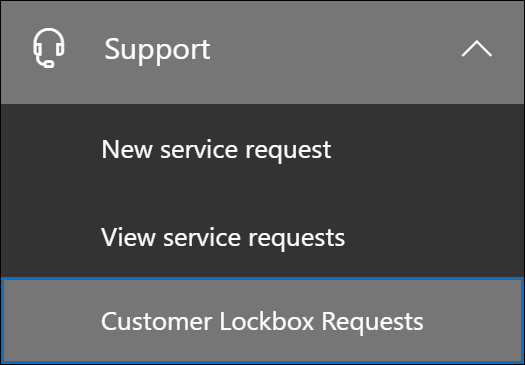

# Защищенное хранилище для клиентов в Office 365

В этой статье представлены рекомендации по развертыванию и настройке для защищенного хранилища клиентов. Служба защищенного хранилища поддерживает запросы на доступ к данным в Exchange Online, SharePoint Online и OneDrive для бизнеса. Чтобы рекомендовать поддержку других служб, отправьте запрос в [Office 365 UserVoice](https://office365.uservoice.com/).

Чтобы ознакомиться с возможностями лицензирования пользователей с помощью рекомендаций по обеспечению соответствия требованиям Microsoft 365, включая эту статью, начиная с 1 апреля 2020 г., ознакомьтесь с [рекомендациями по лицензированию & соответствия требованиям для лицензирования microsoft 365](https://aka.ms/ComplianceSD).

Защищенный доступ клиентов гарантирует, что корпорация Майкрософт не сможет получить доступ к контенту, чтобы выполнить операцию службы без явного утверждения. Для получения доступа к контенту пользователь защищенного хранилища помещает вас в рабочий процесс утверждения.

Иногда специалисты Майкрософт помогают диагностировать и устранять проблемы, обнаруженные клиентами в процессе поддержки. Как правило, проблемы решаются с помощью расширенных средств телеметрии и средств отладки, которые корпорация Майкрософт размещает для своих служб. Однако в некоторых случаях требуется инженер Майкрософт для доступа к содержимому клиента, чтобы определить основную причину и устранить проблему. Для защищенного хранилища клиента требуется, чтобы специалист запрашивал доступ у клиента как конечный этап рабочего процесса утверждения. Это дает организациям возможность утверждать или отклонять эти запросы, а также предоставлять клиенту возможность управлять прямым доступом.

### Видео с обзором защищенного хранилища

> [!VIDEO https://www.microsoft.com/videoplayer/embed/8fecf10b-1f03-4849-8b67-76d3d2a43f26?autoplay=false]

## Рабочий процесс защищенного хранилища

В следующих шагах описывается типичный рабочий процесс, когда инженер Майкрософт инициирует запрос на защищенный клиентский запрос.

1. Кто-то в Организации испытывает неисправность своего почтового ящика Microsoft 365.

2. После того как пользователь устранит проблему, но не сможет ее исправить, он откроет запрос в службу поддержки Майкрософт.

3. Специалист службы поддержки Майкрософт просматривает запрос на обслуживание и определяет необходимость доступа к клиенту Организации для устранения этой ошибки в Exchange Online.

4. Специалист службы поддержки Майкрософт выполняет вход в средство запроса защищенного хранилища и создает запрос на доступ к данным, включающий имя клиента организации, номер запроса на обслуживание и предполагаемое время, в течение которого специалисту требуется доступ к данным.

5. После того как руководитель службы поддержки Майкрософт утвердит запрос, он отправляет назначенному утверждающему пользователю уведомление по электронной почте о запросе на получение доступа от Майкрософт.

    

   Пользователи, которым назначена роль администратора " [утверждающий доступ к защищенному доступу клиентов](https://docs.microsoft.com/office365/admin/add-users/about-admin-roles) " в центре администрирования Microsoft 365, могут утверждать запросы на доступ к защищенному хранилище.

6. Утверждающий подписывается в центр администрирования Microsoft 365 и утверждает запрос. На этом этапе запускается создание записи аудита, которая доступна в журнале аудита. Дополнительные [сведения см.](#auditing-customer-lockbox-requests)

   Если клиент отклоняет запрос или не утверждает запрос в течение 12 часов, срок действия запроса истечет, и доступ к инженеру Майкрософт не предоставляется.

   > [!IMPORTANT]
   > Корпорация Майкрософт не включает ссылки в уведомлениях по электронной почте для защищенного хранилища, требующие входа в Office 365.

7. После того, как утверждающий из Организации утвердит запрос, инженер Майкрософт получает сообщение об утверждении, регистрирует его в Exchange Online и устраняет проблему пользователя. У инженеров Майкрософт есть запрошенная продолжительность для устранения проблемы, после которой доступ автоматически отзывается.

> [!NOTE]
> Все действия, выполняемые инженером Майкрософт, записываются в журнал аудита. Вы можете искать и просматривать эти записи аудита.

## Включение и выключение запросов на защищенное хранилище для клиентов

Вы можете включить элементы управления защищенным хранилищем в центре администрирования Microsoft 365. При включении защищенного почтового ящика Корпорация Майкрософт должна получить сведения об утверждении вашей организации, прежде чем получать доступ к контенту клиента.

1. С помощью рабочей или учебной учетной записи, которой назначены роли "Глобальный администратор" или " **утверждающий доступ к защищенному доступу клиентов** ", перейдите на [https://admin.microsoft.com](https://admin.microsoft.com) страницу и войдите в нее.

2. Выберите **параметры > безопасность & конфиденциальность**.

    

3. На плитке **защищенного хранилища клиента** нажмите кнопку **изменить**, а затем переместите переключатель в положение **включено** или **отключено** , чтобы включить или отключить эту функцию.

    

## Утверждение или отклонение запроса на доступ к защищенному хранилище клиентов

1. С помощью рабочей или учебной учетной записи, которой назначены роли "Глобальный администратор" или " **утверждающий доступ к защищенному доступу клиентов** ", перейдите на [https://admin.microsoft.com](https://admin.microsoft.com) страницу и войдите в нее.

2. Выберите **поддержка > клиентские запросы на защищенное хранилище**.

    

    Отображается список запросов на доступ к защищенному хранилище клиентов.

    

3. Выберите запрос на доступ к защищенному хранилище клиентов, а затем нажмите кнопку **утвердить** или **отклонить**.

    

    Отобразится сообщение подтверждения об утверждении запроса на доступ к защищенному доступу клиентов.

    

## Аудит запросов к защищенному хранилище клиентов

Записи аудита, соответствующие запросам хранилища клиентов, записываются в журнал аудита. Вы можете получить доступ к этим журналам с помощью [средства поиска журнала аудита](search-the-audit-log-in-security-and-compliance.md) в центре безопасности & соответствия требованиям. Действия, связанные с принятием или отправкой запроса на доступ к защищенному доступу клиентов и действий, выполняемых инженерами Майкрософт (при утверждении запросов на доступ), также заносятся в журнал аудита. Вы можете искать и просматривать эти записи аудита.

### Поиск действий, связанных с запросами на доступ к защищенному хранилище клиентов, в журнале аудита

Прежде чем использовать журнал аудита для отслеживания запросов для защищенного почтового ящика, необходимо выполнить некоторые действия для настройки ведения журнала аудита. Дополнительные сведения можно найти в статье [Поиск в журнале аудита в центре безопасности & соответствия требованиям](https://docs.microsoft.com/office365/securitycompliance/search-the-audit-log-in-security-and-compliance#before-you-begin). После завершения установки выполните указанные ниже действия, чтобы создать поисковый запрос журнала аудита, чтобы получить записи аудита, связанные с защищенным хранилищем данных клиентов.

1. Перейдите по ссылке [https://protection.office.com](https://protection.office.com).
  
2. Войдите с помощью рабочей или учебной учетной записи.

3. В левой области центра безопасности & соответствия требованиям выберите **Поиск & расследования** > **поиска в журнале аудита**.

    Отображается страница " **Поиск журнала аудита** ".

    
  
4. Настройте указанные ниже условия. 

    а. **Действия** — оставьте это поле пустым, чтобы при поиске возвращались записи аудита для всех действий. Это необходимо, чтобы получить записи аудита, связанные с запросами к защищенному доступу клиентов, и соответствующими действиями, выполняемыми инженерами корпорации Майкрософт.

    б) Дата **начала** и **Дата окончания** — выберите диапазон дат и времени для отображения событий, произошедших в течение этого периода.

    в. **Пользователи** — оставьте это поле пустым.

    г. **Файл, папка или сайт** . Оставьте это поле пустым.

5. Чтобы выполнить поиск по указанным условиям, нажмите кнопку **Поиск**. 

    Результаты поиска загружаются, а через несколько секунд они отображаются в разделе **результаты** на странице " **Поиск журнала аудита** ".

6. Нажмите кнопку **Фильтрация результатов** на странице результатов поиска и выполните одно из следующих действий:

   - Чтобы отобразить записи аудита, связанные с утверждающим в Организации: утверждение или отклонение запроса на доступ к защищенному контакту: в поле под столбцом **действие** введите **Set – accesstocustomerdatarequest используется**.

   - Чтобы отобразить записи аудита, связанные с инженером Майкрософт, выполняющие действия в ответ на утвержденный запрос на защищенное хранилище для клиентов: в поле под столбцом **пользователь** введите **оператор Майкрософт**. В столбце " **действие** " отображается действие, выполняемое инженером.

      

7. В списке результатов щелкните запись аудита, чтобы отобразить ее.

### Запись аудита для запроса на доступ к защищенному защищенному клиенту

Когда сотрудник Организации утверждает или отклоняет запрос на доступ к защищенному почтовому ящику, запись аудита записывается в журнал аудита. Эта запись содержит следующие сведения.

| Свойство записи аудита| Описание|
|:---------- |:----------|
| Date       | Дата и время утверждения или отклонения запроса на доступ к защищенному хранилище клиента.
| IP-адрес | IP-адрес компьютера, который утверждающий использовал для утверждения или отклонения запроса. |
| User       | Учетная запись службы\[BOXServiceAccount@\]кустомерфорест. prod.Outlook.com.            |
| Действие   | Set — Accesstocustomerdatarequest используется; Это действие аудита, регистрируемое, когда вы утверждаете или отклоняете запрос на доступ к защищенному клиенту.                                |
| Item       | GUID запроса хранилища для клиента                             |

На следующем снимке экрана показан пример записи в журнале аудита, который соответствует утвержденному запросу на защищенное хранилище для клиентов. Если запрос на доступ к защищенному клиенту был отклонен, значение параметра **аппровалдеЦисион** **будет запрещено.**

> [!TIP]
> Чтобы просмотреть более подробные сведения в записи аудита, нажмите кнопку **Дополнительные сведения**.

### Запись аудита для действия, выполняемого инженером Майкрософт

Действия, выполняемые инженером Майкрософт после утверждения запроса на доступ к защищенному хранилищем (и который может привести к доступу к контенту клиента), записываются в журнал аудита. Эти записи содержат указанные ниже сведения.

| Свойство записи аудита| Описание|
|:---------- |:----------|
| Date       | Дата и время выполнения действия. Обратите внимание на то, что время выполнения этого действия будет в течение 4 часов после утверждения запроса на защищенное хранилище клиента.              |
| IP-адрес | IP-адрес компьютера, используемого инженером Майкрософт. |
| User       | Оператор Майкрософт; Это значение указывает на то, что эта запись связана с запросом хранилища клиента.                                  |
| Действие   | Имя действия, выполняемого инженером Майкрософт.|
| Item       | \<указано\>                                             |

## Вопросы и ответы

#### К каким службам Microsoft 365 применяется защищенный доступ клиентов?

В настоящее время защищенное хранилище для клиентов поддерживается в Exchange Online, SharePoint Online и OneDrive для бизнеса.

#### Доступно клиентское хранилище для всех клиентов?

Защищенное хранилище для клиентов включено в подписки Microsoft 365 или Office 365, и их можно добавить в другие планы с использованием защиты информации и соответствия требованиям или расширенной подписки на надстройку соответствия требованиям. Дополнительные сведения см. в статье [Plans and ценах](https://products.office.com/business/office-365-enterprise-e5-business-software) .

#### Что такое контент клиента?

Контент клиента это данные, создаваемые пользователями служб и приложений Microsoft 365. Ниже приведены примеры контента клиента.

- Текст сообщения электронной почты или вложения электронной почты

- Контент сайта SharePoint

- Сведения в тексте файла SharePoint

- Текст презентации в формате Skype для бизнеса

- Обмен мгновенными сообщениями или голосовые беседы

- Генерируемый клиентом большой двоичный объект или структурированные данные хранилища (например, контейнеры SQL)

- Сведения о безопасности, принадлежащие пользователю (например, сертификаты, ключи шифрования и пароли);

- Вывода и все последующие вычисления, если контент клиента остается

Дополнительные сведения о контенте клиентов в Office 365 вы найдете в [центре управления безопасностью office 365](https://products.office.com/business/office-365-trust-center-privacy/).

#### Кто уведомляется, когда у вас есть запрос на доступ к контенту?

Уведомляются глобальные администраторы и пользователи, которым назначена роль администратора "утверждающий доступ к защищенному доступу клиентов". Кроме того, эти же пользователи могут утверждать запросы на доступ к защищенному хранилище.

#### Кто может утверждать или отклонять эти запросы в Организации?

Глобальные администраторы и все пользователи, которым назначена роль администратора утверждающего доступ к защищенному доступу клиентов, могут утверждать запросы на защищенное хранилище. Клиенты контролируют эти назначения ролей в своих организациях.

#### Как отказаться от использования защищенного хранилища для клиентов?

Глобальный администратор может включить и настроить защищенное хранилище для клиентов в центре администрирования Microsoft 365 или Microsoft 365.

#### Если вы утверждаете запрос на защищенное хранилище клиентов, что может делать инженер и как узнать, что делает специалист корпорации Майкрософт?

После утверждения запроса на доступ к защищенному содержимому необходимо, чтобы инженер Майкрософт предоставил эти необходимые права на доступ к контенту клиентов с помощью предварительно утвержденных командлетов. Действия, выполняемые инженерами Майкрософт в ответ на запросы к защищенному доступу клиентов, регистрируются в журнале аудита в центре безопасности & соответствия требованиям.

#### Как убедиться, что корпорация Майкрософт соответствует процессу утверждения?

Вы можете перекрестно ссылаться на уведомления об утверждении электронной почты, отправляемые администраторам и утверждающим в Организации с помощью журнала запросов к защищенному хранилище клиентов в центре администрирования Microsoft 365.

Защищенный доступ клиентов включен в последний [отчет аудита SoC 1 ссае 16](https://servicetrust.microsoft.com/ViewPage/MSComplianceGuide?command=Download&downloadType=Document&downloadId=91592749-e86a-43ac-801e-121382614681&docTab=4ce99610-c9c0-11e7-8c2c-f908a777fa4d_SOC%20%2F%20SSAE%2016%20Reports). Для получения более подробных сведений вы можете найти последние отчеты на [портале службы доверия Майкрософт](https://servicetrust.microsoft.com/ViewPage/MSComplianceGuide?command=Download&downloadType=Document&downloadId=91592749-e86a-43ac-801e-121382614681&docTab=4ce99610-c9c0-11e7-8c2c-f908a777fa4d_SOC%20%2F%20SSAE%2016%20Reports).

#### Может ли Майкрософт изменить список утверждающих для моего клиента? Если это не так, как это запрещено?

Только глобальный администратор в Организации может указать, кто может утверждать запросы на защищенное хранилище. Это означает, что только члены группы глобальных администраторов в Azure Active Directory могут указать, кто может утверждать запрос. Членство в группе глобальных администраторов в Azure Active Directory управляется только вашей организацией.

#### Что делать, если требуется больше сведений о запросе на доступ к контенту для его утверждения?

Каждый запрос к защищенному обслуживанию клиентов содержит номер запроса службы Microsoft 365. Чтобы получить дополнительные сведения о запросе, обратитесь в службу поддержки Майкрософт и обратитесь к этому сервисному номеру.

#### Когда запрос на защищенный доступ к защищенному клиенту утвержден, каков срок действия разрешений?

В настоящее время максимальный период для разрешений на доступ, предоставленных инженеру Майкрософт, составляет 4 часа. Кроме того, инженер Майкрософт может запрашивать более короткий период.

#### Как получить историю всех запросов на доступ к защищенному доступу клиентов?

Все запросы на почтовые ящики пользователей просматриваются в центре администрирования Microsoft 365.

#### Как сопоставить запросы на доступ к контенту со связанными журналами аудита?

Канал активности центра соответствия требованиям содержит действия с журналом защищенного хранилища клиентов. Клиенты могут перекрестно ссылаться на действия журнала защищенного хранилища для клиента из веб-канала активности на соответствие получаемому им почтовому запросу.

#### Что происходит, когда клиент не отвечает на запрос на защищенный клиентский запрос?

Длительность запросов на защищенное хранилище по умолчанию составляет 12 часов. Если вы не ответите на запрос в течение 12 часов, срок действия запроса истечет.

#### Что делает корпорация Майкрософт, когда клиент отклоняет запрос на защищенный клиентский запрос?

Если клиент отклоняет запрос на доступ к защищенному содержимому, доступ к контенту клиента не выполняется. Если пользователь в вашей организации продолжает испытывать проблему, требующую от Майкрософт получить доступ к контенту клиентов для решения проблемы, проблема с службой может быть сохранена, а корпорация Майкрософт сообщит пользователю об этом.

#### Защищает ли защищенный от клиентов запрос на данные от правоохранительных агентств или других третьих сторон?

Нет. Корпорация Майкрософт берет сторонние запросы на несерьезность данных клиентов. Как поставщик облачных служб корпорация Майкрософт всегда отвечает за конфиденциальность данных клиентов. В событии мы получаем Субпоена, Майкрософт всегда пытается переадресовать третью сторону клиенту для получения информации. (Прочтите блог Михаил Smith: [Защита данных клиентов от правительственных учреждений](https://blogs.microsoft.com/blog/2013/12/04/protecting-customer-data-from-government-snooping/)). Мы периодически публикуем [подробные сведения](https://www.microsoft.com/corporate-responsibility/lerr) о запросах на применение законодательства, получаемых корпорацией Майкрософт.

Дополнительные сведения можно найти в [центре управления безопасностью (Майкрософт](https://www.microsoft.com/trustcenter/default.aspx) ), относящихся к сторонним запросам данных и разделу "раскрытие данных о клиентах" в [терминах веб-служб](https://www.microsoft.com/Licensing/product-licensing/products.aspx) .

#### Как корпорация Майкрософт гарантирует, что участник этого сотрудника не получает доступ к контенту клиента в приложениях Office 365?

Корпорация Майкрософт реализует обширные меры по превентивной превентивной взаимодействию с помощью систем управления доступом, а меры обнаруживающее для идентификации и адресации попыток обхода этих систем управления доступом. Microsoft 365 работает с принципами минимальных привилегий и доступа по требованию. Поэтому у сотрудников Майкрософт нет разрешения на доступ к контенту клиентов на постоянной основе. Если разрешение назначено, срок его действия ограничен. 

Microsoft 365 использует систему управления доступом, называемую *защищенным хранилищем* , для обработки запросов на разрешения, которые предоставляют возможность выполнять операционные и административные функции в службе. Оператор должен запросить доступ к контенту клиента с помощью защищенного хранилища, после чего ему требуется второй пользователь, чтобы выполнить действие с запросом (например, одобрить его) перед предоставлением доступа. Второй пользователь не может быть инициатором запроса и должен быть предназначен для утверждения доступа к контенту клиентов. Только если запрос утвержден, оператор приобретает временный доступ к контенту клиента. По истечении периода повышения прав доступа отзыв отменяется.

Для получения дополнительных сведений об общих рекомендациях по обеспечению безопасности корпорации Майкрософт обратитесь к разделу [условия использования Интернет-служб](https://www.microsoft.com/licensing/product-licensing/products) .

#### При каких обстоятельствах инженерам Майкрософт необходим доступ к моему контенту?

Наиболее распространенный сценарий, в котором инженеры корпорации Майкрософт нуждаются в доступе к контенту клиента, когда клиент делает запрос на техническую поддержку, требующий разрешения на устранение неполадок. Принципиальный принцип Microsoft 365 состоит в том, что служба работает без Microsoft Access с контентом клиента. Практически все операции службы, выполняемые корпорацией Майкрософт, полностью автоматизированы, и управление ими осуществляется с высокой степенью и абстракции от контента клиента. Цель Microsoft 365 — доступ к контенту клиентов для поддержки этой службы, пока пользователь не утвердит конкретный запрос для Microsoft Access.

#### Я уже думал, что данные безопасны с облаком Майкрософт, поэтому зачем нужен Защищенный клиент?

Служба защищенного хранилища обеспечивает дополнительный уровень контроля, предлагая клиентам возможность предоставления явных прав доступа для операций службы. Показывая, что процедуры размещаются для прямой авторизации доступа к данным, защищенный доступ клиентов также помогает клиентам выполнить определенные обязательства по обеспечению соответствия требованиям, такие как HIPAA и FEDRAMP.
