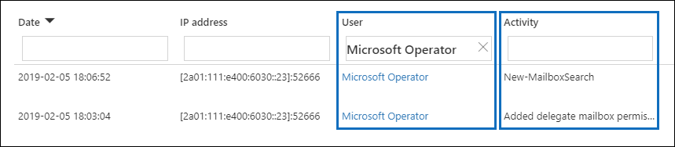

# Клиентский блок-ящик в Office 365Customer Lockbox in Office 365

В этой статье содержится руководство по развертыванию и настройке для клиентского lockbox.This article provides deployment and configuration guidance for Customer Lockbox. Хранилище блокировки клиентов поддерживает запросы на доступ к данным в Exchange Online, SharePoint Online и OneDrive для бизнеса.Customer Lockbox supports requests to access data in Exchange Online, SharePoint Online, and OneDrive for Business. Чтобы рекомендовать поддержку других служб, отправьте запрос на office [365 UserVoice.](https://office365.uservoice.com/)To recommend support for other services, please submit a request at [Office 365 UserVoice](https://office365.uservoice.com/).

Чтобы узнать о вариантах лицензирования пользователей для получения преимуществ от предложений по обеспечению соответствия требованиям Microsoft 365, включая это, начиная с 1 апреля 2020 г., см. руководство по лицензированию [Microsoft 365](https://aka.ms/ComplianceSD)для обеспечения соответствия требованиям & безопасности.To see the options for licensing your users to benefit from Microsoft 365 compliance offerings, including this one, as of April 1, 2020, see the [Microsoft 365 licensing guidance for security & compliance](https://aka.ms/ComplianceSD).

Блокировка клиента гарантирует, что корпорация Майкрософт не сможет получить доступ к вашему контенту для выполнения операции службы без вашего явного утверждения.Customer Lockbox ensures that Microsoft cannot access your content to perform a service operation without your explicit approval. В клиентской блокировке вы можете получить доступ к вашему содержимому в рабочий процесс утверждения запросов.Customer Lockbox brings you into the approval workflow for requests to access your content.

Иногда инженеры Майкрософт помогают устранять неполадки, о проблемах, о которые сообщили клиенты, в процессе поддержки.Occasionally, Microsoft engineers help troubleshoot and fix customer reported issues in the support process. Как правило, проблемы устранены с помощью обширных средств телеметрии и отладки, которые корпорация Майкрософт установила для своих служб.Usually, issues are fixed through extensive telemetry and debugging tools Microsoft has in place for its services. Однако в некоторых случаях инженеру корпорации Майкрософт требуется доступ к содержимому клиента для определения основной причины и устранения проблемы.However, some cases require a Microsoft engineer to access customer content to determine the root cause and fix the issue. Служба блокировки клиентов требует, чтобы инженер запрашивал доступ у клиента в качестве последнего шага в рабочий процесс утверждения.Customer Lockbox requires the engineer to request access from the customer as a final step in the approval workflow. Это дает организациям возможность утверждать или отоать эти запросы, а также предоставлять клиенту прямой доступ.This gives organizations the option to approve or deny these requests, and provide direct-access control to the customer.

### Видеообъектор блокировки клиентовCustomer Lockbox overview video

> [!VIDEO https://www.microsoft.com/videoplayer/embed/8fecf10b-1f03-4849-8b67-76d3d2a43f26?autoplay=false]

## Рабочий процесс почтового ящика клиентаCustomer Lockbox workflow

В следующих шагах описан типичный рабочий процесс, когда инженер майкрософт инициирует запрос на обслуживание почтового ящика клиента:The following steps outline the typical workflow when a Microsoft engineer initiates a Customer Lockbox request:

1. У кого-то в организации проблема с почтовым ящиком Microsoft 365.Someone at an organization experiences an issue with their Microsoft 365 mailbox.

2. После того как пользователь устраняет проблему, но не может ее устранить, он открывает запрос в службу поддержки Майкрософт.After the user troubleshoots the issue, but can't fix it, they open a support request with Microsoft Support.

3. Инженер службы поддержки Майкрософт проверяет запрос на обслуживание и определяет необходимость доступа к клиенту организации для устранения проблемы в Exchange Online.A Microsoft support engineer reviews the service request and determines a need to access the organization's tenant to repair the issue in Exchange Online.

4. Инженер службы поддержки Майкрософт входит в средство запроса на доступ к почтовому ящику и создает запрос на доступ к данным, включа который включает имя клиента организации, номер запроса на обслуживание и предполагаемое время, необходимое инженеру для доступа к данным.The Microsoft support engineer logs into the Customer Lockbox request tool and makes a data access request that includes the organization's tenant name, service request number, and the estimated time the engineer needs access to the data.

5. После того как руководитель службы поддержки Майкрософт утвердит запрос, он отправляет назначенному администратору в организации уведомление по электронной почте об ожидающих запросах на доступ от Корпорации Майкрософт.After a Microsoft Support manager approves the request, Customer Lockbox sends the designated approver at the organization an email notification about the pending access request from Microsoft.

    

   Все, кому назначена роль администратора администратора для утверждений доступа к окнамеру клиентского доступа в Центре администрирования Microsoft 365, могут утверждать запросы на доступ к окнам. Anyone who is assigned the [Customer Lockbox access approver](https://docs.microsoft.com/office365/admin/add-users/about-admin-roles) admin role in Microsoft 365 admin center can approve Customer Lockbox requests.

6. Утверждает, что он в центре администрирования Microsoft 365 и утверждает запрос.The approver signs in to the Microsoft 365 admin center and approves the request. На этом этапе запускается создание записи аудита, доступной при поиске в журнале аудита.This step triggers the creation of an audit record available by searching the audit log. Дополнительные сведения [см. в отчете об аудите запросов](#auditing-customer-lockbox-requests)к окнам блокировки клиентов.For more information, see [Auditing Customer Lockbox requests](#auditing-customer-lockbox-requests).

   Если клиент отклоняет запрос или не утверждает его в течение 12 часов, срок действия запроса истекает, и инженеру майкрософт не предоставляется доступ.If the customer rejects the request or doesn't approve the request within 12 hours, the request expires and no access is granted to the Microsoft engineer.

   > [!IMPORTANT]
   > Корпорация Майкрософт не включает ссылки в уведомления по электронной почте о блокировке клиентского почтового ящика, требующие входящих данных в Office 365.Microsoft does not include any links in Customer Lockbox email notifications requiring you to sign in to Office 365.

7. После того как утвержденный из организации утвердит запрос, инженер корпорации Майкрософт получит сообщение об утверждении, войдите в клиент в Exchange Online и исправит проблему клиента.After the approver from the organization approves the request, the Microsoft engineer receives the approval message, logs into the tenant in Exchange Online, and fixes the customer's issue. Инженеры Майкрософт имеют запрашиваемую продолжительность, чтобы устранить проблему, после которой доступ автоматически отзывается.Microsoft engineers have the requested duration to fix the issue after which the access is automatically revoked.

> [!NOTE]
> Все действия, выполняемые инженером Майкрософт, регистрируются в журнале аудита.All actions performed by a Microsoft engineer are logged in the audit log. Вы можете найти и просмотреть эти записи аудита.You can search for and review these audit records.

## Включить или отключить запросы на блокировку блокировки клиентовTurn Customer Lockbox requests on or off

Вы можете включить элементы управления "Блокировка клиента" в Центре администрирования Microsoft 365.You can turn on Customer Lockbox controls in the Microsoft 365 admin center. При включите блокировку клиентов, прежде чем получать доступ к содержимому клиента, корпорация Майкрософт должна получить разрешение вашей организации.When you turn on Customer Lockbox, Microsoft must obtain your organization's approval before accessing any of your tenant's content.

1. Используя учетную запись для работы или учебного заведения с ролью глобального администратора или администратора доступа к почтовому ящику клиента, войдите и  [https://admin.microsoft.com](https://admin.microsoft.com) войдите в нее.Using a work or school account that has either the global administrator or the **Customer Lockbox access approver** role assigned, go to [https://admin.microsoft.com](https://admin.microsoft.com) and sign in.

2. Choose **Settings > Org Settings**.Choose **Settings > Org Settings**.

3. Выберите **"&** конфиденциальность", а затем включите или выключите функцию.  >    >    Select **Security & Privacy** > **Customer Lockbox** > **Edit**, and then move the toggle to **On** or **Off** to turn the feature on or off.

    

## Утверждение или отказ в запросе на блокировку клиентского окнаApprove or deny a Customer Lockbox request

1. Используя учетную запись для работы или учебного заведения с ролью глобального администратора или администратора доступа к почтовому ящику, перейдите в учетную запись и  [https://admin.microsoft.com](https://admin.microsoft.com) войдите в нее.Using a work or school account that has either the global administrator or the **Customer Lockbox access approver** role assigned, go to [https://admin.microsoft.com](https://admin.microsoft.com) and sign in.

2. Choose **Support > Customer Lockbox Requests**.Choose **Support > Customer Lockbox Requests**.

    

    Отображается список запросов на блокировку клиентского окна.A list of Customer Lockbox requests displays.

    

3. Выберите запрос на блокировку клиента, а затем выберите **"Утвердить"** или **"Запретить".**Select a Customer Lockbox request, and then choose **Approve** or **Deny**.

    

    Отображается сообщение с подтверждением утверждения запроса на блокировку клиентского окна.A confirmation message about the approval of the Customer Lockbox request displays.

    

> [!NOTE]
> Командлет Set-AccessToCustomerDataRequest используется для утверждения, отклонения или отмены запросов на доступ к защищенному хранилищу в Microsoft 365 и предоставления доступа к данным специалистам службы поддержки Майкрософт.Use the Set-AccessToCustomerDataRequest cmdlet to approve, deny, or cancel Microsoft 365 customer lockbox requests that control access to your data by Microsoft support engineers. Дополнительные сведения см. в [подстроке Set-AccessToCustomerDataRequest.](https://docs.microsoft.com/powershell/module/exchange/set-accesstocustomerdatarequest)For more information, see [Set-AccessToCustomerDataRequest](https://docs.microsoft.com/powershell/module/exchange/set-accesstocustomerdatarequest).

## Аудит запросов к окнам блокировки клиентовAuditing Customer Lockbox requests

Записи аудита, соответствующие запросам к окну блокировки клиентов, регистрируются в журнале аудита.Audit records that correspond to the Customer Lockbox requests are logged in the audit log. Доступ к этим журналам  можно получить с помощью средства поиска в журнале аудита в Центре & соответствия требованиям.You can access these logs by using the [audit log search tool](search-the-audit-log-in-security-and-compliance.md) in the Security & Compliance Center. Действия, связанные с принятием или запретом запроса на доступ к окну блокировки клиентов и действия, выполняемые инженерами Майкрософт (при одобрении запросов на доступ), также регистрируются в журнале аудита.Actions related to accepting or denying a Customer Lockbox request and actions performed by Microsoft engineers (when access requests are approved) are also logged in the audit log. Вы можете найти и просмотреть эти записи аудита.You can search for and review these audit records.

### Поиск действий, связанных с запросами к окну блокировки клиентов, в журнале аудитаSearch the audit log for activity related to Customer Lockbox requests

Прежде чем использовать журнал аудита для отслеживания запросов к окну "Блокировка клиента", необходимо предпринять некоторые действия, чтобы настроить ведение журнала аудита.Before you can use the audit log to track requests for Customer Lockbox, there are some steps you need to take to set up audit logging. Дополнительные сведения [см.](https://docs.microsoft.com/office365/securitycompliance/search-the-audit-log-in-security-and-compliance#before-you-begin)в журнале аудита в Центре безопасности & соответствия требованиям.For more information, see [Search the audit log in the Security & Compliance Center](https://docs.microsoft.com/office365/securitycompliance/search-the-audit-log-in-security-and-compliance#before-you-begin). Завершив настройку, создайте поисковый запрос журнала аудита для возврата записей аудита, связанных с блокировкой клиента:Once you've completed setup, use these steps to create an audit log search query to return audit records related to Customer Lockbox:

1. Перейдите по ссылке [https://protection.office.com](https://protection.office.com).Go to [https://protection.office.com](https://protection.office.com).
  
2. Выполните вход с помощью рабочей или учебной учетной записи.Sign in using your work or school account.

3. В левой области Центра безопасности и & соответствия требованиям выберите поиск & журнала аудита  >  исследования.In the left pane of the Security & Compliance Center, choose **Search & investigation** > **Audit log search**.

    Отображается **страница поиска в** журнале аудита.The **Audit log search** page displays.

    
  
4. Настройте указанные ниже условия. Configure the following search criteria:

    1. **Действия** . Оставьте это поле пустым, чтобы поиск возвращал записи аудита для всех действий.**Activities** - Leave this field blank so that the search returns audit records for all activities. Это необходимо для возврата любых записей аудита, связанных с запросами на блокировку клиентом и соответствующими действиями, выполняемыми инженерами Майкрософт.This is necessary to return any audit records related to Customer Lockbox requests and corresponding activity performed by Microsoft engineers.

    1. **Дата начала** и **дата окончания** — выберите диапазон дат и времени, чтобы отобразить события, произошедшие за этот период.**Start date** and **End date** - Select a date and time range to display the events that occurred within that period.

    1. **Пользователи** — оставьте это поле пустым.**Users** - Leave this field blank.

    1. **Файл, папка или сайт —** оставьте это поле пустым.**File, folder, or site** - Leave this field blank.

5. Чтобы выполнить поиск по указанным условиям, нажмите кнопку **Поиск**. Click **Search** to run the search using your search criteria.

    Результаты поиска загружаются и через несколько секунд отображаются под **"Результаты"** на странице поиска **в журнале аудита.**The search results are loaded, and after a few moments they are displayed under **Results** on the **Audit log search** page.

6. Щелкните **"Фильтр результатов"** на странице результатов поиска и сделайте следующее:Click **Filter results** on the search results page, and do one of the following things:

   - Чтобы отобразить записи аудита, связанные с утвержденным в организации или отказам  в запросе на доступ к окну блокировки: в поле в столбце "Действие" введите **Set-AccessToCustomerDataRequest.**To display audit records related to an approver in your organization approving or denying a Customer Lockbox request: In the box under the **Activity** column, type **Set-AccessToCustomerDataRequest**.

   - Чтобы отобразить записи аудита, связанные с выполнением инженером Майкрософт действий  в ответ на утвержденный запрос на блокировку клиента: в поле в столбце "Пользователь" введите **"Оператор Майкрософт".**To display audit records related to a Microsoft engineer performing actions in response to an approved Customer Lockbox request: In the box under the **User** column, type **Microsoft Operator**. В **столбце "Действие"** отображается действие, выполнено инженером.The **Activity** column displays the action performed by the engineer.

      

7. В списке результатов щелкните запись аудита, чтобы отобразить ее.In the list of results, click an audit record to display it.

### Запись аудита для запроса на доступ к почтовому ящику клиентаAudit record for a Customer Lockbox access request

Когда человек в вашей организации утверждает или отказано в запросе на доступ к окну блокировки клиентов, запись аудита регистрируется в журнале аудита.When a person in your organization approves or denies a Customer Lockbox request, an audit record is logged in the audit log. Эта запись содержит следующие сведения.This record contains the following information.

| Свойство записи аудитаAudit record property| ОписаниеDescription|
|:---------- |:----------|
| DateDate       | Дата и время утверждения или отклонения запроса на доступ к окнам.The date and time when the Customer Lockbox request was approved or denied.
| IP-адресIP address | IP-адрес компьютера, используемого утвержденным для утверждения или отказа в запросе.The IP address of the machine the approver used to approve or deny a request. |
| ПользовательUser       | Учетная запись службы BOXServiceAccount@ \[ customerforest \] .prod.outlook.com.The service account BOXServiceAccount@\[customerforest\].prod.outlook.com.            |
| ДействиеActivity   | Set-AccessToCustomerDataRequest; это действие аудита, регистрируется при утверждении или отказе запроса на блокировку клиента.Set-AccessToCustomerDataRequest; this is the auditing activity that is logged when you approve or deny a Customer Lockbox request.                                |
| ЭлементItem       | Guid запроса на блокировку клиентского окнаThe Guid of the Customer Lockbox request                             |

На следующем снимке экрана показан пример записи журнала аудита, соответствующей утвержденному запросу на блокировку клиента.The following screenshot shows an example of an audit log record that corresponds to an approved Customer Lockbox request. Если запрос на доступ к окнам клиента был отклонен, параметр **ApprovalDecision** будет иметь значение **Deny**.If a Customer Lockbox request was denied, then the value of **ApprovalDecision** parameter would be **Deny**.

> [!TIP]
> Чтобы отобразить более подробные сведения в записи аудита, щелкните **"Дополнительные сведения".**To display more detailed information in an audit record, click **More information**.

### Запись аудита действия, выполненного инженером МайкрософтAudit record for an action performed by a Microsoft engineer

Действия, выполняемые инженером Корпорации Майкрософт после утверждения запроса на доступ к окну блокировки (что может привести к доступу к контенту клиента), регистрируются в журнале аудита.The actions performed by a Microsoft engineer after a Customer Lockbox request is approved (and that may result in accessing customer content) are logged in the audit log. Эти записи содержат следующие сведения.These records contain the following information.

| Свойство записи аудитаAudit record property| ОписаниеDescription|
|:---------- |:----------|
| DateDate       | Дата и время выполнения действия.Date time when the action was performed. Обратите внимание, что время выполнения этого действия будет в течение 4 часов после утверждения запроса на блокировку.Note that the time that this action was performed will be within 4 hours of when the Customer Lockbox request was approved.              |
| IP-адресIP address | IP-адрес компьютера, используемого инженером Майкрософт.The IP Address of the machine Microsoft engineer used. |
| ПользовательUser       | Оператор Майкрософт; Это значение указывает, что эта запись связана с запросом на блокировку клиентского окна.Microsoft Operator; this value indicates that this record is related to a Customer Lockbox request.                                  |
| ДействиеActivity   | Имя действия, выполненного инженером Майкрософт.Name of the activity performed by the Microsoft engineer.|
| ЭлементItem       | \<empty\>                                             |

## Вопросы и ответыFrequently asked questions

#### К какой службе Microsoft 365 применяется lockbox клиента?Which Microsoft 365 services does Customer Lockbox apply to?

В настоящее время хранилище для пользователей поддерживается в Exchange Online, SharePoint Online и OneDrive для бизнеса.Customer Lockbox is currently supported in Exchange Online, SharePoint Online, and OneDrive for Business.

#### Доступно ли для всех клиентов доступ к окнам блокировки клиентов?Is Customer Lockbox available to all customers?

Защищенное почтовое ящик включено в подписки Microsoft 365 или Office 365 E5 и может быть добавлено в другие планы с подпиской на дополнительные надстройки "Защита и соответствие требованиям".Customer Lockbox is included with the Microsoft 365 or Office 365 E5 subscriptions and can be added to other plans with an Information Protection and Compliance or an Advanced Compliance add-on subscription. Дополнительные [сведения см. в](https://products.office.com/business/office-365-enterprise-e5-business-software) планах и ценах.Please see [Plans and pricing](https://products.office.com/business/office-365-enterprise-e5-business-software) for more information.

#### Что такое контент клиента?What is customer content?

Контент клиента — это данные, созданные пользователями служб и приложений Microsoft 365.Customer content is the data created by users of Microsoft 365 services and applications. Примеры контента клиента:Examples of customer content include:

- Тело или вложения электронной почтыEmail body or email attachments

- Контент сайта SharePointSharePoint site contents

- Сведения в теле файла SharePointInformation in the body of a SharePoint file

- Тело файла презентации Skype для бизнесаSkype for Business presentation file body

- Мгновенные сообщения или голосовые беседыInstant messages (IM) or voice conversations

- Созданные клиентом BLOB-данные или структурированные данные хранилища (например, SQL Контейнеры)Customer-generated blob or structured storage data (for example, SQL Containers)

- Сведения о безопасности, которые принадлежат клиенту (например, сертификаты, ключи шифрования и пароли)Customer-owned security information (for example, certificates, encryption keys, and passwords)

- Выводы и все последующие выводы, если контент клиента остаетсяInferences, and all subsequent inferences, if customer content remains

Дополнительные сведения о контенте клиентов в Office 365 см. в центре управления [доверием Office 365.](https://products.office.com/business/office-365-trust-center-privacy/)For additional information about customer content in Office 365, see the [Office 365 Trust Center](https://products.office.com/business/office-365-trust-center-privacy/).

#### Кто уведомлен о запросе на доступ к содержимому?Who is notified when there is a request to access my content?

Глобальные администраторы и все, кому назначена роль администратора доступа к почтовому ящику клиента, будут уведомлены.Global administrators and anyone assigned the Customer Lockbox access approver admin role are notified. Это также те же пользователи, которые могут утверждать запросы на доступ к окнам.These are also the same users who can approve for Customer Lockbox requests.

#### Кто может утвердить или отклонить эти запросы в моей организации?Who can approve or reject these requests in my organization?

Глобальные администраторы и все, кому назначена роль администратора, утвержденного в качестве администратора, могут утверждать запросы на доступ к окнам.Global administrators and anyone assigned the Customer Lockbox access approver admin role can approve Customer Lockbox requests. Клиенты контролируют эти назначения ролей в своих организациях.Customers control these role assignments in their organizations.

#### Как я могу отказаться от службы блокировки клиентов?How do I opt in to Customer Lockbox?

Глобальный администратор может включить и настроить клиентский lockbox в Центре администрирования Microsoft 365 или Microsoft 365.A global administrator can enable and configure Customer Lockbox in the Microsoft 365 or Microsoft 365 admin center.

#### Если я утвердю запрос на блокировку клиентского окна, что может сделать инженер и как я буду знать, что сделал инженер Майкрософт?If I approve a Customer Lockbox request, what can the engineer do and how will I know what the Microsoft engineer did?

После утверждения запроса на доступ к окнам клиентского доступа инженер майкрософт предоставил эти необходимые привилегии для доступа к контенту клиента с помощью предварительно утвержденных cmdlets.After you approve a Customer Lockbox request, the Microsoft engineer granted these necessary privileges to access customer content by using pre-approved cmdlets. Действия, принятые инженерами Майкрософт в ответ на запросы к окну блокировки клиентов, регистрируются и доступны в журнале аудита в Центре безопасности & соответствия требованиям.Actions taken by Microsoft engineers in response to Customer Lockbox requests are logged and accessible in the audit log in the Security & Compliance Center.

#### Как узнать, что корпорация Майкрософт следует процессу утверждения?How do I know that Microsoft follows the approval process?

Вы можете перекрестно ссылаться на уведомления об утверждении электронной почты, отправленные администраторам и утвержденным в организации, с помощью истории запросов на блокировку клиентского окна в Центре администрирования Microsoft 365.You can cross-reference the email approval notifications sent to admins and approvers in your organization with the Customer Lockbox request history in the Microsoft 365 admin center.

Блокировка клиента включена в последний отчет [об аудите SOC 1 SSAE 16.](https://servicetrust.microsoft.com/ViewPage/MSComplianceGuide?command=Download&downloadType=Document&downloadId=91592749-e86a-43ac-801e-121382614681&docTab=4ce99610-c9c0-11e7-8c2c-f908a777fa4d_SOC%20%2F%20SSAE%2016%20Reports)Customer Lockbox is included in the latest [SOC 1 SSAE 16 audit report](https://servicetrust.microsoft.com/ViewPage/MSComplianceGuide?command=Download&downloadType=Document&downloadId=91592749-e86a-43ac-801e-121382614681&docTab=4ce99610-c9c0-11e7-8c2c-f908a777fa4d_SOC%20%2F%20SSAE%2016%20Reports). Для получения дополнительных сведений вы можете найти последние отчеты на [портале Microsoft Service Trust Portal.](https://servicetrust.microsoft.com/ViewPage/MSComplianceGuide?command=Download&downloadType=Document&downloadId=91592749-e86a-43ac-801e-121382614681&docTab=4ce99610-c9c0-11e7-8c2c-f908a777fa4d_SOC%20%2F%20SSAE%2016%20Reports)For more details, you can find the latest reports in the [Microsoft Service Trust Portal](https://servicetrust.microsoft.com/ViewPage/MSComplianceGuide?command=Download&downloadType=Document&downloadId=91592749-e86a-43ac-801e-121382614681&docTab=4ce99610-c9c0-11e7-8c2c-f908a777fa4d_SOC%20%2F%20SSAE%2016%20Reports).

#### Может ли корпорация Майкрософт изменить список лиц, утвержденных для моего клиента?Can Microsoft modify the list of approvers for my tenant? Если нет, то как это предотвратить?If not, how is it prevented?

Только глобальный администратор в организации может указать, кто может утверждать запросы на блокировку клиентского управляющего.Only a global administrator in your organization can specify who can approve Customer Lockbox requests. Это означает, что только члены группы глобальных администраторов в Azure Active Directory могут указать, кто может утвердить запрос.That means only the members of the Global administrator group in Azure Active Directory can specify who can approve request. Членство в группе глобальных администраторов в Azure Active Directory управляется только вашей организацией.Membership of the Global administrator group in Azure Active Directory is managed only by your organization.

#### Что делать, если для его утверждения требуются дополнительные сведения о запросе на доступ к контенту?What if I need more information about a content access request to approve it?

Каждый запрос в службу блокировки клиентов содержит номер запроса на обслуживание Microsoft 365.Each Customer Lockbox request contains a Microsoft 365 service request number. Чтобы получить дополнительные сведения о запросе, обратитесь в службу поддержки Майкрософт и получите ссылку на этот номер службы.You can contact Microsoft Support and reference this service number to get more information about the request.

#### Когда запрос на доступ к окнам клиента утвержден, как долго действуют разрешения?When a Customer Lockbox request is approved, how long are the permissions valid?

В настоящее время максимальный период разрешений доступа, предоставленных инженеру Майкрософт, составляет 4 часа.Currently, the maximum period for the access permissions granted to the Microsoft engineer is 4 hours. Инженер Майкрософт также может запросить более короткий период.The Microsoft engineer can also request a shorter period.

#### Как получить историю всех запросов на блокировку клиентов?How can I get a history of all Customer Lockbox requests?

Все запросы на блокировку клиентов просматриваются в Центре администрирования Microsoft 365.All Customer Lockbox requests are viewed in the Microsoft 365 admin center.

#### Как соотнести запросы на доступ к контенту со связанными журналами аудита?How do I correlate the content access requests with the related audit logs?

Веб-канал активности Центра соответствия требованиям содержит сведения о действиях с журналами в окне "Блокировка клиента".The Compliance Center Activity Feed contains log activities of Customer Lockbox. Клиенты могут перекрестно ссылаться на действия в журнале блокировки клиентского почтового ящика из веб-канала активности с запросом электронной почты, который они получают.Customers can cross-reference the Customer Lockbox log activities from the activity feed against the email request they receive.

#### Что происходит, если клиент не отвечает на запросы в службу блокировки?What happens when a customer doesn't respond to a Customer Lockbox request?

Срок действия запросов на блокировку по умолчанию составляет 12 часов.Customer Lockbox requests have a default duration of 12 hours. Если вы не отвечаете на запрос в течение 12 часов, срок действия запроса истекает.If you don't respond to a request within 12 hour, the request expires.

#### Что делает корпорация Майкрософт, когда клиент отклоняет запрос на блокировку клиентского окна?What does Microsoft do when a customer rejects a Customer Lockbox request?

Если клиент отклоняет запрос на доступ к окнам, доступ к содержимому клиента не происходит.If a customer rejects a Customer Lockbox request, no access to customer content occurs. Если у пользователя в вашей организации по-прежнему возникнут проблемы со службой, требующей от корпорации Майкрософт доступа к содержимому клиента для устранения проблемы, проблема службы может сохраниться, и корпорация Майкрософт проинформит пользователя об этом.If a user in your organization continues to experience a service issue requiring Microsoft to access customer content to resolve the issue, then the service issue might persist and Microsoft will inform the user about this.

#### Защищено ли защищено от запросов данных от правоохранительных органов или других третьих сторон?Does Customer Lockbox protect against data requests from law enforcement agencies or other third parties?

Нет.No. Корпорация Майкрософт серьезно относится к запросам сторонних пользователей к данным клиентов.Microsoft takes third-party requests for customer data seriously. Как поставщик облачных служб Корпорация Майкрософт всегда выступает за конфиденциальность данных клиента.As a cloud service provider, Microsoft always advocates for the privacy of customer data. В случае получения подпуены корпорация Майкрософт всегда пытается перенаправить сторонную сторону к клиенту для получения информации.In the event we get a subpoena, Microsoft always attempts to redirect the third party to the customer to obtain the information. (Прочитайте блог Brad Smith: [защита данных клиентов от правительственных высмеов](https://blogs.microsoft.com/blog/2013/12/04/protecting-customer-data-from-government-snooping/)).(Read Brad Smith's blog: [Protecting customer data from government snooping](https://blogs.microsoft.com/blog/2013/12/04/protecting-customer-data-from-government-snooping/)). Мы периодически публикуем [подробные сведения](https://www.microsoft.com/corporate-responsibility/lerr) о запросах правоохранительных органов, которые корпорация Майкрософт получает.We periodically publish [detailed information](https://www.microsoft.com/corporate-responsibility/lerr) about the law enforcement requests that Microsoft receives.

Дополнительные сведения [см.](https://www.microsoft.com/trustcenter/default.aspx) в разделе "Microsoft Trust Center относительно запросов сторонних данных" и разделе "Раскрытие данных клиента" в разделе "Условия работы с веб-службами". See the [Microsoft Trust Center](https://www.microsoft.com/trustcenter/default.aspx) regarding third-party data requests and the "Disclosure of Customer Data" section in the [Online Services Terms](https://www.microsoft.com/Licensing/product-licensing/products.aspx) for more information.

#### Как корпорация Майкрософт гарантирует, что у сотрудников нет постоянного доступа к контенту клиентов в приложениях Office 365?How does Microsoft ensure that a member of its staff doesn't have standing access to customer content in Office 365 applications?

Корпорация Майкрософт реализует широкие профилактические меры с помощью систем контроля доступа, а также меры по выявлению и устранению попыток обойти эти системы контроля доступа.Microsoft implements extensive preventive measures through access control systems, and detective measures to identify and address attempts to circumvent these access control systems. Microsoft 365 работает с принципами наименьших привилегий и простого доступа.Microsoft 365 operates with the principles of least privilege and just-in-time access. Таким образом, ни один персонал Майкрософт не имеет разрешения на доступ к контенту клиентов на постоянной основе.Therefore, no Microsoft personnel have permission to access customer content on an ongoing basis. Если разрешение предоставлено, оно предоставляется в течение ограниченного срока.If permission is granted, it is for a limited duration. 

Microsoft 365 использует систему управления доступом под названием *"Lockbox"* для обработки запросов разрешений, которые предоставляет возможность выполнения рабочих и административных функций в службе.Microsoft 365 uses an access control system called *Lockbox* to process requests for permissions that grant the ability to perform operational and administrative functions within the service. Оператор должен запросить доступ к содержимому клиента с помощью lockbox, после чего второй человек должен принять действие по запросу (например, утвердить его) перед предоставлением доступа.An operator must request access to customer content using Lockbox, which then requires a second person to take action on the request (e.g., approve it) before access is granted. Второй человек не может быть запрашивателем и должен быть назначен для утверждения доступа к контенту клиента.That second person can't be the requestor and must be designated to approve access to customer content. Только если запрос утвержден, оператор получает временный доступ к контенту клиента.Only if the request is approved does the operator acquire temporary access to customer content. По истечении периода повышения прав блокировка отменяет доступ.After the elevation period expires, Lockbox revokes access.

Дополнительные сведения об общих [методиках](https://www.microsoft.com/licensing/product-licensing/products) обеспечения безопасности Корпорации Майкрософт можно найти в условиях веб-служб.Please refer to the [Online Services Terms](https://www.microsoft.com/licensing/product-licensing/products) for more details about Microsoft general security practices.

#### При каких обстоятельствах инженерам Майкрософт нужен доступ к содержимому?Under what circumstances do Microsoft engineers need access to my content?

Самый распространенный сценарий, в котором инженерам Майкрософт требуется доступ к содержимому клиента, — это обращение в службу поддержки, требующее доступа для устранения неполадок.The most common scenario where Microsoft engineers need access customer content is when the customer makes a support request requiring access for troubleshooting. Принцип Microsoft 365 заключается в том, что служба работает без доступа Майкрософт к контенту клиентов.A foundational principle of Microsoft 365 is that the service operates without Microsoft access to customer content. Почти все операции с обслуживанием, выполняемые корпорацией Майкрософт, полностью автоматизированы, а участие человека жестко контролируется и абстрагизируется от контента клиента.Nearly all service operations performed by Microsoft are fully automated and human involvement is highly controlled and abstracted away from customer content. Цель Microsoft 365 — доступ к контенту клиента для поддержки службы не требуется, пока клиент не утвердит конкретный запрос на доступ Майкрософт.The goal for Microsoft 365 is access to customer content to support the service isn't needed until the customer approves a specific request for Microsoft access.

#### Я уже считал, что мои данные защищены в облаке Майкрософт, поэтому зачем мне защищенное защищенное место клиента?I already thought my data was secure with the Microsoft cloud, so why do I need Customer Lockbox?

Блокировка клиентов предоставляет дополнительный уровень контроля, предлагая клиентам возможность явной авторизации доступа для операций службы.Customer Lockbox provides an extra layer of control by offering customers the ability to give explicit access authorization for service operations. Демонстрация того, что для явной авторизации доступа к данным имеются процедуры, клиентская служба блокировки также помогает клиентам выполнять определенные обязательства по обеспечению соответствия требованиям, такие как HIPAA и FEDRAMP.By demonstrating that procedures are in place for explicit data access authorization, Customer Lockbox also helps customers meet certain compliance obligations such as HIPAA and FEDRAMP.
