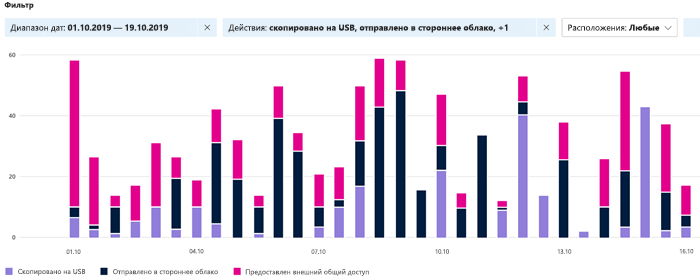

# Начало работы с обозревателем действий

Обзор [классификации данных](data-classification-overview.md) и вкладки [обозревателя](data-classification-content-explorer.md) контента дают представление о том, какое содержимое было обнаружено и помечено, и где это содержимое. Обозреватель действий обобщает набор функций, позволяя отслеживать действия над содержимым с метками. Обозреватель действий предоставляет историческое представление действий в вашем содержимом с меткой. Сведения о действиях собираются из унифицированных журналов аудита Microsoft 365, преобразованы и доступны в пользовательском интерфейсе обозревателя действий. 

Поддерживается свыше 30 фильтров, доступных для использования, включая следующие:

- диапазон дат;
- тип действия;
- расположение;
- пользователь;
- метка конфиденциальности;
- метка хранения;
- путь к файлу
- Политика защиты от потери данных

## Предварительные требования

Каждой учетной записи, которая осуществляет доступ и использует классификацию данных, необходимо назначить лицензию из одной из следующих подписок:

- Microsoft 365 (E5)
- Office 365 (E5)
- Дополнение Advanced Compliance (E5)
- Дополнение Advanced Threat Intelligence (E5)
- Защита информации и управление данными в Microsoft 365 E5 или A5
- Соответствие требованиям Microsoft 365 E5 или A5

### Разрешения

 Чтобы получить доступ к вкладке Обозреватель действий, учетной записи должно быть явно назначено членство в любой из этих групп ролей или явно предоставлена роль.

<!--
> [!IMPORTANT]
> Access to Activity explorer via the Security reader or Device Management role groups or other has been removed-->

**Группы ролей Microsoft 365**

- Глобальный администратор
- Администратор соответствия требованиям
- Администратор безопасности
- Администратор данных о соответствии требованиям

**Microsoft 365 ролей**

- Администратор соответствия требованиям
- Администратор безопасности

## Типы действий

Обозреватель действий собирает сведения о действиях из журналов аудита на нескольких источниках действий. Дополнительные сведения о том, какие действия метки делают ее проводнику действий, см. в описании событий маркировки, доступных [в обозревателе действий.](data-classification-activity-explorer-available-events.md)

**Действия метки**  конфиденциальности и действия по маркировке хранения из Office приложений, надстройки Azure Information Protection, SharePoint Online, Exchange Online (только метки конфиденциальности) и OneDrive. Ниже приведен ряд примеров.

- применение метки
- изменение метки (обновление, возврат к прежней, удаление)
- моделирование автоматического применения метки
- чтение файла 

**Сканер Azure Information Protection (AIP) и клиенты AIP**

- применяемая защита
- изменена защита
- защита удалена
- обнаруженные файлы 

Обозреватель действий также собирает события политики **DLP,** совпадающих с событиями из Exchange Online, SharePoint Online, OneDrive, Teams Chat и Channel (предварительный просмотр), локальной SharePoint папок и библиотек, а также из локального файла и Windows 10 устройств с помощью предотвращения потери данных **endpoint (DLP).** Некоторые примеры событий из Windows 10 являются файлами:

- удаления
- создания
- скопирован в буфер обмена
- изменено
- read
- напечатано
- переименовано
- скопирован в сеть
- доступ к незаверяемой приложению 

Значение понимания того, какие действия принимаются с конфиденциальным контентом с меткой, состоит в том, что вы можете увидеть, эффективны ли элементы управления, которые вы уже ввели, например предотвращение потери данных.  В противном случае или при выявлении чего-то неожиданного, например большого числа элементов, метка которых изменена с `highly confidential` на `general`, вы можете управлять различными политиками и выполнять новые действия, чтобы ограничить нежелательное поведение.

> [!NOTE]
> Обозреватель действий в настоящее время не отслеживает действия по удержанию данных в Exchange Online.

## См. также

- [Сведения о метках конфиденциальности](sensitivity-labels.md)
- [Сведения о политиках и метках хранения](retention.md)
- [Сведения о типах конфиденциальной информации](sensitive-information-type-learn-about.md)
- [Сведения о классификации данных](data-classification-overview.md)
