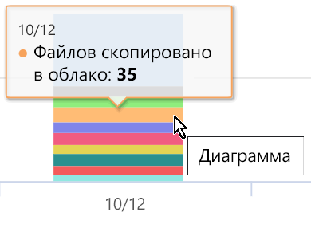
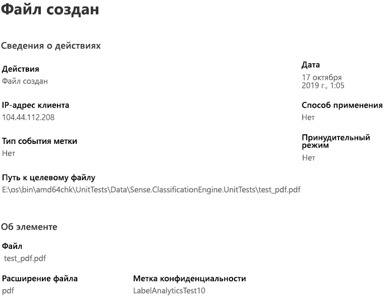

# Начало работы с обозревателем действий (предварительная версия)Get started with activity explorer (preview)

Вкладки "Обзор классификации данных" и "Обозреватель содержимого" позволяют просматривать обнаруженное содержимое с метками, а также его расположение.The data classification overview and content explorer tabs give you visibility into what content has been discovered and labeled, and where that content is. Обозреватель действий обобщает набор функций, позволяя отслеживать действия над содержимым с метками.Activity explorer rounds out this suite of functionality by allowing you to monitor what's being done with your labeled content. В обозревателе действий доступно представление журнала.Activity explorer provides a historical view.

Вы можете фильтровать данные по следующим параметрам:You can filter the data by:

- диапазон дат;date range
- тип действия;activity type
- расположение;location
- пользователь;user
- метка конфиденциальности;sensitivity label
- метка хранения;retention label

Вы можете просматривать данные в виде списка или гистограммы.You can view the data either as a list or a bar graph.

## Необходимые компонентыPrerequisites

Каждой учетной записи, которая обращается к обозревателю действий и использует его, должна быть назначена лицензия одной из следующих подписок:Every account that accesses and uses activity explorer must have a license assigned to it from one of these subscriptions:

- Microsoft 365 (E5)Microsoft 365 (E5)
- Office 365 (E5)Office 365 (E5)
- Дополнение Advanced Compliance (E5)Advanced Compliance (E5) add-on
- Дополнение Advanced Threat Intelligence (E5)Advanced Threat Intelligence (E5) add-on

## Тип действияActivity type

В Microsoft 365 отслеживаются и составляются отчеты для 12 типов действий в SharePoint Online, OneDrive и конечных точках.Microsoft 365 monitors and reports on 12 types of activities across SharePoint Online, OneDrive and endpoints. Конечные точки — это пользовательские устройства под управлением Windows 10.Endpoints are user devices running Windows 10.

- Файл созданFile created
- Файл измененFile modified
- Файл переименованFile renamed
- Файл скопирован в облакоFile copied to cloud
- К файлу получен доступ неразрешенным приложениемFile accessed by unallowed app
- Файл распечатанFile printed
- Файл скопирован на съемный носительFile copied to removable media
- Файл скопирован в общую сетевую папкуFile copied to network share
- Файл прочитанFile read
- Файл скопирован в буфер обменаfile copied to clipboard
- Метка примененаLabel applied
- Метка изменена (обновление, возврат к предыдущей или удаление)Label changed (upgraded, downgraded, or removed)

Ценность понимания того, какие действия выполняются над содержимым с меткой конфиденциальности состоит в том, что вы можете увидеть, эффективны ли примененные элементы управления, например [политики защиты от потери данных](data-loss-prevention-policies.md).The value of understanding what actions are being taken with your sensitive labeled content is that you can see if the controls that you have already put into place, such as [data loss prevention policies](data-loss-prevention-policies.md) are effective or not. В противном случае или при выявлении чего-то неожиданного, например большого числа элементов, метка которых изменена с `highly confidential` на `general`, вы можете управлять различными политиками и выполнять новые действия, чтобы ограничить нежелательное поведение.If not, or if you discover something unexpected, such as a large number of items that are labeled `highly confidential` and are downgraded `general`, you can manage your various policies and take new actions to restrict the undesired behavior.

После настройки фильтров вы можете:Once your filters are set, you can:

- навести указатель мыши на сегмент линейчатой диаграммы, чтобы увидеть число элементов, входящих в эту категорию; hover over a segment of the bar chart to see the number of items that fall into that category 
- экспортировать данные;export the data
- выбрать любой элемент из списка и просмотреть сведения о действии во всплывающем окне.select any given item from the list and view the details of the action in the fly-out

## См. такжеSee also
- [Метки конфиденциальностиSensitivity labels](sensitivity-labels.md)
- [Метки храненияRetention labels](labels.md)
- [Что позволяют искать типы конфиденциальной информацииWhat the sensitive information types look for](what-the-sensitive-information-types-look-for.md)
- [Обзор политик храненияOverview of retention policies](retention-policies.md)
