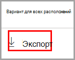

# Начало работы с обозревателем контента

Обозреватель содержимого с классификацией данных позволяет легко просматривать элементы, обобщенные на странице обзора.

## Предварительные требования

Каждой учетной записи, которая осуществляет доступ и использует классификацию данных, необходимо назначить лицензию из одной из следующих подписок:

- Microsoft 365 (E5)
- Office 365 (E5)
- Дополнение Advanced Compliance (E5)
- Дополнение Advanced Threat Intelligence (E5)

### Разрешения

Чтобы получить доступ к вкладке обозревателя контента, учетной записи необходимо назначить участие в одной из следующих ролей или групп ролей. 

[Политика защиты от потери данных](data-loss-prevention-policies.md) помогает защитить сведения, относящиеся к одному из **типов конфиденциальной информации**. Microsoft 365 содержит готовые к использованию [определения для многих распространенных типов конфиденциальной информации](sensitive-information-type-entity-definitions.md) из различных регионов.  Например, номера кредитных карт, номера банковских счетов, национальные идентификационные номера и номера службы Windows Live ID.

**Группы ролей Microsoft 365**

- Глобальный администратор
- Администратор соответствия требованиям
- Администратор безопасности
- Администратор данных о соответствии требованиям

> [!IMPORTANT]
> Членство в этих группах ролей не позволяет просматривать список элементов в обозревателе контента и просматривать содержимое элементов в обозревателе контента.

### Разрешения, необходимые для доступа к элементам в обозревателе контента

Доступ к обозревателю контента чрезвычайно ограничен, так как он позволяет читать содержимое отсканированных файлов.

> [!IMPORTANT]
> Эти разрешения обладают приоритетом по отношению к разрешениям, заданным локально, что позволяет просматривать контент. 

Доступ к обозревателю контента предоставляется двумя ролями:

- **Роль просматривающего список обозревателя контента**. Участие в этой группе ролей позволяет просматривать каждый элемент и его расположение. `data classification list viewer` Роль заранее добавлена в эту группу ролей.

- **Роль просматривающего контент обозревателя содержимого**. Участие в этой группе ролей позволяет просматривать содержимое каждого элемента в списке. `data classification content viewer` Роль добавлена в эту группу ролей.

Учетной записи, используемой для доступа к обозревателю содержимого, должна быть присвоена одна или обе этих группы ролей. Это независимые группы ролей, не включающие в себя друг друга. Например, если вы хотите предоставить учетной записи возможность просматривать только элементы и их расположения, предоставьте права на просмотр списка обозревателя содержимого. Если вы хотите, чтобы эта учетная запись также смогла просматривать содержимое элементов списка, дополнительно предоставьте права на просмотр контента обозревателя содержимого.

Вы также можете назначить одну или обе роли пользовательской группе ролей, чтобы настроить доступ к проводнику контента.

Глобальный администратор, администратор соответствия или администратор данных может назначить необходимую роль в группе Читатель списка в обозревателе содержимого и Читатель содержимого в обозревателе содержимого.

## Обозреватель содержимого

Обозреватель содержимого отображает текущий снимок элементов с присвоенными метками конфиденциальности или метками хранения, а также отнесенных к конфиденциальным сведениям в организации.

### Типы конфиденциальной информации

[Политика защиты от потери данных](data-loss-prevention-policies.md) помогает защитить сведения, относящиеся к одному из **типов конфиденциальной информации**. Microsoft 365 содержит готовые к использованию [определения для многих распространенных типов конфиденциальной информации](sensitive-information-type-entity-definitions.md) из различных регионов.  Например, номера кредитных карт, номера банковских счетов, национальные идентификационные номера и номера службы Windows Live ID.

> [!NOTE]
> В настоящий момент браузер контента не проверяет типы конфиденциальной информации в Exchange Online.

### Метки конфиденциальности

[Метка конфиденциальности](sensitivity-labels.md) — это просто тег, обозначающий значение элемента для организации. Ее можно применять вручную или автоматически. После применения она внедряется в документ и повсюду следует за ним. Метка конфиденциальности включает различные защитные действия, такие как обязательные водяные знаки или шифрование.

Для файлов SharePoint и OneDrive должны быть включены метки конфиденциальности, чтобы соответствующие данные отображались на странице классификации данных. Дополнительные сведения см. в статье [Включение меток конфиденциальности для файлов Office в SharePoint и OneDrive](sensitivity-labels-sharepoint-onedrive-files.md).

### Метки хранения

[Метка хранения](retention.md) позволяет определить срок хранения элемента с меткой и действия, которые необходимо выполнить перед его удалением. Они применяются вручную или автоматически с помощью политик. С их помощью можно обеспечивать соблюдение организацией юридических и нормативных требований.

### Использование обозревателя содержимого

1. Откройте **Центр соответствия требованиям Microsoft 365**  > **Классификация данных** > **Обозреватель содержимого**.
2. Если вы знаете название метки или тип конфиденциальной информации, можно ввести их в поле фильтра.
3. Или можно выполнить поиск элемента, развернув список типов метки и выбрав метку из этого списка.
4. Выберите расположение в разделе **Все расположения** и разверните структуру папок до элемента.
5. Дважды щелкните, чтобы открыть элемент в обозревателе содержимого.

### Экспорт
Элемент управления **Экспорт** создаст CSV-файл, содержащий список всех элементов, которые отображаются в области **Все расположения**.

### Поиск

При детализации расположения, например папки Exchange или сайта SharePoint или OneDrive, появляется средство **Поиск**.

Областью действия средства поиска является то, что отображается в панели **Все расположения**, а возможное место поиска зависит от выбранного расположения. 

Если выбрано расположение ** Exchange**, то поиск можно выполнить по полному адресу электронной почты в почтовом ящике, например `user@domainname.com`.

Если выбрано расположение **SharePoint** или **OneDrive**, то при детализации имен сайтов, папок и файлов будет выводиться средство "Поиск". 

> [!NOTE]
> **OneDrive** В рамках программы предварительного просмотра мы получили от вас ценные отзывы относительно интеграции OneDrive. С учетом этого отзыва функции OneDrive останутся в предварительной версии до тех пор, пока не будут сделаны все исправления. В зависимости от клиента, некоторые пользователи могут не видеть OneDrive в качестве расположения. Благодарим вас за поддержку.

Вы можете выполнять поиск по следующим критериям:

|значение|пример  |
|---------|---------|
|полное имя сайта    |`https://contoso.onmicrosoft.com/sites/sitename`    |
|имя корневой папки — получает все вложенные папки.    | `/sites`        |
|имя файла    |    `RES_Resume_1234.txt`     |
|текст в начале имени файла| `RES`|
|текст после символа подчеркивания (_) в имени файла|`Resume` или `1234`| 
|расширение файла|`txt`|

## См. также

- [Сведения о метках конфиденциальности](sensitivity-labels.md)
- [Сведения о политиках и метках хранения](retention.md)
- [Sensitive information type entity definitions.md](sensitive-information-type-entity-definitions.md)
- [Общие сведения о защите от потери данных](data-loss-prevention-policies.md)
