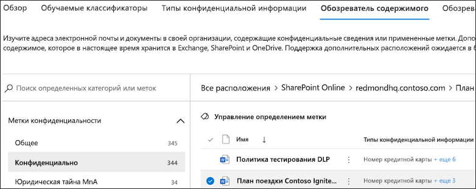

# Использование обозревателя содержимого с классификацией данных (предварительная версия)Using data classification content explorer (preview)

Обозреватель содержимого с классификацией данных позволяет легко просматривать элементы, обобщенные на странице обзора.The data classification content explorer allows you to natively view the items that were summarized on the overview page.

## Необходимые компонентыPrerequisites

Каждой учетной записи, которая обращается к обозревателю действий и использует его, должна быть назначена лицензия одной из следующих подписок:Every account that accesses and uses activity explorer must have a license assigned to it from one of these subscriptions:

- Microsoft 365 (E5)Microsoft 365 (E5)
- Office 365 (E5)Office 365 (E5)
- Дополнение Advanced Compliance (E5)Advanced Compliance (E5) add-on
- Дополнение Advanced Threat Intelligence (E5)Advanced Threat Intelligence (E5) add-on

## Обозреватель содержимогоContent explorer

Обозреватель содержимого отображает текущий снимок элементов с присвоенными метками конфиденциальности или метками хранения, а также отнесенных к конфиденциальным сведениям в организации.Content explorer shows a current snapshot of the items that have a sensitivity label, a retention label or have been classified as a sensitive information type in your organization.

### Типы конфиденциальной информацииSensitive information types

[Политика защиты от потери данных](data-loss-prevention-policies.md) помогает защитить сведения, относящиеся к одному из **типов конфиденциальной информации**.A [DLP policy](data-loss-prevention-policies.md) can help protect sensitive information, which is defined as a **sensitive information type**. Microsoft 365 содержит готовые к использованию [определения для многих распространенных типов конфиденциальной информации](what-the-sensitive-information-types-look-for.md) из различных регионов. Microsoft 365 includes [definitions for many common sensitive information types](what-the-sensitive-information-types-look-for.md) across many different regions that are ready for you to use. Например, номера кредитных карт, номера банковских счетов, национальные идентификационные номера и номера службы Windows Live ID.For example, a credit card number, bank account numbers, national ID numbers, and Windows Live ID service numbers.

### Метки конфиденциальностиSensitivity labels

[Метка конфиденциальности](sensitivity-labels.md) — это просто тег, обозначающий значение элемента для организации.A [sensitivity label](sensitivity-labels.md) is simply a tag that indicates the value of the item to your organization. Ее можно применять вручную или автоматически.It can be applied manually, or automatically. После применения она внедряется в документ и повсюду следует за ним.Once applied it gets embedded in the document and will follow it everywhere it goes. Метка конфиденциальности включает различные защитные действия, такие как обязательные водяные знаки или шифрование.A sensitivity label enables various protective behaviors, such as mandatory watermarking or encryption. С включенной защитой конечной точки можно даже запретить элементу покидать организацию.With end point protection enabled you can even prevent an item from leaving your organizational control.

Для файлов SharePoint и OneDrive должны быть включены метки конфиденциальности, чтобы соответствующие данные отображались на странице классификации данных.Sensitivity labels must be enabled for files that are in SharePoint and OneDrive in order for the corresponding data to surface in the data classification page. Дополнительные сведения см. в статье [Включение меток конфиденциальности для файлов Office в SharePoint и OneDrive (общедоступная предварительная версия)](sensitivity-labels-sharepoint-onedrive-files.md).For more information, see [Enable sensitivity labels for Office files in SharePoint and OneDrive (public preview)](sensitivity-labels-sharepoint-onedrive-files.md).

### Метки храненияRetention labels

[Метка хранения](labels.md) позволяет определить срок хранения элемента с меткой и действия, которые необходимо выполнить перед его удалением.A [retention label](labels.md) allows you to define how long a labeled item is kept and the steps to be taken prior to deleting it. Они применяются вручную или автоматически с помощью политик.They are applied manually or automatically via policies. С их помощью можно обеспечивать соблюдение организацией юридических и нормативных требований.They can play a role in helping your organization stay in compliance with legal and regulatory requirements.

### РазрешенияPermissions

Доступ к обозревателю содержимого предоставляется двумя ролями:There are two roles that grant access to content explorer:

- **Роль просматривающего список обозревателя содержимого**. Участие в этой группе ролей позволяет просматривать каждый элемент и его расположение.**Content Explorer List viewer**: Membership in this role group allows you to see each item and its location. `data classification list viewer` Роль добавлена в эту группу ролей.The `data classification list viewer` role has been pre-assigned to this role group.

- **Роль просматривающего контент обозревателя содержимого**. Участие в этой группе ролей позволяет просматривать содержимое каждого элемента в списке.**Content Explorer Content viewer**: Membership in this role group allows you to view the contents of each item in the list. `data classification content viewer` Роль добавлена в эту группу ролей.The `data classification content viewer` role has been pre-assigned to this role group.

Учетной записи, используемой для доступа к обозревателю содержимого, должна быть присвоена одна или обе этих группы ролей.The account you use to access content explorer must be in one or both of the role groups. Это независимые группы ролей, не включающие в себя друг друга.These are independent role groups and are not cumulative. Например, если вы хотите предоставить учетной записи возможность просматривать только элементы и их расположения, предоставьте права на просмотр списка обозревателя содержимого.For example, if you want to grant an account the ability to view the items and their locations only, grant Content Explorer List viewer rights. Если вы хотите, чтобы эта учетная запись также смогла просматривать содержимое элементов списка, дополнительно предоставьте права на просмотр контента обозревателя содержимого.If you want that same account to also be able to view the contents of the items in the list, grant Content Explorer Content viewer rights as well.

Вы также можете назначить одну или обе роли пользовательской группе ролей, чтобы настроить доступ к проводнику контента.You can also assign either or both of the roles to a custom role group to tailor access to content explorer.

Глобальный администратор, администратор соответствия или администратор данных может назначить необходимую роль в группе Читатель списка в обозревателе содержимого и Читатель содержимого в обозревателе содержимого.A Global admin, Compliance admin, or Data admin can assign the necessary Content Explorer List Viewer, and Content Explorer Content Viewer role group membership.

### Использование обозревателя содержимогоHow to use content explorer

1. Откройте **Центр соответствия требованиям Microsoft 365**  > **Классификация данных** > **Обозреватель содержимого**.Open **Microsoft 365 compliance center**  > **Data classification** > **Content explorer**.
2. Если вы знаете имя метки или тип конфиденциальной информации, можно ввести их в поле поиска.If you know the name of the label, or the sensitive information type, you can type that into the search box.
3. Или можно выполнить поиск элемента, развернув тип метки и выбрав метку из списка. Элемент из раздела списка с метками хранения отображается ниже.Alternately, you can browse for the item by expanding the label type and selecting the label from the list, an item from the retention label portion of the list is show below.
4. Выберите расположение в разделе **Все расположения** и разверните структуру папок до элемента.Select a location under **All locations** and drill down the folder structure to the item.
5. Дважды щелкните, чтобы открыть элемент в обозревателе содержимого.Double-click to open the item natively in content explorer.

## См. такжеSee also

- [Метки конфиденциальностиSensitivity labels](sensitivity-labels.md)
- [Метки храненияRetention labels](labels.md)
- [Что позволяют искать типы конфиденциальной информацииWhat the sensitive information types look for](what-the-sensitive-information-types-look-for.md)
- [Обзор политик храненияOverview of retention policies](retention-policies.md)
- [Общие сведения о защите от потери данныхOverview of data loss prevention](data-loss-prevention-policies.md)
