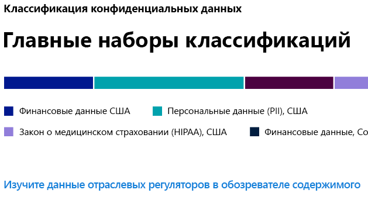
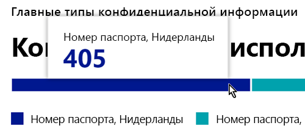
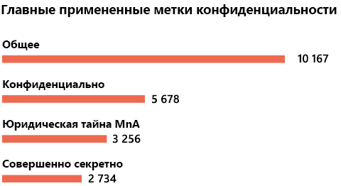
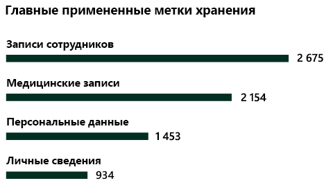

# Знайте свои данные - обзор классификации данныхKnow your data - data classification overview

В качестве администратора Microsoft 365 или администратора соответствия требованиям вы можете оценивать и затем помечать содержимое в своей организации, чтобы отслеживать, куда оно направляется, защищать его независимо от расположения, а также гарантировать его сохранность и удаление в соответствии с потребностями вашей организации.As a Microsoft 365 administrator or compliance administrator, you can evaluate and then tag content in your organization in order to control where it goes, protect it no matter where it is and to ensure that it is preserved and deleted according to your organizations needs. Это можно сделать посредством применения [меток конфиденциальности](sensitivity-labels.md), [меток хранения](retention.md#retention-labels)и классификации типов конфиденциальной информации.You do this through the application of [sensitivity labels](sensitivity-labels.md), [retention labels](retention.md#retention-labels), and sensitive information type classification. Существуют различные способы обнаружения, оценки и пометки, но в результате вы можете иметь очень большое количество документов и электронных писем, которые помечены и классифицированы одним или обоими из этих ярлыков.There are various ways to do the discovery, evaluation and tagging, but the end result is that you may have very large number of documents and emails that are tagged and classified with one or both of these labels. После того, как вы примените свои метки хранения и метки чувствительности, вы захотите увидеть, как метки используются вашим арендатором и что делается с этими элементами.After you apply your retention labels and sensitivity labels, you'll want to see how the labels are being used across your tenant and what is being done with those items. На странице классификации данных можно увидеть этот текст содержимого, а именно:The data classification page provides visibility into that body of content, specifically:

- количество элементов, которые были классифицированы как тип конфиденциальной информации, и характер этих классификацийthe number items that have been classified as a sensitive information type and what those classifications are
- наиболее часто используемые метки конфиденциальности, применяемые в Microsoft 365 и Azure Information Protectionthe top applied sensitivity labels in both Microsoft 365 and Azure Information Protection
- наиболее часто используемые метки храненияthe top applied retention labels
- сводка действий, выполняемых пользователями с вашим конфиденциальным содержимымa summary of activities that users are taking on your sensitive content
- расположение ваших конфиденциальных и сохраненных данныхthe locations of your sensitive and retained data

Вы также управляете этими функциями на странице классификации данных:You also manage these features on the data classification page:
- [обучаемые классификаторыtrainable classifiers](classifier-getting-started-with.md)
- [типы конфиденциальной информацииsensitive information types](what-the-sensitive-information-types-look-for.md)

Классификация данных приведена в **Центре соответствия требованиям Microsoft 365** или **Центре безопасности Microsoft 365** > **Классификация** > **Классификация данных**.You can find data classification in the **Microsoft 365 compliance center** or **Microsoft 365 security center** > **Classification** > **Data Classification**.

Посмотрите видео о наших возможностях классификации данных.Take a video tour of our data classification features.

> [!VIDEO https://www.microsoft.com/videoplayer/embed/RE4vx8x]

Классификация данных будет сканировать ваш конфиденциальный контент и помеченный контент, прежде чем создавать какие-либо политики.Data classification will scan your sensitive content and labeled content before you create any policies. Она называется **управлением изменениями нулевого состояния**.This is called **zero change management**. Такая возможность позволит вам определить влияние всех меток хранения и меток конфиденциальности в вашей среде и начать оценку требований политики защиты и управления.This lets you see the impact that all the retention and sensitivity labels are having in your environment and empower you to start assessing your protection and governance policy needs.

## Предварительные требованияPrerequisites

Каждой учетной записи, которая осуществляет доступ и использует классификацию данных, необходимо назначить лицензию из одной из следующих подписок:Every account that accesses and uses data classification must have a license assigned to it from one of these subscriptions:

- Microsoft 365 (E5/A5)Microsoft 365 (E5/A5)
- Office 365 (E5)Office 365 (E5)
- Дополнение Advanced Compliance (E5)Advanced Compliance (E5) add-on
- Дополнение Advanced Threat Intelligence (E5)Advanced Threat Intelligence (E5) add-on

### РазрешенияPermissions

 Чтобы получить доступ к странице классификации данных, учетной записи необходимо назначить членство в любой из этих ролей или групп ролей.In order to get access to the data classification page, an account must be assigned membership in any one of these roles or role groups.

**Группы ролей Microsoft 365****Microsoft 365 role groups**

- Глобальный администраторGlobal administrator
- Администратор соответствия требованиямCompliance administrator
- Администратор безопасностиSecurity administrator
- Администратор данных соответствия требованиямCompliance data administrator

## Типы конфиденциальных данных, которые наиболее часто используются в вашем содержимомSensitive information types used most in your content

Microsoft 365 поставляется со многими определениями типов конфиденциальной информации, такими как элемент, содержащий номер социального страхования или номер кредитной карты.Microsoft 365 comes with many definitions of sensitive information types, such as an item containing a social security number or a credit card number. Для получения дополнительной информации о типах конфиденциальной информации см. [Определения объектов типа конфиденциальной информации](sensitive-information-type-entity-definitions.md).For more information on sensitive information types, see [Sensitive information type entity definitions](sensitive-information-type-entity-definitions.md).

На карточке типа конфиденциальной информации отображаются наиболее часто используемые типы конфиденциальной информации, которые были найдены и помечены в вашей организации.The sensitive information type card shows the top sensitive information types that have been found and labeled across your organization.

Чтобы узнать количество элементов в той или иной категории классификации, наведите указатель мыши на панель этой категории.To find out how many items are in any given classification category, hover over the bar for the category.

> [!NOTE]
> Если на карточке отображается сообщение «Данные с конфиденциальной информацией не найдены»,If the card displays the message "No data found with sensitive information". то это означает, что в вашей организации отсутствуют элементы, классифицированные как тип конфиденциальной информации, или отсутствуют обойденные элементы.It means that there are no items in your organization that have been classified as being a sensitive information type or no items that have been crawled. Чтобы приступить к работе с метками, см. следующие статьи:To get started with labels, see:
>- [Начало работы с метками конфиденциальностиGet started with sensitivity labels](get-started-with-sensitivity-labels.md)
>- [Начало работы с политиками хранения и метками храненияGet started with retention policies and retention labels](get-started-with-retention.md)
>- [Определения объектов типов конфиденциальной информацииSensitive information type entity definitions](sensitive-information-type-entity-definitions.md)

## Наиболее часто используемые метки конфиденциальности, применяемые для содержимогоTop sensitivity labels applied to content

Когда вы применяете метку конфиденциальности к элементу с использованием Microsoft 365 или Azure Information Protection (AIP), то происходят две вещи:When you apply a sensitivity label to an item either through Microsoft 365 or Azure Information Protection (AIP), two things happen:

- тег, который обозначает значение элемента для вашей организации, встраивается в документ и будет повсюду следовать за нимa tag that indicates the value of the item to your org is embedded in the document and will follow it everywhere it goes
- наличие тега включает различные защитные действия, такие как обязательные водяные знаки или шифрование.the presence of the tag enables various protective behaviors, such as mandatory watermarking or encryption. С включенной защитой конечной точки вы можете даже не позволить элементу выйти из под управления вашей организации.With end point protection enabled you can even prevent an item from leaving your organizational control.

Дополнительные сведения о метках конфиденциальности см. в статье [Сведения о метках конфиденциальности](sensitivity-labels.md).For more information on sensitivity labels, see: [Learn about sensitivity labels](sensitivity-labels.md)

Для файлов SharePoint и OneDrive должны быть включены метки конфиденциальности, чтобы соответствующие данные отображались на странице классификации данных.Sensitivity labels must be enabled for files that are in SharePoint and OneDrive in order for the corresponding data to surface in the data classification page. Дополнительные сведения см. в статье [Включение меток конфиденциальности для файлов Office в SharePoint и OneDrive](sensitivity-labels-sharepoint-onedrive-files.md).For more information, see [Enable sensitivity labels for Office files in SharePoint and OneDrive](sensitivity-labels-sharepoint-onedrive-files.md).

На карточке с меткой конфиденциальности отображается количество элементов (электронная почта или документ) по уровню конфиденциальности.The sensitivity label card shows the number of items (email or document) by sensitivity level.

> [!NOTE]
> Если вы не создали или не опубликовали какие-либо метки конфиденциальности или к содержимому не применена метка конфиденциальности, то на этой карточке будет отображаться сообщение «Метки конфиденциальности не обнаружены».If you haven't created or published any sensitivity labels or no content has had a sensitivity label applied, this card will display the message "No sensitivity labels detected". Чтобы приступить к работе с метками конфиденциальности, см. следующие статьи:To get started with sensitivity labels, see:
>- [Начало работы с метками конфиденциальности](get-started-with-sensitivity-labels.md) или для AIP: [Настройка политики Azure Information Protection](https://docs.microsoft.com/azure/information-protection/configure-policy)[Get started with sensitivity labels](get-started-with-sensitivity-labels.md) or for AIP [Configure the Azure information protection policy](https://docs.microsoft.com/azure/information-protection/configure-policy)

## Наиболее часто используемые метки хранения, применяемые для содержимогоTop retention labels applied to content

Метки хранения используются для управления хранением и ликвидацией содержимого в вашей организации.Retention labels are used to manage the retention and disposition of content in your organization. В случае применения их можно использовать для управления способом хранения документа до удаления, необходимостью проверки перед удалением, завершением срока хранения и необходимостью помечать документ в качестве записи.When applied, they can be used to control how an item will be kept before deletion, whether it should be reviewed prior to deletion, when its retention period expires, and whether it should be marked as a record. Дополнительные сведения см. в статье [Сведения о политиках и метках хранения](retention.md).For more information, see [Learn about retention policies and retention labels](retention.md).

Карточка наиболее часто используемых меток хранения показывает количество элементов, которым была присвоена метка хранения.The top applied retention labels card shows you how many items have a given retention label.

> [!NOTE]
> Если в этой карточке отображается сообщение "Метки хранения не обнаружены", это означает, что вы не создали или не опубликовали метки хранения или к содержимому не была применена метка хранения.If this card displays the message, "No retention labels detected", it means you haven't created or published any retention labels or no content has had a retention label applied. Чтобы приступить к работе с метками хранения, см. следующие статьи:To get started with retention labels, see:
>- [Начало работы с политиками хранения и метками храненияGet started with retention policies and retention labels](get-started-with-retention.md)

## Основные обнаруженные действияTop activities detected

В этой карточке представлен краткий обзор основных действий, которые пользователи выполняют с элементами, отмеченными в качестве конфиденциальных.This card provides a quick summary of the most common actions that users are taking on the sensitivity labeled items. Используйте [Обозреватель действий](data-classification-activity-explorer.md), чтобы углубленно изучить восемь различных действий, которые Microsoft 365 отслеживает по отмеченному содержимому и содержимому, размещенному в конечных точках Windows 10.You can use the [Activity explorer](data-classification-activity-explorer.md) to drill deep down on eight different activities that Microsoft 365 tracks on labeled content and content that is located on Windows 10 endpoints.

> [!NOTE]
> Если в этой карточке отображается сообщение «Действие не обнаружено», то это означает отсутствие действий с файлом или то, что аудит пользователя и администратора не включен.If this card displays the message, "No activity detected" it means that there's been no activity on the files or that user and admin auditing isn't turned on. Для включения журналов аудита см. сведения в следующих статьях:To turn the audit logs on , see:
>- [Поиск журнала аудита в Центре безопасности и соответствия требованиямSearch the audit log in security & compliance center](search-the-audit-log-in-security-and-compliance.md)

## Данные с метками конфиденциальности и хранения по расположениюSensitivity and retention labeled data by location

Суть отчетов о классификации данных заключается в обеспечении наглядного представления о количестве элементов с меткой, а также об их расположении.The point of the data classification reporting is to provide visibility into the number of items that have which label as well as their location. Эти карточки дадут вам представление о количестве отмеченных элементов в Exchange, SharePoint, OneDrive и т. д.These cards let you know how many labeled items the are in Exchange, SharePoint, and OneDrive etc.

> [!NOTE]
> Если в этой карточке отображается сообщение: «Расположения не обнаружены», то это обозначает, что вы не создали или не опубликовали какие-либо метки конфиденциальности или к содержимому не была применена метка хранения.If this card displays the message, "No locations detected, it means you haven't created or published any sensitivity labels or no content has had a retention label applied. Чтобы приступить к работе с метками конфиденциальности, см. следующие статьи:To get started with sensitivity labels, see:
>- [Метки конфиденциальностиSensitivity labels](sensitivity-labels.md)

## См. такжеSee also

- [Просмотр действий с меткамиView label activity](data-classification-activity-explorer.md)
- [Просмотр содержимого с меткамиView labeled content](data-classification-content-explorer.md)
- [Сведения о метках конфиденциальностиLearn about sensitivity labels](sensitivity-labels.md)
- [Сведения о политиках и метках храненияLearn about retention policies and retention labels](retention.md)
- [Определения объектов типов конфиденциальной информацииSensitive information type entity definitions](sensitive-information-type-entity-definitions.md)
- [Начало работы с обучаемыми классификаторами (предварительная версия)Getting started with trainable classifiers (preview)](classifier-getting-started-with.md)
