# Обзор функции защиты от потери данныхOverview of data loss prevention
<!-- this topic needs to be split into smaller, more coherent ones. It is confusing as it is. -->
<!-- move this note to a more appropriate place, no topic should start with a note -->
> [!NOTE]
> Функции защиты от потери данных были недавно добавлены в сообщения чата и каналов Microsoft Teams для пользователей с лицензиями на продукт Office 365 Advanced Compliance, который доступен в качестве отдельной функции и включен в планы Office 365 E5 и "Соответствие требованиям Microsoft 365 E5".Data loss prevention capabilities were recently added to Microsoft Teams chat and channel messages for users licensed for Office 365 Advanced Compliance, which is available as a standalone option and is included in Office 365 E5 and Microsoft 365 E5 Compliance. Дополнительные сведения о требованиях к лицензированию см. в статье [Рекомендации по лицензированию служб на уровне клиента Microsoft 365](https://docs.microsoft.com/office365/servicedescriptions/microsoft-365-service-descriptions/microsoft-365-tenantlevel-services-licensing-guidance).To learn more about licensing requirements, see [Microsoft 365 Tenant-Level Services Licensing Guidance](https://docs.microsoft.com/office365/servicedescriptions/microsoft-365-service-descriptions/microsoft-365-tenantlevel-services-licensing-guidance).

Чтобы соответствовать бизнес-стандартам и требованиям отраслевых нормативных актов, организациям необходимо защищать конфиденциальную информацию и не допускать ее раскрытия по неосторожности.To comply with business standards and industry regulations, organizations must protect sensitive information and prevent its inadvertent disclosure. Конфиденциальная информация может включать финансовые данные или личные сведения, например номера кредитных карт, номера социального страхования (SSN) или данные медицинских карт.Sensitive information can include financial data or personally identifiable information (PII) such as credit card numbers, social security numbers, or health records. Политика защиты от потери данных в Центре безопасности и соответствия требованиям Office 365 позволяет определять, отслеживать и автоматически защищать конфиденциальную информацию в Office 365.With a data loss prevention (DLP) policy in the Office 365 Security &amp; Compliance Center, you can identify, monitor, and automatically protect sensitive information across Office 365.
  
Политика защиты от потери данных предоставляет указанные ниже возможности.With a DLP policy, you can:
  
- **Выявление конфиденциальной информации во многих расположениях, например в Exchange Online, SharePoint Online, OneDrive для бизнеса и Microsoft Teams.****Identify sensitive information across many locations, such as Exchange Online, SharePoint Online, OneDrive for Business, and Microsoft Teams.**
    
    Например, вы можете обнаружить любой документ с номером кредитной карты, который хранится на каком-либо сайте OneDrive для бизнеса, а также отслеживать только сайты OneDrive определенных пользователей.For example, you can identify any document containing a credit card number that's stored in any OneDrive for Business site, or you can monitor just the OneDrive sites of specific people.
    
- **Предотвращение случайного разглашения конфиденциальной информации**.**Prevent the accidental sharing of sensitive information**. 
    
    Например, вы можете находить документы с данными медицинских карт, доступ к которым был предоставлен пользователям за пределами вашей организации, а потом автоматически блокировать доступ к ним или запрещать отправку соответствующих электронных писем.For example, you can identify any document or email containing a health record that's shared with people outside your organization, and then automatically block access to that document or block the email from being sent.
    
- **Отслеживание и защита конфиденциальной информации в полных версиях Excel, PowerPoint и Word.****Monitor and protect sensitive information in the desktop versions of Excel, PowerPoint, and Word.**
    
    В этих программах Office для компьютера есть точно такие же возможности по выявлению конфиденциальной информации и применению политик защиты от потери данных, как и в Exchange Online, SharePoint Online и OneDrive для бизнеса.Just like in Exchange Online, SharePoint Online, and OneDrive for Business, these Office desktop programs include the same capabilities to identify sensitive information and apply DLP policies. Когда пользователи обмениваются контентом в этих программах Office, функции защиты от потери данных выполняют постоянный мониторинг.DLP provides continuous monitoring when people share content in these Office programs.
    
- **Информирование пользователей о способах обеспечения соответствия требованиям без прерывания их рабочих процессов.****Help users learn how to stay compliant without interrupting their workflow.**
    
    Вы можете рассказать пользователям о политиках защиты от потери данных и о том, что соответствие требованиям не будет мешать их работе.You can educate your users about DLP policies and help them remain compliant without blocking their work. Например, если пользователь пытается предоставить доступ к документу, содержащему конфиденциальную информацию, политика защиты от потери данных может отправить ему уведомление по электронной почте либо в контексте библиотеки документов отобразить подсказку политики, которая позволяет переопределить политику при наличии веской деловой причины.For example, if a user tries to share a document containing sensitive information, a DLP policy can both send them an email notification and show them a policy tip in the context of the document library that allows them to override the policy if they have a business justification. Такие же подсказки политики отображаются и в Outlook в Интернете, в Outlook, Excel, PowerPoint и Word.The same policy tips also appear in Outlook on the web, Outlook, Excel, PowerPoint, and Word.
    
- **Просмотр отчетов защиты от потери данных со сведениями о контенте, который соответствует условиям политик защиты от потери данных вашей организации.****View DLP reports showing content that matches your organization's DLP policies.**
    
    Чтобы оценить степень соответствия организации политике защиты от потери данных, можно изучить количество нарушений каждой политики и каждого правила за определенный период.To assess how your organization is complying with a DLP policy, you can see how many matches each policy and rule has over time. Если политика защиты от потери данных позволяет пользователю переопределять подсказки политики и помечать их как ложные срабатывания, вы также можете просматривать связанные с этим сообщения пользователей.If a DLP policy allows users to override a policy tip and report a false positive, you can also view what users have reported.
    
На странице управления защитой от потери данных в Центре безопасности и соответствия требованиям Office 365 вы можете создавать политики защиты от потери данных и управлять ими.You create and manage DLP policies on the Data loss prevention page in the Office 365 Security &amp; Compliance Center.
  

  
## Содержимое политики защиты от потери данныхWhat a DLP policy contains

Политика защиты от потери данных содержит несколько основных правил:A DLP policy contains a few basic things:
  
- Где защищать контент: в таких **расположениях**, как Exchange Online, SharePoint Online и сайты OneDrive для бизнеса, а также в сообщениях чата и каналов Microsoft Teams.Where to protect the content: **locations** such as Exchange Online, SharePoint Online, and OneDrive for Business sites, as well as Microsoft Teams chat and channel messages. 
    
- Когда и как защищать контент путем применения **правил**, состоящих из указанных ниже элементов.When and how to protect the content by enforcing **rules** comprised of: 
    
  - **Условия**, которым должен соответствовать контент, чтобы можно было применить правило.**Conditions** the content must match before the rule is enforced. Например, можно настроить правило, согласно которому следует выполнять поиск только того контента, который содержит номера социального страхования (SSN), и передается за пределы организации.For example, a rule might be configured to look only for content containing Social Security numbers that's been shared with people outside your organization. 
    
  - **Действия**, которые необходимо автоматически выполнять при обнаружении контента, соответствующего заданным условиям.**Actions** that you want the rule to take automatically when content matching the conditions is found. Например, можно настроить правило для блокирования доступа к документу и отправки уведомления по электронной почте пользователю и лицу, ответственному за обеспечение соответствия требованиям.For example, a rule might be configured to block access to a document and send both the user and compliance officer an email notification. 
    
Вы можете использовать какое-либо правило для выполнения определенного требования защиты, а затем с помощью политики защиты от потери данных сгруппировать стандартные требования к защите, например все правила, необходимые для выполнения требований того или иного нормативного акта.You can use a rule to meet a specific protection requirement, and then use a DLP policy to group together common protection requirements, such as all of the rules needed to comply with a specific regulation.
  
Можно создать политику защиты от потери данных, которая помогает обнаруживать информацию, попадающую под действие акта о передаче и защите данных учреждений здравоохранения (HIPAA).For example, you might have a DLP policy that helps you detect the presence of information subject to the Health Insurance Portability and Accountability Act (HIPAA). Эта политика поможет защитить данные HIPAA (объект защиты) на всех сайтах SharePoint Online и OneDrive для бизнеса (расположение), выявляя все документы с подобной конфиденциальной информацией, доступ к которым предоставлен пользователям не из вашей организации (условия), а затем блокируя доступ к этим документам и отправляя уведомления (действия).This DLP policy could help protect HIPAA data (the what) across all SharePoint Online sites and all OneDrive for Business sites (the where) by finding any document containing this sensitive information that's shared with people outside your organization (the conditions) and then blocking access to the document and sending a notification (the actions). Эти требования хранятся в виде отдельных правил и сгруппированы в политику защиты от потери данных, чтобы упростить управление и создание отчетов.These requirements are stored as individual rules and grouped together as a DLP policy to simplify management and reporting.
  

  
### РасположенияLocations

Политика защиты от потери данных может находить и защищать конфиденциальную информацию в Microsoft 365 независимо от того, где хранится информация: в Exchange Online, SharePoint Online, OneDrive для бизнеса или в Microsoft Teams.A DLP policy can find and protect sensitive information across Microsoft 365, whether that information is located in Exchange Online, SharePoint Online, OneDrive for Business, or Microsoft Teams. Вы можете включить защиту контента в почте Exchange, в сообщениях чата и каналов Microsoft Teams, а также во всех библиотеках SharePoint или OneDrive либо указать определенные расположения для политики.You can choose to protect content in Exchange email, Microsoft Teams chats and channel messages, and all SharePoint or OneDrive libraries, or select specific locations for a policy.
  

 Если включить в Exchange определенные группы рассылки, политика защиты от потери данных будет распространяться только на участников этих групп.If you choose to include specific distribution groups in Exchange, the DLP policy will be scoped only to the members of that group. Аналогично, если исключить группу рассылки, все участники этой группы будут исключены из оценки политики.Similarly excluding a distribution group will exclude all the members of that distribution group from policy evaluation. Вы можете применять политику ко всем участникам списков рассылки, динамических групп рассылки и групп безопасности.You can choose to scope a policy to the members of distribution lists, dynamic distribution groups, and security groups. Политика защиты от потери данных может содержать до 50 таких инструкций по включению и исключению.A DLP policy can contain no more than 50 such inclusions and exclusions.

Если вам потребуется включить или исключить определенные сайты SharePoint или учетные записи OneDrive, имейте в виду, что политика защиты от потери данных может содержать не более 100 подобных включений или исключений.If you choose to include or exclude specific SharePoint sites or OneDrive accounts, a DLP policy can contain no more than 100 such inclusions and exclusions. Это ограничение можно превысить, применив политику ко всей организации или к целым расположениям.Although this limit exists, you can exceed this limit by applying either an org-wide policy or a policy that applies to entire locations.
  
### ПравилаRules

> [!NOTE]
> Если оповещение не сформировано, политика защиты от потери данных по умолчанию не создает оповещения и не срабатывает.The default behavior of a DLP policy, when there is no alert configured, is not to alert or trigger. Это относится только к типам информации, используемым по умолчанию.This applies only to default information types. В случае с типами пользовательской информации система создает оповещения, даже если в политике не предусмотрено какие-либо действий.For custom information types, the system will alert even if there is no action defined in the policy.

Правила — это инструмент применения бизнес-требований к контенту вашей организации.Rules are what enforce your business requirements on your organization's content. Политика содержит одно или несколько правил, а каждое правило состоит из условий и действий.A policy contains one or more rules, and each rule consists of conditions and actions. При выполнении заданных условий действия в рамках правила применяются автоматически.For each rule, when the conditions are met, the actions are taken automatically. Правила применяются последовательно, начиная с правила с наивысшим приоритетом, в каждой политике.Rules are executed sequentially, starting with the highest-priority rule in each policy.
  
Правила также позволяют уведомлять пользователей (с помощью подсказок политик и по электронной почте) и администраторов (с помощью отчетов об инцидентах, отправляемых по электронной почте) о том, что тот или иной элемент контента попал под действие правила.A rule also provides options to notify users (with policy tips and email notifications) and admins (with email incident reports) that content has matched the rule.
  
Ниже перечислены и подробно описаны компоненты правила.Here are the components of a rule, each explained below.
  

  
#### УсловияConditions

Условия — важный элемент, так как они определяют, информацию каких типов необходимо искать и когда следует предпринимать действия.Conditions are important because they determine what types of information you're looking for, and when to take an action. Например, вы можете исключить из поиска контент, содержащий номера паспортов, за исключением случаев, когда в контенте содержится не менее 10 таких номеров и к нему предоставлен доступ пользователям за пределами организации.For example, you might choose to ignore content containing passport numbers unless the content contains more than 10 such numbers and is shared with people outside your organization.
  
Условия связаны с **контентом**, например с интересующими вас типами конфиденциальной информации, а также с **контекстом**, например с тем, каким пользователям предоставлен доступ к документу.Conditions focus on the **content**, such as what types of sensitive information you're looking for, and also on the **context**, such as who the document is shared with. С помощью условий можно назначать разные действия для разных уровней риска.You can use conditions to assign different actions to different risk levels. Например, обмен конфиденциальным контентом внутри организации представляет меньший риск и требует меньше действий, чем предоставление доступа к нему пользователям за пределами организации.For example, sensitive content shared internally might be lower risk and require fewer actions than sensitive content shared with people outside the organization. 
  

  
С помощью доступных теперь условий можно определить следующее:The conditions now available can determine if:
  
- Контент содержит конфиденциальные данные того или иного типа.Content contains a type of sensitive information.
    
- Контент содержит метку.Content contains a label. Дополнительные сведения см. ниже в разделе [Использование метки хранения в качестве условия в политике защиты от потери данных](#using-a-retention-label-as-a-condition-in-a-dlp-policy).For more information, see the below section [Using a retention label as a condition in a DLP policy](#using-a-retention-label-as-a-condition-in-a-dlp-policy).
    
- Открыт ли доступ к содержимому для людей не из вашей организации.Content is shared with people outside or inside your organization.

  > [!NOTE]
  > Пользователи с негостевыми учетными записями в клиенте Active Directory и Azure Active Directory главной организации считаются пользователями из организации.Users who have non-guest accounts in a host organization's Active Directory or Azure Active Directory tenant are considered as people inside the organization.
    
#### Типы конфиденциальной информацииTypes of sensitive information

Политика защиты от потери данных помогает защитить сведения, которые относятся к одному из **типов конфиденциальной информации**.A DLP policy can help protect sensitive information, which is defined as a **sensitive information type**. В Microsoft 365 имеются определения для многих распространенных типов конфиденциальной информации из различных регионов. Эти определения полностью готовы к использованию и включают номера кредитных карт, банковских счетов, национальных удостоверений и паспортов.Microsoft 365 includes definitions for many common sensitive information types across many different regions that are ready for you to use, such as a credit card number, bank account numbers, national ID numbers, and passport numbers. 
  
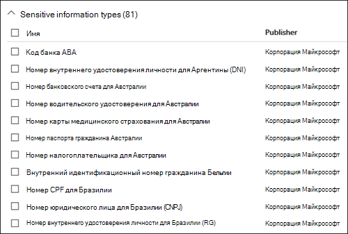
  
Когда политика защиты от потери данных проверяет наличие конфиденциальной информации, например номеров кредитных карт, она не просто ищет шестнадцатизначные числа.When a DLP policy looks for a sensitive information type such as a credit card number, it doesn't simply look for a 16-digit number. Каждый тип конфиденциальных данных определяется и обнаруживается при помощи следующего:Each sensitive information type is defined and detected by using a combination of:
  
- Ключевые слова.Keywords.
    
- Внутренние функции для проверки контрольных сумм или структуры.Internal functions to validate checksums or composition.
    
- Оценка регулярных выражений для выявления совпадений с шаблонами.Evaluation of regular expressions to find pattern matches.
    
- Анализа прочего содержимого.Other content examination.
    
Это помогает обеспечить высокую точность обнаружения и уменьшить количество ложных срабатываний, которые могут помешать работе сотрудников.This helps DLP detection achieve a high degree of accuracy while reducing the number of false positives that can interrupt peoples' work.
  
#### ДействияActions

Если содержимое соответствует условию правила, вы можете применить определенные действия, чтобы автоматически защитить контент.When content matches a condition in a rule, you can apply actions to automatically protect the content.
  

  
В настоящее время доступны перечисленные ниже действия.With the actions now available, you can:
  
- **Ограничьте доступ к содержимому** В зависимости от потребностей доступ к содержимому можно ограничить тремя способами:**Restrict access to the content** Depending on your need, you can restrict access to content in three ways:

  1. Ограничьте доступ к содержимому для всех пользователей.Restrict access to content for everyone.
  2. Ограничьте доступ к содержимому для пользователей за пределами организации.Restrict access to content for people outside the organization.
  3. Ограничьте доступ к содержимому до круга пользователей, у которых есть ссылка.Restrict access to "Anyone with the link."

  Применительно к содержимому сайта это означает ограничение разрешений на документ для всех пользователей, кроме главного администратора семейства веб-сайтов, владельца документа и пользователя, внесшего последнего изменения.For site content, this means that permissions for the document are restricted for everyone except the primary site collection administrator, document owner, and person who last modified the document. Эти пользователи могут удалять конфиденциальную информацию из документа или выполнять другие действия по устранению нарушений.These people can remove the sensitive information from the document or take other remedial action. Когда документ вновь будет соответствовать требованиям, исходные разрешения будут автоматически восстановлены.When the document is in compliance, the original permissions are automatically restored. Если доступ к документу заблокирован, документ отображается в библиотеке на сайте со специальным значком подсказки политики.When access to a document is blocked, the document appears with a special policy tip icon in the library on the site. 
    
  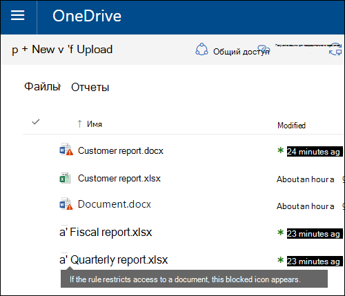
  
  Для контента электронной почты это действие запрещает отправку соответствующего сообщения.For email content, this action blocks the message from being sent. В зависимости от того, как настроено правило защиты от потери данных, отправитель либо получит отчет о недоставке, либо (если в правиле настроено уведомление) подсказку политики или уведомление по электронной почте.Depending on how the DLP rule is configured, the sender sees an NDR or (if the rule uses a notification) a policy tip and/or email notification.
    
  
  
#### Уведомления и переопределения пользователейUser notifications and user overrides

С помощью уведомлений и переопределений вы можете рассказать пользователям о политиках защиты от потери данных и о том, как обеспечить соответствие требованиям, не мешая своей работе.You can use notifications and overrides to educate your users about DLP policies and help them remain compliant without blocking their work. Например, если пользователь пытается предоставить доступ к документу, содержащему конфиденциальную информацию, политика защиты от потери данных может отправить ему уведомление по электронной почте либо в контексте библиотеки документов отобразить подсказку политики, которая позволяет переопределить политику при наличии веской деловой причины.For example, if a user tries to share a document containing sensitive information, a DLP policy can both send them an email notification and show them a policy tip in the context of the document library that allows them to override the policy if they have a business justification.
  

  
Электронное письмо может содержать уведомление для пользователя, который отправил контент, поделился им или внес в него последние изменения. Если речь идет о содержимом сайта, уведомление также может быть отправлено главному администратору семейства веб-сайтов и владельцу документа.The email can notify the person who sent, shared, or last modified the content and, for site content, the primary site collection administrator and document owner. Кроме того, вы можете добавить в уведомление электронной почты нужных получателей или удалить их оттуда.In addition, you can add or remove whomever you choose from the email notification.
  
Помимо отправки сообщения по электронной почте уведомление для пользователя сопровождается подсказкой политики:In addition to sending an email notification, a user notification displays a policy tip:
  
- В Outlook и в Outlook в Интернете.In Outlook and Outlook on the web.
    
- Для документа на сайте SharePoint Online или OneDrive для бизнеса.For the document on a SharePoint Online or OneDrive for Business site.
    
- В Excel, PowerPoint и Word, когда документ хранится на сайте, на который распространяется действие политики защиты от потери данных.In Excel, PowerPoint, and Word, when the document is stored on a site included in a DLP policy.
    
В уведомлении, отправляемом по электронной почте, и в подсказке политики объясняется, почему контент нарушает политику защиты от потери данных.The email notification and policy tip explain why content conflicts with a DLP policy. При желании можно сделать так, чтобы уведомления по электронной почте и подсказки политики разрешали пользователям переопределить правило, сообщив о ложном срабатывании или указав бизнес-обоснование.If you choose, the email notification and policy tip can allow users to override a rule by reporting a false positive or providing a business justification. Это поможет вам рассказать пользователям о политиках защиты от потери данных и применять их, не мешая пользователям выполнять свою работу.This can help you educate users about your DLP policies and enforce them without preventing people from doing their work. Сведения о случаях переопределения и ложных срабатываниях также сохраняются для отчетов (см. раздел, посвященный отчетам системы защиты от потери данных, ниже) и включаются в отчеты об инцидентах (см. следующий раздел), чтобы сотрудник, ответственный за обеспечение соответствия требованиям, регулярно мог просматривать эти данные.Information about overrides and false positives is also logged for reporting (see below about the DLP reports) and included in the incident reports (next section), so that the compliance officer can regularly review this information.
  
Вот как выглядит подсказка политики в учетной записи OneDrive для бизнеса:Here's what a policy tip looks like in a OneDrive for Business account.
  
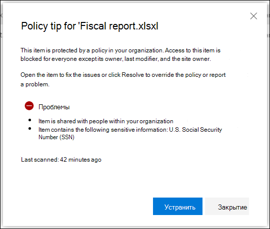

 Дополнительные сведения об уведомлениях для пользователей и подсказках политик защиты от потери данных см. в статье [Использование уведомлений и подсказок политики](use-notifications-and-policy-tips.md).To learn more about user notifications and policy tips in DLP policies, see [Use notifications and policy tips](use-notifications-and-policy-tips.md).

#### Отчеты об инцидентахIncident reports

В случае совпадения с правилом вы можете отправить отчет с подробными сведениями об инциденте лицу, ответственному за соответствие требованиям (или любому другому пользователю).When a rule is matched, you can send an incident report to your compliance officer (or any people you choose) with details of the event. Отчет содержит информацию об объекте, попавшем под действие правила, фактическом элементе контента, а также имени пользователя, которым последним вносил в него изменения.This report includes information about the item that was matched, the actual content that matched the rule, and the name of the person who last modified the content. Для электронных писем в отчет включается исходное сообщение, для которого сработала политика защиты от потери данных.For email messages, the report also includes as an attachment the original message that matches a DLP policy.
  
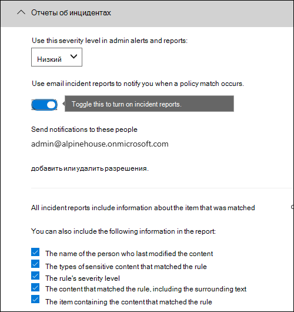

DLP сканирует электронную почту иначе, чем элементы в SharePoint Online или OneDrive для бизнеса.DLP scans email differently from items in SharePoint Online or OneDrive for Business. В SharePoint Online и OneDrive для бизнеса DLP сканирует как существующие, так и новые элементы и генерирует отчет об инцидентах при обнаружении совпадения.In SharePoint Online and OneDrive for Business, DLP scans existing items as well as new ones and generates an incident report whenever a match is found. В Exchange Online DLP сканирует новые сообщения электронной почты и создает отчет только в случае совпадения политики.In Exchange Online, DLP only scans new email messages and generates a report if there is a policy match. DLP ***не*** сканирует и не сопоставляет ранее существующие элементы электронной почты, которые хранятся в почтовом ящике или архиве.DLP ***does not*** scan or match previously existing email items that are stored in a mailbox or archive.
  
## Группирование и логические операторыGrouping and logical operators

Зачастую требования политик защиты от потери данных совсем просты: например, иногда достаточно выявлять весь контент, содержащий номера социального страхования (SNN) США.Often your DLP policy has a straightforward requirement, such as to identify all content that contains a U.S. Social Security Number. В других случаях данные, которые нужно защитить, определяются гораздо шире.However, in other scenarios, your DLP policy might need to identify more loosely defined data.
  
Например, для выявления контента, попадающего под действие акта о передаче и защите данных учреждений здравоохранения HIPAA (США), нужно найти:For example, to identify content subject to the U.S. Health Insurance Act (HIPAA), you need to look for:
  
- данные, которые содержат определенные типы конфиденциальной информации, например номера социального страхования (SSN) или номера Управления по борьбе с наркотиками США (DEA);Content that contains specific types of sensitive information, such as a U.S. Social Security Number or Drug Enforcement Agency (DEA) Number.
    
    ИAND
    
- контент, который определить сложнее, например записи об уходе за пациентом или описания оказанных медицинских услуг.Content that's more difficult to identify, such as communications about a patient's care or descriptions of medical services provided. Чтобы выявить такие данные, потребуется выполнить поиск по очень большим спискам ключевых слов, например по Международной классификации болезней (ICD-9-CM или ICD-10-CM).Identifying this content requires matching keywords from very large keyword lists, such as the International Classification of Diseases (ICD-9-CM or ICD-10-CM).
    
Группировки и логические операторы (И, ИЛИ) помогают отобрать такие широко определяемые данные.You can easily identify such loosely defined data by using grouping and logical operators (AND, OR). При создании политики защиты от потери данных можно:When you create a DLP policy, you can:
  
- сгруппировать типы конфиденциальной информации;Group sensitive information types.
    
- выбрать логические операторы, применяемые к типам конфиденциальной информации внутри группы и к самим группам.Choose the logical operator between the sensitive information types within a group and between the groups themselves.
    
### Выбор внутригруппового оператораChoosing the operator within a group

Для группы можно указать, должны ли быть выполнены все условия, чтобы сработало правило, или достаточно выполнения хотя бы одного из условий.Within a group, you can choose whether any or all of the conditions in that group must be satisfied for the content to match the rule.
  

  
### Добавление группыAdding a group

Вы можете быстро добавить группу, содержащую собственные условия и внутригрупповой оператор.You can quickly add a group, which can have its own conditions and operator within that group.
  

  
### Выбор межгруппового оператораChoosing the operator between groups

Для нескольких групп вы можете указать, должны ли выполняться условия во всех группах или только в одной из них, чтобы правило применялось к контенту.Between groups, you can choose whether the conditions in just one group or all of the groups must be satisfied for the content to match the rule.
  
Например, во встроенной политике \*\*акта HIPAA \*\* есть правило, в котором между группами используется оператор **AND** (И). С его помощью отбирают контент, который:For example, the built-in **U.S. HIPAA** policy has a rule that uses an **AND** operator between the groups so that it identifies content that contains: 
  
- относится к группе **Идентификаторы личных сведений** (содержит хотя бы один SSN **ИЛИ** номер DEA)from the group **PII Identifiers** (at least one SSN number **OR** DEA number) 
    
    **И****AND**
    
- к группе **Медицинские термины** (содержит хотя бы одно ключевое слово из ICD-9-CM **ИЛИ** ICD-10-CM).from the group **Medical Terms** (at least one ICD-9-CM keyword **OR** ICD-10-CM keyword) 
    
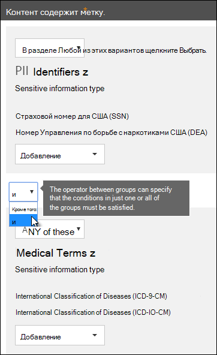
  
## Приоритет обработки правилThe priority by which rules are processed

При создании правил политики им назначается приоритет в порядке создания: первое правило получает высший приоритет, второе — второй и т. д.When you create rules in a policy, each rule is assigned a priority in the order in which it's created — meaning, the rule created first has first priority, the rule created second has second priority, and so on. 
  
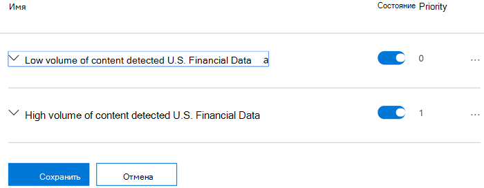
  
После настройки нескольких политик защиты от потери данных вы можете изменить приоритет одной или нескольких политик.After you have set up more than one DLP policy, you can change the priority of one or more policies. Для этого выберите какую-либо политику, щелкните **Изменить политику** и в списке **Приоритет** укажите приоритет политики.To do that, select a policy, choose **Edit policy**, and use the **Priority** list to specify its priority.

При проверке соответствия контента правилам правила обрабатываются в порядке их приоритета.When content is evaluated against rules, the rules are processed in priority order. Если контент соответствует нескольким правилам, применяется правило с самым строгим действием и самым высоким приоритетом.If content matches multiple rules, the rules are processed in priority order and the most restrictive action is enforced. Например, если контент соответствует всем перечисленным ниже правилам, применяется правило 3, так как это самое строгое правило с самым высоким приоритетом:For example, if content matches all of the following rules, Rule 3 is enforced because it's the highest priority, most restrictive rule:
  
- Правило 1: только уведомляет пользователейRule 1: only notifies users
    
- Правило 2: уведомляет пользователей, ограничивает доступ и разрешает переопределенияRule 2: notifies users, restricts access, and allows user overrides
    
- Правило 3: уведомляет пользователей, ограничивает доступ и не разрешает переопределенияRule 3: notifies users, restricts access, and does not allow user overrides
    
- Правило 4: только уведомляет пользователейRule 4: only notifies users
    
- Правило 5: ограничивает доступRule 5: restricts access
    
- Правило 6: уведомляет пользователей, ограничивает доступ и не разрешает переопределенияRule 6: notifies users, restricts access, and does not allow user overrides
    
Обратите внимание на то, что все соответствия правилам регистрируются в журналах аудита и отображаются в отчетах защиты от потери данных, хотя применяется только самое строгое правило.In this example, note that matches for all of the rules are recorded in the audit logs and shown in the DLP reports, even though only the most restrictive rule is enforced.
  
Необходимо учитывать перечисленные ниже моменты, касающиеся подсказок политик.Regarding policy tips, note that:
  
- Подсказка политики отображается только для самого строгого правила с самым высоким приоритетом.Only the policy tip from the highest priority, most restrictive rule will be shown. Например, вместо подсказки для правила, которое только отправляет уведомление, будет показана подсказка политики для правила, блокирующего доступ к контенту.For example, a policy tip from a rule that blocks access to content will be shown over a policy tip from a rule that simply sends a notification. Это позволяет избежать вывода сразу нескольких подсказок политики.This prevents people from seeing a cascade of policy tips.
    
- Если подсказки политики самого строгого правила разрешают пользователям переопределять его, то также будут переопределены все остальные правила, которым соответствует контент.If the policy tips in the most restrictive rule allow people to override the rule, then overriding this rule also overrides any other rules that the content matched.
    
## Настройка более или менее строгих правилTuning rules to make them easier or harder to match

После создания и включения политик защиты от потери данных иногда могут возникать указанные ниже проблемы.After people create and turn on their DLP policies, they sometimes run into these issues:
  
- Правилам соответствует слишком больше количество контента, **не являющегося** конфиденциальным, то есть возникает слишком много ложных срабатываний.Too much content that **is not** sensitive information matches the rules — in other words, too many false positives. 
    
- Правилам соответствует слишком малое количество контента, который **является** конфиденциальной информацией.Too little content that **is** sensitive information matches the rules. Другими словами, в этом случае не применяются защитные действия для конфиденциальной информации.In other words, the protective actions aren't being enforced on the sensitive information. 
    
Чтобы решить эти проблемы, можно настроить правила, изменив количество экземпляров и точность совпадений.To address these issues, you can tune your rules by adjusting the instance count and match accuracy to make it harder or easier for content to match the rules. Эти параметры можно задать для каждого типа конфиденциальной информации, который используется в правиле.Each sensitive information type used in a rule has both an instance count and match accuracy.
  
### Число экземпляровInstance count

Это количество экземпляров определенного типа конфиденциальной информации, которые должны присутствовать в контенте.Instance count means simply how many occurrences of a specific type of sensitive information must be present for content to match the rule. Например, контент будет соответствовать приведенному ниже правилу, если выявлено от 1 до 9 уникальныхFor example, content matches the rule shown below if between 1 and 9 unique U.S. or U.K. номеров паспортов США или Соединенного Королевства.passport numbers are identified.
  
Обратите внимание, что количество экземпляров включает только **уникальные** совпадения для типов конфиденциальной информации и ключевых слов.Note that the instance count includes only **unique** matches for sensitive information types and keywords. Например, если в сообщении электронной почты 10 раз упоминается один номер кредитной карты, это будет считаться одним совпадением.For example, if an email contains 10 occurrences of the same credit card number, those 10 occurrences count as a single instance of a credit card number. 
  
Настроить количество экземпляров очень просто.To use instance count to tune rules, the guidance is straightforward:
  
- Чтобы правило стало менее строгим, уменьшите **минимальное** или увеличьте **максимальное** количество.To make the rule easier to match, decrease the **min** count and/or increase the **max** count. Вы также можете задать для параметра **максимум** значение **любое**, удалив число.You can also set **max** to **any** by deleting the numerical value. 
    
- Чтобы сделать правило более строгим, увеличьте **минимальное** количество.To make the rule harder to match, increase the **min** count. 
    
Обычно для правил с небольшим количеством экземпляров (например, 1–9) используются менее строгие действия, например отправка уведомлений пользователям.Typically, you use less restrictive actions, such as sending user notifications, in a rule with a lower instance count (for example, 1-9). Более строгие действия, например ограничение доступа к контенту без возможности переопределения, применяются для правил с большим количеством экземпляров (например, от 10).And you use more restrictive actions, such as restricting access to content without allowing user overrides, in a rule with a higher instance count (for example, 10-any).
  

  
### Точность совпаденияMatch accuracy

Как говорилось выше, каждый тип конфиденциальных данных определяется на основе свидетельств различного типа.As described above, a sensitive information type is defined and detected by using a combination of different types of evidence. Как правило, тип конфиденциальной информации определяется несколькими такими сочетаниями, которые называются шаблонами.Commonly, a sensitive information type is defined by multiple such combinations, called patterns. Шаблон, который требует меньше свидетельств, имеет более низкую точность совпадения (вероятность), чем шаблон, требующий больше свидетельств.A pattern that requires less evidence has a lower match accuracy (or confidence level), while a pattern that requires more evidence has a higher match accuracy (or confidence level). Дополнительные сведения о фактических шаблонах и вероятностях, используемых для каждого типа конфиденциальной информации, см. в статье [Определения объектов типов конфиденциальной информации](sensitive-information-type-entity-definitions.md).To learn more about the actual patterns and confidence levels used by every sensitive information type, see [Sensitive information type entity definitions](sensitive-information-type-entity-definitions.md).
  
Например, тип конфиденциальной информации для номеров кредитных карт определяется двумя шаблонами:For example, the sensitive information type named Credit Card Number is defined by two patterns:
  
- Шаблон с вероятностью 65%, для которого требуются:A pattern with 65% confidence that requires:
    
  - Число в формате номера кредитной карты.A number in the format of a credit card number.
    
  - Число, соответствующее контрольной сумме.A number that passes the checksum.
    
- Шаблон с вероятностью 85%, для которого требуются:A pattern with 85% confidence that requires:
    
  - Число в формате номера кредитной карты.A number in the format of a credit card number.
    
  - Число, соответствующее контрольной сумме.A number that passes the checksum.
    
  - Ключевое слово или дата окончания срока действия в правильном формате.A keyword or an expiration date in the right format.
    
Эти значения вероятности (точности совпадения) можно использовать в правилах.You can use these confidence levels (or match accuracy) in your rules. Обычно для правил с низкой точностью совпадения используются менее строгие действия, такие как отправка уведомлений пользователям.Typically, you use less restrictive actions, such as sending user notifications, in a rule with lower match accuracy. Более строгие действия, например ограничение доступа к контенту без возможности переопределения, применяются для правил с высокой точностью совпадения.And you use more restrictive actions, such as restricting access to content without allowing user overrides, in a rule with higher match accuracy.
  
Важно понимать, что при выявлении определенного типа конфиденциальной информации, например номера кредитной карты, система возвращает только одно значение вероятности.It's important to understand that when a specific type of sensitive information, such as a credit card number, is identified in content, only a single confidence level is returned:
  
- Если все совпадения соответствуют одному шаблону, система возвращает значение вероятности для этого шаблона.If all of the matches are for a single pattern, the confidence level for that pattern is returned.
    
- Если совпадают несколько шаблонов (т. е. имеются совпадения с разными значениями вероятности), система возвращает более высокое значение вероятности, чем у каждого из шаблонов.If there are matches for more than one pattern (that is, there are matches with two different confidence levels), a confidence level higher than any of the single patterns alone is returned. Важно обратить внимание на это.This is the tricky part. Например, если для кредитной карты совпали шаблоны с вероятностью 65 и 85%, для этого типа конфиденциальной информации возвращается точность совпадения более 90%, так как чем больше свидетельств, тем точнее определение.For example, for a credit card, if both the 65% and 85% patterns are matched, the confidence level returned for that sensitive information type is greater than 90% because more evidence means more confidence.
    
Поэтому если вы хотите создать два взаимоисключающих правила для кредитных карт с точностью 65 и 85%, диапазоны точности совпадения будут такими:So if you want to create two mutually exclusive rules for credit cards, one for the 65% match accuracy and one for the 85% match accuracy, the ranges for match accuracy would look like this. Первое правило получает только результаты для шаблона с вероятностью 65%.The first rule picks up only matches of the 65% pattern. Второе правило получает **по крайней мере один** результат с вероятностью 85 % и **может** получить результаты с более низкой вероятностью.The second rule picks up matches with **at least one** 85% match and **can potentially have** other lower-confidence matches. 
  

  
По этой причине при создании правил с разной точностью совпадения соблюдайте указанные ниже рекомендации.For these reasons, the guidance for creating rules with different match accuracies is:
  
- Для самой низкой вероятности обычно используется одинаковые **минимальное** и **максимальное** значения (не диапазон).The lowest confidence level typically uses the same value for **min** and **max** (not a range). 
    
- Для самой высокой вероятности, как правило, используется диапазон от нижнего значения вероятности до 100.The highest confidence level is typically a range from just above the lower confidence level to 100.
    
- Промежуточные уровни вероятности обычно либо чуть выше самой низкой вероятности, либо чуть ниже самой высокой вероятности.Any in-between confidence levels typically range from just above the lower confidence level to just below the higher confidence level.
    
## Использование метки хранения в качестве условия в политике защиты от потери данныхUsing a retention label as a condition in a DLP policy

При использовании ранее созданной и опубликованной [метки хранения](labels.md) в качестве условия в политике защиты от потери данных необходимо учитывать следующие моменты:When you use a previously created and published [retention label](labels.md) as a condition in a DLP policy, there are some things to be aware of:

- Необходимо создать, опубликовать и применить метку хранения перед попыткой ее использования в качестве условия в политике защиты от потери данных.You have to have previously created, published and applied the retention label before you attempt to use it as a condition in a DLP policy.
- После создания и публикации меток хранения может потребоваться до одного дня на ее синхронизацию и до семи дней на автоматическое применение.Retention labels can take up to a day to sync and up to seven days to auto-apply after they have been created and published. Подробные сведения см. в разделе [Срок вступления меток хранения в силу](create-retention-labels.md#how-long-it-takes-for-retention-labels-to-take-effect).See, [How long it takes for retention labels to take effect](create-retention-labels.md#how-long-it-takes-for-retention-labels-to-take-effect) for detailed information.
- Использование метки хранения в политике ***поддерживается только для элементов в SharePoint Online и OneDrive для бизнеса***.Using a retention label in a policy ***is only supported for items in SharePoint Online and OneDrive for Business***.

  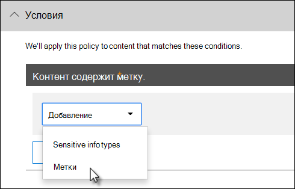

  Вы можете использовать метку хранения в политике защиты от потери данных, если у вас есть элементы, предназначенные для хранения и ликвидации, и вы хотите применить к ним другие элементы управления, например:You might want to use a retention label in a DLP policy if you have items that are under retention and disposition, and you also want to apply other controls to them, for example:

  - Вы опубликовали метку хранения под названием **налоговый 2018 год**, которая после применения к налоговым документам за 2018 г., находящимся в SharePoint, обеспечивает их сохранение в течение 10 лет с последующим удалением.You published a retention label named **tax year 2018**, which when applied to tax documents from 2018 that are stored in SharePoint retains them for 10 years then disposes of them. Кроме того, вы не хотите, чтобы эти элементы рассылались за пределы вашей организации, что можно сделать с помощью политики защиты от потери данных.You also don't want those items being shared outside your organization, which you can do with a DLP policy.

  > [!IMPORTANT]
  > Вы столкнетесь с этой ошибкой, если укажете метку хранения в качестве условия в политике защиты от потери данных и добавите Exchange и/или Teams в качестве расположения: **"Защита содержимого с метками в электронной почте и сообщениях Teams не поддерживается. Удалите метку ниже или отмените выбор расположений Exchange и Teams".**You'll get this error if you specify a retention label as a condition in a DLP policy and you also include Exchange and/or Teams as a location: **"Protecting labeled content in email and teams messages isn't supported. Either remove the label below or turn off Exchange and Teams as a location."** Это связано с тем, что транспорт Exchange не оценивает метаданные метки при отправке и доставке сообщения.This is because Exchange transport does not evaluate the label metadata during message submission and delivery. 

### Поддержка меток конфиденциальности появится в ближайшее времяSupport for sensitivity labels is coming

На данный момент в качестве условия можно использовать только метки хранения, а не [метки конфиденциальности](sensitivity-labels.md).You can currently use only a retention label as a condition, not a [sensitivity label](sensitivity-labels.md). Сейчас мы работаем над поддержкой меток конфиденциальности для этого условия.We're currently working on support for using a sensitivity label in this condition.
  
### Связь с другими функциямиHow this feature relates to other features

Контент, содержащий конфиденциальную информацию, допускает возможность применения нескольких функций.Several features can be applied to content containing sensitive information:
  
- И [метки хранения](labels.md#applying-a-retention-label-automatically-based-on-conditions), и [политика хранения](retention-policies.md) могут запускать действия **хранения** для этого контента.A [retention label](labels.md#applying-a-retention-label-automatically-based-on-conditions) and a [retention policy](retention-policies.md) can both enforce **retention** actions on this content. 
    
- Политика защиты от потери данных может применять действия **защиты** для этого контента.A DLP policy can enforce **protection** actions on this content. Для применения этих действий политике может потребоваться выполнение дополнительных условий (помимо наличия метки у контента).And before enforcing these actions, a DLP policy can require other conditions to be met in addition to the content containing a label. 
    

  
Обратите внимание: политика защиты от потери данных обеспечивает более широкие возможности для обнаружения, чем метка или политика хранения, примененные к конфиденциальной информации.Note that a DLP policy has a richer detection capability than a label or retention policy applied to sensitive information. Политика защиты от потери данных может применять действия защиты к контенту, содержащему конфиденциальную информацию, а в случае удаления конфиденциальной информации из контента отменять эти действия при следующей проверке контента.A DLP policy can enforce protective actions on content containing sensitive information, and if the sensitive information is removed from the content, those protective actions are undone the next time the content's scanned. Применение политики хранения или метки к контенту, содержащему конфиденциальную информацию, — однократное действие, которое не будет отменено даже в случае удаления этой информации.But if a retention policy or label is applied to content containing sensitive information, that's a one-time action that won't be undone even if the sensitive information is removed.
  
Используя метку в качестве условия в политике защиты от потери данных, можно применять как действия хранения, так и действия защиты к контенту, содержащему эту метку.By using a label as a condition in a DLP policy, you can enforce both retention and protection actions on content with that label. Контент, содержащий метку, можно воспринимать точно так же, как контент, содержащий конфиденциальную информацию, так как и метка, и тип конфиденциальной информации — это свойства, используемые для классификации контента, чтобы к нему можно было применять действия.You can think of content containing a label exactly like content containing sensitive information - both a label and a sensitive information type are properties used to classify content, so that you can enforce actions on that content.
  

  
## Простые и дополнительные параметрыSimple settings vs. advanced settings

При создании политики от защиты от потери данных можно выбирать простые или дополнительные параметры.When you create a DLP policy, you'll choose between simple or advanced settings:
  
- С помощью **простых параметров** можно легко создавать простые политики защиты от потери данных, не создавая и не редактируя правила с помощью редактора.**Simple settings** make it easy to create the most common type of DLP policy without using the rule editor to create or modify rules. 
    
- С помощью **дополнительных параметров** можно настраивать все аспекты применения политики в редакторе правил.**Advanced settings** use the rule editor to give you complete control over every setting for your DLP policy. 
    
По сути, простые и дополнительные параметры работают по одному принципу: они применяют правила, состоящие из условий и действий. Разница заключается в том, что при работе с простыми параметрами не отображается редактор правил.Don't worry, under the covers, simple settings and advanced settings work exactly the same, by enforcing rules comprised of conditions and actions -- only with simple settings, you don't see the rule editor. Это быстрый способ создания политики защиты от потери данных.It's a quick way to create a DLP policy.
  
### Простые параметрыSimple settings

Средства защиты от потери данных чаще всего используются для создания политик, которые предохраняют важную информацию от несанкционированного доступа к ней людей за пределами организации и реализуют соответствующие меры безопасности (например, блокируют доступ к контенту для определенных лиц, рассылают уведомления конечным пользователям и администраторам, а также позволяют проводить расследование происшествий).By far, the most common DLP scenario is creating a policy to help protect content containing sensitive information from being shared with people outside your organization, and taking an automatic remediating action such as restricting who can access the content, sending end-user or admin notifications, and auditing the event for later investigation. Инструменты защиты от потери данных позволяют исключить непреднамеренное раскрытие важных или конфиденциальных сведений.People use DLP to help prevent the inadvertent disclosure of sensitive information.
  
Чтобы облегчить эту задачу, при создании политики защиты от потери данных можно **использовать простые параметры**.To simplify achieving this goal, when you create a DLP policy, you can choose **Use simple settings**. В этом режиме вы можете создать политику, в которой есть все необходимое, не используя редактор правил.These settings provide everything you need to implement the most common DLP policy, without having to go into the rule editor.
  
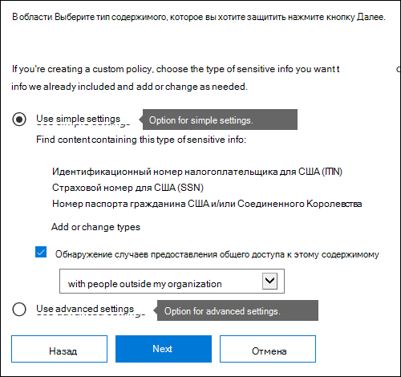
  
### Дополнительные параметрыAdvanced settings

Если вам необходимы расширенные настройки защиты от потери данных, **используйте дополнительные параметры**.If you need to create more customized DLP policies, you can choose **Use advanced settings**.
  
В этом режиме вам доступен редактор правил, в котором можно задать для каждого правила все возможные параметры, включая количество вхождений и точность совпадения (вероятность).The advanced settings present you with the rule editor, where you have full control over every possible option, including the instance count and match accuracy (confidence level) for each rule.
  
Чтобы быстро перейти к нужному разделу, выберите соответствующий элемент на верхней панели навигации редактора.To jump to a section quickly, click an item in the top navigation of the rule editor to go to that section below.
  
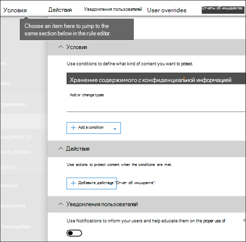
  
## Шаблоны политики защиты от потери данныхDLP policy templates

Первое действие при создании политики защиты от потери данных — выбор информации, которую нужно защитить.The first step in creating a DLP policy is choosing what information to protect. Использование шаблона защиты от потери данных позволяет не создавать новый набор правил с нуля и не выяснять, какие типы информации необходимо включить по умолчанию.By starting with a DLP template, you save the work of building a new set of rules from scratch, and figuring out which types of information should be included by default. Затем вы можете добавить или изменить требования для точной настройки правила в соответствии с требованиями организации.You can then add to or modify these requirements to fine tune the rule to meet your organization's specific requirements.
  
С помощью предварительно настроенного шаблона политики защиты от потери данных можно выявлять определенные типы конфиденциальной информации, например данные HIPAA, PCI-DSS, Акта Грэма-Лича-Блили или даже личные сведения в зависимости от региона.A preconfigured DLP policy template can help you detect specific types of sensitive information, such as HIPAA data, PCI-DSS data, Gramm-Leach-Bliley Act data, or even locale-specific personally identifiable information (P.I.). Чтобы упростить поиск и защиту распространенных типов конфиденциальной информации, шаблоны политик, включенные в Microsoft 365, уже содержат самые распространенные типы конфиденциальной информации, необходимые для начала работы.To make it easy for you to find and protect common types of sensitive information, the policy templates included in Microsoft 365 already contain the most common sensitive information types necessary for you to get started.
  
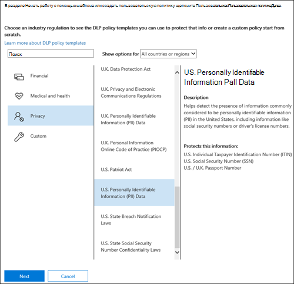
  
У вашей организации могут быть собственные уникальные требования. В этом случае вы можете создать политику защиты от потери данных с нуля, выбрав вариант **Пользовательская политика**.Your organization may also have its own specific requirements, in which case you can create a DLP policy from scratch by choosing the **Custom policy** option. Настраиваемая политика создается с нуля и не содержит никаких готовых правил.A custom policy is empty and contains no premade rules. 
  
## Постепенное внедрение политик защиты от потери данных с помощью тестового режимаRoll out DLP policies gradually with test mode

При создании политик защиты от потери данных следует внедрять их постепенно, чтобы оценить их влияние и эффективность перед полноценным развертыванием.When you create your DLP policies, you should consider rolling them out gradually to assess their impact and test their effectiveness before fully enforcing them. Например, нежелательно, чтобы новая политика защиты от потери данных случайно заблокировала доступ к тысячам документов, которые нужны пользователям в рабочих целях.For example, you don't want a new DLP policy to unintentionally block access to thousands of documents that people require access to in order to get their work done.
  
При создании политик защиты от потери данных с потенциально мощным влиянием рекомендуется выполнить указанные ниже действия.If you're creating DLP policies with a large potential impact, we recommend following this sequence:
  
1. **Начните работу в тестовом режиме без подсказок политики**, а затем оцените влияние политики с помощью отчетов системы защиты от потери данных и отчетов об инцидентах.**Start in test mode without Policy Tips** and then use the DLP reports and any incident reports to assess the impact. В них содержатся сведения о количестве, расположении, типе и серьезности совпадений.You can use DLP reports to view the number, location, type, and severity of policy matches. Вы можете настроить правила с учетом результатов.Based on the results, you can fine tune the rules as needed. В тестовом режиме политики защиты от потери данных не влияют на производительность сотрудников вашей организации.In test mode, DLP policies will not impact the productivity of people working in your organization. 
    
2. **Move to Test mode with notifications and Policy Tips** so that you can begin to teach users about your compliance policies and prepare them for the rules that are going to be applied.**Move to Test mode with notifications and Policy Tips** so that you can begin to teach users about your compliance policies and prepare them for the rules that are going to be applied. At this stage, you can also ask users to report false positives so that you can further refine the rules.At this stage, you can also ask users to report false positives so that you can further refine the rules. 
    
3. **Начните применять политики в полном объеме**, чтобы защищать контент с помощью действий, заданных в правилах.**Start full enforcement on the policies** so that the actions in the rules are applied and the content's protected. Продолжайте отслеживать отчеты системы защиты от потери данных и все отчеты об инцидентах или уведомления, чтобы убедиться в соответствии результатов вашим потребностям.Continue to monitor the DLP reports and any incident reports or notifications to make sure that the results are what you intend. 

    

    Вы можете в любой момент отключить политику защиты от потери данных. При этом будут отключены все правила в политике.You can turn off a DLP policy at any time, which affects all rules in the policy. Тем не менее каждое правило можно отключить отдельно от других, переключив его состояние в редакторе правил.However, each rule can also be turned off individually by toggling its status in the rule editor.

    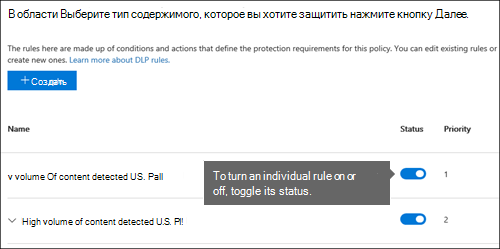

    Вы также можете изменить приоритет нескольких правил в политике.You can also change the priority of multiple rules in a policy. Чтобы сделать это, откройте политику для редактирования.To do that, open a policy for editing. В строке правила щелкните многоточие (**...**) и выберите один из вариантов, например **Переместить вниз** или **Поместить в конец**.In a row for a rule, choose the ellipses (**...**), and then choose an option, such as **Move down** or **Bring to last**.

    
  
## Отчеты DLPDLP reports

После создания и включения политик защиты от потери данных вам потребуется убедиться, что они работают так, как нужно, и помогают обеспечивать соответствие требованиям.After you create and turn on your DLP policies, you'll want to verify that they're working as you intended and helping you stay compliant. В отчетах политики защиты от потери данных можно быстро просмотреть количество срабатываний политик и правил, а также количество ложных срабатываний и переопределений.With DLP reports, you can quickly view the number of DLP policy and rule matches over time, and the number of false positives and overrides. Для каждого отчета можно отфильтровать эти совпадения по расположению, временному интервалу или даже конкретной политике, правилу или действию.For each report, you can filter those matches by location, time frame, and even narrow it down to a specific policy, rule, or action.
  
С помощью отчетов защиты от потери данных можно получить важные данные, а также:With the DLP reports, you can get business insights and:
  
- Сконцентрироваться на определенных временных промежутках и определить причины скачков и тенденций.Focus on specific time periods and understand the reasons for spikes and trends.
    
- Выявить бизнес-процессы, которые нарушают политики соответствия требованиям вашей организации.Discover business processes that violate your organization's compliance policies.
    
- Определить влияние политик защиты от потери данных на работу вашей организации.Understand any business impact of the DLP policies.
    
Кроме того, вы можете использовать отчеты для точной настройки политик защиты от потери данных во время их работы.In addition, you can use the DLP reports to fine tune your DLP policies as you run them.
  

  
## Принципы работы политик защиты от потери данныхHow DLP policies work

Политика определяет конфиденциальные сведения с помощью глубокого анализа содержимого (а не простого сканирования текста).DLP detects sensitive information by using deep content analysis (not just a simple text scan). Для выявления содержимого, нарушающего ваши политики защиты от потери данных, при углубленном анализе применяются ключевые слова, словарные совпадения, оценка регулярных выражений, внутренние функции и другие методы.This deep content analysis uses keyword matches, dictionary matches, the evaluation of regular expressions, internal functions, and other methods to detect content that matches your DLP policies. Ожидается, что лишь небольшой процент данных будет считаться конфиденциальной информацией.Potentially only a small percentage of your data is considered sensitive. Политика защиты от потери данных может выявлять, отслеживать и автоматически защищать только эти данные, не мешая работе пользователей с остальным контентом.A DLP policy can identify, monitor, and automatically protect just that data, without impeding or affecting people who work with the rest of your content.
  
### Политики синхронизируютсяPolicies are synced

После создания политики защиты от потери данных в Центре безопасности и соответствия требованиям она сохраняется в центральном хранилище политик, а затем синхронизируется с различными источниками контента, включая следующие:After you create a DLP policy in the Security &amp; Compliance Center, it's stored in a central policy store, and then synced to the various content sources, including:
  
- Exchange Online и оттуда в Outlook в Интернете и Outlook;Exchange Online, and from there to Outlook on the web and Outlook.
    
- Сайты OneDrive для бизнеса.OneDrive for Business sites.
    
- Сайты SharePoint Online.SharePoint Online sites.
    
- Классические приложения Office (Excel, PowerPoint и Word).Office desktop programs (Excel, PowerPoint, and Word).

- Сообщениях каналов и чата Microsoft Teams.Microsoft Teams channels and chat messages.
    
После синхронизации политики с нужными расположениями она начинает оценивать контент и выполнять действия.After the policy's synced to the right locations, it starts to evaluate content and enforce actions.
<!-- what is the time delay for first deployment of a policy and what is the sync schedule? -->
  
### Оценки политики на сайтах OneDrive для бизнеса и SharePoint OnlinePolicy evaluation in OneDrive for Business and SharePoint Online sites

Документы на всех ваших сайтах SharePoint Online и OneDrive для бизнеса постоянно изменяются — их непрерывно создают, редактируют, совместно используют, перемещают и т. д.Across all of your SharePoint Online sites and OneDrive for Business sites, documents are constantly changing — they're continually being created, edited, shared, and so on. Это означает, что в любой момент документы могут нарушить политику защиты от потери данных или вновь начать соответствовать ей.This means documents can conflict or become compliant with a DLP policy at any time. Например, пользователь может выложить на сайт группы документ, не содержащий конфиденциальной информации, но затем другой пользователь может изменить этот документ и добавить в него такие сведения.For example, a person can upload a document that contains no sensitive information to their team site, but later, a different person can edit the same document and add sensitive information to it.
  
По этой причине политики защиты от потери данных регулярно проверяют документы на совпадения с политиками в фоновом режиме.For this reason, DLP policies check documents for policy matches frequently in the background. Это можно представить как асинхронный процесс оценки политики.You can think of this as asynchronous policy evaluation.
<!-- what is the frequency? looks like it is tied to the search crawl schedule -->
  
#### Принципы работыHow it works
 
По мере того как пользователи добавляют или редактируют документы на своих сайтах, поисковая система сканирует содержимое, чтобы его можно было найти позже.As people add or change documents in their sites, the search engine scans the content, so that you can search for it later. При этом система также сканирует контент на наличие конфиденциальной информации и предоставленного к нему доступа.While this is happening, the content's also scanned for sensitive information and to check if it's shared. Вся найденная конфиденциальная информация безопасно сохраняется в индексе поиска, чтобы она были доступна только группе специалистов по соответствию требованиям, а не обычным пользователям.Any sensitive information that's found is stored securely in the search index, so that only the compliance team can access it, but not typical users. Каждая включенная политика защиты от потери данных работает в фоновом режиме (асинхронно), регулярно проверяя контент на совпадения с условиями политики и применяя действия для защиты этого контента от непреднамеренного разглашения.Each DLP policy that you've turned on runs in the background (asynchronously), checking search frequently for any content that matches a policy, and applying actions to protect it from inadvertent leaks.
  

  
<!-- conflict with a DLP policy is bad wording -->
И, наконец, документы могут не только нарушать политику защиты от потери данных, но и вновь начать соответствовать ей.Finally, documents can conflict with a DLP policy, but they can also become compliant with a DLP policy. Например, если пользователь добавляет в документ номера кредитных карт, политика защиты от потери данных может автоматически заблокировать доступ к документу.For example, if a person adds credit card numbers to a document, it might cause a DLP policy to block access to the document automatically. Но если затем пользователь удалит конфиденциальную информацию, примененное ранее действие (в этом случае блокировка) будет отменено при следующей оценки политики.But if the person later removes the sensitive information, the action (in this case, blocking) is automatically undone the next time the document is evaluated against the policy.
  
Система защиты от потери данных оценивает любой контент, который можно индексировать.DLP evaluates any content that can be indexed. Дополнительные сведения о типах файлов, для которых по умолчанию выполняется обход контента, см. в статье [Анализируемые типы файлов и расширения имен файлов для обхода по умолчанию в SharePoint Server](https://docs.microsoft.com/SharePoint/technical-reference/default-crawled-file-name-extensions-and-parsed-file-types).For more information on what file types are crawled by default, see [Default crawled file name extensions and parsed file types in SharePoint Server](https://docs.microsoft.com/SharePoint/technical-reference/default-crawled-file-name-extensions-and-parsed-file-types).

> [!NOTE]
> Внешний общий доступ к новым файлам в SharePoint можно заблокировать по умолчанию, пока хотя бы одна политика защиты от потери данных не проверит новый элемент.External sharing of new files in SharePoint can be blocked by default until at least one DLP policy scans the new item. Подробные сведения см. в статье [По умолчанию помечать новые файлы как конфиденциальные](https://docs.microsoft.com/sharepoint/sensitive-by-default).See, [Mark new files as sensitive by default](https://docs.microsoft.com/sharepoint/sensitive-by-default) for detailed information. 
  
### Оценка политик в Exchange Online, Outlook и Outlook в ИнтернетеPolicy evaluation in Exchange Online, Outlook, and Outlook on the web

При создании политики защиты от потери данных, действие которой распространяется на Exchange Online как на расположение, эта параметры этой политики будут синхронизироваться из Центра безопасности и соответствия требованиям Office 365 в Exchange Online, а затем из Exchange Online в Outlook в Интернете и Outlook.When you create a DLP policy that includes Exchange Online as a location, the policy's synced from the Office 365 Security &amp; Compliance Center to Exchange Online, and then from Exchange Online to Outlook on the web and Outlook.
  
Когда пользователь создает сообщение в Outlook, система анализирует содержимое сообщения на соответствие политикам защиты от потери данных и отображает подсказки политик для пользователя.When a message is being composed in Outlook, the user can see policy tips as the content being created is evaluated against DLP policies. После отправки сообщения система проверяет его на соответствие политикам защиты от потери данных в рамках обычного потока обработки почты. Кроме того, система проверяет его на соответствие правилам потока обработки почты Exchange (правилам транспорта) и политикам защиты от потери данных, созданным в Центре администрирования Exchange.And after a message is sent, it's evaluated against DLP policies as a normal part of mail flow, along with Exchange mail flow rules (also known as transport rules) and DLP policies created in the Exchange admin center. Политики защиты от потери данных проверяют как само сообщение, так и все его вложения.DLP policies scan both the message and any attachments.
  
### Оценка политик в классических приложениях OfficePolicy evaluation in the Office desktop programs

<!-- same capability to identify sensitive information line conflates sensitive information types and such -->
В Excel, PowerPoint и Word имеются такие же возможности для выявления конфиденциальной информации и применения политик защиты от потери данных, что и в SharePoint Online и OneDrive для бизнеса.Excel, PowerPoint, and Word include the same capability to identify sensitive information and apply DLP policies as SharePoint Online and OneDrive for Business. Эти приложения Office синхронизируют свои политики защиты от потери данных непосредственно из центрального хранилища политик, а затем непрерывно проверяют контент на соответствие политикам, когда пользователи работают с документами, открытыми с сайта, включенного в политику.These Office programs sync their DLP policies directly from the central policy store, and then continuously evaluate the content against the DLP policies when people work with documents opened from a site that's included in a DLP policy.
  
Операции проверки, выполняемые политикой защиты от потери данных в Office, не влияют на производительность программ и эффективность работы сотрудников с контентом.DLP policy evaluation in Office is designed not to affect the performance of the programs or the productivity of people working on content. Если пользователь работает с большим документом или его компьютер занят, подсказка политики может появиться спустя несколько секунд.If they're working on a large document, or the user's computer is busy, it might take a few seconds for a policy tip to appear.

### Оценка политик в Microsoft TeamsPolicy evaluation in Microsoft Teams
 <!--what do you mean that it's synched to user accounts?  I thought DLP policies were applied to locations not users like sensitivity labels are  -->

Когда вы создаете политику защиты от потери данных, действие которой распространяется на Microsoft Teams, как на расположение, эта политика синхронизируется из Центра безопасности и соответствия требованиям Office 365 в учетные записи пользователей и сообщения в каналах и чатах Microsoft Teams.When you create a DLP policy that includes Microsoft Teams as a location, the policy's synced from the Office 365 Security &amp; Compliance Center to user accounts and Microsoft Teams channels and chat messages. В зависимости от параметров политик защиты от потери данных, когда какой-либо пользователь пытается поделиться конфиденциальной информацией в сообщении чата или канала Microsoft Teams, сообщение может быть заблокировано или отозвано.Depending on how DLP policies are configured, when someone attempts to share sensitive information in a Microsoft Teams chat or channel message, the message can be blocked or revoked. Кроме того, документы с конфиденциальной информацией, доступ к которым предоставлен гостевым (внешним) пользователям, не будут открываться для этих пользователей.And, documents that contain sensitive information and that are shared with guests (external users) won't open for those users. Дополнительные сведения см. в статье [Защита от потери данных и Microsoft Teams](dlp-microsoft-teams.md).To learn more, see [Data loss prevention and Microsoft Teams](dlp-microsoft-teams.md).
 
## РазрешенияPermissions

Участникам группы по обеспечению соответствия требованиям, которые будут создавать политики защиты от потери данных, потребуются разрешения для работы в Центре безопасности и соответствия требованиям.Members of your compliance team who will create DLP policies need permissions to the Security &amp; Compliance Center. По умолчанию администратор клиента имеет доступ к этому расположению и может предоставлять сотрудникам, ответственным за обеспечение соответствия требованиям, и другим пользователям доступ к Центру безопасности и соответствия требованиям, не предоставляя им все разрешения администратора клиента. Для этого рекомендуется выполнить указанные ниже действия.By default, your tenant admin will have access to this location and can give compliance officers and other people access to the Security &amp; Compliance Center, without giving them all of the permissions of a tenant admin. To do this, we recommend that you:
  
1. Создайте группу в Microsoft 365 и добавьте в нее сотрудников, ответственных за обеспечение соответствия требованиям.Create a group in Microsoft 365 and add compliance officers to it.
    
2. Создайте группу ролей на странице **Разрешения** в Центре безопасности и соответствия требованиям.Create a role group on the **Permissions** page of the Security &amp; Compliance Center. 

3. При создании группы ролей используйте раздел **Выбор ролей**, чтобы добавить следующую роль в группу ролей: **Управление соответствием требованиям защиты от потери данных**.While creating the role group, use the **Choose Roles** section to add the following role to the Role Group: **DLP Compliance Management**.
    
4. Используйте раздел **Выбор участников**, чтобы добавить созданную ранее группу Microsoft 365 в эту группу ролей.Use the **Choose Members** section to add the Microsoft 365 group you created before to the role group.

Также можно создать группу ролей, обладающую правами только для просмотра политик и отчетов DLP, включив роль**Только просмотр: управление соответствием требованиям защиты от потери данных**.You can also create a role group with view-only privileges to the DLP policies and DLP reports by granting the **View-Only DLP Compliance Management** role.

Дополнительные сведения см. в статье [Предоставление пользователям доступа к Центру безопасности и соответствия требованиям Office 365](../security/office-365-security/grant-access-to-the-security-and-compliance-center.md).For more information, see [Give users access to the Office 365 Compliance Center](../security/office-365-security/grant-access-to-the-security-and-compliance-center.md).
  
Эти разрешения необходимы только для создания и применения политики защиты от потери данных.These permissions are required only to create and apply a DLP policy. Для применения политики не требуется доступ к контенту.Policy enforcement does not require access to the content.
  
## Найдите командлеты для защиты от потери данныхFind the DLP cmdlets

Чтобы можно было использовать большинство командлетов в Центре безопасности и соответствия требованиям, необходимо выполнить указанные ниже действия.To use most of the cmdlets for the Security &amp; Compliance Center, you need to:
  
1. [Подключитесь к Центру безопасности и соответствия требованиям Office 365&amp; с помощью удаленного сеанса PowerShell](https://docs.microsoft.com/powershell/exchange/office-365-scc/connect-to-scc-powershell/connect-to-scc-powershell?view=exchange-ps).[Connect to the Office 365 Security &amp; Compliance Center using remote PowerShell](https://docs.microsoft.com/powershell/exchange/office-365-scc/connect-to-scc-powershell/connect-to-scc-powershell?view=exchange-ps).
    
2. Воспользуйтесь любыми из этих командлетов [policy-and-compliance-dlp cmdlets](https://docs.microsoft.com/powershell/module/exchange/export-dlppolicycollection?view=exchange-ps)Use any of these [policy-and-compliance-dlp cmdlets](https://docs.microsoft.com/powershell/module/exchange/export-dlppolicycollection?view=exchange-ps).
    
При этом, чтобы создавать отчеты со сведениями о защите от потери данных, системе потребуется получать данные из Microsoft 365, в том числе из Exchange Online.However, DLP reports need pull data from across Microsoft 365, including Exchange Online. По этой причине **командлеты для отчетов со сведениями о защите от потери данных доступны в Powershell в Exchange Online, а не только в Powershell в Центре безопасности и соответствия требованиям**.For this reason, **the cmdlets for the DLP reports are available in Exchange Online Powershell -- not in Security &amp; Compliance Center Powershell**. Поэтому, чтобы можно было использовать эти командлеты для отчетов со сведениями о защите от потери данных, необходимо выполнить указанные действия.Therefore, to use the cmdlets for the DLP reports, you need to:
  
1. [Подключитесь к Exchange Online с помощью удаленного сеанса PowerShell](https://docs.microsoft.com/powershell/exchange/exchange-online/connect-to-exchange-online-powershell/connect-to-exchange-online-powershell?view=exchange-ps).[Connect to Exchange Online using remote PowerShell](https://docs.microsoft.com/powershell/exchange/exchange-online/connect-to-exchange-online-powershell/connect-to-exchange-online-powershell?view=exchange-ps).
    
2. Используйте следующие командлеты для отчетов со сведениями о защите от потери данных:Use any of these cmdlets for the DLP reports:
    
    - [Get-DlpDetectionsReportGet-DlpDetectionsReport](https://docs.microsoft.com/powershell/module/exchange/Get-DlpDetectionsReport?view=exchange-ps)

    - [Get-DlpDetailReportGet-DlpDetailReport](https://docs.microsoft.com/powershell/module/exchange/Get-DlpDetailReport?view=exchange-ps)
    
## Дополнительные сведенияMore information

- [Создание политики защиты от потери данных на основе шаблонаCreate a DLP policy from a template](create-a-dlp-policy-from-a-template.md)
    
- [Отправка уведомлений и отображение подсказок политик защиты от потери данныхSend notifications and show policy tips for DLP policies](use-notifications-and-policy-tips.md)
    
- [Создание политики защиты от потери данных для защиты документов с помощью FCI или других свойствCreate a DLP policy to protect documents with FCI or other properties](protect-documents-that-have-fci-or-other-properties.md)
    
- [Что входит в шаблоны политики защиты от потери данныхWhat the DLP policy templates include](what-the-dlp-policy-templates-include.md)
    
- [Определения объектов типов конфиденциальной информацииSensitive information type entity definitions](sensitive-information-type-entity-definitions.md)
    
- [Сведения, для обнаружения которых используются функции защиты от потери данныхWhat the DLP functions look for](what-the-dlp-functions-look-for.md)
    
- [Создание пользовательского типа конфиденциальных данныхCreate a custom sensitive information type](create-a-custom-sensitive-information-type.md)
