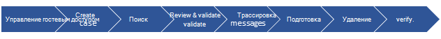
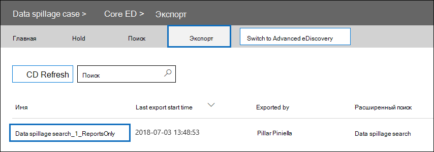

# Серия решений по обнаружению электронных данных: сценарий утечки данных — поиск и очистка

 **Что такое утечка данных и зачем это нужно?** Утечка данных — это когда конфиденциальный документ выходит в ненавязаемую среду. При обнаружении инцидента утечки данных важно быстро оценить размер и расположение разлива, изучить действия пользователей вокруг него, а затем окончательно очистить пролитые данные из системы. 
  
## Сценарий утечки данных

Вы ведущий сотрудник по информационной безопасности в Contoso. Вам сообщается о ситуации утечки данных, когда сотрудник непреднаученно делился конфиденциальным документом с несколькими людьми по электронной почте. Необходимо быстро оценить, кто получил этот документ внутри страны и извне. После идентифицированного анализа необходимо поделиться данными о случаях с другими следователями, а затем удалить их из Office 365. После завершения расследования необходимо создать отчет с доказательствами постоянного удаления и другими сведениями о случаях для любой будущей ссылки.
  
### Область этой статьи

В этом документе содержится список инструкций по постоянному удалению сообщения из Microsoft 365, чтобы оно было недоступным или восстановленным. Чтобы удалить сообщение и сделать его восстановленным до истечения срока хранения удаленных элементов, см. в статье Поиск и удаление сообщений электронной почты [в организации.](search-for-and-delete-messages-in-your-organization.md)
  
## Рабочий процесс по управлению инцидентами утечки данных

Вот как управлять инцидентом с утечкой данных:

  
[(Необязательный) Шаг 1. Управление доступом к делу и настройка границ соответствия требованиям](#optional-step-1-manage-who-can-access-the-case-and-set-compliance-boundaries) 
[Шаг 2. Создание дела об обнаружении электронной почты](#step-2-create-an-ediscovery-case) 
[Шаг 3. Поиск пролитой информации](#step-3-search-for-the-spilled-data) 
[Шаг 4. Проверка и проверка результатов рассмотрения](#step-4-review-and-validate-case-findings) 
[Шаг 5. Используйте журнал трассировки сообщений для проверки общего использования пролитой информации](#step-5-use-message-trace-log-to-check-how-spilled-data-was-shared) 
[Шаг 6. Подготовка почтовых ящиков](#step-6-prepare-the-mailboxes) 
[Шаг 7. Постоянное удаление пролитой информации](#step-7-permanently-delete-the-spilled-data) 
[Шаг 8. Проверка, предоставление доказательств удаления и аудит](#step-8-verify-provide-a-proof-of-deletion-and-audit) 

## Что нужно знать перед началом

- При удержании почтового ящика удаленное сообщение остается в папке "Извлекаемые элементы" до истечения срока хранения или освобождения удержания. [В шаге 6](#step-6-prepare-the-mailboxes) описывается, как удалить удержание из почтовых ящиков. Перед удалением удержания ознакомьтесь с управлением записями или юридическими отделами. В организации может быть политика, определяемая, имеет ли почтовый ящик приоритет в удержании или инцидент утечки данных. 
    
- Чтобы контролировать, какие почтовые ящики пользователя может искать и управлять тем, кто может получить доступ к делу, можно настроить границы соответствия требованиям и создать настраиваемую группу ролей, которая описана в шаге [1](#optional-step-1-manage-who-can-access-the-case-and-set-compliance-boundaries). Для этого необходимо быть членом группы ролей управления организацией или быть назначенной ролью управления ролью. Если вы или администратор в организации уже установили границы соответствия требованиям, вы можете пропустить шаг 1.
    
- Чтобы создать случай, необходимо быть членом группы ролей диспетчера электронных открытий или членом настраиваемой группы ролей, которая назначена роли управления случаем. Если вы не член, попросите администратора Microsoft 365 добавить вас в группу ролей диспетчера [eDiscovery.](assign-ediscovery-permissions.md)
    
- Создавать и выполнять поиск контента могут только члены группы ролей "Диспетчер eDiscovery" и пользователи с ролью "Управление поиском соответствия". Удалять сообщения могут только члены группы ролей "Управление организацией" и пользователи с ролью "Управление поиском и очисткой". Сведения о добавлении пользователей в группу ролей см. в статье [Назначение разрешений обнаружения электронных данных в Центре безопасности и соответствия требованиям](./assign-ediscovery-permissions.md).
    
- Для поиска действий по обнаружению электронных отчетов журнала аудита в шаге 8 необходимо включить аудит для вашей организации. Можно искать действия, которые были выполнены в течение последних 90 дней. Дополнительные сведения о том, как включить и использовать аудит, см. в разделе [Аудит](#auditing-the-data-spillage-investigation-process) процесса расследования утечки данных в шаге 8. 
    
## (Необязательный) Шаг 1. Управление доступом к делу и настройка границ соответствия требованиям

В зависимости от организационной практики необходимо контролировать, кто может получить доступ к делу об обнаружении электронных данных, используемом для расследования инцидента с утечкой данных, и установить границы соответствия требованиям. Самый простой способ сделать это — добавить следователей в качестве членов существующей группы ролей в Центре соответствия требованиям & безопасности, а затем добавить группу ролей в качестве участника дела об обнаружении электронных данных. Сведения о встроенных группах ролей по обнаружению электронных данных и о том, как добавить участников в дело об обнаружении электронных данных, см. в статью Назначение разрешений на открытие [электронных данных.](assign-ediscovery-permissions.md)
  
Вы также можете создать новую группу ролей, которая соответствует вашим организационным потребностям. Например, может потребоваться, чтобы группа исследователей утечки данных в организации могла получить доступ ко всем случаям утечки данных и сотрудничать с ними. Это можно сделать, создав группу ролей "Следователь утечки данных", назначив соответствующие роли (Экспорт, расшифровка RMS, Обзор, Предварительный просмотр, Поиск соответствия требованиям и управление случаем), добавив исследователей утечки данных в группу ролей, а затем добавив группу ролей в качестве участника дела об обнаружении утечки данных. Сведения [о том,](tagging-and-assessment-in-advanced-ediscovery.md) как это сделать, см. в Office 365 настройка границ соответствия требованиям. 
  
## Шаг 2. Создание дела об обнаружении электронной почты

Дело об обнаружении электронных данных обеспечивает эффективный способ управления расследованием утечки данных. Вы можете добавить участников в группу ролей, созданную в шаге 1, добавить группу ролей в качестве члена нового дела об обнаружении электронных данных, выполнить итеративные поиски, чтобы найти разлитые данные, экспортировать отчет для обмена, отслеживать состояние дела, а затем вернуться к деталям дела, если это необходимо. Рассмотрите возможность создания конвенции о наименовании для случаев обнаружения электронных данных, используемых для инцидентов с утечкой данных, и укайте как можно больше сведений в имени и описании случая, чтобы при необходимости можно было найти и сослаться на них в будущем.
  
Чтобы создать новый случай, можно использовать eDiscovery в центре безопасности и соответствия требованиям. Подробнее о создании нового дела см. в примере [Начало работы с core eDiscovery](get-started-core-ediscovery.md#step-3-create-a-core-ediscovery-case).
  
## Шаг 3. Поиск пролитой информации

Теперь, когда создан случай и управляемый доступ, вы можете использовать этот случай для итеративного поиска, чтобы найти разлитые данные и определить почтовые ящики, содержащие разлитые данные. Вы будете использовать тот же поисковый запрос, который использовался для поиска сообщений электронной почты для удаления этих же сообщений в [шаге 7](#step-7-permanently-delete-the-spilled-data).
  
Чтобы создать поиск контента, связанный с делом об обнаружении электронных обнаружений, см. в примере [Search for content in a Core eDiscovery case.](search-for-content-in-core-ediscovery.md)
  
> [!IMPORTANT]
> Ключевые слова, которые вы используете в поисковом запросе, могут содержать фактические пролитые данные, которые вы ищете. Например, если вы ищете документы, содержащие номер социального обеспечения, и используете его в качестве ключевого слова поиска, необходимо удалить запрос после этого, чтобы избежать дальнейшего разлива. Удаление [запроса поиска в](#deleting-the-search-query) шаге 8.
  
## Шаг 4. Проверка и проверка результатов рассмотрения

После создания поиска контента необходимо проверить и проверить результаты поиска и убедиться, что они состоят только из сообщений электронной почты, которые необходимо удалить. При поиске контента можно просмотреть случайную выборку из 1000 сообщений электронной почты без экспорта результатов поиска, чтобы избежать дальнейшего утечки данных. Подробнее об ограничениях предварительного просмотра можно узнать в ["Ограничениях для поиска контента".](limits-for-content-search.md)
  
Если у вас есть более 1000 почтовых ящиков или более 100 сообщений электронной почты на каждый почтовый ящик для проверки, вы можете разделить первоначальный поиск на несколько поисков с помощью дополнительных ключевых слов или условий, таких как диапазон дат или отправитель/получатель, и просмотреть результаты каждого поиска по отдельности. Обратите внимание на все поисковые запросы, которые следует использовать при удалении сообщений в [шаге 7.](#step-7-permanently-delete-the-spilled-data)

Если хранителям или конечным пользователям назначена лицензия Office 365 E5, с помощью Advanced eDiscovery можно проверить до 10 000 результатов поиска. Если необходимо просмотреть более 10 000 сообщений электронной почты, можно разделить запрос поиска по диапазону дат и просмотреть каждый результат по отдельности, так как результаты поиска сортироваться по дате. В Advanced eDiscovery можно отметить результаты поиска  с помощью метки в качестве функции в панели предварительного просмотра и фильтровать результат поиска по метке, помеченной вами. Это полезно при совместной работе со вторичным рецензентом. С помощью дополнительных средств аналитики в Advanced eDiscovery, таких как оптическое распознавание символов, потоки электронной почты и прогностическое кодирование, вы можете быстро обработать и просмотреть тысячи сообщений и пометить их для дальнейшего рассмотрения. См. [быструю настройку Advanced eDiscovery.](./get-started-with-advanced-ediscovery.md)

Когда вы найдете сообщение электронной почты, содержащую пролитые данные, проверьте получателей сообщения, чтобы определить, было ли оно общим внешне. Для дальнейшего отслеживания сообщения можно собирать сведения о отправителье и диапазоны дат, чтобы можно было использовать журналы трассировки сообщений. Этот процесс описан в [шаге 5](#step-5-use-message-trace-log-to-check-how-spilled-data-was-shared).

После проверки результатов поиска может потребоваться поделиться полученными результатами с другими для дополнительного просмотра. Люди, которым назначено дело в шаге 1, могут просмотреть содержимое дела как в области электронных данных, так и в Advanced eDiscovery и утвердить результаты дела. Вы также можете создавать отчет без экспорта фактического контента. Этот отчет можно также использовать в качестве доказательства удаления, описанного в [шаге 8](#step-8-verify-provide-a-proof-of-deletion-and-audit).
  
 **Для создания статистического отчета:**
  
1. Перейдите на страницу **Поиск** в деле об обнаружении электронных сообщений и щелкните поиск, для создания отчета. 
    
2. На странице вылет нажмите **кнопку Дополнительные > экспорт отчет**.
 
      Отображается страница отчетов экспорта.

    
    
3. Выберите **все элементы,** в том числе непризнаваемого формата, шифруются или не индексируются по другим причинам, а затем нажмите **кнопку Создать отчет**.

4. В случае с электронным открытием щелкните **Экспорт,** чтобы отобразить список заданий экспорта. Возможно, вам придется нажать **кнопку Обновить,** чтобы обновить список, чтобы отобразить созданное задание экспорта.

5. Щелкните задание экспорта и нажмите **кнопку Скачать** отчет на странице вылет.
 
    

В **отчете Export Summary** содержится количество местоположений с результатами и размер результатов поиска. Вы можете использовать это для сравнения с отчетом, созданным после удаления, и в качестве доказательства удаления. В **отчете Results** содержится более подробное описание результатов поиска, включая субъект, отправитель, получателей, если сообщение было прочитано, даты и размер каждого сообщения. Если какие-либо сведения в этом отчете содержат фактические пролитые данные, обязательно удалите файл Results.csv по завершению расследования.

Дополнительные сведения об экспорте отчетов см. в [отчете Export a Content Search](export-a-content-search-report.md).
    
## Шаг 5. Используйте журнал трассировки сообщений для проверки общего использования пролитой информации

Чтобы дополнительно узнать, была ли электронная почта с пролитой информацией, можно дополнительно запрашивать журналы трассировки сообщений с информацией отправитель и сведениями о диапазоне дат, собранных в шаге 4. Период хранения трассировки сообщений — 30 дней для данных в режиме реального времени и 90 дней для исторических данных.
  
Трассировка сообщений можно использовать в центре безопасности и соответствия требованиям или использовать соответствующие cmdlets в Exchange Online PowerShell. Важно отметить, что отслеживание сообщений не обеспечивает полных гарантий полноты возвращаемой информации. Дополнительные сведения об использовании трассировки сообщений см.: 
  
- [Трассировка сообщений в Центре безопасности и соответствия требованиям](../security/office-365-security/message-trace-scc.md)
    
- [Новый след сообщений в центре & безопасности](https://blogs.technet.microsoft.com/exchange/2018/05/02/new-message-trace-in-office-365-security-compliance-center/)
    
## Шаг 6. Подготовка почтовых ящиков

После проверки и проверки того, что в результатах поиска содержатся только сообщения, которые необходимо удалить, необходимо собрать список адресов электронной почты, которые можно использовать в шаге 7 при удалении разлитой информации. Возможно, вам также придется подготовить почтовые ящики, прежде чем вы сможете навсегда удалить сообщения электронной почты в зависимости от того, включено ли восстановление одного элемента в почтовых ящиках, содержащих пролитые данные, или если какой-либо из этих почтовых ящиков находится на удержании.
  
### Получить список адресов почтовых ящиков с пролитой данными

Существует два способа сбора списка адресов почтовых ящиков с пролитой данными.

**Вариант 1. Получить список адресов почтовых ящиков с пролитой данными**

1. Откройте дело об обнаружении, перейдите на страницу **Поиск** и выберите соответствующий поиск контента. 
    
2. На странице вылет нажмите кнопку **Просмотр результатов**.
    
3. В раскрывающемся списке **Отдельные результаты** выберите пункт **Статистика поиска**.
    
4. В **списке "Падение** типа" щелкните **Верхние расположения.**
    
    

    Отображается список почтовых ящиков, содержащих результаты поиска. Также отображается количество элементов в каждом почтовом ящике, которые соответствуют запросу поиска.
    
5. Скопируйте сведения в списке и сохраните их в файле или нажмите кнопку **Скачать,** чтобы скачать эти сведения в CSV-файл. 
    
**Вариант 2. Получить расположения почтовых ящиков из экспортного отчета**

Откройте отчет по сводке экспорта, загруженный в [шаге 4.](#step-4-review-and-validate-case-findings) В первом столбце отчета адрес электронной почты каждого почтового ящика указан в статье **Locations**.
  
### Подготовка почтовых ящиков, чтобы удалить пролитые данные

Если включено восстановление одного элемента или если почтовый ящик находится на удержании, в папке "Извлекаемые элементы" будет сохранено постоянно удаленное (удаленное) сообщение. Поэтому, прежде чем удалить пролитые данные, необходимо проверить существующие конфигурации почтовых ящиков и отключить восстановление одного элемента и удалить политику удержания или хранения. Помните, что вы можете одновременно подготовить один почтовый ящик, а затем выполнить одну команду на разных почтовых ящиках или создать скрипт PowerShell для одновременной подготовки нескольких почтовых ящиков.

- См. в статье "Шаг 1:  сбор сведений о почтовом ящике" в статье Удаление элементов в папке "Извлекаемые элементы" облачных почтовых ящиков, удерживаемых для получения инструкций по проверке включения восстановления одного элемента или удержания почтового ящика или политики хранения. 

- См. в статье "Шаг 2. Подготовка почтового ящика" в статье [Удаление](delete-items-in-the-recoverable-items-folder-of-mailboxes-on-hold.md#step-2-prepare-the-mailbox) элементов в папке "Извлекаемые элементы" облачных почтовых ящиков, удерживаемых для инструкций по отключению восстановления одного элемента. 

- Подробнее о том, как удалить политику хранения  или хранения из почтового ящика, см. в публикации "Шаг 3. Удаление всех удерживаемых элементов из почтового ящика" в папке "Извлекаемые элементы" облачных почтовых ящиков. 

- См. в публикации "Шаг 4. Удаление  удержания задержки из почтового ящика" в "Удаление элементов в папке извлекаемые элементы облачных почтовых ящиков на удержании для инструкций об удалении удержания задержки, размещенного в почтовом ящике после удаления любого типа удержания".

> [!IMPORTANT]
> Перед удалением политики удержания или хранения обратитесь к управлению записями или юридическим отделам. В организации может быть политика, определяемая, имеет ли приоритет почтовый ящик в удержании или инцидент утечки данных. 
  
Не забудьте вернуться к предыдущим конфигурациям после проверки того, что пролитые данные были окончательно удалены. Сведения см. в [шаге 7](#step-7-permanently-delete-the-spilled-data).

## Шаг 7. Постоянное удаление пролитой информации

С помощью расположения почтовых ящиков, собранных и подготовленных в шаге 6, и запроса поиска, созданного и уточненного в шаге 3, чтобы найти сообщения электронной почты, содержащие пролитые данные, теперь можно навсегда удалить разлитые данные.  Как объяснялось ранее, для удаления сообщений необходимо быть членом группы ролей управления организацией или быть назначенной роли управления поиском и очисткой. Сведения о добавлении пользователей в группу ролей см. в статье [Назначение разрешений обнаружения электронных данных в Центре безопасности и соответствия требованиям](./assign-ediscovery-permissions.md).

Чтобы удалить пролитые сообщения, см. в [публикации Поиск и удаление сообщений электронной почты.](search-for-and-delete-messages-in-your-organization.md)

Следует помнить о следующих ограничениях при удалении пролитой информации:

- Максимальное число почтовых ящиков в поиске, которое можно использовать для удаления элементов, делая действие поиска и очистки, составляет 50 000. Если при поиске, который вы создаете в шаге 3, выполняется поиск более 50 000 почтовых ящиков, действие очистки не выполняется. Поиск более 50 000 почтовых ящиков за один раз обычно может выполняться при настройке поиска для всех почтовых ящиков в вашей организации. Это ограничение применяется, даже если менее 50 000 почтовых ящиков содержат элементы, соответствующие поисковому запросу.

- За один раз можно удалить не более 10 элементов из одного почтового ящика. Так как возможность поиска и удаления сообщений предназначена для реагирования на инциденты, это ограничение обеспечивает быстрое удаление сообщений из почтовых ящиков. Эта возможность не предназначена для очистки почтовых ящиков пользователей.

> [!IMPORTANT]
> Элементы электронной почты в наборе для проверки в деле Advanced eDiscovery невозможно удалить, используя процедуры, описанные в этой статье. Это потому, что элементы в наборе обзоров являются копиями элементов в службе live, которые копируется и хранится в служба хранилища Azure расположении. Это означает, что они не будут возвращены поиском контента, который вы создаете в шаге 3. Чтобы удалить элементы в наборе для проверки, необходимо удалить дело Advanced eDiscovery, содержащее этот набор для проверки. Дополнительные сведения см. в статье [Закрытие или удаление дела Advanced eDiscovery](close-or-delete-case.md).
  
## Шаг 8. Проверка, предоставление доказательств удаления и аудит

Заключительный шаг рабочего процесса по управлению инцидентом с утечкой данных — проверка того, что пролитые данные были окончательно удалены из почтового ящика, переехав в дело об обнаружении электронных данных и повторив тот же поисковый запрос, который использовался для удаления этих данных, чтобы убедиться, что результаты не возвращаются. После подтверждения того, что пролитые данные будут удалены навсегда, можно экспортировать отчет и включить его (вместе с исходным отчетом) в качестве доказательства удаления. Затем вы можете [закрыть дело,](close-reopen-delete-core-ediscovery-cases.md) которое позволит вам открыть его, если вам придется ссылаться на него в будущем. Кроме того, можно также вернуться в прежнее состояние почтовых ящиков, удалить поисковый запрос, используемый для поиска выплеснутых данных, и поиска записей аудита задач, выполняемых при управлении инцидентом утечки данных.
  
### Возвращание почтовых ящиков в прежнее состояние

Если вы изменили конфигурацию почтовых ящиков в шаге 6 для подготовки почтовых ящиков до удаления пролитой информации, вам потребуется вернуться к их предыдущему состоянии. См. в публикации "Шаг 6: восстановление почтового ящика в прежнем состоянии" в "Удаление элементов в папке "Извлекаемые элементы" облачных почтовых ящиков на [удержании.](delete-items-in-the-recoverable-items-folder-of-mailboxes-on-hold.md#step-6-revert-the-mailbox-to-its-previous-state)
  
### Удаление запроса поиска

Если ключевые слова в поисковом запросе, который вы создали и использовали в шаге 3, содержат некоторые из фактических пролитых данных, необходимо удалить поисковый запрос, чтобы предотвратить дальнейшее утечку данных.
  
1. В центре безопасности и соответствия требованиям откройте дело об  обнаружении электронных данных, перейдите на страницу Поиск и выберите соответствующий поиск контента.

2. На странице вылет нажмите кнопку **Удалить**.

    

### Аудит процесса расследования утечки данных

Вы можете найти журнал аудита для действий по обнаружению электронных отчетов, которые были выполнены во время расследования. Вы также можете найти журнал аудита, чтобы вернуть записи аудита для команды **New-ComplianceSearchAction-Purge,** которую вы запустили в шаге 7, чтобы удалить разлитые данные. Дополнительные сведения см. в следующих статьях.

- [Поиск в журнале аудита](search-the-audit-log-in-security-and-compliance.md)

- [Поиск действий по обнаружению электронных данных в журнале аудита](search-for-ediscovery-activities-in-the-audit-log.md)
