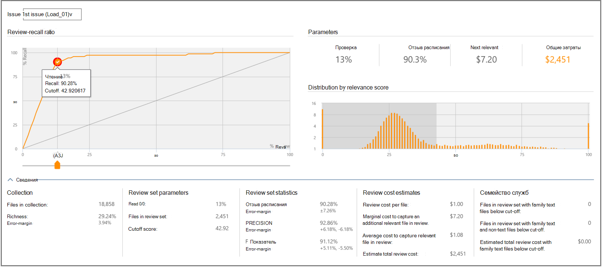

# Решения, основанные на релевантности, Advanced eDiscovery
  
В модуле Релевантность в Advanced eDiscovery вкладка Decide предоставляет дополнительные сведения для просмотра и использования статистики поддержки принятия решений для определения размера набора рассмотренных файлов.
  
## Использование вкладки "Решение"

  
Эта вкладка содержит следующие компоненты:
  
- **Вопрос.** Здесь вы можете выбрать интересуемую проблему из списка.

- **Соотношение отзывов** и отзывов: сравнение Advanced eDiscovery в соответствии с баллами релевантности. Точка отсечь на диаграмме представляет процент просмотров файлов, относясь к оценке релевантности. Это используется на этапе Тестирования релевантности и в качестве порогового значения экспорта для выкаповки. Точка отсека по умолчанию, так как количество файлов, которые необходимо просмотреть, находится в точке оптимального баланса между Отзывом и точностью. Фактическая точка отсеки должна определяться пользователем в зависимости от целей и компромисса затрат (%review) и риска (%recall). С помощью ползунок можно настроить точку отсежения и увидеть влияние на график и параметры, при корректировке процентов соответствующих файлов, которые будут извлечены, и перед проверкой решения.

- **Параметры:** Review, Recall, Next relevant and Total cost parameters are cumulative calculated statistics pertaining to the review set in relation to the collection for the entire case. Определения для этих параметров следуют следующим образом:

  - **Обзор.** Процент файлов, которые необходимо просмотреть на основе этого отсека.

  - **Напомним.** Процент релевантного файла в наборе отзывов.

  - **Далее** релевантные: Стоимость проверки и определения другого соответствующего файла, который в настоящее время не находится в наборе обзоров.

  - **Общие затраты.** Затраты на просмотр этого процента файлов дел. Параметры затрат могут быть заданы менеджером case.

  - **Распределение по оценке релевантности.** Файлы в темно-сером дисплее слева находятся ниже оценки отсеки. На подсказке инструмента отображается оценка релевантности и соответствующий процент файлов в файле обзора по отношению к общему объему файлов.

В расширенной **области Details** отображаются дополнительные сведения. Файлы в фигурах коллекции не включают пустые или туманные файлы. Фигуры семейных файлов представляют файлы, которые не загружаются в Релевантность, но по-прежнему считаются частью семейства.
