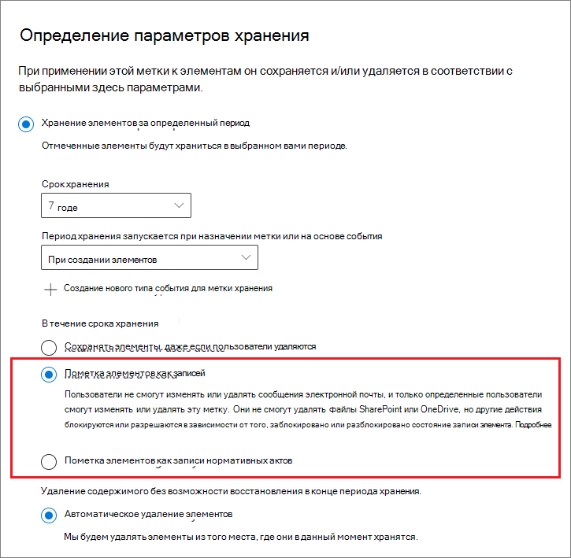

# <a name="declare-records-by-using-retention-labels"></a><span data-ttu-id="f4b6e-103">Объявление элементов записями с использованием меток хранения</span><span class="sxs-lookup"><span data-stu-id="f4b6e-103">Declare records by using retention labels</span></span>

><span data-ttu-id="f4b6e-104">*[Руководство по лицензированию Microsoft 365 для обеспечения безопасности и соответствия требованиям](/office365/servicedescriptions/microsoft-365-service-descriptions/microsoft-365-tenantlevel-services-licensing-guidance/microsoft-365-security-compliance-licensing-guidance).*</span><span class="sxs-lookup"><span data-stu-id="f4b6e-104">*[Microsoft 365 licensing guidance for security & compliance](/office365/servicedescriptions/microsoft-365-service-descriptions/microsoft-365-tenantlevel-services-licensing-guidance/microsoft-365-security-compliance-licensing-guidance).*</span></span>

<span data-ttu-id="f4b6e-105">Для объявления документов и писем [записями](records-management.md#records) используются [метки хранения](retention.md#retention-labels), помечающие контент как **запись** или как **нормативную запись**.</span><span class="sxs-lookup"><span data-stu-id="f4b6e-105">To declare documents and emails as [records](records-management.md#records), you use [retention labels](retention.md#retention-labels) that mark the content as a **record** or a **regulatory record**.</span></span>

<span data-ttu-id="f4b6e-106">Если вы не знаете, какой вариант нужно выбрать (запись или нормативную запись), см. статью [Сравнение ограничений на разрешенные или блокируемые действия](records-management.md#compare-restrictions-for-what-actions-are-allowed-or-blocked).</span><span class="sxs-lookup"><span data-stu-id="f4b6e-106">If you're not sure whether to use a record or a regulatory record, see [Compare restrictions for what actions are allowed or blocked](records-management.md#compare-restrictions-for-what-actions-are-allowed-or-blocked).</span></span> <span data-ttu-id="f4b6e-107">Если вам нужно использовать нормативные записи, нужно сначала запустить команду PowerShell, как описано в следующем разделе.</span><span class="sxs-lookup"><span data-stu-id="f4b6e-107">If you need to use regulatory records, you must first run a PowerShell command, as described in the next section.</span></span>

<span data-ttu-id="f4b6e-108">После этого вы можете либо опубликовать эти метки в политике меток хранения, чтобы пользователи и администраторы могли вручную применить их к содержимому, либо (в случае меток, помечающих элементы как записи, но не как нормативные записи) автоматически применить их к содержимому, которое вы хотите пометить как запись.</span><span class="sxs-lookup"><span data-stu-id="f4b6e-108">You can then either publish those labels in a retention label policy so that users and administrators can apply them to content, or for labels that mark items as records (but not regulatory records), auto-apply those labels to content that you want to declare a record.</span></span>

## <a name="how-to-display-the-option-to-mark-content-as-a-regulatory-record"></a><span data-ttu-id="f4b6e-109">Как отобразить параметр для пометки содержимого в качестве нормативной записи</span><span class="sxs-lookup"><span data-stu-id="f4b6e-109">How to display the option to mark content as a regulatory record</span></span>

>[!NOTE] 
> <span data-ttu-id="f4b6e-110">Изложенная ниже процедура относится к подлежащим аудиту действиям и вносит элемент **Разрешен вариант использования меток хранения для нормативных записей** в раздел журнала аудита [Действия, относящиеся к политикам хранения и меткам хранения](search-the-audit-log-in-security-and-compliance.md#retention-policy-and-retention-label-activities).</span><span class="sxs-lookup"><span data-stu-id="f4b6e-110">The following procedure is an auditable action, logging **Enabled regulatory record option for retention labels** in the [Retention policy and retention label activities](search-the-audit-log-in-security-and-compliance.md#retention-policy-and-retention-label-activities) section of the audit log.</span></span>

<span data-ttu-id="f4b6e-111">По умолчанию параметр меток хранения для пометки содержимого как нормативных записей не отображается в мастере меток хранения.</span><span class="sxs-lookup"><span data-stu-id="f4b6e-111">By default, the retention label option to mark content as a regulatory record isn't displayed in the retention label wizard.</span></span> <span data-ttu-id="f4b6e-112">Чтобы отобразить этот параметр, нужно сначала запустить команду PowerShell:</span><span class="sxs-lookup"><span data-stu-id="f4b6e-112">To display this option, you must first run a PowerShell command:</span></span>

1. <span data-ttu-id="f4b6e-113">[Подключение к PowerShell Центра безопасности и соответствия требованиям Office 365](/powershell/exchange/office-365-scc/connect-to-scc-powershell/connect-to-scc-powershell).</span><span class="sxs-lookup"><span data-stu-id="f4b6e-113">[Connect to the Office 365 Security & Compliance Center PowerShell](/powershell/exchange/office-365-scc/connect-to-scc-powershell/connect-to-scc-powershell).</span></span>

2. <span data-ttu-id="f4b6e-114">Запустите следующий командлет:</span><span class="sxs-lookup"><span data-stu-id="f4b6e-114">Run the following cmdlet:</span></span>
    
    ```powershell
    Set-RegulatoryComplianceUI -Enabled $true
    ````
    <span data-ttu-id="f4b6e-115">Этот параметр вводится немедленно без запроса подтверждения.</span><span class="sxs-lookup"><span data-stu-id="f4b6e-115">There is no prompt to confirm and the setting takes effect immediately.</span></span>

<span data-ttu-id="f4b6e-116">Если вы передумали и больше не хотите, чтобы этот параметр отображался в мастере меток хранения, вы можете снова скрыть его, запустив тот же командлет со значением **false**: `Set-RegulatoryComplianceUI -Enabled $false`</span><span class="sxs-lookup"><span data-stu-id="f4b6e-116">If you change your mind about seeing this option in the retention label wizard, you can hide it again by running the same cmdlet with the **false** value: `Set-RegulatoryComplianceUI -Enabled $false`</span></span> 

## <a name="configuring-retention-labels-to-declare-records"></a><span data-ttu-id="f4b6e-117">Настройка меток хранения для объявления элементов записями</span><span class="sxs-lookup"><span data-stu-id="f4b6e-117">Configuring retention labels to declare records</span></span>

<span data-ttu-id="f4b6e-118">При создании метки хранения из решения **Управление записями** в Центре соответствия требованиям Microsoft 365 вы можете пометить элементы как записи.</span><span class="sxs-lookup"><span data-stu-id="f4b6e-118">When you create a retention label from the **Records Management** solution in the Microsoft 365 compliance center, you have the option to mark items as a record.</span></span> <span data-ttu-id="f4b6e-119">Если вы запустили команду PowerShell из предыдущего раздела, то можете также пометить элементы как нормативные записи.</span><span class="sxs-lookup"><span data-stu-id="f4b6e-119">If you ran the PowerShell command from the previous section, you can alternatively mark items as a regulatory record.</span></span>

<span data-ttu-id="f4b6e-120">Пример.</span><span class="sxs-lookup"><span data-stu-id="f4b6e-120">For example:</span></span>



<span data-ttu-id="f4b6e-122">При необходимости можно применить эту метку хранения к документам SharePoint или OneDrive и сообщениям электронной почты Exchange.</span><span class="sxs-lookup"><span data-stu-id="f4b6e-122">Using this retention label, you can now apply it to SharePoint or OneDrive documents and Exchange emails, as needed.</span></span> 

<span data-ttu-id="f4b6e-123">Полный набор инструкций см. в следующих статьях:</span><span class="sxs-lookup"><span data-stu-id="f4b6e-123">For full instructions:</span></span>

- [<span data-ttu-id="f4b6e-124">Создание меток хранения и их применение в приложениях</span><span class="sxs-lookup"><span data-stu-id="f4b6e-124">Create retention labels and apply them in apps</span></span>](create-apply-retention-labels.md)

- <span data-ttu-id="f4b6e-125">[Автоматическое применение метки хранения к содержимому](apply-retention-labels-automatically.md) (не поддерживается для нормативных записей)</span><span class="sxs-lookup"><span data-stu-id="f4b6e-125">[Apply a retention label to content automatically](apply-retention-labels-automatically.md) (not supported for regulatory records)</span></span>


## <a name="applying-the-configured-retention-label-to-content"></a><span data-ttu-id="f4b6e-126">Применение настроенной метки хранения к содержимому</span><span class="sxs-lookup"><span data-stu-id="f4b6e-126">Applying the configured retention label to content</span></span>

<span data-ttu-id="f4b6e-127">Доступность меток хранения, помечающих элементы в качестве записи или нормативной записи, пользователям для применения в приложениях:</span><span class="sxs-lookup"><span data-stu-id="f4b6e-127">When retention labels that mark items as a record or regulatory record are made available for users to apply them in apps:</span></span>

- <span data-ttu-id="f4b6e-128">Любой пользователь в Exchange, имеющий доступ к почтовому ящику с возможностью ввода текста, может применить метку хранения.</span><span class="sxs-lookup"><span data-stu-id="f4b6e-128">For Exchange, any user with write-access to the mailbox can apply these labels.</span></span> 
- <span data-ttu-id="f4b6e-129">Применить метки в SharePoint и OneDrive может любой пользователь, который (на уровне разрешения "Участие") входит в группу "Участники", используемую по умолчанию.</span><span class="sxs-lookup"><span data-stu-id="f4b6e-129">For SharePoint and OneDrive, any user in the default Members group (the Contribute permission level) can apply these labels.</span></span>

<span data-ttu-id="f4b6e-130">Пример документа, помеченного как запись, с помощью метки хранения:</span><span class="sxs-lookup"><span data-stu-id="f4b6e-130">Example of a document marked as record by using a retention label:</span></span>


## <a name="searching-the-audit-log-for-labeled-items-that-were-declared-records"></a><span data-ttu-id="f4b6e-132">Поиск в журнале аудита помеченных элементов, которые были объявлены записями</span><span class="sxs-lookup"><span data-stu-id="f4b6e-132">Searching the audit log for labeled items that were declared records</span></span>

<span data-ttu-id="f4b6e-133">Действия по присвоению меток для объявления элементов записями регистрируются в журнале аудита.</span><span class="sxs-lookup"><span data-stu-id="f4b6e-133">The actions of labeling to declare items as records are logged in the audit log.</span></span>

<span data-ttu-id="f4b6e-134">Для элементов SharePoint:</span><span class="sxs-lookup"><span data-stu-id="f4b6e-134">For SharePoint items:</span></span> 
- <span data-ttu-id="f4b6e-135">В разделе **Действия с файлами и страницами** выберите **Изменена метка хранения файла**.</span><span class="sxs-lookup"><span data-stu-id="f4b6e-135">From **File and page activities**, select **Changed retention label for a file**.</span></span> <span data-ttu-id="f4b6e-136">Это событие аудита предназначено для меток хранения, помечающих элементы как записи или нормативные записи, либо для стандартных меток хранения.</span><span class="sxs-lookup"><span data-stu-id="f4b6e-136">This audit event is for retention labels that mark items as records, regulatory records, or that are standard retention labels.</span></span>

<span data-ttu-id="f4b6e-137">Для элементов Exchange:</span><span class="sxs-lookup"><span data-stu-id="f4b6e-137">For Exchange items:</span></span>
- <span data-ttu-id="f4b6e-138">В разделе **Действия, связанные с почтовыми ящиками Exchange** выберите **Сообщение помечено как запись**.</span><span class="sxs-lookup"><span data-stu-id="f4b6e-138">From **Exchange mailbox activities**, select **Labeled message as a record**.</span></span> <span data-ttu-id="f4b6e-139">Это событие аудита предназначено для меток хранения, помечающих элементы как записи или нормативные записи.</span><span class="sxs-lookup"><span data-stu-id="f4b6e-139">This audit event is for retention labels that mark items as records or regulatory records.</span></span>

<span data-ttu-id="f4b6e-140">Дополнительные сведения о поиске таких событий см. в статье [Поиск в журнале аудита в Центре безопасности и соответствия требованиям](search-the-audit-log-in-security-and-compliance.md#file-and-page-activities).</span><span class="sxs-lookup"><span data-stu-id="f4b6e-140">For more information about searching for these events, see [Search the audit log in the Security & Compliance Center](search-the-audit-log-in-security-and-compliance.md#file-and-page-activities).</span></span>

## <a name="next-steps"></a><span data-ttu-id="f4b6e-141">Дальнейшие действия</span><span class="sxs-lookup"><span data-stu-id="f4b6e-141">Next steps</span></span>

<span data-ttu-id="f4b6e-142">Список сценариев, поддерживаемых службой управления записей, см. в разделе [Обычные сценарии для управления записями](get-started-with-records-management.md#common-scenarios-for-records-management).</span><span class="sxs-lookup"><span data-stu-id="f4b6e-142">For a list of scenarios supported by records management, see [Common scenarios for records management](get-started-with-records-management.md#common-scenarios-for-records-management).</span></span>
