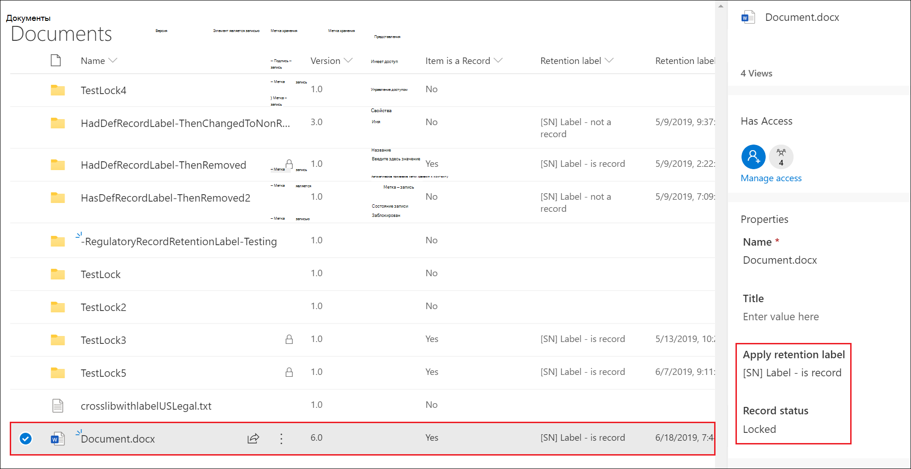

# Объявление элементов записями с использованием меток хранения

>*[Руководство по лицензированию Microsoft 365 для обеспечения безопасности и соответствия требованиям](https://aka.ms/ComplianceSD).*

Чтобы пометить содержимое как запись, используются [метки хранения](retention.md#retention-labels). Вы можете либо опубликовать эти метки, чтобы пользователи и администраторы могли вручную применить их к содержимому, либо автоматически применить эти метки к содержимому, которое вы хотите пометить как запись.

## Настройка меток хранения для объявления элементов записями

При создании [метки хранения](retention.md#retention-labels), выберите параметр, чтобы пометить содержимое как запись.

>[!NOTE] 
> Параметр пометки содержимого как запись недоступен при создании или настройки метки хранения из раздела **Управление информацией** в Центре соответствия требованиям Microsoft 365. Вместо этого необходимо использовать раздел**Управление записями**.

1. В [Центре соответствия требованиям Microsoft 365](https://compliance.microsoft.com), перейти в раздел **Управление записями** \> **План хранения**. На странице **План хранения** выберите **Создать метку**.

2. На странице мастера**Параметры метки** выберите параметр для классификации содержимого как записи.
    
   

3. При необходимости можно применить метку хранения к документам SharePoint или OneDrive и электронным письмам Exchange. Для получения инструкций:
    
    - [Создание меток хранения и их применение в приложениях](create-apply-retention-labels.md)
    
    - [Автоматическое применение метки хранения к контенту](apply-retention-labels-automatically.md)

## Применение сконфигурированной метки хранения к содержимому

Когда метки хранения, помечающие содержимое как запись, становятся доступны для пользователей для применения их в приложениях:

- Любой пользователь в Exchange, имеющий доступ к почтовому ящику с возможностью ввода текста, может применить метку хранения. 
- Применить метки в SharePoint и OneDrive может любой пользователь, который (на уровне разрешения "Участие") входит в группу "Участники", используемую по умолчанию.

Пример документа, помеченного как запись, с помощью метки хранения:

## Дальнейшие действия

Если необходимо обновить документы, являющиеся записями, см. раздел [Использование версий записи для обновления записей, хранящихся в SharePoint или OneDrive](record-versioning.md).

Информацию о ликвидации записей см. в разделе [Ликвидация содержимого](disposition.md).
