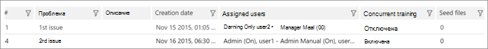

# Определение проблем и назначение пользователей в Advanced eDiscovery (классическая)Define issues and assign users in Advanced eDiscovery (classic)

> [!NOTE]
> Чтобы можно было использовать Advanced eDiscovery, требуется подписка на Office 365 E3 с надстройкой Advanced Compliance или E5 для организации. Если у вас этого плана нет и вы хотите попробовать Advanced eDiscovery, можете [зарегистрироваться для получения пробной версии Office 365 корпоративный E5](https://go.microsoft.com/fwlink/p/?LinkID=698279).Advanced eDiscovery requires an Office 365 E3 with the Advanced Compliance add-on or an E5 subscription for your organization. If you don't have that plan and want to try Advanced eDiscovery, you can [sign up for a trial of Office 365 Enterprise E5](https://go.microsoft.com/fwlink/p/?LinkID=698279). 
  
В Advanced eDiscovery можно определить одну или несколько проблем в рамках дела.In Advanced eDiscovery, one or more issues can be defined within a case. Определение проблем позволяет далее классифицифицация разделов.Defining issues allows further categorization of topics. При подключении к новому делу предоставляется одна проблема по умолчанию.When connecting to a new case, a single default issue is provided. Вы можете изменить имя проблемы по умолчанию и назначить ее пользователям.You can edit the default issue name and assign users to the issue. 
  
## Добавление или изменение проблемы и назначение пользователейAdding or editing an issue and assigning users

1. На **вкладке \> "Релевантность" выберите** \> **"Проблемы".**In the **Relevance \> Relevance setup** tab \> select **Issues**.
    
    
  
2. Чтобы добавить проблему, щелкните значок \*\* + \*\*.To add an issue, click the \*\* + \*\* icon. **Отобразилось** диалоговое окно "Добавление проблемы".The **Add issue** dialog is displayed. 
    
    
  
    Чтобы изменить проблему, щелкните значок **редактирования.**To edit an issue, click the **Edit** icon. 
    
3. В **имени проблемы** введите имя, которое является описательным и значимым для дела.In **Issue name**, type a name that is descriptive and significant to the case. 
    
4. В **описании** введите сведения о проблеме.In **Description**, type information about the issue.
    
5. Чтобы включить **этот параметр,** выберите параметр "Включить параллельное обучение".Select the **Enable concurrent training** check box to enable the option. Этот параметр позволяет нескольким рецензентам работать над одной проблемой одновременно (в отдельных примерах).This setting enables multiple reviewers to work on the same issue simultaneously (in separate samples). 
    
6. В **списке**"Все  пользователи" выберите пользователя, который будет назначен проблеме, и щелкните стрелку вправо, чтобы добавить пользователя в список выбранных **пользователей.**In **Assign users to issue**, in the **All users** list, select a user to be assigned to the issue and then click the right-facing arrow to add the user to the **Selected users** list. Повторите это при необходимости.Repeat as necessary. В окне выше в качестве выбранного пользователя отображается "Администратор".In the window shown above, "Admin" is shown as a selected user. 
    
    > [!NOTE]
    > Назначение пользователям проблем можно изменить до или после цикла обучения релевантности.User assignment to issues can be modified before or after a Relevance training cycle. 
  
7. В **списке "Выбранные пользователи"** рядом с именем выбранного пользователя выберите один из следующих режимов выборки:In **Selected users**, from the drop-down list next to the name of the selected user, select one of the following Sampling modes: 
    
  - **On**: The files can be viewed and tagged.**On**: The files can be viewed and tagged. Это значение по умолчанию.This is the default setting.
    
  - **Бездействие:** файлы можно просмотреть; пометка необязательна.**Idle**: The files can be viewed; tagged is optional.
    
  - **Выключите:** файлы невозможно просмотреть или пометить.**Off**: The files cannot be viewed or tagged.
    
8. После добавления проблем нажмите кнопку **"ОК".**When done adding issues, click **OK**.
    
## Удаление проблемDeleting issues

Проблемы могут быть удалены (то есть удалены из базы данных) только сразу после их определения, а фактическая работа по этой проблеме не была сделана.Issues may be deleted (meaning, removed from the database) only immediately after they were defined and no actual work has been done for that issue. 
  
1. На **вкладке \> "Релевантность" выберите** **"Проблемы".**In the **Relevance \> Relevance setup** tab, select **Issues**.
    
2. Выберите проблему, удаляемую из базы данных, и нажмите кнопку **"Удалить".**Select the issue to delete from the database, and then click **Delete**.
    
3. Отобразилось сообщение с подтверждением.A confirmation message is displayed. Нажмите кнопку **Да** для подтверждения.Click **Yes** to confirm. 
    
4. Нажмите кнопку **ОК**.Click **OK**.
    
## См. такжеSee also

[Advanced eDiscovery (классическая версия)Advanced eDiscovery (classic)](office-365-advanced-ediscovery.md)
  
[Настройка полных пакетов для добавления импортированных файловSetting up loads to add imported files](set-up-loads-to-add-imported-files.md)
  
[Определение выделенных ключевых слов и дополнительных параметровDefining highlighted keywords and advanced options](define-highlighted-keywords-and-advanced-options.md)

