# Развертывание соединителя для архивации данных бизнес-страниц Facebook

В этой статье представлено пошаговое руководство по развертыванию соединителя, использующего службу импорта Office 365 для импорта данных из бизнес-страниц Facebook в Microsoft 365. Общий обзор этого процесса и список необходимых компонентов, необходимых для развертывания соединителя Facebook, приведены в разделе [Настройка соединителя для архивации данных Facebook](archive-facebook-data-with-sample-connector.md).

## Шаг 1: создание приложения в Azure Active Directory

1. Перейдите на страницу <https://portal.azure.com> и войдите, используя учетные данные глобального администратора.

    

2. В области навигации слева выберите **Azure Active Directory**.

    

3. В левой области навигации щелкните **Регистрация приложений (Предварительная версия)** , а затем нажмите кнопку **создать регистрацию**.

    

4. Зарегистрируйте приложение. В разделе URI перенаправления выберите пункт веб-сайт в раскрывающемся списке Тип приложения, а затем введите <https://portal.azure.com> в поле для URI.

   

5. Скопируйте идентификатор **приложения (идентификатор клиента)** и **идентификатор каталога (клиента)** и сохраните их в текстовый файл или другое надежное расположение. Эти идентификаторы используются на последующих этапах.

   

6. Перейдите к разделу **сертификаты & секреты для нового приложения.**

   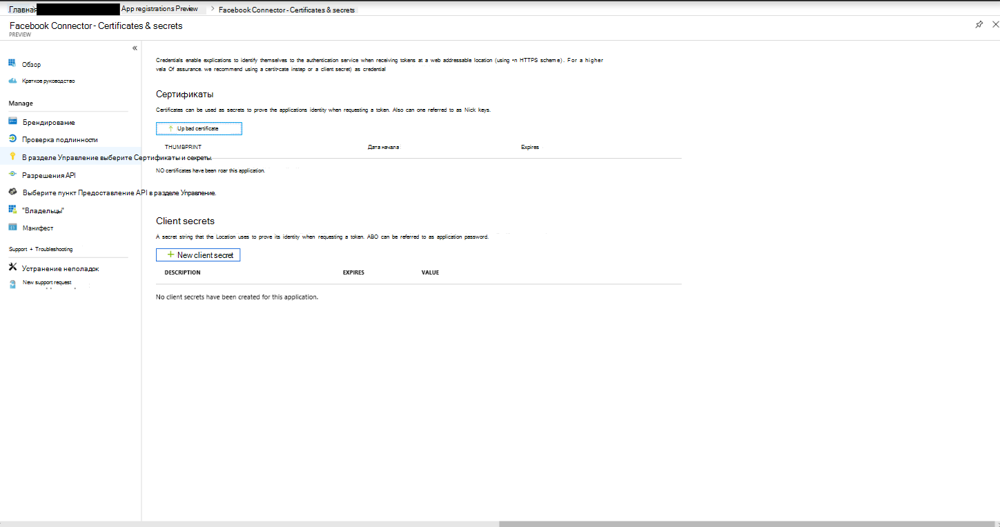

7. Щелкните **новый секрет клиента**

   

8. Создайте новый секрет. В поле Описание введите секрет, а затем выберите срок действия.

    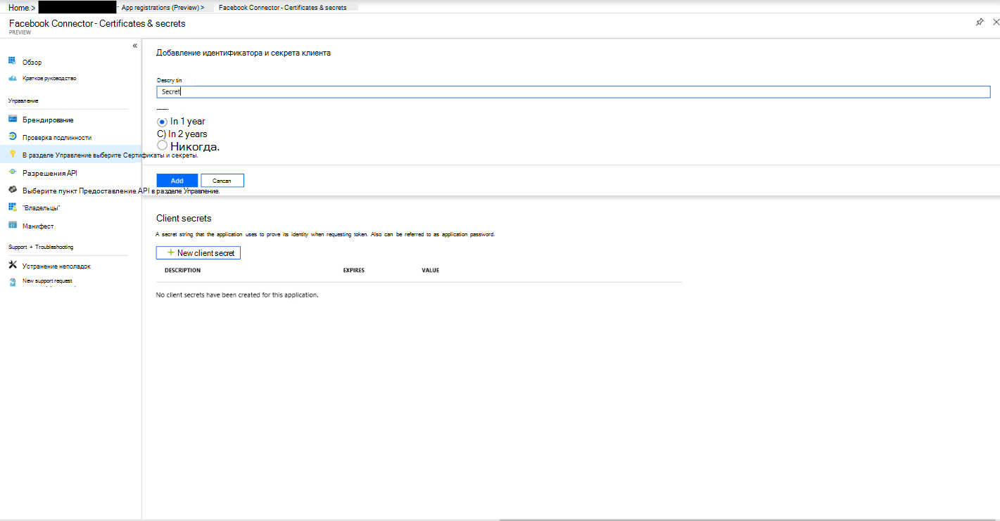

9. Скопируйте значение секрета и сохраните его в текстовый файл или другое место хранения. Это секрет приложения AAD, который вы используете в дальнейших действиях.

   

## Шаг 2: разверните веб-службу соединителя из GitHub в учетную запись Azure.

1. Перейдите на [этот сайт GitHub](https://github.com/microsoft/m365-sample-connector-csharp-aspnet) и нажмите кнопку **развернуть в Azure**.

    

2. После нажатия кнопки **развернуть в Azure**вы будете перенаправлены на портал Azure с настраиваемой страницей шаблона. Заполните сведения о **основных** **параметрах и параметрах** , а затем щелкните **купить**.

   - **Подписка:** Выберите свою подписку на Azure, в которую вы хотите развернуть веб-службу соединителя для бизнес-страниц Facebook.

   - **Группа ресурсов:** Выберите или создайте новую группу ресурсов. Группа ресурсов — это контейнер, в котором хранятся связанные ресурсы для решения Azure.

   - **Расположение:** Выберите расположение.

   - **Имя веб-приложения:** Укажите уникальное имя для веб-приложения соединителя. Длина имени должна составлять от 3 до 18 символов. Это имя используется для создания URL-адреса службы приложений Azure; Например, если указать имя веб-приложения **фбконнектор** , URL-адрес службы приложений Azure будет **fbconnector.azurewebsites.NET**.

   - **tenantId:** Идентификатор клиента вашей организации Microsoft 365, который вы скопировали после создания приложения соединителя Facebook в Azure Active Directory на этапе 1.

   - **Аписекреткэй:** В качестве секрета можно ввести любое значение. Он используется для доступа к веб-приложению Connector в действии 5.

     

3. После успешного развертывания страница будет выглядеть примерно так, как показано на следующем снимке экрана:

   

## Шаг 3: регистрация приложения Facebook

1. Перейдите к <https://developers.facebook.com> , войдите в систему, используя учетные данные для учетной записи для бизнес-страниц Facebook вашей организации, а затем щелкните **Добавить новое приложение**.

   

2. Создайте идентификатор нового приложения.

   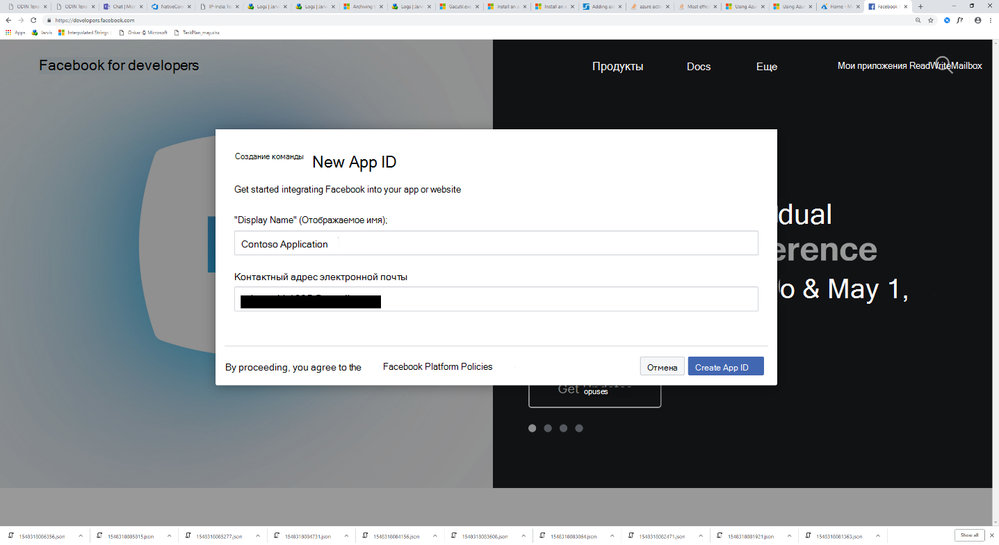

3. В левой области навигации щелкните **Добавить продукты** , а затем — **Настройка** на плитке **входа Facebook** .

   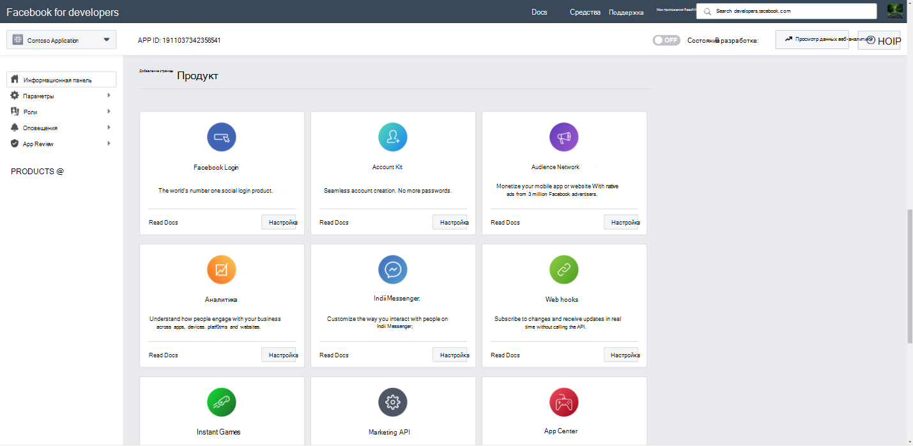

4. На странице Интеграция входа в Facebook нажмите кнопку **веб**.

   

5. Добавьте URL-адрес службы приложений Azure; например `https://fbconnector.azurewebsites.net` :.

   

6. Заполните раздел Краткое руководство по настройке входа в Facebook.

   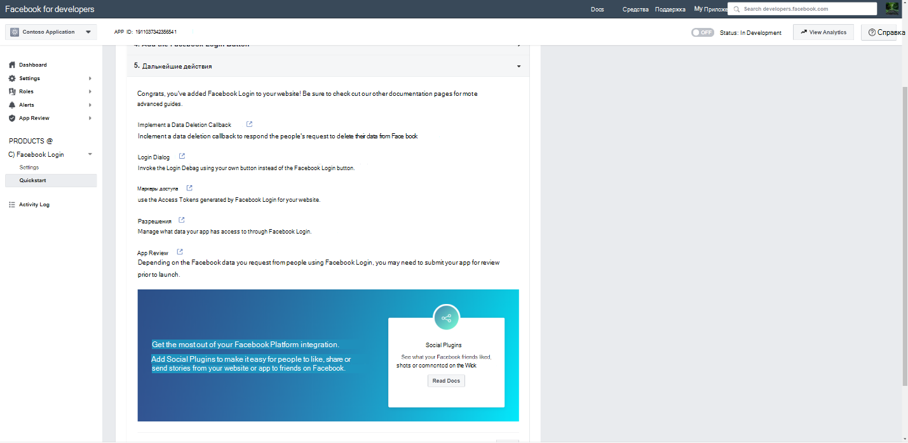

7. В левой области навигации в разделе **Login Facebook**щелкните **Параметры**, а затем добавьте URI перенаправления OAuth в поле **допустимые URI переадресации OAuth** . Используйте формат ** \<connectorserviceuri> /виевс/фацебукоаус**, где значение параметра коннекторсервицеури — это URL-адрес службы приложений Azure для вашей организации; например, `https://fbconnector.azurewebsites.net` .

   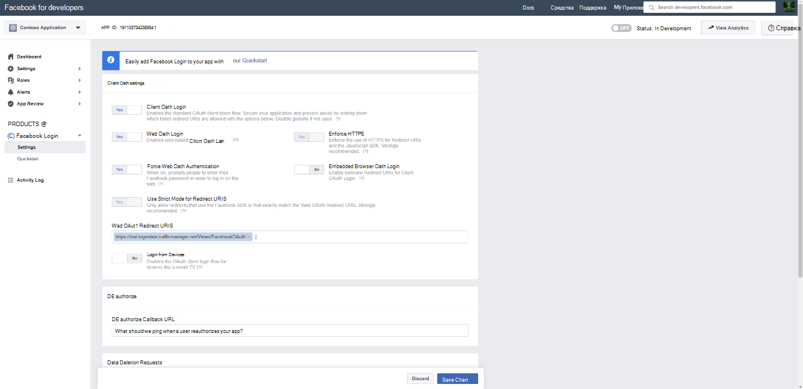

8. В левой области навигации щелкните **Добавить продукты** и выберите **веб-перехватчики.** В раскрывающемся меню **Page (страница** ) выберите пункт **Page (страница**).

   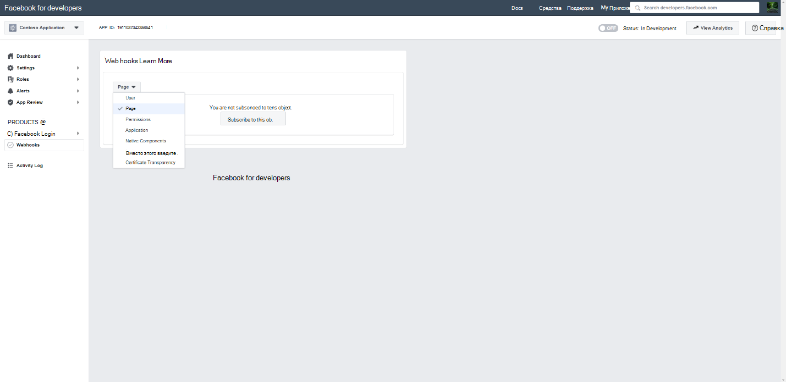

9. Добавьте URL-адрес обратного вызова для веб-перехватчиков и добавьте маркер проверки. Формат URL-адреса обратного вызова, используйте формат ** <connectorserviceuri> /АПИ/фбпажевебхук**, где значение параметра коннекторсервицеури — это URL-адрес службы приложений Azure для вашей организации; например `https://fbconnector.azurewebsites.net` .

   Маркер проверки должен быть похож на надежный пароль. Скопируйте токен проверки в текстовый файл или другое место хранения.

   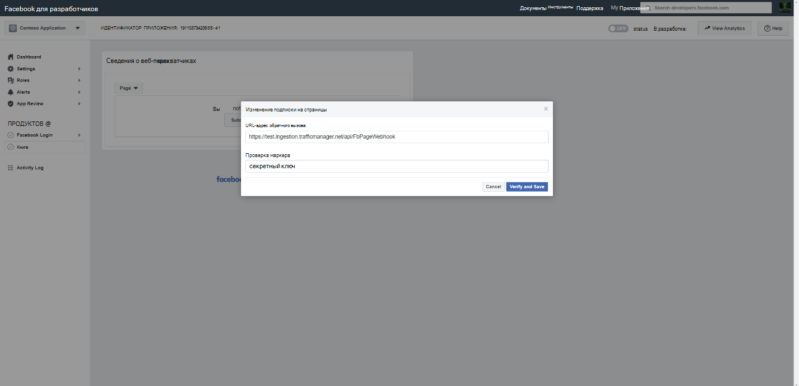

10. Протестируйте и подпишитесь на конечную точку для веб-канала.

    

11. Добавьте URL-адрес конфиденциальности, значок приложения и использование для бизнеса. Кроме того, скопируйте идентификатор приложения и секрет приложения в текстовый файл или другое место хранения.

    

12. Сделайте приложение общедоступным.

    

13. Добавьте пользователя к роли администратора или тестера.

    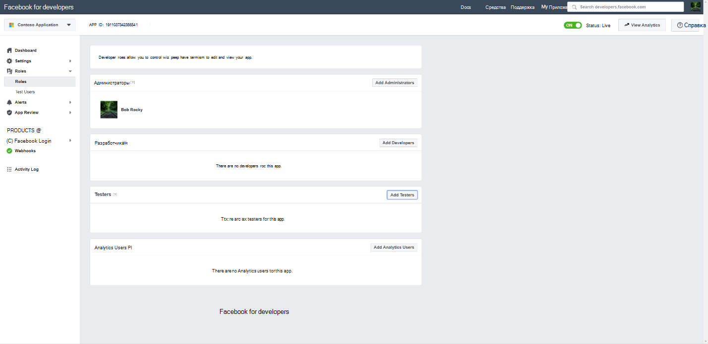

14. Добавьте разрешение на **доступ к общему содержимому страницы** .

    

15. Разрешение "добавить Управление страницами".

    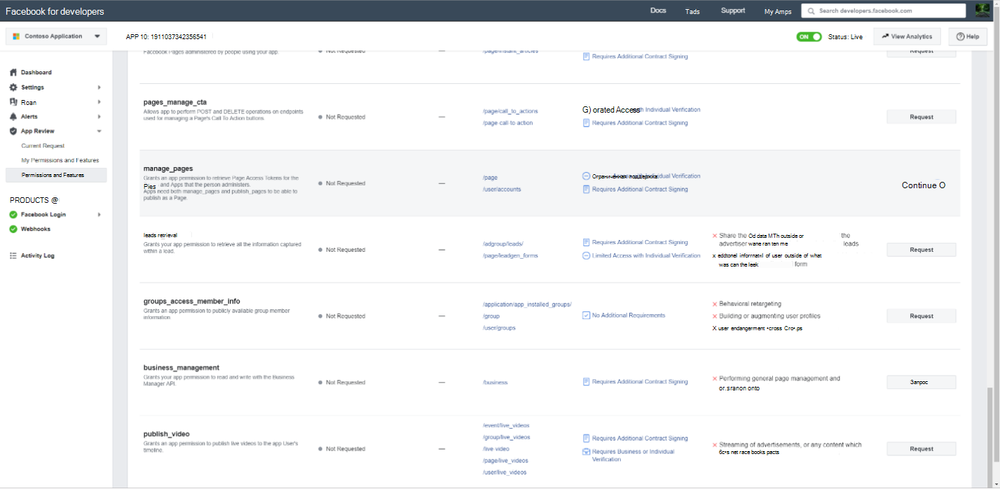

16. Получение приложения, проверенного Facebook.

    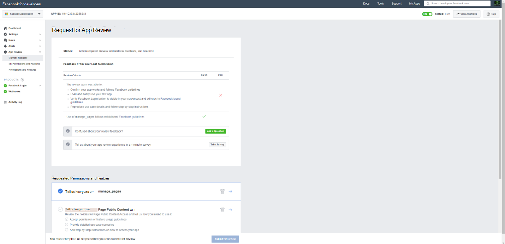

## Шаг 4: Настройка веб-приложения соединителя

1. Перейдите к разделу `https://<AzureAppResourceName>.azurewebsites.net` (где азуреаппресаурценаме — имя ресурса приложения Azure, имя которого указано в шаге 4). Например, если имя — **фбконнектор**, перейдите на страницу `https://fbconnector.azurewebsites.net` . Домашняя страница приложения будет выглядеть, как на следующем снимке экрана:

   

2. Нажмите кнопку **настроить** , чтобы отобразить страницу входа.

   

3. В поле Идентификатор клиента введите или вставьте идентификатор клиента (полученный на шаге 2). В поле Пароль введите или вставьте Аписекреткэй (полученное в действии 2), а затем нажмите кнопку **Настройка параметров конфигурации** , чтобы отобразить страницу сведений о конфигурации.

    

4. Введите следующие параметры конфигурации

   - **Идентификатор приложения Facebook:** Идентификатор приложения для приложения Facebook, полученного на шаге 3.

   - **Секрет приложения Facebook:** Секрет приложения для приложения Facebook, полученного на шаге 3.

   - **Веб-перехватчики Facebook проверьте маркер:** Токен проверки, созданный на шаге 3.

   - **Идентификатор приложения AAD:** Идентификатор приложения для приложения Azure Active Directory, созданного на шаге 1.

   - **Секрет приложения AAD:** Значение секрета Аписекреткэй, созданного на шаге 1.

5. Нажмите кнопку **сохранить** , чтобы сохранить параметры соединителя.

## Шаг 5: Настройка соединителя Facebook в центре соответствия требованиям Microsoft 365

1. [https://compliance.microsoft.com](https://compliance.microsoft.com)В левой панели навигации выберите элемент **соединители данных и нажмите кнопку соединители данных** .

2. На странице " **соединители данных (Предварительная версия)** " в разделе **Facebook Business Pages**нажмите кнопку **Просмотр**.

3. На странице **Facebook Business Pages** (добавить соединитель) нажмите кнопку **Добавить соединитель**.

4. На странице **условия обслуживания** нажмите кнопку **принять**.

5. На странице " **Добавление учетных данных для приложения соединителя** " введите следующие сведения и нажмите кнопку **проверить подключение**.

   

   - В поле **имя** введите имя соединителя, например **Страница новостей Facebook**.

   - В поле **URL-адрес подключения** введите или вставьте URL-адрес службы приложений Azure; например `https://fbconnector.azurewebsites.net` :.

   - В поле **пароль** введите или вставьте значение аписекреткэй, добавленное на шаге 2.

   - В поле **идентификатор приложения Azure** введите или вставьте значение идентификатора приложения (клиента), который также называется идентификатором приложения AAD, созданным на шаге 1.

6. После успешной проверки подключения нажмите кнопку **Далее**.

7. На странице **авторизовать Microsoft 365 to Import Data (разрешить Microsoft** ) введите или вставьте аписекреткэй еще раз, а затем нажмите кнопку **Login Web App**.

8. На странице " **Настройка приложения соединителя Facebook Connector** " щелкните **Вход с Facebook** и войдите в систему, используя учетные данные для учетной записи для бизнес-страниц Facebook Организации. Убедитесь, что учетной записи Facebook, в которую вы вошли в систему, назначена роль администратора для бизнес-страниц Facebook вашей организации.

   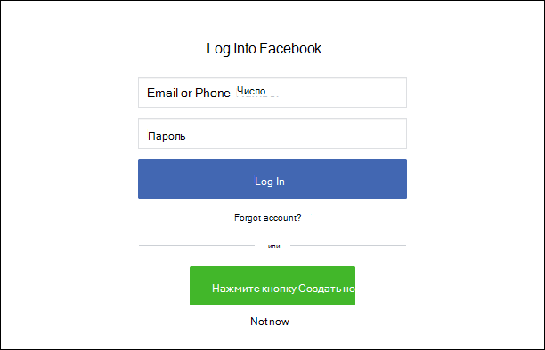

9. Отображается список бизнес-страниц, управляемых учетной записью Facebook, в которой выполнен вход. Выберите страницу для архивации и нажмите кнопку **Далее**.

   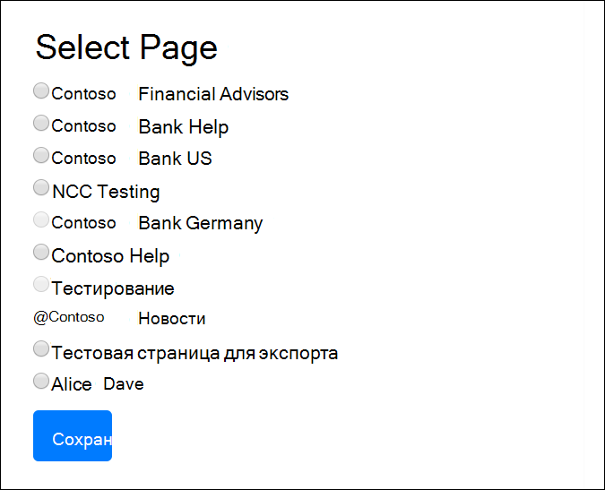

10. Нажмите кнопку **продолжить** , чтобы выйти из программы установки приложения службы соединителя.

11. На странице " **Настройка фильтров** " можно применить фильтр для начального импорта элементов с определенным сроком хранения. Выберите возраст, а затем нажмите кнопку **Далее**.

12. На странице **Выбор места хранения** введите адрес электронной почты почтового ящика Microsoft 365, в который будут импортированы элементы Facebook, а затем нажмите кнопку **Далее**.

13. На странице **предоставление разрешений администратора**щелкните **предоставить согласие** и следуйте инструкциям. Вы должны быть глобальным администратором, чтобы предоставить разрешение службе импорта Office 365 для доступа к данным в Организации.

14. Нажмите кнопку **Далее** , чтобы проверить параметры соединителя, а затем нажмите кнопку **Готово** , чтобы завершить настройку соединителя.

15. В центре соответствия требованиям откройте страницу " **соединители данных** " и перейдите на вкладку **соединители** , чтобы просмотреть ход процесса импорта.
