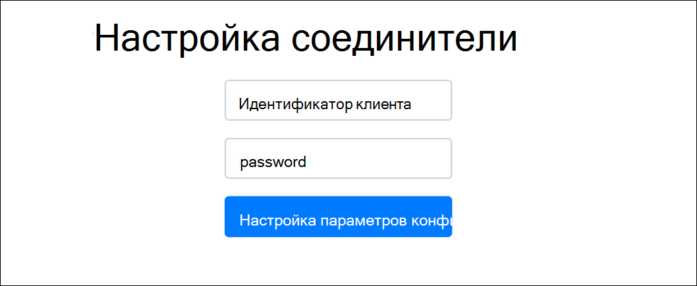

# Развертывание соединитела для архива данных бизнес-страниц FacebookDeploy a connector to archive Facebook Business pages data

В этой статье содержится пошаговые процедуры развертывания соединители, использующие службу импорта Office 365 для импорта данных со страниц Facebook бизнес в Microsoft 365.This article contains the step-by-step process to deploy a connector that uses the Office 365 Import service to import data from Facebook Business pages to Microsoft 365. Общие сведения об этом процессе и список предварительных условий, необходимых для развертывания соединители Facebook, см. в настройках соединитела для архивации [данных Facebook.](archive-facebook-data-with-sample-connector.md)For a high-level overview of this process and a list of prerequisites required to deploy a Facebook connector, see [Set up a connector to archive Facebook data](archive-facebook-data-with-sample-connector.md).

## Шаг 1. Создание приложения в Azure Active DirectoryStep 1: Create an app in Azure Active Directory

1. Войдите в учетную запись глобального администратора и войдите в <https://portal.azure.com> нее.Go to <https://portal.azure.com> and sign in using the credentials of a global admin account.

    

2. В левой области навигации щелкните **Azure Active Directory.**In the left navigation pane, click **Azure Active Directory**.

    

3. В левой области навигации щелкните регистрацию приложений **(предварительная версия)** и нажмите кнопку **"Новая регистрация".**In the left navigation pane, click **App registrations (Preview)** and then click **New registration**.

    

4. Зарегистрируйте приложение.Register the application. В поле "URI перенаправления" выберите "Интернет" в списке типов приложений, а затем введите поле <https://portal.azure.com> для URI.Under Redirect URI, select Web in the application type dropdown list and then type <https://portal.azure.com> in the box for the URI.

   

5. **Скопируйте ИД приложения (клиента)** и каталог **(клиент)** и сохраните их в текстовом файле или другом безопасном расположении.Copy the **Application (client) ID** and **Directory (tenant) ID** and save them to a text file or other safe location. Эти ИД будут применяться на последующих шагах.You use these IDs in later steps.

   

6. Перейдите **к & сертификатов для нового приложения.**Go to **Certificates & secrets for the new app.**

   

7. Click **New client secret**Click **New client secret**

   

8. Создайте новый секрет.Create a new secret. В поле описания введите секрет и выберите срок действия.In the description box, type the secret and then choose an expiration period.

    

9. Скопируйте значение секрета и сохраните его в текстовом файле или другом хранилище.Copy the value of the secret and save it to a text file or other storage location. Это секрет приложения AAD, который будет применяться на последующих шагах.This is the AAD application secret that you use in later steps.

   

## Шаг 2. Развертывание веб-службы соединителя из GitHub в учетной записи AzureStep 2: Deploy the connector web service from GitHub to your Azure account

1. Перейдите [на этот сайт GitHub и](https://github.com/microsoft/m365-sample-connector-csharp-aspnet) нажмите кнопку **"Развернуть в Azure".**Go to [this GitHub site](https://github.com/microsoft/m365-sample-connector-csharp-aspnet) and click **Deploy to Azure**.

    

2. После нажатия кнопки **"Развернуть в Azure"** вы будете перенаправлены на портал Azure с настраиваемой страницей шаблона.After you click **Deploy to Azure**, you will be redirected to an Azure portal with a custom template page. Заполните сведения **об основах** **и параметрах** и нажмите кнопку **"Купить".**Fill in the **Basics** and **Settings** details and then click **Purchase**.

   - **Подписка:** Выберите свою подписку Azure, в которую вы хотите развернуть веб-службу соединители страниц Facebook для бизнеса.**Subscription:** Select your Azure subscription that you want to deploy the Facebook Business pages connector web service to.

   - **Группа ресурсов:** Выберите или создайте новую группу ресурсов.**Resource group:** Choose or create a new resource group. Группа ресурсов — это контейнер, который содержит связанные ресурсы для решения Azure.A resource group is a container that holds related resources for an Azure solution.

   - **Расположение:** Выберите расположение.**Location:** Choose a location.

   - **Имя веб-приложения:** Укажет уникальное имя для веб-приложения соединители.**Web App Name:** Provide a unique name for the connector web app. Длина имени должна быть от 3 до 18 символов.Th name must be between 3 and 18 characters in length. Это имя используется для создания URL-адреса службы приложений Azure; Например, если у вас есть имя **fbconnector** для **веб-приложения,** URL-адрес службы приложений Azure будет fbconnector.azurewebsites.net.This name is used to create the Azure app service URL; for example, if you provide the Web app name of **fbconnector** then the Azure app service URL  will be **fbconnector.azurewebsites.net**.

   - **tenantId:** ИД клиента вашей организации Microsoft 365, который вы скопировали после создания приложения соединители Facebook в Azure Active Directory на шаге 1.**tenantId:** The tenant ID of your Microsoft 365 organization that you copied after creating the Facebook connector app in Azure Active Directory in Step 1.

   - **APISecretKey:** В качестве секрета можно ввести любое значение.**APISecretKey:** You can type any value as the secret. Это используется для доступа к веб-приложению соединители на шаге 5.This is used to access the connector web app in Step 5.

     

3. После успешного развертывания страница будет выглядеть примерно так, как по снимку экрана:After the deployment is successful, the page will look similar to the following screenshot:

   

## Шаг 3. Регистрация приложения FacebookStep 3: Register the Facebook app

1. Go to <https://developers.facebook.com> , log in using the credentials for the account for your organization's Facebook Business pages, and then click Add New **App**.Go to <https://developers.facebook.com>, log in using the credentials for the account for your organization's Facebook Business pages, and then click **Add New App**.

   

2. Создайте новый ИД приложения.Create a new app ID.

   

3. In the left navigation pane, click **Add Products** and then click **Set Up** in the **Facebook Login** tile.In the left navigation pane, click **Add Products** and then click **Set Up** in the **Facebook Login** tile.

   

4. On the Integrate Facebook Login page, click **Web**.On the Integrate Facebook Login page, click **Web**.

   

5. Добавление URL-адреса службы приложений Azure; например. `https://fbconnector.azurewebsites.net`Add the Azure app service URL; for example `https://fbconnector.azurewebsites.net`.

   

6. Завершите раздел QuickStart настройки входа в Facebook.Complete the QuickStart section of the Facebook Login setup.

   

7. In the left navigation pane under **Facebook Login,** click **Settings**, and add the OAuth redirect URI in the **Valid OAuth Redirect URI** box.In the left navigation pane under **Facebook Login**, click **Settings**, and add the OAuth redirect URI in the **Valid OAuth Redirect URIs** box. Используйте формат **\<connectorserviceuri> /Views/FacebookOAuth,** где значением connectorserviceuri является URL-адрес службы приложений Azure для вашей организации, например `https://fbconnector.azurewebsites.net` .Use the format **\<connectorserviceuri>/Views/FacebookOAuth**, where the value for connectorserviceuri is the Azure app service URL for your organization; for example, `https://fbconnector.azurewebsites.net`.

   

8. В левой области навигации  щелкните "Добавить продукты", а затем щелкните **"Веб-hooks".**In the left navigation pane, click **Add Products** and then click **Webhooks.** В  оттягиваемом меню "Страница" щелкните **"Страница".**In the **Page** pull-down menu, click **Page**.

   

9. Добавьте URL-адрес веб-вызова и маркер проверки.Add Webhooks Callback URL and add a verify token. В формате URL-адреса для вызова используйте формат **<connectorserviceuri> /api/FbPageWebhook,** где значением соединителяserviceuri является URL-адрес службы приложений Azure для вашей организации, например `https://fbconnector.azurewebsites.net` .The format of the callback URL, use the format **<connectorserviceuri>/api/FbPageWebhook**, where the value for connectorserviceuri is the Azure app service URL for your organization; for example `https://fbconnector.azurewebsites.net`.

   Маркер проверки должен быть похож на надежный пароль.The verify token should similar to a strong password. Скопируйте маркер проверки в текстовый файл или другое место хранения.Copy the verify token to a text file or other storage location.

   

10. Протестировать и подписаться на конечную точку для веб-канала.Test and subscribe to the endpoint for feed.

    

11. Добавьте URL-адрес конфиденциальности, значок приложения и бизнес-использование.Add a privacy URL, app icon, and business use. Кроме того, скопируйте ИД приложения и секрет приложения в текстовый файл или другое место хранения.Also, copy the app ID and app secret to a text file or other storage location.

    

12. Сделайте приложение общедоступным.Make the app public.

    

13. Добавление пользователя в роль администратора или тестера.Add user to the admin or tester role.

    

14. Добавьте разрешение **на доступ к общедоступным содержимым** страницы.Add the **Page Public Content Access** permission.

    

15. Добавление разрешения на управление страницами.Add Manage Pages permission.

    

16. Просмотр приложения в Facebook.Get the application reviewed by Facebook.

    

## Шаг 4. Настройка веб-приложения соединителиStep 4: Configure the connector web app

1. Перейдите `https://<AzureAppResourceName>.azurewebsites.net` к этому ресурсу (где AzureAppResourceName — это имя ресурса приложения Azure, имя которого было названо в шаге 4).Go to `https://<AzureAppResourceName>.azurewebsites.net` (where AzureAppResourceName is the name of your Azure app resource that you named in Step 4). Например, если имя **fbconnector,** перейдите к `https://fbconnector.azurewebsites.net` .For example, if the name is **fbconnector**, go to `https://fbconnector.azurewebsites.net`. Домашняя страница приложения будет выглядеть следующим образом:The home page of the app will look like the following screenshot:

   

2. Нажмите **кнопку** "Настроить", чтобы отобразить страницу для входов.Click **Configure** to display a sign in page.

   

3. В поле "ИД клиента" введите или введите свой ИД клиента (полученный на шаге 2).In the Tenant Id box, type or paste your tenant Id (that you obtained in Step 2). В поле пароля введите или введите APISecretKey (полученный на шаге 2), а затем нажмите кнопку **"Установить** параметры конфигурации", чтобы отобразить страницу сведений о конфигурации.In the password box, type or paste the APISecretKey (that you obtained in Step 2), and then click **Set Configuration Settings** to display the configuration details page.

    

4. Введите следующие параметры конфигурацииEnter the following configuration settings

   - **ИД приложения Facebook:** ИД приложения Facebook, полученного на шаге 3.**Facebook application ID:** The app ID for the Facebook application that you obtained in Step 3.

   - **Секрет приложения Facebook:** Секрет приложения Facebook, полученный на шаге 3.**Facebook application secret:** The app secret for the Facebook application that you obtained in Step 3.

   - **Веб-hooks Facebook проверяют маркер:** Маркер проверки, созданный на шаге 3.**Facebook webhooks verify token:** The verify token that you created in Step 3.

   - **ИД приложения AAD:** ИД приложения Azure Active Directory, созданного на шаге 1.**AAD application ID:** The application ID for the Azure Active Directory app that you created in Step 1.

   - **Секрет приложения AAD:** Значение секрета APISecretKey, созданного на шаге 1.**AAD application secret:** The value for the APISecretKey secret that you created in Step 1.

5. Нажмите **кнопку** "Сохранить", чтобы сохранить параметры соединители.Click **Save** to save the connector settings.

## Шаг 5. Настройка соединители Facebook в Центре соответствия требованиям Microsoft 365Step 5: Set up a Facebook connector in the Microsoft 365 compliance center

1. Go to [https://compliance.microsoft.com](https://compliance.microsoft.com) and then click Data **connectors** in the left nav.Go to [https://compliance.microsoft.com](https://compliance.microsoft.com) and then click **Data connectors** in the left nav.

2. On the **Data connectors** page under **Facebook Business pages,** click **View**.On the **Data connectors** page under **Facebook Business pages**, click **View**.

3. На странице **"Бизнес-страницы Facebook"** нажмите кнопку **"Добавить соединителю".**On the **Facebook business pages** page, click **Add connector**.

4. На странице **"Условия обслуживания" нажмите** кнопку **"Принять".**On the **Terms of service** page, click **Accept**.

5. На странице **"Добавление учетных** данных для приложения соединителю" введите следующие сведения и нажмите кнопку **"Проверить подключение".**On the **Add credentials for your connector app** page, enter the following information and then click **Validate connection**.

   

   - В поле **"Имя"** введите имя соединитела, например страницу новостей **Facebook.**In the **Name** box, type a name for the connector, such as **Facebook news page**.

   - В поле **"URL-адрес** подключения" введите или введите URL-адрес службы приложений Azure; например. `https://fbconnector.azurewebsites.net`In the **Connection URL** box, type or paste the Azure app service URL; for example `https://fbconnector.azurewebsites.net`.

   - В поле **"Пароль"** введите или введите значение APISecretKey, добавленное на шаге 2.In the **Password** box, type or paste the value of the APISecretKey that you added in Step 2.

   - В поле **"ИД** приложения Azure" введите или введите или введите значение ИД приложения (клиента), также называемого ИД приложения AAD, созданного на шаге 1.In the **Azure App ID** box, type or paste the value of the Application (client) ID also called as AAD Application ID that you created in Step 1.

6. После успешной проверки подключения нажмите кнопку **"Далее".**After the connection is successfully validated, click **Next**.

7. На странице **авторизации Microsoft 365** для импорта данных введите или введите или введите APISecretKey еще раз, а затем щелкните веб-приложение для **входа.**On the **Authorize Microsoft 365 to import data** page, type or paste the APISecretKey again and then click **Login web app**.

8. На странице "Настройка соединители **Facebook"** нажмите кнопку "Войти в **Facebook"** и войдите в систему, используя учетные данные учетной записи для страниц вашей организации в Facebook для бизнеса.On the **Configure Facebook connector app** page, click **Login with Facebook** and log in using the credentials for the account for your organization's Facebook Business pages. Убедитесь, что учетной записи Facebook, в которую вы вошли, назначена роль администратора для страниц Вашей организации в Facebook для бизнеса.Make sure the Facebook account that you logged in to is assigned the admin role for your organization's Facebook Business pages.

   

9. Отображается список бизнес-страниц, управляемых учетной записью Facebook, в которую вы вошли.A list of the business pages managed by the Facebook account that you logged in to is displayed. Выберите страницу для архива и нажмите кнопку **"Далее".**Select the page to archive and then click **Next**.

   

10. Нажмите **кнопку** "Продолжить", чтобы выйти из программы установки приложения-службы соединители.Click **Continue** to exit the setup of the connector service app.

11. На странице **"Настройка фильтров"** можно применить фильтр для первоначального импорта элементов определенного возраста.On the **Set filters** page, you can apply a filter to initially import items that are a certain age. Выберите возраст и нажмите кнопку **"Далее".**Select an age, and then click **Next**.

12. На странице **"Выбор места** хранения" введите адрес электронной почты почтового ящика Microsoft 365, в который будут импортироваться элементы Facebook, а затем нажмите кнопку **"Далее".**On the **Choose storage location** page, type the email address of Microsoft 365 mailbox that the Facebook items will be imported to, and then click **Next**.

13. Нажмите **кнопку** "Далее", чтобы просмотреть параметры соединители, а затем нажмите кнопку **"Готово",** чтобы завершить настройку соединители.Click **Next** to review the connector settings and then click **Finish** to complete the connector setup.

14. В Центре соответствия требованиям перейдите на страницу **"Соединители** данных" и перейдите на вкладку **"Соединители",** чтобы увидеть ход процесса импорта.In the compliance center, go to the **Data connectors** page, and click the **Connectors** tab to see the progress of the import process.
