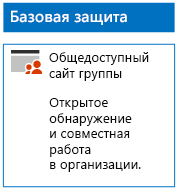
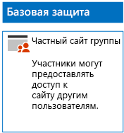
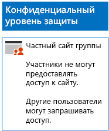
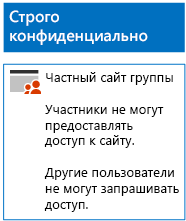

# Развертывание сайтов SharePoint Online с тремя уровнями защиты

В этой статье приводятся инструкции по разработке и развертыванию сайтов групп SharePoint Online с базовым, конфиденциальным и строго конфиденциальным уровнями защиты. Дополнительные сведения об этих трех уровнях защиты см. в статье [Secure SharePoint Online sites and files](../security/office-365-security/secure-sharepoint-online-sites-and-files.md) (Защита сайтов и файлов SharePoint Online).
  
## Сайты групп SharePoint Online с базовым уровнем защиты

Базовый уровень защиты распространяется на частные и общедоступные сайты групп. Обнаруживать общедоступные сайты групп и получать к ним доступ может любой пользователь в организации. Обнаруживать частные сайты и получать к ним доступ могут только участники группы Microsoft 365, связанной с сайтом группы. Оба этих типа сайтов групп позволяют участникам предоставлять доступ к сайту другим пользователям.
  
### Открытый

Чтобы создать сайт группы SharePoint Online с базовым уровнем защиты и общим доступом и разрешениями, выполните [эти инструкции](https://support.office.com/article/create-a-team-site-in-sharepoint-ef10c1e7-15f3-42a3-98aa-b5972711777d).

Ниже показана итоговая конфигурация.
  

  
### Личные сведения

Чтобы создать сайт группы SharePoint Online с базовым уровнем защиты, закрытым доступом и разрешениями, выполните [эти инструкции](https://support.office.com/article/create-a-team-site-in-sharepoint-ef10c1e7-15f3-42a3-98aa-b5972711777d).
  
Ниже показана итоговая конфигурация.
  

  
## Конфиденциальные сайты группы SharePoint Online

Создание конфиденциального сайта группы SharePoint Online начинается с закрытого сайта группы.
  
Сначала создайте закрытый сайт группы SharePoint Online, следуя [этим инструкциям](https://support.office.com/article/create-a-team-site-in-sharepoint-ef10c1e7-15f3-42a3-98aa-b5972711777d).

С помощью действий, приведенных ниже, настройте дополнительные параметры разрешений на новом сайте группы SharePoint Online.

1.  На панели инструментов сайта группы SharePoint щелкните значок параметров и выберите вариант **Разрешения для сайта**.
2.  В области **Разрешения для сайта** в разделе **Параметры общего доступа** щелкните **Изменить параметры общего доступа**.
3.  В разделе **Разрешения на предоставление общего доступа** выберите **Только владельцы сайта могут делиться файлами, папками и сайтом** и щелкните **Сохранить**.

Ознакомьтесь с результатами настройки разрешений.

- Для участников отключена возможность предоставления общего доступа другим участникам.
- Для пользователей, не входящих в группу, включена возможность запроса доступа.

Ниже показана полученная в итоге конфигурация.
  

  
Благодаря членству в одной из групп доступа участники сайта теперь могут безопасно работать с ресурсами сайта.
  
## Сайты групп SharePoint Online со строго конфиденциальным уровнем защиты

Сайт группы SharePoint Online со строго конфиденциальным уровнем защиты — это закрытый сайт группы с дополнительными параметрами разрешений.

Сначала создайте закрытый сайт группы SharePoint Online, следуя [этим инструкциям](https://support.office.com/article/create-a-team-site-in-sharepoint-ef10c1e7-15f3-42a3-98aa-b5972711777d).

С помощью действий, приведенных ниже, настройте дополнительные параметры разрешений на новом сайте группы SharePoint Online.

1.  На панели инструментов сайта группы SharePoint щелкните значок параметров и выберите вариант **Разрешения для сайта**.
2.  В области **Разрешения для сайта** в разделе **Параметры общего доступа** щелкните **Изменить параметры общего доступа**.
3.  В разделе **Разрешения на предоставление общего доступа** установите флажок **Только владельцы сайта могут делиться файлами, папками и сайтом**.
4. Отключите параметр **Разрешить запросы на доступ** и нажмите кнопку **Сохранить**.

Ознакомьтесь с результатами настройки разрешений.

- Для участников отключена возможность предоставления общего доступа другим участникам.
- Для пользователей, не являющихся участниками, отключена возможность запроса доступа.

Ниже показана полученная в итоге конфигурация.
  

  
Благодаря членству в одной из групп доступа участники сайта теперь могут безопасно работать с ресурсами сайта.
  
## Следующий шаг

[Защита файлов SharePoint Online с помощью меток и DLP](protect-sharepoint-online-files-with-office-365-labels-and-dlp.md)

## См. также

[Руководство по безопасности (Майкрософт) для политических кампаний, некоммерческих и других динамических организаций](../security/office-365-security/microsoft-security-guidance-for-political-campaigns-nonprofits-and-other-agile-o.md)
  
[Освоение облака и гибридные решения](https://docs.microsoft.com/office365/enterprise/cloud-adoption-and-hybrid-solutions)
