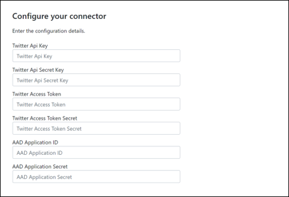

# Развертывание соединитетеля для архива данных TwitterDeploy a connector to archive Twitter data

В этой статье пошаговая процедура развертывания соединитетеля, использующего службу импорта Office 365 для импорта данных из учетной записи Twitter организации в Microsoft 365.This article contains the step-by-step process to deploy a connector that uses the Office 365 Import service to import data from your organization's Twitter account to Microsoft 365. Обзор этого процесса на высоком уровне и список необходимых условий для развертывания соединитетеля Twitter см. в странице Настройка соединитетеля для архивации [данных Twitter. ](archive-twitter-data-with-sample-connector.md)For a high-level overview of this process and a list of prerequisites required to deploy a Twitter connector, see [Set up a connector to archive Twitter data ](archive-twitter-data-with-sample-connector.md). 

## Шаг 1. Создание приложения в Azure Active DirectoryStep 1: Create an app in Azure Active Directory

1. Перейдите к учетным данным глобальной учетной записи администратора и войдите в <https://portal.azure.com> нее.Go to <https://portal.azure.com> and sign in using the credentials of a global admin account.

   

2. В области навигации слева щелкните **Azure Active Directory**.In the left navigation pane, click **Azure Active Directory**.

   

3. В левой области навигации нажмите **кнопку Регистрация приложения (Предварительная версия)** и нажмите **кнопку Новая регистрация**.In the left navigation pane, click **App registrations (Preview)** and then click **New registration**.

   

4. Регистрация приложения.Register the application. В **статье Перенаправление URI (необязательный)** выберите **Веб** в списке выпаданий типа приложения и введите в поле `https://portal.azure.com` для URI.Under **Redirect URI (optional)**, select **Web** in the application type dropdown list and then type `https://portal.azure.com` in the box for the URI.

   

5. **Скопируйте ID приложения (клиента)** и **ID каталога (клиента)** и сохраните их в текстовом файле или другом безопасном расположении.Copy the **Application (client) ID** and **Directory (tenant) ID** and save them to a text file or other safe location. Эти ID используются в последующих действиях.You use these IDs in later steps.

    

6. Перейдите **к сертификатам & для** нового приложения и в статье Секреты **клиента** нажмите **кнопку Новый секрет клиента**.Go to **Certificates & secrets for the new app** and under **Client secrets** click **New client secret**.

   

7. Создайте новый секрет.Create a new secret. В поле описания введите секрет и выберите срок действия.In the description box, type the secret and then choose an expiration period. 

   

8. Скопируйте значение секрета и сохраните его в текстовом файле или другом расположении хранилища.Copy the value of the secret and save it to a text file or other storage location. Это секрет приложения AAD, который используется в последующих действиях.This is the AAD application secret that you use in later steps.

   

## Шаг 2. Развертывание веб-службы соединиттеля GitHub учетной записи AzureStep 2: Deploy the connector web service from GitHub to your Azure account

1. Перейдите [на этот GitHub и](https://github.com/microsoft/m365-sample-twitter-connector-csharp-aspnet) нажмите **кнопку Развертывание в Azure.**Go to [this GitHub site](https://github.com/microsoft/m365-sample-twitter-connector-csharp-aspnet) and click **Deploy to Azure**.

    

2. После нажатия **кнопки Развертывание в Azure** вы будете перенаправлены на портал Azure с настраиваемой страницей шаблонов.After you click **Deploy to Azure**, you will be redirected to an Azure portal with a custom template page. Заполните **основные** и **Параметры,** а затем нажмите кнопку **Покупка**.Fill in the **Basics** and **Settings** details and then click **Purchase**.

   

    - **Подписка:** Выберите подписку Azure, в которую необходимо развернуть веб-службу соединители Twitter.**Subscription:** Select your Azure subscription that you want to deploy the Twitter connector web service to.
    
    - **Группа ресурсов:** Выберите или создайте новую группу ресурсов.**Resource group:** Choose or create a new resource group. Группа ресурсов — это контейнер, который содержит соответствующие ресурсы для решения Azure.A resource group is a container that holds related resources for an Azure solution.

    - **Расположение:** Выберите расположение.**Location:** Choose a location.

    - **Имя веб-приложения:** Укажет уникальное имя для веб-приложения соединители.**Web App Name:** Provide a unique name for the connector web app. Имя должно быть от 3 до 18 символов в длину.Th name must be between 3 and 18 characters in length. Это имя используется для создания URL-адреса службы приложений Azure; например, если вы предоставите имя **twitterconnector** **веб-приложения, URL-адрес** службы приложений Azure будет twitterconnector.azurewebsites.net .This name is used to create the Azure app service URL; for example, if you provide the Web app name of **twitterconnector** then the Azure app service URL  will be **twitterconnector.azurewebsites.net**.
    
    - **tenantId:** ID клиента вашей Microsoft 365, который вы скопировали после создания приложения-соединиттеля Facebook в Azure Active Directory на шаге 1.**tenantId:** The tenant ID of your Microsoft 365 organization that you copied after creating the Facebook connector app in Azure       Active Directory in Step 1.
    
   - **APISecretKey:** Вы можете ввести любое значение как секрет.**APISecretKey:** You can type any value as the secret. Это используется для доступа к веб-приложению соединители в шаге 5.This is used to access the connector web app in Step 5.

3. После успешного развертывания страница будет выглядеть аналогично следующему скриншоту:After the deployment is successful, the page will look similar to the following screenshot:

    

## Шаг 3. Создание приложения TwitterStep 3: Create the Twitter app

1. Перейдите в систему, войдите в систему с помощью учетных данных учетной записи разработчика для организации, а затем https://developer.twitter.com нажмите **кнопку Apps**.Go to https://developer.twitter.com, log in using the credentials for the developer account for your organization, and then click **Apps**.

   
2. Нажмите **кнопку Создать приложение**.Click **Create an app**.
   
   

3. В **статье Сведения о приложении** добавьте сведения о приложении.Under **App details**, add information about the application.

   

4. На панели мониторинга разработчиков Twitter выберите только что созданное приложение и нажмите кнопку **Подробные сведения**.On the Twitter developer dashboard, select the app that you just created and then click **Details**.
   
   

5. На **вкладке Ключи** и маркеры в ключах **API** для потребителей скопируйте ключ API и секретный ключ API и сохраните их в текстовом файле или другом расположении хранилища.On the **Keys and tokens** tab, under **Consumer API keys** copy both the API Key and the API secret key and save them to a text file or other storage location. Затем нажмите **кнопку Создать** для создания маркера доступа и секрета маркера доступа и скопировать их в текстовый файл или другое расположение хранилища.Then click **Create** to generate an access token and access token secret and copy these to a text file or other storage location.
   
   

   Затем нажмите **кнопку Создать,** чтобы создать маркер доступа и секрет маркера доступа, и скопируйте их в текстовый файл или другое расположение хранилища.Then click **Create** to generate an access token and an access token secret, and copy these to a text file or other storage location.

6. Щелкните **вкладку Permissions** и настройте разрешения, как показано на следующем скриншоте:Click the **Permissions** tab and configure the permissions as shown in the following screenshot:

   

7. После сохранения параметров разрешений щелкните вкладку **Сведения о приложении,** а затем нажмите **кнопку Изменить > изменить сведения**.After you save the permission settings, click the **App details** tab, and then click **Edit > Edit details**.

   

8. Выполнение следующих задач:Do the following tasks:

   - Выберите почтовый ящик, чтобы разрешить приложению соединители войти в Twitter.Select the checkbox to allow the connector app to sign in to Twitter.
   
   - Добавьте Uri перенаправления OAuth с помощью следующего формата: **\<connectorserviceuri> /Views/TwitterOAuth**, где значение *connectorserviceuri* — URL-адрес службы приложений Azure для вашей организации; https://twitterconnector.azurewebsites.net/Views/TwitterOAuth например, .Add the OAuth redirect Uri using the following format: **\<connectorserviceuri>/Views/TwitterOAuth**, where the value of *connectorserviceuri* is the Azure app service URL for your organization; for example, https://twitterconnector.azurewebsites.net/Views/TwitterOAuth.

    

Приложение разработчика Twitter теперь готово к использованию.The Twitter developer app is now ready to use.

## Шаг 4. Настройка веб-приложения соединителиStep 4: Configure the connector web app 

1. Перейдите https:// \<AzureAppResourceName> .azurewebsites.net (где **AzureAppResourceName** — это имя ресурса приложения Azure, который вы назвали в шаге 4).Go to https://\<AzureAppResourceName>.azurewebsites.net (where **AzureAppResourceName** is the name of your Azure app resource that you named in Step 4). Например, если имя **twitterconnector,** перейдите к https://twitterconnector.azurewebsites.net .For example, if the name is **twitterconnector**, go to https://twitterconnector.azurewebsites.net. Главная страница приложения выглядит следующим образом:The home page of the app looks like the following screenshot:

   

2. Щелкните **Настройка** для отображения знака на странице.Click **Configure** to display a sign in page.

   

3. В поле "Id tenant" введите или введите свой id клиента (полученный в шаге 2).In the Tenant Id box, type or paste your tenant Id (that you obtained in Step 2). В поле пароль введите или введите APISecretKey (полученный в шаге 2), а затем нажмите кнопку **Set Configuration Параметры,** чтобы отобразить страницу сведений о конфигурации.In the password box, type or paste the APISecretKey (that you obtained in Step 2), and then click **Set Configuration Settings** to display the configuration details page.

   

4. Введите следующие параметры конфигурацииEnter the following configuration settings 

   - **Ключ API Twitter:** Ключ API для приложения Twitter, созданного в шаге 3.**Twitter Api Key:** The API key for the Twitter application that you created in Step 3.
   
   - **Секретный ключ Api Twitter:** Секретный ключ API для приложения Twitter, созданного в шаге 3.**Twitter Api Secret Key:** The API secret key for the Twitter application that you created in Step 3.
   
   - **Маркер доступа к Twitter:** Маркер доступа, созданный в шаге 3.**Twitter Access Token:** The access token that you created in Step 3.
   
   - **Секрет маркера доступа к Twitter:** Секрет маркера доступа, созданный в шаге 3.**Twitter Access Token Secret:** The access token secret that you created in Step 3.
   
   - **AAD Application ID:** ID приложения для Azure Active Directory, созданного в шаге 1**AAD Application ID:** The application ID for the Azure Active Directory app that you created in Step 1
   
   - **Секрет приложения AAD:** Значение секрета APISecretKey, созданного в шаге 1.**AAD Application Secret:** The value for the APISecretKey secret that you created in Step 1.

5. Щелкните **Сохранить,** чтобы сохранить параметры соединитетеля.Click **Save** to save the connector settings.

## Шаг 5. Настройка соединитетеля Twitter в центре Microsoft 365 соответствия требованиямStep 5: Set up a Twitter connector in the Microsoft 365 compliance center

1. Перейдите [https://compliance.microsoft.com](https://compliance.microsoft.com) к и нажмите **соединители данных** в левом nav.Go to [https://compliance.microsoft.com](https://compliance.microsoft.com) and then click **Data connectors** in the left nav.

2. На странице **Соединители данных** в **Twitter** нажмите кнопку **Просмотр**.On the **Data connectors** page under **Twitter**, click **View**.

3. На странице **Twitter** нажмите **кнопку Добавить соединителю**.On the **Twitter** page, click **Add connector**.

4. На странице **Условия службы нажмите** кнопку **Принять**.On the **Terms of service** page, click **Accept**.

5. На странице **Добавление учетных данных для приложения соединителю** введите следующую информацию и нажмите кнопку **Проверка подключения.**On the **Add credentials for your connector app** page, enter the following information and then click **Validate connection**.

   

    - В поле **Имя** введите имя соединитетеля, например **для обработки справки Twitter.**In the **Name** box, type a name for the connector, such as **Twitter help handle**.
    
    - В поле **URL-адрес соединителя** введите или введите URL-адрес службы приложений Azure; например `https://twitterconnector.azurewebsites.net` .In the **Connector URL** box, type or paste the Azure app service URL; for example `https://twitterconnector.azurewebsites.net`.
    
    - В поле **Пароль** введите или введите значение APISecretKey, созданного в шаге 2.In the **Password** box, type or paste the value of the APISecretKey that you created in Step 2.
    
    - В поле **Azure App ID** введите или введите значение ID приложения Azure (также называемого ИД *клиента),* полученного в шаге 1.In the **Azure App ID** box, type or paste the value of the Azure Application App Id (also called the *client ID*) that you obtained in Step 1.

6. После успешной проверки подключения нажмите кнопку **Далее**.After the connection is successfully validated, click **Next**.

7. На странице **Авторизации Microsoft 365** импортировать данные, введите или введите APISecretKey снова, а затем щелкните веб-приложение **Login**.On the **Authorize Microsoft 365 to import data** page, type or paste the APISecretKey again and then click  **Login web app**.

8. Нажмите **кнопку Войти в Twitter**.Click **Login with Twitter**.

9. Во входе в Twitter впишитесь с помощью учетных данных для учетной записи Twitter организации.On the Twitter sign in page, sign in using the credentials for your organization's Twitter account.

   

   После регистрации на странице Twitter будет отображаться следующее сообщение: "Успешно настроена работа соединиттеля Twitter".After you sign in, the Twitter page will display the following message, "Twitter Connector Job Successfully set up."

10. Нажмите **кнопку Продолжить,** чтобы завершить настройку соединитетеля Twitter.Click **Continue** to complete setting up the Twitter connector.

11. На странице **Set filters** можно применить фильтр для первоначального импорта элементов определенного возраста.On the **Set filters** page, you can apply a filter to initially import items that are a certain age. Выберите возраст, а затем нажмите **кнопку Далее**.Select an age, and then click **Next**.

12. На странице **Выбор расположения** хранилища введите адрес электронной почты Microsoft 365 почтового ящика, в который будут импортироваться элементы Twitter, а затем нажмите **кнопку Далее**.On the **Choose storage location** page, type the email address of Microsoft 365 mailbox that the Twitter items will be imported to, and then click **Next**.

13. Нажмите **кнопку Далее,** чтобы просмотреть параметры соединитетеля, а затем нажмите **кнопку Готово,** чтобы завершить настройку соединитетеля.Click **Next** to review the connector settings and then click **Finish** to complete the connector setup.

14. В центре соответствия требованиям перейдите на страницу **соединители** данных и щелкните вкладку **Соединители,** чтобы увидеть ход процесса импорта.In the compliance center, go to the **Data connectors** page, and click the **Connectors** tab to see the progress of the import process.
