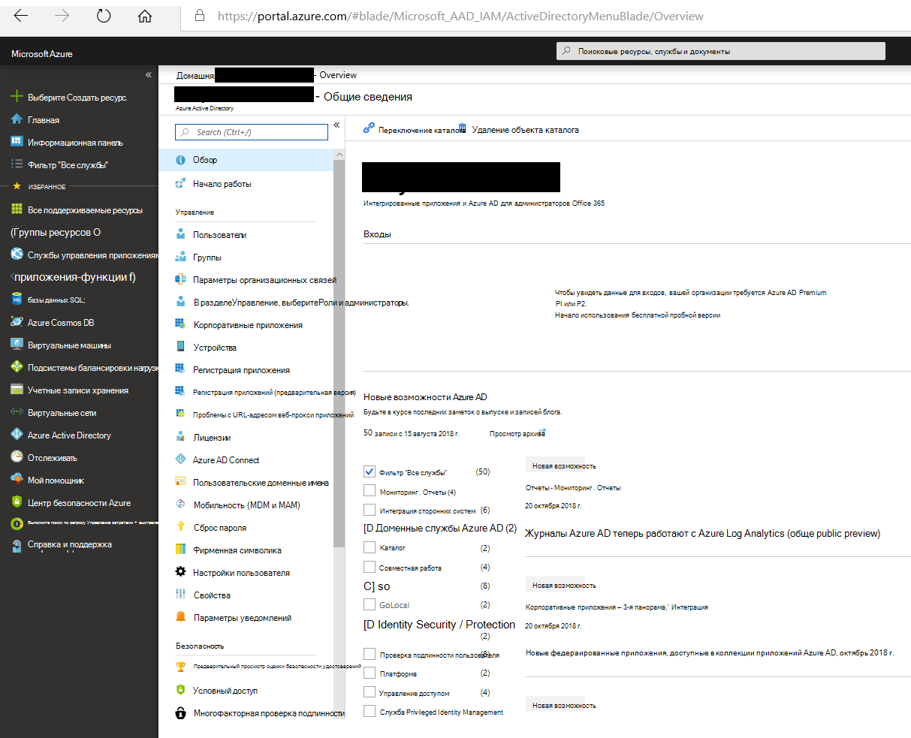
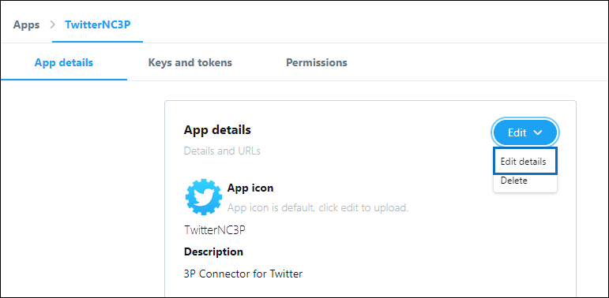

# Развертывание соединитела для архива данных TwitterDeploy a connector to archive Twitter data

В этой статье содержится пошаговые процедуры развертывания соединители, использующие службу импорта Office 365 для импорта данных из учетной записи Twitter вашей организации в Microsoft 365.This article contains the step-by-step process to deploy a connector that uses the Office 365 Import service to import data from your organization's Twitter account to Microsoft 365. Общие сведения об этом процессе и список предварительных условий, необходимых для развертывания соединители Twitter, см. в настройках соединитела для архивации [данных Twitter. ](archive-twitter-data-with-sample-connector.md)For a high-level overview of this process and a list of prerequisites required to deploy a Twitter connector, see [Set up a connector to archive Twitter data ](archive-twitter-data-with-sample-connector.md). 

## Шаг 1. Создание приложения в Azure Active DirectoryStep 1: Create an app in Azure Active Directory

1. Войдите в учетную запись глобального администратора и <https://portal.azure.com> войдите в нее.Go to <https://portal.azure.com> and sign in using the credentials of a global admin account.

   

2. В левой области навигации щелкните **Azure Active Directory.**In the left navigation pane, click **Azure Active Directory**.

   

3. В левой области навигации щелкните регистрацию приложений **(предварительная версия)** и нажмите кнопку **"Новая регистрация".**In the left navigation pane, click **App registrations (Preview)** and then click **New registration**.

   

4. Зарегистрируйте приложение.Register the application. В **поле "URI перенаправления" (необязательно)** выберите "Интернет" в списке типов приложений, а затем введите поле для  `https://portal.azure.com` URI.Under **Redirect URI (optional)**, select **Web** in the application type dropdown list and then type `https://portal.azure.com` in the box for the URI.

   

5. **Скопируйте ИД приложения (клиента)** и каталог **(клиент)** и сохраните их в текстовом файле или другом безопасном расположении.Copy the **Application (client) ID** and **Directory (tenant) ID** and save them to a text file or other safe location. Эти ИД будут применяться на последующих шагах.You use these IDs in later steps.

    

6. Go to **Certificates & secrets for the new app** and under Client **secrets** click New **client secret**.Go to **Certificates & secrets for the new app** and under **Client secrets** click **New client secret**.

   

7. Создайте новый секрет.Create a new secret. В поле описания введите секрет и выберите срок действия.In the description box, type the secret and then choose an expiration period. 

   

8. Скопируйте значение секрета и сохраните его в текстовом файле или другом хранилище.Copy the value of the secret and save it to a text file or other storage location. Это секрет приложения AAD, который будет применяться на последующих шагах.This is the AAD application secret that you use in later steps.

   

## Шаг 2. Развертывание веб-службы соединителя из GitHub в учетной записи AzureStep 2: Deploy the connector web service from GitHub to your Azure account

1. Перейдите [на этот сайт GitHub и](https://github.com/microsoft/m365-sample-twitter-connector-csharp-aspnet) нажмите кнопку **"Развернуть в Azure".**Go to [this GitHub site](https://github.com/microsoft/m365-sample-twitter-connector-csharp-aspnet) and click **Deploy to Azure**.

    

2. После нажатия кнопки **"Развернуть в Azure"** вы будете перенаправлены на портал Azure с настраиваемой страницей шаблона.After you click **Deploy to Azure**, you will be redirected to an Azure portal with a custom template page. Заполните сведения **об основах** **и параметрах** и нажмите кнопку **"Купить".**Fill in the **Basics** and **Settings** details and then click **Purchase**.

   

    - **Подписка:** Выберите свою подписку Azure, в которую вы хотите развернуть веб-службу соединители Twitter.**Subscription:** Select your Azure subscription that you want to deploy the Twitter connector web service to.
    
    - **Группа ресурсов:** Выберите или создайте новую группу ресурсов.**Resource group:** Choose or create a new resource group. Группа ресурсов — это контейнер, который содержит связанные ресурсы для решения Azure.A resource group is a container that holds related resources for an Azure solution.

    - **Расположение:** Выберите расположение.**Location:** Choose a location.

    - **Имя веб-приложения:** Укажет уникальное имя для веб-приложения соединители.**Web App Name:** Provide a unique name for the connector web app. Длина имени должна быть от 3 до 18 символов.Th name must be between 3 and 18 characters in length. Это имя используется для создания URL-адреса службы приложений Azure; например, если у вас есть имя веб-приложения **twitterconnector,** URL-адрес службы приложений Azure будет **twitterconnector.azurewebsites.net.**This name is used to create the Azure app service URL; for example, if you provide the Web app name of **twitterconnector** then the Azure app service URL  will be **twitterconnector.azurewebsites.net**.
    
    - **tenantId:** ИД клиента вашей организации Microsoft 365, который вы скопировали после создания приложения соединители Facebook в Azure Active Directory на шаге 1.**tenantId:** The tenant ID of your Microsoft 365 organization that you copied after creating the Facebook connector app in Azure       Active Directory in Step 1.
    
   - **APISecretKey:** В качестве секрета можно ввести любое значение.**APISecretKey:** You can type any value as the secret. Это используется для доступа к веб-приложению соединители на шаге 5.This is used to access the connector web app in Step 5.

3. После успешного развертывания страница будет выглядеть примерно так, как по снимку экрана:After the deployment is successful, the page will look similar to the following screenshot:

    

## Шаг 3. Создание приложения TwitterStep 3: Create the Twitter app

1. Go to https://developer.twitter.com , log in using the credentials for the developer account for your organization, and then click **Apps**.Go to https://developer.twitter.com, log in using the credentials for the developer account for your organization, and then click **Apps**.

   
2. Нажмите **кнопку "Создать приложение"**.Click **Create an app**.
   
   

3. В **области сведений о приложении** добавьте сведения о приложении.Under **App details**, add information about the application.

   

4. На информационной панели разработчика Twitter выберите только что созданное приложение и нажмите кнопку **"Сведения".**On the Twitter developer dashboard, select the app that you just created and then click **Details**.
   
   

5. На **вкладке "Ключи** и маркеры" в ключах API потребителя скопируйте ключ **API** и секретный ключ API и сохраните их в текстовом файле или другом хранилище.On the **Keys and tokens** tab, under **Consumer API keys** copy both the API Key and the API secret key and save them to a text file or other storage location. Затем нажмите **кнопку "Создать",** чтобы создать маркер доступа и секрет маркера доступа и скопировать их в текстовый файл или другое место хранения.Then click **Create** to generate an access token and access token secret and copy these to a text file or other storage location.
   
   

   Затем нажмите **кнопку "Создать",** чтобы создать маркер доступа и секрет маркера доступа, и скопируйте их в текстовый файл или другое место хранения.Then click **Create** to generate an access token and an access token secret, and copy these to a text file or other storage location.

6. Перейдите **на вкладку "Разрешения"** и настройте разрешения, как показано на следующем снимке экрана:Click the **Permissions** tab and configure the permissions as shown in the following screenshot:

   

7. После сохранения параметров разрешений  перейдите на вкладку "Сведения о приложении" и нажмите кнопку **"Изменить > Изменить сведения".**After you save the permission settings, click the **App details** tab, and then click **Edit > Edit details**.

   

8. Сделайте следующее:Do the following tasks:

   - Select the checkbox to allow the connector app to sign in to Twitter.Select the checkbox to allow the connector app to sign in to Twitter.
   
   - Добавьте URI перенаправления OAuth в следующем формате: **\<connectorserviceuri> /Views/TwitterOAuth,** где *значением connectorserviceuri* является URL-адрес службы приложений Azure для вашей организации, например https://twitterconnector.azurewebsites.net/Views/TwitterOAuth .Add the OAuth redirect Uri using the following format: **\<connectorserviceuri>/Views/TwitterOAuth**, where the value of *connectorserviceuri* is the Azure app service URL for your organization; for example, https://twitterconnector.azurewebsites.net/Views/TwitterOAuth.

    

Теперь приложение разработчика Twitter готово к использованию.The Twitter developer app is now ready to use.

## Шаг 4. Настройка веб-приложения соединителиStep 4: Configure the connector web app 

1. Перейдите https:// \<AzureAppResourceName> .azurewebsites.net (где **AzureAppResourceName** — это имя ресурса приложения Azure, имя которого вы назначили в шаге 4).Go to https://\<AzureAppResourceName>.azurewebsites.net (where **AzureAppResourceName** is the name of your Azure app resource that you named in Step 4). Например, если имя **twitterconnector,** перейдите к https://twitterconnector.azurewebsites.net .For example, if the name is **twitterconnector**, go to https://twitterconnector.azurewebsites.net. Домашняя страница приложения выглядит следующим образом:The home page of the app looks like the following screenshot:

   

2. Нажмите **кнопку** "Настроить", чтобы отобразить страницу для входов.Click **Configure** to display a sign in page.

   

3. В поле "ИД клиента" введите или введите свой ИД клиента (полученный на шаге 2).In the Tenant Id box, type or paste your tenant Id (that you obtained in Step 2). В поле пароля введите или введите APISecretKey (полученный на шаге 2), а затем нажмите кнопку **"Установить** параметры конфигурации", чтобы отобразить страницу сведений о конфигурации.In the password box, type or paste the APISecretKey (that you obtained in Step 2), and then click **Set Configuration Settings** to display the configuration details page.

   

4. Введите следующие параметры конфигурацииEnter the following configuration settings 

   - **Ключ API Twitter:** Ключ API для приложения Twitter, созданного на шаге 3.**Twitter Api Key:** The API key for the Twitter application that you created in Step 3.
   
   - **Секретный ключ API Twitter:** Секретный ключ API для приложения Twitter, созданного на шаге 3.**Twitter Api Secret Key:** The API secret key for the Twitter application that you created in Step 3.
   
   - **Маркер доступа Twitter:** Маркер доступа, созданный на шаге 3.**Twitter Access Token:** The access token that you created in Step 3.
   
   - **Секрет маркера доступа Twitter:** Секрет маркера доступа, созданный на шаге 3.**Twitter Access Token Secret:** The access token secret that you created in Step 3.
   
   - **ИД приложения AAD:** ИД приложения Azure Active Directory, созданного на шаге 1**AAD Application ID:** The application ID for the Azure Active Directory app that you created in Step 1
   
   - **Секрет приложения AAD:** Значение секрета APISecretKey, созданного на шаге 1.**AAD Application Secret:** The value for the APISecretKey secret that you created in Step 1.

5. Нажмите **кнопку** "Сохранить", чтобы сохранить параметры соединители.Click **Save** to save the connector settings.

## Шаг 5. Настройка соединители Twitter в Центре соответствия требованиям Microsoft 365Step 5: Set up a Twitter connector in the Microsoft 365 compliance center

1. Go to [https://compliance.microsoft.com](https://compliance.microsoft.com) and then click Data **connectors** in the left nav.Go to [https://compliance.microsoft.com](https://compliance.microsoft.com) and then click **Data connectors** in the left nav.

2. На странице **"Соединители данных"** в **Twitter** нажмите кнопку **"Просмотреть".**On the **Data connectors** page under **Twitter**, click **View**.

3. На странице **Twitter** нажмите кнопку **"Добавить соединителю".**On the **Twitter** page, click **Add connector**.

4. На странице **"Условия обслуживания" нажмите** кнопку **"Принять".**On the **Terms of service** page, click **Accept**.

5. На странице **"Добавление учетных** данных для приложения соединителю" введите следующие сведения и нажмите кнопку **"Проверить подключение".**On the **Add credentials for your connector app** page, enter the following information and then click **Validate connection**.

   

    - В поле **"Имя"** введите имя соединитела, например, справку **Twitter.**In the **Name** box, type a name for the connector, such as **Twitter help handle**.
    
    - В поле **"URL-адрес** соединителя" введите или введите URL-адрес службы приложений Azure; например. `https://twitterconnector.azurewebsites.net`In the **Connector URL** box, type or paste the Azure app service URL; for example `https://twitterconnector.azurewebsites.net`.
    
    - В поле **"Пароль"** введите или введите значение APISecretKey, созданное на шаге 2.In the **Password** box, type or paste the value of the APISecretKey that you created in Step 2.
    
    - В поле **"ИД** приложения Azure" введите или введите или введите значение ИД приложения приложения Azure (также называемый ИД клиента), полученный на шаге 1.In the **Azure App ID** box, type or paste the value of the Azure Application App Id (also called the *client ID*) that you obtained in Step 1.

6. После успешной проверки подключения нажмите кнопку **"Далее".**After the connection is successfully validated, click **Next**.

7. На странице **авторизации Microsoft 365** для импорта данных введите или введите или введите APISecretKey еще раз, а затем щелкните веб-приложение для **входа.**On the **Authorize Microsoft 365 to import data** page, type or paste the APISecretKey again and then click  **Login web app**.

8. Click **Login with Twitter**.Click **Login with Twitter**.

9. On the Twitter sign in page, sign in using the credentials for your organization's Twitter account.On the Twitter sign in page, sign in using the credentials for your organization's Twitter account.

   

   После этого на странице Twitter отобразится следующее сообщение: "Задание соединители Twitter успешно настроено".After you sign in, the Twitter page will display the following message, "Twitter Connector Job Successfully set up."

10. Нажмите **кнопку** "Продолжить", чтобы завершить настройку соединители Twitter.Click **Continue** to complete setting up the Twitter connector.

11. На странице **"Настройка фильтров"** можно применить фильтр для первоначального импорта элементов определенного возраста.On the **Set filters** page, you can apply a filter to initially import items that are a certain age. Выберите возраст и нажмите кнопку **"Далее".**Select an age, and then click **Next**.

12. На странице **"Выбор места** хранения" введите адрес электронной почты почтового ящика Microsoft 365, в который будут импортироваться элементы Twitter, а затем нажмите кнопку **"Далее".**On the **Choose storage location** page, type the email address of Microsoft 365 mailbox that the Twitter items will be imported to, and then click **Next**.

13. Нажмите **кнопку** "Далее", чтобы просмотреть параметры соединители, а затем нажмите кнопку **"Готово",** чтобы завершить настройку соединители.Click **Next** to review the connector settings and then click **Finish** to complete the connector setup.

14. В Центре соответствия требованиям перейдите на страницу **"Соединители** данных" и перейдите на вкладку **"Соединители",** чтобы увидеть ход процесса импорта.In the compliance center, go to the **Data connectors** page, and click the **Connectors** tab to see the progress of the import process.
