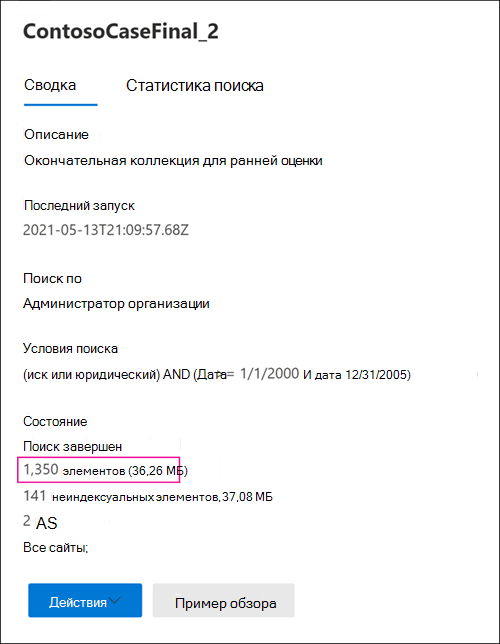

# Различия между предполагаемыми и фактическими результатами поиска по электронным даннымDifferences between estimated and actual eDiscovery search results

Этот раздел применим к поискам, которые можно выполнить с помощью одного из следующих средств Microsoft 365 поиска:This topic applies to searches that you can run using one of the following Microsoft 365 eDiscovery tools: 

- Поиск контентаContent search
- Core eDiscoveryCore eDiscovery

При запуске поиска по обнаружению электронных обнаружений средство, используемая вами, возвращает оценку количества элементов (и их общего размера), которые соответствуют критериям поиска.When you run an eDiscovery search, the tool you're using will return an estimate of the number of items (and their total size) that match the search criteria. Например, при выполнении поиска в центре Microsoft 365 соответствия требованиям предполагаемые результаты поиска отображаются на странице вылетов для выбранного поиска.For example, when you run a search in the Microsoft 365 compliance center, the estimated search results are displayed on the flyout page for the selected search.
  

  
Это та же оценка общего размера и количества элементов, отображаемых в экспортируемом средстве eDiscovery при экспорте результатов на локальный компьютер и в отчете Export Summary, загруженных с результатами поиска.This is the same estimate of total size and number of items that is displayed in the eDiscovery Export Tool when you export results to a local computer and in the Export Summary report that's downloaded with the search results.
  
**Предполагаемые результаты в средстве экспорта электронных открытий****Estimated results in the eDiscovery Export tool**

  
**Предполагаемые результаты в отчете По сводке экспорта****Estimated results in Export Summary report**

  
Однако, как вы заметите на предыдущем скриншоте отчета "Сводка экспорта", размер и количество скачаемых фактических результатов поиска отличаются от размера и количества предполагаемых результатов поиска.However, as you'll notice in the previous screenshot of the Export Summary report, the size and number of actual search results that are downloaded are different than the size and number of estimated search results.
  

  
Вот несколько причин для этих различий:Here are some reasons for these differences:
  
- **Способ оценки результатов**.**The way results are estimated**. Оценка результатов поиска — это оценка (а не фактическое число) элементов, которые соответствуют критериям запроса поиска.An estimate of the search results is just that, an estimate (and not an actual count) of the items that meet the search query criteria. Для компиляции оценки Exchange элементов в используемом средстве eDiscovery запрашивается список ID-сообщений, которые соответствуют критериям поиска Exchange базы данных.To compile the estimate of Exchange items, a list of the message IDs that meet the search criteria is requested from the Exchange database by the eDiscovery tool you're using. Но при экспорте результатов поиска поиск будет повторно перезаверять, а фактические сообщения будут извлечены из Exchange базы данных.But when you export the search results, the search is rerun and the actual messages are retrieved from the Exchange database. Таким образом, эти различия могут возникнуть из-за того, как определяется предполагаемое количество элементов и фактическое число элементов.So these differences might result because of how the estimated number of items and the actual number of items are determined.

- **Изменения, происходящие между временем оценки и экспорта результатов поиска.****Changes that happen between the time when estimating and exporting search results**. При экспорте результатов поиска поиск перезапущен для сбора последних элементов в индексе поиска, которые соответствуют критериям поиска.When you export search results, the search is restarted to collect that most recent items in the search index that meet the search criteria. Возможно, существуют дополнительные элементы, созданные, отправленные или полученные, которые соответствуют критериям поиска в период между сбором предполагаемых результатов поиска и экспортом результатов поиска.It's possible there are additional items were created, sent, or received that meet the search criteria in the time between when the estimated search results were collected and when the search results were exported. Кроме того, возможно, элементы, которые находились в индексе поиска при оценке результатов поиска, больше не существуют, так как они были стерта из расположения контента до экспорта результатов поиска.It's also possible that items that were in the search index when the search results were estimated are no longer there because they were purged from the content location before the search results are exported. Один из способов смягчения этой проблемы — указать диапазон дат для поиска по электронным данным.One way to mitigate this issue is to specify a date range for an eDiscovery search. Другой способ — разместить удержание в расположениях контента, чтобы элементы сохранялись и не могли быть стерт.Another way is to place a hold on content locations so that items are preserved and can't be purged. 

   Несмотря на редкий случай, даже в том случае, если применяется удержание, время от времени может быть удалено обслуживание встроенных элементов календаря (которые не являются редактируемыми пользователем, но включены во многие результаты поиска).Although rare, even in the case when a hold is applied, maintenance of built-in calendar items (which aren't editable by the user, but are included in many search results) may be removed from time to time. Это периодическое удаление элементов календаря приведет к меньшему экспорту элементов.This periodic removal of calendar items will result in fewer items that are exported.

- **Элементы unindexed**.**Unindexed items**. Элементы, которые являются неиндексуалами для поиска, могут привести к различиям между предполагаемыми и фактическими результатами поиска.Items that are unindexed for search can cause differences between estimated and actual search results. При экспорте результатов поиска можно включить неиндексуалные элементы.You can include unindexed items when you export the search results. Если при экспорте результатов поиска будут включены неиндексуалные элементы, возможно, будет экспортироваться больше элементов.If you include unindexed items when exporting search results, there might be more items that are exported. Это приведет к разнице между предполагаемыми и экспортными результатами поиска.This will cause a difference between the estimated and exported search results.

    При использовании средства поиска контента при экспорте результатов поиска можно включить неиндексы.When using the Content search tool, you have the option to include unindexed items when you export search results. Количество неиндексуальных элементов, возвращаемого поиском, перечислены на странице вылетов вместе с другими предполагаемыми результатами поиска.The number of unindexed items returned by the search is listed on the flyout page together with the other estimated search results. Все неидексные элементы также будут включены в общий размер предполагаемых результатов поиска.Any unindexed items would also be included in the total size of the estimated search results. При экспорте результатов поиска у вас есть возможность включить или не включать неиндексуальных элементов.When you export search results, you have the option to include or not include unindexed items. Настройка этих параметров может привести к различиям между предполагаемыми и фактическими скачаными результатами поиска.How you configure these options might result in differences between estimated and the actual search results that are downloaded.

- **Экспорт результатов поиска контента, который включает все расположения контента.****Exporting the results of a Content search that includes all content locations**. Если результаты поиска, из которых вы экспортируете результаты, это поиск всех местоположений контента в организации, то экспортируются только неиндексы из расположения контента, содержащие элементы, которые соответствуют критериям поиска.If the search that you're exporting results from was a search of all content locations in your organization, then only the unindexed items from content locations that contain items that match the search criteria will be exported. In other words, if no search results are found in a mailbox or site, then any unindexed items in that mailbox or site won't be exported.In other words, if no search results are found in a mailbox or site, then any unindexed items in that mailbox or site won't be exported. Тем не менее, неиндексуалные элементы из всех местоположений контента (даже те, которые не содержат элементов, которые соответствуют запросу поиска) будут включены в предполагаемые результаты поиска.However, unindexed items from all content locations (even those that don't contain items that match the search query) will be included in the estimated search results.

    Кроме того, если поиск, который экспортируется, будет экспортироваться из определенных местоположений контента, а затем будут экспортироваться неидексные элементы (которые не исключаются критериями поиска) из всех местоположений контента, указанных в поиске.Alternatively, if the search that you're exporting results from included specific content locations, then unindexed items (that aren't excluded by the search criteria) from all the content locations specified in the search will be exported. В этом случае приблизительное число неиндексуальных элементов и количество экспортируемого неиндексуальных элементов должно быть одинаковым.In this case, the estimated number of unindexed items and the number of unindexed items that are exported should be the same.

    Причина, по которой не экспортируются неидексные элементы из каждого расположения организации, заключается в том, что это может повысить вероятность ошибок экспорта и увеличить время, необходимое для экспорта и скачивания результатов поиска.The reason for not exporting unindexed items from every location in the organization is because it might increase the likelihood of export errors and increase the time it takes to export and download the search results.

- **Неиндексуалные** элементы SharePoint и OneDrive не включены в оценки поиска.**Unindexed items in SharePoint and OneDrive not included in the search estimates**. Неустановленные элементы SharePoint сайтов и OneDrive для бизнеса учетных записей не включаются в предполагаемые результаты поиска.Unindexed items from SharePoint sites and OneDrive for Business accounts aren't included in the estimated search results. Это потому, что SharePoint не содержит данных для неиндексуальных элементов.This is because the SharePoint index doesn't contain data for unindexed items. В оценку поиска включены только неиндексы из почтовых ящиков.Only unindexed items from mailboxes are included in the search estimates. Однако при экспорте результатов поиска в SharePoint и OneDrive включены неидексные элементы, что увеличит количество экспортируемого.However, if you include unindexed items when exporting search results, unindexed items in SharePoint and OneDrive are included, which will increase the number of items that are actually exported. Это приведет к различиям между предполагаемыми результатами (которые не включают неиндексуальных элементов на сайтах SharePoint и OneDrive) и фактическими скачанными элементами.This will result in differences between the estimated results (which don't include unindexed items in SharePoint and OneDrive sites) and the actual items that are downloaded. Правило об экспорте неиндексуальных элементов только из расположения контента, содержащем элементы, которые соответствуют критериям поиска, по-прежнему применяется в этой ситуации.The rule about exporting unindexed items only from content locations that contain items that match the search criteria still applies in this situation.

- **Версии документов в SharePoint и OneDrive**.**Document versions in SharePoint and OneDrive**. При поиске SharePoint сайтов и OneDrive учетных записей несколько версий документа не включаются в число предполагаемых результатов поиска.When searching SharePoint sites and OneDrive accounts, multiple versions of a document aren't included in the count of estimated search results. Но при экспорте результатов поиска можно включить все версии документов.But you have the option to include all document versions when you export the search results. Если при экспорте результатов поиска будут включены версии документов, фактическое число (и общий размер) экспортируемого товара будет увеличено.If you include document versions when exporting search results, the actual number (and total size) of the exported items will be increased.

- **SharePoint папки**.**SharePoint folders**. Если имя папок в SharePoint совпадает с поисковым запросом, оценка поиска будет включать в себя количество этих папок (но не элементов в этих папках).If the name of folders in SharePoint matches a search query, the search estimate will include a count of those folders (but not the items in those folders). При экспорте результатов поиска элементы в папке экспортируются, но фактическая папка не экспортируется.When you export the search results, the items in folder are exported but the actual folder in not exported. В результате экспорт экспортируемой продукции превышает число предполагаемых результатов поиска.The result is that the number of exported items export will more than the number of estimated search results. Если папка пуста, количество экспортируемого результата поиска будет сокращено на один элемент, так как фактическая папка не экспортируется.If a folder is empty, then the number of actual search results exported will be reduced by one item, because the actual folder isn't exported.

- **SharePoint списки**.**SharePoint lists**. Если имя списка SharePoint совпадает с поисковым запросом, в смету поиска будет включено количество всех элементов в списке.If the name of a SharePoint list matches a search query, the search estimate will include a count of all the items in the list. При экспорте результатов поиска список (и элементы списка) экспортируется как единый CSV-файл.When you export the search results, the list (and the list items) is exported as a single CSV file. Это позволит сократить фактическое количество экспортируемого товара.This will reduce the actual number of items actually exported. Если список содержит вложения, вложения будут экспортироваться в виде отдельных документов, что также увеличит количество экспортируемого товара.If the list contains attachments, the attachments will be exported as separate documents, which will also increase the number of items exported.

- **Форматы необработанных файлов по сравнению с экспортом форматов файлов.****Raw file formats versus exported file formats**. Для Exchange элементов расчетный размер результатов поиска рассчитывается с помощью необработанных Exchange сообщений.For Exchange items, the estimated size of the search results is calculated by using the raw Exchange message sizes. Однако сообщения электронной почты экспортируются в PST-файле или в виде отдельных сообщений (которые форматируются как файлы EML).However, email messages are exported in a PST file or as individual messages (which are formatted as EML files). Оба этих варианта экспорта используют другой формат файла, чем необработанные сообщения Exchange, в результате чего общий объем экспортируемого файла отличается от предполагаемого размера файла.Both of these export options use a different file format than raw Exchange messages, which results in the total exported file size being different than the estimated file size.

- **De-duplication of Exchange элементов во время экспорта.****De-duplication of Exchange items during export**. Для Exchange элементов снижение дублирования уменьшает количество экспортируемого.For Exchange items, de-duplication reduces the number of items that are exported. При экспорте можно де дублировать результаты поиска.You have the option to de-duplicate the search results when you export them. Для Exchange сообщений это означает, что экспортируется только один экземпляр сообщения, даже если это сообщение может быть найдено в нескольких почтовых ящиках.For Exchange messages, this means that only a single instance of a message is exported, even though that message might be found in multiple mailboxes. Предполагаемые результаты поиска включают каждый экземпляр сообщения.The estimated search results include every instance of a message. Таким образом, если при экспорте результатов поиска вы выбираете параметр de-duplication, фактическое число экспортируемого товара может быть значительно меньше предполагаемого количества элементов.So if you choose the de-duplication option when exporting search results, the actual number of items that are exported might be considerably less than the estimated number of items.

Отчет о результатах поиска (Results.csv файл) содержит запись для каждого дубликата сообщения и определяет исходный почтовый ящик, в котором расположено дублирующее сообщение.The search results report (Results.csv file) contains an entry for each duplicate message and identifies the source mailbox where a duplicate message is located. Это позволяет определить все почтовые ящики, содержащие дубликат сообщения.This helps you identify all mailboxes that contain a duplicate message.

> [!NOTE]
> Если при экспорте результатов поиска или загрузке отчетов не выбраны элементы **Include,** которые зашифрованы или имеют параметр непризнаного формата, загружаются отчеты об ошибках индекса, но в них нет записей.If you don't select the **Include items that are encrypted or have an unrecognized format** option when you export search results or just download the reports, the index error reports are downloaded but they don't have any entries. Это не означает, что нет ошибок индексирования.This doesn't mean there aren't any indexing errors. Это просто означает, что неиндексуалные элементы не были включены в экспорт.It just means that unindexed items weren't included in the export.
