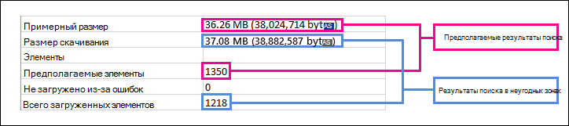

# Различия между предполагаемыми и фактическими результатами поиска eDiscoveryDifferences between estimated and actual eDiscovery search results

Этот раздел относится к поисковым запросам, которые можно выполнить с помощью одного из следующих средств eDiscovery Microsoft 365:This topic applies to searches that you can run using one of the following Microsoft 365 eDiscovery tools: 

- Поиск контентаContent search
- Core eDiscoveryCore eDiscovery 
   
При запуске поиска eDiscovery используемая вами программа возвращает оценку количества элементов (и их общего размера), которые соответствуют условиям поиска.When you run an eDiscovery search, the tool you're using will return an estimate of the number of items (and their total size) that meet the search criteria. Например, при выполнении поиска в Центре соответствия требованиям Microsoft 365 предполагаемые результаты поиска отображаются на странице flyout выбранного поиска.For example, when you run a search in the Microsoft 365 compliance center, the estimated search results are displayed on the flyout page for the selected search.
  

  
Это та же оценка общего размера и количества элементов, которая отображается в средстве экспорта для eDiscovery при экспорте результатов на локальный компьютер и в сводный отчет по экспорту, загруженный вместе с результатами поиска.This is the same estimate of total size and number of items that is displayed in the eDiscovery Export Tool when you export results to a local computer and in the Export Summary report that's downloaded with the search results.
  
**Предполагаемые результаты в средстве экспорта eDiscovery****Estimated results in the eDiscovery Export tool**

  
**Предполагаемые результаты в сводных отчетах по экспорту****Estimated results in Export Summary report**

  
Однако, как вы заметите на предыдущем снимке экрана отчета "Сводка по экспорту", размер и количество фактических результатов поиска отличаются от размера и количества предполагаемых результатов поиска.However, as you'll notice in the previous screenshot of the Export Summary report, the size and number of actual search results that are downloaded are different than the size and number of estimated search results.
  

  
Вот несколько причин для этих различий:Here are some reasons for these differences:
  
- **Способ оценки результатов.****The way results are estimated**. Оценка результатов поиска — это оценка (а не фактическое число) элементов, которые соответствуют условиям поискового запроса.An estimate of the search results is just that, an estimate (and not an actual count) of the items that meet the search query criteria. Для компиляции оценки элементов Exchange с помощью используемого средства eDiscovery запрашивается список ИД сообщений, которые соответствуют условиям поиска.To compile the estimate of Exchange items, a list of the message IDs that meet the search criteria is requested from the Exchange database by the eDiscovery tool you're using. Но при экспорте результатов поиска поиск повторно и фактические сообщения извлекаются из базы данных Exchange.But when you export the search results, the search is rerun and the actual messages are retrieved from the Exchange database. Поэтому эти различия могут возникнуть из-за предполагаемого количества элементов и фактического числа элементов.So these differences might result because of how the estimated number of items and the actual number of items are determined.

- **Изменения, которые происходят между временем оценки и экспорта результатов поиска.****Changes that happen between the time when estimating and exporting search results**. При экспорте результатов поиска поиск перезапускается для сбора последних элементов в индексе поиска, которые соответствуют условиям поиска.When you export search results, the search is restarted to collect that most recent items in the search index that meet the search criteria. Возможно, что были созданы, отправлены или получены дополнительные элементы, которые соответствуют условиям поиска в период между сбором предполагаемых результатов поиска и экспортом результатов поиска.It's possible there are additional items were created, sent, or received that meet the search criteria in the time between when the estimated search results were collected and when the search results were exported. Также возможно, что элементы, которые находились в индексе поиска при оценке результатов поиска, больше не будут там, так как они были исключены из расположения контента до экспорта результатов поиска.It's also possible that items that were in the search index when the search results were estimated are no longer there because they were purged from the content location before the search results are exported. Один из способов устранить эту проблему — указать диапазон дат для поиска при обнаружении электронных данными.One way to mitigate this issue is to specify a date range for an eDiscovery search. Другой способ — на удержание расположения контента, чтобы элементы сохранялись и не могли быть стертами.Another way is to place a hold on content locations so that items are preserved and can't be purged. 

   Хотя это редко, даже если применяется удержание, время от времени может быть удалено обслуживание встроенных элементов календаря (которые не редактируемы пользователем, но включены во множество результатов поиска).Although rare, even in the case when a hold is applied, maintenance of built-in calendar items (which aren't editable by the user, but are included in many search results) may be removed from time to time. Это периодическое удаление элементов календаря приведет к меньшему объему экспортируемого элементов.This periodic removal of calendar items will result in fewer items that are exported.

- **Неndexed элементы**.**Unindexed items**. Элементы, которые неndexed для поиска, могут привести к различиям между предполагаемыми и фактическими результатами поиска.Items that are unindexed for search can cause differences between estimated and actual search results. При экспорте результатов поиска можно включить неиndexed элементы.You can include unindexed items when you export the search results. Если при экспорте результатов поиска вы включаете неиndexed элементы, возможно, будет экспортироваться больше элементов.If you include unindexed items when exporting search results, there might be more items that are exported. Это приведет к разнице между предполагаемыми и экспортными результатами поиска.This will cause a difference between the estimated and exported search results.

    При использовании средства поиска контента вы можете включить неиndexed элементы в оценку поиска.When using the Content search tool, you have the option to include unindexed items in the search estimate. Количество неиndexed элементов, возвращаемого поиском, перечислены на странице flyout вместе с другими предполагаемыми результатами поиска.The number of unindexed items returned by the search is listed on the flyout page together with the other estimated search results. Любые неndexed элементы также будут включены в общий размер предполагаемых результатов поиска.Any unindexed items would also be included in the total size of the estimated search results. При экспорте результатов поиска можно включать или не включать неиndexed элементы.When you export search results, you have the option to include or not include unindexed items. Настройка этих параметров может привести к различиям между предполагаемыми и фактическими скачиваемых результатами поиска.How you configure these options might result in differences between estimated and the actual search results that are downloaded.

- **Экспорт результатов поиска контента, который включает все расположения контента.****Exporting the results of a Content Search that includes all content locations**. Если поиск, из которых экспортируются результаты, был поиском по всем расположениям контента в организации, будут экспортироваться только неиndexed элементы из местоположений контента, которые содержат элементы, которые соответствуют условиям поиска.If the search that you're exporting results from was a search of all content locations in your organization, then only the unindexed items from content locations that contain items that match the search criteria will be exported. In other words, if no search results are found in a mailbox or site, then any unindexed items in that mailbox or site won't be exported.In other words, if no search results are found in a mailbox or site, then any unindexed items in that mailbox or site won't be exported. Однако неиndexed элементы из всех местоположений контента (даже тех, которые не содержат элементов, которые соответствуют поисковому запросу) будут включены в предполагаемые результаты поиска.However, unindexed items from all content locations (even those that don't contain items that match the search query) will be included in the estimated search results.

    Кроме того, при экспорте результатов из определенных местоположений контента будут экспортироваться неиndexed элементы (которые не исключаются условиями поиска) из всех местоположений контента, указанных в поиске.Alternatively, if the search that you're exporting results from included specific content locations, then unindexed items (that aren't excluded by the search criteria) from all the content locations specified in the search will be exported. В этом случае приблизительное количество неиndexed элементов и количество экспортируемого неиndexed элементов должны быть одинаковыми.In this case, the estimated number of unindexed items and the number of unindexed items that are exported should be the same.

    Причина, по которой не требуется экспортировать неиndexed элементы из всех расположений в организации, заключается в том, что это может увеличить вероятность ошибок экспорта и увеличить время, необходимое для экспорта и загрузки результатов поиска.The reason for not exporting unindexed items from every location in the organization is because it might increase the likelihood of export errors and increase the time it takes to export and download the search results.

- **Форматы необработанных и экспортных файлов.****Raw file formats versus exported file formats**. Для элементов Exchange примерный размер результатов поиска рассчитывается с использованием необработанных размеров сообщений Exchange.For Exchange items, the estimated size of the search results is calculated by using the raw Exchange message sizes. Однако сообщения электронной почты экспортируются в PST-файл или в виде отдельных сообщений (которые форматируются как EML-файлы).However, email messages are exported in a PST file or as individual messages (which are formatted as EML files). Оба этих варианта экспорта используют другой формат файла, чем необработанные сообщения Exchange, в результате чего общий размер экспортируемого файла отличается от предполагаемого размера файла.Both of these export options use a different file format than raw Exchange messages, which results in the total exported file size being different than the estimated file size.

- **Версии документов.****Document versions**. Для документов SharePoint несколько версий документа не включаются в предполагаемые результаты поиска.For SharePoint documents, multiple versions of a document aren't included in the estimated search results. Однако при экспорте результатов поиска можно включить все версии документов, что увеличит фактическое число (и общий размер) экспортных документов.But you have the option to include all document versions when you export the search results, which will increase the actual number (and total size) of the exported documents. 

- **De-duplication**.**De-duplication**. Для элементов Exchange при дублировании уменьшается количество экспортируемого элементов.For Exchange items, de-duplication reduces the number of items that are exported. При экспорте можно откопировать результаты поиска.You have the option to de-duplicate the search results when you export them. Для сообщений Exchange это означает, что экспортируется только один экземпляр сообщения, даже если это сообщение может быть найдено в нескольких почтовых ящиках.For Exchange messages, this means that only a single instance of a message is exported, even though that message might be found in multiple mailboxes. Приблизительными результатами поиска являются все экземпляры сообщения.The estimated search results include every instance of a message. Таким образом, если при экспорте результатов поиска выбрать вариант дедупциализации, фактическое число экспортируемого элементов может быть значительно меньше предполагаемого количества элементов.So if you choose the de-duplication option when exporting search results, the actual number of items that are exported might be considerably less than the estimated number of items.

    Кроме того, следует помнить, что при выборе варианта депциации все элементы Exchange экспортируются в одном PST-файле, а структура папок из исходных почтовых ящиков не сохраняется.Another thing to keep in mind if you choose the de-duplication option is that all Exchange items are exported in a single PST file and the folder structure from the source mailboxes isn't preserved. Экспортный PST-файл содержит только элементы электронной почты.The exported PST file just contains the email items. Однако отчет результатов поиска содержит запись для каждого экспортируемго сообщения, которая определяет исходный почтовый ящик, в котором находится сообщение.However, a search results report contains an entry for each exported message that identifies the source mailbox where the message is located. Это помогает определить все почтовые ящики, содержащие дублирующиеся сообщения.This helps you identify all mailboxes that contain a duplicate message. Если не включить дедупликацию, будет экспортирован отдельный PST-файл для каждого почтового ящика, включенного в поиск.If you don't enable de-duplication, a separate PST file is exported for each mailbox included in the search. 
 
> [!NOTE]
> Если при экспорте  результатов поиска или загрузке отчетов элементы include не выбраны, загружаются отчеты об ошибках индекса, но в них нет записей.If you don't select the **Include items that are encrypted or have an unrecognized format** option when you export search results or just download the reports, the index error reports are downloaded but they don't have any entries. Это не означает, что ошибок индексирования нет.This doesn't mean there aren't any indexing errors. Это просто означает, что неиndexed элементы не были включены в экспорт.It just means that unindexed items weren't included in the export. 
