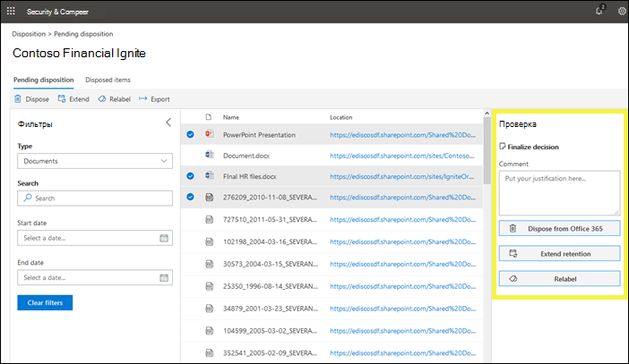
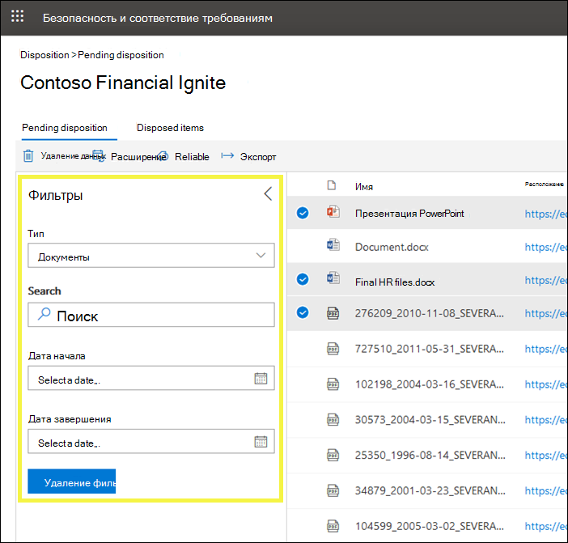

# Обзор проверок ликвидации

Когда содержимое достигает окончания срока хранения, существует несколько причин, по которым может потребоваться проверить, можно ли его удалить ("удалено"). Например, может потребоваться выполнить следующие действия:
  
- Приостановка удаления ("расположения") релевантного контента в случае судебного разбирательства или аудита.
    
- Удаление контента из списка расстановки для хранения в архиве, если это содержимое содержит исследование или историческое значение.
    
- Назначьте другой срок хранения содержимому, если исходная политика была временным или предустановленным решением.
    
- Возврат контента клиентам или их передача в другую организацию.
    
Когда вы создаете метку хранения в центре соответствия требованиям Microsoft 365, центре безопасности 365 Майкрософт или Office 365 & центр соответствия требованиям, вы можете выбрать активацию расстановки в конце периода хранения. При проверке ликвидации:
  
- Выбранные пользователи получат уведомление по электронной почте о том, что у них есть контент для просмотра. Обратите внимание, что уведомления отправляются еженедельно.
    
- Рецензенты отправляются на страницу **размещения** в центре соответствия &amp; требованиям безопасности для просмотра контента. Проверяющие могут видеть, сколько элементов для каждой метки хранения ожидают расстановки, а затем выберите метку хранения, чтобы просмотреть все содержимое с этой меткой.
    
- Для каждого документа или электронной почты проверяющий может выполнить следующие действия:
    
  - Примените другую метку хранения.
    
  - Расширьте срок хранения.
    
  - Окончательно удалить.
    
- Проверяющие могут просматривать как ожидающие, так и завершенные расположения, а также экспортировать этот список в виде CSV-файла.

> [!NOTE]
> Для рецензирования расстановки требуется подписка на Office 365 корпоративный для Office.
  
Обзор ликвидации может включать контент в почтовые ящики Exchange, сайты SharePoint, учетные записи OneDrive и группы Office 365. Содержимое, ожидающее проверки ликвидации в этих расположениях, удаляется только после того, как рецензент выберет окончательное удаление контента.
  

## Настройка проверки ликвидации путем создания метки хранения

Это базовый рабочий процесс для настройки проверки ликвидации. Обратите внимание, что в этом примере показана публикация метки хранения и ее применение вручную пользователем; Кроме того, метка хранения, инициирующая проверку ликвидации, может быть автоматически применена к содержимому.
  

  
Проверка ликвидации является возможностью при создании метки хранения в Office 365. Этот параметр недоступен в политике хранения, но только в метке хранения, настроенной на хранение контента.
  
Дополнительные сведения о метках хранения приведены в разделе [Обзор меток хранения](labels.md).
  

 
> [!NOTE]
> При указании параметра **уведомлять этих пользователей о наличии элементов, готовых к просмотру**, укажите пользователя. Для этого параметра не поддерживаются группы Office 365.

## Удаление контента

Когда проверяющий получает уведомление по электронной почте о том, что контент готов к просмотру, он может перейти на страницу **размещения** в центре безопасности &amp; и соответствия требованиям. Проверяющие могут видеть, сколько элементов для каждой метки хранения ожидают расстановки, а затем выберите метку хранения, чтобы просмотреть все содержимое с этой меткой.

После выбора метки хранения на следующей странице отображаются все ожидающие утверждения для этой метки.

Затем проверяющий может: 
  
- Примените другую метку хранения.
    
- Продлить срок хранения.
    
- Окончательное удаление элемента.

Обратите внимание, что проверяющий может выбрать несколько элементов и удалить их одновременно.
    
Проверяющий также может использовать ссылку для просмотра документа в его исходном расположении, если у проверяющего есть разрешения для этого расположения. Во время проверки ликвидации содержимое никогда не перемещается из исходного расположения и никогда не удаляется до тех пор, пока проверяющий не решит это.
  
Обратите внимание, что уведомления по электронной почте автоматически отправляются проверяющим. Таким образом, когда содержимое достигает окончания срока хранения, рецензентам может потребоваться до семи дней для получения уведомления по электронной почте о том, что содержимое ожидает расстановки.
  
Кроме того, обратите внимание на то, что все действия по размещению подлежат аудиту. Для этого необходимо включить аудит по крайней мере один день перед первым действием обработки — дополнительные сведения можно найти в статье [Поиск в журнале аудита в центре безопасности &amp; и соответствия требованиям Office 365](search-the-audit-log-in-security-and-compliance.md). 
  
## Разрешения для ликвидации

Чтобы получить доступ к странице **расположения** , проверяющим необходимо назначить роль **управления ликвидацией** и роль " **журналы аудита только для просмотра** ". [Просмотрите инструкции](../security/office-365-security/grant-access-to-the-security-and-compliance-center.md) по назначению ролей.

Относится только к роли **журналов аудита только для просмотра** :

- Так как базовый командлет, используемый для поиска в журнале аудита, является командлетом Exchange Online, ему необходимо назначить эту роль с помощью [центра администрирования Exchange в Exchange Online](https://docs.microsoft.com/Exchange/exchange-admin-center), а не с помощью страницы **разрешений** в центре безопасности & соответствия требованиям. Инструкции см в разделе [Управление группами ролей в Exchange Online](https://docs.microsoft.com/Exchange/permissions-exo/role-groups).

- Группы Office 365 не поддерживаются для этой роли. Вместо этого назначьте почтовые ящики пользователей или почтовых пользователей.
  
## Время до окончательного удаления ликвидации контента

Контент, ожидающий проверки ликвидации, удаляется только после того, как рецензент выберет окончательное удаление контента. Когда проверяющий выбирает этот параметр, контент на сайте SharePoint или в учетной записи OneDrive становится доступным для стандартного процесса очистки, описанного в этом разделе: [как политика хранения работает с контентом на месте](retention-policies.md#how-a-retention-policy-works-with-content-in-place).
  
Это означает, что:
  
- Содержимое библиотеки документов будет перемещено в корзину первого уровня **в течение 7 дней** после завершения, а затем окончательно удалено через **93 дней** после этого. Корзина не индексируется службой поиска, поэтому ее содержимое недоступно для удержания обнаружения электронных данных.

- Контент из библиотеки хранения хранения будет окончательно удален **в течение 7 дней с момента** расстановки.

- Элементы в почтовом ящике Exchange будут окончательно удалены **в течение 14 дней** до расстановки. (Обратите внимание, что по умолчанию задано значение 14 дней, но его можно настроить до 30 дней.)
    
## Просмотр ожидающих расстановки и откладываемых элементов

На странице **ожидания размещения** можно просматривать как ожидающие, так и завершенные расположения для определенной метки хранения: 
  
- В **ожидающем** процессе обработки отображаются элементы, достигнутые в конце срока хранения и требующие проверки ликвидации. После проверки каждого элемента решите, следует ли применить к нему другую метку хранения, продлить срок хранения или окончательно удалить его. Можно выбрать несколько элементов.
    
- На вкладке **ликвидированные элементы** отображаются безвозвратно удаленные элементы, которые уже прошли проверку ликвидации. Они показывают, что процесс постоянного удаления может занять несколько дней, как указано в приведенном выше разделе. Элементы, к которым применена другая метка хранения, или время хранения, расширенное в рамках проверки, не отображаются здесь.

    
### Фильтрация представлений расстановки

Вы можете отфильтровать эти представления по метке хранения или диапазону времени. Для ожидающих расстановки диапазон времени зависит от даты истечения срока действия. Для списанных элементов диапазон времени зависит от даты удаления.
  

### Экспорт элементов ликвидации

Кроме того, вы можете экспортировать элементы из любого представления в виде CSV-файла, который можно открыть в Excel.
  

  

