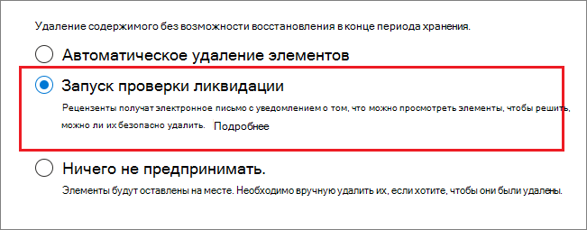
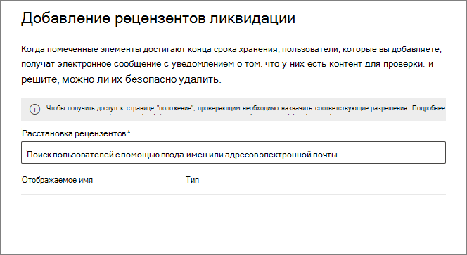

# Ликвидация содержимого

>*[Руководство по лицензированию Microsoft 365 для обеспечения безопасности и соответствия требованиям](https://aka.ms/ComplianceSD).*

Используйте вкладку **Ликвидация** из раздела **Управление записями** в Центре соответствие требованиям Microsoft 365, чтобы управлять проверками перед ликвидацией и просматривать [записи](records-management.md#records), которые были автоматически удалены по истечении периода хранения. 

## Предварительные требования для просмотра ликвидации содержимого

Для управления проверками перед ликвидацией и подтверждения того, что записи были удалены, необходимы соответствующие разрешения, и аудит должен быть включен.

### Разрешения на ликвидацию

Чтобы получить доступ к вкладке **Ликвидация** в Центре соответствия требованиям Microsoft 365, пользователи должны иметь роль администратора **Управлением ликвидацией**. Эта роль включена в группы ролей администратора по умолчанию, **Администратора соответствия требованиям** и **Администратора данных соответствия требованиям**.

Чтобы предоставить пользователям необходимую роль Управления ликвидацией, необходимо либо добавить их в одну из этих групп ролей по умолчанию, либо создать настраиваемую группу ролей (например, под названием «Рецензенты ликвидации») и предоставить этой группе роль Управления ликвидацией.  

> [!NOTE]
> Даже глобальному администратору необходимо предоставить роль**Управления ликвидацией**. 

Инструкции см. в статье [Предоставление пользователям доступа к Центру безопасности и соответствия требованиям Office 365](../security/office-365-security/grant-access-to-the-security-and-compliance-center.md).

### Включить аудит

Убедитесь, что аудит включен как минимум за день до первого действия по ликвидации. Дополнительные сведения см. в статье [Поиск по журналу аудита в Центре безопасности и соответствия требованиям Office 365&amp;](search-the-audit-log-in-security-and-compliance.md). 

## Проверки перед ликвидацией

По окончании периода хранения содержимого в силу ряда причин вам может потребоваться проверить его и решить, можно ли его спокойно удалить («ликвидировать»). Например, вам может потребоваться:
  
- Отложить удаление важного содержимого в случае судебного разбирательства или аудита;
    
- Удалить содержимое из списка на ликвидацию, чтобы сохранить его в архиве, если оно представляет исследовательский или исторический интерес;
    
- Назначить другой период хранения содержимого, возможно потому, что исходные параметры хранения носили временный или предварительный характер;
    
- Вернуть содержимое клиентам или передать другой организации.

Когда проверка перед ликвидацией начинается по истечении периода хранения:
  
- Выбранные вами люди получают по электронной почте уведомление о том, что есть содержимое для проверки. Эти рецензенты могут быть отдельными пользователями или группами безопасности с поддержкой почты. Обратите внимание, что уведомления отправляются еженедельно.
    
- Рецензенты переходят на вкладку **Ликвидация** в Центре соответствия требованиям Microsoft 365, чтобы просмотреть содержимое и принять решение о том, следует ли удалить его навсегда, продлить период его хранения или применить другую метку хранения.

Проверка перед ликвидацией может включать содержимое почтовых ящиков Exchange, сайтов SharePoint, учетных записей OneDrive и групп Microsoft 365. Содержимое, ожидающее проверки перед ликвидацией на этих ресурсах, удаляется только после того, как проверяющий выберет окончательное удаление содержимого.

> [!NOTE]
> В почтовом ящике должно быть не менее 10 МБ данных для обеспечения поддержки проверок перед ликвидации.

Обзор всех незавершенных ликвидаций можно просмотреть на вкладке **Обзор**. Например:

При выборе **Просмотр всех незавершенных ликвидаций**, вы перейдете на страницу **Ликвидация**. Пример.

### Рабочий процесс проверки перед ликвидацией

На следующей схеме показан основной рабочий процесс проверки перед ликвидацией, когда метка хранения публикуется, а затем вручную применяется пользователем. В качестве альтернативы метка хранения, настроенная для проверки перед ликвидацией, может быть автоматически применена к содержимому.
  

  
Запуск проверки перед ликвидацией в конце периода хранения — это вариант конфигурации, доступный только с меткой хранения. Этот параметр недоступен для политики хранения.  Дополнительные сведения об этих двух решениях см. в разделе [Сведения о политиках и метках хранения](retention.md).

На странице **Определение параметров хранения** для метки хранения:

 
После выбора параметра **Запустить проверку перед ликвидацией**, на следующей странице мастера необходимо указать рецензентов ликвидации:

Для рецензентов укажите пользователя или группу безопасности с поддержкой почты. Группы Microsoft 365 ([ранее — группы Office 365](https://techcommunity.microsoft.com/t5/microsoft-365-blog/office-365-groups-will-become-microsoft-365-groups/ba-p/1303601)) не поддерживаются для этого параметра.

### Просмотр и ликвидация содержимого

Когда рецензент получает по электронной почте уведомление о том, что содержимое готово к проверке, он переходит на вкладку **Ликвидация** из раздела **Управление записями** в Центре безопасности и соответствия требованиям Microsoft 365. Рецензенты могут увидеть, сколько элементов для каждой метки хранения ожидают ликвидации, а затем выбрать метку хранения, чтобы увидеть все содержимое с этой меткой.

После выбора метки хранения на вкладке **Ожидание ликвидации** отображаются все незавершенные ликвидации для этой метки. Выберите один или несколько элементов, в которых можно выбрать действие и ввести примечание об обосновании:

Как видно на рисунке, поддерживаются следующие действия: 
  
- Окончательно удаление элемента
- Продление периода хранения
- Применение другой метки хранения

При наличии разрешения на расположение и содержимое, можно использовать ссылку в столбце **Расположение** для просмотра документов в их исходном расположении. При проверке перед ликвидацией содержимое никогда не перемещается из исходного расположения и не удаляется, пока проверяющий не выберет его удаление.

Уведомления отправляются проверяющим по электронной почте еженедельно. Этот запланированный процесс означает, что после истечения срока хранения может пройти еще семь дней, прежде чем проверяющие получат уведомление о содержимом, ожидающем ликвидации.
  
Все действия по ликвидации могут быть проверены, а введенный рецензентом текст об обосновании сохраняется и отображается в столбце **Примечание** на странице **Ликвидированные элементы**.
  
### Через какое время ликвидированное содержимое удаляется окончательно?

Содержимое, ожидающее проверки перед ликвидацией, удаляется только после того, как проверяющий выберет его окончательное удаление. После выбора проверяющим этого действия к содержимому на сайте SharePoint или в учетной записи OneDrive применяется стандартный процесс очистки, описанный в разделе [Как параметры хранения применяются к имеющемуся содержимому](retention.md#how-retention-settings-work-with-content-in-place).

## Ликвидация записей

Используйте вкладку **Ликвидация** на странице**Управление записями**, чтобы определить, какие записи будут удалены автоматически или после проверки перед ликвидацией. Эти элементы отображают **Ликвидированные записи** в столбце **Тип**. Пример.

Элементы, отображаемые на вкладке **Ликвидированные элементы** для меток хранения, хранятся в течение семи лет после ликвидации элемента с ограничением в один миллион элементов на запись для этого периода. Если вы видите, что **Число**, приближающееся к этому пределу в один миллион, и вам требуется подтверждение ликвидации для ваших записей, обратитесь в [службу поддержки Майкрософт](https://docs.microsoft.com/office365/admin/contact-support-for-business-products).

> [!NOTE]
> Эта функция основана на информации из [Единого журнала аудита](search-the-audit-log-in-security-and-compliance.md) и, поэтому требует, чтобы аудит был [включен и доступен для поиска](turn-audit-log-search-on-or-off.md), чтобы соответствующие события были записаны.
    
## Фильтрация и экспорт представлений

При выборе метки хранения на странице **Ликвидация**, вкладка **Ожидание ликвидации** (если применимо) и вкладка **Ликвидированные элементы** позволяют отфильтровать представления, чтобы облегчить поиск элементов. 

Для ожидающих проверки элементов за основу интервала времени берется дата окончания периода хранения. Для ликвидированных элементов временной диапазон основан на дате удаления.
  
Информацию об элементах в любом из представлений можно экспортировать в виде файла .csv, который затем можно сортировать и управлять с помощью Excel.

