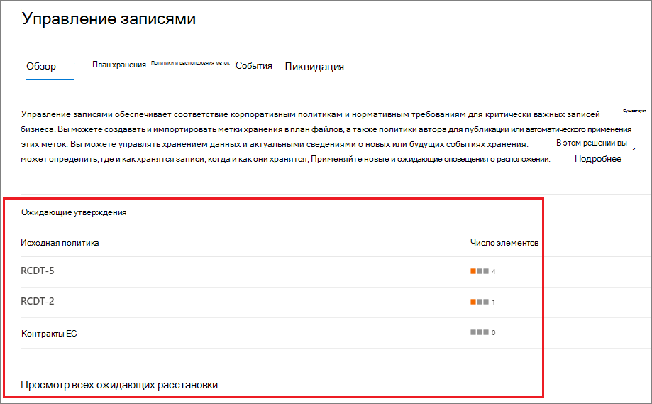
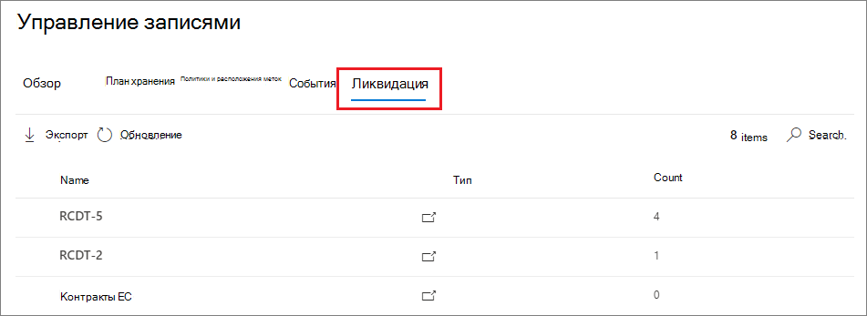
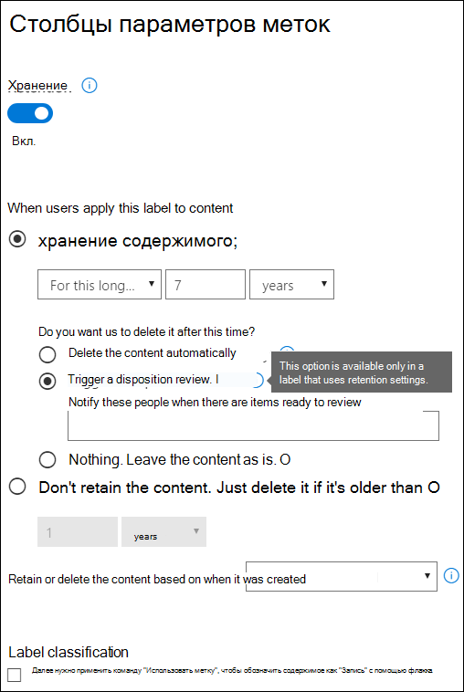
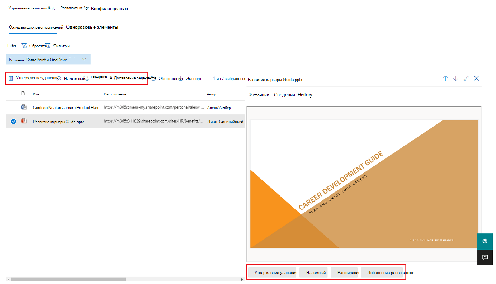
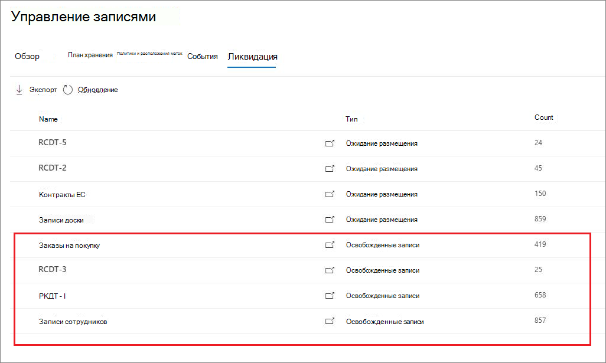
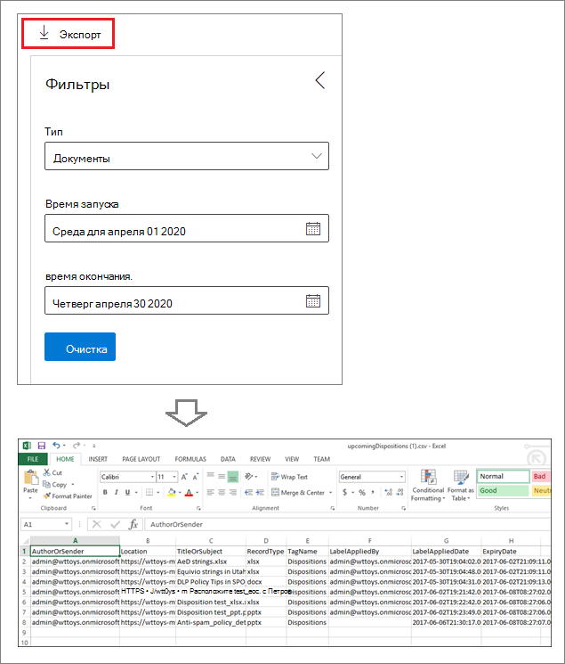

# Расстановка контента

>*[Руководство по лицензированию Microsoft 365 для обеспечения безопасности и соответствия требованиям](https://aka.ms/ComplianceSD).*

Используйте вкладку " **положение** " из списка " **Управление записями** " в центре соответствия требованиям Microsoft 365 для управления проверками расстановки и просмотра [записей](records.md) , которые были автоматически удалены в конце срока хранения. 

## Необходимые условия для просмотра расстановки содержимого

Для управления обзорами ликвидации и подтверждения того, что записи удалены, необходимо иметь достаточные разрешения, и аудит должен быть включен.

### Разрешения для ликвидации

Для успешного доступа к вкладке " **положение** " в центре соответствия требованиям Microsoft 365 необходимо быть участником роли **управления ликвидацией** и ролью " **журналы аудита только для просмотра** ". Мы рекомендуем создать новую группу ролей с именем **проверяющих**и добавить эти две роли в эту группу ролей. 

Относится только к роли **журналов аудита только для просмотра** :

- Так как базовый командлет, используемый для поиска в журнале аудита, является командлетом Exchange Online, ему необходимо назначить эту роль с помощью [центра администрирования Exchange в Exchange Online](https://docs.microsoft.com/Exchange/exchange-admin-center), а не с помощью страницы **разрешений** в центре безопасности & соответствия требованиям. Инструкции см в разделе [Управление группами ролей в Exchange Online](https://docs.microsoft.com/Exchange/permissions-exo/role-groups).

- Группы Microsoft 365 ([ранее группы Office 365](https://techcommunity.microsoft.com/t5/microsoft-365-blog/office-365-groups-will-become-microsoft-365-groups/ba-p/1303601)) не поддерживаются для этой роли. Вместо этого назначьте почтовые ящики пользователей, почтовые пользователи или группы безопасности с включенной поддержкой почты.

Инструкции по предоставлению пользователям роли **управления ликвидацией** и созданию новой роли **проверяющих проверяющих** можно узнать в статье [предоставление пользователям доступа к центру безопасности &amp; и соответствия требованиям Office 365](../security/office-365-security/grant-access-to-the-security-and-compliance-center.md).

### Включение аудита

Убедитесь, что аудит включен по крайней мере один день перед первым действием ликвидации. Дополнительные сведения можно найти в статье [Поиск в журнале аудита в центре безопасности &amp; и соответствия требованиям Office 365](search-the-audit-log-in-security-and-compliance.md). 

## Проверки перед ликвидацией

Когда содержимое достигает окончания срока хранения, существует несколько причин, по которым может потребоваться проверить, можно ли его удалить ("удалено"). Например, может потребоваться выполнить следующие действия:
  
- Приостановить удаление релевантного контента в случае судебного разбирательства или аудита.
    
- Удаление контента из списка расстановки для хранения в архиве, если это содержимое содержит исследование или историческое значение.
    
- Назначьте другой срок хранения содержимому, возможно, из-за того, что первоначальные параметры хранения были временными или предварительными решениями.
    
- Возврат контента клиентам или их передача в другую организацию.

Когда проверка ликвидации инициируется в конце периода хранения:
  
- Выбранные пользователи получат уведомление по электронной почте о том, что у них есть контент для просмотра. Такими проверяющими могут быть отдельные пользователи, группы рассылки или группы безопасности или группы безопасности Microsoft 365 ([ранее — группы Office 365](https://techcommunity.microsoft.com/t5/microsoft-365-blog/office-365-groups-will-become-microsoft-365-groups/ba-p/1303601)). Обратите внимание, что уведомления отправляются еженедельно.
    
- Рецензенты отправляются на вкладку " **положение** " в центре соответствия требованиям Microsoft 365, чтобы проверить содержимое и решить, следует ли окончательно удалить его, продлить срок хранения или применить другую метку хранения.

Обзор ликвидации может включать контент в почтовые ящики Exchange, сайты SharePoint, учетные записи OneDrive и группы Microsoft 365. Содержимое, ожидающее проверки ликвидации в этих расположениях, удаляется только после того, как рецензент выберет окончательное удаление контента.

> [!NOTE]
> Для поддержки проверок расстановки в почтовом ящике должно быть по крайней мере 10 МБ данных.

Обзор всех ожидающих расстановки можно просмотреть на вкладке **Обзор** . Например:

Когда вы выбираете **Просмотр всех ожидающих расстановки**, вы перейдете на страницу " **положение** ". Например:

### Рабочий процесс для проверки ликвидации

Это базовый рабочий процесс для проверки ликвидации, когда подпись хранения публикуется и затем вручную применяется пользователем. Кроме того, метка хранения, настроенная для проверки ликвидации, может быть автоматически применена к содержимому.
  

  
Включение проверки ликвидации в конце периода хранения — это параметр конфигурации, доступный только с [меткой хранения](labels.md). Этот параметр недоступен в политике хранения.
  

 
> [!NOTE]
> При выборе параметра **уведомлять этих пользователей о наличии элементов, готовых к просмотру**, укажите пользователя или группу безопасности с включенной поддержкой почты. Группы Microsoft 365 ([ранее группы Office 365](https://techcommunity.microsoft.com/t5/microsoft-365-blog/office-365-groups-will-become-microsoft-365-groups/ba-p/1303601)) не поддерживаются этим параметром.

### Просмотр и удаление контента

Когда проверяющий получает уведомление по электронной почте о том, что контент готов к просмотру, он переходит на вкладку " **положение** " в разделе **Управление записями** в центре соответствия требованиям Microsoft 365. Проверяющие могут видеть, сколько элементов для каждой метки хранения ожидают расстановки, а затем выберите метку хранения, чтобы просмотреть все содержимое с этой меткой.

После выбора метки хранения вы увидите все ожидающие утверждения для этой метки на вкладке **Отложенное расположение** . Выберите один или несколько элементов, в которых можно выбрать действие и ввести комментарий по обоснования:

Как видно на рисунке, поддерживаемые действия: 
  
- Окончательное удаление элемента
- Продление срока хранения
- Применение другой метки хранения

Если у вас есть разрешения на доступ к расположению и содержимому, вы можете использовать ссылку в столбце " **Расположение** ", чтобы просматривать документы в их исходном расположении. Во время проверки ликвидации содержимое никогда не перемещается из исходного расположения и никогда не удаляется до тех пор, пока проверяющий не решит это.

Уведомления по электронной почте автоматически отправляются рецензентам по неделям. Этот запланированный процесс означает, что когда содержимое достигает окончания срока хранения, рецензентам может потребоваться до семи дней, чтобы рецензенты получали уведомление о том, что содержимое ожидает расстановки.
  
Все действия ликвидации можно подвергать аудиту, а текст выравнивания, введенный рецензентом, сохраняется и отображается в столбце **Comments** на странице **ликвидированных элементов** .
  
### Время до окончательного удаления ликвидации контента

Контент, ожидающий проверки ликвидации, удаляется только после того, как рецензент выберет окончательное удаление контента. Когда проверяющий выбирает этот параметр, контент на сайте SharePoint или в учетной записи OneDrive становится доступным для стандартного процесса очистки, описанного в разделе [как политика хранения работает с контентом на месте](retention-policies.md#how-a-retention-policy-works-with-content-in-place).

## Расстановка записей

> [!NOTE]
> Возможность просматривать записи, которые были автоматически удалены без проверки ликвидации, постепенно превышена до клиентов в течение апреля и мая 2020, поэтому вы можете не видеть этот интерфейс немедленно.

Используйте вкладку " **расстановка** " на странице " **Управление записями** ", чтобы определить записи, которые автоматически удаляются. Эти элементы отображают **записи** , которые удалены в столбце **тип** . Например:

Элементы, отображаемые на вкладке **выгруженных элементов** для меток записи, хранятся в течение 7 лет после удаления элемента с предельным числом 1 000 000 элементов на запись для этого периода. Если вы **видите число, близкое к этому** ограничению 1 000 000, и вам требуется подтверждение расстановки записей, обратитесь в [службу поддержки Майкрософт](https://docs.microsoft.com/office365/admin/contact-support-for-business-products).

> [!NOTE]
> Эта функция основана на сведениях из [единого журнала аудита](search-the-audit-log-in-security-and-compliance.md) и, следовательно, требует [включения и поиска](turn-audit-log-search-on-or-off.md) соответствующих событий.
    
## Фильтрация и экспорт представлений

При выборе метки хранения на странице **размещения** , вкладка **ожидающее расположение** (если это возможно) и вкладка **Удаленные элементы** позволяют фильтровать представления для упрощения поиска элементов. 

Для ожидающих расстановки диапазон времени зависит от даты истечения срока действия. Для списанных элементов диапазон времени зависит от даты удаления.
  
Вы можете экспортировать информацию о элементах в любом представлении в виде CSV-файла, который можно сортировать и управлять с помощью Excel:

  

