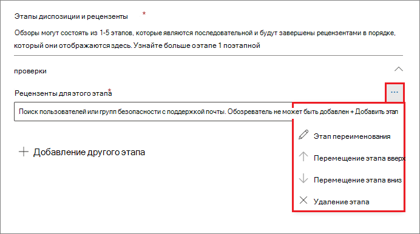
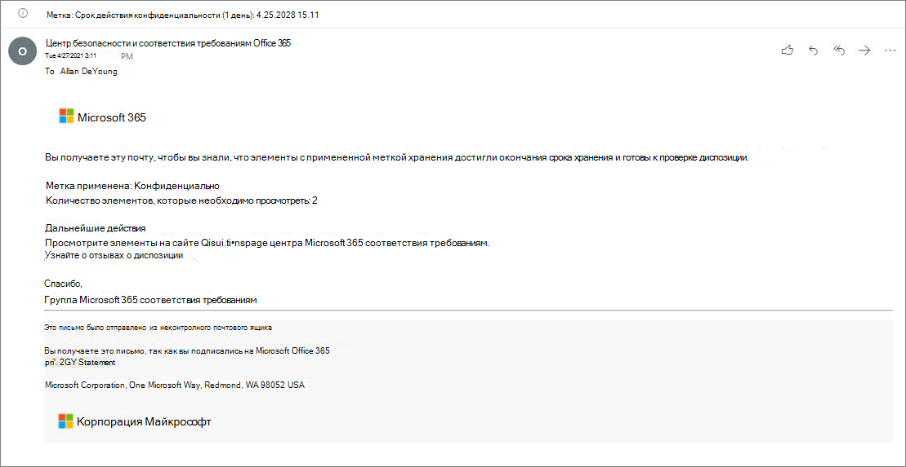
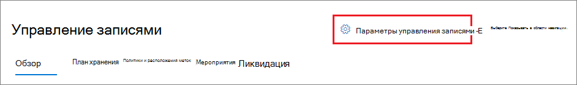
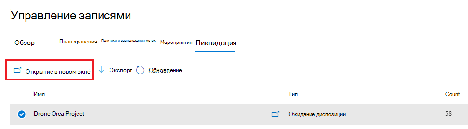

# <a name="disposition-of-content"></a><span data-ttu-id="c9c76-103">Ликвидация содержимого</span><span class="sxs-lookup"><span data-stu-id="c9c76-103">Disposition of content</span></span>

><span data-ttu-id="c9c76-104">*[Руководство по лицензированию Microsoft 365 для обеспечения безопасности и соответствия требованиям](/office365/servicedescriptions/microsoft-365-service-descriptions/microsoft-365-tenantlevel-services-licensing-guidance/microsoft-365-security-compliance-licensing-guidance).*</span><span class="sxs-lookup"><span data-stu-id="c9c76-104">*[Microsoft 365 licensing guidance for security & compliance](/office365/servicedescriptions/microsoft-365-service-descriptions/microsoft-365-tenantlevel-services-licensing-guidance/microsoft-365-security-compliance-licensing-guidance).*</span></span>

<span data-ttu-id="c9c76-105">Используйте страницу **Ликвидация** из раздела **Управление записями** в Центре соответствие требованиям Microsoft 365 для управления проверками размещения и просмотра метаданных [записей](records-management.md#records), которые были автоматически удалены по истечении периода хранения.</span><span class="sxs-lookup"><span data-stu-id="c9c76-105">Use the **Disposition** page from **Records Management** in the Microsoft 365 compliance center to manage disposition reviews and view the metadata of [records](records-management.md#records) that have been automatically deleted at the end of their retention period.</span></span>

> [!NOTE]
> <span data-ttu-id="c9c76-106">Развертывание в предварительной версии: **многоступенчатая проверка перед ликвидацией**</span><span class="sxs-lookup"><span data-stu-id="c9c76-106">Rolling out in preview: **multi-stage disposition review**</span></span>
> 
> <span data-ttu-id="c9c76-107">Теперь администратор может добавить в метку хранения до пяти последовательных этапов проверки перед ликвидацией, а рецензенты могут добавлять других пользователей на стадию проверки перед ликвидацией.</span><span class="sxs-lookup"><span data-stu-id="c9c76-107">An administrator can now add up to five consecutive stages of disposition review in a retention label, and reviewers can add others users to their disposition review stage.</span></span> <span data-ttu-id="c9c76-108">Вы также можете настроить уведомления и напоминания по электронной почте.</span><span class="sxs-lookup"><span data-stu-id="c9c76-108">You can also customize the email notifications and reminders.</span></span> <span data-ttu-id="c9c76-109">В следующих разделах есть дополнительные сведения об изменениях в этой предварительной версии.</span><span class="sxs-lookup"><span data-stu-id="c9c76-109">The following sections have more information about the changes in this preview.</span></span>

## <a name="prerequisites-for-viewing-content-dispositions"></a><span data-ttu-id="c9c76-110">Предварительные требования для просмотра ликвидации содержимого</span><span class="sxs-lookup"><span data-stu-id="c9c76-110">Prerequisites for viewing content dispositions</span></span>

<span data-ttu-id="c9c76-111">Для управления проверками перед ликвидацией и подтверждения того, что записи были удалены, необходимы соответствующие разрешения, и аудит должен быть включен.</span><span class="sxs-lookup"><span data-stu-id="c9c76-111">To manage disposition reviews and confirm that records have been deleted, you must have sufficient permissions and auditing must be enabled.</span></span>

### <a name="permissions-for-disposition"></a><span data-ttu-id="c9c76-112">Разрешения на ликвидацию</span><span class="sxs-lookup"><span data-stu-id="c9c76-112">Permissions for disposition</span></span>

<span data-ttu-id="c9c76-113">Чтобы получить доступ к вкладке **Ликвидация** в Центре соответствия требованиям Microsoft 365, пользователи должны иметь роль **Управление ликвидацией**.</span><span class="sxs-lookup"><span data-stu-id="c9c76-113">To successfully access the **Disposition** tab in the Microsoft 365 compliance center, users must have the **Disposition Management** role.</span></span> <span data-ttu-id="c9c76-114">С декабря 2020 года эта роль теперь включена в группу ролей по умолчанию **Управление записями**.</span><span class="sxs-lookup"><span data-stu-id="c9c76-114">From December 2020, this role is now included in the **Records Management** default role group.</span></span>

> [!NOTE]
> <span data-ttu-id="c9c76-115">По умолчанию даже глобальному администратору не предоставляется роль **Управление ликвидацией**.</span><span class="sxs-lookup"><span data-stu-id="c9c76-115">By default, a global admin isn't granted the **Disposition Management** role.</span></span> 

<span data-ttu-id="c9c76-116">Чтобы предоставить пользователям только те разрешения, которые им необходимы для проверок перед ликвидацией, без предоставления им разрешений на просмотр и настройку других возможностей для хранения и управления записями, создайте настраиваемую группу ролей (например, с именем "Рецензенты ликвидации") и предоставьте этой группе роль **Управление ликвидацией**.</span><span class="sxs-lookup"><span data-stu-id="c9c76-116">To grant users just the permissions they need for disposition reviews without granting them permissions to view and configure other features for retention and records management, create a custom role group (for example, named "Disposition Reviewers") and grant this group the **Disposition Management** role.</span></span>

<span data-ttu-id="c9c76-117">Инструкции по настройке этих разрешений см. в статье [Предоставление пользователям доступа к Центру безопасности и соответствия требованиям Office 365](../security/office-365-security/grant-access-to-the-security-and-compliance-center.md).</span><span class="sxs-lookup"><span data-stu-id="c9c76-117">For instructions to configure these permissions, see [Give users access to the Office 365 Security & Compliance Center](../security/office-365-security/grant-access-to-the-security-and-compliance-center.md).</span></span>

<span data-ttu-id="c9c76-118">Кроме того:</span><span class="sxs-lookup"><span data-stu-id="c9c76-118">Additionally:</span></span>

- <span data-ttu-id="c9c76-119">Чтобы просматривать содержимое элементов в процессе ликвидации, добавьте пользователей в группу ролей: **Просмотр содержимого в обозревателе содержимого**.</span><span class="sxs-lookup"><span data-stu-id="c9c76-119">To view the contents of items during the disposition process, add users to the **Content Explorer Content Viewer** role group.</span></span> <span data-ttu-id="c9c76-120">Даже если пользователи не имеют разрешений для этой группы ролей, они могут выбрать действие проверки перед ликвидацией для выполнения такой проверки, однако им придется это делать без возможности просматривать содержимое элемента в области мини-просмотра в Центре соответствия требованиям.</span><span class="sxs-lookup"><span data-stu-id="c9c76-120">If users don't have the permissions from this role group, they can still select a disposition review action to complete the disposition review, but must do so without being able to view the item's contents from the mini-preview pane in the compliance center.</span></span>

- <span data-ttu-id="c9c76-121">В предварительной версии: по умолчанию каждый пользователь, который имеет доступ к странице **Ликвидация**, видит только те элементы, которые ему назначены для проверки.</span><span class="sxs-lookup"><span data-stu-id="c9c76-121">In preview: By default, each person that accesses the **Disposition** page sees only items that they are assigned to review.</span></span> <span data-ttu-id="c9c76-122">Чтобы администратор управления записями просмотрел все элементы, назначенные всем пользователям, и все метки хранения, настроенные для проверки перед ликвидацией: перейдите в **Параметры управления записями** > **Общие** > **Группа безопасности для диспетчера записей**, чтобы выбрать и включить группу безопасности с включенной поддержкой почты, содержащую учетные записи администратора.</span><span class="sxs-lookup"><span data-stu-id="c9c76-122">For a records management administrator to see all items assigned to all users, and all retention labels that are configured for disposition review: Navigate to **Records management settings** > **General** > **Security group for records manager** to select and then enable a mail-enabled security group that contains the administrator accounts.</span></span>
    
    <span data-ttu-id="c9c76-123">Группы Microsoft 365 и группы безопасности, для которых не включена поддержка почты, не поддерживают эту функцию и не будут отображаться в списке для выбора.</span><span class="sxs-lookup"><span data-stu-id="c9c76-123">Microsoft 365 groups and security groups that aren't mail-enabled doesn't support this feature and wouldn't be displayed in the list to select.</span></span> <span data-ttu-id="c9c76-124">Если вам нужно создать группу безопасности с включенной поддержкой почты, воспользуйтесь ссылкой на Центр администрирования Microsoft 365, чтобы создать новую группу.</span><span class="sxs-lookup"><span data-stu-id="c9c76-124">If you need to create a new mail-enabled security group, use the link to the Microsoft 365 admin center to create the new group.</span></span> 
    
    > [!IMPORTANT]
    > <span data-ttu-id="c9c76-125">После включения группы ее изменить в Центре соответствия требованиям нельзя.</span><span class="sxs-lookup"><span data-stu-id="c9c76-125">After you have enabled the group, you can't change it in the compliance center.</span></span> <span data-ttu-id="c9c76-126">В следующем разделе вы можете узнать, как включить другую группу с помощью PowerShell.</span><span class="sxs-lookup"><span data-stu-id="c9c76-126">See the next section for how to enable a different group by using PowerShell.</span></span>

- <span data-ttu-id="c9c76-127">В предварительной версии: **Параметры управления записями** видны только администраторам управления записями.</span><span class="sxs-lookup"><span data-stu-id="c9c76-127">In preview: The **Records management settings** option is visible only to record management administrators.</span></span> 

#### <a name="enabling-another-security-group-for-disposition"></a><span data-ttu-id="c9c76-128">Включение другой группы безопасности для ликвидации</span><span class="sxs-lookup"><span data-stu-id="c9c76-128">Enabling another security group for disposition</span></span>

<span data-ttu-id="c9c76-129">После включения группы безопасности для ликвидации из раздела **Параметры параметров управления записями** в Центре соответствия требованиям Microsoft 365 вы не сможете отключить это разрешение для группы или заменить выбранную группу в Центре соответствия требованиям.</span><span class="sxs-lookup"><span data-stu-id="c9c76-129">After you have enabled a security group for disposition from the **Records management settings** in the Microsoft 365 compliance center, you can't disable this permission for the group or replace the selected group in the compliance center.</span></span> <span data-ttu-id="c9c76-130">Однако можно включить другую группу безопасности с включенной поддержкой почты с помощью командлета [Enable-ComplianceTagStorage](/powershell/module/exchange/enable-compliancetagstorage).</span><span class="sxs-lookup"><span data-stu-id="c9c76-130">However, you can enable another mail-enabled security group by using the [Enable-ComplianceTagStorage](/powershell/module/exchange/enable-compliancetagstorage) cmdlet.</span></span>

<span data-ttu-id="c9c76-131">Например:</span><span class="sxs-lookup"><span data-stu-id="c9c76-131">For example:</span></span> 

```PowerShell
Enable-ComplianceTagStorage -RecordsManagementSecurityGroupEmail dispositionreviewers@contosoi.com
````

### <a name="enable-auditing"></a><span data-ttu-id="c9c76-132">Включить аудит</span><span class="sxs-lookup"><span data-stu-id="c9c76-132">Enable auditing</span></span>

<span data-ttu-id="c9c76-133">Убедитесь, что аудит включен как минимум за день до первого действия по ликвидации.</span><span class="sxs-lookup"><span data-stu-id="c9c76-133">Make sure that auditing is enabled at least one day before the first disposition action.</span></span> <span data-ttu-id="c9c76-134">Дополнительные сведения см. в статье [Поиск по журналу аудита в Центре безопасности и соответствия требованиям Office 365&amp;](search-the-audit-log-in-security-and-compliance.md).</span><span class="sxs-lookup"><span data-stu-id="c9c76-134">For more information, see [Search the audit log in the Office 365 Security &amp; Compliance Center](search-the-audit-log-in-security-and-compliance.md).</span></span> 

## <a name="disposition-reviews"></a><span data-ttu-id="c9c76-135">Проверки перед ликвидацией</span><span class="sxs-lookup"><span data-stu-id="c9c76-135">Disposition reviews</span></span>

<span data-ttu-id="c9c76-p109">По окончании периода хранения содержимого в силу ряда причин вам может потребоваться проверить его и подтвердить, можно ли его необратимо удалить ("ликвидировать"). Например, вместо удаления содержимого может потребоваться:</span><span class="sxs-lookup"><span data-stu-id="c9c76-p109">When content reaches the end of its retention period, there are several reasons why you might want to review that content and confirm whether it can be permanently deleted ("disposed"). For example, instead of deleting the content, you might need to:</span></span>
  
- <span data-ttu-id="c9c76-138">отложить удаление важного содержимого для судебного разбирательства или аудита;</span><span class="sxs-lookup"><span data-stu-id="c9c76-138">Suspend the deletion of relevant content for litigation or an audit.</span></span>

- <span data-ttu-id="c9c76-139">назначить другой период хранения содержимого, возможно потому, что исходные параметры хранения носили временный или предварительный характер;</span><span class="sxs-lookup"><span data-stu-id="c9c76-139">Assign a different retention period to the content, perhaps because the original retention settings were a temporary or provisional solution.</span></span>

- <span data-ttu-id="c9c76-140">переместить содержимое из существующего расположения в архив, например, если это содержимое имеет научную или архивную ценность.</span><span class="sxs-lookup"><span data-stu-id="c9c76-140">Move the content from its existing location to an archive location, for example, if that content has research or historical value.</span></span>

<span data-ttu-id="c9c76-141">Когда проверка перед ликвидацией начинается по истечении периода хранения:</span><span class="sxs-lookup"><span data-stu-id="c9c76-141">When a disposition review is triggered at the end of the retention period:</span></span>
  
- <span data-ttu-id="c9c76-142">Выбранные вами рецензенты получают по электронной почте уведомление о том, что есть содержимое для проверки.</span><span class="sxs-lookup"><span data-stu-id="c9c76-142">The reviewers you choose receive an email notification that they have content to review.</span></span> <span data-ttu-id="c9c76-143">Эти рецензенты могут быть отдельными пользователями или группами безопасности с поддержкой почты.</span><span class="sxs-lookup"><span data-stu-id="c9c76-143">These reviewers can be individual users or mail-enabled security groups.</span></span> <span data-ttu-id="c9c76-144">Новые возможности в предварительной версии:</span><span class="sxs-lookup"><span data-stu-id="c9c76-144">New in preview:</span></span>
   - <span data-ttu-id="c9c76-145">Вы можете настроить получаемые сообщения электронной почты, в том числе инструкции на разных языках.</span><span class="sxs-lookup"><span data-stu-id="c9c76-145">You can customize the email that they receive, including instructions in different languages.</span></span> <span data-ttu-id="c9c76-146">Для поддержки нескольких языков необходимо самостоятельно указать переводы, и этот пользовательский текст будет отображаться для всех рецензентов независимо от их языкового стандарта.</span><span class="sxs-lookup"><span data-stu-id="c9c76-146">For multi-language support, you must specify the translations yourself and this custom text is displayed to all reviewers irrespective of their locale.</span></span>
   - <span data-ttu-id="c9c76-147">Пользователи получают первоначальное уведомление по электронной почте для каждой метки по окончании периода хранения элемента с напоминанием для каждой метки раз в неделю обо всех назначенных им проверках перед ликвидацией.</span><span class="sxs-lookup"><span data-stu-id="c9c76-147">Users receive an initial email notification per label at the end of the item's retention period, with a reminder per label once a week of all disposition reviews that they are assigned.</span></span> <span data-ttu-id="c9c76-148">Они могут щелкнуть ссылку в электронном письме с уведомлением и напоминанием, чтобы перейти на страницу **Ликвидация** в Центре соответствия требованиям Microsoft 365, чтобы просмотреть содержимое и принять меры.</span><span class="sxs-lookup"><span data-stu-id="c9c76-148">They can click the link in the notification and reminder emails to go to the **Disposition** page in the Microsoft 365 compliance center to review the content and take an action.</span></span> <span data-ttu-id="c9c76-149">Кроме того, рецензенты могут перейти непосредственно на страницу **Ликвидация** в Центре соответствия требованиям.</span><span class="sxs-lookup"><span data-stu-id="c9c76-149">Alternately, the reviewers can go directly to the **Disposition** page in the compliance center.</span></span>
   - <span data-ttu-id="c9c76-150">Рецензенты видят только те проверки перед ликвидацией, которые им назначены, а администраторы, добавленные в выбранную группу безопасности для диспетчера записей, видят все проверки перед ликвидацией.</span><span class="sxs-lookup"><span data-stu-id="c9c76-150">Reviewers see only the disposition reviews that are assigned to them, whereas administrators who are added to the selected security group for records manager see all disposition reviews.</span></span>
   - <span data-ttu-id="c9c76-151">Рецензенты могут добавлять новых пользователей в ту же проверку перед ликвидацией.</span><span class="sxs-lookup"><span data-stu-id="c9c76-151">Reviewers can add new users to the same disposition review.</span></span> <span data-ttu-id="c9c76-152">В настоящее время это действие не предоставляет этим добавленным пользователям [необходимые разрешения](#permissions-for-disposition).</span><span class="sxs-lookup"><span data-stu-id="c9c76-152">Currently, this action doesn't automatically grant these added users the [required permissions](#permissions-for-disposition).</span></span>
   - <span data-ttu-id="c9c76-153">В процессе проверки перед ликвидацией в области мини-просмотра для каждого элемента показан предварительный просмотр содержимого, если у него есть разрешения на его просмотр.</span><span class="sxs-lookup"><span data-stu-id="c9c76-153">For the disposition review process, a mini-review pane for each item shows a preview of the content if they have permissions to see it.</span></span> <span data-ttu-id="c9c76-154">Если у них нет разрешений, они могут выбрать ссылку на контент и запросить разрешения.</span><span class="sxs-lookup"><span data-stu-id="c9c76-154">If they don't have permissions, they can select the content link and request permissions.</span></span> <span data-ttu-id="c9c76-155">В этой области мини-просмотра также есть вкладки для получения дополнительных сведений о содержимом:</span><span class="sxs-lookup"><span data-stu-id="c9c76-155">This mini-review pane also has tabs for additional information about the content:</span></span>
       - <span data-ttu-id="c9c76-156">**Сведения** отображает индексные свойства, где они расположения, кто и когда их создал, а также кто и когда последний раз их редактировал.</span><span class="sxs-lookup"><span data-stu-id="c9c76-156">**Details** to display indexed properties, where it's located, who created it and when, and who last modified it and when.</span></span>
       - <span data-ttu-id="c9c76-157">**Журнал**, который показывает историю всех действий проверки перед ликвидацией на сегодняшний день с комментариями рецензента, если они доступны.</span><span class="sxs-lookup"><span data-stu-id="c9c76-157">**History** that shows the history of any disposition review actions to date, with reviewer comments if available.</span></span>

<span data-ttu-id="c9c76-158">Проверка перед ликвидацией может включать содержимое почтовых ящиков Exchange, сайтов SharePoint и учетных записей OneDrive.</span><span class="sxs-lookup"><span data-stu-id="c9c76-158">A disposition review can include content in Exchange mailboxes, SharePoint sites, and OneDrive accounts.</span></span> <span data-ttu-id="c9c76-159">Содержимое, ожидающее проверки перед ликвидацией на этих ресурсах, удаляется безвозвратно только после того, как рецензент на последнем этапе ликвидации выберет окончательное удаление содержимого.</span><span class="sxs-lookup"><span data-stu-id="c9c76-159">Content pending a disposition review in those locations is permanently deleted only after a reviewer for the final stage of disposition chooses to permanently delete the content.</span></span>

> [!NOTE]
> <span data-ttu-id="c9c76-160">В почтовом ящике должно быть не менее 10 МБ данных для обеспечения поддержки проверок перед ликвидации.</span><span class="sxs-lookup"><span data-stu-id="c9c76-160">A mailbox must have at least 10 MB data to support disposition reviews.</span></span>

<span data-ttu-id="c9c76-161">Администраторы могут увидеть общие сведения о всех ожидающих ликвидациях на вкладке **Обзор**. Рецензенты видят только свои элементы, ожидающих ликвидации.</span><span class="sxs-lookup"><span data-stu-id="c9c76-161">Administrators can see an overview of all pending dispositions in the **Overview** tab. Reviewers see only their items pending disposition.</span></span> <span data-ttu-id="c9c76-162">Например:</span><span class="sxs-lookup"><span data-stu-id="c9c76-162">For example:</span></span>


<span data-ttu-id="c9c76-164">При выборе **Просмотр всех незавершенных ликвидаций**, вы перейдете на страницу **Ликвидация**.</span><span class="sxs-lookup"><span data-stu-id="c9c76-164">When you select the **View all pending dispositions**, you're taken to the **Disposition** page.</span></span> <span data-ttu-id="c9c76-165">Пример.</span><span class="sxs-lookup"><span data-stu-id="c9c76-165">For example:</span></span>


### <a name="workflow-for-a-disposition-review"></a><span data-ttu-id="c9c76-167">Рабочий процесс проверки перед ликвидацией</span><span class="sxs-lookup"><span data-stu-id="c9c76-167">Workflow for a disposition review</span></span>

<span data-ttu-id="c9c76-168">На следующей схеме показан основной рабочий процесс проверки перед ликвидацией, когда метка хранения публикуется, а затем вручную применяется пользователем.</span><span class="sxs-lookup"><span data-stu-id="c9c76-168">The following diagram shows the basic workflow for a disposition review when a retention label is published and then manually applied by a user.</span></span> <span data-ttu-id="c9c76-169">В качестве альтернативы метка хранения, настроенная для проверки перед ликвидацией, может быть автоматически применена к содержимому.</span><span class="sxs-lookup"><span data-stu-id="c9c76-169">Alternatively, a retention label configured for a disposition review can be automatically applied to content.</span></span>
  


### <a name="how-to-configure-a-retention-label-for-disposition-review"></a><span data-ttu-id="c9c76-171">Настройка метки хранения для проверки перед ликвидацией</span><span class="sxs-lookup"><span data-stu-id="c9c76-171">How to configure a retention label for disposition review</span></span>

<span data-ttu-id="c9c76-172">Запуск проверки перед ликвидацией в конце периода хранения — это вариант конфигурации, доступный только с меткой хранения.</span><span class="sxs-lookup"><span data-stu-id="c9c76-172">Triggering a disposition review at the end of the retention period is a configuration option that's available only with a retention label.</span></span> <span data-ttu-id="c9c76-173">Проверка перед ликвидацией недоступна для политики хранения.</span><span class="sxs-lookup"><span data-stu-id="c9c76-173">Disposition review is not available for a retention policy.</span></span> <span data-ttu-id="c9c76-174">Дополнительные сведения об этих двух решениях см. в разделе [Сведения о политиках и метках хранения](retention.md).</span><span class="sxs-lookup"><span data-stu-id="c9c76-174">For more information about these two retention solutions, see [Learn about retention policies and retention labels](retention.md).</span></span>

<span data-ttu-id="c9c76-175">На странице **Определение параметров хранения** для метки хранения:</span><span class="sxs-lookup"><span data-stu-id="c9c76-175">From the **Define retention settings** page for a retention label:</span></span>


 
<span data-ttu-id="c9c76-177">После выбора этого параметра **Запуск проверки перед ликвидацией** на следующей странице мастера укажите количество последовательных этапов ликвидации и рецензентов ликвидации для каждого этапа:</span><span class="sxs-lookup"><span data-stu-id="c9c76-177">After you select this **Trigger a disposition review** option, on the next page of the wizard, you specify how many consecutive stages of disposition you want and the disposition reviewers for each stage:</span></span>

 

<span data-ttu-id="c9c76-179">Выберите **Добавить этап** и назовите его в целях идентификации.</span><span class="sxs-lookup"><span data-stu-id="c9c76-179">Select **Add a stage**, and name your stage for identification purposes.</span></span> <span data-ttu-id="c9c76-180">Затем укажите рецензентов для этого этапа.</span><span class="sxs-lookup"><span data-stu-id="c9c76-180">Then specify the reviewers for that stage.</span></span>

<span data-ttu-id="c9c76-181">Для рецензентов укажите пользователя или группу безопасности с поддержкой почты.</span><span class="sxs-lookup"><span data-stu-id="c9c76-181">For the reviewers, specify a user or a mail-enabled security group.</span></span> <span data-ttu-id="c9c76-182">Группы Microsoft 365 ([ранее — группы Office 365](https://techcommunity.microsoft.com/t5/microsoft-365-blog/office-365-groups-will-become-microsoft-365-groups/ba-p/1303601)) в настоящее время не поддерживаются для этого параметра.</span><span class="sxs-lookup"><span data-stu-id="c9c76-182">Microsoft 365 groups ([formerly Office 365 groups](https://techcommunity.microsoft.com/t5/microsoft-365-blog/office-365-groups-will-become-microsoft-365-groups/ba-p/1303601)) are currently not supported for this option.</span></span>

<span data-ttu-id="c9c76-183">Если вам нужно, чтобы несколько человек просматривали элемент в конце периода хранения, снова выберите **Добавить этап** и повторите процесс настройки для необходимого количества этапов (не более пяти этапов).</span><span class="sxs-lookup"><span data-stu-id="c9c76-183">If you need more than one person to review an item at the end of its retention period, select **Add a stage** again and repeat the configuration process for the number of stages that you need, with a maximum of five stages.</span></span> 

<span data-ttu-id="c9c76-p122">На каждом отдельном этапе ликвидации любой из пользователей, указанных для этого этапа, имеет право выполнить следующее действие для элемента в конце периода его хранения. Эти пользователи также могут добавлять других пользователей на этап проверки перед ликвидацией.</span><span class="sxs-lookup"><span data-stu-id="c9c76-p122">Within each individual stage of disposition, any of the users you specify for that stage are authorized to take the next action for the item at the end of its retention period. These users can also add other users to their disposition review stage.</span></span>

> [!NOTE]
> <span data-ttu-id="c9c76-186">Существующие метки хранения, настроенные для проверки перед ликвидацией, могут быть обновлены для использования многоступенчатой проверки перед ликвидацией путем настройки метки.</span><span class="sxs-lookup"><span data-stu-id="c9c76-186">Existing retention labels that are configured for disposition review can be upgraded to use multi-staged disposition review by configuring the label.</span></span> <span data-ttu-id="c9c76-187">В мастере меток выберите **Добавить этап** или измените существующих рецензентов или добавьте новых рецензентов.</span><span class="sxs-lookup"><span data-stu-id="c9c76-187">In the label wizard, select **Add a stage**, or edit the existing reviewers or add new reviewers.</span></span>

<span data-ttu-id="c9c76-188">На этапе настройки для каждого указанного этапа его можно переименовать, изменить порядок или удалить, выбрав параметр "Действия этапа" (**...**):</span><span class="sxs-lookup"><span data-stu-id="c9c76-188">During the configuration phase, for each stage specified, you can rename it, reorder it, or remove it by selecting the Stage actions option (**...**):</span></span> 



<span data-ttu-id="c9c76-190">Однако вы не можете переустановить или удалить этап после создания метки хранения.</span><span class="sxs-lookup"><span data-stu-id="c9c76-190">However, you can't reorder or remove a stage after you have created the retention label.</span></span>

<span data-ttu-id="c9c76-191">После указания рецензентов, не забудьте предоставить им разрешение роли **Управление ликвидацией**.</span><span class="sxs-lookup"><span data-stu-id="c9c76-191">After you have specified your reviewers, remember to grant them the **Disposition Management** role permission.</span></span> <span data-ttu-id="c9c76-192">Дополнительные сведения см. в разделе [Разрешения для ликвидации](#permissions-for-disposition) на этой странице.</span><span class="sxs-lookup"><span data-stu-id="c9c76-192">For more information, see the [Permissions for disposition](#permissions-for-disposition) section on this page.</span></span>

### <a name="how-to-customize-email-messages-for-disposition-review"></a><span data-ttu-id="c9c76-193">Настройка сообщений электронной почты для проверки перед ликвидацией</span><span class="sxs-lookup"><span data-stu-id="c9c76-193">How to customize email messages for disposition review</span></span>

<span data-ttu-id="c9c76-194">Пример уведомления по умолчанию по электронной почте, отправляемого рецензенту:</span><span class="sxs-lookup"><span data-stu-id="c9c76-194">Example default email notification sent to a reviewer:</span></span>



<span data-ttu-id="c9c76-196">Также в предварительном просмотре можно настроить сообщения электронной почты, которые отправляются рецензентам ликвидации для первоначального уведомления, а затем для напоминаний.</span><span class="sxs-lookup"><span data-stu-id="c9c76-196">Also in preview, you can customize the email messages that are sent to disposition reviewers for the initial notification and then reminders.</span></span>

<span data-ttu-id="c9c76-197">На любой из страниц ликвидации в Центре соответствия требованиям выберите **Параметры управления записями**:</span><span class="sxs-lookup"><span data-stu-id="c9c76-197">From any of the Disposition pages in the compliance center, select **Records management settings**:</span></span>  



<span data-ttu-id="c9c76-199">Затем выберите вкладку **Уведомления о ликвидации** и укажите, следует ли использовать только сообщения электронной почты по умолчанию или добавить собственный текст в сообщение по умолчанию.</span><span class="sxs-lookup"><span data-stu-id="c9c76-199">Then select the **Disposition notifications** tab, and specify whether you want to use just the default email message, or add your own text to the default message.</span></span> <span data-ttu-id="c9c76-200">Настраиваемый текст добавляется в инструкции по электронной почте после получения сведений о метке хранения и перед следующими инструкциями.</span><span class="sxs-lookup"><span data-stu-id="c9c76-200">Your custom text is added to the email instructions after the information about the retention label and before the next steps instructions.</span></span>

<span data-ttu-id="c9c76-201">Текст для всех языков можно добавить, но форматирование и изображения в настоящее время не поддерживаются.</span><span class="sxs-lookup"><span data-stu-id="c9c76-201">Text for all languages can be added, but formatting and images are currently unsupported.</span></span> <span data-ttu-id="c9c76-202">URL-адреса и адреса электронной почты могут быть введены в виде текста и, в зависимости от клиента электронной почты, отображаться в виде гиперссылок или неформатированного текста в настраиваемом сообщении электронной почты.</span><span class="sxs-lookup"><span data-stu-id="c9c76-202">URLs and email addresses can be entered as text and depending on the email client, display as hyperlinks or unformatted text in the customized email.</span></span>

<span data-ttu-id="c9c76-203">Пример текста для добавления:</span><span class="sxs-lookup"><span data-stu-id="c9c76-203">Example text to add:</span></span>

```console
If you need additional information, visit the helpdesk website (https://support.contoso.com) or send them an email (helpdesk@contoso.com).
```

<span data-ttu-id="c9c76-204">Выберите **Сохранить**, чтобы сохранить изменения.</span><span class="sxs-lookup"><span data-stu-id="c9c76-204">Select **Save** to save any changes.</span></span>

### <a name="viewing-and-disposing-of-content"></a><span data-ttu-id="c9c76-205">Просмотр и ликвидация содержимого</span><span class="sxs-lookup"><span data-stu-id="c9c76-205">Viewing and disposing of content</span></span>

<span data-ttu-id="c9c76-206">Когда рецензент получает по электронной почте уведомление о том, что содержимое готово к проверке, он может щелкнуть ссылку в сообщении электронной почты, в результате чего он перейдет на вкладку **Ликвидация** из раздела **Управление записями** в Центре безопасности и соответствия требованиям Microsoft 365.</span><span class="sxs-lookup"><span data-stu-id="c9c76-206">When a reviewer is notified by email that content is ready to review, they can click a link in the email that takes them directly to the **Disposition** page from **Records management** in the Microsoft 365 compliance center.</span></span> <span data-ttu-id="c9c76-207">Рецензенты могут увидеть, сколько элементов для каждой метки хранения ожидают ликвидации, в разделе **Тип**, отображающего **Ожидает ликвидации**.</span><span class="sxs-lookup"><span data-stu-id="c9c76-207">There, the reviewers can see how many items for each retention label are waiting disposition with the **Type** displaying **Pending disposition**.</span></span> <span data-ttu-id="c9c76-208">Затем они выбирают метку хранения и пункт **Открыть в новом окне**, чтобы увидеть все содержимое с этой меткой:</span><span class="sxs-lookup"><span data-stu-id="c9c76-208">They then select a retention label, and **Open in new window** to see all content with that label:</span></span>



<span data-ttu-id="c9c76-210">На странице **Ожидает ликвидации** они видят все ожидающие ликвидации файлы для этой метки.</span><span class="sxs-lookup"><span data-stu-id="c9c76-210">From the **Pending dispositions** page, they see all pending dispositions for that label.</span></span> <span data-ttu-id="c9c76-211">Если выбран один или несколько элементов, они могут использовать область мини-просмотра и вкладку **Источник**, **Сведения** и **Журнал** для проверки содержимого, прежде чем предпринимать какие-либо действия с ним:</span><span class="sxs-lookup"><span data-stu-id="c9c76-211">When one or more items are selected, they can use the mini-preview pane and the **Source**, **Details**, and **History** tab to inspect the content before taking action on it:</span></span>


<span data-ttu-id="c9c76-213">Если вы воспользуетесь горизонтальной полосой прокрутки или закроете область мини-просмотра, вы увидите больше столбцов, которые включают дату истечения срока действия и название стадии проверки перед ликвидации.</span><span class="sxs-lookup"><span data-stu-id="c9c76-213">If you use the horizontal scroll bar, or close the min-review pane, you see more columns that include the expiry date and the name of the disposition review stage.</span></span>

<span data-ttu-id="c9c76-214">Как видно в этом примере, поддерживаются следующие действия:</span><span class="sxs-lookup"><span data-stu-id="c9c76-214">As you can see from the example shown, the actions supported are:</span></span> 
  
- <span data-ttu-id="c9c76-215">**Утверждение ликвидации**:</span><span class="sxs-lookup"><span data-stu-id="c9c76-215">**Approve disposal**:</span></span>
    - <span data-ttu-id="c9c76-216">Если это действие выбрано для промежуточного этапа проверки перед ликвидацией (вы настроили несколько этапов): элемент переходит на следующий этап ликвидации.</span><span class="sxs-lookup"><span data-stu-id="c9c76-216">When this action is selected for an interim stage of disposition review (you have configured multiple stages): The item moves to the next disposition stage.</span></span>
    - <span data-ttu-id="c9c76-217">Если это действие выбрано на окончательном этапе проверки перед ликвидацией или существует только один этап ликвидации: элемент помечается как подходящий для окончательного удаления.</span><span class="sxs-lookup"><span data-stu-id="c9c76-217">When this action is selected for the final stage of disposition review, or there is only one stage of disposition: The item is marked as eligible for permanent deletion.</span></span> <span data-ttu-id="c9c76-218">Точное время удаления зависит от рабочей нагрузки.</span><span class="sxs-lookup"><span data-stu-id="c9c76-218">The exact timing for that deletion depends on the workload.</span></span> <span data-ttu-id="c9c76-219">Дополнительные сведения см. в разделе [Как параметры хранения применяются к имеющемуся контенту](retention.md#how-retention-settings-work-with-content-in-place).</span><span class="sxs-lookup"><span data-stu-id="c9c76-219">For more information, see [How retention settings work with content in place](retention.md#how-retention-settings-work-with-content-in-place).</span></span>
- <span data-ttu-id="c9c76-220">**Переназначение метки**:</span><span class="sxs-lookup"><span data-stu-id="c9c76-220">**Relabel**:</span></span>
    - <span data-ttu-id="c9c76-221">Если выбрано это действие, элемент выходит из процесса проверки перед ликвидацией для исходной метки.</span><span class="sxs-lookup"><span data-stu-id="c9c76-221">When this action is selected, the item exits the disposition review process for the original label.</span></span> <span data-ttu-id="c9c76-222">После этого к элементу будут применяться параметры хранения для вновь выбранной метки хранения.</span><span class="sxs-lookup"><span data-stu-id="c9c76-222">The item is then subject to the retention settings of the newly selected retention label.</span></span>
- <span data-ttu-id="c9c76-223">**Расширение**:</span><span class="sxs-lookup"><span data-stu-id="c9c76-223">**Extend**:</span></span>
    - <span data-ttu-id="c9c76-224">Если это действие выбрано, проверка перед ликвидацией фактически приостанавливается до конца расширенного периода, а затем проверка перед ликвидацией запускается снова с первого этапа.</span><span class="sxs-lookup"><span data-stu-id="c9c76-224">When this action is selected, disposition review is effectively suspended until the end of the extended period and then disposition review is triggered again from the first stage.</span></span>
- <span data-ttu-id="c9c76-225">**Добавление рецензентов**:</span><span class="sxs-lookup"><span data-stu-id="c9c76-225">**Add reviewers**:</span></span>
    - <span data-ttu-id="c9c76-226">При выборе этого действия пользователю будет предложено указать и добавить других пользователей для проверки.</span><span class="sxs-lookup"><span data-stu-id="c9c76-226">When this action is selected, the user is prompted to specify and add other users for review.</span></span>
    
    > [!NOTE]
    > <span data-ttu-id="c9c76-227">Это действие автоматически не предоставляет [необходимые разрешения](#permissions-for-disposition) добавленным пользователям.</span><span class="sxs-lookup"><span data-stu-id="c9c76-227">This action doesn't automatically grant the [required permissions](#permissions-for-disposition) to the users who are added.</span></span> <span data-ttu-id="c9c76-228">Если у них нет этих разрешений, они не смогут принять участие в проверке перед ликвидацией.</span><span class="sxs-lookup"><span data-stu-id="c9c76-228">If they don't have these permissions, they won't be able to participate in the disposition review.</span></span>

<span data-ttu-id="c9c76-229">Каждое действие сохраняется и хранится, хотя их пока нельзя найти в журнале аудита.</span><span class="sxs-lookup"><span data-stu-id="c9c76-229">Each action taken is saved and stored although you can't yet search for them in the audit log.</span></span>

<span data-ttu-id="c9c76-230">Во время проверки перед ликвидацией содержимое никогда не перемещается из исходного расположения и не помечается для окончательного удаления, пока это действие не будет выбрано рецензентом для последнего и единственного этапа ликвидации.</span><span class="sxs-lookup"><span data-stu-id="c9c76-230">During a disposition review, the content never moves from its original location, and it's not marked for permanent deletion until this action is selected by a reviewer for the final or only disposition stage.</span></span>

## <a name="disposition-of-records"></a><span data-ttu-id="c9c76-231">Ликвидация записей</span><span class="sxs-lookup"><span data-stu-id="c9c76-231">Disposition of records</span></span>

<span data-ttu-id="c9c76-232">Используйте вкладку **Ликвидация** на странице **Управление записями**, чтобы определить:</span><span class="sxs-lookup"><span data-stu-id="c9c76-232">Use the **Disposition** tab from the **Records management** page to identify:</span></span>

- <span data-ttu-id="c9c76-233">Элементы, удаленные в результате проверки перед ликвидацией.</span><span class="sxs-lookup"><span data-stu-id="c9c76-233">Items deleted as a result of a disposition review.</span></span>
- <span data-ttu-id="c9c76-234">Элементы, помеченные как записи или нормативные записи, которые были автоматически удалены по окончании их срока хранения.</span><span class="sxs-lookup"><span data-stu-id="c9c76-234">Items marked as a record or regulatory record that were automatically deleted at the end of their retention period.</span></span>

<span data-ttu-id="c9c76-235">Эти элементы отображают **Ликвидированные записи** в столбце **Тип**.</span><span class="sxs-lookup"><span data-stu-id="c9c76-235">These items display **Records Disposed** in the **Type** column.</span></span> <span data-ttu-id="c9c76-236">Пример.</span><span class="sxs-lookup"><span data-stu-id="c9c76-236">For example:</span></span>


<span data-ttu-id="c9c76-238">Элементы, отображаемые на вкладке **Удаленные элементы**, хранятся в течение семи лет после ликвидации элемента с ограничением в один миллион элементов на запись для этого периода.</span><span class="sxs-lookup"><span data-stu-id="c9c76-238">Items that are shown in the **Disposed Items** tab are kept for up to seven years after the item was disposed, with a limit of one million items per record for that period.</span></span> <span data-ttu-id="c9c76-239">Если вы видите, что **Число**, приближающееся к этому пределу в один миллион, и вам требуется подтверждение ликвидации для ваших записей, обратитесь в [службу поддержки Майкрософт](../business-video/get-help-support.md).</span><span class="sxs-lookup"><span data-stu-id="c9c76-239">If you see the **Count** number nearing this limit of one million, and you need proof of disposition for your records, contact [Microsoft Support](../business-video/get-help-support.md).</span></span>

> [!NOTE]
> <span data-ttu-id="c9c76-240">Эта функция использует информацию из [Единого журнала аудита](search-the-audit-log-in-security-and-compliance.md) и, поэтому требует, чтобы аудит был [включен и доступен для поиска](turn-audit-log-search-on-or-off.md), чтобы соответствующие события были записаны.</span><span class="sxs-lookup"><span data-stu-id="c9c76-240">This functionality uses information from the [unified audit log](search-the-audit-log-in-security-and-compliance.md) and therefore requires auditing to be [enabled and searchable](turn-audit-log-search-on-or-off.md) so the corresponding events are captured.</span></span>

<span data-ttu-id="c9c76-241">Для аудита удаленных элементов, помеченных как записи или нормативные записи, найдите **Удаленный файл, помеченный как запись** в категории **Действия с файлами и страницами**.</span><span class="sxs-lookup"><span data-stu-id="c9c76-241">For auditing of deleted items that were marked as records or regulatory records, search for **Deleted file marked as a record** in the **File and page activities** category.</span></span> <span data-ttu-id="c9c76-242">Это событие аудита относится к документам и сообщениям электронной почты.</span><span class="sxs-lookup"><span data-stu-id="c9c76-242">This audit event is applicable to documents and emails.</span></span>

## <a name="filter-and-export-the-views"></a><span data-ttu-id="c9c76-243">Фильтрация и экспорт представлений</span><span class="sxs-lookup"><span data-stu-id="c9c76-243">Filter and export the views</span></span>

<span data-ttu-id="c9c76-244">При выборе метки хранения на странице **Ликвидация**, вкладка **Ожидание ликвидации** (если применимо) и вкладка **Ликвидированные элементы** позволяют отфильтровать представления, чтобы облегчить поиск элементов.</span><span class="sxs-lookup"><span data-stu-id="c9c76-244">When you select a retention label from the **Disposition** page, the **Pending disposition** tab (if applicable) and the **Disposed items** tab let you filter the views to help you more easily find items.</span></span>

<span data-ttu-id="c9c76-245">Для ожидающих проверки элементов за основу интервала времени берется дата окончания периода хранения.</span><span class="sxs-lookup"><span data-stu-id="c9c76-245">For pending dispositions, the time range is based on the expiration date.</span></span> <span data-ttu-id="c9c76-246">Для ликвидированных элементов временной диапазон основан на дате удаления.</span><span class="sxs-lookup"><span data-stu-id="c9c76-246">For disposed items, the time range is based on the deletion date.</span></span>
  
<span data-ttu-id="c9c76-247">Информацию об элементах в любом из представлений можно экспортировать в виде файла .csv, который затем можно сортировать и управлять с помощью Excel.</span><span class="sxs-lookup"><span data-stu-id="c9c76-247">You can export information about the items in either view as a .csv file that you can then sort and manage using Excel.</span></span>
