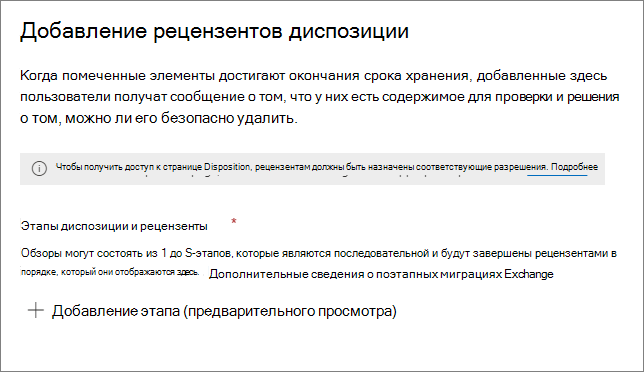

# Ликвидация содержимогоDisposition of content

>*[Руководство по лицензированию Microsoft 365 для обеспечения безопасности и соответствия требованиям](https://aka.ms/ComplianceSD).**[Microsoft 365 licensing guidance for security & compliance](https://aka.ms/ComplianceSD).*

Используйте вкладку **Ликвидация** из раздела **Управление записями** в Центре соответствие требованиям Microsoft 365, чтобы управлять проверками перед ликвидацией и просматривать [записи](records-management.md#records), которые были автоматически удалены по истечении периода хранения.Use the **Disposition** tab from **Records Management** in the Microsoft 365 compliance center to manage disposition reviews and view [records](records-management.md#records) that have been automatically deleted at the end of their retention period. 

## Предварительные требования для просмотра ликвидации содержимогоPrerequisites for viewing content dispositions

Для управления проверками перед ликвидацией и подтверждения того, что записи были удалены, необходимы соответствующие разрешения, и аудит должен быть включен.To manage disposition reviews and confirm that records have been deleted, you must have sufficient permissions and auditing must be enabled.

### Разрешения на ликвидациюPermissions for disposition

Чтобы получить доступ к вкладке **Ликвидация** в Центре соответствия требованиям Microsoft 365, пользователи должны иметь роль администратора **Управлением ликвидацией**.To successfully access the **Disposition** tab in the Microsoft 365 compliance center, users must have the **Disposition Management** admin role. С декабря 2020 года эта роль теперь включена в группу ролей администратора по умолчанию **Управление записями**.From December 2020, this role is now included in the **Records Management** default admin role group.

> [!NOTE]
> По умолчанию даже глобальному администратору не предоставляется роль **Управление ликвидацией**.By default, a global admin isn't granted the **Disposition Management** role. 

Чтобы предоставить пользователям только те разрешения, которые им необходимы для проверок перед ликвидацией, без предоставления им разрешений на просмотр и настройку других возможностей для хранения и управления записями, создайте настраиваемую группу ролей (например, с именем "Рецензенты ликвидации") и предоставьте этой группе роль управления ликвидацией.To grant users just the permissions they need for disposition reviews without granting them permissions to view and configure other features for retention and records management, create a custom role group (for example, named "Disposition Reviewers") and grant this group the Disposition Management role.

Кроме того, чтобы просматривать содержимое элементов в процессе ликвидации, добавьте пользователей в следующие две группы ролей: **обзор содержимого, просмотр содержимого** и **обзор содержимого, просмотр списков**.Additionally, to view the contents of items during the disposition process, add users to the following two role groups: **Content Explorer Content Viewer** and **Content Explorer List Viewer**. Даже если пользователи не имеют разрешений для этих групп ролей, они могут выбрать действие проверки перед ликвидацией для выполнения такой проверки, однако им придется это делать без возможности просматривать содержимое элемента в центре соответствия требованиям.If users don't have the permissions from these role groups, they can still select a disposition review action to complete the disposition review, but must do so without being able to view the item's contents from the compliance center.

Инструкции по настройке этих разрешений см. в статье [Предоставление пользователям доступа к Центру безопасности и соответствия требованиям Office 365](../security/office-365-security/grant-access-to-the-security-and-compliance-center.md).For instructions to configure these permissions, see [Give users access to the Office 365 Security & Compliance Center](../security/office-365-security/grant-access-to-the-security-and-compliance-center.md).

### Включить аудитEnable auditing

Убедитесь, что аудит включен как минимум за день до первого действия по ликвидации.Make sure that auditing is enabled at least one day before the first disposition action. Дополнительные сведения см. в статье [Поиск по журналу аудита в Центре безопасности и соответствия требованиям Office 365&amp;](search-the-audit-log-in-security-and-compliance.md).For more information, see [Search the audit log in the Office 365 Security &amp; Compliance Center](search-the-audit-log-in-security-and-compliance.md). 

## Проверки перед ликвидациейDisposition reviews

По окончании периода хранения содержимого в силу ряда причин вам может потребоваться проверить его и решить, можно ли его спокойно удалить («ликвидировать»).When content reaches the end of its retention period, there are several reasons why you might want to review that content to decide whether it can be safely deleted ("disposed"). Например, вам может потребоваться:For example, you might need to:
  
- Отложить удаление важного содержимого в случае судебного разбирательства или аудита;Suspend the deletion of relevant content in the event of litigation or an audit.
    
- Удалить содержимое из списка на ликвидацию, чтобы сохранить его в архиве, если оно представляет исследовательский или исторический интерес;Remove content from the disposition list to store in an archive, if that content has research or historical value.
    
- Назначить другой период хранения содержимого, возможно потому, что исходные параметры хранения носили временный или предварительный характер;Assign a different retention period to the content, perhaps because the original retention settings were a temporary or provisional solution.
    
- Вернуть содержимое клиентам или передать другой организации.Return the content to clients or transfer it to another organization.

Когда проверка перед ликвидацией начинается по истечении периода хранения:When a disposition review is triggered at the end of the retention period:
  
- Выбранные вами люди получают по электронной почте уведомление о том, что есть содержимое для проверки.The people you choose receive an email notification that they have content to review. Эти рецензенты могут быть отдельными пользователями или группами безопасности с поддержкой почты.These reviewers can be individual users or mail-enabled security groups. Обратите внимание, что уведомления отправляются еженедельно.Note that notifications are sent on a weekly basis.
    
- Рецензенты переходят на вкладку **Ликвидация** в Центре соответствия требованиям Microsoft 365, чтобы просмотреть содержимое и принять решение о том, следует ли удалить его навсегда, продлить период его хранения или применить другую метку хранения.The reviewers go to the **Disposition** tab in the Microsoft 365 compliance center to review the content and decide whether to permanently delete it, extend its retention period, or apply a different retention label.

Проверка перед ликвидацией может включать содержимое почтовых ящиков Exchange, сайтов SharePoint, учетных записей OneDrive и групп Microsoft 365.A disposition review can include content in Exchange mailboxes, SharePoint sites, OneDrive accounts, and Microsoft 365 groups. Содержимое, ожидающее проверки перед ликвидацией на этих ресурсах, удаляется только после того, как проверяющий выберет окончательное удаление содержимого.Content awaiting a disposition review in those locations is deleted only after a reviewer chooses to permanently delete the content.

> [!NOTE]
> В почтовом ящике должно быть не менее 10 МБ данных для обеспечения поддержки проверок перед ликвидации.A mailbox must have at least 10 MB data to support disposition reviews.

Обзор всех незавершенных ликвидаций можно просмотреть на вкладке **Обзор**. Например:You can see an overview of all pending dispositions in the **Overview** tab. For example:

При выборе **Просмотр всех незавершенных ликвидаций**, вы перейдете на страницу **Ликвидация**.When you select the **View all pending dispositions**, you're taken to the **Disposition** page. Пример.For example:

### Рабочий процесс проверки перед ликвидациейWorkflow for a disposition review

На следующей схеме показан основной рабочий процесс проверки перед ликвидацией, когда метка хранения публикуется, а затем вручную применяется пользователем.The following diagram shows the basic workflow for a disposition review when a retention label is published and then manually applied by a user. В качестве альтернативы метка хранения, настроенная для проверки перед ликвидацией, может быть автоматически применена к содержимому.Alternatively, a retention label configured for a disposition review can be auto-applied to content.
  

  
Запуск проверки перед ликвидацией в конце периода хранения — это вариант конфигурации, доступный только с меткой хранения.Triggering a disposition review at the end of the retention period is a configuration option that's available only with a retention label. Этот параметр недоступен для политики хранения. This option is not available for a retention policy. Дополнительные сведения об этих двух решениях см. в разделе [Сведения о политиках и метках хранения](retention.md).For more information about these two retention solutions, see [Learn about retention policies and retention labels](retention.md).

На странице **Определение параметров хранения** для метки хранения:From the **Define retention settings** page for a retention label:

 
После выбора параметра **Запустить проверку перед ликвидацией**, на следующей странице мастера необходимо указать рецензентов ликвидации:After you select this **Trigger a disposition review** option, you specify the disposition reviewers on the next page of the wizard:

Для рецензентов укажите пользователя или группу безопасности с поддержкой почты.For the reviewers, specify a user or mail-enabled security group. Группы Microsoft 365 ([ранее — группы Office 365](https://techcommunity.microsoft.com/t5/microsoft-365-blog/office-365-groups-will-become-microsoft-365-groups/ba-p/1303601)) не поддерживаются для этого параметра.Microsoft 365 groups ([formerly Office 365 groups](https://techcommunity.microsoft.com/t5/microsoft-365-blog/office-365-groups-will-become-microsoft-365-groups/ba-p/1303601)) are not supported for this option.

### Просмотр и ликвидация содержимогоViewing and disposing of content

Когда рецензент получает по электронной почте уведомление о том, что содержимое готово к проверке, он переходит на вкладку **Ликвидация** из раздела **Управление записями** в Центре безопасности и соответствия требованиям Microsoft 365.When a reviewer is notified by email that content is ready to review, they go to the **Disposition** tab from **Records Management** in the Microsoft 365 compliance center. Рецензенты могут увидеть, сколько элементов для каждой метки хранения ожидают ликвидации, а затем выбрать метку хранения, чтобы увидеть все содержимое с этой меткой.The reviewers can see how many items for each retention label are awaiting disposition, and then select a retention label to see all content with that label.

После выбора метки хранения на вкладке **Ожидание ликвидации** отображаются все незавершенные ликвидации для этой метки. Выберите один или несколько элементов, в которых можно выбрать действие и ввести примечание об обосновании:After you select a retention label, you then see all pending dispositions for that label from the **Pending disposition** tab. Select one or more items where you can then choose an action and enter a justification comment:

Как видно на рисунке, поддерживаются следующие действия:As you can see from the picture, the actions supported are: 
  
- Окончательно удаление элементаPermanently delete the item
- Продление периода храненияExtend the retention period
- Применение другой метки храненияApply a different retention label

При наличии разрешения на расположение и содержимое, можно использовать ссылку в столбце **Расположение** для просмотра документов в их исходном расположении.Providing you have permissions to the location and the content, you can use the link in the **Location** column to view documents in their original location. При проверке перед ликвидацией содержимое никогда не перемещается из исходного расположения и не удаляется, пока проверяющий не выберет его удаление.During a disposition review, the content never moves from its original location, and it's never deleted until the reviewer chooses to do so.

Уведомления отправляются проверяющим по электронной почте еженедельно.The email notifications are sent automatically to reviewers on a weekly basis. Этот запланированный процесс означает, что после истечения срока хранения может пройти еще семь дней, прежде чем проверяющие получат уведомление о содержимом, ожидающем ликвидации.This scheduled process means that when content reaches the end of its retention period, it might take up to seven days for reviewers to receive the email notification that content is awaiting disposition.
  
Все действия по ликвидации могут быть проверены, а введенный рецензентом текст об обосновании сохраняется и отображается в столбце **Примечание** на странице **Ликвидированные элементы**.All disposition actions can be audited and the justification text entered by the reviewer is saved and displayed in the **Comment** column on the **Disposed items** page.
  
### Через какое время ликвидированное содержимое удаляется окончательно?How long until disposed content is permanently deleted

Содержимое, ожидающее проверки перед ликвидацией, удаляется только после того, как проверяющий выберет его окончательное удаление.Content awaiting a disposition review is deleted only after a reviewer chooses to permanently delete the content. После выбора проверяющим этого действия к содержимому на сайте SharePoint или в учетной записи OneDrive применяется стандартный процесс очистки, описанный в разделе [Как параметры хранения применяются к имеющемуся содержимому](retention.md#how-retention-settings-work-with-content-in-place).When the reviewer chooses this option, the content in the SharePoint site or OneDrive account becomes eligible for the standard cleanup process described in [How retention settings work with content in place](retention.md#how-retention-settings-work-with-content-in-place).

## Ликвидация записейDisposition of records

Используйте вкладку **Ликвидация** на странице **Управление записями**, чтобы определить, какие записи будут удалены автоматически или после проверки перед ликвидацией.Use the **Disposition** tab from the **Records Management** page to identify records that are now deleted, either automatically or after a disposition review. Эти элементы отображают **Ликвидированные записи** в столбце **Тип**.These items display **Records Disposed** in the **Type** column. Пример.For example:

Элементы, отображаемые на вкладке **Ликвидированные элементы** для меток хранения, хранятся в течение семи лет после ликвидации элемента с ограничением в один миллион элементов на запись для этого периода.Items that are shown in the **Disposed Items** tab for record labels are kept for up to seven years after the item was disposed, with a limit of one million items per record for that period. Если вы видите, что **Число**, приближающееся к этому пределу в один миллион, и вам требуется подтверждение ликвидации для ваших записей, обратитесь в [службу поддержки Майкрософт](https://docs.microsoft.com/office365/admin/contact-support-for-business-products).If you see the **Count** number nearing this limit of one million, and you need proof of disposition for your records, contact [Microsoft Support](https://docs.microsoft.com/office365/admin/contact-support-for-business-products).

> [!NOTE]
> Эта функция основана на информации из [Единого журнала аудита](search-the-audit-log-in-security-and-compliance.md) и, поэтому требует, чтобы аудит был [включен и доступен для поиска](turn-audit-log-search-on-or-off.md), чтобы соответствующие события были записаны.This functionality is based on information from the [unified audit log](search-the-audit-log-in-security-and-compliance.md) and therefore requires auditing to be [enabled and searchable](turn-audit-log-search-on-or-off.md) so the corresponding events are captured.

Для проведения аудита выполните поиск **удаленных файлов, помеченных как запись** в категории **действий с файлами и страницами**.For auditing, search for **Deleted file marked as a record** in the **File and page activities** category. Это событие аудита относится к документам и сообщениям электронной почты.This audit event is applicable to documents and emails.

## Фильтрация и экспорт представленийFilter and export the views

При выборе метки хранения на странице **Ликвидация**, вкладка **Ожидание ликвидации** (если применимо) и вкладка **Ликвидированные элементы** позволяют отфильтровать представления, чтобы облегчить поиск элементов.When you select a retention label from the **Disposition** page, the **Pending disposition** tab (if applicable) and the **Disposed items** tab let you filter the views to help you more easily find items. 

Для ожидающих проверки элементов за основу интервала времени берется дата окончания периода хранения.For pending dispositions, the time range is based on the expiration date. Для ликвидированных элементов временной диапазон основан на дате удаления.For disposed items, the time range is based on the deletion date.
  
Информацию об элементах в любом из представлений можно экспортировать в виде файла .csv, который затем можно сортировать и управлять с помощью Excel.You can export information about the items in either view as a .csv file that you can then sort and manage using Excel:

