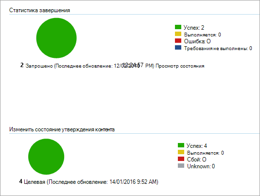

# <a name="onboard-windows-10-devices-using-configuration-manager"></a>Встроенные устройства с Windows 10 с помощью диспетчера конфигураций

**Область применения:**

- [Защита от потери данных (DLP) Microsoft 365 Endpoint](/microsoft-365/compliance/endpoint-dlp-learn-about)
- Диспетчер конфигураций System Center 2012 R2

### <a name="onboard-devices-using-system-center-configuration-manager"></a>Встроенные устройства с помощью System Center Configuration Manager

1. Откройте ZIP-файл пакета конфигурации Configuration Manager ( *DeviceComplianceOnboardingPackage.zip* ), скачанный с помощью мастера входящей миграции служб. Вы также можете получить пакет из [центра соответствия требованиям корпорации Майкрософт](https://compliance.microsoft.com/).

2. В области навигации выберите **Параметры** входящей миграции  >  **устройств**  >  **Onboarding** .

3. В поле **метод развертывания** выберите **Microsoft Endpoint Configuration Manager 2012/2012 R2/1511/1602** .
 
4. Выберите пункт **скачать пакет** и сохраните ZIP-файл.

5. Извлеките содержимое ZIP-файла в общую папку, доступную только для чтения и доступную для администраторов сети, которые будут развертывать пакет. У вас должен быть файл с именем *девицекомплианцеонбоардингскрипт. cmd* .

6. Разверните пакет, выполнив действия, описанные в статье [packages and Programs In System Center 2012 R2 Configuration Manager](https://docs.microsoft.com/previous-versions/system-center/system-center-2012-R2/gg699369\(v=technet.10\)) .

7. Выберите предварительно определенную коллекцию устройств, в которую будет развернут пакет.

> [!NOTE]
> Защита от потери данных в конечных точках Microsoft 365 не поддерживает входящую миграцию во время этапа [приветствия (OOBE)](https://answers.microsoft.com/en-us/windows/wiki/windows_10/how-to-complete-the-windows-10-out-of-box/47e3f943-f000-45e3-8c5c-9d85a1a0cf87) . Убедитесь, что пользователи завершают OOBE после установки или обновления Windows.

>[!TIP]
> После подключения устройства можно выбрать выполнение проверки обнаружения, чтобы убедиться, что устройство правильно подключено к службе. Дополнительные сведения см. в [статье выполнение проверки обнаружения для нового устройства ATP "защитник Майкрософт"](https://docs.microsoft.com/windows/security/threat-protection/microsoft-defender-atp/run-detection-test).
>
> Обратите внимание на то, что можно создать правило обнаружения для приложения Configuration Manager, чтобы постоянно проверять, было ли устройство подключено к подсистеме. Приложение — это тип объекта, отличный от того, который является пакетом и программой.
> Если устройство еще не подключено (из-за ожидания завершения OOBE или по какой-либо иной причине), диспетчер конфигурации попытается выполнить подключение устройства до тех пор, пока правило не обнаружит изменение состояния.
> 
> Это можно сделать, создав проверку правила обнаружения, если значение реестра "Онбоардингстате" (типа REG_DWORD) = 1.
> Это значение реестра находится в разделе "HKLM\SOFTWARE\Microsoft\Windows Advanced Threat Протектион\статус".
Дополнительные сведения см. [в разделе configure Detection Methods In System Center 2012 R2 Configuration Manager](https://docs.microsoft.com/previous-versions/system-center/system-center-2012-R2/gg682159\(v=technet.10\)#step-4-configure-detection-methods-to-indicate-the-presence-of-the-deployment-type).

### <a name="configure-sample-collection-settings"></a>Настройка параметров коллекции образцов

Для каждого устройства можно задать значение конфигурации, чтобы определить, можно ли собирать данные с устройства при выполнении запроса с помощью центра безопасности защитника Майкрософт, чтобы отправить файл для детального анализа.

>[!NOTE]
>Эти параметры конфигурации обычно выполняются с помощью Configuration Manager. 

Вы можете задать правило соответствия для элемента конфигурации в диспетчере конфигураций, чтобы изменить параметр общего доступа к общему ресурсу на устройстве.

Это правило должно быть элементом конфигурации правила соответствия *Устранение* , который задает значение раздела реестра на целевых устройствах, чтобы убедиться, что они являются жалобой.

Конфигурация задается с помощью следующей записи раздела реестра:

```
Path: “HKLM\SOFTWARE\Policies\Microsoft\Windows Advanced Threat Protection”
Name: "AllowSampleCollection"
Value: 0 or 1
```
Где:<br>
Тип ключа это D-слово. <br>
Возможные значения:
- 0 — не разрешает общий доступ к образцу с этого устройства
- 1 — разрешает общий доступ к типам файлов с этого устройства.

Значение по умолчанию, если раздел реестра не существует — 1.

Для получения дополнительных сведений о соответствии требованиям System Center Configuration Manager, ознакомьтесь со статьей [Введение в параметры соответствия требованиям в System center 2012 R2 Configuration Manager](https://docs.microsoft.com/previous-versions/system-center/system-center-2012-R2/gg682139\(v=technet.10\)).


## <a name="other-recommended-configuration-settings"></a>Другие Рекомендуемые параметры конфигурации
После подключения устройств к службе необходимо воспользоваться преимуществами включенных функций защиты от угроз, добавив их в следующие рекомендуемые параметры конфигурации.

### <a name="device-collection-configuration"></a>Конфигурация коллекции устройств
Если вы используете Диспетчер конфигураций конечной точки версии 2002 или более поздней, вы можете расширить развертывание, включив в него серверы или клиенты более поздней версии.


### <a name="next-generation-protection-configuration"></a>Конфигурация защиты следующего поколения

Рекомендуется использовать следующие параметры конфигурации:

**Сканирование**

- Проверка съемных устройств хранения данных, таких как USB-накопители: Да

**Защита в режиме реального времени**

- Включить мониторинг поведения: Да
- Включение защиты от потенциально нежелательных приложений при скачивании и до установки: Да

**Служба облачной защиты**

- Тип участия в службе облачной защиты: расширенное членство

**Сокращение** уязвимой зоны Настройте все доступные правила для аудита.

>[!NOTE]
> Блокировка этих действий может привести к прерыванию легальных бизнес-процессов. Лучший подход — установить все функции аудита, определить, какие из них безопасны, а затем включить эти параметры в конечных точках, не имеющих ложных срабатываний.

**Защита сети**

Прежде чем включить защиту сети в режиме аудита или блокировки, убедитесь, что вы установили обновление платформы для защиты от вредоносных программ, которое можно получить на [странице поддержки](https://support.microsoft.com/en-us/help/4560203/windows-defender-anti-malware-platform-binaries-are-missing).


**Контролируемый доступ к папкам**

Включение функции в режиме аудита не менее 30 дней. По истечении этого периода просмотрите определения и создайте список приложений, которым разрешено выполнять запись в защищенные каталоги.

Более подробную информацию можно узнать в статье [Оценка контролируемого доступа к папкам](https://docs.microsoft.com/windows/security/threat-protection/microsoft-defender-atp/evaluate-controlled-folder-access).


## <a name="offboard-devices-using-configuration-manager"></a>Устройства переносе с помощью диспетчера конфигураций

Из соображений безопасности для пакета, используемого для переносе устройств, срок действия истекает через 30 дней после загрузки даты. Недействительные пакеты отключения, отправленные на устройство, будут отклонены. При загрузке пакета отключения вы получите уведомление об истечении срока действия пакетов, и оно также будет включено в имя пакета.

> [!NOTE]
> Входящая и исходящая политики не должны разворачиваться на одном устройстве одновременно, в противном случае это приведет к непредсказуемым конфликтам.

### <a name="offboard-devices-using-microsoft-endpoint-configuration-manager-current-branch"></a>Устройства переносе, использующие текущую ветвь Microsoft Endpoint Configuration Manager

Если вы используете текущую ветвь Microsoft Endpoint Configuration Manager, ознакомьтесь [со статьей Создание файла конфигурации](https://docs.microsoft.com/configmgr/protect/deploy-use/windows-defender-advanced-threat-protection#create-an-offboarding-configuration-file)отключения.

### <a name="offboard-devices-using-system-center-2012-r2-configuration-manager"></a>Устройства переносе с использованием System Center 2012 R2 Configuration Manager

1. Получение пакета отключения от [центра соответствия требованиям корпорации Майкрософт](https://compliance.microsoft.com/):

2. В области навигации выберите **Параметры** отключение подключения  >   **устройства** >  **Offboarding** .

3. Выберите Windows 10 в качестве операционной системы.

4. В поле **метод развертывания** выберите **Microsoft Endpoint Configuration Manager 2012/2012 R2/1511/1602** .
    
5. Выберите пункт **скачать пакет** и сохраните ZIP-файл.

6. Извлеките содержимое ZIP-файла в общую папку, доступную только для чтения и доступную для администраторов сети, которые будут развертывать пакет. У вас должен быть файл с именем *DeviceComplianceOffboardingScript_valid_until_YYYY-мм-дд. cmd* .

7. Разверните пакет, выполнив действия, описанные в статье [packages and Programs In System Center 2012 R2 Configuration Manager](https://docs.microsoft.com/previous-versions/system-center/system-center-2012-R2/gg699369\(v=technet.10\)) .

8. Выберите предварительно определенную коллекцию устройств, в которую будет развернут пакет.

> [!IMPORTANT]
> Отключение останавливает отправку данных датчиков на портал, но данные с устройства, в том числе ссылки на все оповещения, которые она будет хранить, в течение 6 месяцев.


## <a name="monitor-device-configuration"></a>Мониторинг конфигурации устройства

Если вы используете текущую ветвь Microsoft Endpoint Configuration Manager, используйте встроенную панель мониторинга защитника Microsoft Defender в консоли Configuration Manager. Дополнительные сведения см. в разделе [Advanced Threat Protection в защитнике Майкрософт — мониторинг](https://docs.microsoft.com/configmgr/protect/deploy-use/windows-defender-advanced-threat-protection#monitor).

Если вы используете System Center 2012 R2 Configuration Manager, отслеживание состоит из двух частей:

1. Подтверждение того, что пакет конфигурации был правильно развернут и запущен (или успешно запущен) на устройствах в вашей сети.

2. Проверка того, что устройства соответствуют службе защиты от потери данных в Microsoft 365 (это гарантирует, что устройство может завершить процесс входящей миграции и может продолжать отчитываться от данных для службы).

### <a name="confirm-the-configuration-package-has-been-correctly-deployed"></a>Подтвердите, что пакет конфигурации был правильно развернут

1. В консоли диспетчера конфигураций щелкните **мониторинг** в нижней части области навигации.

2. Выберите **Обзор** , а затем **развертывания** .

3. Выберите развертывание с именем пакета.

4. Просмотрите индикаторы состояния в разделе **Статистика о завершении** и **состояние контента** .

    Если при развертывании произошел сбой (устройства с **ошибками** , **требования не выполнены** или **состояния** с ошибками), может потребоваться устранение неполадок устройств. Дополнительные сведения см. в [статье Устранение неполадок, связанных с Advanced Threat Protection в защитнике Майкрософт](https://docs.microsoft.com/windows/security/threat-protection/microsoft-defender-atp/troubleshoot-onboarding).

    

### <a name="check-that-the-devices-are-compliant-with-the-microsoft-365-endpoint-data-loss-prevention-service"></a>Убедитесь, что устройства соответствуют службе защиты от потери данных в Microsoft 365

Для отслеживания развертывания можно задать правило соответствия для элемента конфигурации в System Center 2012 R2 Configuration Manager.

> [!NOTE]
> Эта процедура и запись реестра применяются к точке защиты от потери данных и Advanced Threat protection.

Это правило должно быть элементом конфигурации правила соответствия, не относящимся к *Устранение* , который отслеживает значение раздела реестра на целевых устройствах.

Отслеживайте следующую запись раздела реестра:
```
Path: “HKLM\SOFTWARE\Microsoft\Windows Advanced Threat Protection\Status”
Name: “OnboardingState”
Value: “1”
```
Дополнительные сведения см. [в разделе Введение в параметры соответствия требованиям в System Center 2012 R2 Configuration Manager](https://docs.microsoft.com/previous-versions/system-center/system-center-2012-R2/gg682139\(v=technet.10\)).

## <a name="related-topics"></a>Статьи по теме
- [Встроенные устройства с Windows 10 с помощью групповой политики](dlp-configure-endpoints-gp.md)
- [Встроенные устройства с Windows 10 с помощью средств управления мобильными устройствами](dlp-configure-endpoints-mdm.md)
- [Встроенные устройства с Windows 10 с помощью локального сценария](dlp-configure-endpoints-script.md)
- [Встроенные устройства неустойчивой инфраструктуры виртуальных рабочих столов (VDI)](dlp-configure-endpoints-vdi.md)
- [Запуск проверки обнаружения на неподключенном устройстве "защитник Майкрософт" в автономном выплате](https://docs.microsoft.com/windows/security/threat-protection/microsoft-defender-atp/run-detection-test)
- [Устранение неполадок, связанных с Advanced Threat Protection в защитнике Майкрософт](https://docs.microsoft.com/windows/security/threat-protection/microsoft-defender-atp/troubleshoot-onboarding)
