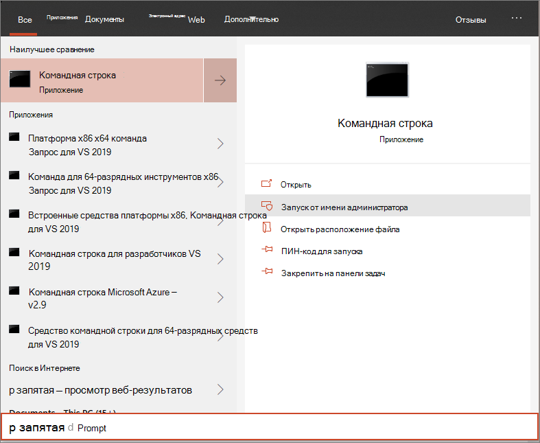

# Подключение устройств Windows 10 с помощью локального сценария

**Область применения:**

- [Microsoft 365 Предотвращение потери конечных данных (DLP)](./endpoint-dlp-learn-about.md)

Вы также можете вручную использовать отдельные устройства для Microsoft 365 предотвращения потери данных конечной точки. Это может потребоваться сначала при тестировании службы, прежде чем взять на себя обязательства по вмеяниям всех устройств в сети.

> [!IMPORTANT]
> Этот скрипт оптимизирован для использования на 10 устройствах.
>
> Для развертывания в масштабе используйте [другие параметры развертывания.](dlp-configure-endpoints.md) Например, можно развернуть сценарий onboarding на более чем 10 устройствах в производстве со сценарием, доступным на Windows 10 устройствах с помощью [групповой политики.](dlp-configure-endpoints-gp.md)

## Подключение устройств
 
1.  Откройте пакет конфигурации GP .zip *(DeviceComplianceOnboardingPackage.zip),* который вы скачали из мастера бортового обслуживания. Вы также можете получить пакет из [Центра соответствия требованиям Майкрософт](https://compliance.microsoft.com)

2. В области навигации выберите **Параметры**  >  **устройства.**

3. В поле **Метод развертывания** выберите **локальный скрипт**.

4. Нажмите **кнопку Загрузка** пакета и сохраните .zip файл.
  
5. Извлечение содержимого пакета конфигурации в расположение на устройстве, которое необходимо на борту (например, на рабочем столе). У вас должен быть файл *с именем DeviceOnboardingScript.cmd.*

6.  Откройте повышенную командную строку на устройстве и запустите сценарий:

7.  В меню **Пуск** введите **cmd**.

8.  Щелкните правой кнопкой мыши пункт **Командная строка** и выберите команду **Запуск от имени администратора**.

    

9.  Введите расположение файла скрипта. Если вы скопировали файл на рабочий стол, введите: *%userprofile%\Desktop\WindowsDefenderATPOnboardingScript.cmd*

10.  Нажмите **клавишу Ввод** или нажмите **кнопку ОК**.

Сведения о том, как вручную проверить соответствие устройству и правильно сообщать данные датчика см. в статью Устранение неполадок Расширенная защита от угроз в Microsoft Defender бортовых [проблем.](/windows/security/threat-protection/microsoft-defender-atp/troubleshoot-onboarding)

## Offboard devices using a local script
По соображениям безопасности срок действия пакета, используемой для устройств Offboard, истекает через 30 дней после даты его загрузки. Просроченные пакеты offboarding, отправленные на устройство, будут отклонены. При загрузке пакета offboarding вы будете уведомлены о дате истечения срока действия пакетов и он также будет включен в имя пакета.

> [!NOTE]
> На одном устройстве одновременно не следует развертывать политики бортового и оффбординга, в противном случае это приведет к непредсказуемым столкновениям.

1. Получить пакет offboarding из [Центра соответствия требованиям Майкрософт](https://compliance.microsoft.com)

2. В области навигации выберите **Параметры**  >  **offboarding устройства.**

3. В поле **Метод развертывания** выберите **локальный скрипт**.

4. Нажмите **кнопку Загрузка** пакета и сохраните .zip файл.

5. Извлечение содержимого файла .zip в общее расположение только для чтения, к нему можно получить доступ на устройствах. У вас должен быть *файл с DeviceComplianceOffboardingScript_valid_until_YYYY-MM-DD.cmd.*

6.  Откройте повышенную командную строку на устройстве и запустите сценарий:

7.  В меню **Пуск** введите **cmd**.

8.  Щелкните правой кнопкой мыши пункт **Командная строка** и выберите команду **Запуск от имени администратора**.

    

9.  Введите расположение файла скрипта. Если вы скопировали файл на рабочий стол, введите: *%userprofile%\Desktop\WindowsDefenderATPOffboardingScript_valid_until_YYYY-MM-DD.cmd*

10.  Нажмите **клавишу Ввод** или нажмите **кнопку ОК**.

> [!IMPORTANT]
> Отключение приводит к остановке отправки данных датчиков на портал.

## Мониторинг конфигурации устройства
Вы можете следовать различным шагам проверки в [Устранение неполадок в бортовых проблемах]((/windows/security/threat-protection/microsoft-defender-atp/troubleshoot-onboarding), чтобы убедиться, что сценарий выполнен успешно и агент запущен.

Мониторинг также можно сделать непосредственно на портале или с помощью различных средств развертывания.

### Мониторинг устройств с помощью портала
1. Перейдите [Microsoft 365 центр соответствия](https://compliance.microsoft.com)требованиям.

2. Выберите **Параметры**  >  **устройства.**  >  

3. Убедитесь, что устройства отображаются.

## Статьи по теме
- [Onboard Windows 10 с помощью групповой политики](dlp-configure-endpoints-gp.md)
- [На борту Windows 10 устройства с Microsoft Endpoint Configuration Manager](dlp-configure-endpoints-sccm.md)
- [Подключение устройств Windows 10 с помощью средств управления мобильными устройствами](dlp-configure-endpoints-mdm.md)
- [Подключение временных устройств инфраструктуры виртуальных рабочих столов (VDI)](dlp-configure-endpoints-vdi.md)
- [Запустите тест обнаружения на недавно созданном устройстве Microsoft Defender для конечных точек](/windows/security/threat-protection/microsoft-defender-atp/run-detection-test)
- [Устранение неполадок Расширенная защита от угроз в Microsoft Defender бортовых проблем](/windows/security/threat-protection/microsoft-defender-atp/troubleshoot-onboarding)