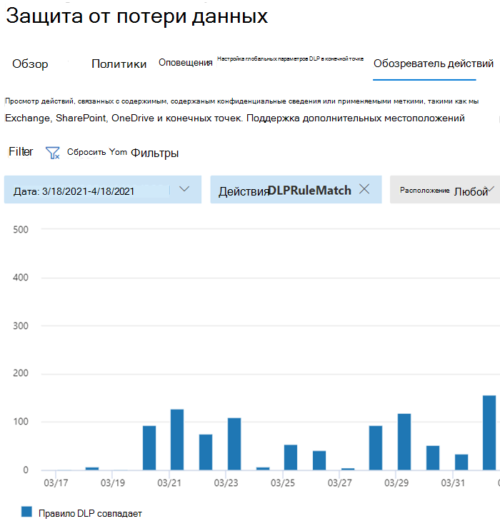

# Сведения о защите от потери данныхLearn about data loss prevention

Организации имеют конфиденциальные сведения, которые находятся под их контролем, такие как финансовые данные, собственные данные, номера кредитных карт, записи о состоянии здоровья или номера социального страхования.Organizations have sensitive information under their control such as financial data, proprietary data, credit card numbers, health records, or social security numbers. Чтобы защитить эти конфиденциальные данные и снизить риск, им необходим способ предотвратить ненадлежащее их использование пользователями с людьми, у которых их не должно быть.To help protect this sensitive data and reduce risk, they need a way to prevent their users from inappropriately sharing it with people who shouldn't have it. Эта практика называется предотвращением потери данных (DLP).This practice is called data loss prevention (DLP).

В Microsoft 365 реализована профилактика потери данных путем определения и применения политик DLP.In Microsoft 365, you implement data loss prevention by defining and applying DLP policies. С помощью политики DLP можно идентифицировать, отслеживать и автоматически защищать конфиденциальные элементы в различных областях:With a DLP policy, you can identify, monitor, and automatically protect sensitive items across:

- Microsoft 365, таких как Teams, Exchange, SharePoint и OneDriveMicrosoft 365 services such as Teams, Exchange, SharePoint, and OneDrive
- Office таких приложений, как Word, Excel и PowerPointOffice applications such as Word, Excel, and PowerPoint
- Windows 10 конечных точекWindows 10 endpoints
- облачные приложения, не в microsoftnon-Microsoft cloud apps
- локальной файловой папки и локальной SharePoint.on-premises file shares and on-premises SharePoint.

Microsoft 365 обнаружения конфиденциальных элементов с помощью глубокого анализа контента, а не простого сканирования текста.Microsoft 365 detects sensitive items by using deep content analysis, not by just a simple text scan. Содержимое анализируется для совпадений основных данных с ключевыми словами, путем оценки регулярных выражений, внутренней проверки функций и вторичных совпадений данных, которые находятся в непосредственной близости от основного совпадения данных.Content is analyzed for primary data matches to keywords, by the evaluation of regular expressions, by internal function validation, and by secondary data matches that are in proximity to the primary data match. Кроме того, DLP использует алгоритмы машинного обучения и другие методы для обнаружения контента, который соответствует вашим политикам DLP.Beyond that DLP also uses machine learning algorithms and other methods to detect content that matches your DLP policies.
  
## DLP является частью более широкого предложения Microsoft 365 соответствия требованиямDLP is part of the larger Microsoft 365 Compliance offering

Microsoft 365 DLP — это только один из средств Microsoft 365 соответствия требованиям, которые вы будете использовать для защиты конфиденциальных элементов, где бы они ни жили или путешествовали.Microsoft 365 DLP is just one of the Microsoft 365 Compliance tools that you will use to help protect your sensitive items wherever they live or travel. Вы должны понимать другие средства в наборе Microsoft 365 соответствия требованиям, их взаимозависят и лучше работать вместе.You should understand the other tools in the Microsoft 365 Compliance tools set, how they interrelate, and work better together.  См. [Microsoft 365 средства обеспечения соответствия](protect-information.md) требованиям, чтобы узнать больше о процессе защиты информации.See, [Microsoft 365 compliance tools](protect-information.md) to learn more about the information protection process.

## Защитные действия политик DLPProtective actions of DLP policies

Microsoft 365 Политики DLP — это отслеживание действий, которые пользователи принимают на конфиденциальные элементы в покое, конфиденциальные элементы в пути или конфиденциальные элементы, которые используются, и принимают защитные меры.Microsoft 365 DLP policies are how you monitor the activities that users take on sensitive items at rest, sensitive items in transit, or sensitive items in use and take protective actions. Например, если пользователь пытается предпринять запрещенное действие, например скопировать конфиденциальный элемент в неодобренное расположение или поделиться медицинской информацией по электронной почте или другим условиям, изложенным в политике, DLP может:For example, when a user attempts to take a prohibited action, like copying a sensitive item to an unapproved location or sharing medical information in an email or other conditions laid out in a policy, DLP can:

- покажите всплывающее правило пользователю, предупреждающее его о том, что он может ненадлежащим образом делиться конфиденциальным элементомshow a pop-up policy tip to the user that warns them that they may be trying to share a sensitive item inappropriately
- блокируют общий доступ и с помощью подсказки политики позволяют пользователю переопределить блокировку и зафиксировать оправдание пользователей.block the sharing and, via a policy tip, allow the user to override the block and capture the users' justification
- блокировка общего доступа без параметра переопределенияblock the sharing without the override option
- для данных в покое конфиденциальные элементы могут быть заблокированы и перемещены в безопасное карантинное расположениеfor data at rest, sensitive items can be locked and moved to a secure quarantine location
- для Teams чата конфиденциальные сведения не будут отображатьсяfor Teams chat, the sensitive information will not be displayed

Все действия, отслеживаемые DLP, записываются в [журнал](search-the-audit-log-in-security-and-compliance.md) аудита Microsoft 365 по умолчанию и перенаписываются в [обозреватель активности.](data-classification-activity-explorer.md)All DLP monitored activities are recorded to the [Microsoft 365 Audit log](search-the-audit-log-in-security-and-compliance.md) by default and routed to [Activity explorer](data-classification-activity-explorer.md). Если пользователь выполняет действие, отвечаемое критериям политики DLP, и у вас есть настроенные оповещений, DLP предоставляет оповещения в панели управления оповещениями [DLP.](dlp-configure-view-alerts-policies.md)When a user performs an action that meets the criteria of a DLP policy, and you have alerts configured, DLP provides alerts in the [DLP alert management dashboard](dlp-configure-view-alerts-policies.md).

## Жизненный цикл DLPDLP lifecycle

Реализация DLP обычно следует этим основным этапам.A DLP implementation typically follows these major phases.

- [Планирование DLPPlan for DLP](#plan-for-dlp)
- [Подготовка к DLPPrepare for DLP](#prepare-for-dlp)
- [Развертывание политик в производствеDeploy your policies in production](#deploy-your-policies-in-production)

<!--ADD DIAGRAM OF THE DLP LIFECYCLE WORK ON WITH MAS-->

### Планирование DLPPlan for DLP

Microsoft 365 Мониторинг и защита DLP являются родными для приложений, которые пользователи используют каждый день.Microsoft 365 DLP monitoring and protection are native to the applications that users use every day. Это помогает защитить конфиденциальные элементы вашей организации от рискованных действий, даже если пользователи непривычены к мышлению и практике предотвращения потери данных.This helps to protect your organizations' sensitive items from risky activities even if your users are unaccustomed to data loss prevention thinking and practices. Если ваша организация и пользователи не могут использовать методы предотвращения потери данных, принятие DLP может потребовать изменения бизнес-процессов, и для пользователей будет смена культуры.If your organization and your users are new to data loss prevention practices, the adoption of DLP may require a change to your business processes and there will be a culture shift for your users. Но при правильном планировании, тестировании и настройке политики DLP будут защищать конфиденциальные элементы, минимизируя возможные нарушения бизнес-процессов.But, with proper planning, testing and tuning, your DLP policies will protect your sensitive items while minimizing any potential business process disruptions.

**Планирование технологий для DLP****Technology planning for DLP**

Имейте в виду, что DLP как технология может отслеживать и защищать ваши данные в покое, данные, которые используются, и данные в движении в Microsoft 365 службах, Windows 10 устройствах, локальном файле и локальном SharePoint.Keep in mind that DLP as a technology can monitor and protect your data at rest, data in use and data in motion across Microsoft 365 services, Windows 10 devices, on-premises file shares, and on-premises SharePoint. Существуют последствия планирования для различных местоположений, тип данных, которые необходимо отслеживать и защищать, а также действия, которые необходимо принять при совпадении политик.There are planning implications for the different locations, the type of data you want to monitor and protect, and the actions to be taken when a policy match occurs.  

**Планирование бизнес-процессов для DLP****Business processes planning for DLP**

Политики DLP могут блокировать запрещенные действия, например ненадлежащий обмен конфиденциальной информацией по электронной почте.DLP policies can block prohibited activities, like inappropriate sharing of sensitive information via email. При планировании политик DLP необходимо определить бизнес-процессы, которые касаются конфиденциальных элементов.As you plan your DLP policies, you must identify the business processes that touch your sensitive items. Владельцы бизнес-процессов могут помочь вам определить соответствующее поведение пользователя, которое должно быть разрешено, и ненадлежащее поведение пользователя, от которое следует защищаться.The business process owners can help you identify appropriate user behaviors that should be allowed and inappropriate user behaviors that should be protected against. Необходимо спланировать политики и развернуть их в тестовом  режиме, а затем оценить их влияние с помощью обозревателя действий, а затем применить их в более строгих режимах.You should plan your policies and deploy them in test mode, and evaluate their impact via [activity explorer](data-classification-activity-explorer.md) first, before applying them in more restrictive modes.

**Планирование организационной культуры для DLP****Organizational culture planning for DLP**

Успешная реализация DLP зависит от подготовки и подготовки пользователей к практикам предотвращения потери данных, а также от хорошо спланированных и настроенных политик.A successful DLP implementation is as much dependent on getting your users trained and acclimated to data loss prevention practices as it is on well planned and tuned policies. Так как пользователи активно вовлечены, обязательно запланируйте для них обучение.Since your users are heavily involved, be sure to plan for training for them too. Советы по политике можно стратегически использовать для повышения осведомленности пользователей перед изменением режима применения политики с тестового на более строгий.You can strategically use policy tips to raise awareness with your users before changing the policy enforcement from test mode to more restrictive modes.

<!--For more information on planning for DLP, including suggestions for deployment based on your needs and resources, see [Planning for Microsoft 365 data loss prevention](dlp-plan-for-dlp.md).-->

### Подготовка к DLPPrepare for DLP

Политики DLP можно применять к данным в режиме покоя, данным в использовании и данным в движении в местах, таких как:You can apply DLP policies to data at rest, data in use, and data in motion in locations, such as:

- Exchange Online электронной почтыExchange Online email
- Сайтах SharePoint Online;SharePoint Online sites
- Учетные записи OneDriveOneDrive accounts
- Сообщения в чатах и каналах TeamsTeams chat and channel messages
- Microsoft Cloud App SecurityMicrosoft Cloud App Security
- Устройства с Windows 10Windows 10 devices
- Репозитории локальногоOn-premises repositories

Каждый из них имеет различные предварительные требования.Each one has different pre-requisites. Конфиденциальные элементы в некоторых местах, например Exchange в Интернете, могут быть доставлены под зонтиком DLP, просто настроив политику, которая применяется к ним.Sensitive items in some locations, like Exchange online, can be brought under the DLP umbrella by just configuring a policy that applies to them. Для других, например для локального репозиториев файлов, требуется развертывание сканера Azure Information Protection (AIP).Others, such as on-premises file repositories require a deployment of Azure Information Protection (AIP) scanner. Необходимо подготовить среду, политики разработки кода и тщательно проверить их, прежде чем активировать любые действия по блокировке.You'll need to prepare your environment, code draft policies, and test them thoroughly before activating any blocking actions.

### Развертывание политик в производствеDeploy your policies in production

#### Разработка политикDesign your policies

Начните с определения целей управления и их применения в каждой рабочей нагрузке.Start by defining your control objectives, and how they apply across each respective workload. Проект политики, воплощаемой в ваших задачах.Draft a policy that embodies your objectives. Не стесняйся начинать с одной рабочей нагрузки одновременно или во всех рабочих нагрузках .Feel free to start with one workload at a time, or across all workloads - there's no impact yet.

#### Реализация политики в тестовом режимеImplement policy in test mode

Оцените влияние элементов управления, реализуя их с помощью политики DLP в тестовом режиме.Evaluate the impact of the controls by implementing them with a DLP policy in test mode. Это нормально, чтобы применить политику для всех рабочих нагрузок в тестовом режиме, так что вы можете получить полную широту результатов, но вы можете начать с одной рабочей нагрузки, если это необходимо.It's ok to apply the policy to all workloads in test mode, so that you can get the full breadth of results, but you can start with one workload if you need to.

#### Мониторинг результатов и донастройка политикиMonitor outcomes and fine-tune the policy

В тестовом режиме отслеживайте результаты политики и настраивайте ее таким образом, чтобы она соответствовала задачам управления, обеспечивая при этом непреднамеренное или непреднамеренное воздействие на допустимые пользовательские процессы и производительность.While in test mode, monitor the outcomes of the policy and fine-tune it so that it meets your control objectives while ensuring you aren't adversely or inadvertently impacting valid user workflows and productivity. Вот несколько примеров тонкой настройки:Here are some examples of things to fine-tune:

- настройка расположения и людей/мест, которые находятся в области или находятся вне областиadjusting the locations and people/places that are in or out of scope
- настройка условий и исключений, используемых для определения того, соответствует ли элемент и что с ним делается, политикеtune the conditions and exceptions that are used to determine if an item and what is being done with it matches the policy
- определение конфиденциальной информации/sthe sensitive information definition/s
- действияthe actions
- уровень ограниченийthe level of restrictions
- добавление новых элементов управленияadd new controls
- добавление новых людейadd new people
- добавление новых приложений с ограниченным доступомadd new restricted apps
- добавление новых сайтов с ограниченным доступомadd new restricted sites

#### Включить управление и настроить политикиEnable the control and tune your policies

После того как политика будет отвечать всем вашим целям, включите ее.Once the policy meets all your objectives, turn it on. Продолжайте отслеживать результаты приложения политики и настраивать по мере необходимости.Continue to monitor the outcomes of the policy application and tune as needed. Как правило, политики вступает в силу примерно через час после включаемого.In general, policies take effect about an hour after being turned on. <!--See, раздел LINK TO для slAs для конкретных сведений о расположении — ><!--See, LINK TO topic for SLAs for location specific  details-- >

## Обзор конфигурации политики DLPDLP policy configuration overview

Вы можете гибко создавать и настраивать политики DLP.You have flexibility in how you create and configure your DLP policies. Вы можете начать с заранее задав шаблон и создайте политику всего за несколько щелчков мыши или создайте свою собственную с нуля.You can start from a predefined template and create a policy in just a few clicks or you can design your own from the ground up. Независимо от выбора, все политики DLP требуют от вас одинаковые сведения.No matter which you choose, all DLP policies require the same information from you.

1. **Выберите то,** что вы хотите отслеживать, Microsoft 365 поставляется с множеством заранее разработанных шаблонов политики, чтобы помочь вам начать работу или вы можете создать настраиваемую политику.**Choose what you want to monitor** - Microsoft 365 comes with many predefined policy templates to help you get started or you can create a custom policy.
    - Предопределен шаблон политики: финансовые данные, медицинские и медицинские данные, данные конфиденциальности для различных стран и регионов.A predefined policy template: Financial data, Medical and health data, Privacy data all for various countries and regions.
    - Настраиваемая политика, использующая доступные типы конфиденциальной информации, метки хранения и метки конфиденциальности.A custom policy that uses the available sensitive information types, retention labels, and sensitivity labels.
2. **Выберите, где нужно отслеживать** — выберите одно или несколько местоположений, которые необходимо отслеживать для отслеживания конфиденциальной информации.**Choose where you want to monitor** - You pick one or more locations that you want DLP to monitor for sensitive information. Вы можете отслеживать:You can monitor:
    
расположениеlocation | добавление и исключение поinclude/exclude by|
|---------|---------|
|электронная почта ExchangeExchange email| группы рассылкиdistribution groups|
|сайты SharePointSharePoint sites |сайтыsites |
|учетные записи OneDriveOneDrive accounts |учетные записи или группы рассылкиaccounts or distribution groups |
|сообщения в чатах и каналах TeamsTeams chat and channel messages |учетные записиaccounts |
|устройства с Windows 10Windows 10 devices |пользователь или группаuser or group |
|Microsoft Cloud App SecurityMicrosoft Cloud App Security |экземплярinstance |
|Репозитории локальногоOn-premises repositories| Путь к файлу репозиторияrepository file path|

3. **Выберите условия,** которые должны соответствовать политике, применяемой к элементу, - вы можете принять заранее настроенные условия или определить настраиваемые условия.**Choose the conditions that must be matched for a policy to be applied to an item** - you can accept pre-configured conditions or define custom conditions. Ниже приведен ряд примеров.Some examples are:

- элемент содержит определенный тип конфиденциальной информации, которая используется в определенном контексте.item contains a specified kind of sensitive information that is being used in a certain context. Например, 95 номеров социального страхования по электронной почте получателю за пределами вашей организации.For example, 95 social security numbers being emailed to recipient outside your org.
- элемент имеет заданную метку чувствительностиitem has a specified sensitivity label
- элемент с конфиденциальной информацией является общим для внутренней или внешнейitem with sensitive information is shared either internally or externally

4. **Выберите действие, необходимое при условии** политики. Действия зависят от расположения, в котором происходит действие.**Choose the action to take when the policy conditions are met** - The actions depend on the location where the activity is happening.  Ниже приведен ряд примеров.Some examples are:

- SharePoint/Exchange/OneDrive: блокируют доступ к содержимому людям, которые находятся за пределами формы организации.SharePoint/Exchange/OneDrive: Block people who are outside your organization form accessing the content. Покажите пользователю подсказку и отправьте ему уведомление по электронной почте о том, что они принимают меры, запрещенные политикой DLP.Show the user a tip and send them an email notification that they are taking an action that is prohibited by the DLP policy.
- Teams Чат и канал: блокируют доступ к конфиденциальной информации в чате или каналеTeams Chat and Channel: Block sensitive information from being shared in the chat or channel
- Windows 10 Устройства: аудит или ограничение копирования конфиденциального элемента на удаляемое USB-устройствоWindows 10 Devices: Audit or restrict copying a sensitive item to a removeable USB device 
- Office Приложения: покажите всплывающее всплывающее приложение, уведомляющее пользователя о том, что они занимаются рискованным поведением и блокируют или блокируют, но позволяют переопределять.Office Apps: Show a popup notifying the user that they are engaging in a risky behavior and block or block but allow override.
- Локальное файлообмятина: переместите файл из места хранения в карантиную папкуOn-premises file shares: move the file from where it is stored to a quarantine folder

> [!NOTE]
> Условия и действия, которые необходимо принять, определяются в объекте, называемом правилом.The conditions and the actions to take are defined in an object called a Rule.

<!--## Create a DLP policy

All DLP policies are created and maintained in the Microsoft 365 Compliance center. See, INSERT LINK TO ARTICLE THAT WILL START WALKING THEM THROUGH THE POLICY CREATION PROCEDURES for more information.-->

После создания политики DLP в Центре соответствия требованиям она хранится в центральном хранилище политик, а затем синхронизируется с различными источниками контента, включая:After you create a DLP policy in the Compliance Center, it's stored in a central policy store, and then synced to the various content sources, including:
  
- Exchange Online и оттуда в Outlook в Интернете и Outlook;Exchange Online, and from there to Outlook on the web and Outlook.
- Сайты OneDrive для бизнеса.OneDrive for Business sites.
- Сайты SharePoint Online.SharePoint Online sites.
- Классические приложения Office (Excel, PowerPoint и Word).Office desktop programs (Excel, PowerPoint, and Word).
- Сообщениях каналов и чата Microsoft Teams.Microsoft Teams channels and chat messages.
    
После синхронизации политики с нужными расположениями она начинает оценивать контент и выполнять действия.After the policy's synced to the right locations, it starts to evaluate content and enforce actions.

## Просмотр результатов приложения политикиViewing policy application results

DLP сообщает об огромном количестве сведений, Microsoft 365 мониторинга, совпадений политики и действий, а также действий пользователей.DLP reports a vast amount of information into Microsoft 365 from monitoring, policy matches and actions, and user activities. Для настройки политик и действий, принятых в отношении конфиденциальных элементов, необходимо использовать эти сведения и действовать.You'll need to consume and act on that information to tune your policies and triage actions taken on sensitive items. Телеметрия входит в  журналы аудита Microsoft 365 центра аудита, обрабатывается и проходит путь к различным средствам отчетности.The telemetry goes into the [Microsoft 365 Compliance center Audit Logs](search-the-audit-log-in-security-and-compliance.md#search-the-audit-log-in-the-compliance-center) first, is processed, and makes its way to different reporting tools. Каждый инструмент отчетности имеет разные цели.Each reporting tool has a different purpose.  

### Панель мониторинга оповещений DLPDLP Alerts Dashboard

Когда DLP принимает действие по конфиденциальному элементу, вы можете быть уведомлены об этом действии с помощью настраиваемого оповещения.When DLP takes an action on a sensitive item, you can be notified of that action via a configurable alert. Вместо того, чтобы эти оповещения накапливались в почтовом ящике для просеки, центр соответствия требованиям делает их доступными в панели мониторинга управления [оповещениями DLP](dlp-configure-view-alerts-policies.md).Rather than having these alerts pile up in a mailbox for you to sift through, the Compliance center makes them available in the [DLP Alerts Management Dashboard](dlp-configure-view-alerts-policies.md). Используйте панель оповещений DLP для настройки оповещений, их просмотра, их отслеживания и отслеживания разрешения оповещений DLP.Use the DLP Alerts dashboard to configure alerts, review them, triage them and track resolution of DLP Alerts. Вот пример оповещений, созданных в результате совпадений политик и действий с Windows 10 устройств.Here's an example of alerts generated by policy matches and activities from Windows 10 devices.

> [!div class="mx-imgBorder"]
> 

Вы также можете просматривать сведения о родственном событии с расширенными метаданными на той же панели мониторинга.You can also view details of the associated event with rich metadata in the same dashboard

> [!div class="mx-imgBorder"]
> 

### ОтчетыReports

Отчеты [DLP показывают](view-the-dlp-reports.md#view-the-reports-for-data-loss-prevention) широкие тенденции со временем и дают конкретные сведения о:The [DLP reports](view-the-dlp-reports.md#view-the-reports-for-data-loss-prevention) show broad trends over time and give specific insights into:

- **Политика DLP совпадает со** временем и фильтрует по диапазону дат, расположению, политике или действию**DLP Policy Matches** over time and filter by date range, location, policy, or action
- **Совпадения инцидентов DLP** также показывают совпадения с течением времени, но повороты на элементов, а не правила политики.**DLP incident matches** also shows matches over time, but pivots on the items rather than the policy rules.
- **Ложные срабатывания** и переопределения DLP показывают количество ложных срабатываний и, если настроены, переопределяют пользователя вместе с обоснованием пользователя.**DLP false positives and overrides** shows the count of false positives and, if configured, user-overrides along with the user justification.

### Обозреватель активности DLPDLP Activity Explorer

Вкладка Обозреватель действий на странице  DLP имеет заранее фильтр *действия dLPRuleMatch.*The Activity explorer tab on the DLP page has the *Activity* filter preset to *DLPRuleMatch*. Используйте этот инструмент для проверки действий, связанных с контентом, содержаным конфиденциальную информацию или применяемой меткой, например, изменения меток, изменение файлов и соответствие правилу.Use this tool to review activity related to content that contains sensitive info or has labels applied, such as what labels were changed, files were modified, and matched a rule.

Дополнительные сведения см. в [ссылке Начало работы с проводником действий](data-classification-activity-explorer.md)For more information, see [Get started with activity explorer](data-classification-activity-explorer.md)

Дополнительные дополнительные Microsoft 365 DLP см. в таблице:To learn more about Microsoft 365 DLP, see:

- [Сведения о защите от потери данных в конечной точке Microsoft 365Learn about Microsoft 365 Endpoint data loss prevention](endpoint-dlp-learn-about.md)
- [Сведения о политике защиты от потери данных по умолчанию в Microsoft Teams (предварительная версия)Learn about the default data loss prevention policy in Microsoft Teams (preview)](dlp-teams-default-policy.md)
- [Узнайте о локальном сканере для защиты от потери данных Microsoft 365 (предварительная версия)Learn about the Microsoft 365 data loss prevention on-premises scanner (preview)](dlp-on-premises-scanner-learn.md)
- [Сведения о расширении соответствия требованиям Майкрософт (предварительная версия)Learn about the Microsoft Compliance Extension (preview)](dlp-chrome-learn-about.md)
- [Сведения о панели мониторинга оповещений для защиты от потери данныхLearn about the data loss prevention Alerts dashboard](dlp-alerts-dashboard-learn.md)

Сведения о том, как использовать предотвращение потери данных в соответствии с правилами конфиденциальности данных, см. в странице Deploy [information protection for data privacy regulations with Microsoft 365](../solutions/information-protection-deploy.md) (aka.ms/m365dataprivacy).To learn how to use data loss prevention to comply with data privacy regulations, see [Deploy information protection for data privacy regulations with Microsoft 365](../solutions/information-protection-deploy.md)  (aka.ms/m365dataprivacy).