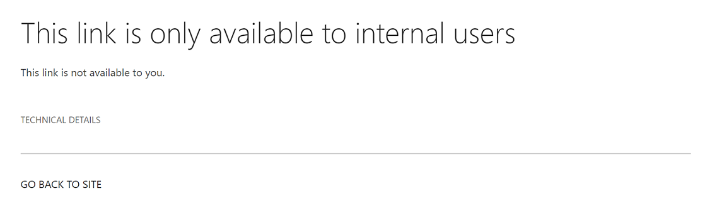

# Защита от потери данных и Microsoft Teams

Если в организации есть меры по предотвращению потери данных (DLP), можно определить политики, которые мешают людям делиться конфиденциальной информацией в Microsoft Teams канале или сеансе чата. Вот несколько примеров работы этой защиты.

- **Пример 1. Защита конфиденциальной информации в сообщениях.** Предположим, что кто-то пытается поделиться конфиденциальной информацией в Teams чате или канале с гостями (внешними пользователями). Если для предотвращения этого установлена политика DLP, сообщения с конфиденциальной информацией, которые отправляются внешним пользователям, удаляются. Это происходит автоматически и в течение нескольких секунд в соответствии с настройкой политики DLP.

    > [!NOTE]
    > DLP для Microsoft Teams блокирует конфиденциальный контент при совместном Microsoft Teams пользователями, у которых есть: - [гостевой доступ](/MicrosoftTeams/guest-access) в командах и каналах; или - [внешний доступ](/MicrosoftTeams/manage-external-access) к собраниям и сеансам чата. 
DLP для внешних сеансов чата будет работать только в том случае, если отправитель и приемник находятся в режиме Teams только и используют Microsoft Teams [федерацию](/microsoftteams/manage-external-access). DLP для Teams не блокирует сообщения  в ходе Skype для бизнеса сеансов чата с федеративами.

- **Пример 2. Защита конфиденциальной информации в документах.** Предположим, что кто-то пытается поделиться документом с гостями в Microsoft Teams канале или чате, а документ содержит конфиденциальные сведения. Если для предотвращения этого установлена политика DLP, документ не будет открыт для этих пользователей. Для применения защиты необходимо, чтобы политика защиты от потери данных включала SharePoint и OneDrive. Это пример DLP для SharePoint, отображаемого в Microsoft Teams, и поэтому требует, чтобы пользователи лицензированы на Office 365 DLP (включены в Office 365 E3), но не требуют лицензии пользователей для Office 365 Advanced Compliance.)

## Лицензирование DLP для Microsoft Teams

[Возможности предотвращения потери](dlp-learn-about-dlp.md) данных были расширены, чтобы включить Microsoft Teams и сообщения каналов, в том числе сообщения частных **каналов** для:

- Office 365 E5/A5
- Microsoft 365 E5/A5
- Защита информации и управление данными в Microsoft 365
- Office 365 Advanced Compliance

Office 365 и Microsoft 365 E3 включают защиту DLP для SharePoint Online, OneDrive и Exchange Online. Это также включает файлы, которые Teams, поскольку Teams использует SharePoint Online и OneDrive для общего использования файлов.

Поддержка защиты DLP в Teams чате требует E5.

Дополнительные сведения о требованиях к лицензированию см. в статье [Рекомендации по лицензированию служб на уровне клиента Microsoft 365](/office365/servicedescriptions/microsoft-365-service-descriptions/microsoft-365-tenantlevel-services-licensing-guidance/microsoft-365-security-compliance-licensing-guidance).

> [!IMPORTANT]
> DLP применяется только к фактическим сообщениям в потоке чата или канала. Уведомления об активности, которые включают краткий предварительный просмотр сообщений и  отображаются на основе параметров уведомлений пользователя, не включаются в Teams DLP. Все конфиденциальные сведения, представленные в части сообщения, которое отображается в предварительном просмотре, будут видны в уведомлении даже после того, как политика DLP была применена и удалена конфиденциальную информацию самого сообщения.

## Область защиты DLP

Защита DLP применяется по-разному к Teams сущностям.

|Учетные записи пользователей/группы/список  |Teams Entity |Доступная защита от DLP|
|---------|---------|---------|
|отдельные учетные записи пользователей     |1:1/n чаты         |да         |
|     |общие чаты         |нет         |
|     |частные каналы         |да         |
|группы безопасности и списки рассылки  | 1:1/n чаты         |да         |
|     |общие чаты         |нет         |
|     |частные каналы         |да        |
|Microsoft 365 группы    |1:1/n чаты          |нет         |
|     |общие чаты          |да        |
|     |частные каналы|нет| 

## Советы по политике помогают обучать пользователей

Подобно тому, как DLP работает в [Exchange, Outlook, Outlook](data-loss-prevention-policies.md#policy-evaluation-in-exchange-online-outlook-and-outlook-on-the-web)в Интернете, [SharePoint Online, OneDrive для бизнеса](data-loss-prevention-policies.md#policy-evaluation-in-onedrive-for-business-and-sharepoint-online-sites)сайтах и [Office](data-loss-prevention-policies.md#policy-evaluation-in-the-office-desktop-programs)клиенты настольных компьютеров, советы по политике отображаются при запуске действия с политикой DLP. Вот пример подсказки политики:

Здесь отправитель попытался поделиться номером социального обеспечения в Microsoft Teams канале. Ссылка **Что я могу сделать?** открывает диалоговое окно, которое предоставляет варианты для отправитель для решения проблемы. Обратите внимание, что отправитель может переопределить политику или уведомить об этом администратора.

В организации можно разрешить пользователям переопределять политику DLP. При настройке политик DLP можно использовать советы по политике по умолчанию или настроить советы по политике [для](#to-customize-policy-tips) организации.

Возвращаясь к нашему примеру, когда отправитель поделился номером социального обеспечения в канале Teams, вот что увидел получатель:

> [!div class="mx-imgBorder"]
> 

### Настройка подсказок политики

Для выполнения этой задачи вам должна быть назначена роль с разрешениями на редактирование политик защиты от потери данных. Дополнительные сведения см. в статье [Разрешения](data-loss-prevention-policies.md#permissions).

1. Перейдите в Центр соответствия требованиям [https://compliance.microsoft.com](https://compliance.microsoft.com) () и войдите.

2. Выберите **Защита от потери данных** > **Политика**.

3. Выберите политику, а рядом с настройками **политики** выберите **Изменить**.

4. Создайте новое правило или отредактировать существующее правило для политики.

    > [!div class="mx-imgBorder"]
    > 

5. На **вкладке Уведомления пользователя** выберите **Настройка** текста электронной почты и/или настройка вариантов текста **подсказки** политики.

    > [!div class="mx-imgBorder"]
    >    

6. Укажите текст, который необходимо использовать для уведомлений электронной почты и/или советов по политике, а затем выберите **Сохранить**.

7. На **вкладке Параметры политики** выберите **Сохранить**.

Разрешить примерно один час, чтобы изменения работали через центр обработки данных и синхронизируются с учетной записью пользователя.
 <!-- why are these syncing to user accounts? -->

## Добавление Microsoft Teams в качестве расположения к существующим политикам защиты от потери данных

Для выполнения этой задачи вам должна быть назначена роль с разрешениями на редактирование политик защиты от потери данных. Дополнительные сведения см. в статье [Разрешения](data-loss-prevention-policies.md#permissions).

1. Перейдите в Центр соответствия требованиям [https://compliance.microsoft.com](https://compliance.microsoft.com) () и войдите.

2. Выберите **Защита от потери данных** > **Политика**.

3. Выберите политику и посмотрите на значения в **"Расположениях".** Если вы видите **Teams и сообщения каналов,** вы все настроены. Если этого не делать, нажмите кнопку **Изменить**.

    > [!div class="mx-imgBorder"]
    > 

4. В **столбце Состояние** включаем политику для Teams **и сообщений каналов.**

    > [!div class="mx-imgBorder"]
    > 

5. На **вкладке Выбор расположения** сохраняйте параметр по умолчанию для всех учетных записей или выберите **Позвольте мне выбрать определенные расположения.** Можно указать:

    1. до 1000 отдельных учетных записей, которые необходимо включить или исключить
    1. списки рассылки и группы безопасности, которые необходимо включить или исключить. 
    <!-- 1. the shared mailbox of a shared channel. **This is a public preview feature.**--> 
    
6. Затем нажмите кнопку **Далее**.

7. Щелкните **Сохранить**.

Разрешить примерно один час, чтобы изменения работали через центр обработки данных и синхронизируются с учетной записью пользователя.
<!-- again, why user accounts? -->

## Определение новой политики защиты от потери данных для Microsoft Teams

Для выполнения этой задачи вам должна быть назначена роль с разрешениями на редактирование политик защиты от потери данных. Дополнительные сведения см. в статье [Разрешения](data-loss-prevention-policies.md#permissions).

1. Перейдите в Центр соответствия требованиям [https://compliance.microsoft.com](https://compliance.microsoft.com) () и войдите.

2. Выберите **Защита от потери данных** > **Политика** > **Создать политику**.

3. Выберите [шаблон,](data-loss-prevention-policies.md#dlp-policy-templates)а затем выберите **Далее**.

    В нашем примере мы выбрали шаблон персональных данных, идентифицируемый в США.

    > [!div class="mx-imgBorder"]
    >  

4. На **вкладке Имя политики** укажите имя и описание политики, а затем выберите **Далее**.

5. На **вкладке Выбор расположения** сохраняйте параметр по умолчанию для всех учетных записей или выберите **Позвольте мне выбрать определенные расположения.** Можно указать:

    1. до 1000 отдельных учетных записей, которые необходимо включить или исключить
    1. списки рассылки и группы безопасности, которые необходимо включить или исключить. **Это функция предварительного просмотра.**
    <!-- 1. the shared mailbox of a shared channel. **This is a public preview feature.**-->  

    

    > [!NOTE]
    > Если вы хотите убедиться, что документы, содержащие конфиденциальную информацию,  не будут Teams в Teams, убедитесь, что SharePoint сайты и **OneDrive** учетные записи включены, а также Teams чата и сообщений каналов **.**

6. На **вкладке** Параметры политики в статье **Настройка** типа контента, который необходимо защитить, сохраняем простые параметры по умолчанию или выберите **Использование** расширенных параметров, а затем выберите **Далее**. Если вы выбираете расширенные параметры, вы можете создать или изменить правила для вашей политики. Чтобы получить помощь в этом, [см. в примере Simple settings vs. advanced settings.](data-loss-prevention-policies.md#simple-settings-vs-advanced-settings)

7.  На **вкладке Параметры** политики в статье Что нужно сделать, если мы обнаруживаем конфиденциальную **информацию?,** просмотрите параметры. Здесь можно сохранить советы по политике по умолчанию и [уведомления](use-notifications-and-policy-tips.md)электронной почты или настроить их.

    > [!div class="mx-imgBorder"]
    > 

    По завершению проверки или редактирования параметров выберите **Далее**.

8. На  вкладке Параметры политики в статье Вы хотите сначала включить политику или протестировать **ее?** Выберите, включить ли [политику,](dlp-overview-plan-for-dlp.md#policy-deployment)сначала протестировать ее или отключить, а затем выбрать **Далее**.

    > [!div class="mx-imgBorder"]
    > 

9. На **вкладке Обзор параметров** просмотрите параметры новой политики. Выберите **Изменить,** чтобы внести изменения. По завершению выберите **Create**.

Разрешить примерно один час для новой политики, чтобы работать свой путь через центр обработки данных и синхронизировать с учетной записью пользователя.

## Запрет внешнего доступа к конфиденциальным документам

Чтобы убедиться SharePoint документы, содержащие конфиденциальные сведения, не могут быть доступны внешним гостям из SharePoint или Teams по умолчанию, выберите следующее:

- Вы можете гарантировать, что документы будут защищены до тех пор, пока DLP не сканирует и не пометит их как безопасные для обмена, пометив новые файлы как конфиденциальные [по умолчанию.](/sharepoint/sensitive-by-default)

- Рекомендуемая структура политики защиты от потери данных

    - **Conditions**
        - Содержимое содержит любой из этих типов конфиденциальной информации: [Выберите все, что применяется]
        
        - Содержимое совместно Microsoft 365 с людьми за пределами моей организации
        
          > [!div class="mx-imgBorder"]
          > 

    - **Actions**
        - Ограничение доступа к содержимому для внешних пользователей
        
        - Уведомлять пользователей с помощью сообщения электронной почты и подсказок политики
        
        - Отправлять отчеты об инцидентах администратору
        
        > [!div class="mx-imgBorder"]
        > 

Политика DLP в действии при попытке поделиться документом в SharePoint, который содержит конфиденциальную информацию с внешним гостем:

> [!div class="mx-imgBorder"]
> 

Политика DLP в действии, когда гость пытается открыть документ в Teams с блокировкой внешних:

> [!div class="mx-imgBorder"]
> 

## Связанные статьи

- [Создание, тестирование и настройка политик защиты от потери данных](create-test-tune-dlp-policy.md)
- [Отправка почтовых уведомлений и отображение подсказок для политик защиты от потери данных](use-notifications-and-policy-tips.md)
