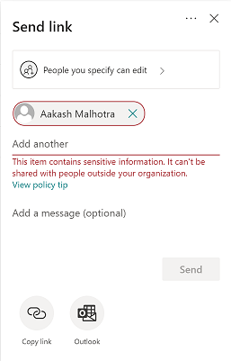

# Защита от потери данных и Microsoft TeamsData loss prevention and Microsoft Teams

Если в организации есть меры по предотвращению потери данных (DLP), можно определить политики, которые мешают людям делиться конфиденциальной информацией в Microsoft Teams канале или сеансе чата.If your organization has data loss prevention (DLP), you can define policies that prevent people from sharing sensitive information in a Microsoft Teams channel or chat session. Вот несколько примеров работы этой защиты.Here are some examples of how this protection works:

- **Пример 1. Защита конфиденциальной информации в сообщениях.****Example 1: Protecting sensitive information in messages**. Предположим, что кто-то пытается поделиться конфиденциальной информацией в Teams чате или канале с гостями (внешними пользователями).Suppose that someone attempts to share sensitive information in a Teams chat or channel with guests (external users). Если для предотвращения этого установлена политика DLP, сообщения с конфиденциальной информацией, которые отправляются внешним пользователям, удаляются.If you have a DLP policy defined to prevent this, messages with sensitive information that are sent to external users are deleted. Это происходит автоматически и в течение нескольких секунд в соответствии с настройкой политики DLP.This happens automatically, and within seconds, according to how your DLP policy is configured.

    > [!NOTE]
    > DLP для Microsoft Teams блокирует конфиденциальный контент при совместном Microsoft Teams пользователями, у которых есть:DLP for Microsoft Teams blocks sensitive content when shared with Microsoft Teams users who have: - [гостевой доступ](/MicrosoftTeams/guest-access) в командах и каналах; или- [guest access](/MicrosoftTeams/guest-access) in teams and channels; or - [внешний доступ](/MicrosoftTeams/manage-external-access) к собраниям и сеансам чата.- [external access](/MicrosoftTeams/manage-external-access) in meetings and chat sessions. 
DLP для внешних сеансов чата будет работать только в том случае, если отправитель и приемник находятся в режиме Teams только и используют Microsoft Teams [федерацию](/microsoftteams/manage-external-access).DLP for external chat sessions will only work if both the sender and the receiver are in Teams Only mode and using [Microsoft Teams native federation](/microsoftteams/manage-external-access). DLP для Teams не блокирует сообщения  в ходе Skype для бизнеса сеансов чата с федеративами.DLP for Teams does not block messages in [interop](/microsoftteams/teams-and-skypeforbusiness-coexistence-and-interoperability#interoperability-of-teams-and-skype-for-business) with Skype for Business or non-native federated chat sessions.

- **Пример 2. Защита конфиденциальной информации в документах.****Example 2: Protecting sensitive information in documents**. Предположим, что кто-то пытается поделиться документом с гостями в Microsoft Teams канале или чате, а документ содержит конфиденциальные сведения.Suppose that someone attempts to share a document with guests in a Microsoft Teams channel or chat, and the document contains sensitive information. Если для предотвращения этого установлена политика DLP, документ не будет открыт для этих пользователей.If you have a DLP policy defined to prevent this, the document won't open for those users. Для применения защиты необходимо, чтобы политика защиты от потери данных включала SharePoint и OneDrive.Your DLP policy must include SharePoint and OneDrive in order for protection to be in place. Это пример DLP для SharePoint, отображаемого в Microsoft Teams, и поэтому требует, чтобы пользователи лицензированы на Office 365 DLP (включены в Office 365 E3), но не требуют лицензии пользователей для Office 365 Advanced Compliance.)This is an example of DLP for SharePoint that shows up in Microsoft Teams, and therefore requires that users are licensed for Office 365 DLP (included in Office 365 E3), but does not require users to be licensed for Office 365 Advanced Compliance.)

## Лицензирование DLP для Microsoft TeamsDLP Licensing for Microsoft Teams

[Возможности предотвращения потери](dlp-learn-about-dlp.md) данных были расширены, чтобы включить Microsoft Teams и сообщения каналов, в том числе сообщения частных **каналов** для:[Data loss prevention](dlp-learn-about-dlp.md) capabilities were extended to include Microsoft Teams chat and channel messages, **including private channel messages** for:

- Office 365 E5/A5Office 365 E5/A5
- Microsoft 365 E5/A5Microsoft 365 E5/A5
- Защита информации и управление данными в Microsoft 365Microsoft 365 Information Protection and Governance
- Office 365 Advanced ComplianceOffice 365 Advanced Compliance

Office 365 и Microsoft 365 E3 включают защиту DLP для SharePoint Online, OneDrive и Exchange Online.Office 365 and Microsoft 365 E3 include DLP protection for SharePoint Online, OneDrive, and Exchange Online. Это также включает файлы, которые Teams, поскольку Teams использует SharePoint Online и OneDrive для общего использования файлов.This also includes files that are shared through Teams because Teams uses SharePoint Online and OneDrive to share files.

Поддержка защиты DLP в Teams чате требует E5.Support for DLP protection in Teams Chat requires E5.

Дополнительные сведения о требованиях к лицензированию см. в статье [Рекомендации по лицензированию служб на уровне клиента Microsoft 365](https://docs.microsoft.com/office365/servicedescriptions/microsoft-365-service-descriptions/microsoft-365-tenantlevel-services-licensing-guidance/microsoft-365-security-compliance-licensing-guidance).To learn more about licensing requirements, see [Microsoft 365 Tenant-Level Services Licensing Guidance](https://docs.microsoft.com/office365/servicedescriptions/microsoft-365-service-descriptions/microsoft-365-tenantlevel-services-licensing-guidance/microsoft-365-security-compliance-licensing-guidance).

> [!IMPORTANT]
> DLP применяется только к фактическим сообщениям в потоке чата или канала.DLP applies only to the actual messages in the chat or channel thread. Уведомления об активности, которые включают краткий предварительный просмотр сообщений и  отображаются на основе параметров уведомлений пользователя, не включаются в Teams DLP.Activity notifications -- which include a short message preview and appear based on a user's notification settings -- are **not** included in Teams DLP. Все конфиденциальные сведения, представленные в части сообщения, которое отображается в предварительном просмотре, будут видны в уведомлении даже после того, как политика DLP была применена и удалена конфиденциальную информацию самого сообщения.Any sensitive information present in the part of the message that appears in the preview will remain visible in the notification even after the DLP policy has been applied and removed sensitive information the message itself.

## Область защиты DLPScope of DLP protection

Защита DLP применяется по-разному к Teams сущностям.DLP protection are applied differently to Teams entities.

|Учетные записи пользователей/группы/списокUser Accounts/Groups/List  |Teams EntityTeams Entity |Доступная защита от DLPDLP protection available|
|---------|---------|---------|
|отдельные учетные записи пользователейindividual user accounts     |1:1/n чаты1:1/n chats         |Даyes         |
|     |общие чатыgeneral chats         |нетno         |
|     |общие каналыshared channels         |нетno         |
|     |частные каналыprivate channels         |Даyes         |
|группы безопасности и списки рассылкиsecurity groups/distribution lists  | 1:1/n чаты1:1/n chats         |Даyes         |
|     |общие чатыgeneral chats         |нетno         |
|     |общие каналыshared channels         |нетno      |
|     |частные каналыprivate channels         |Даyes        |
|Microsoft 365 группыMicrosoft 365 group    |1:1/n чаты1:1/n chats          |нетno         |
|     |общие чатыgeneral chats          |Даyes        |
|     |общие каналыshared channels|Даyes |
|     |частные каналыprivate channels|нетno| 

## Советы по политике помогают обучать пользователейPolicy tips help educate users

Подобно тому, как DLP работает в [Exchange, Outlook, Outlook](data-loss-prevention-policies.md#policy-evaluation-in-exchange-online-outlook-and-outlook-on-the-web)в Интернете, [SharePoint Online, OneDrive для бизнеса](data-loss-prevention-policies.md#policy-evaluation-in-onedrive-for-business-and-sharepoint-online-sites)сайтах и [Office](data-loss-prevention-policies.md#policy-evaluation-in-the-office-desktop-programs)клиенты настольных компьютеров, советы по политике отображаются при запуске действия с политикой DLP.Similar to how DLP works in [Exchange, Outlook, Outlook on the web](data-loss-prevention-policies.md#policy-evaluation-in-exchange-online-outlook-and-outlook-on-the-web), [SharePoint Online, OneDrive for Business sites](data-loss-prevention-policies.md#policy-evaluation-in-onedrive-for-business-and-sharepoint-online-sites), and [Office desktop clients](data-loss-prevention-policies.md#policy-evaluation-in-the-office-desktop-programs), policy tips appear when an action triggers with a DLP policy. Вот пример подсказки политики:Here's an example of a policy tip:

Здесь отправитель попытался поделиться номером социального обеспечения в Microsoft Teams канале.Here, the sender attempted to share a social security number in a Microsoft Teams channel. Ссылка **Что я могу сделать?** открывает диалоговое окно, которое предоставляет варианты для отправитель для решения проблемы.The **What can I do?** link opens a dialog box that provides options for the sender to resolve the issue. Обратите внимание, что отправитель может переопределить политику или уведомить об этом администратора.Notice that, the sender can opt to override the policy, or notify an admin to review and resolve it.

В организации можно разрешить пользователям переопределять политику DLP.In your organization, you can choose to allow users to override a DLP policy. При настройке политик DLP можно использовать советы по политике по умолчанию или настроить советы по политике [для](#to-customize-policy-tips) организации.When you configure your DLP policies, you can use the default policy tips, or [customize policy tips](#to-customize-policy-tips) for your organization.

Возвращаясь к нашему примеру, когда отправитель поделился номером социального обеспечения в канале Teams, вот что увидел получатель:Returning to our example, where a sender shared a social security number in a Teams channel, here's what the recipient saw:

> [!div class="mx-imgBorder"]
> 

### Настройка подсказок политикиTo customize policy tips

Для выполнения этой задачи вам должна быть назначена роль с разрешениями на редактирование политик защиты от потери данных.To perform this task, you must be assigned a role that has permissions to edit DLP policies. Дополнительные сведения см. в статье [Разрешения](data-loss-prevention-policies.md#permissions).To learn more, see [Permissions](data-loss-prevention-policies.md#permissions).

1. Перейдите в Центр соответствия требованиям [https://compliance.microsoft.com](https://compliance.microsoft.com) () и войдите.Go to the Compliance Center ([https://compliance.microsoft.com](https://compliance.microsoft.com)) and sign in.

2. Выберите **Защита от потери данных** > **Политика**.Choose **Data loss prevention** > **Policy**.

3. Выберите политику, а рядом с настройками **политики** выберите **Изменить**.Select a policy, and next to **Policy settings**, choose **Edit**.

4. Создайте новое правило или отредактировать существующее правило для политики.Either create a new rule, or edit an existing rule for the policy.

    > [!div class="mx-imgBorder"]
    > 

5. На **вкладке Уведомления пользователя** выберите **Настройка** текста электронной почты и/или настройка вариантов текста **подсказки** политики.On the **User notifications** tab, select **Customize the email text** and/or **Customize the policy tip text** options.

    > [!div class="mx-imgBorder"]
    >    

6. Укажите текст, который необходимо использовать для уведомлений электронной почты и/или советов по политике, а затем выберите **Сохранить**.Specify the text you want to use for email notifications and/or policy tips, and then choose **Save**.

7. На **вкладке Параметры политики** выберите **Сохранить**.On the **Policy settings** tab, choose **Save**.

Разрешить примерно один час, чтобы изменения работали через центр обработки данных и синхронизируются с учетной записью пользователя.Allow approximately one hour for your changes to work their way through your data center and sync to user accounts.
 <!-- why are these syncing to user accounts? -->

## Добавление Microsoft Teams в качестве расположения к существующим политикам защиты от потери данныхAdd Microsoft Teams as a location to existing DLP policies

Для выполнения этой задачи вам должна быть назначена роль с разрешениями на редактирование политик защиты от потери данных.To perform this task, you must be assigned a role that has permissions to edit DLP policies. Дополнительные сведения см. в статье [Разрешения](data-loss-prevention-policies.md#permissions).To learn more, see [Permissions](data-loss-prevention-policies.md#permissions).

1. Перейдите в Центр соответствия требованиям [https://compliance.microsoft.com](https://compliance.microsoft.com) () и войдите.Go to the Compliance Center ([https://compliance.microsoft.com](https://compliance.microsoft.com)) and sign in.

2. Выберите **Защита от потери данных** > **Политика**.Choose **Data loss prevention** > **Policy**.

3. Выберите политику и посмотрите на значения в **"Расположениях".**Select a policy, and look at the values under **Locations**. Если вы видите **Teams и сообщения каналов,** вы все настроены.If you see **Teams chat and channel messages**, you're all set. Если этого не делать, нажмите кнопку **Изменить**.If you don't, click **Edit**.

    > [!div class="mx-imgBorder"]
    > 

4. В **столбце Состояние** включаем политику для Teams **и сообщений каналов.**In the **Status** column, turn the policy on for **Teams chat and channel messages**.

    > [!div class="mx-imgBorder"]
    > 

5. На **вкладке Выбор расположения** сохраняйте параметр по умолчанию для всех учетных записей или выберите **Позвольте мне выбрать определенные расположения.**On the **Choose locations** tab, keep the default setting of all accounts, or select **Let me choose specific locations**. Можно указать:You can specify:

    1. до 1000 отдельных учетных записей, которые необходимо включить или исключитьup to 1000 individual accounts to include or exclude
    1. списки рассылки и группы безопасности, которые необходимо включить или исключить.distribution lists and security groups to include or exclude. 
    <!-- 1. the shared mailbox of a shared channel. **This is a public preview feature.**--> 
    
6. Затем нажмите кнопку **Далее**.Then choose **Next**.

7. Щелкните **Сохранить**.Click **Save**.

Разрешить примерно один час, чтобы изменения работали через центр обработки данных и синхронизируются с учетной записью пользователя.Allow approximately one hour for your changes to work their way through your data center and sync to user accounts.
<!-- again, why user accounts? -->

## Определение новой политики защиты от потери данных для Microsoft TeamsDefine a new DLP policy for Microsoft Teams

Для выполнения этой задачи вам должна быть назначена роль с разрешениями на редактирование политик защиты от потери данных.To perform this task, you must be assigned a role that has permissions to edit DLP policies. Дополнительные сведения см. в статье [Разрешения](data-loss-prevention-policies.md#permissions).To learn more, see [Permissions](data-loss-prevention-policies.md#permissions).

1. Перейдите в Центр соответствия требованиям [https://compliance.microsoft.com](https://compliance.microsoft.com) () и войдите.Go to the Compliance Center ([https://compliance.microsoft.com](https://compliance.microsoft.com)) and sign in.

2. Выберите **Защита от потери данных** > **Политика** > **Создать политику**.Choose **Data loss prevention** > **Policy** > **+ Create a policy**.

3. Выберите [шаблон,](data-loss-prevention-policies.md#dlp-policy-templates)а затем выберите **Далее**.Choose a [template](data-loss-prevention-policies.md#dlp-policy-templates), and then choose **Next**.

    В нашем примере мы выбрали шаблон персональных данных, идентифицируемый в США.In our example, we chose the U.S. Personally Identifiable Information Data template.

    > [!div class="mx-imgBorder"]
    >  

4. На **вкладке Имя политики** укажите имя и описание политики, а затем выберите **Далее**.On the **Name your policy** tab, specify a name and description for the policy, and then choose **Next**.

5. На **вкладке Выбор расположения** сохраняйте параметр по умолчанию для всех учетных записей или выберите **Позвольте мне выбрать определенные расположения.**On the **Choose locations** tab, keep the default setting of all accounts, or select **Let me choose specific locations**. Можно указать:You can specify:

    1. до 1000 отдельных учетных записей, которые необходимо включить или исключитьup to 1000 individual accounts to include or exclude
    1. списки рассылки и группы безопасности, которые необходимо включить или исключить.distribution lists and security groups to include or exclude. **Это функция предварительного просмотра.****This is a public preview feature.**
    <!-- 1. the shared mailbox of a shared channel. **This is a public preview feature.**-->  

    

    > [!NOTE]
    > Если вы хотите убедиться, что документы, содержащие конфиденциальную информацию,  не будут Teams в Teams, убедитесь, что SharePoint сайты и **OneDrive** учетные записи включены, а также Teams чата и сообщений каналов **.**If you want to make sure documents that contain sensitive information are not shared inappropriately in Teams, make sure **SharePoint sites** and **OneDrive accounts** are turned on, along with **Teams chat and channel messages**.

6. На **вкладке** Параметры политики в статье **Настройка** типа контента, который необходимо защитить, сохраняем простые параметры по умолчанию или выберите **Использование** расширенных параметров, а затем выберите **Далее**.On the **Policy settings** tab, under **Customize the type of content you want to protect**, keep the default simple settings, or choose **Use advanced settings**, and then choose **Next**. Если вы выбираете расширенные параметры, вы можете создать или изменить правила для вашей политики.If you choose advanced settings, you can create or edit rules for your policy. Чтобы получить помощь в этом, [см. в примере Simple settings vs. advanced settings.](data-loss-prevention-policies.md#simple-settings-vs-advanced-settings)To get help with this, see [Simple settings vs. advanced settings](data-loss-prevention-policies.md#simple-settings-vs-advanced-settings).

7.  На **вкладке Параметры** политики в статье Что нужно сделать, если мы обнаруживаем конфиденциальную **информацию?,** просмотрите параметры.On the **Policy settings** tab, under **What do you want to do if we detect sensitive info?**, review the settings. Здесь можно сохранить советы по политике по умолчанию и [уведомления](use-notifications-and-policy-tips.md)электронной почты или настроить их.Here's where you can choose to keep default [policy tips and email notifications](use-notifications-and-policy-tips.md), or customize them.

    > [!div class="mx-imgBorder"]
    > 

    По завершению проверки или редактирования параметров выберите **Далее**.When you're finished reviewing or editing settings, choose **Next**.

8. На  вкладке Параметры политики в статье Вы хотите сначала включить политику или протестировать **ее?** Выберите, включить ли [политику,](dlp-overview-plan-for-dlp.md#policy-deployment)сначала протестировать ее или отключить, а затем выбрать **Далее**.On the **Policy settings** tab, under **Do you want to turn on the policy or test things out first?**, choose whether to turn the policy on, [test it first](dlp-overview-plan-for-dlp.md#policy-deployment), or keep it turned off for now, and then choose **Next**.

    > [!div class="mx-imgBorder"]
    > 

9. На **вкладке Обзор параметров** просмотрите параметры новой политики.On the **Review your settings** tab, review the settings for your new policy. Выберите **Изменить,** чтобы внести изменения.Choose **Edit** to make changes. По завершению выберите **Create**.When you're finished, choose **Create**.

Разрешить примерно один час для новой политики, чтобы работать свой путь через центр обработки данных и синхронизировать с учетной записью пользователя.Allow approximately one hour for your new policy to work its way through your data center and sync to user accounts.

## Запрет внешнего доступа к конфиденциальным документамPrevent external access to sensitive documents

Чтобы убедиться SharePoint документы, содержащие конфиденциальные сведения, не могут быть доступны внешним гостям из SharePoint или Teams по умолчанию, выберите следующее:To ensure that SharePoint documents that contain sensitive information cannot be accessed by external guests either from SharePoint or Teams by default, select the following:

- Вы можете гарантировать, что документы будут защищены до тех пор, пока DLP не сканирует и не пометит их как безопасные для обмена, пометив новые файлы как конфиденциальные [по умолчанию.](/sharepoint/sensitive-by-default)You can ensure that documents are protected until DLP scans and marks them as safe to share by [marking new files as sensitive by default](/sharepoint/sensitive-by-default).

- Рекомендуемая структура политики защиты от потери данныхRecommended DLP policy structure

    - **Conditions****Conditions**
        - Содержимое содержит любой из этих типов конфиденциальной информации: [Выберите все, что применяется]Content contains any of these sensitive information types: [Select all that apply]
        
        - Содержимое совместно Microsoft 365 с людьми за пределами моей организацииContent is shared from Microsoft 365 with people outside my organization
        
          > [!div class="mx-imgBorder"]
          > 

    - **Actions****Actions**
        - Ограничение доступа к содержимому для внешних пользователейRestrict access to the content for external users
        
        - Уведомлять пользователей с помощью сообщения электронной почты и подсказок политикиNotify users with email and policy tips
        
        - Отправлять отчеты об инцидентах администраторуSend incident reports to the Administrator
        
        > [!div class="mx-imgBorder"]
        > 

Политика DLP в действии при попытке поделиться документом в SharePoint, который содержит конфиденциальную информацию с внешним гостем:DLP policy in action when attempting to share a document in SharePoint that contains sensitive information with an external guest:

> [!div class="mx-imgBorder"]
> 

Политика DLP в действии, когда гость пытается открыть документ в Teams с блокировкой внешних:DLP policy in action when guest attempts to open a document in Teams with block external:

> [!div class="mx-imgBorder"]
> 

## Связанные статьиRelated articles

- [Создание, тестирование и настройка политики защиты от потери данныхCreate, test, and tune a DLP policy](create-test-tune-dlp-policy.md)
- [Отправка почтовых уведомлений и отображение подсказок для политик защиты от потери данныхSend email notifications and show policy tips for DLP policies](use-notifications-and-policy-tips.md)
