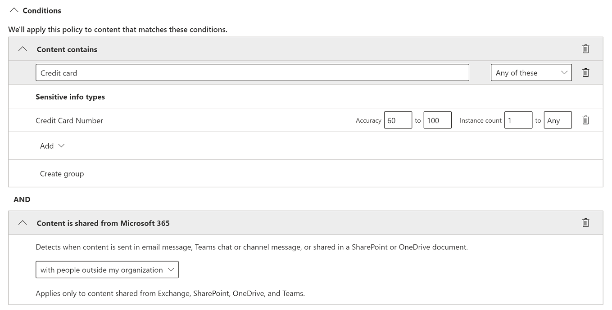

# Предотвращение потери данных и Microsoft Teams

> [!NOTE]
> Недавно возможности предотвращения потери данных были добавлены в чат Microsoft Teams и сообщения каналов для пользователей, лицензированных для Office 365 E5/A5, Microsoft 365 E5/A5, Microsoft 365 Information Protection and Governance или Office 365 Advanced Compliance. Office 365 и Microsoft 365 E3 включают защиту DLP для SharePoint Online, OneDrive и Exchange Online. Это также включает файлы, общие для Teams, так как Teams использует SharePoint Online и OneDrive для обмена файлами.
Поддержка защиты DLP в командной чате требует E5.
Дополнительные сведения о требованиях к лицензированию см. в статье [Рекомендации по лицензированию служб на уровне клиента Microsoft 365](https://docs.microsoft.com/office365/servicedescriptions/microsoft-365-service-descriptions/microsoft-365-tenantlevel-services-licensing-guidance).

## Обзор DLP для Microsoft Teams

Недавно были  расширены возможности по предотвращению потери данных (DLP), включив в него сообщения чата и каналов Microsoft Teams, включая **сообщения частных каналов.**

Если в организации есть DLP, теперь можно определить политики, которые мешают людям делиться конфиденциальной информацией в канале Microsoft Teams или сеансе чата. Вот несколько примеров работы этой защиты.

- **Пример 1. Защита конфиденциальной информации в сообщениях.** Предположим, что кто-то пытается поделиться конфиденциальной информацией в чате Или канале Teams с гостями (внешними пользователями). Если для предотвращения этого установлена политика DLP, сообщения с конфиденциальной информацией, которые отправляются внешним пользователям, удаляются. Это происходит автоматически и в течение нескольких секунд в соответствии с настройкой политики DLP.

    > [!NOTE]
    > DLP для Microsoft Teams блокирует конфиденциальный контент при совместном доступе к пользователям Microsoft Teams, у которых есть: - [гостевой доступ](https://docs.microsoft.com/MicrosoftTeams/guest-access) в командах и каналах; или - [внешний доступ](https://docs.microsoft.com/MicrosoftTeams/manage-external-access) к собраниям и сеансам чата. 
DLP для внешних сеансов чата будет работать только в том случае, если отправитель и приемник находятся в режиме Teams Only и используют [федерацию Microsoft Teams.](https://docs.microsoft.com/microsoftteams/manage-external-access) DLP для Teams не блокирует  сообщения в связи с сеансами чата Skype для бизнеса или некоренных федеративных чатов.

- **Пример 2. Защита конфиденциальной информации в документах.** Предположим, что кто-то пытается поделиться документом с гостями в канале Или чате Microsoft Teams, а документ содержит конфиденциальные сведения. Если для предотвращения этого установлена политика DLP, документ не будет открыт для этих пользователей. Обратите внимание, что в этом случае политика DLP должна включать SharePoint и OneDrive, чтобы обеспечить защиту. (Это пример DLP для SharePoint, который появляется в Microsoft Teams, и поэтому требует, чтобы пользователи лицензированы для DLP Office 365 (включен в Office 365 E3), но не требует лицензии пользователей для Office 365 Advanced Compliance.)

## Советы по политике помогают обучать пользователей

Подобно тому, как DLP работает в [Exchange, Outlook, Outlook](data-loss-prevention-policies.md#policy-evaluation-in-exchange-online-outlook-and-outlook-on-the-web)в [Интернете, SharePoint Online, OneDrive для](data-loss-prevention-policies.md#policy-evaluation-in-onedrive-for-business-and-sharepoint-online-sites)бизнес-сайтов и настольных клиентов [Office,](data-loss-prevention-policies.md#policy-evaluation-in-the-office-desktop-programs)советы по политике появляются при конфликте действий с политикой DLP. Вот пример подсказки политики:

В этом случае отправитель попытался поделиться номером социального обеспечения в канале Microsoft Teams. Ссылка **Что я могу сделать?** открывает диалоговое окно, которое предоставляет варианты для отправитель для решения проблемы. Обратите внимание, что в этом случае отправитель может переопределить политику или уведомить об этом администратора.

В организации можно разрешить пользователям переопределять политику DLP. При настройке политик DLP можно использовать советы по политике по умолчанию или настроить советы по политике [для](#to-customize-policy-tips) организации.

Возвращаясь к нашему примеру, когда отправитель поделился номером социального обеспечения в канале Teams, вот что видел получатель:

Ссылка **What's this?**  открывает статью о политиках DLP, которая помогает объяснить, почему сообщение было заблокировано.

### Настройка советов политики

Для выполнения этой задачи вам должна быть назначена роль, которая имеет разрешения на редактирование политик DLP. Дополнительные сведения см. в статье [Разрешения](data-loss-prevention-policies.md#permissions).

1. Перейдите в Центр & безопасности [https://protection.office.com](https://protection.office.com) () и войдите.

2. Выберите **политику предотвращения**  >  **потери данных.**

3. Выберите политику, а рядом с настройками **политики** выберите **Изменить**.

4. Создайте новое правило или отредактировать существующее правило для политики.  

5. На **вкладке Уведомления пользователя** выберите **Настройка** текста электронной почты и/или настройка вариантов текста **подсказки** политики.    

6. Укажите текст, который необходимо использовать для уведомлений электронной почты и/или советов по политике, а затем выберите **Сохранить**.

7. На **вкладке Параметры политики** выберите **Сохранить**.

Разрешить примерно один час, чтобы изменения работали через центр обработки данных и синхронизируются с учетной записью пользователя.
 <!-- why are these syncing to user accounts? -->

## Добавление Microsoft Teams в качестве расположения к существующим политикам DLP

Для выполнения этой задачи вам должна быть назначена роль, которая имеет разрешения на редактирование политик DLP. Дополнительные сведения см. в статье [Разрешения](data-loss-prevention-policies.md#permissions).

1. Перейдите в Центр & безопасности [https://protection.office.com](https://protection.office.com) () и войдите.

2. Выберите **политику предотвращения**  >  **потери данных.**

3. Выберите политику и посмотрите на значения в **"Расположениях".** Если вы видите **сообщения в чате и канале Teams,** вы все настроены. Если этого не делать, нажмите кнопку **Изменить**.  

4. В **столбце Состояние** включаем политику для **команд чата и сообщений каналов.**  

5. На **вкладке Выбор расположения** сохраняйте параметр по умолчанию для всех учетных записей или выберите **Позвольте мне выбрать определенные расположения.** Можно указать:
    1. до 1000 отдельных учетных записей, которые необходимо включить или исключить
    1. списки рассылки и группы безопасности, которые необходимо включить или исключить. **Это функция предварительного просмотра.**
    <!-- 1. the shared mailbox of a shared channel. **This is a public preview feature.**--> 
    
6. Затем нажмите кнопку **Далее**.

6. Щелкните **Сохранить**.

Разрешить примерно один час, чтобы изменения работали через центр обработки данных и синхронизируются с учетной записью пользователя.
<!-- again, why user accounts? -->

## Определение новой политики DLP для Microsoft Teams

Для выполнения этой задачи вам должна быть назначена роль, которая имеет разрешения на редактирование политик DLP. Дополнительные сведения см. в статье [Разрешения](data-loss-prevention-policies.md#permissions).

1. Перейдите в Центр & безопасности [https://protection.office.com](https://protection.office.com) () и войдите.

2. Выберите **политику предотвращения потери**  >    >  **данных + Создайте политику**.

3. Выберите [шаблон,](data-loss-prevention-policies.md#dlp-policy-templates)а затем выберите **Далее**. В нашем примере мы выбрали шаблон персональных данных, идентифицируемый в США.  

4. На **вкладке Имя политики** укажите имя и описание политики, а затем выберите **Далее**.

5. На **вкладке Выбор расположения** сохраняйте параметр по умолчанию для всех учетных записей или выберите **Позвольте мне выбрать определенные расположения.** Можно указать:
    1. до 1000 отдельных учетных записей, которые необходимо включить или исключить
    1. списки рассылки и группы безопасности, которые необходимо включить или исключить. **Это функция предварительного просмотра.**
    <!-- 1. the shared mailbox of a shared channel. **This is a public preview feature.**-->  

> [!NOTE]
> Чтобы убедиться, что документы, содержащие конфиденциальную информацию, не должны быть размещены в **Teams,** убедитесь, что сайты SharePoint и учетные записи **OneDrive** включены, а также сообщения чата и канала **Teams.**

6. На **вкладке** Параметры политики в статье **Настройка** типа контента, который необходимо защитить, сохраняем простые параметры по умолчанию или выберите **Использование** расширенных параметров, а затем выберите **Далее**. Если вы выбираете расширенные параметры, вы можете создать или изменить правила для вашей политики. (Чтобы получить помощь в этом, [см. в примере Simple settings vs. advanced settings.)](data-loss-prevention-policies.md#simple-settings-vs-advanced-settings)

7.  На **вкладке Параметры** политики в статье Что нужно сделать, если мы обнаруживаем конфиденциальную **информацию?,** просмотрите параметры. (Здесь можно сохранить советы по политике по умолчанию и уведомления электронной почты [или](use-notifications-and-policy-tips.md)настроить их.)  По завершению проверки или редактирования параметров выберите **Далее**.

8. На  вкладке Параметры политики в статье Вы хотите сначала включить политику или протестировать **ее?** Выберите, включить ли [политику,](data-loss-prevention-policies.md#roll-out-dlp-policies-gradually-with-test-mode)сначала протестировать ее или отключить, а затем выбрать **Далее**.  

9. На **вкладке Обзор параметров** просмотрите параметры новой политики. Выберите **Изменить,** чтобы внести изменения. По завершению выберите **Create**.

Разрешить примерно один час для новой политики, чтобы работать свой путь через центр обработки данных и синхронизировать с учетной записью пользователя.

## Предотвращение внешнего доступа к конфиденциальным документам

Чтобы обеспечить доступ внешних гостей из SharePoint или Teams к документам SharePoint, которые содержат конфиденциальную информацию, по умолчанию выберите следующее:

- Вы можете гарантировать, что документы будут защищены до тех пор, пока DLP не сканирует и не пометит их как безопасные для обмена, пометив новые файлы как конфиденциальные [по умолчанию](https://docs.microsoft.com/sharepoint/sensitive-by-default)
- Рекомендуемая структура политики DLP
    - **Conditions**
        - Содержимое содержит любой из этих типов конфиденциальной информации: [Выберите все, что применяется]
        - Содержимое из Microsoft 365 совместно с людьми за пределами моей организации
          

    - **Действия**
        - Ограничение доступа к содержимому для внешних пользователей
        - Оповещать пользователей советами по электронной почте и политике
        - Отправка отчетов об инцидентах администратору    
          

Политика DLP в действии при попытке поделиться документом в SharePoint, который содержит конфиденциальные сведения с внешним гостем:
  

Политика DLP в действии, когда гость пытается открыть документ в Teams с блокировкой внешних:
  

## Статьи по теме

[Создание, тестирование и настройка политики защиты от потери данных](create-test-tune-dlp-policy.md)

[Отправка почтовых уведомлений и отображение подсказок для политик защиты от потери данных](use-notifications-and-policy-tips.md)
