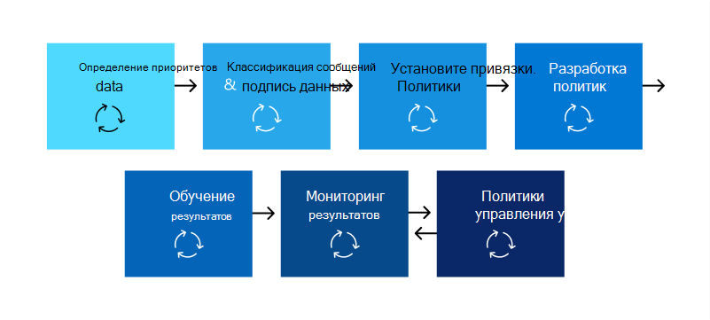

# Планирование предотвращения потери данных (DLP)Plan for data loss prevention (DLP)

Каждая организация будет планировать и внедрять предотвращение потери данных по-разному, так как бизнес-потребности каждой организации, цели, ресурсы и ситуация являются уникальными для них.Every organization will plan for and implement data loss prevention (DLP) differently, because every organization's business needs, goals, resources, and situation are unique to them. Однако существуют элементы, которые являются общими для всех успешных реализаций DLP.However, there are elements that are common to all successful DLP implementations. В этой статье представлены лучшие практики, используемые организациями при планировании DLP.This article presents the best practices that are used by organizations in their DLP planning.

## Несколько отправных точекMultiple starting points

Многие организации предпочитают внедрять DLP в соответствии с различными государственными или отраслевыми нормативными актами.Many organizations choose to implement DLP to comply with various governmental or industry regulations. Например, Общее регулирование защиты данных Европейского союза (GDPR) или Закон о переносе и подотчетности медицинского страхования (HIPAA) или Закон о конфиденциальности потребителей в Калифорнии (CCPA).For example, the European Union's General Data Protection Regulation (GDPR), or the Health Insurance Portability and Accountability Act (HIPAA), or the California Consumer Privacy Act (CCPA). Они также реализуют предотвращение потери данных для защиты своей интеллектуальной собственности.They also implement data loss prevention to protect their intellectual property. Но исходное место и конечный пункт назначения в пути DLP различаются.But the starting place and ultimate destination in the DLP journey vary. 

Организации могут начать свое путешествие по DLP:Organizations can start their DLP journey:

- с фокуса платформы, например для защиты информации в Teams сообщениях чата и канала или на Windows 10 устройствахfrom a platform focus, like wanting to protect information in Teams Chat and Channel messages or on Windows 10 devices
- знать, какую конфиденциальную информацию они хотят приоритизировать для защиты, например записи о медицинской помощи, и ходить непосредственно к определению политик для ее защиты.knowing what sensitive information they want to prioritize protecting, like health care records, and going straight to defining policies to protect it
- не зная, что их конфиденциальная информация, где она находится, и кто делает то, что с ней, чтобы начать с обнаружения и классификации и принять более методический подходwithout knowing what their sensitive information is, where it is, and who is doing what with it so they start with discovery and categorization and take a more methodical approach
- не зная, что их конфиденциальную информацию, где она находится, или кто делает то, что с ней, но они будут двигаться прямо к определению политик и использовать эти результаты в качестве начального места, а затем уточнить свои политики оттудаwithout knowing what their sensitive information is, or where it is, or who is doing what with it, but they will move straight to defining policies and use those outcomes as a starting place and then refine their policies from there
- зная, что им необходимо реализовать полный Microsoft 365 защиты информации и поэтому намерены использовать более долгосрочный методический подходknowing that they need to implement the full Microsoft 365 Information Protection stack and so intend to take a longer term, methodical approach

Это лишь некоторые примеры того, как клиенты могут подходить к DLP, и не важно, с чего вы начинаете, Microsoft 365 DLP достаточно гибка для размещения различных типов путешествий по защите информации от начала до полностью реализованной стратегии предотвращения потери данных.These are just some examples of how customers can approach DLP and it doesn't matter where you start from, Microsoft 365 DLP is flexible enough to accommodate various types of information protection journeys from start to a fully realized data loss prevention strategy. 

## Обзор процесса планированияOverview of planning process

Сведения [о предотвращении потери данных](dlp-learn-about-dlp.md#learn-about-data-loss-prevention) вводят три различных аспекта процесса планирования [DLP.](dlp-learn-about-dlp.md#plan-for-dlp)The [Learn about data loss prevention](dlp-learn-about-dlp.md#learn-about-data-loss-prevention) introduces the three different aspects of the [DLP planning process](dlp-learn-about-dlp.md#plan-for-dlp). Подробнее об элементах, которые являются общими для всех планов DLP.We'll go into more detail here on the elements that are common to all DLP plans.

### Определение круга заинтересованных лицIdentify stakeholders

При реализации политики DLP могут применяться во многих группах организации.When implemented, DLP policies can be applied across large portions of your organization. It can't develop a broad ranging plan on their own without negative consequences.IT can't develop a broad ranging plan on their own without negative consequences. Необходимо определить заинтересованных лиц, которые могут:You need to identify the stakeholders who can:

- описание правил, законов и отраслевых стандартов, на которые может бытьdescribe the regulations, laws, and industry standards your organization is subject to
- категории конфиденциальных элементов, которые необходимо защититьthe categories of sensitive items to be protected
- бизнес-процессы, вthe business processes they are used in
- рискованное поведение, которое должно быть ограниченоthe risky behavior that should be limited
- приоритизовать, какие данные следует защищать в первую очередь на основе чувствительности элементов и связанных с этим рисковprioritize which data should be protected first based on the sensitivity of the items and risk involved
- наметить процесс проверки и устранения событий, описанных в политике DLPoutline the DLP policy match event review and remediation process 
 
В целом эти потребности, как правило, 85% нормативных требований и защиты соответствия требованиям и 15% защиты интеллектуальной собственности.In general these needs tend to be 85% regulatory and compliance protection, and 15% intellectual property protection. Вот несколько предложений по ролям, которые необходимо включить в процесс планирования:Here are some suggestions on roles to include in your planning process:

- Сотрудники по регулированию и соблюдению требованийRegulatory and compliance officers
- Главный сотрудник по рискамChief risk officer
- ЮристыLegal officers
- Сотрудники служб безопасности и соответствия требованиямSecurity and compliance officers
- Владельцы бизнеса для элементов данныхBusiness owners for the data items
- Бизнес-пользователиBusiness users
- ИТ-отделIT

### Описание категорий конфиденциальной информации для защитыDescribe the categories of sensitive information to protect

Затем заинтересованные стороны описывают категории конфиденциальной информации, которые необходимо защитить, и бизнес-процесс, в который они используются.The stakeholders then describe the categories of sensitive information to be protected and the business process that they're used in. Например, Microsoft 365 DLP определяет эти категории:For example, Microsoft 365 DLP defines these categories:

- ФинансыFinancial 
- Медицинские и медицинские сведенияMedical and health information
- КонфиденциальностьPrivacy
- ПользовательскиеCustom

Заинтересованные стороны могут идентифицировать конфиденциальную информацию как "Мы обработчик данных, поэтому мы должны реализовать защиту конфиденциальности в информации субъекта данных и финансовой информации".The stakeholders might identify the sensitive information as "We are a data processor, so we have to implement privacy protections on data subject information and financial information".

 
  <!-- The business process is important as it informs the ‘data at rest’, ‘data in transit’, ‘data in use’ aspect of DLP planning and who should be sharing the items and who should not.-->

### Настройка целей и стратегииSet goals and strategy

После того как вы определили заинтересованных лиц и знаете, какая конфиденциальную информацию нуждается в защите и где она используется, заинтересованные стороны могут установить свои цели защиты, а ИТ-компании могут разработать план реализации.Once you have identified your stakeholders and you know which sensitive information needs protection and where it's used, the stakeholders can set their protection goals and IT can develop an implementation plan. 

 <!--
### Discovery
 for the locations (DLP workloads) of these types of items.  (mapping DLP locations and data at rest, data in transit, data in use)

### IT can start coding test policies
start small and always in test mode. Note that DLP policies can feed into insider risk.

### Business process owners help with tuning
 false positive/false negative results and fitting DLP into their business processes.

-->

### Настройка плана реализацииSet implementation plan

План реализации должен включать:Your implementation plan should include:

- Сопоставление начального состояния и желаемого состояния и действий для получения от одного к другомуMapping out your starting state and desired end state and the steps to get from one to the other
- решение проблемы обнаружения конфиденциальных элементовhow you will address discovery of sensitive items
- планирование политики и порядок их реализацииpolicy planning and the order that they will be implemented
- решение любых необходимых условийhow you will address any prerequisites
- планирование проверки политик перед переходом на правоприменителиplanning on how policies will first be tested before moving to enforcement
- обучение конечных пользователейhow you will train your end users
- проверка и настройка политикhow you will test and tune your policies
- анализ и обновление стратегии предотвращения потери данных на основе изменения нормативных, правовых, отраслевых стандартов или защиты интеллектуальной собственности и потребностей бизнесаhow you will review and update your data loss prevention strategy based on changing regulatory, legal, industry standard or intellectual property protection and business needs

#### На карте путь от начала до нужного состоянияMap out path from start to desired end state

Документировать, как ваша организация будет получать от начального состояния до нужного состояния, имеет важное значение для общения с заинтересованными сторонами и настройки области проекта.Documenting how your organization is going to get from its starting state to the desired end state is essential to communicating with your stakeholders and setting the project scope. Вот набор действий, которые обычно используются для развертывания DLP.Here is a set of steps that are commonly used to deploy DLP. Вам нужно больше деталей, но вы можете использовать это, чтобы обрамить путь принятия DLP.You'll want more detail than this, but you can use this to frame your DLP adoption path.

#### Обнаружение чувствительных элементовSensitive item discovery

Существует несколько способов узнать, что такое отдельные конфиденциальные элементы и где они находятся.There are multiple ways to discover what individual sensitive items are and where they are located. Возможно, у вас уже развернуты метки конфиденциальности или вы, возможно, решили развернуть широкую политику DLP во всех расположениях, которые только обнаруживают и проверяют элементы.You may have sensitivity labels already deployed or you may have decided to deploy a broad DLP policy to all locations that only discovers and audits items. Дополнительные сведения см. в ["Знать свои данные".](information-protection.md#know-your-data)To learn more, see [Know your data](information-protection.md#know-your-data).

#### Планирование политикиPolicy planning

При начале внедрения DLP вы можете использовать эти вопросы, чтобы сосредоточиться на разработке и реализации политики.As you begin your DLP adoption, you can use these questions to focus your policy design and implementation efforts.

##### Какие законы, правила и отраслевые стандарты должна выполнять ваша организация?What laws, regulations and industry standards must your organization comply with?

Поскольку многие организации приходят в DLP с целью соблюдения нормативных требований, ответ на этот вопрос является естественным начальным местом для планирования реализации DLP.Because many organizations come to DLP with the goal of regulatory compliance, answering this question is a natural starting place for planning your DLP implementation. Но, как ИТ-реализации, вы, вероятно, не в состоянии ответить на него.But, as the IT implementer, you're probably not positioned to answer it. На него должны отвечать юристы и руководители бизнеса.It needs to be answered by your legal team and business executives. 
 
**Пример** Ваша организация подчиняется Великобритании.**Example** Your organization is subject to U.K. финансовые правила.financial regulations.

##### Какие конфиденциальные элементы должны быть защищены от утечки?What sensitive items does your organization have that must be protected from leakage?

После того как организация узнает, где она находится с точки зрения требований к нормативным требованиям, у вас будет некоторое представление о том, какие конфиденциальные элементы необходимо защитить от утечки, и как вы хотите приоритизировать реализацию политики для их защиты.Once your organization knows where it stands in terms of regulatory compliance needs, you'll have some idea of what sensitive items need to be protected from leakage and how you want to prioritize policy implementation to protect them. Это поможет выбрать наиболее подходящие шаблоны политики DLP.This will help you choose the most appropriate DLP policy templates. Microsoft 365 поставляется с предварительно настроенными шаблонами DLP для финансовых, медицинских и медицинских учреждений, конфиденциальности, и вы можете создавать свои собственные с помощью настраиваемого шаблона.Microsoft 365 comes with pre-configured DLP templates for Financial, Medical and health, Privacy, and you can build your own using the Custom template. При разработке и создании фактических политик DLP знание ответа на этот вопрос также поможет выбрать нужный [тип конфиденциальной информации.](sensitive-information-type-learn-about.md#learn-about-sensitive-information-types)As you design and create your actual DLP policies, knowing the answer to this question will also help you choose the right [sensitive information type](sensitive-information-type-learn-about.md#learn-about-sensitive-information-types).

**Пример** Чтобы быстро начать работу, выберите шаблон политики, который `U.K. Financial Data` включает `Credit Card Number` типы конфиденциальной `EU Debit Card Number` информации. `SWIFT Code`**Example** To get started quickly, you pick the `U.K. Financial Data` policy template, which includes the `Credit Card Number`, `EU Debit Card Number`, and `SWIFT Code` sensitive information types. 

##### Где находятся конфиденциальные элементы и в каких бизнес-процессах они участвуют?Where are the sensitive items and what business processes are they involved in?

Элементы, содержащие конфиденциальные сведения организации, используются каждый день в процессе ведения бизнеса.The items that contain your organizations sensitive information are used every day in the course of doing business. Необходимо знать, где могут возникать экземпляры этих конфиденциальных сведений и в каких бизнес-процессах они используются.You need to know where instances of that sensitive information may occur and what business processes they are used in. Это поможет вам выбрать правильные расположения для применения политик DLP.This will help you choose the right locations to apply your DLP policies to. Microsoft 365 Политики DLP применяются к расположениям:Microsoft 365 DLP policies are applied to locations:

- Электронная почта ExchangeExchange email
- Сайты SharePointSharePoint sites
- Учетные записи OneDriveOneDrive accounts
- Сообщения в чатах и каналах TeamsTeams chat and channel messages
- Windows 10 УстройстваWindows 10 Devices
- Microsoft Cloud App SecurityMicrosoft Cloud App Security
- Репозитории локальногоOn-premises repositories

**Пример** Внутренние аудиторы организации отслеживают набор номеров кредитных карт.**Example** Your organizations' internal auditors are tracking a set of credit card numbers. Они держат их таблицу в защищенной SharePoint сайте.They keep a spreadsheet of them in a secure SharePoint site. Некоторые сотрудники делают копии и сэкономят их на OneDrive для бизнеса сайте, синхронизируются с Windows 10 устройства.Several of the employees make copies and save them to their work OneDrive for Business site, which is synced to their Windows 10 device. Один из них вклеит список из 14 из них в электронной почте и пытается отправить его внешним аудиторам для проверки.One of them pastes a list of 14 of them in an email and tries to send it to the outside auditors for review. Необходимо применить политику к безопасному сайту SharePoint, всем внутренним аудиторам, OneDrive для бизнеса учетным записям, их Windows 10 устройствам и Exchange электронной почте.You'd want to apply the policy to the secure SharePoint site, all the internal auditors OneDrive for Business accounts, their Windows 10 devices, and Exchange email.

##### Какова толерантность организаций к утечке?What is your organizations tolerance for leakage?

Различные группы в организации могут иметь различные представления о допустимом уровне утечки конфиденциальных элементов, а о том, что нет.Different groups in your organization may have different views on what's an acceptable level of sensitive item leakage and what's not. Достижение совершенства нулевой утечки может привести к слишком высокой стоимости для бизнеса.Achieving the perfection of zero leakage may come at too high a cost to the business.

**Пример** Группа безопасности организации, а также группа юристов считают, что не следует делиться номерами кредитных карт с кем-либо за пределами организации и настаивать на нулевой утечке.**Example** Your organizations' security group, along with the legal team both feel that there should be no sharing of credit card numbers with anyone outside the org and insist on zero leakage. Но в рамках регулярного анализа активности номеров кредитных карт внутренние аудиторы должны делиться некоторыми номерами кредитных карт с сторонними аудиторами.But, as part of regular review of credit card number activity, the internal auditors must share some credit card numbers with third-party auditors. Если политика DLP запрещает все совместное использование номеров кредитных карт за пределами организации, это может повеять значительные нарушения бизнес-процессов и дополнительные затраты для смягчения нарушения, чтобы внутренние аудиторы завершили отслеживание.If your DLP policy prohibits all sharing of credit card numbers outside the org, there will be a significant business process disruption and added cost to mitigate the disruption in order for the internal auditors to complete their tracking. Эти дополнительные затраты недопустимы для исполнительного руководства.This extra cost is unacceptable to the executive leadership. Чтобы решить эту проблему, необходимо внутренний разговор, чтобы определить допустимый уровень утечки.To resolve this, there needs to be an internal conversation to decide an acceptable level of leakage. После этого политика может предоставлять исключения для определенных лиц для обмена информацией или ее можно применять только в режиме аудита.Once that is decided the policy can provide exceptions for certain individuals to share the information or it can be applied in audit only mode.

#### Планирование необходимых условийPlanning for prerequisites

Прежде чем отслеживать некоторые расположения DLP, необходимо найти необходимые условия.Before you can monitor some DLP locations, there are prerequisites that must be met. См. **разделЫ Перед началом** работы:See the **Before you begin** sections of:

- [Начало работы с локальным сканером для защиты от потери данных (предварительная версия)Get started with the data loss prevention on-premises scanner (preview)](dlp-on-premises-scanner-get-started.md#before-you-begin)
- [Начало работы с функцией защиты от потери данных в конечной точкеGet started with Endpoint data loss prevention](endpoint-dlp-getting-started.md#before-you-begin)
- [Начало работы с расширением соответствия требованиям Майкрософт (предварительный просмотр)Get started with the Microsoft compliance extension (preview)](dlp-chrome-get-started.md#before-you-begin)
- [Используйте политики предотвращения потери данных для облачных приложений, не в microsoft (предварительный просмотр)Use data loss prevention policies for non-Microsoft cloud apps (preview)](dlp-use-policies-non-microsoft-cloud-apps.md#before-you-begin)

#### Развертывание политикиPolicy deployment

При создании политик защиты от потери данных следует внедрять их постепенно, чтобы оценить их влияние и эффективность перед полноценным развертыванием.When you create your DLP policies, you should consider rolling them out gradually to assess their impact and test their effectiveness before fully enforcing them. Например, не нужно, чтобы новая политика DLP непреднамеренно блокировала доступ к тысячам документов или нарушала существующий бизнес-процесс.For example, you don't want a new DLP policy to unintentionally block access to thousands of documents or to break an existing business process.
  
При создании политик защиты от потери данных с потенциально мощным влиянием рекомендуется выполнить указанные ниже действия.If you're creating DLP policies with a large potential impact, we recommend following this sequence:
  
1. **Начните работу в тестовом режиме без подсказок политики**, а затем оцените влияние политики с помощью отчетов системы защиты от потери данных и отчетов об инцидентах.**Start in test mode without Policy Tips** and then use the DLP reports and any incident reports to assess the impact. В них содержатся сведения о количестве, расположении, типе и серьезности совпадений.You can use DLP reports to view the number, location, type, and severity of policy matches. На основе результатов можно настроить политики по мере необходимости.Based on the results, you can fine-tune the policies as needed. В тестовом режиме политики защиты от потери данных не влияют на производительность сотрудников вашей организации.In test mode, DLP policies will not impact the productivity of people working in your organization. Кроме того, используйте этот этап для проверки рабочего процесса для проверки событий DLP и устранения проблем.Also, use this stage to test out your workflow for DLP event review and issue remediation.
    
2. **Переходить** в режим Test с помощью уведомлений и Советы, чтобы можно было начать обучать пользователей политикам соответствия требованиям и готовить их к политикам, которые будут применяться.**Move to Test mode with notifications and Policy Tips** so that you can begin to teach users about your compliance policies and prepare them for the policies that are going to be applied. Полезно иметь ссылку на страницу политики организации, которая содержит дополнительные сведения о политике в совете политики.It's useful to have a link to an organization policy page that provides more details about the policy in the policy tip. На данном этапе вы также можете попросить пользователей сообщать о ложных срабатывах, чтобы можно было дополнительно уточнить политики.At this stage, you can also ask users to report false positives so that you can further refine the policies. Переходить к этому этапу, если у вас есть уверенность в том, что результаты приложения политики совпадают с тем, что они имели в виду.Move to this stage once you have confidence that the results of policy application match what they stakeholders had in mind. 
    
3. **Начните применять политики в полном объеме**, чтобы защищать контент с помощью действий, заданных в правилах.**Start full enforcement on the policies** so that the actions in the rules are applied and the content's protected. Продолжайте отслеживать отчеты системы защиты от потери данных и все отчеты об инцидентах или уведомления, чтобы убедиться в соответствии результатов вашим потребностям.Continue to monitor the DLP reports and any incident reports or notifications to make sure that the results are what you intend. 

    

    Вы можете в любой момент отключить политику защиты от потери данных. При этом будут отключены все правила в политике.You can turn off a DLP policy at any time, which affects all rules in the policy. Тем не менее каждое правило можно отключить отдельно от других, переключив его состояние в редакторе правил.However, each rule can also be turned off individually by toggling its status in the rule editor.

    

    Вы также можете изменить приоритет нескольких правил в политике.You can also change the priority of multiple rules in a policy. Чтобы сделать это, откройте политику для редактирования.To do that, open a policy for editing. В строке правила щелкните многоточие (**...**) и выберите один из вариантов, например **Переместить вниз** или **Поместить в конец**.In a row for a rule, choose the ellipses (**...**), and then choose an option, such as **Move down** or **Bring to last**.

    

#### Обучение конечных пользователейEnd-user training

При запуске политики DLP можно настроить политики для отправки уведомлений электронной почты и демонстрации советов по политикам [DLP](use-notifications-and-policy-tips.md#send-email-notifications-and-show-policy-tips-for-dlp-policies) для администраторов и конечных пользователей.When a DLP policy is triggered, you can configure your policies to [Send email notifications and show policy tips for DLP policies](use-notifications-and-policy-tips.md#send-email-notifications-and-show-policy-tips-for-dlp-policies) to admins and end users. В то время как политики по-прежнему находятся в тестовом режиме и до того, как они будут настроены на принудительное выполнение блокирующих действий, советы по политике являются полезными способами повышения осведомленности о рискованных действиях в отношении конфиденциальных элементов и обучения пользователей, чтобы избежать такого поведения в будущем.While your policies are still in test mode and before they are set to enforce a blocking action, policy tips are useful ways to raise awareness of risky behaviors on sensitive items and train users to avoid those behaviors in the future.  

#### Просмотр требований к DLP и стратегия обновленияReview DLP requirements and update strategy

Нормативные акты, законы и отраслевые стандарты, под которые может быть вменяться ваша организация, со временем изменятся, и ваши бизнес-цели для DLP также изменятся.The regulations, laws, and industry standards that your organization is subject to will change over time and your business goals for DLP will too. Обязательно включите регулярные обзоры всех этих областей, чтобы ваша организация оставалась в соответствии с требованиям, а реализация DLP-решений по-прежнему отвечает вашим бизнес-потребностям.Be sure to include regular reviews of all these areas so that your organization stays in compliance and your DLP implementation continues to meet your business needs.

## Подходы к развертываниюApproaches to deployment

|Описание бизнес-клиентовCustomer business needs description  | подходapproach  |
|---------|---------|
|**Contoso Bank** находится в высокорегулируемой отрасли и имеет множество различных типов конфиденциальных элементов в разных расположениях.**Contoso Bank** is in a highly regulated industry and has  many different types of sensitive items in many different locations.   — знает, какие типы конфиденциальной информации являются приоритетными.- knows which types of sensitive information are top priority.   - необходимо минимизировать сбои в работе по мере отката политик.- must minimize business disruption as policies are rolled out.   — имеет ИТ-ресурсы и может нанять экспертов для планирования и развертывания разработки-  has IT resources and can hire experts to help plan, design deploy   — имеет контракт на премьерную поддержку с Корпорацией Майкрософт- has a premier support contract with Microsoft| - Найми время, чтобы понять, какие правила они должны соблюдать и как они будут соблюдаться.- Take the time to understand what regulations they must comply with and how they are going to comply.   -Найми время, чтобы понять лучшее совместное значение стека Microsoft 365 защиты информации-Take the time to understand the better together value of the Microsoft 365 Information Protection stack   - Разработка схемы маркировки конфиденциальности для приоритетных элементов и применение- Develop sensitivity labeling scheme for prioritized items and apply   - Привлечение владельцев бизнес-процессов- Involve business process owners  - Политики разработки и кода, развертывание в тестовом режиме, обучение пользователей- Design/code policies, deploy in test mode, train users  - повторите- repeat|
|**Игрушки TailSpin** не знают, что у них есть и где они есть, и не имеют практически никакой глубины ресурсов.**TailSpin Toys** doesn’t know what they have or where it is, and have little to no resource depth. Они широко Teams, OneDrive для бизнеса и Exchange.They use Teams, OneDrive for Business and Exchange extensively.     |- Начните с простых политик в приоритетных расположениях.- Start with simple policies on the prioritized locations.  - Отслеживайте, что выявляется- Monitor what gets identified  - Соответствующим образом нанесите метки конфиденциальности- Apply sensitivity labels accordingly  - Уточнение политик, обучение пользователей- Refine policies, train users       |
|**Fabrikam —** это небольшой стартап, который хочет защитить свою интеллектуальную собственность и должен быстро двигаться.**Fabrikam** is a small startup and wants to protect its intellectual property, and must move quickly. Они готовы посвятить некоторые ресурсы, но не могут позволить себе нанять внешних экспертов.They are willing to dedicate some resources, but can't afford to hire outside experts.  - Конфиденциальные элементы находятся в Microsoft 365 OneDrive для бизнеса/SharePoint- Sensitive items are all in Microsoft 365 OneDrive for Business/SharePoint  - Внедрение OneDrive для бизнеса и SharePoint медленно, сотрудники/теневые ИТ-службы используют DropBox и Диск Google для обмена и хранения элементов- Adoption of OneDrive for Business and SharePoint is slow, employees/shadow IT use DropBox and Google drive to share/store items  - Сотрудники ценят скорость работы над дисциплиной защиты данных- Employees value speed of work over data protection discipline  - Клиент splurged и купил все 18 сотрудников новых Windows 10 устройств- Customer splurged and bought all 18 employees new Windows 10 devices     |- Воспользоваться политикой DLP по умолчанию в Teams- Take advantage of the default DLP policy in Teams  - Использование ограниченных по умолчанию параметров для SharePoint элементов- Use restricted by default setting for SharePoint items  - Развертывание политик, которые препятствуют внешнему обмену- Deploy policies that prevent external sharing  - Развертывание политик в приоритетных расположениях- Deploy policies to prioritized locations  — Развертывание политик на Windows 10 устройствах- Deploy policies to Windows 10 devices  - Блокировка загрузки в облачное хранилище OneDrive для бизнеса, не OneDrive для бизнеса.- Block uploads to non-OneDrive for Business cloud storage      |

<!--

## Planning for workloads

### Exchange

### SharePoint

### OneDrive for Business

### Teams

### Windows 10 Devices

### Microsoft Cloud App Security (MCAS)

### On-premises Scanner
-->

## См. такжеSee also
- [Сведения о защите от потери данныхLearn about data loss prevention](dlp-learn-about-dlp.md#learn-about-data-loss-prevention)
