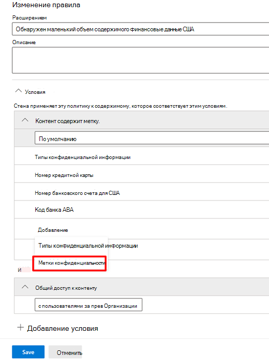

# Использование меток конфиденциальности в качестве условия в политиках защиты от потери данных (предварительная версия)

Использование [меток конфиденциальности](sensitivity-labels.md) в качестве условия в политиках защиты от потери данных для указанных ниже расположений.

- Сообщения электронной почты Exchange Online
- SharePoint Online
- Сайты OneDrive для бизнеса
- Устройства с Windows 10

Метки конфиденциальности отображаются в качестве варианта в списке **Контент содержит**.

> [!div class="mx-imgBorder"]
> 

> [!IMPORTANT]
> **Метки конфиденциальности** как условие будут недоступны, если вы выделили **чат и сообщения канала Teams **в качестве расположения, где необходимо применить политику защиты от потери данных.

## Поддерживаемые элементы, сценарии и подсказки политик

Метки чувствительности можно использовать в качестве условий для этих элементов и в таких сценариях.

### Поддерживаемые элементы

|Служба  |Тип элемента  |Доступно для подсказки политики  |Применимо  |
|---------|---------|---------|---------|
|Exchange    |сообщение электронной почты         |да         |да         |
|Exchange    |вложение электронной почты         |Нет         |Нет         |
|SharePoint Online     |элементы в SharePoint Online         |да         |да         |
|OneDrive для бизнеса     |элементы         |да         |да         |
|Teams     |Teams и сообщения в каналах         |неприменимо         |неприменимо         |
|Teams     |вложения         |да         |да         |
|Устройства с Windows 10 (предварительная версия)     |элементы         |да         |да         |
|МКАС (предварительная версия) |элементы         |да         |да         |

Поддерживается обнаружение защитой от потери данных \* меток конфиденциальности на сообщениях электронной почты. Обнаружение защитой от потери данных вложений с метками конфиденциальности не поддерживается.

\** Вложения, отправленные в Teams через личный чат или каналы, автоматически добавляются в OneDrive для бизнеса и SharePoint. Таким образом, если SharePoint Online или OneDrive для бизнеса включены в качестве расположений в политику защиты от потери данных, вложения с метками, отправленные в Teams, автоматически включаются в область действия этого условия. В политике защиты от потери данных Teams не обязательно выбирать в качестве расположения.

### Поддерживаемые сценарии

- Администратор защиты от потери данных сможет видеть в клиенте список всех меток конфиденциальности, если включит одну или несколько меток конфиденциальности в качестве условия.

- Использование меток конфиденциальности в качестве условия поддерживается во всех рабочих нагрузках, как указано в приведенной выше матрице поддержки.

- Подсказки политики защиты от потери данных будут по-прежнему отображаться для рабочих нагрузок (за исключением Outlook Win32) для тех политик защиты от потери данных, в которых есть метка конфиденциальности в качестве условия.

- Метки конфиденциальности также появляются в сообщении электронной почты с отчетом об инциденте в случае совпадения с политикой защиты от потери данных с меткой конфиденциальности в качестве условия.

- Кроме того, подробности о метке конфиденциальности также отобразятся в журнале аудита соответствия правилам защиты от потери данных в случае совпадения с политикой защиты от потери данных, которая содержит пометку в качестве условия.

### Подсказки политики поддержки

|Рабочая нагрузка  |Подсказки политики поддерживаются / не поддерживаются  |
|---------|---------|
|OWA |    поддерживается     |
|Outlook Win 32    |  не поддерживается       |
|SharePoint   |   поддерживается      |
|OneDrive для бизнеса    |    поддерживается     |
|устройства конечных точек   |  не поддерживается       |
