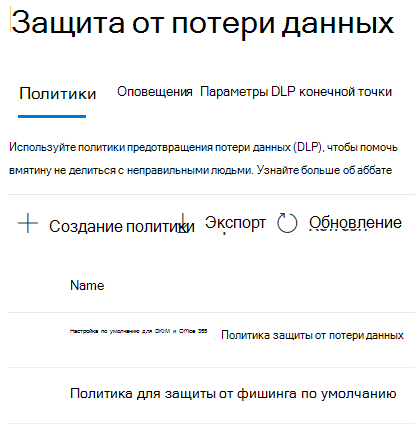

# Сведения о политике предотвращения потери данных по умолчанию в Microsoft Teams (предварительный просмотр)

[Возможности по предотвращению](data-loss-prevention-policies.md) потери данных (DLP) расширены, включив сообщения чатов и каналов Microsoft Teams, включая сообщения частных каналов. В рамках этого выпуска мы создали политику DLP по умолчанию для первых клиентов центра соответствия требованиям.

## Область применения

Любой клиент, который имеет лицензию с одной или более ниже лицензий и имеет активных пользователей Teams
 
- ME5, 
- MA5, 
- Соответствие требованиям E5/A5, 
- IP+G, 
- OE5, 
- O365 Advanced Compliance 
- EMS E5

## Что делает политика по умолчанию?

Политика DLP по умолчанию отслеживает все номера кредитных карт, общие внутри организации и внешне. Эта политика по умолчанию для всех пользователей клиента. Он не создает никаких советов по политике для конечных пользователей, но создает событие Оповещения, а также вызывает сообщение с низкой степенью серьезности администратору (добавлено в политику). Администратор может просматривать действия и изменять сведения о политиках, входя в центр соответствия требованиям.

Администраторы могут просматривать эту политику на странице [>](https://compliance.microsoft.com/compliancesettings) политики защиты от потери данных.

> [!div class="mx-imgBorder"]
> 

## Изменение или удаление политики по умолчанию

Чтобы [изменить политику по умолчанию для улучшения](create-test-tune-dlp-policy.md#tune-a-dlp-policy)производительности или удалить ее, просто используйте учетную запись с разрешениями управления соответствием требованиям **DLP.** Дополнительные сведения см. в ["Разрешениях".](create-test-tune-dlp-policy.md#permissions)

