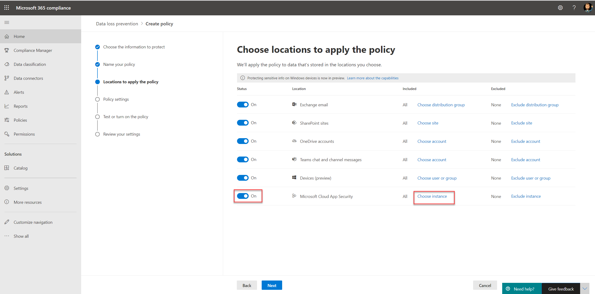

# Используйте политики предотвращения потери данных для облачных приложений, не в microsoft (предварительный просмотр)

Политики предотвращения потери данных (DLP) для не microsoft cloud apps являются частью пакета функций Microsoft 365 DLP; С помощью этих функций можно обнаружить и защитить конфиденциальные элементы в Microsoft 365 службах. Дополнительные сведения обо всех предложениях Microsoft DLP см. в дополнительных сведениях [о предотвращении потери данных.](dlp-learn-about-dlp.md)

Политики DLP можно использовать в облачных приложениях, не в microsoft, для мониторинга и обнаружения использования конфиденциальных элементов и их общего использования с помощью облачных приложений, не в microsoft. Использование этих политик обеспечивает видимость и контроль, необходимые для обеспечения правильного использования и защиты этих политик, а также позволяет предотвратить рискованное поведение, которое может привести к их угрозе.

## Прежде чем начать

### Лицензирование SKU/подписки

Прежде чем приступить к использованию политик DLP в облачных приложениях, [не в](https://www.microsoft.com/microsoft-365/compare-microsoft-365-enterprise-plans?rtc=1) microsoft, Microsoft 365 подписку и все надстройки. Чтобы получить доступ к этой функции и использовать ее, необходимо иметь одну из этих подписок или надстройок:

- Microsoft 365 E5
- Соответствие требованиям Microsoft 365 E5
- Безопасность Microsoft 365 E5

### Подготовка среды Cloud App Security

Политики DLP для не microsoft cloud apps используют Cloud App Security DLP. Чтобы использовать его, необходимо подготовить Cloud App Security среду. Инструкции см. в [инструкции Set instant visibility, protection and governance actions for your apps.](/cloud-app-security/getting-started-with-cloud-app-security#step-1-set-instant-visibility-protection-and-governance-actions-for-your-apps)

### Подключение облачное приложение, не в microsoft

Чтобы использовать политику DLP в определенном облачном приложении, не связанном с Microsoft, приложение должно быть подключено к Cloud App Security. Дополнительные сведения см. в указанных ниже статьях.

- [Подключение Box](/cloud-app-security/connect-box-to-microsoft-cloud-app-security)
- [Подключение Dropbox](/cloud-app-security/connect-dropbox-to-microsoft-cloud-app-security)
- [Подключение G-Suite](/cloud-app-security/connect-google-apps-to-microsoft-cloud-app-security)
- [Подключение Salesforce](/cloud-app-security/connect-salesforce-to-microsoft-cloud-app-security)
- [Подключение Cisco Webex](/cloud-app-security/connect-webex-to-microsoft-cloud-app-security)

После подключения облачных приложений к Cloud App Security можно создать Microsoft 365 DLP-политики для них.

> [!NOTE]
> Кроме того, можно использовать Microsoft Cloud App Security для создания политик DLP в облачных приложениях Майкрософт. Однако рекомендуется использовать Microsoft 365 для создания и управления политиками DLP в облачных приложениях Майкрософт.

## Создание политики DLP в облачном приложении, не в microsoft

При выборе расположения для политики DLP включаем Microsoft Cloud App Security **расположение.**

- Чтобы выбрать определенное приложение или экземпляр, выберите **выберите экземпляр .**
- Если экземпляр не выбран, политика использует все подключенные приложения в Microsoft Cloud App Security клиенте.

   

   

Вы можете выбрать различные действия для каждого поддерживаемого облачного приложения, не в microsoft. Для каждого приложения существуют различные возможные действия (зависит от API облачного приложения).

При создании правила в политике DLP можно выбрать действие для не microsoft cloud apps. Чтобы ограничить сторонние приложения, выберите **Ограничение сторонних приложений.**

> [ПРИМЕЧАНИЕ] Политики DLP, применяемые к приложениям, не относя к Майкрософт, Microsoft Cloud App Security. После создания политики DLP для приложения, не включаемого в Корпорацию Майкрософт, в Microsoft Cloud App Security.

Сведения о создании и настройке политик DLP см. в таблице [Create test and tune a DLP policy.](./create-test-tune-dlp-policy.md)

## См. также

- [Создание тестирования и настройка политики DLP](./create-test-tune-dlp-policy.md)
- [Начало работы со стандартной политикой защиты от потери данных](./get-started-with-the-default-dlp-policy.md)
- [Создание политики защиты от потери данных на основе шаблона](./create-a-dlp-policy-from-a-template.md)
