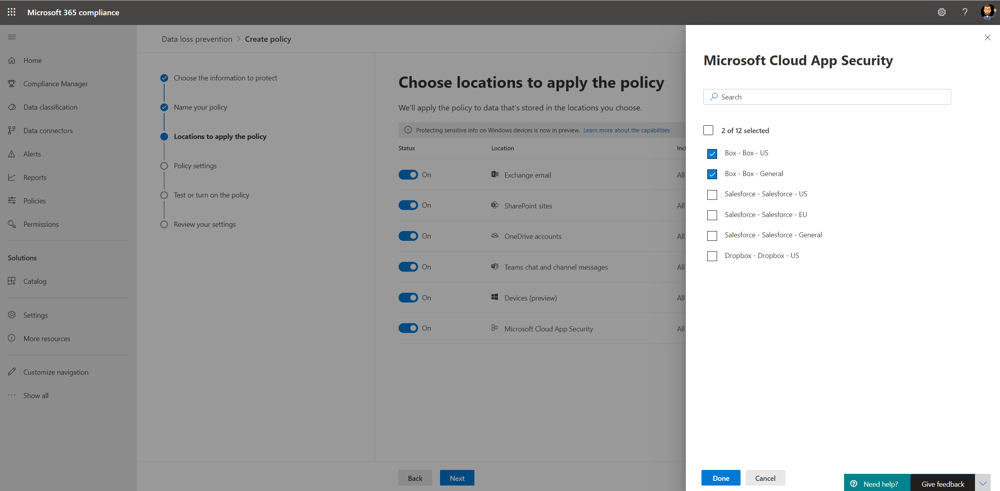

# Использование политик защиты от потери данных для облачных приложений не от Майкрософт (Предварительная версия)

Политики защиты от потери данных (DLP) для облачных приложений, отличных от Майкрософт, входят в состав набора функций Microsoft 365 DLP; с помощью этих функций можно обнаруживать конфиденциальные элементы в службах Microsoft 365 и защищать их. Для получения дополнительных сведений о всех возможностях системы защиты от потери данных (Майкрософт) обратитесь к разделу [Обзор защиты от потери данных](https://docs.microsoft.com/microsoft-365/compliance/data-loss-prevention-policies?view=o365-worldwide).

Политики защиты от потери данных можно использовать в облачных приложениях сторонних производителей для отслеживания и обнаружения использования конфиденциальных элементов и совместного использования облачных приложений не от Майкрософт. Использование этих политик обеспечивает видимость и контроль, необходимые для того, чтобы убедиться, что они правильно используются и защищены, и помогает предотвратить опасные функции, которые могут нарушить их безопасность.

## Прежде чем начать

### Лицензирование SKU/подписки

Прежде чем приступать к использованию политик защиты от потери данных в облачных приложениях, отличных от Майкрософт, подтвердите вашу [подписку на Microsoft 365](https://www.microsoft.com/microsoft-365/compare-microsoft-365-enterprise-plans?rtc=1) и все надстройки. Чтобы получить доступ к этой функции и использовать ее, необходима одна из следующих подписок или надстроек:

- Microsoft 365 E5
- Соответствие требованиям Microsoft 365 E5
- Безопасность Microsoft 365 E5

### Подготовка среды Cloud App Security

Политики защиты от потери данных в облачных приложениях, отличных от Майкрософт, используют возможности Cloud App Security DLP. Чтобы использовать ее, необходимо подготовить среду Cloud App Security. Инструкции: [Set иснтант Visibility, Protection и Action управления для ваших приложений](https://docs.microsoft.com/cloud-app-security/getting-started-with-cloud-app-security#step-1-set-instant-visibility-protection-and-governance-actions-for-your-apps).

### Подключение облачного приложения, не относящегося к корпорации Майкрософт

Чтобы использовать политику защиты от потери данных для конкретного облачного приложения, отличного от Майкрософт, приложение должно быть подключено к Cloud App Security. Дополнительные сведения см. в указанных ниже статьях.

- [Поле подключения](https://docs.microsoft.com/cloud-app-security/connect-box-to-microsoft-cloud-app-security)
- [Подключение к Dropbox](https://docs.microsoft.com/cloud-app-security/connect-dropbox-to-microsoft-cloud-app-security)
- [Подключение G – Suite](https://docs.microsoft.com/cloud-app-security/connect-google-apps-to-microsoft-cloud-app-security)
- [Подключение Salesforce](https://docs.microsoft.com/cloud-app-security/connect-salesforce-to-microsoft-cloud-app-security)
- [Подключение Cisco Вебекс](https://docs.microsoft.com/cloud-app-security/connect-webex-to-microsoft-cloud-app-security)

После подключения облачных приложений к Cloud App Security вы можете создать для них политики защиты от потери данных Microsoft 365.

>[!NOTE]
>Кроме того, можно использовать Microsoft Cloud App Security для создания политик защиты от потери данных в облачных приложениях Майкрософт. Тем не менее, рекомендуется использовать Microsoft 365 для создания политик защиты от потери данных и управления ими в облачных приложениях Майкрософт.

## Создание политики защиты от потери данных для облачного приложения, отличного от Майкрософт

При выборе расположения для политики защиты от потери данных включите расположение **Microsoft Cloud App Security** .

- Чтобы выбрать конкретное приложение или экземпляр, выберите **выбрать экземпляр**.
- Если вы не выбираете экземпляр, политика использует все подключенные приложения в вашем клиенте Cloud App Security (Майкрософт).

   

   

Вы можете выбрать различные действия для каждого поддерживаемого облачного приложения, не относящегося к корпорации Майкрософт. Для каждого приложения возможны различные действия (зависит от приложения Cloud App API).

Когда вы создаете правило в политике защиты от потери данных, вы можете выбрать действие для облачных приложений, не относящихся к корпорации Майкрософт. Чтобы ограничить сторонние приложения, выберите пункт **ограничить приложения сторонних производителей**.

Сведения о создании и настройке политик защиты от потери данных можно найти [в статье Create Test и Настройка политики DLP](https://docs.microsoft.com/microsoft-365/compliance/create-test-tune-dlp-policy?view=o365-worldwide).

## См. также

- [Создание теста и Настройка политики DLP](https://docs.microsoft.com/microsoft-365/compliance/create-test-tune-dlp-policy?view=o365-worldwide)
- [Начало работы со стандартной политикой защиты от потери данных](https://docs.microsoft.com/microsoft-365/compliance/get-started-with-the-default-dlp-policy?view=o365-worldwide)
- [Создание политики защиты от потери данных на основе шаблона](https://docs.microsoft.com/microsoft-365/compliance/create-a-dlp-policy-from-a-template?view=o365-worldwide)
