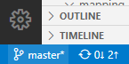

# <a name="double-key-encryption-for-microsoft-365"></a>Шифрование с двойным ключом для Microsoft 365

> *Применимо к: шифрование с двойным ключом для Microsoft 365, [соответствие требованиям Microsoft 365,](https://www.microsoft.com/microsoft-365/business/compliance-management) [Azure Information Protection](https://azure.microsoft.com/pricing/details/information-protection)*
>
> *Инструкции по: клиент [унифицированных меток Azure Information Protection для Windows](https://docs.microsoft.com/azure/information-protection/faqs#whats-the-difference-between-the-azure-information-protection-classic-and-unified-labeling-clients)*
>
> *Описание службы: [соответствие требованиям Microsoft 365](https://docs.microsoft.com/office365/servicedescriptions/microsoft-365-service-descriptions/microsoft-365-tenantlevel-services-licensing-guidance/microsoft-365-security-compliance-licensing-guidance)*

При двойном шифровании ключей (DKE) для доступа к защищенного контенту используются два ключа. Корпорация Майкрософт сохраняет один ключ в Microsoft Azure, а вы сохраняете другой ключ. Вы сохраняете полный контроль над одним из ключей с помощью службы шифрования двойного ключа. Вы применяйте защиту с помощью клиента унифицированных меток Azure Information Protection к вашему содержимому с высокой конфиденциальной информацией.

Шифрование с двойным ключом поддерживает как облачные, так и локальное развертывания. Эти развертывания помогают гарантировать, что зашифрованные данные остаются непрозрачными, где бы вы ни хранили защищенные данные.

Дополнительные сведения о корневых ключах клиента по умолчанию, основанных на облаке, см. в сведениях о планировании и реализации ключа клиента [Azure Information Protection.](https://docs.microsoft.com/azure/information-protection/plan-implement-tenant-key)

## <a name="when-your-organization-should-adopt-dke"></a>Когда вашей организации следует использовать DKE

Шифрование с двойным ключом предназначено для наиболее конфиденциальных данных, которые подчиняются самым строгим требованиям защиты. DKE не предназначен для всех данных. В общем, вы будете использовать двойное шифрование ключей для защиты только небольшой части ваших общих данных. Прежде чем развертывать это решение, необходимо тщательно определить нужные данные. В некоторых случаях может потребоваться сузить область действия и использовать другие решения для большинства данных, например Microsoft Information Protection с ключами под управлением Майкрософт или BYOK. Этих решений достаточно для документов, которые не подвергаются усиленной защите и нормативным требованиям. Кроме того, эти решения позволяют использовать самые мощные службы Office 365; службы, которые нельзя использовать с зашифрованным DKE-содержимым. Например:

- Правила транспорта, включая вредоносные программы и спам, для которых требуется видимость вложения
- Microsoft Delve
- Обнаружение электронных данных
- Поиск и индексация контента
- Office Web Apps, включая функции совместного разработки

Любые внешние приложения или службы, не интегрированные с DKE через MIP SDK, не смогут выполнять действия с зашифрованными данными.

Microsoft Information Protection SDK 1.7+ поддерживает двойное шифрование ключей; приложения, интегрируемые с нашим SDK, смогут просить эти данные с достаточными разрешениями и интеграцией.

Мы рекомендуем организациям использовать возможности Microsoft Information Protection (классификацию и маркировку) для защиты большей части конфиденциальных данных и использовать DKE только для критически важных данных. Шифрование с двойным ключом особенно важно для очень конфиденциальных данных в строго регулируемых отраслях, таких как финансовые услуги и здравоохранения.

Если у вашей организации есть какие-либо из следующих требований, вы можете использовать DKE для защиты контента:

- Необходимо обеспечить возможность  расшифровки защищенного контента только при любых обстоятельствах.
- Корпорация Майкрософт не должна иметь доступ к защищенным данным самостоятельно.
- У вас есть нормативные требования для удержания ключей в пределах географической границы. Все ключи, которые вы сохраняете для шифрования и расшифровки данных, сохраняются в центре обработки данных.

## <a name="system-and-licensing-requirements-for-dke"></a>Требования к системе и лицензированию для DKE

**Шифрование с помощью двойного ключа для Microsoft 365** поставляется с Microsoft 365 E5. Если у вас нет лицензии на Microsoft 365 E5, вы можете зарегистрироваться для получения пробной [лицензии.](https://aka.ms/M365E5ComplianceTrial) Дополнительные сведения об этих лицензиях см. в руководстве по лицензированию [Microsoft 365 для](https://docs.microsoft.com/office365/servicedescriptions/microsoft-365-service-descriptions/microsoft-365-tenantlevel-services-licensing-guidance/microsoft-365-security-compliance-licensing-guidance)обеспечения соответствия & безопасности.

**Azure Information Protection.** DKE работает с метами конфиденциальности и требует Azure Information Protection.

Метки конфиденциальности DKE доступны конечным пользователям с помощью ленты конфиденциальности в классических приложениях Office. Установите эти необходимые условия на каждый клиентский компьютер, где необходимо защитить и использовать защищенные документы.

**Microsoft Office приложения для предприятий** версии *.12711 или более поздней (классические версии Word, PowerPoint и Excel) в Windows.

**Клиент единой метки Azure Information Protection** версии 2.7.93.0 или более поздней. Скачайте и установите клиент единой метки из [Центра загрузки Майкрософт.](https://www.microsoft.com/download/details.aspx?id=53018)

## <a name="supported-environments-for-storing-and-viewing-dke-protected-content"></a>Поддерживаемые среды для хранения и просмотра контента, защищенного dKE

**Поддерживаемые приложения.** [Приложения Microsoft 365 для корпоративных](https://www.microsoft.com/microsoft-365/business/microsoft-365-apps-for-enterprise-product) клиентов в Windows, включая Word, Excel и PowerPoint.

**Поддержка интернет-содержимого.** Поддерживаются документы и файлы, хранимые в Интернете в Microsoft SharePoint и OneDrive для бизнеса. Вы можете обмениваться зашифрованным содержимым по электронной почте, но не можете просматривать зашифрованные документы и файлы в Интернете. Вместо этого необходимо просматривать защищенный контент с помощью классических приложений на локальном компьютере.

## <a name="overview-of-deploying-dke"></a>Обзор развертывания DKE

Чтобы настроить DKE, выполните следующие общие действия. После завершения этих действий конечные пользователи смогут защитить ваши высоко конфиденциальные данные с помощью шифрования с помощью двойного ключа.

1. Развернем службу DKE, как описано в этой статье.

2. Создайте метку с шифрованием с помощью двойного ключа. Перейдите к информационной защите в [Центре соответствия требованиям Microsoft 365](https://compliance.microsoft.com) и создайте новую метку с двойным шифрованием ключа. См. ["Ограничение доступа к содержимому с помощью меток конфиденциальности для применения шифрования".](https://docs.microsoft.com/microsoft-365/compliance/encryption-sensitivity-labels)

3. Используйте метки двойного шифрования ключей. Защитите данные, выбрав метку "Шифрование с двойным ключом" на ленте "Конфиденциальность" в Microsoft Office.

Существует несколько способов выполнения некоторых действий по развертыванию шифрования с двойным ключом. В этой статье данная статья содержит подробные инструкции по успешному развертыванию службы менее опытных администраторов. Если вы хорошо это делаете, вы можете использовать собственные методы.

## <a name="deploy-dke"></a>Развертывание DKE

В этой статье и видео о развертывании используется Azure в качестве места развертывания для службы DKE. Если развертывание разворачивается в другом расположении, необходимо предоставить собственные значения.

Просмотрите [видео о](https://youtu.be/vDWfHN_kygg) развертывании двойного шифрования ключей, чтобы просмотреть пошаговой обзор концепций, которые данная статья представляет. Видео занимает около 18 минут.

Чтобы настроить шифрование с помощью двойного ключа в организации, выполните следующие общие действия.

1. [Установка необходимого программного обеспечения для службы DKE](#install-software-prerequisites-for-the-dke-service)
1. [Клонирование репозитория GitHub с двойным ключом](#clone-the-dke-github-repository)
1. [Изменение параметров приложения](#modify-application-settings)
1. [Создание тестовых ключей](#generate-test-keys)
1. [Построение проекта](#build-the-project)
1. [Развертывание службы DKE и публикация хранилище ключей](#deploy-the-dke-service-and-publish-the-key-store)
1. [Проверка развертывания](#validate-your-deployment)
1. [Регистрация хранилище ключей](#register-your-key-store)
1. [Создание меток конфиденциальности с помощью DKE](#create-sensitivity-labels-using-dke)
1. [Включить DKE в клиенте](#enable-dke-in-your-client)
1. [Перенос защищенных файлов из меток HYOK в метки DKE](#migrate-protected-files-from-hyok-labels-to-dke-labels)

После этого вы сможете шифровать документы и файлы с помощью DKE. Сведения см. в [подмене меток конфиденциальности к файлам и электронной почте в Office.](https://support.microsoft.com/office/2f96e7cd-d5a4-403b-8bd7-4cc636bae0f9)

### <a name="install-software-prerequisites-for-the-dke-service"></a>Установка необходимого программного обеспечения для службы DKE

Установите эти необходимые условия на компьютере, на котором необходимо установить службу DKE.

**.NET Core 3.1 SDK.** Скачайте и установите SDK из [.NET Core 3.1.](https://dotnet.microsoft.com/download/dotnet-core/3.1)

**Visual Studio code**. Скачайте Visual Studio кода [https://code.visualstudio.com/](https://code.visualstudio.com) из . После установки запустите Visual Studio Code  и выберите \> **"Расширения представления".** Установите эти расширения.

- C# для Visual Studio code

- NuGet диспетчер пакетов

**Ресурсы Git.** Скачайте и установите один из следующих скачать и установить.

- [Git](https://git-scm.com/downloads)

- [Рабочий стол GitHub](https://desktop.github.com/)

- [GitHub Enterprise](https://github.com/enterprise)

**OpenSSL** После развертывания DKE необходимо установить [OpenSSL](https://slproweb.com/products/Win32OpenSSL.html) для [создания](#generate-test-keys) тестовых ключей. Убедитесь, что вы правильно направите его из пути к переменным среды. Например, дополнительные сведения см. в подстроке "Добавление каталога установки в [https://www.osradar.com/install-openssl-windows/](https://www.osradar.com/install-openssl-windows/) path".

### <a name="clone-the-dke-github-repository"></a>Клонирование репозитория DKE GitHub

Корпорация Майкрософт обеспечивает исходные файлы DKE в репозитории GitHub. Репозиторий клонирован для локальной сборки проекта для использования в организации. Репозиторий DKE GitHub находится по адресу [https://github.com/Azure-Samples/DoubleKeyEncryptionService](https://github.com/Azure-Samples/DoubleKeyEncryptionService) .

Следующие инструкции предназначены для пользователей git или Visual Studio кода:

1. В браузере перейдите [https://github.com/Azure-Samples/DoubleKeyEncryptionService](https://github.com/Azure-Samples/DoubleKeyEncryptionService) к:

2. Справа от экрана выберите **"Код".** В вашей версии пользовательского интерфейса может быть кнопка **клонирования или скачивания.** Затем в отображимомся dropdown выберите значок копирования, чтобы скопировать URL-адрес в буфер обмена.

    Например:

   

3. В Visual Studio кода выберите **"Просмотреть** \> **палитру команд"** и выберите **Git: Клонировать.** Чтобы перейти к параметру в списке, начните вводить текст для фильтрации записей, а затем выберите его в `git: clone` выпадаемом списке. Например:

   

4. В текстовом поле вите URL-адрес, скопированный из Git, и выберите **"Клонировать" в GitHub.**

5. В **отображемом** диалоговом окке "Выбор папки" найдите и выберите расположение для хранения репозитория. В запросе выберите **"Открыть".**

    Репозиторий откроется в Visual Studio Code и отобразит текущую ветвь Git в левом нижнем конце. Ветвь должна быть **хозяином.**

    Например:

   

6. Выберите в **списке ветвей** слово "master".

   > [!IMPORTANT]
   > Выбор ветвей master гарантирует, что у вас есть правильные файлы для построения проекта. Если не выбрать правильную ветвь, развертывание не будет работать.

Теперь исходный репозиторий DKE настроен локально. Затем [измените параметры приложений](#modify-application-settings) для организации.

### <a name="modify-application-settings"></a>Изменение параметров приложения

Чтобы развернуть службу DKE, необходимо изменить следующие типы параметров приложений:

- [Параметры доступа к ключам](#key-access-settings)
- [Параметры клиента и ключа](#tenant-and-key-settings)

Параметры приложения в файле appsettings.jsв файле. Этот файл находится в репо-службе DoubleKeyEncryptionService, клонированной локально в хранилище DoubleKeyEncryptionService\src\customer-key-store. Например, в Visual Studio Code можно просмотреть файл, как показано на следующем рисунке.


#### <a name="key-access-settings"></a>Параметры доступа к ключам

Выберите, следует ли использовать авторизацию электронной почты или роли. DKE поддерживает только один из этих методов проверки подлинности одновременно.

- **Авторизация электронной почты.** Позволяет организации авторизовать доступ к ключам только на основе адресов электронной почты.

- **Авторизация ролей.** Позволяет организации авторизировать доступ к ключам на основе групп Active Directory и требует, чтобы веб-служба запросит LDAP.

**Настройка параметров доступа к ключам для DKE с помощью авторизации электронной почты**

1. Откройте файл **appsettings.jsфайле** и найдите `AuthorizedEmailAddress` параметр.

2. Добавьте адрес электронной почты или адреса, которые вы хотите авторизовать. Разделять несколько адресов электронной почты двойными кавычками и запятой. Например:

   ```json
   "AuthorizedEmailAddress": ["email1@company.com", "email2@company.com ", "email3@company.com"]
   ```

3. Найдите `LDAPPath` параметр и удалите текст между `If you use role authorization (AuthorizedRoles) then this is the LDAP path.` двойными кавычками. Оставьте двойные кавычка на месте. После завершения настройки параметр должен выглядеть так:

   ```json
   "LDAPPath": ""
   ```

4. Найдите `AuthorizedRoles` параметр и удалите всю строку.

На этом рисунке показан **appsettings.jsфайла,** правильно отформатированный для авторизации электронной почты.

   

**Установка параметров доступа к ключам для DKE с помощью авторизации ролей**

1. Откройте файл **appsettings.jsфайле** и найдите `AuthorizedRoles` параметр.

2. Добавьте имена групп Active Directory, которые нужно авторизировать. Разделять несколько имен групп двойными кавычками и запятой. Например:

   ```json
   "AuthorizedRoles": ["group1", "group2", "group3"]
   ```

3. Найдите `LDAPPath` параметр и добавьте домен Active Directory. Например:

   ```json
   "LDAPPath": "contoso.com"
   ```

4. Найдите `AuthorizedEmailAddress` параметр и удалите всю строку.

На этом изображении **показанappsettings.jsфайла,** правильно отформатированный для авторизации роли.

   

#### <a name="tenant-and-key-settings"></a>Параметры клиента и ключа

Параметры клиента DKE и ключей находятся вappsettings.js **в файле.**

**Настройка параметров клиента и ключей для DKE**

1. Откройте файл **appsettings.jsфайла.**

2. Найдите `ValidIssuers` параметр и `<tenantid>` замените его на свой ИД клиента. Чтобы найти свой ИД клиента, перейдите на портал Azure и просматривайте [свойства клиента.](https://aad.portal.azure.com/#blade/Microsoft_AAD_IAM/ActiveDirectoryMenuBlade/Properties) Например:

   ```json
   "ValidIssuers": [
     "https://sts.windows.net/9c99431e-b513-44be-a7d9-e7b500002d4b/"
   ]
   ```

Найдите `JwtAudience` . Замените имя хоста компьютера, на котором будет работать служба `<yourhostname>` DKE. Например:

  > [!IMPORTANT]
  > Значение должно `JwtAudience` точно совпадать с именем вашего *хоста.* Во время **отладки можно использовать localhost:5001.** Однако после отладки обязательно обновите это значение до имени хоста сервера.

- `TestKeys:Name`. Введите имя ключа. Пример: `TestKey1`
- `TestKeys:Id`. Создайте GUID и введите его в качестве `TestKeys:ID` значения. Например, `DCE1CC21-FF9B-4424-8FF4-9914BD19A1BE`. Вы можете использовать такой сайт, как [online GUID Generator,](https://guidgenerator.com/) для случайного создания GUID.

На этом рисунке показан правильный формат параметров клиента и ключей вappsettings.js **в.** `LDAPPath` настроена для авторизации роли.


### <a name="generate-test-keys"></a>Создание тестовых ключей

После определения параметров приложения можно создать открытые и закрытые тестовые ключи.

Для создания ключей:

1. В меню "Пуск" Windows запустите командную подсказку OpenSSL.

2. Измените папку, в которой нужно сохранить тестовые ключи. Файлы, которые создаются при выполнении действий в этой задаче, хранятся в той же папке.

3. Создание нового тестового ключа.

   ```dos
   openssl req -x509 -newkey rsa:2048 -keyout key.pem -out cert.pem -days 365
   ```

4. Создание закрытого ключа.

   ```dos
   openssl rsa -in key.pem -out privkeynopass.pem
   ```

5. Создание открытого ключа.

   ```dos
   openssl rsa -in key.pem -pubout > pubkeyonly.pem
   ```

6. В текстовом редакторе откройте **pubkeyonly.pem.** Скопируйте все содержимое файла **pubkeyonly.pem,** кроме первой и последней строк, в раздел файлаappsettings.js`PublicPem` **файла.**

7. В текстовом редакторе откройте **privkeynopass.pem.** Скопируйте все содержимое файла **privkeynopass.pem,** кроме первой и последней строк, в разделappsettings.js`PrivatePem` **файла.**

8. Удалите все пустые пробелы и новые линии как в разделах, `PublicPem` так и в `PrivatePem` разделах.

    > [!IMPORTANT]
    > При копировании этого содержимого не удаляйте данные PEM.

9. В Visual Studio Code перейдите к **Startup.cs** файла. Этот файл находится в репонете DoubleKeyEncryptionService, клонированном локально в папке DoubleKeyEncryptionService\src\customer-key-store\.

10. Найдите следующие строки:

   ```c#
        #if USE_TEST_KEYS
        #error !!!!!!!!!!!!!!!!!!!!!! Use of test keys is only supported for testing,
        DO NOT USE FOR PRODUCTION !!!!!!!!!!!!!!!!!!!!!!!!!!!!!
        services.AddSingleton<ippw.IKeyStore, ippw.TestKeyStore>();
        #endif
   ```

11. Замените эти строки следующим текстом:

   ```csharp
   services.AddSingleton<ippw.IKeyStore, ippw.TestKeyStore>();
   ```

   Конечные результаты должны выглядеть примерно так:

   

Теперь вы готовы к созданию [проекта DKE.](#build-the-project)

### <a name="build-the-project"></a>Построение проекта

Используйте следующие инструкции для локальной сборки проекта DKE:

1. В Visual Studio Code в репозитории службы DKE выберите "Просмотреть  палитру команд" и введите \>  **сборку** в командной подсказке.

2. В списке выберите **"Задачи: выполнить задачу сборки".**

   Если задачи сборки не найдены, выберите "Настроить задачу **построения"** и создайте ее для .NET Core следующим образом.

   

   1. Choose **Create tasks.json from template**.

      

   2. В списке типов шаблонов выберите **.NET Core.**

      

   3. В разделе сборки найдите путь к **файлу customerkeystore.csproj.** Если его там нет, добавьте следующую строку:

      ```json
      "${workspaceFolder}/src/customer-key-store/customerkeystore.csproj",
      ```

   4. Запустите сборку еще раз.

3. Убедитесь, что в окне вывода нет красных ошибок.

   Если имеются красные ошибки, проверьте выходные данные консоли. Убедитесь, что все предыдущие действия выполнены правильно, и присутствуют правильные версии сборки.

4. Выберите  \> **"Запустить отладку при** запуске", чтобы отладить процесс. Если вам будет предложено выбрать среду, выберите **.NET core.**

Основной отладок .NET обычно запускается в `https://localhost:5001` . Чтобы просмотреть тестовый ключ, перейдите к косой черте (/) и к имени `https://localhost:5001` ключа. Например:

```https
https://localhost:5001/TestKey1
```

Ключ должен отображаться в формате JSON.

Настройка завершена. Перед публикацией магазина ключей в appsettings.jsв параметре JwtAudience убедитесь, что значение имени хоста точно совпадает с именем вашего хоста службы приложений. Возможно, вы изменили его на localhost для устранения неполадок сборки.

### <a name="deploy-the-dke-service-and-publish-the-key-store"></a>Развертывание службы DKE и публикация хранилище ключей

В производственных развертываниях развернем службу в стороном облаке или опубликуем в [локальной системе.](https://docs.microsoft.com/aspnet/core/tutorials/publish-to-iis?view=aspnetcore-3.1&preserve-view=true&tabs=netcore-cli)

Для развертывания ключей можно использовать другие методы. Выберите метод, который лучше всего работает в вашей организации.

Для пилотных развертывание можно развернуть в Azure и сразу начать работу.

**Создание экземпляра Azure Web App для размещения развертывания DKE**

Чтобы опубликовать хранилище ключей, необходимо создать экземпляр службы приложений Azure для размещения развертывания DKE. Затем опубликуйте созданные ключи в Azure.

1. В браузере войдите на портал [Microsoft Azure](https://ms.portal.azure.com)и перейдите в app **Services**  >  **Add.**

2. Выберите подписку и группу ресурсов и определите сведения об экземпляре.

    - Введите имя хоста компьютера, на который необходимо установить службу DKE. Убедитесь, что оно такое же, как и имя, определенное для параметра JwtAudience в файлеappsettings.js [**on.**](#tenant-and-key-settings) Значение, которое вы предоставляете для имени, также является WebAppInstanceName.

    - Для **публикации,** выбора **кода** и стека **времени работы** выберите **.NET Core 3.1**.

    Например:

   

3. At the bottom of the page, select **Review + create**, and then select **Add**.

4. Чтобы опубликовать созданные ключи, сделайте одно из следующих:

    - [Публикация с помощью ZipDeployUI](#publish-via-zipdeployui)
    - [Публикация с помощью FTP](#publish-via-ftp)
    - [Публикация через Visual Studio 2019 или более поздней](https://docs.microsoft.com/aspnet/core/tutorials/)

#### <a name="publish-via-zipdeployui"></a>Публикация с помощью ZipDeployUI

1. Перейдите на сайт `https://<WebAppInstanceName>.scm.azurewebsites.net/ZipDeployUI`.

    Пример: https://dkeservice.scm.azurewebsites.net/ZipDeployUI

2. В базе кода для хранилищ ключей перейдите в папку **customer-key-store\src\customer-key-store** и убедитесь, что эта папка содержит файл **customerkeystore.csproj.**

3. Run: **dotnet publish**

     В окне вывода отображается каталог, в котором была развернута публикация.

    Пример: `customer-key-store\src\customer-key-store\bin\Debug\netcoreapp3.1\publish\`

4. Отправьте все файлы в каталоге публикации в ZIP-файл. При создании ZIP-файла убедитесь, что все файлы в каталоге находятся на корневом уровне ZIP-файла.

5. Перетащите ZIP-файл, который вы создали, на сайт ZipDeployUI, который вы открыли выше. Пример: https://dkeservice.scm.azurewebsites.net/ZipDeployUI

DKE развернут, и вы можете просмотреть созданные тестовые ключи. Продолжайте [проверку развертывания ниже.](#validate-your-deployment)

#### <a name="publish-via-ftp"></a>Публикация с помощью FTP

1. Подключите службу приложений, созданную [выше.](#deploy-the-dke-service-and-publish-the-key-store)

    В браузере перейдите на информационную **панель FTP** центра развертывания служб приложений портала  >    >    >    >    >  Azure.

2. Скопируйте строки подключения, отображаемую в локальный файл. Эти строки используются для подключения к службе Web App и отправки файлов через FTP.

    Например:

   

3. В базе кода для хранилища ключей перейдите в каталог хранилища ключей **клиента\src\customer-key-store.**

4. Убедитесь, что этот каталог содержит **файл customerkeystore.csproj.**

5. Run: **dotnet publish**

    Выходные данные содержат каталог, в котором была развернута публикация.

    Пример: `customer-key-store\src\customer-key-store\bin\Debug\netcoreapp3.1\publish\`

6. Отправьте все файлы в каталоге публикации в ZIP-файл. При создании ZIP-файла убедитесь, что все файлы в каталоге находятся на корневом уровне ZIP-файла.

7. В FTP-клиенте используйте сведения о подключении, скопированные для подключения к службе приложений. Загрузите ZIP-файл, созданный на предыдущем шаге, в корневой каталог веб-приложения.

DKE развернут, и вы можете просмотреть созданные тестовые ключи. Затем проверьте [развертывание.](#validate-your-deployment)

### <a name="validate-your-deployment"></a>Проверка развертывания

После развертывания DKE с помощью одного из описанных выше методов проверьте развертывание и параметры хранения ключей.

Запустите:

src\customer-key-store\scripts\key_store_tester.ps1 dkeserviceurl/mykey

Например:

key_store_tester.ps1 https://mydkeservice.com/mykey

Убедитесь, что в выходных данных не отображаются ошибки. Когда вы будете готовы, [зарегистрируйте хранилище ключей.](#register-your-key-store)

## <a name="register-your-key-store"></a>Регистрация хранилище ключей

Следующие действия позволяют зарегистрировать службу DKE. Регистрация службы DKE — это последний шаг в развертывании DKE, прежде чем можно будет приступить к созданию меток.

Чтобы зарегистрировать службу DKE:

1. В браузере откройте портал [Microsoft Azure](https://ms.portal.azure.com/)и перейдите на сайт **"Регистрация** приложений для идентификации всех \>  \> **служб".**

2. Выберите **новую регистрацию** и введите осмысленное имя.

3. Выберите тип учетной записи из отображаемого параметра.

    Если вы используете Microsoft Azure с нестандартным доменом, например **onmicrosoft.com,** выберите "Учетные записи" только в этом каталоге организации (только microsoft **— один клиент).**

    Например:

   

4. В нижней части страницы выберите **"Регистрация",** чтобы создать новую регистрацию приложений.

5. In your new App Registration, in the left pane, under **Manage,** select **Authentication**.

6. Выберите **"Добавить платформу".**

7. Во **всплываемом окке "Настройка платформ"** выберите **"Интернет".**

8. В **URI перенаправления** введите URI службы шифрования с двойным ключом. Введите URL-адрес службы приложений, включая имя и домен хоста.

    Пример: https://mydkeservicetest.com

    - Введите URL-адрес, который должен соответствовать имени хоста, в котором развернута служба DKE.
    - Если вы тестируете локально с помощью Visual Studio, используйте **https://localhost:5001** .
    - Во всех случаях схема должна иметь **https.**

    Убедитесь, что имя хоста точно соответствует имени вашего хоста службы приложений. Возможно, вы изменили его для `localhost` устранения неполадок сборки. В **appsettings.js,** это значение имя хоста, заданной для `JwtAudience` .

9. В **области неявного предоставления** выберите **контрольный ящик маркеров ID.**

10. Нажмите кнопку **Сохранить**, чтобы сохранить изменения.

11. На левой области выберите **"Показать API",** а затем рядом с URI ИД приложения выберите **"Установить".**

12. На странице **"Доступ к API"** в области областей, определенных этой областью **API,** выберите **"Добавить область".** В новой области:

    1. Определите имя области как **user_impersonation.**

    2. Выберите администраторов и пользователей, которые могут дать согласие.

    3. Определите все необходимые оставшиеся значения.

    4. Нажмите кнопку **Добавить область**.

    5. Выберите **"Сохранить"** в верхней части, чтобы сохранить изменения.

13. На странице  **"Доступ к API"** в области авторизованного клиентского приложения выберите **"Добавить клиентские приложения".**

    В новом клиентских приложениях:

    1. Определите ИД клиента как **d3590ed6-52b3-4102-aeff-aad2292ab01c.** Это значение является Microsoft Office клиента и позволяет Office получить маркер доступа для вашего хранилище ключей.

    2. В **области "Авторизованные"** выберите **user_impersonation** области.

    3. Нажмите кнопку **Добавить приложение**.

    4. Выберите **"Сохранить"** в верхней части, чтобы сохранить изменения.

Теперь служба DKE зарегистрирована. Продолжите [создание меток с помощью DKE.](#create-sensitivity-labels-using-dke)

## <a name="create-sensitivity-labels-using-dke"></a>Создание меток конфиденциальности с помощью DKE

В Центре соответствия требованиям Microsoft 365 создайте новую метку конфиденциальности и применйте шифрование так же, как и в противном случае. Выберите **"Использовать шифрование с помощью** двойного ключа" и введите URL-адрес конечной точки для ключа.

Например:


Все добавленные метки DKE начнут отображаться для пользователей в последних версиях приложений Microsoft 365 для предприятий.

> [!NOTE]
> Обновление новых меток клиентами может занять до 24 часов.

### <a name="enable-dke-in-your-client"></a>Включить DKE в клиенте

Если вы — insider Office, DKE включен для вас. В противном случае в включить DKE для клиента, добавив следующие ключи реестра:

```properties
    [HKEY_LOCAL_MACHINE\SOFTWARE\WOW6432Node\Microsoft\MSIPC\flighting]
    "DoubleKeyProtection"=dword:00000001

    [HKEY_LOCAL_MACHINE\SOFTWARE\Microsoft\MSIPC\flighting]
    "DoubleKeyProtection"=dword:00000001
```

## <a name="migrate-protected-files-from-hyok-labels-to-dke-labels"></a>Перенос защищенных файлов из меток HYOK в метки DKE

Если необходимо, после настройки DKE можно перенести содержимое, защищенное с помощью меток HYOK, в метки DKE. Для миграции используется сканер AIP. Чтобы начать использовать сканер, см. сведения о том, что такое унифицированный сканер меток [Azure Information Protection?](https://docs.microsoft.com/azure/information-protection/deploy-aip-scanner)

Если не перенести содержимое, защищенное HYOK содержимое останется без изменений.
