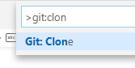
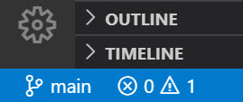
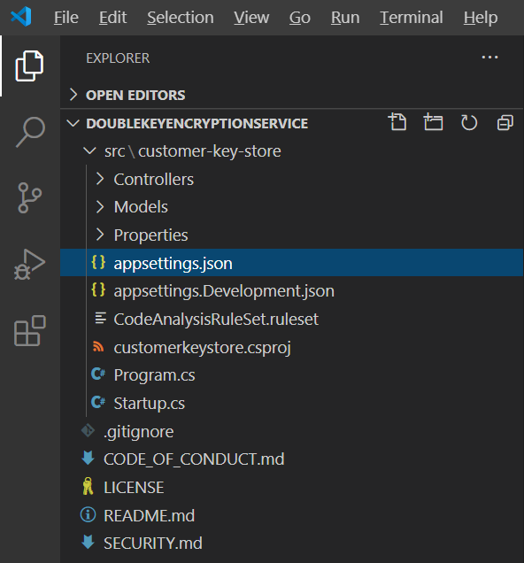
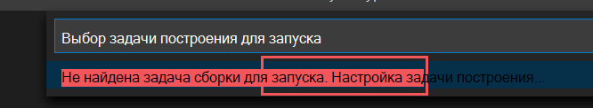
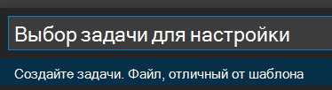
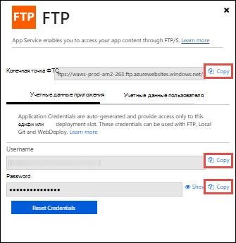
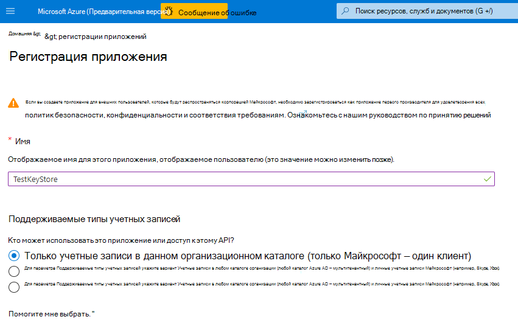
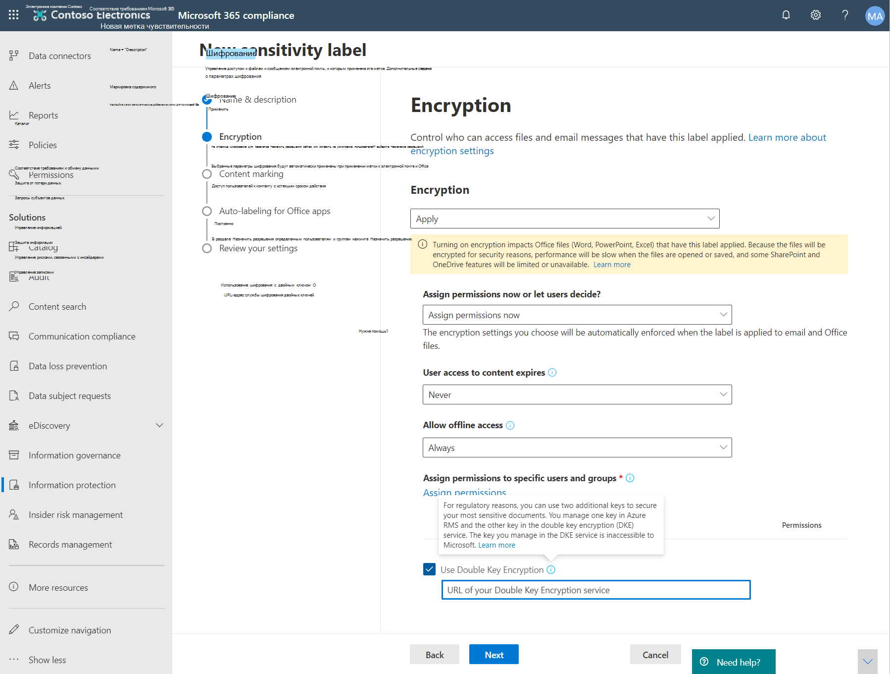

# <a name="double-key-encryption-for-microsoft-365"></a><span data-ttu-id="35f08-103">Шифрование с двойным ключом для Microsoft 365</span><span class="sxs-lookup"><span data-stu-id="35f08-103">Double Key Encryption for Microsoft 365</span></span>

> <span data-ttu-id="35f08-104">*Применимо к: шифрование с использованием двойного ключа для Microsoft 365, [соответствие требованиям Microsoft 365,](https://www.microsoft.com/microsoft-365/business/compliance-management) [Azure Information Protection](https://azure.microsoft.com/pricing/details/information-protection)*</span><span class="sxs-lookup"><span data-stu-id="35f08-104">*Applies to: Double Key Encryption for Microsoft 365, [Microsoft 365 Compliance](https://www.microsoft.com/microsoft-365/business/compliance-management), [Azure Information Protection](https://azure.microsoft.com/pricing/details/information-protection)*</span></span>
>
> <span data-ttu-id="35f08-105">*Инструкции по: клиент [унифицированных меток Azure Information Protection для Windows](https://docs.microsoft.com/azure/information-protection/faqs#whats-the-difference-between-the-azure-information-protection-classic-and-unified-labeling-clients)*</span><span class="sxs-lookup"><span data-stu-id="35f08-105">*Instructions for: [Azure Information Protection unified labeling client for Windows](https://docs.microsoft.com/azure/information-protection/faqs#whats-the-difference-between-the-azure-information-protection-classic-and-unified-labeling-clients)*</span></span>
>
> <span data-ttu-id="35f08-106">*Описание службы: [соответствие требованиям Microsoft 365](https://docs.microsoft.com/office365/servicedescriptions/microsoft-365-service-descriptions/microsoft-365-tenantlevel-services-licensing-guidance/microsoft-365-security-compliance-licensing-guidance)*</span><span class="sxs-lookup"><span data-stu-id="35f08-106">*Service description for: [Microsoft 365 Compliance](https://docs.microsoft.com/office365/servicedescriptions/microsoft-365-service-descriptions/microsoft-365-tenantlevel-services-licensing-guidance/microsoft-365-security-compliance-licensing-guidance)*</span></span>

<span data-ttu-id="35f08-107">При двойном шифровании ключей (DKE) для доступа к защищенного контенту используются два ключа.</span><span class="sxs-lookup"><span data-stu-id="35f08-107">Double Key Encryption (DKE) uses two keys together to access protected content.</span></span> <span data-ttu-id="35f08-108">Корпорация Майкрософт сохраняет один ключ в Microsoft Azure, а вы сохраняете другой ключ.</span><span class="sxs-lookup"><span data-stu-id="35f08-108">Microsoft stores one key in Microsoft Azure, and you hold the other key.</span></span> <span data-ttu-id="35f08-109">Вы сохраняете полный контроль над одним из ключей с помощью службы шифрования двойного ключа.</span><span class="sxs-lookup"><span data-stu-id="35f08-109">You maintain full control of one of your keys using the Double Key Encryption service.</span></span> <span data-ttu-id="35f08-110">Вы применяйте защиту с помощью клиента унифицированных меток Azure Information Protection к вашему содержимому с высокой конфиденциальной информацией.</span><span class="sxs-lookup"><span data-stu-id="35f08-110">You apply protection using The Azure Information Protection unified labeling client to your highly sensitive content.</span></span>

<span data-ttu-id="35f08-111">Двойное шифрование ключей поддерживает как облачные, так и локальное развертывания.</span><span class="sxs-lookup"><span data-stu-id="35f08-111">Double Key Encryption supports both cloud and on-premises deployments.</span></span> <span data-ttu-id="35f08-112">Эти развертывания помогают гарантировать, что зашифрованные данные остаются непрозрачными, где бы вы ни хранили защищенные данные.</span><span class="sxs-lookup"><span data-stu-id="35f08-112">These deployments help to ensure that encrypted data remains opaque wherever you store the protected data.</span></span>

<span data-ttu-id="35f08-113">Дополнительные сведения о корневых ключах клиента по умолчанию, основанных на облаке, см. в сведениях о планировании и реализации ключа клиента [Azure Information Protection.](https://docs.microsoft.com/azure/information-protection/plan-implement-tenant-key)</span><span class="sxs-lookup"><span data-stu-id="35f08-113">For more information about the default, cloud-based tenant root keys, see [Planning and implementing your Azure Information Protection tenant key](https://docs.microsoft.com/azure/information-protection/plan-implement-tenant-key).</span></span>

## <a name="when-your-organization-should-adopt-dke"></a><span data-ttu-id="35f08-114">Когда вашей организации следует использовать DKE</span><span class="sxs-lookup"><span data-stu-id="35f08-114">When your organization should adopt DKE</span></span>

<span data-ttu-id="35f08-115">Шифрование с двойным ключом предназначено для наиболее конфиденциальных данных, которые подчиняются самым строгим требованиям защиты.</span><span class="sxs-lookup"><span data-stu-id="35f08-115">Double Key Encryption is intended for your most sensitive data that is subject to the strictest protection requirements.</span></span> <span data-ttu-id="35f08-116">DKE не предназначен для всех данных.</span><span class="sxs-lookup"><span data-stu-id="35f08-116">DKE is not intended for all data.</span></span> <span data-ttu-id="35f08-117">В общем, вы будете использовать двойное шифрование ключей для защиты только небольшой части ваших общих данных.</span><span class="sxs-lookup"><span data-stu-id="35f08-117">In general, you'll be using Double Key Encryption to protect only a small part of your overall data.</span></span> <span data-ttu-id="35f08-118">Прежде чем развертывать это решение, необходимо тщательно определить нужные данные.</span><span class="sxs-lookup"><span data-stu-id="35f08-118">You should do due diligence in identifying the right data to cover with this solution before you deploy.</span></span> <span data-ttu-id="35f08-119">В некоторых случаях может потребоваться сузить область действия и использовать другие решения для большинства данных, например Microsoft Information Protection с ключами, управляемыми Майкрософт, или BYOK.</span><span class="sxs-lookup"><span data-stu-id="35f08-119">In some cases, you might need to narrow your scope and make use of other solutions for most your data such as Microsoft Information Protection with Microsoft-managed keys or BYOK.</span></span> <span data-ttu-id="35f08-120">Этих решений достаточно для документов, которые не подвергаются усиленной защите и нормативным требованиям.</span><span class="sxs-lookup"><span data-stu-id="35f08-120">These solutions are sufficient for documents that aren't subject to enhanced protections and regulatory requirements.</span></span> <span data-ttu-id="35f08-121">Кроме того, эти решения позволяют использовать самые мощные службы Office 365; службы, которые нельзя использовать с зашифрованным DKE-содержимым.</span><span class="sxs-lookup"><span data-stu-id="35f08-121">Also, these solutions enable you to use the most powerful Office 365 services; services that you can't use with DKE encrypted content.</span></span> <span data-ttu-id="35f08-122">Например:</span><span class="sxs-lookup"><span data-stu-id="35f08-122">For example:</span></span>

- <span data-ttu-id="35f08-123">Правила транспорта, включая вредоносные программы и спам, для которых требуется видимость вложения</span><span class="sxs-lookup"><span data-stu-id="35f08-123">Transport rules including anti-malware and spam that require visibility into the attachment</span></span>
- <span data-ttu-id="35f08-124">Microsoft Delve</span><span class="sxs-lookup"><span data-stu-id="35f08-124">Microsoft Delve</span></span>
- <span data-ttu-id="35f08-125">Обнаружение электронных данных</span><span class="sxs-lookup"><span data-stu-id="35f08-125">eDiscovery</span></span>
- <span data-ttu-id="35f08-126">Поиск и индексация контента</span><span class="sxs-lookup"><span data-stu-id="35f08-126">Content search and indexing</span></span>
- <span data-ttu-id="35f08-127">Office Web Apps, включая функции совместной работы</span><span class="sxs-lookup"><span data-stu-id="35f08-127">Office Web Apps including coauthoring functionality</span></span>

<span data-ttu-id="35f08-128">Все внешние приложения или службы, которые не интегрированы с DKE через MIP SDK, не смогут выполнять действия с зашифрованными данными.</span><span class="sxs-lookup"><span data-stu-id="35f08-128">Any external applications or services that are not integrated with DKE through the MIP SDK will be unable to perform actions on the encrypted data.</span></span>

<span data-ttu-id="35f08-129">Microsoft Information Protection SDK 1.7+ поддерживает двойное шифрование ключей; приложения, которые интегрируются с нашим SDK, смогут аргументировать эти данные с достаточными разрешениями и интеграцией.</span><span class="sxs-lookup"><span data-stu-id="35f08-129">The Microsoft Information Protection SDK 1.7+ supports Double Key Encryption; applications that integrate with our SDK will be able to reason over this data with sufficient permissions and integrations in place.</span></span>

<span data-ttu-id="35f08-130">Мы рекомендуем организациям использовать возможности Microsoft Information Protection (классификацию и маркировку) для защиты большей части конфиденциальных данных и использовать DKE только для критически важных данных.</span><span class="sxs-lookup"><span data-stu-id="35f08-130">We recommend organizations use Microsoft Information protection capabilities (classification and labeling) to protect most of their sensitive data and only use DKE for their mission-critical data.</span></span> <span data-ttu-id="35f08-131">Шифрование с двойным ключом относится к конфиденциальным данным в строго регулируемых отраслях, таких как финансовые услуги и здравоохранения.</span><span class="sxs-lookup"><span data-stu-id="35f08-131">Double Key Encryption is relevant for sensitive data in highly regulated industries such as Financial services and Healthcare.</span></span>

<span data-ttu-id="35f08-132">Если у вашей организации есть какие-либо из следующих требований, вы можете использовать DKE для защиты контента:</span><span class="sxs-lookup"><span data-stu-id="35f08-132">If your organizations have any of the following requirements, you can use DKE to help secure your content:</span></span>

- <span data-ttu-id="35f08-133">Необходимо обеспечить возможность  расшифровки защищенного контента только при любых обстоятельствах.</span><span class="sxs-lookup"><span data-stu-id="35f08-133">You want to ensure that *only you* can ever decrypt protected content, under all circumstances.</span></span>
- <span data-ttu-id="35f08-134">Корпорация Майкрософт не должна иметь доступ к защищенным данным самостоятельно.</span><span class="sxs-lookup"><span data-stu-id="35f08-134">You don't want Microsoft to have access to protected data on its own.</span></span>
- <span data-ttu-id="35f08-135">У вас есть нормативные требования для удержания ключей в пределах географической границы.</span><span class="sxs-lookup"><span data-stu-id="35f08-135">You have regulatory requirements to hold keys within a geographical boundary.</span></span> <span data-ttu-id="35f08-136">Все ключи, которые вы сохраняете для шифрования и расшифровки данных, сохраняются в центре обработки данных.</span><span class="sxs-lookup"><span data-stu-id="35f08-136">All of the keys that you hold for data encryption and decryption are maintained in your data center.</span></span>

## <a name="system-and-licensing-requirements-for-dke"></a><span data-ttu-id="35f08-137">Требования к системе и лицензированию для DKE</span><span class="sxs-lookup"><span data-stu-id="35f08-137">System and licensing requirements for DKE</span></span>

<span data-ttu-id="35f08-138">**Шифрование с помощью двойного ключа для Microsoft 365** поставляется с Microsoft 365 E5.</span><span class="sxs-lookup"><span data-stu-id="35f08-138">**Double Key Encryption for Microsoft 365** comes with Microsoft 365 E5.</span></span> <span data-ttu-id="35f08-139">Если у вас нет лицензии microsoft 365 E5, вы можете зарегистрироваться для получения пробной [лицензии.](https://aka.ms/M365E5ComplianceTrial)</span><span class="sxs-lookup"><span data-stu-id="35f08-139">If you don’t have a Microsoft 365 E5 license, you can sign up for a [trial](https://aka.ms/M365E5ComplianceTrial).</span></span> <span data-ttu-id="35f08-140">Дополнительные сведения об этих лицензиях см. в руководстве по лицензированию [Microsoft 365 для](https://docs.microsoft.com/office365/servicedescriptions/microsoft-365-service-descriptions/microsoft-365-tenantlevel-services-licensing-guidance/microsoft-365-security-compliance-licensing-guidance)обеспечения соответствия & безопасности.</span><span class="sxs-lookup"><span data-stu-id="35f08-140">For more information about these licenses, see [Microsoft 365 licensing guidance for security & compliance](https://docs.microsoft.com/office365/servicedescriptions/microsoft-365-service-descriptions/microsoft-365-tenantlevel-services-licensing-guidance/microsoft-365-security-compliance-licensing-guidance).</span></span>

<span data-ttu-id="35f08-141">**Azure Information Protection.**</span><span class="sxs-lookup"><span data-stu-id="35f08-141">**Azure Information Protection**.</span></span> <span data-ttu-id="35f08-142">DKE работает с метами конфиденциальности и требует Azure Information Protection.</span><span class="sxs-lookup"><span data-stu-id="35f08-142">DKE works with sensitivity labels and requires Azure Information Protection.</span></span>

<span data-ttu-id="35f08-143">Метки конфиденциальности DKE доступны конечным пользователям с помощью ленты конфиденциальности в классических приложениях Office.</span><span class="sxs-lookup"><span data-stu-id="35f08-143">DKE sensitivity labels are made available to end users through the sensitivity ribbon in Office Desktop Apps.</span></span> <span data-ttu-id="35f08-144">Установите эти предварительные условия на каждый клиентский компьютер, где необходимо защитить и использовать защищенные документы.</span><span class="sxs-lookup"><span data-stu-id="35f08-144">Install these prerequisites on each client computer where you want to protect and consume protected documents.</span></span>

<span data-ttu-id="35f08-145">**Microsoft Office приложений для предприятий** \*.12711 или более поздней (классические версии Word, PowerPoint и Excel) в Windows.</span><span class="sxs-lookup"><span data-stu-id="35f08-145">**Microsoft Office Apps for enterprise** version \*.12711 or later (Desktop versions of Word, PowerPoint, and Excel) on Windows.</span></span>

<span data-ttu-id="35f08-146">**Клиент единой метки Azure Information Protection** версии 2.7.93.0 или более поздней.</span><span class="sxs-lookup"><span data-stu-id="35f08-146">**Azure Information Protection Unified Labeling Client** versions 2.7.93.0 or later.</span></span> <span data-ttu-id="35f08-147">Скачайте и установите клиент единой метки из [Центра загрузки Майкрософт.](https://www.microsoft.com/download/details.aspx?id=53018)</span><span class="sxs-lookup"><span data-stu-id="35f08-147">Download and install the Unified Labeling client from the [Microsoft download center](https://www.microsoft.com/download/details.aspx?id=53018).</span></span>

## <a name="supported-environments-for-storing-and-viewing-dke-protected-content"></a><span data-ttu-id="35f08-148">Поддерживаемые среды для хранения и просмотра контента, защищенного dKE</span><span class="sxs-lookup"><span data-stu-id="35f08-148">Supported environments for storing and viewing DKE-protected content</span></span>

<span data-ttu-id="35f08-149">**Поддерживаемые приложения.**</span><span class="sxs-lookup"><span data-stu-id="35f08-149">**Supported applications**.</span></span> <span data-ttu-id="35f08-150">[Приложения Microsoft 365 для корпоративных](https://www.microsoft.com/microsoft-365/business/microsoft-365-apps-for-enterprise-product) клиентов в Windows, включая Word, Excel и PowerPoint.</span><span class="sxs-lookup"><span data-stu-id="35f08-150">[Microsoft 365 Apps for enterprise](https://www.microsoft.com/microsoft-365/business/microsoft-365-apps-for-enterprise-product) clients on Windows, including Word, Excel, and PowerPoint.</span></span>

<span data-ttu-id="35f08-151">**Поддержка интернет-содержимого.**</span><span class="sxs-lookup"><span data-stu-id="35f08-151">**Online content support**.</span></span> <span data-ttu-id="35f08-152">Поддерживаются документы и файлы, хранимые в Интернете в Microsoft SharePoint и OneDrive для бизнеса.</span><span class="sxs-lookup"><span data-stu-id="35f08-152">Documents and files stored online in both Microsoft SharePoint and OneDrive for Business are supported.</span></span> <span data-ttu-id="35f08-153">Вы можете обмениваться зашифрованным содержимым по электронной почте, но не можете просматривать зашифрованные документы и файлы в Интернете.</span><span class="sxs-lookup"><span data-stu-id="35f08-153">You can share encrypted content by email, but you can't view encrypted documents and files online.</span></span> <span data-ttu-id="35f08-154">Вместо этого необходимо просматривать защищенный контент с помощью классических приложений на локальном компьютере.</span><span class="sxs-lookup"><span data-stu-id="35f08-154">Instead, you must view protected content using the desktop apps on your local computer.</span></span>

## <a name="overview-of-deploying-dke"></a><span data-ttu-id="35f08-155">Обзор развертывания DKE</span><span class="sxs-lookup"><span data-stu-id="35f08-155">Overview of deploying DKE</span></span>

<span data-ttu-id="35f08-156">Чтобы настроить DKE, выполните следующие общие действия.</span><span class="sxs-lookup"><span data-stu-id="35f08-156">You'll follow these general steps to set up DKE.</span></span> <span data-ttu-id="35f08-157">После завершения этих действий конечные пользователи смогут защищать ваши конфиденциальные данные с помощью шифрования с помощью двойного ключа.</span><span class="sxs-lookup"><span data-stu-id="35f08-157">Once you've completed these steps, your end users will can protect your highly sensitive data with Double Key Encryption.</span></span>

1. <span data-ttu-id="35f08-158">Развернем службу DKE, как описано в этой статье.</span><span class="sxs-lookup"><span data-stu-id="35f08-158">Deploy the DKE service as described in this article.</span></span>

2. <span data-ttu-id="35f08-159">Создайте метку с шифрованием с помощью двойного ключа.</span><span class="sxs-lookup"><span data-stu-id="35f08-159">Create a label with Double Key Encryption.</span></span> <span data-ttu-id="35f08-160">Перейдите к информационной защите в [Центре соответствия требованиям Microsoft 365](https://compliance.microsoft.com) и создайте новую метку с двойным шифрованием ключа.</span><span class="sxs-lookup"><span data-stu-id="35f08-160">Navigate to Information protection under the [Microsoft 365 compliance center](https://compliance.microsoft.com) and create a new label with Double Key Encryption.</span></span> <span data-ttu-id="35f08-161">См. ["Ограничение доступа к содержимому с помощью меток конфиденциальности для применения шифрования".](https://docs.microsoft.com/microsoft-365/compliance/encryption-sensitivity-labels)</span><span class="sxs-lookup"><span data-stu-id="35f08-161">See [Restrict access to content by using sensitivity labels to apply encryption](https://docs.microsoft.com/microsoft-365/compliance/encryption-sensitivity-labels).</span></span>

3. <span data-ttu-id="35f08-162">Используйте метки двойного шифрования ключей.</span><span class="sxs-lookup"><span data-stu-id="35f08-162">Use Double Key Encryption labels.</span></span> <span data-ttu-id="35f08-163">Защитите данные, выбрав метку "Шифрование с двойным ключом" на ленте конфиденциальности в Microsoft Office.</span><span class="sxs-lookup"><span data-stu-id="35f08-163">Protect data by selecting the Double Key Encrypted label from the Sensitivity ribbon in Microsoft Office.</span></span>

<span data-ttu-id="35f08-164">Существует несколько способов выполнения некоторых действий по развертыванию шифрования с двойным ключом.</span><span class="sxs-lookup"><span data-stu-id="35f08-164">There are several ways you can complete some of the steps to deploy Double Key Encryption.</span></span> <span data-ttu-id="35f08-165">В этой статье данная статья содержит подробные инструкции по успешному развертыванию службы менее опытных администраторов.</span><span class="sxs-lookup"><span data-stu-id="35f08-165">This article provides detailed instructions so that less experienced admins successfully deploy the service.</span></span> <span data-ttu-id="35f08-166">Если вы хорошо это делаете, вы можете использовать собственные методы.</span><span class="sxs-lookup"><span data-stu-id="35f08-166">If you're comfortable doing so, you can choose to use your own methods.</span></span>

## <a name="deploy-dke"></a><span data-ttu-id="35f08-167">Развертывание DKE</span><span class="sxs-lookup"><span data-stu-id="35f08-167">Deploy DKE</span></span>

<span data-ttu-id="35f08-168">В этой статье и видео о развертывании в качестве места развертывания для службы DKE используется Azure.</span><span class="sxs-lookup"><span data-stu-id="35f08-168">This article and the deployment video use Azure as the deployment destination for the DKE service.</span></span> <span data-ttu-id="35f08-169">Если развертывание разворачивается в другом расположении, необходимо предоставить собственные значения.</span><span class="sxs-lookup"><span data-stu-id="35f08-169">If you're deploying to another location, you'll need to provide your own values.</span></span>

<span data-ttu-id="35f08-170">Просмотрите [видео о](https://youtu.be/vDWfHN_kygg) развертывании с использованием двойного шифрования ключей, чтобы просмотреть пошаговой обзор концепций, которые данная статья представляет.</span><span class="sxs-lookup"><span data-stu-id="35f08-170">Watch the [Double Key Encryption deployment video](https://youtu.be/vDWfHN_kygg) to see a step-by-step overview of the concepts in this article.</span></span> <span data-ttu-id="35f08-171">Видео занимает около 18 минут.</span><span class="sxs-lookup"><span data-stu-id="35f08-171">The video takes about 18 minutes to complete.</span></span>

<span data-ttu-id="35f08-172">Чтобы настроить шифрование с помощью двойного ключа в организации, выполните следующие общие действия.</span><span class="sxs-lookup"><span data-stu-id="35f08-172">You'll follow these general steps to set up Double Key Encryption for your organization.</span></span>

1. [<span data-ttu-id="35f08-173">Установка необходимого программного обеспечения для службы DKE</span><span class="sxs-lookup"><span data-stu-id="35f08-173">Install software prerequisites for the DKE service</span></span>](#install-software-prerequisites-for-the-dke-service)
1. [<span data-ttu-id="35f08-174">Клонирование репозитория GitHub с двойным ключом</span><span class="sxs-lookup"><span data-stu-id="35f08-174">Clone the Double Key Encryption GitHub repository</span></span>](#clone-the-dke-github-repository)
1. [<span data-ttu-id="35f08-175">Изменение параметров приложения</span><span class="sxs-lookup"><span data-stu-id="35f08-175">Modify application settings</span></span>](#modify-application-settings)
1. [<span data-ttu-id="35f08-176">Создание тестовых ключей</span><span class="sxs-lookup"><span data-stu-id="35f08-176">Generate test keys</span></span>](#generate-test-keys)
1. [<span data-ttu-id="35f08-177">Построение проекта</span><span class="sxs-lookup"><span data-stu-id="35f08-177">Build the project</span></span>](#build-the-project)
1. [<span data-ttu-id="35f08-178">Развертывание службы DKE и публикация хранилище ключей</span><span class="sxs-lookup"><span data-stu-id="35f08-178">Deploy the DKE service and publish the key store</span></span>](#deploy-the-dke-service-and-publish-the-key-store)
1. [<span data-ttu-id="35f08-179">Проверка развертывания</span><span class="sxs-lookup"><span data-stu-id="35f08-179">Validate your deployment</span></span>](#validate-your-deployment)
1. [<span data-ttu-id="35f08-180">Регистрация хранилище ключей</span><span class="sxs-lookup"><span data-stu-id="35f08-180">Register your key store</span></span>](#register-your-key-store)
1. [<span data-ttu-id="35f08-181">Создание меток конфиденциальности с помощью DKE</span><span class="sxs-lookup"><span data-stu-id="35f08-181">Create sensitivity labels using DKE</span></span>](#create-sensitivity-labels-using-dke)
1. [<span data-ttu-id="35f08-182">Включить DKE в клиенте</span><span class="sxs-lookup"><span data-stu-id="35f08-182">Enable DKE in your client</span></span>](#enable-dke-in-your-client)
1. [<span data-ttu-id="35f08-183">Перенос защищенных файлов из меток HYOK в метки DKE</span><span class="sxs-lookup"><span data-stu-id="35f08-183">Migrate protected files from HYOK labels to DKE labels</span></span>](#migrate-protected-files-from-hyok-labels-to-dke-labels)

<span data-ttu-id="35f08-184">После этого вы сможете шифровать документы и файлы с помощью DKE.</span><span class="sxs-lookup"><span data-stu-id="35f08-184">When you're done, you can encrypt documents and files using DKE.</span></span> <span data-ttu-id="35f08-185">Сведения см. в [под названием "Применение меток конфиденциальности к файлам и электронной почте в Office".](https://support.microsoft.com/office/2f96e7cd-d5a4-403b-8bd7-4cc636bae0f9)</span><span class="sxs-lookup"><span data-stu-id="35f08-185">For information, see [Apply sensitivity labels to your files and email in Office](https://support.microsoft.com/office/2f96e7cd-d5a4-403b-8bd7-4cc636bae0f9).</span></span>

### <a name="install-software-prerequisites-for-the-dke-service"></a><span data-ttu-id="35f08-186">Установка необходимого программного обеспечения для службы DKE</span><span class="sxs-lookup"><span data-stu-id="35f08-186">Install software prerequisites for the DKE service</span></span>

<span data-ttu-id="35f08-187">Установите эти необходимые условия на компьютере, где необходимо установить службу DKE.</span><span class="sxs-lookup"><span data-stu-id="35f08-187">Install these prerequisites on the computer where you want to install the DKE service.</span></span>

<span data-ttu-id="35f08-188">**.NET Core 3.1 SDK.**</span><span class="sxs-lookup"><span data-stu-id="35f08-188">**.NET Core 3.1 SDK**.</span></span> <span data-ttu-id="35f08-189">Скачайте и установите SDK из [.NET Core 3.1.](https://dotnet.microsoft.com/download/dotnet-core/3.1)</span><span class="sxs-lookup"><span data-stu-id="35f08-189">Download and install the SDK from [Download .NET Core 3.1](https://dotnet.microsoft.com/download/dotnet-core/3.1).</span></span>

<span data-ttu-id="35f08-190">**Visual Studio code**.</span><span class="sxs-lookup"><span data-stu-id="35f08-190">**Visual Studio Code**.</span></span> <span data-ttu-id="35f08-191">Скачайте Visual Studio кода [https://code.visualstudio.com/](https://code.visualstudio.com) из .</span><span class="sxs-lookup"><span data-stu-id="35f08-191">Download Visual Studio Code from [https://code.visualstudio.com/](https://code.visualstudio.com).</span></span> <span data-ttu-id="35f08-192">После установки запустите Visual Studio Code  и выберите \> **"Расширения представления".**</span><span class="sxs-lookup"><span data-stu-id="35f08-192">Once installed, run Visual Studio Code and select **View** \> **Extensions**.</span></span> <span data-ttu-id="35f08-193">Установите эти расширения.</span><span class="sxs-lookup"><span data-stu-id="35f08-193">Install these extensions.</span></span>

- <span data-ttu-id="35f08-194">C# для Visual Studio кода</span><span class="sxs-lookup"><span data-stu-id="35f08-194">C# for Visual Studio Code</span></span>

- <span data-ttu-id="35f08-195">NuGet диспетчер пакетов</span><span class="sxs-lookup"><span data-stu-id="35f08-195">NuGet Package Manager</span></span>

<span data-ttu-id="35f08-196">**Ресурсы Git.**</span><span class="sxs-lookup"><span data-stu-id="35f08-196">**Git resources**.</span></span> <span data-ttu-id="35f08-197">Скачайте и установите один из следующих скачать и установить.</span><span class="sxs-lookup"><span data-stu-id="35f08-197">Download and install one of the following.</span></span>

- [<span data-ttu-id="35f08-198">Git</span><span class="sxs-lookup"><span data-stu-id="35f08-198">Git</span></span>](https://git-scm.com/downloads)

- [<span data-ttu-id="35f08-199">Рабочий стол GitHub</span><span class="sxs-lookup"><span data-stu-id="35f08-199">GitHub Desktop</span></span>](https://desktop.github.com/)

- [<span data-ttu-id="35f08-200">GitHub Enterprise</span><span class="sxs-lookup"><span data-stu-id="35f08-200">GitHub Enterprise</span></span>](https://github.com/enterprise)

<span data-ttu-id="35f08-201">**OpenSSL** После развертывания DKE необходимо установить [OpenSSL](https://slproweb.com/products/Win32OpenSSL.html) для [создания](#generate-test-keys) тестовых ключей.</span><span class="sxs-lookup"><span data-stu-id="35f08-201">**OpenSSL** You must have [OpenSSL](https://slproweb.com/products/Win32OpenSSL.html) installed to [generate test keys](#generate-test-keys) after you deploy DKE.</span></span> <span data-ttu-id="35f08-202">Убедитесь, что вы правильно направите его по пути переменных среды.</span><span class="sxs-lookup"><span data-stu-id="35f08-202">Make sure you're invoking it correctly from your environment variables path.</span></span> <span data-ttu-id="35f08-203">Например, дополнительные сведения см. в подстроке "Добавление каталога установки в [https://www.osradar.com/install-openssl-windows/](https://www.osradar.com/install-openssl-windows/) path".</span><span class="sxs-lookup"><span data-stu-id="35f08-203">For example, see "Add the installation directory to PATH" at [https://www.osradar.com/install-openssl-windows/](https://www.osradar.com/install-openssl-windows/) for details.</span></span>

### <a name="clone-the-dke-github-repository"></a><span data-ttu-id="35f08-204">Клонирование репозитория DKE GitHub</span><span class="sxs-lookup"><span data-stu-id="35f08-204">Clone the DKE GitHub repository</span></span>

<span data-ttu-id="35f08-205">Корпорация Майкрософт обеспечивает исходные файлы DKE в репозитории GitHub.</span><span class="sxs-lookup"><span data-stu-id="35f08-205">Microsoft supplies the DKE source files in a GitHub repository.</span></span> <span data-ttu-id="35f08-206">Репозиторий клонирован для локальной сборки проекта для использования в организации.</span><span class="sxs-lookup"><span data-stu-id="35f08-206">You clone the repository to build the project locally for your organization's use.</span></span> <span data-ttu-id="35f08-207">Репозиторий DKE GitHub находится по адресу [https://github.com/Azure-Samples/DoubleKeyEncryptionService](https://github.com/Azure-Samples/DoubleKeyEncryptionService) .</span><span class="sxs-lookup"><span data-stu-id="35f08-207">The DKE GitHub repository is located at [https://github.com/Azure-Samples/DoubleKeyEncryptionService](https://github.com/Azure-Samples/DoubleKeyEncryptionService).</span></span>

<span data-ttu-id="35f08-208">Следующие инструкции предназначены для пользователей git или Visual Studio кода:</span><span class="sxs-lookup"><span data-stu-id="35f08-208">The following instructions are intended for inexperienced git or Visual Studio Code users:</span></span>

1. <span data-ttu-id="35f08-209">В браузере перейдите [https://github.com/Azure-Samples/DoubleKeyEncryptionService](https://github.com/Azure-Samples/DoubleKeyEncryptionService) к:</span><span class="sxs-lookup"><span data-stu-id="35f08-209">In your browser, go to: [https://github.com/Azure-Samples/DoubleKeyEncryptionService](https://github.com/Azure-Samples/DoubleKeyEncryptionService).</span></span>

2. <span data-ttu-id="35f08-210">Справа от экрана выберите **"Код".**</span><span class="sxs-lookup"><span data-stu-id="35f08-210">Towards the right side of the screen, select **Code**.</span></span> <span data-ttu-id="35f08-211">В вашей версии пользовательского интерфейса может быть кнопка **клонирования или скачивания.**</span><span class="sxs-lookup"><span data-stu-id="35f08-211">Your version of the UI might show a **Clone or download** button.</span></span> <span data-ttu-id="35f08-212">Затем в отображимомся dropdown выберите значок копирования, чтобы скопировать URL-адрес в буфер обмена.</span><span class="sxs-lookup"><span data-stu-id="35f08-212">Then, in the dropdown that appears, select the copy icon to copy the URL to your clipboard.</span></span>

    <span data-ttu-id="35f08-213">Например:</span><span class="sxs-lookup"><span data-stu-id="35f08-213">For example:</span></span>

   

3. <span data-ttu-id="35f08-215">В Visual Studio кода выберите **"Просмотреть** \> **палитру команд"** и выберите **Git: Клонировать.**</span><span class="sxs-lookup"><span data-stu-id="35f08-215">In Visual Studio Code, select **View** \> **Command Palette** and select **Git: Clone**.</span></span> <span data-ttu-id="35f08-216">Чтобы перейти к параметру в списке, начните вводить, чтобы отфильтровать записи, а затем выберите его в `git: clone` выпадаемом списке.</span><span class="sxs-lookup"><span data-stu-id="35f08-216">To jump to the option in the list, start typing `git: clone` to filter the entries and then select it from the drop-down.</span></span> <span data-ttu-id="35f08-217">Например:</span><span class="sxs-lookup"><span data-stu-id="35f08-217">For example:</span></span>

   

4. <span data-ttu-id="35f08-219">В текстовом поле вите URL-адрес, скопированный из Git, и выберите **"Клонировать" в GitHub.**</span><span class="sxs-lookup"><span data-stu-id="35f08-219">In the text box, paste the URL that you copied from Git and select **Clone from GitHub**.</span></span>

5. <span data-ttu-id="35f08-220">В **отображемом** диалоговом окке "Выбор папки" найдите и выберите расположение для хранения репозитория.</span><span class="sxs-lookup"><span data-stu-id="35f08-220">In the **Select Folder** dialog that appears, browse to and select a location to store the repository.</span></span> <span data-ttu-id="35f08-221">В запросе выберите **"Открыть".**</span><span class="sxs-lookup"><span data-stu-id="35f08-221">At the prompt, select **Open**.</span></span>

    <span data-ttu-id="35f08-222">Репозиторий откроется в Visual Studio Code и отобразит текущую ветвь Git в нижней левой части.</span><span class="sxs-lookup"><span data-stu-id="35f08-222">The repository opens in Visual Studio Code, and displays the current Git branch at the bottom left.</span></span> <span data-ttu-id="35f08-223">Например, ветвь должна быть **главной.**</span><span class="sxs-lookup"><span data-stu-id="35f08-223">For example,  The branch should be **main**.</span></span> <span data-ttu-id="35f08-224">Например:</span><span class="sxs-lookup"><span data-stu-id="35f08-224">For example:</span></span>

   

6. <span data-ttu-id="35f08-226">Если вы не в основной ветви, вам потребуется выбрать ее.</span><span class="sxs-lookup"><span data-stu-id="35f08-226">If you're not on the main branch, you'll need to select it.</span></span> <span data-ttu-id="35f08-227">В Visual Studio Code выберите ветвь  и выберите основную из отображаемого списка ветвей.</span><span class="sxs-lookup"><span data-stu-id="35f08-227">In Visual Studio Code, select the branch and choose **main** from the list of branches that displays.</span></span>

   > [!IMPORTANT]
   > <span data-ttu-id="35f08-228">Выбор главной ветви гарантирует, что у вас есть правильные файлы для построения проекта.</span><span class="sxs-lookup"><span data-stu-id="35f08-228">Selecting the main branch ensures that you have the correct files to build the project.</span></span> <span data-ttu-id="35f08-229">Если не выбрать правильную ветвь, развертывание не будет работать.</span><span class="sxs-lookup"><span data-stu-id="35f08-229">If you don't choose the correct branch your deployment will fail.</span></span>

<span data-ttu-id="35f08-230">Теперь исходный репозиторий DKE настроен локально.</span><span class="sxs-lookup"><span data-stu-id="35f08-230">You now have your DKE source repository set up locally.</span></span> <span data-ttu-id="35f08-231">Затем [измените параметры приложений](#modify-application-settings) для организации.</span><span class="sxs-lookup"><span data-stu-id="35f08-231">Next, [modify application settings](#modify-application-settings) for your organization.</span></span>

### <a name="modify-application-settings"></a><span data-ttu-id="35f08-232">Изменение параметров приложения</span><span class="sxs-lookup"><span data-stu-id="35f08-232">Modify application settings</span></span>

<span data-ttu-id="35f08-233">Чтобы развернуть службу DKE, необходимо изменить следующие типы параметров приложений:</span><span class="sxs-lookup"><span data-stu-id="35f08-233">To deploy the DKE service, you must modify the following types of application settings:</span></span>

- [<span data-ttu-id="35f08-234">Параметры доступа к ключам</span><span class="sxs-lookup"><span data-stu-id="35f08-234">Key access settings</span></span>](#key-access-settings)
- [<span data-ttu-id="35f08-235">Параметры клиента и ключа</span><span class="sxs-lookup"><span data-stu-id="35f08-235">Tenant and key settings</span></span>](#tenant-and-key-settings)

<span data-ttu-id="35f08-236">Параметры приложения изменяются в appsettings.jsв файле.</span><span class="sxs-lookup"><span data-stu-id="35f08-236">You modify application settings in the appsettings.json file.</span></span> <span data-ttu-id="35f08-237">Этот файл расположен в репониции DoubleKeyEncryptionService, клонированном локально в хранилище DoubleKeyEncryptionService\src\customer-key-store.</span><span class="sxs-lookup"><span data-stu-id="35f08-237">This file is located in the DoubleKeyEncryptionService repo you cloned locally under DoubleKeyEncryptionService\src\customer-key-store.</span></span> <span data-ttu-id="35f08-238">Например, в Visual Studio Code можно просмотреть файл, как показано на следующем рисунке.</span><span class="sxs-lookup"><span data-stu-id="35f08-238">For example, in Visual Studio Code, you can browse to the file as shown in the following picture.</span></span>



#### <a name="key-access-settings"></a><span data-ttu-id="35f08-240">Параметры доступа к ключам</span><span class="sxs-lookup"><span data-stu-id="35f08-240">Key access settings</span></span>

<span data-ttu-id="35f08-241">Выберите, следует ли использовать авторизацию электронной почты или роли.</span><span class="sxs-lookup"><span data-stu-id="35f08-241">Choose whether to use email or role authorization.</span></span> <span data-ttu-id="35f08-242">DKE поддерживает только один из этих методов проверки подлинности одновременно.</span><span class="sxs-lookup"><span data-stu-id="35f08-242">DKE supports only one of these authentication methods at a time.</span></span>

- <span data-ttu-id="35f08-243">**Авторизация электронной почты.**</span><span class="sxs-lookup"><span data-stu-id="35f08-243">**Email authorization**.</span></span> <span data-ttu-id="35f08-244">Позволяет организации авторизовать доступ к ключам только на основе адресов электронной почты.</span><span class="sxs-lookup"><span data-stu-id="35f08-244">Allows your organization to authorize access to keys based on email addresses only.</span></span>

- <span data-ttu-id="35f08-245">**Авторизация ролей.**</span><span class="sxs-lookup"><span data-stu-id="35f08-245">**Role authorization**.</span></span> <span data-ttu-id="35f08-246">Позволяет организации авторизировать доступ к ключам на основе групп Active Directory и требует, чтобы веб-служба запросит LDAP.</span><span class="sxs-lookup"><span data-stu-id="35f08-246">Allows your organization to authorize access to keys based on Active Directory groups, and requires that the web service can query LDAP.</span></span>

<span data-ttu-id="35f08-247">**Настройка параметров доступа к ключам для DKE с помощью авторизации электронной почты**</span><span class="sxs-lookup"><span data-stu-id="35f08-247">**To set key access settings for DKE using email authorization**</span></span>

1. <span data-ttu-id="35f08-248">Откройте файл **appsettings.jsфайле** и найдите `AuthorizedEmailAddress` параметр.</span><span class="sxs-lookup"><span data-stu-id="35f08-248">Open the **appsettings.json** file and locate the `AuthorizedEmailAddress` setting.</span></span>

2. <span data-ttu-id="35f08-249">Добавьте адрес электронной почты или адреса, которые вы хотите авторизовать.</span><span class="sxs-lookup"><span data-stu-id="35f08-249">Add the email address or addresses that you want to authorize.</span></span> <span data-ttu-id="35f08-250">Разделять несколько адресов электронной почты двойными кавычками и запятой.</span><span class="sxs-lookup"><span data-stu-id="35f08-250">Separate multiple email addresses with double quotes and commas.</span></span> <span data-ttu-id="35f08-251">Например:</span><span class="sxs-lookup"><span data-stu-id="35f08-251">For example:</span></span>

   ```json
   "AuthorizedEmailAddress": ["email1@company.com", "email2@company.com ", "email3@company.com"]
   ```

3. <span data-ttu-id="35f08-252">Найдите `LDAPPath` параметр и удалите текст между `If you use role authorization (AuthorizedRoles) then this is the LDAP path.` двойными кавычками.</span><span class="sxs-lookup"><span data-stu-id="35f08-252">Locate the `LDAPPath` setting and remove the text `If you use role authorization (AuthorizedRoles) then this is the LDAP path.` between the double quotes.</span></span> <span data-ttu-id="35f08-253">Оставьте двойные кавычка на месте.</span><span class="sxs-lookup"><span data-stu-id="35f08-253">Leave the double quotes in place.</span></span> <span data-ttu-id="35f08-254">После завершения настройки параметр должен выглядеть так:</span><span class="sxs-lookup"><span data-stu-id="35f08-254">When you're finished, the setting should look like this.</span></span>

   ```json
   "LDAPPath": ""
   ```

4. <span data-ttu-id="35f08-255">Найдите `AuthorizedRoles` параметр и удалите всю строку.</span><span class="sxs-lookup"><span data-stu-id="35f08-255">Locate the `AuthorizedRoles` setting and delete the entire line.</span></span>

<span data-ttu-id="35f08-256">На этом рисунке показан **appsettings.jsфайла,** правильно отформатированный для авторизации электронной почты.</span><span class="sxs-lookup"><span data-stu-id="35f08-256">This image shows the **appsettings.json** file correctly formatted for email authorization.</span></span>

   

<span data-ttu-id="35f08-258">**Установка параметров доступа к ключам для DKE с помощью авторизации ролей**</span><span class="sxs-lookup"><span data-stu-id="35f08-258">**To set key access settings for DKE using role authorization**</span></span>

1. <span data-ttu-id="35f08-259">Откройте файл **appsettings.jsфайле** и найдите `AuthorizedRoles` параметр.</span><span class="sxs-lookup"><span data-stu-id="35f08-259">Open the **appsettings.json** file and locate the `AuthorizedRoles` setting.</span></span>

2. <span data-ttu-id="35f08-260">Добавьте имена групп Active Directory, которые нужно авторизировать.</span><span class="sxs-lookup"><span data-stu-id="35f08-260">Add the Active Directory group names you want to authorize.</span></span> <span data-ttu-id="35f08-261">Разделять несколько имен групп двойными кавычками и запятой.</span><span class="sxs-lookup"><span data-stu-id="35f08-261">Separate multiple group names with double quotes and commas.</span></span> <span data-ttu-id="35f08-262">Например:</span><span class="sxs-lookup"><span data-stu-id="35f08-262">For example:</span></span>

   ```json
   "AuthorizedRoles": ["group1", "group2", "group3"]
   ```

3. <span data-ttu-id="35f08-263">Найдите `LDAPPath` параметр и добавьте домен Active Directory.</span><span class="sxs-lookup"><span data-stu-id="35f08-263">Locate the `LDAPPath` setting and add the Active Directory domain.</span></span> <span data-ttu-id="35f08-264">Например:</span><span class="sxs-lookup"><span data-stu-id="35f08-264">For example:</span></span>

   ```json
   "LDAPPath": "contoso.com"
   ```

4. <span data-ttu-id="35f08-265">Найдите `AuthorizedEmailAddress` параметр и удалите всю строку.</span><span class="sxs-lookup"><span data-stu-id="35f08-265">Locate the `AuthorizedEmailAddress` setting and delete the entire line.</span></span>

<span data-ttu-id="35f08-266">На этом рисунке **показанappsettings.jsфайла,** правильно отформатированный для авторизации роли.</span><span class="sxs-lookup"><span data-stu-id="35f08-266">This image shows the **appsettings.json** file correctly formatted for role authorization.</span></span>

   

#### <a name="tenant-and-key-settings"></a><span data-ttu-id="35f08-268">Параметры клиента и ключа</span><span class="sxs-lookup"><span data-stu-id="35f08-268">Tenant and key settings</span></span>

<span data-ttu-id="35f08-269">Параметры клиента и ключа DKE находятся вappsettings.js **файла.**</span><span class="sxs-lookup"><span data-stu-id="35f08-269">DKE tenant and key settings are located in the **appsettings.json** file.</span></span>

<span data-ttu-id="35f08-270">**Настройка параметров клиента и ключей для DKE**</span><span class="sxs-lookup"><span data-stu-id="35f08-270">**To configure tenant and key settings for DKE**</span></span>

1. <span data-ttu-id="35f08-271">Откройте файл **appsettings.jsфайле.**</span><span class="sxs-lookup"><span data-stu-id="35f08-271">Open the **appsettings.json** file.</span></span>

2. <span data-ttu-id="35f08-272">Найдите `ValidIssuers` параметр и `<tenantid>` замените его на свой ИД клиента.</span><span class="sxs-lookup"><span data-stu-id="35f08-272">Locate the `ValidIssuers` setting and replace `<tenantid>` with your tenant ID.</span></span> <span data-ttu-id="35f08-273">Чтобы найти свой ИД клиента, перейдите на портал Azure и просматривайте [свойства клиента.](https://aad.portal.azure.com/#blade/Microsoft_AAD_IAM/ActiveDirectoryMenuBlade/Properties)</span><span class="sxs-lookup"><span data-stu-id="35f08-273">You can locate your tenant ID by going to the Azure portal and viewing the [tenant properties](https://aad.portal.azure.com/#blade/Microsoft_AAD_IAM/ActiveDirectoryMenuBlade/Properties).</span></span> <span data-ttu-id="35f08-274">Например:</span><span class="sxs-lookup"><span data-stu-id="35f08-274">For example:</span></span>

   ```json
   "ValidIssuers": [
     "https://sts.windows.net/9c99431e-b513-44be-a7d9-e7b500002d4b/"
   ]
   ```

<span data-ttu-id="35f08-275">Найдите `JwtAudience` .</span><span class="sxs-lookup"><span data-stu-id="35f08-275">Locate the `JwtAudience`.</span></span> <span data-ttu-id="35f08-276">Замените имя хоста компьютера, на котором будет работать служба `<yourhostname>` DKE.</span><span class="sxs-lookup"><span data-stu-id="35f08-276">Replace `<yourhostname>` with the hostname of the machine where the DKE service will run.</span></span> <span data-ttu-id="35f08-277">Например:</span><span class="sxs-lookup"><span data-stu-id="35f08-277">For example:</span></span>

  > [!IMPORTANT]
  > <span data-ttu-id="35f08-278">Значение должно `JwtAudience` точно совпадать с именем вашего *хоста.*</span><span class="sxs-lookup"><span data-stu-id="35f08-278">The value for `JwtAudience` must match the name of your host *exactly*.</span></span> <span data-ttu-id="35f08-279">Во время **отладки можно использовать localhost:5001.**</span><span class="sxs-lookup"><span data-stu-id="35f08-279">You may use **localhost:5001** while debugging.</span></span> <span data-ttu-id="35f08-280">Однако после отладки обязательно обновите это значение до имени хоста сервера.</span><span class="sxs-lookup"><span data-stu-id="35f08-280">However, When you're done debugging, make sure to update this value to the server's hostname.</span></span>

- <span data-ttu-id="35f08-281">`TestKeys:Name`.</span><span class="sxs-lookup"><span data-stu-id="35f08-281">`TestKeys:Name`.</span></span> <span data-ttu-id="35f08-282">Введите имя ключа.</span><span class="sxs-lookup"><span data-stu-id="35f08-282">Enter a name for your key.</span></span> <span data-ttu-id="35f08-283">Пример: `TestKey1`</span><span class="sxs-lookup"><span data-stu-id="35f08-283">For example: `TestKey1`</span></span>
- <span data-ttu-id="35f08-284">`TestKeys:Id`.</span><span class="sxs-lookup"><span data-stu-id="35f08-284">`TestKeys:Id`.</span></span> <span data-ttu-id="35f08-285">Создайте GUID и введите его в качестве `TestKeys:ID` значения.</span><span class="sxs-lookup"><span data-stu-id="35f08-285">Create a GUID and enter it as the `TestKeys:ID` value.</span></span> <span data-ttu-id="35f08-286">Например, `DCE1CC21-FF9B-4424-8FF4-9914BD19A1BE`.</span><span class="sxs-lookup"><span data-stu-id="35f08-286">For example, `DCE1CC21-FF9B-4424-8FF4-9914BD19A1BE`.</span></span> <span data-ttu-id="35f08-287">Вы можете использовать сайт, например [Online GUID Generator,](https://guidgenerator.com/) для случайного создания GUID.</span><span class="sxs-lookup"><span data-stu-id="35f08-287">You can use a site like [Online GUID Generator](https://guidgenerator.com/) to randomly generate a GUID.</span></span>

<span data-ttu-id="35f08-288">На этом рисунке показан правильный формат параметров клиента и ключей вappsettings.js **в.**</span><span class="sxs-lookup"><span data-stu-id="35f08-288">This image shows the correct format for tenant and keys settings in **appsettings.json**.</span></span> <span data-ttu-id="35f08-289">`LDAPPath` настроена для авторизации роли.</span><span class="sxs-lookup"><span data-stu-id="35f08-289">`LDAPPath` is configured for role authorization.</span></span>


### <a name="generate-test-keys"></a><span data-ttu-id="35f08-291">Создание тестовых ключей</span><span class="sxs-lookup"><span data-stu-id="35f08-291">Generate test keys</span></span>

<span data-ttu-id="35f08-292">После определения параметров приложения можно создавать открытые и закрытые тестовые ключи.</span><span class="sxs-lookup"><span data-stu-id="35f08-292">Once you have your application settings defined, you're ready to generate public and private test keys.</span></span>

<span data-ttu-id="35f08-293">Для создания ключей:</span><span class="sxs-lookup"><span data-stu-id="35f08-293">To generate keys:</span></span>

1. <span data-ttu-id="35f08-294">В меню "Пуск" Windows запустите командную подсказку OpenSSL.</span><span class="sxs-lookup"><span data-stu-id="35f08-294">From the Windows Start menu, run the OpenSSL Command Prompt.</span></span>

2. <span data-ttu-id="35f08-295">Измените папку, в которой нужно сохранить тестовые ключи.</span><span class="sxs-lookup"><span data-stu-id="35f08-295">Change to the folder where you want to save the test keys.</span></span> <span data-ttu-id="35f08-296">Файлы, которые вы создаете путем выполнения действий в этой задаче, хранятся в той же папке.</span><span class="sxs-lookup"><span data-stu-id="35f08-296">The files you create by completing the steps in this task are stored in the same folder.</span></span>

3. <span data-ttu-id="35f08-297">Создание нового тестового ключа.</span><span class="sxs-lookup"><span data-stu-id="35f08-297">Generate the new test key.</span></span>

   ```dos
   openssl req -x509 -newkey rsa:2048 -keyout key.pem -out cert.pem -days 365
   ```

4. <span data-ttu-id="35f08-298">Создание закрытого ключа.</span><span class="sxs-lookup"><span data-stu-id="35f08-298">Generate the private key.</span></span>

   ```dos
   openssl rsa -in key.pem -out privkeynopass.pem
   ```

5. <span data-ttu-id="35f08-299">Создание открытого ключа.</span><span class="sxs-lookup"><span data-stu-id="35f08-299">Generate the public key.</span></span>

   ```dos
   openssl rsa -in key.pem -pubout > pubkeyonly.pem
   ```

6. <span data-ttu-id="35f08-300">В текстовом редакторе откройте **pubkeyonly.pem.**</span><span class="sxs-lookup"><span data-stu-id="35f08-300">In a text editor, open **pubkeyonly.pem**.</span></span> <span data-ttu-id="35f08-301">Скопируйте все содержимое файла **pubkeyonly.pem,** кроме первой и последней строк, в раздел файлаappsettings.js`PublicPem` **файла.**</span><span class="sxs-lookup"><span data-stu-id="35f08-301">Copy all of the content in the **pubkeyonly.pem** file, except the first and last lines, into the `PublicPem` section of the **appsettings.json** file.</span></span>

7. <span data-ttu-id="35f08-302">В текстовом редакторе откройте **privkeynopass.pem.**</span><span class="sxs-lookup"><span data-stu-id="35f08-302">In a text editor, open **privkeynopass.pem**.</span></span> <span data-ttu-id="35f08-303">Скопируйте все содержимое файла **privkeynopass.pem,** кроме первой и последней строк, в разделappsettings.js`PrivatePem` **файла.**</span><span class="sxs-lookup"><span data-stu-id="35f08-303">Copy all of the content in the **privkeynopass.pem** file, except the first and last lines, into the `PrivatePem` section of the **appsettings.json** file.</span></span>

8. <span data-ttu-id="35f08-304">Удалите все пустые пробелы и новые линии как в разделах, `PublicPem` так и в `PrivatePem` разделах.</span><span class="sxs-lookup"><span data-stu-id="35f08-304">Remove all blank spaces and newlines in both the `PublicPem` and `PrivatePem` sections.</span></span>

    > [!IMPORTANT]
    > <span data-ttu-id="35f08-305">При копировании этого содержимого не удаляйте данные PEM.</span><span class="sxs-lookup"><span data-stu-id="35f08-305">When you copy this content, do not delete any of the PEM data.</span></span>

9. <span data-ttu-id="35f08-306">В Visual Studio Code перейдите к **Startup.cs** файла.</span><span class="sxs-lookup"><span data-stu-id="35f08-306">In Visual Studio Code, browse to the **Startup.cs** file.</span></span> <span data-ttu-id="35f08-307">Этот файл расположен в репониции DoubleKeyEncryptionService, клонированном локально в папке DoubleKeyEncryptionService\src\customer-key-store\.</span><span class="sxs-lookup"><span data-stu-id="35f08-307">This file is located in the DoubleKeyEncryptionService repo you cloned locally under DoubleKeyEncryptionService\src\customer-key-store\.</span></span>

10. <span data-ttu-id="35f08-308">Найдите следующие строки:</span><span class="sxs-lookup"><span data-stu-id="35f08-308">Locate the following lines:</span></span>

   ```c#
        #if USE_TEST_KEYS
        #error !!!!!!!!!!!!!!!!!!!!!! Use of test keys is only supported for testing,
        DO NOT USE FOR PRODUCTION !!!!!!!!!!!!!!!!!!!!!!!!!!!!!
        services.AddSingleton<ippw.IKeyStore, ippw.TestKeyStore>();
        #endif
   ```

11. <span data-ttu-id="35f08-309">Замените эти строки следующим текстом:</span><span class="sxs-lookup"><span data-stu-id="35f08-309">Replace these lines with the following text:</span></span>

   ```csharp
   services.AddSingleton<ippw.IKeyStore, ippw.TestKeyStore>();
   ```

   <span data-ttu-id="35f08-310">Конечные результаты должны выглядеть примерно так:</span><span class="sxs-lookup"><span data-stu-id="35f08-310">The end results should look similar to the following.</span></span>

   

<span data-ttu-id="35f08-312">Теперь вы готовы к созданию [проекта DKE.](#build-the-project)</span><span class="sxs-lookup"><span data-stu-id="35f08-312">Now you're ready to [build your DKE project](#build-the-project).</span></span>

### <a name="build-the-project"></a><span data-ttu-id="35f08-313">Построение проекта</span><span class="sxs-lookup"><span data-stu-id="35f08-313">Build the project</span></span>

<span data-ttu-id="35f08-314">Используйте следующие инструкции для локальной сборки проекта DKE:</span><span class="sxs-lookup"><span data-stu-id="35f08-314">Use the following instructions to build the DKE project locally:</span></span>

1. <span data-ttu-id="35f08-315">В Visual Studio Code в репозитории службы DKE выберите "Просмотреть  палитру команд" и введите \>  **сборку** в командной подсказке.</span><span class="sxs-lookup"><span data-stu-id="35f08-315">In Visual Studio Code, in the DKE service repository, select **View** \> **Command Palette** and then type **build** at the prompt.</span></span>

2. <span data-ttu-id="35f08-316">В списке выберите **"Задачи: выполнить задачу сборки".**</span><span class="sxs-lookup"><span data-stu-id="35f08-316">From the list, choose **Tasks: Run build task**.</span></span>

   <span data-ttu-id="35f08-317">Если задачи сборки не найдены, выберите **"Настроить** задачу построения" и создайте ее для .NET Core следующим образом.</span><span class="sxs-lookup"><span data-stu-id="35f08-317">If there are no build tasks found, select **Configure Build Task** and create one for .NET core as follows.</span></span>

   

   1. <span data-ttu-id="35f08-319">Choose **Create tasks.json from template**.</span><span class="sxs-lookup"><span data-stu-id="35f08-319">Choose **Create tasks.json from template**.</span></span>

      

   2. <span data-ttu-id="35f08-321">В списке типов шаблонов выберите **.NET Core.**</span><span class="sxs-lookup"><span data-stu-id="35f08-321">From the list of template types, select **.NET Core**.</span></span>

      

   3. <span data-ttu-id="35f08-323">В разделе сборки найдите путь к **файлу customerkeystore.csproj.**</span><span class="sxs-lookup"><span data-stu-id="35f08-323">In the build section, locate the path to the **customerkeystore.csproj** file.</span></span> <span data-ttu-id="35f08-324">Если его там нет, добавьте следующую строку:</span><span class="sxs-lookup"><span data-stu-id="35f08-324">If it's not there, add the following line:</span></span>

      ```json
      "${workspaceFolder}/src/customer-key-store/customerkeystore.csproj",
      ```

   4. <span data-ttu-id="35f08-325">Запустите сборку еще раз.</span><span class="sxs-lookup"><span data-stu-id="35f08-325">Run the build again.</span></span>

3. <span data-ttu-id="35f08-326">Убедитесь, что в окне вывода нет красных ошибок.</span><span class="sxs-lookup"><span data-stu-id="35f08-326">Verify that there are no red errors in the output window.</span></span>

   <span data-ttu-id="35f08-327">Если имеются красные ошибки, проверьте выходные данные консоли.</span><span class="sxs-lookup"><span data-stu-id="35f08-327">If there are red errors, check the console output.</span></span> <span data-ttu-id="35f08-328">Убедитесь, что все предыдущие действия выполнены правильно и имеются правильные версии сборки.</span><span class="sxs-lookup"><span data-stu-id="35f08-328">Ensure that you completed all the previous steps correctly and the correct build versions are present.</span></span>

4. <span data-ttu-id="35f08-329">Выберите  \> **"Запустить отладку при** запуске", чтобы отладить процесс.</span><span class="sxs-lookup"><span data-stu-id="35f08-329">Select **Run** \> **Start Debugging** to debug the process.</span></span> <span data-ttu-id="35f08-330">Если вам будет предложено выбрать среду, выберите **.NET core.**</span><span class="sxs-lookup"><span data-stu-id="35f08-330">If you're prompted to select an environment, select **.NET core**.</span></span>

<span data-ttu-id="35f08-331">Основной отладок .NET обычно запускается в `https://localhost:5001` .</span><span class="sxs-lookup"><span data-stu-id="35f08-331">The .NET core debugger typically launches to `https://localhost:5001`.</span></span> <span data-ttu-id="35f08-332">Чтобы просмотреть тестовый ключ, перейдите к косой черте (/) и к имени `https://localhost:5001` ключа.</span><span class="sxs-lookup"><span data-stu-id="35f08-332">To view your test key, go to `https://localhost:5001` and append a forward slash (/) and the name of your key.</span></span> <span data-ttu-id="35f08-333">Например:</span><span class="sxs-lookup"><span data-stu-id="35f08-333">For example:</span></span>

```https
https://localhost:5001/TestKey1
```

<span data-ttu-id="35f08-334">Ключ должен отображаться в формате JSON.</span><span class="sxs-lookup"><span data-stu-id="35f08-334">The key should display in JSON format.</span></span>

<span data-ttu-id="35f08-335">Настройка завершена.</span><span class="sxs-lookup"><span data-stu-id="35f08-335">Your setup is now complete.</span></span> <span data-ttu-id="35f08-336">Перед публикацией keystore в appsettings.jsв параметре JwtAudience убедитесь, что значение имени хоста точно совпадает с именем вашего хоста службы приложений.</span><span class="sxs-lookup"><span data-stu-id="35f08-336">Before you publish the keystore, in appsettings.json, for the JwtAudience setting, ensure the value for hostname exactly matches your App Service host name.</span></span> <span data-ttu-id="35f08-337">Возможно, вы изменили его на localhost для устранения неполадок сборки.</span><span class="sxs-lookup"><span data-stu-id="35f08-337">You may have changed it to localhost to troubleshoot the build.</span></span>

### <a name="deploy-the-dke-service-and-publish-the-key-store"></a><span data-ttu-id="35f08-338">Развертывание службы DKE и публикация хранилище ключей</span><span class="sxs-lookup"><span data-stu-id="35f08-338">Deploy the DKE service and publish the key store</span></span>

<span data-ttu-id="35f08-339">В производственных развертываниях развернем службу в стороном облаке или опубликуем в [локальной системе.](https://docs.microsoft.com/aspnet/core/tutorials/publish-to-iis?view=aspnetcore-3.1&preserve-view=true&tabs=netcore-cli)</span><span class="sxs-lookup"><span data-stu-id="35f08-339">For production deployments, deploy the service either in a third-party cloud or [publish to an on-premises system](https://docs.microsoft.com/aspnet/core/tutorials/publish-to-iis?view=aspnetcore-3.1&preserve-view=true&tabs=netcore-cli).</span></span>

<span data-ttu-id="35f08-340">Для развертывания ключей можно использовать другие методы.</span><span class="sxs-lookup"><span data-stu-id="35f08-340">You may prefer other methods to deploy your keys.</span></span> <span data-ttu-id="35f08-341">Выберите метод, который лучше всего работает в вашей организации.</span><span class="sxs-lookup"><span data-stu-id="35f08-341">Select the method that works best for your organization.</span></span>

<span data-ttu-id="35f08-342">Для пилотных развертывание можно развернуть в Azure и сразу при начать работу.</span><span class="sxs-lookup"><span data-stu-id="35f08-342">For pilot deployments, you can deploy in Azure and get started right away.</span></span>

<span data-ttu-id="35f08-343">**Создание экземпляра Azure Web App для размещения развертывания DKE**</span><span class="sxs-lookup"><span data-stu-id="35f08-343">**To create an Azure Web App instance to host your DKE deployment**</span></span>

<span data-ttu-id="35f08-344">Чтобы опубликовать хранилище ключей, необходимо создать экземпляр службы приложений Azure для размещения развертывания DKE.</span><span class="sxs-lookup"><span data-stu-id="35f08-344">To publish the key store, you'll create an Azure App Service instance to host your DKE deployment.</span></span> <span data-ttu-id="35f08-345">Затем опубликуйте созданные ключи в Azure.</span><span class="sxs-lookup"><span data-stu-id="35f08-345">Next, you'll publish your generated keys to Azure.</span></span>

1. <span data-ttu-id="35f08-346">В браузере войдите на портал [Microsoft Azure](https://ms.portal.azure.com)и перейдите в app **Services**  >  **Add.**</span><span class="sxs-lookup"><span data-stu-id="35f08-346">In your browser, sign in to the [Microsoft Azure portal](https://ms.portal.azure.com), and go to **App Services** > **Add**.</span></span>

2. <span data-ttu-id="35f08-347">Выберите подписку и группу ресурсов и определите сведения об экземпляре.</span><span class="sxs-lookup"><span data-stu-id="35f08-347">Select your subscription and resource group and define your instance details.</span></span>

    - <span data-ttu-id="35f08-348">Введите имя хоста компьютера, на котором необходимо установить службу DKE.</span><span class="sxs-lookup"><span data-stu-id="35f08-348">Enter the hostname of the computer where you want to install the DKE service.</span></span> <span data-ttu-id="35f08-349">Убедитесь, что оно такое же, как и имя, определенное для параметра JwtAudience в файлеappsettings.js [**on.**](#tenant-and-key-settings)</span><span class="sxs-lookup"><span data-stu-id="35f08-349">Make sure it's the same name as the one defined for the JwtAudience setting in the [**appsettings.json**](#tenant-and-key-settings) file.</span></span> <span data-ttu-id="35f08-350">Значение, которое вы предоставляете для имени, также является WebAppInstanceName.</span><span class="sxs-lookup"><span data-stu-id="35f08-350">The value you provide for the name is also the WebAppInstanceName.</span></span>

    - <span data-ttu-id="35f08-351">Для **публикации,** выбора **кода** и стека времени **работы** выберите **.NET Core 3.1**.</span><span class="sxs-lookup"><span data-stu-id="35f08-351">For **Publish**, select **code**, and for **Runtime stack**, select **.NET Core 3.1**.</span></span>

    <span data-ttu-id="35f08-352">Например:</span><span class="sxs-lookup"><span data-stu-id="35f08-352">For example:</span></span>

   

3. <span data-ttu-id="35f08-354">At the bottom of the page, select **Review + create**, and then select **Add**.</span><span class="sxs-lookup"><span data-stu-id="35f08-354">At the bottom of the page, select **Review + create**, and then select **Add**.</span></span>

4. <span data-ttu-id="35f08-355">Чтобы опубликовать созданные ключи, сделайте одно из следующих:</span><span class="sxs-lookup"><span data-stu-id="35f08-355">Do one of the following to publish your generated keys:</span></span>

    - [<span data-ttu-id="35f08-356">Публикация с помощью ZipDeployUI</span><span class="sxs-lookup"><span data-stu-id="35f08-356">Publish via ZipDeployUI</span></span>](#publish-via-zipdeployui)
    - [<span data-ttu-id="35f08-357">Публикация с помощью FTP</span><span class="sxs-lookup"><span data-stu-id="35f08-357">Publish via FTP</span></span>](#publish-via-ftp)
    - [<span data-ttu-id="35f08-358">Публикация через Visual Studio 2019 или более поздней</span><span class="sxs-lookup"><span data-stu-id="35f08-358">Publish via Visual Studio 2019 or later</span></span>](https://docs.microsoft.com/aspnet/core/tutorials/)

#### <a name="publish-via-zipdeployui"></a><span data-ttu-id="35f08-359">Публикация с помощью ZipDeployUI</span><span class="sxs-lookup"><span data-stu-id="35f08-359">Publish via ZipDeployUI</span></span>

1. <span data-ttu-id="35f08-360">Перейдите на сайт `https://<WebAppInstanceName>.scm.azurewebsites.net/ZipDeployUI`.</span><span class="sxs-lookup"><span data-stu-id="35f08-360">Go to `https://<WebAppInstanceName>.scm.azurewebsites.net/ZipDeployUI`.</span></span>

    <span data-ttu-id="35f08-361">Пример: https://dkeservice.scm.azurewebsites.net/ZipDeployUI</span><span class="sxs-lookup"><span data-stu-id="35f08-361">For example: https://dkeservice.scm.azurewebsites.net/ZipDeployUI</span></span>

2. <span data-ttu-id="35f08-362">В базе кода для хранилищ ключей перейдите в папку **customer-key-store\src\customer-key-store** и убедитесь, что эта папка содержит файл **customerkeystore.csproj.**</span><span class="sxs-lookup"><span data-stu-id="35f08-362">In the codebase for the key store, go to the **customer-key-store\src\customer-key-store** folder, and verify that this folder contains the **customerkeystore.csproj** file.</span></span>

3. <span data-ttu-id="35f08-363">Run: **dotnet publish**</span><span class="sxs-lookup"><span data-stu-id="35f08-363">Run: **dotnet publish**</span></span>

     <span data-ttu-id="35f08-364">В окне вывода отображается каталог, в котором была развернута публикация.</span><span class="sxs-lookup"><span data-stu-id="35f08-364">The output window displays the directory where the publish was deployed.</span></span>

    <span data-ttu-id="35f08-365">Пример: `customer-key-store\src\customer-key-store\bin\Debug\netcoreapp3.1\publish\`</span><span class="sxs-lookup"><span data-stu-id="35f08-365">For example: `customer-key-store\src\customer-key-store\bin\Debug\netcoreapp3.1\publish\`</span></span>

4. <span data-ttu-id="35f08-366">Отправьте все файлы в каталоге публикации в ZIP-файл.</span><span class="sxs-lookup"><span data-stu-id="35f08-366">Send all files in the publish directory to a .zip file.</span></span> <span data-ttu-id="35f08-367">При создании ZIP-файла убедитесь, что все файлы в каталоге находятся на корневом уровне ZIP-файла.</span><span class="sxs-lookup"><span data-stu-id="35f08-367">When creating the .zip file, make sure that all files in the directory are at the root level of the .zip file.</span></span>

5. <span data-ttu-id="35f08-368">Перетащите ZIP-файл, который вы создали, на сайт ZipDeployUI, который вы открыли выше.</span><span class="sxs-lookup"><span data-stu-id="35f08-368">Drag and drop the .zip file you create to the ZipDeployUI site you opened above.</span></span> <span data-ttu-id="35f08-369">Пример: https://dkeservice.scm.azurewebsites.net/ZipDeployUI</span><span class="sxs-lookup"><span data-stu-id="35f08-369">For example: https://dkeservice.scm.azurewebsites.net/ZipDeployUI</span></span>

<span data-ttu-id="35f08-370">DKE развернут, и вы можете просмотреть созданные тестовые ключи.</span><span class="sxs-lookup"><span data-stu-id="35f08-370">DKE is deployed and you can browse to the test keys you've created.</span></span> <span data-ttu-id="35f08-371">Продолжайте [проверку развертывания ниже.](#validate-your-deployment)</span><span class="sxs-lookup"><span data-stu-id="35f08-371">Continue to [Validate your deployment](#validate-your-deployment) below.</span></span>

#### <a name="publish-via-ftp"></a><span data-ttu-id="35f08-372">Публикация с помощью FTP</span><span class="sxs-lookup"><span data-stu-id="35f08-372">Publish via FTP</span></span>

1. <span data-ttu-id="35f08-373">Подключите службу приложений, созданную [выше.](#deploy-the-dke-service-and-publish-the-key-store)</span><span class="sxs-lookup"><span data-stu-id="35f08-373">Connect to the App Service you created [above](#deploy-the-dke-service-and-publish-the-key-store).</span></span>

    <span data-ttu-id="35f08-374">В браузере перейдите на информационную **панель FTP** центра развертывания служб приложений портала  >    >    >    >    >  Azure.</span><span class="sxs-lookup"><span data-stu-id="35f08-374">In your browser, go to: **Azure portal** > **App Service** > **Deployment Center** > **Manual Deployment** > **FTP** > **Dashboard**.</span></span>

2. <span data-ttu-id="35f08-375">Скопируйте строки подключения, отображаемую в локальный файл.</span><span class="sxs-lookup"><span data-stu-id="35f08-375">Copy the connection strings displayed to a local file.</span></span> <span data-ttu-id="35f08-376">Эти строки используются для подключения к службе Web App и отправки файлов через FTP.</span><span class="sxs-lookup"><span data-stu-id="35f08-376">You'll use these strings to connect to the Web App Service and upload files via FTP.</span></span>

    <span data-ttu-id="35f08-377">Например:</span><span class="sxs-lookup"><span data-stu-id="35f08-377">For example:</span></span>

   

3. <span data-ttu-id="35f08-379">В базе кода для хранилища ключей перейдите в каталог хранилища ключей **клиента\src\customer-key-store.**</span><span class="sxs-lookup"><span data-stu-id="35f08-379">In the codebase for the key storage, go to the **customer-key-store\src\customer-key-store directory**.</span></span>

4. <span data-ttu-id="35f08-380">Убедитесь, что этот каталог содержит **файл customerkeystore.csproj.**</span><span class="sxs-lookup"><span data-stu-id="35f08-380">Verify that this directory contains the **customerkeystore.csproj** file.</span></span>

5. <span data-ttu-id="35f08-381">Run: **dotnet publish**</span><span class="sxs-lookup"><span data-stu-id="35f08-381">Run: **dotnet publish**</span></span>

    <span data-ttu-id="35f08-382">Выходные данные содержат каталог, в котором была развернута публикация.</span><span class="sxs-lookup"><span data-stu-id="35f08-382">The output contains the directory where the publish was deployed.</span></span>

    <span data-ttu-id="35f08-383">Пример: `customer-key-store\src\customer-key-store\bin\Debug\netcoreapp3.1\publish\`</span><span class="sxs-lookup"><span data-stu-id="35f08-383">For example: `customer-key-store\src\customer-key-store\bin\Debug\netcoreapp3.1\publish\`</span></span>

6. <span data-ttu-id="35f08-384">Отправьте все файлы в каталоге публикации в ZIP-файл.</span><span class="sxs-lookup"><span data-stu-id="35f08-384">Send all files in the publish directory to a zip file.</span></span> <span data-ttu-id="35f08-385">При создании ZIP-файла убедитесь, что все файлы в каталоге находятся на корневом уровне ZIP-файла.</span><span class="sxs-lookup"><span data-stu-id="35f08-385">When creating the .zip file, make sure that all files in the directory are at the root level of the .zip file.</span></span>

7. <span data-ttu-id="35f08-386">В FTP-клиенте используйте сведения о подключении, скопированные для подключения к службе приложений.</span><span class="sxs-lookup"><span data-stu-id="35f08-386">From your FTP client, use the connection information you copied to connect to your App Service.</span></span> <span data-ttu-id="35f08-387">Загрузите ZIP-файл, созданный на предыдущем шаге, в корневой каталог веб-приложения.</span><span class="sxs-lookup"><span data-stu-id="35f08-387">Upload the .zip file you created in the previous step to the root directory of your Web App.</span></span>

<span data-ttu-id="35f08-388">DKE развернут, и вы можете просмотреть созданные тестовые ключи.</span><span class="sxs-lookup"><span data-stu-id="35f08-388">DKE is deployed and you can browse to the test keys you'd created.</span></span> <span data-ttu-id="35f08-389">Затем проверьте [развертывание.](#validate-your-deployment)</span><span class="sxs-lookup"><span data-stu-id="35f08-389">Next, [Validate your deployment](#validate-your-deployment).</span></span>

### <a name="validate-your-deployment"></a><span data-ttu-id="35f08-390">Проверка развертывания</span><span class="sxs-lookup"><span data-stu-id="35f08-390">Validate your deployment</span></span>

<span data-ttu-id="35f08-391">После развертывания DKE с помощью одного из описанных выше методов проверьте развертывание и параметры параметров хранения ключей.</span><span class="sxs-lookup"><span data-stu-id="35f08-391">After deploying DKE using one of the methods described above, validate the deployment and the key store settings.</span></span>

<span data-ttu-id="35f08-392">Запустите:</span><span class="sxs-lookup"><span data-stu-id="35f08-392">Run:</span></span>

<span data-ttu-id="35f08-393">src\customer-key-store\scripts\key_store_tester.ps1 dkeserviceurl/mykey</span><span class="sxs-lookup"><span data-stu-id="35f08-393">src\customer-key-store\scripts\key_store_tester.ps1 dkeserviceurl/mykey</span></span>

<span data-ttu-id="35f08-394">Например:</span><span class="sxs-lookup"><span data-stu-id="35f08-394">For example:</span></span>

<span data-ttu-id="35f08-395">key_store_tester.ps1 https://mydkeservice.com/mykey</span><span class="sxs-lookup"><span data-stu-id="35f08-395">key_store_tester.ps1 https://mydkeservice.com/mykey</span></span>

<span data-ttu-id="35f08-396">Убедитесь, что в выходных данных не отображаются ошибки.</span><span class="sxs-lookup"><span data-stu-id="35f08-396">Ensure that no errors appear in the output.</span></span> <span data-ttu-id="35f08-397">Когда вы будете готовы, [зарегистрируйте хранилище ключей.](#register-your-key-store)</span><span class="sxs-lookup"><span data-stu-id="35f08-397">When you're ready, [register your key store](#register-your-key-store).</span></span>

<span data-ttu-id="35f08-398">Имя ключа с чувствительностью к делу.</span><span class="sxs-lookup"><span data-stu-id="35f08-398">The key name is case sensitive.</span></span> <span data-ttu-id="35f08-399">Введите имя ключа так, как оно отображается в appsettings.jsв файле.</span><span class="sxs-lookup"><span data-stu-id="35f08-399">Enter the key name as it appears in the appsettings.json file.</span></span>

## <a name="register-your-key-store"></a><span data-ttu-id="35f08-400">Регистрация хранилище ключей</span><span class="sxs-lookup"><span data-stu-id="35f08-400">Register your key store</span></span>

<span data-ttu-id="35f08-401">Следующие действия позволяют зарегистрировать службу DKE.</span><span class="sxs-lookup"><span data-stu-id="35f08-401">The following steps enable you to register your DKE service.</span></span> <span data-ttu-id="35f08-402">Регистрация службы DKE — это последний шаг в развертывании DKE, прежде чем можно будет приступить к созданию меток.</span><span class="sxs-lookup"><span data-stu-id="35f08-402">Registering your DKE service is the last step in deploying DKE before you can start creating labels.</span></span>

<span data-ttu-id="35f08-403">Чтобы зарегистрировать службу DKE:</span><span class="sxs-lookup"><span data-stu-id="35f08-403">To register the DKE service:</span></span>

1. <span data-ttu-id="35f08-404">В браузере откройте портал [Microsoft Azure](https://ms.portal.azure.com/)и перейдите на сайт **"Регистрация** приложений для идентификации всех \>  \> **служб".**</span><span class="sxs-lookup"><span data-stu-id="35f08-404">In your browser, open the [Microsoft Azure portal](https://ms.portal.azure.com/), and go to **All Services** \> **Identity** \> **App Registrations**.</span></span>

2. <span data-ttu-id="35f08-405">Выберите **новую регистрацию** и введите осмысленное имя.</span><span class="sxs-lookup"><span data-stu-id="35f08-405">Select **New registration**, and enter a meaningful name.</span></span>

3. <span data-ttu-id="35f08-406">Выберите тип учетной записи из отображаемого параметра.</span><span class="sxs-lookup"><span data-stu-id="35f08-406">Select an account type from the options displayed.</span></span>

    <span data-ttu-id="35f08-407">Если вы используете Microsoft Azure с нестандартным доменом, например **onmicrosoft.com,** выберите учетные записи только в этом каталоге организации **(только microsoft — один клиент).**</span><span class="sxs-lookup"><span data-stu-id="35f08-407">If you're using Microsoft Azure with a non-custom domain, such as **onmicrosoft.com**, select **Accounts in this organizational directory only (Microsoft only - Single tenant).**</span></span>

    <span data-ttu-id="35f08-408">Например:</span><span class="sxs-lookup"><span data-stu-id="35f08-408">For example:</span></span>

   

4. <span data-ttu-id="35f08-410">В нижней части страницы выберите **"Регистрация",** чтобы создать новую регистрацию приложений.</span><span class="sxs-lookup"><span data-stu-id="35f08-410">At the bottom of the page, select **Register** to create the new App Registration.</span></span>

5. <span data-ttu-id="35f08-411">In your new App Registration, in the left pane, under **Manage,** select **Authentication**.</span><span class="sxs-lookup"><span data-stu-id="35f08-411">In your new App Registration, in the left pane, under **Manage**, select **Authentication**.</span></span>

6. <span data-ttu-id="35f08-412">Выберите **"Добавить платформу".**</span><span class="sxs-lookup"><span data-stu-id="35f08-412">Select **Add a platform**.</span></span>

7. <span data-ttu-id="35f08-413">Во **всплываемом окке "Настройка платформ"** выберите **"Интернет".**</span><span class="sxs-lookup"><span data-stu-id="35f08-413">On the **Configure platforms** popup, select **Web**.</span></span>

8. <span data-ttu-id="35f08-414">В **URI перенаправления** введите URI службы шифрования с двойным ключом.</span><span class="sxs-lookup"><span data-stu-id="35f08-414">Under **Redirect URIs**, enter the URI of your double key encryption service.</span></span> <span data-ttu-id="35f08-415">Введите URL-адрес службы приложений, включая имя и домен хоста.</span><span class="sxs-lookup"><span data-stu-id="35f08-415">Enter the App Service URL, including both the hostname and domain.</span></span>

    <span data-ttu-id="35f08-416">Пример: https://mydkeservicetest.com</span><span class="sxs-lookup"><span data-stu-id="35f08-416">For example: https://mydkeservicetest.com</span></span>

    - <span data-ttu-id="35f08-417">Введите URL-адрес, который должен соответствовать имени хоста, в котором развернута служба DKE.</span><span class="sxs-lookup"><span data-stu-id="35f08-417">The URL you enter must match the hostname where your DKE service is deployed.</span></span>
    - <span data-ttu-id="35f08-418">Если вы тестируете локально с помощью Visual Studio, используйте **https://localhost:5001** .</span><span class="sxs-lookup"><span data-stu-id="35f08-418">If you're testing locally with Visual Studio, use **https://localhost:5001**.</span></span>
    - <span data-ttu-id="35f08-419">Во всех случаях схема должна иметь **https.**</span><span class="sxs-lookup"><span data-stu-id="35f08-419">In all cases, the scheme must be **https**.</span></span>

    <span data-ttu-id="35f08-420">Убедитесь, что имя хоста точно соответствует имени вашего хоста службы приложений.</span><span class="sxs-lookup"><span data-stu-id="35f08-420">Ensure the hostname exactly matches your App Service hostname.</span></span> <span data-ttu-id="35f08-421">Возможно, вы изменили его для `localhost` устранения неполадок сборки.</span><span class="sxs-lookup"><span data-stu-id="35f08-421">You may have changed it to `localhost` to troubleshoot the build.</span></span> <span data-ttu-id="35f08-422">В **appsettings.js,** это значение имя хоста, заданной для `JwtAudience` .</span><span class="sxs-lookup"><span data-stu-id="35f08-422">In **appsettings.json**, this value is the hostname you set for `JwtAudience`.</span></span>

9. <span data-ttu-id="35f08-423">В **неявном предоставлении** выберите **контрольный ящик маркеров ID.**</span><span class="sxs-lookup"><span data-stu-id="35f08-423">Under **Implicit grant**, select the **ID tokens** checkbox.</span></span>

10. <span data-ttu-id="35f08-424">Нажмите кнопку **Сохранить**, чтобы сохранить изменения.</span><span class="sxs-lookup"><span data-stu-id="35f08-424">Select **Save** to save your changes.</span></span>

11. <span data-ttu-id="35f08-425">На левой области выберите **"Показать API",** а затем рядом с URI ИД приложения выберите **"Установить".**</span><span class="sxs-lookup"><span data-stu-id="35f08-425">On the left pane, select **Expose an API**, then next to Application ID URI, select **Set**.</span></span>

12. <span data-ttu-id="35f08-426">На странице **"Доступ к API"** в области, определенной этой областью **API,** выберите "Добавить **область".**</span><span class="sxs-lookup"><span data-stu-id="35f08-426">Still on the **Expose an API** page, in the **Scopes defined by this API** area, select **Add a scope**.</span></span> <span data-ttu-id="35f08-427">В новой области:</span><span class="sxs-lookup"><span data-stu-id="35f08-427">In the new scope:</span></span>

    1. <span data-ttu-id="35f08-428">Определите имя области как **user_impersonation**.</span><span class="sxs-lookup"><span data-stu-id="35f08-428">Define the scope name as **user_impersonation**.</span></span>

    2. <span data-ttu-id="35f08-429">Выберите администраторов и пользователей, которые могут дать согласие.</span><span class="sxs-lookup"><span data-stu-id="35f08-429">Select the administrators and users who can consent.</span></span>

    3. <span data-ttu-id="35f08-430">Определите все необходимые оставшиеся значения.</span><span class="sxs-lookup"><span data-stu-id="35f08-430">Define any remaining values required.</span></span>

    4. <span data-ttu-id="35f08-431">Нажмите кнопку **Добавить область**.</span><span class="sxs-lookup"><span data-stu-id="35f08-431">Select **Add scope**.</span></span>

    5. <span data-ttu-id="35f08-432">Выберите **"Сохранить"** вверху, чтобы сохранить изменения.</span><span class="sxs-lookup"><span data-stu-id="35f08-432">Select **Save** at the top to save your changes.</span></span>

13. <span data-ttu-id="35f08-433">На странице  **"Доступ к API"** в области авторизованного клиентского приложения выберите **"Добавить клиентские приложения".**</span><span class="sxs-lookup"><span data-stu-id="35f08-433">Still on the **Expose an API** page, in the **Authorized client applications** area, select **Add a client application**.</span></span>

    <span data-ttu-id="35f08-434">В новом клиентских приложениях:</span><span class="sxs-lookup"><span data-stu-id="35f08-434">In the new client application:</span></span>

    1. <span data-ttu-id="35f08-435">Определите ИД клиента как **d3590ed6-52b3-4102-aeff-aad2292ab01c.**</span><span class="sxs-lookup"><span data-stu-id="35f08-435">Define the Client ID as **d3590ed6-52b3-4102-aeff-aad2292ab01c**.</span></span> <span data-ttu-id="35f08-436">Это значение является Microsoft Office и позволяет Office получить маркер доступа для вашего хранилище ключей.</span><span class="sxs-lookup"><span data-stu-id="35f08-436">This value is the Microsoft Office client ID, and enables Office to obtain an access token for your key store.</span></span>

    2. <span data-ttu-id="35f08-437">В **области "Авторизованные"** выберите **user_impersonation** области.</span><span class="sxs-lookup"><span data-stu-id="35f08-437">Under **Authorized scopes**, select the **user_impersonation** scope.</span></span>

    3. <span data-ttu-id="35f08-438">Нажмите кнопку **Добавить приложение**.</span><span class="sxs-lookup"><span data-stu-id="35f08-438">Select **Add application**.</span></span>

    4. <span data-ttu-id="35f08-439">Выберите **"Сохранить"** вверху, чтобы сохранить изменения.</span><span class="sxs-lookup"><span data-stu-id="35f08-439">Select **Save** at the top to save your changes.</span></span>

<span data-ttu-id="35f08-440">Теперь служба DKE зарегистрирована.</span><span class="sxs-lookup"><span data-stu-id="35f08-440">Your DKE service is now registered.</span></span> <span data-ttu-id="35f08-441">Продолжите [создание меток с помощью DKE.](#create-sensitivity-labels-using-dke)</span><span class="sxs-lookup"><span data-stu-id="35f08-441">Continue by [creating labels using DKE](#create-sensitivity-labels-using-dke).</span></span>

## <a name="create-sensitivity-labels-using-dke"></a><span data-ttu-id="35f08-442">Создание меток конфиденциальности с помощью DKE</span><span class="sxs-lookup"><span data-stu-id="35f08-442">Create sensitivity labels using DKE</span></span>

<span data-ttu-id="35f08-443">В Центре соответствия требованиям Microsoft 365 создайте новую метку конфиденциальности и примените шифрование так же, как и в противном случае.</span><span class="sxs-lookup"><span data-stu-id="35f08-443">In the Microsoft 365 compliance center, create a new sensitivity label and apply encryption as you would otherwise.</span></span> <span data-ttu-id="35f08-444">Выберите **"Использовать шифрование с помощью** двойного ключа" и введите URL-адрес конечной точки для ключа.</span><span class="sxs-lookup"><span data-stu-id="35f08-444">Select **Use Double Key Encryption** and enter the endpoint URL for your key.</span></span>

<span data-ttu-id="35f08-445">Например:</span><span class="sxs-lookup"><span data-stu-id="35f08-445">For example:</span></span>



<span data-ttu-id="35f08-447">Все добавленные метки DKE начнут отображаться для пользователей в последних версиях приложений Microsoft 365 для предприятий.</span><span class="sxs-lookup"><span data-stu-id="35f08-447">Any DKE labels you add will start appearing for users in the latest versions of Microsoft 365 Apps for enterprise.</span></span>

> [!NOTE]
> <span data-ttu-id="35f08-448">Обновление новых меток клиентами может занять до 24 часов.</span><span class="sxs-lookup"><span data-stu-id="35f08-448">It may take up to 24 hours for the clients to refresh with the new labels.</span></span>

### <a name="enable-dke-in-your-client"></a><span data-ttu-id="35f08-449">Включить DKE в клиенте</span><span class="sxs-lookup"><span data-stu-id="35f08-449">Enable DKE in your client</span></span>

<span data-ttu-id="35f08-450">Если вы — insider Office, DKE включен для вас.</span><span class="sxs-lookup"><span data-stu-id="35f08-450">If you're an Office Insider, DKE is enabled for you.</span></span> <span data-ttu-id="35f08-451">В противном случае вите DKE для клиента, добавив следующие ключи реестра:</span><span class="sxs-lookup"><span data-stu-id="35f08-451">Otherwise, enable DKE for your client by adding the following registry keys:</span></span>

```properties
    [HKEY_LOCAL_MACHINE\SOFTWARE\WOW6432Node\Microsoft\MSIPC\flighting]
    "DoubleKeyProtection"=dword:00000001

    [HKEY_LOCAL_MACHINE\SOFTWARE\Microsoft\MSIPC\flighting]
    "DoubleKeyProtection"=dword:00000001
```

## <a name="migrate-protected-files-from-hyok-labels-to-dke-labels"></a><span data-ttu-id="35f08-452">Перенос защищенных файлов из меток HYOK в метки DKE</span><span class="sxs-lookup"><span data-stu-id="35f08-452">Migrate protected files from HYOK labels to DKE labels</span></span>

<span data-ttu-id="35f08-453">Если необходимо, после настройки DKE можно перенести содержимое, защищенное с помощью меток HYOK, в метки DKE.</span><span class="sxs-lookup"><span data-stu-id="35f08-453">If you want, once you're finished setting up DKE, you can migrate content that you've protected using HYOK labels to DKE labels.</span></span> <span data-ttu-id="35f08-454">Для миграции используется сканер AIP.</span><span class="sxs-lookup"><span data-stu-id="35f08-454">To migrate, you'll use the AIP scanner.</span></span> <span data-ttu-id="35f08-455">Чтобы начать работу со сканером, см. сведения о том, что такое унифицированный сканер меток [Azure Information Protection?](https://docs.microsoft.com/azure/information-protection/deploy-aip-scanner)</span><span class="sxs-lookup"><span data-stu-id="35f08-455">To get started using the scanner, see [What is the Azure Information Protection unified labeling scanner?](https://docs.microsoft.com/azure/information-protection/deploy-aip-scanner).</span></span>

<span data-ttu-id="35f08-456">Если не перенести содержимое, защищенное HYOK содержимое останется без изменений.</span><span class="sxs-lookup"><span data-stu-id="35f08-456">If you don't migrate content, your HYOK protected content will remain unaffected.</span></span>
