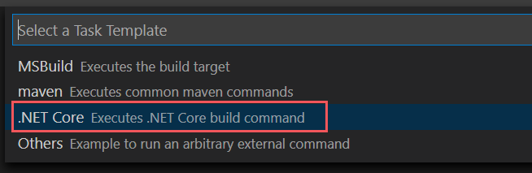

# <a name="double-key-encryption-dke"></a>Шифрование с двойным ключом (ДКЕ)

> *Применимо к: шифрование с двойным ключом для Microsoft 365 общедоступная Предварительная версия, [соответствие требованиям microsoft 365](https://www.microsoft.com/microsoft-365/business/compliance-management), [Azure Information Protection](https://azure.microsoft.com/pricing/details/information-protection)*
>
> *Инструкции для: [клиент единой метки Azure Information Protection для Windows](https://docs.microsoft.com/azure/information-protection/faqs.md#whats-the-difference-between-the-azure-information-protection-classic-and-unified-labeling-clients)*
>
> *Описание службы: [соответствие требованиям Microsoft 365](https://docs.microsoft.com/office365/servicedescriptions/microsoft-365-service-descriptions/microsoft-365-tenantlevel-services-licensing-guidance/microsoft-365-security-compliance-licensing-guidance)*

С помощью двойного шифрования (ДКЕ) для доступа к защищенному содержимому используются два ключа. Вы храните один ключ в Microsoft Azure, и вы держите другой ключ. Клиент единой метки Azure Information Protection защищает строго конфиденциальный контент, пока вы сохраняете полный контроль над одним из ваших ключей.

Двойное шифрование поддерживает развертывания как в облаке, так и в локальных развертываниях. Эти развертывания помогают убедиться, что зашифрованные данные остаются непрозрачными везде, где хранятся защищенные данные.

Дополнительные сведения о корневых ключах облачных клиентов по умолчанию можно найти в статье [планирование и реализация ключа клиента Azure Information Protection](https://docs.microsoft.com/azure/information-protection/plan-implement-tenant-key).

<!--
The following video shows how Double Key Encryption works to secure your content.

> [!VIDEO https://msit.microsoftstream.com/embed/video/f466a1ff-0400-a936-221c-f1eab45dc756]
-->

Если у вашей организации есть какие – либо из следующих требований, вы можете использовать ДКЕ для защиты своего содержимого:

- Вы хотите убедиться, что *только вы* можете расшифровывать защищенный контент при всех обстоятельствах.
- Вы не хотите, чтобы у корпорации Майкрософт был доступ к защищенным данным самостоятельно.
- Соблюдение нормативных требований для хранения ключей в пределах географической границы. Все ключи, которые вы удерживаете для шифрования и расшифровки данных, поддерживаются в центре обработки данных.

## <a name="system-and-licensing-requirements-for-dke"></a>Требования к системе и лицензированию для ДКЕ

С двойным ключом шифрования для Microsoft 365 поставляется Microsoft 365 а и Office 365. Если у вас нет лицензии на Microsoft 365, вы можете зарегистрироваться для получения [пробной версии](https://aka.ms/M365E5ComplianceTrial). Для получения дополнительных сведений об этих лицензиях обратитесь к разделу [руководство по лицензированию Microsoft 365 для обеспечения безопасности & соответствия требованиям](https://docs.microsoft.com/office365/servicedescriptions/microsoft-365-service-descriptions/microsoft-365-tenantlevel-services-licensing-guidance/microsoft-365-security-compliance-licensing-guidance).

**Предварительная сборка Office** Для использования общедоступной предварительной версии вы должны быть участником программы предварительной оценки Office. Чтобы присоединиться к программе предварительной оценки Office, перейдите на страницу [https://insider.office.com](https://insider.office.com) . Когда вы являетесь участником, подготовьте среду к развертыванию сборок для участников программы предварительной оценки Office, выбрав нужный метод развертывания для своей организации. Инструкции приведены в разделе [Начало работы по развертыванию сборок для участников программы предварительной оценки Office](https://insider.office.com/business/deploy).

**Azure Information Protection**. ДКЕ работает с метками конфиденциальности и требует использования Azure Information Protection.

## <a name="supported-environments-for-storing-and-viewing-dke-protected-content"></a>Поддерживаемые среды для хранения и просмотра защищенного ДКЕ контента

**Поддерживаемые приложения**. [Приложения Microsoft 365 для корпоративных](https://www.microsoft.com/microsoft-365/business/microsoft-365-apps-for-enterprise-product) клиентов в Windows, в том числе Word, Excel и PowerPoint.

**Поддержка интерактивного содержимого**. Документы и файлы, хранящиеся в Интернете, поддерживаются как в Microsoft SharePoint, так и в OneDrive для бизнеса. Вы можете предоставить доступ к зашифрованному содержимому по электронной почте, но вы не можете просматривать зашифрованные документы и файлы в Интернете. Вместо этого необходимо просмотреть защищенный контент с помощью классических приложений на локальном компьютере.

## <a name="about-this-public-preview-article"></a>Об этой общедоступной статье предварительной версии

Существует несколько способов выполнить некоторые действия по развертыванию двойного шифрования ключа. В этой статье приводятся подробные инструкции, позволяющие менее опытным администраторам успешно развертывать службу. Если вы умеете, можете использовать собственные методы.

В этой статье приведены пошаговые инструкции по развертыванию службы шифрования двойных ключей в Azure. Этот сценарий не является чем-то вероятным действием в рабочей среде. Для общедоступной предварительной версии с помощью Azure можно быстро развернуть ДКЕ. Развертывание в Azure позволяет начать использовать двойное шифрование ключа сразу.

Службу можно развернуть локально в сети или с помощью другого поставщика. Необходимо опубликовать хранилище ключей с помощью методов, подходящих для этого расположения.

## <a name="deploy-double-key-encryption"></a>Развертывание двойного шифрования ключей

В этой статье и видео о развертывании используется Azure в качестве места назначения развертывания для службы ДКЕ. При развертывании в другом расположении необходимо указать собственные значения.

Просмотрите [видеоролик о развертывании двойных ключей](https://youtu.be/vDWfHN_kygg) , чтобы просмотреть пошаговые инструкции по концепциям, представленным в этой статье. Для завершения видеоролика потребуется около 18 минут.

Ниже приведены общие действия по настройке шифрования с двойным ключом для Организации.

1. [Установка необходимого программного обеспечения](#install-software-prerequisites)
1. [Клонировать репозиторий GitHub шифрования с двойным ключом](#clone-the-dke-github-repository)
1. [Изменение параметров приложения](#modify-application-settings)
1. [Создание тестовых ключей](#generate-test-keys)
1. [Построение проекта](#build-the-project)
1. [Публикация хранилища ключей](#publish-the-key-store)
1. [Проверка развертывания](#validate-your-deployment)
1. [Регистрация своего хранилища ключей](#register-your-key-store)
1. [Создание меток конфиденциальности](#create-labels-using-dke)

После этого вы сможете зашифровать документы и файлы с помощью ДКЕ. Сведения о том, [как применить метки конфиденциальности к файлам и электронной почте в Office](https://support.microsoft.com/office/2f96e7cd-d5a4-403b-8bd7-4cc636bae0f9).

### <a name="install-software-prerequisites"></a>Установка необходимого программного обеспечения

Существует два типа требований к программному обеспечению для шифрования с двойным ключом.

- [Необходимые условия для службы шифрования с двойным шифрованием](#double-key-encryption-service-prerequisites)
- [Необходимые условия для шифрования с двойным ключом для клиентских компьютеров](#double-key-encryption-prerequisites-for-client-computers)

#### <a name="double-key-encryption-service-prerequisites"></a>Необходимые условия для службы шифрования с двойным шифрованием

Установите эти компоненты на компьютер, на котором необходимо установить службу ДКЕ.

**Пакет SDK для .NET Core 3,1**. Скачайте и установите пакет SDK из центра [загрузки .NET Core 3,1](https://dotnet.microsoft.com/download/dotnet-core/3.1).

**Visual Studio Code**. Скачайте Visual Studio Code FROM [https://code.visualstudio.com/](https://code.visualstudio.com) . После установки запустите Visual Studio Code и выберите **View** \> **Extensions**. Установите эти расширения.

- C# для Visual Studio Code

- Диспетчер пакетов NuGet

**Предварительная оценка Microsoft Office**. Настройте по крайней мере один [метод развертывания](https://insider.office.com/business/deploy).

**Ресурсы Git**. Скачайте и установите один из следующих элементов.

- [Git](https://git-scm.com/downloads)

- [Классическое приложение GitHub](https://desktop.github.com/)

- [GitHub Enterprise](https://github.com/enterprise)

**OpenSSL** Для [создания тестовых ключей](#generate-test-keys) после развертывания дке необходимо установить [OpenSSL](https://slproweb.com/products/Win32OpenSSL.html) . Убедитесь, что вы правильно вызываете его из пути переменных среды. Например, https://www.osradar.com/install-openssl-windows/ для получения дополнительных сведений обратитесь к разделу "Добавление каталога установки по пути".

#### <a name="double-key-encryption-prerequisites-for-client-computers"></a>Необходимые условия для шифрования с двойным ключом для клиентских компьютеров

Установите эти компоненты на каждом клиентском компьютере, на котором требуется защитить и использовать защищенные документы.

**Microsoft Office** версии *. 12711 или более поздней.

**Azure Information Protection единой метки версий клиентов** 2.7.93.0 или более поздней версии. Скачайте и установите клиент единой метки от [корпорации Майкрософт](https://www.microsoft.com/download/details.aspx?id=53018).

### <a name="clone-the-dke-github-repository"></a>Клонирование репозитория ДКЕ GitHub

Майкрософт предоставляет исходные файлы ДКЕ в репозитории GitHub. Необходимо клонировать репозиторий, чтобы создать проект локально для использования в Организации. Репозиторий GitHub ДКЕ находится по адресу [https://github.com/Azure-Samples/DoubleKeyEncryptionService](https://github.com/Azure-Samples/DoubleKeyEncryptionService) .

Следующие инструкции предназначены для неопытных пользователей Git или Visual Studio Code:

1. В браузере перейдите по адресу:[https://github.com/Azure-Samples/DoubleKeyEncryptionService](https://github.com/Azure-Samples/DoubleKeyEncryptionService)

1. В правой части экрана выберите **код**. В вашей версии пользовательского интерфейса может отображаться кнопка " **Копировать" или "скачать** ". Затем в появившемся раскрывающемся меню выберите значок Копировать, чтобы скопировать URL-адрес в буфер обмена.

    Пример:

   

3. В Visual Studio Code выберите пункт **Просмотреть** \> **палитру команд** и выберите **Git: Clone**. Чтобы перейти к параметру в списке, начните ввод, `git: clone` чтобы отфильтровать записи, а затем выберите его в раскрывающемся списке. Пример:

   

4. В текстовом поле вставьте URL-адрес, который вы скопировали из Git, и выберите **клон из GitHub**.

5. В появившемся диалоговом окне **Выбор папки** найдите и выберите расположение для хранения репозитория. В командной строки нажмите кнопку **Открыть**.

    Репозиторий открывается в Visual Studio Code и отображается в левом нижнем углу текущей ветви Git. Ветвь должна быть **основной**.

    Пример:

   

6. Выберите образец Word **,** а затем в списке ветвей выберите пункт **public_preview** .

   > [!IMPORTANT]
   > Выбор ветви public_preview позволяет убедиться, что у вас есть правильные файлы для построения проекта. Если не выбрать подходящую ветвь, произойдет ошибка развертывания.

Теперь исходный репозиторий ДКЕ настроен локально. Затем [измените параметры приложения](#modify-application-settings) для своей организации.

### <a name="modify-application-settings"></a>Изменение параметров приложения

Чтобы развернуть службу ДКЕ, необходимо изменить следующие типы параметров приложений:

- [Параметры доступа к ключам](#key-access-settings)
- [Параметры клиента и ключа](#tenant-and-key-settings)

Вы изменяете параметры приложения в appsettings.jsв файле. Этот файл находится в репозитории Даублекэйенкриптионсервице, который вы клонированы локально в Даублекэйенкриптионсервице\срк\кустомер-Кэй-Сторе. Например, в Visual Studio Code можно перейти к файлу, как показано на рисунке ниже.


#### <a name="key-access-settings"></a>Параметры доступа к ключам

Укажите, следует ли использовать авторизацию электронной почты или ролей. ДКЕ поддерживает только один из этих методов проверки подлинности за раз.

- **Авторизация электронной почты**. Позволяет Организации авторизовать доступ к ключам только в соответствии с адресами электронной почты.

- **Авторизация ролей**. Позволяет Организации авторизовать доступ к ключам на основе групп Active Directory и требовать, чтобы веб-служба могла запрашивать LDAP.

**Настройка параметров доступа к ключам для ДКЕ с помощью авторизации электронной почты**

1. Откройте **appsettings.js** файла и выберите `AuthorizedEmailAddress` параметр.

2. Добавьте адрес электронной почты или адреса, которые вы хотите авторизовать. Разделяйте адреса электронной почты двойными кавычками и запятыми. Пример:

   ```json
   "AuthorizedEmailAddress": ["email1@company.com", "email2@company.com ", "email3@company.com"]
   ```

3. Нахождение `LDAPPath` параметра и удаление текста `If role authorization is used then this is the LDAP path` между двойными кавычками. Оставьте двойные кавычки на месте. По завершении этот параметр должен выглядеть так, как показано ниже.

   ```json
   "LDAPPath": ""
   ```

4. Нахождение `AuthorizedRoles` параметра и удаление всей строки.

На этом рисунке показано, как правильно отформатировать **appsettings.jsв** файле для авторизации электронной почты.

   

**Настройка параметров доступа к ключам для ДКЕ с помощью авторизации ролей**

1. Откройте **appsettings.js** файла и выберите `AuthorizedRoles` параметр.

2. Добавьте имена групп Active Directory, которые вы хотите авторизовать. Разделяйте имена групп двойными кавычками и запятыми. Пример:

   ```json
   "AuthorizedRoles": ["group1", "group2", "group3"]
   ```

3. Нахождение `LDAPPath` параметра и добавление домена Active Directory. Пример:

   ```json
   "LDAPPath": "contoso.com"
   ```

4. Нахождение `AuthorizedEmailAddress` параметра и удаление всей строки.

На этом рисунке показано, как правильно отформатировать **appsettings.jsв** файле для авторизации роли.

   

#### <a name="tenant-and-key-settings"></a>Параметры клиента и ключа

Параметры клиента и ключа ДКЕ находятся в **appsettings.js** в файле.

**Настройка параметров клиента и ключа для ДКЕ**

1. Откройте **appsettings.jsв** файле.

2. Укажите `ValidIssuers` параметр и замените `<tenantid>` идентификатором клиента. Вы можете определить идентификатор клиента, перейдя на портал Azure и просмотрев [Свойства клиента](https://aad.portal.azure.com/#blade/Microsoft_AAD_IAM/ActiveDirectoryMenuBlade/Properties). Пример:

   ```json
   "ValidIssuers": [
     "https://sts.windows.net/9c99431e-b513-44be-a7d9-e7b500002d4b/"
   ]
   ```

Откройте файл `JwtAudience` . Замените `<yourhostname>` на имя узла компьютера, на котором будет запускаться служба дке. Пример:


  > [!IMPORTANT]
  > Значение `JwtAudience` должно *точно*совпадать с именем узла. При отладке вы можете использовать **localhost: 5001** . Однако после завершения отладки обязательно обновите это значение с помощью имени узла сервера.

- `TestKeys:Name`. Введите имя для ключа. Пример: `TestKey1`
- `TestKeys:Id`. Создайте GUID и введите его в качестве `TestKeys:ID` значения. Например, `DCE1CC21-FF9B-4424-8FF4-9914BD19A1BE`. Для случайного создания GUID можно использовать сайт, например, [генератор GUID в Интернете](https://guidgenerator.com/) .

На этом рисунке показан правильный формат параметров клиента и ключей в **appsettings.json**. `LDAPPath`настроена для авторизации роли.


### <a name="generate-test-keys"></a>Создание тестовых ключей

После определения параметров приложения вы можете создать общедоступные и закрытые тестовые ключи.

Для создания ключей:

1. В меню Пуск Windows выполните командную строку OpenSSL.

1. Перейдите к папке, в которой вы хотите сохранить тестовые ключи. Файлы, создаваемые при выполнении действий, описанных в этой задаче, хранятся в одной папке.

1. Создайте новый тестовый ключ.

   ```dos
   openssl req -x509 -newkey rsa:2048 -keyout key.pem -out cert.pem -days 365
   ```

2. Создайте закрытый ключ.

   ```dos
   openssl rsa -in key.pem -out privkeynopass.pem
   ```

1. Создайте открытый ключ.

   ```dos
   openssl rsa -in key.pem -pubout > pubkeyonly.pem
   ```

1. В текстовом редакторе откройте **пубкэйонли. pem**. Скопируйте весь контент из файла **пубкэйонли. pem** , за исключением первой и последней строки, в `PublicPem` раздел **appsettings.js** файла.

1. В текстовом редакторе откройте **привкэйнопасс. pem**. Скопируйте весь контент из файла **привкэйнопасс. pem** , за исключением первой и последней строки, в `PrivatePem` раздел **appsettings.js** файла.

1. Удалите все пробелы и символы новой строки в `PublicPem` разделах и и `PrivatePem` .

    > [!IMPORTANT]
    > При копировании этого контента не удаляйте какие бы то ни было данные PEM.

1. В Visual Studio Code перейдите к файлу **Startup.CS** . Этот файл находится в репозитории Даублекэйенкриптионсервице, который вы клонированы локально в Даублекэйенкриптионсервице\срк\кустомер-Кэй-сторе\.

2. Откройте следующие строки:

   ```c#
        #if USE_TEST_KEYS
        #error !!!!!!!!!!!!!!!!!!!!!! Use of test keys is only supported for testing,
        DO NOT USE  FOR PRODUCTION !!!!!!!!!!!!!!!!!!!!!!!!!!!!!
        services.AddSingleton<ippw.IKeyStore, ippw.TestKeyStore>();
        #endif
   ```

3. Замените эти строки следующим текстом:

   ```csharp
   services.AddSingleton<ippw.IKeyStore, ippw.TestKeyStore>();
   ```

   Конечный результат должен выглядеть примерно так, как показано ниже.

   

Теперь вы готовы к [созданию проекта дке](#build-the-project).

### <a name="build-the-project"></a>Построение проекта

Используйте следующие инструкции для локального создания проекта ДКЕ:

1. В Visual Studio Code в репозитории службы дке выберите пункт **Просмотреть** \> **палитру команд** и введите в командной строки команду **Build** .

1. В списке выберите **задачи: выполнение задачи сборки**.

   Если задач сборки нет, выберите **настроить задачу построения** и создайте ее для .NET Core следующим образом.

   

   1. Выберите **создать tasks.jsна основе шаблона**.

   

   2. В списке типов шаблонов выберите **.NET Core**.

   

   3. В разделе Build (построение) выберите путь к файлу **кустомеркэйсторе. csproj** . Если это не так, добавьте следующую строку:

      ```json
      "${workspaceFolder}/src/customer-key-store/customerkeystore.csproj",
      ```

  4. Снова запустите построение.

1. Убедитесь, что в окне вывода нет красных ошибок.

   При наличии красных ошибок проверьте вывод консоли. Убедитесь, что все предыдущие действия выполнены правильно, и в них имеются правильные версии сборки.

2. Чтобы отладить процесс, нажмите кнопку **выполнить** \> **Запуск отладки** . Если вам будет предложено выбрать среду, выберите пункт **.NET Core**.

Основной отладчик .NET, как правило, запускается в ' ' https://localhost:5001 `. To view your test key, go to ` https://localhost:5001 ' и добавляет косую черту (/) и имя ключа. Пример:

```https
https://localhost:5001/TestKey1
```

Ключ должен отображаться в формате JSON.

Теперь настройка завершена. Перед публикацией хранилища ключей в appsettings.jsдля параметра Жвтаудиенце убедитесь, что значение Hostname точно соответствует имени узла службы приложений. Возможно, вы изменили его на localhost, чтобы устранить неполадки с построением.

### <a name="publish-the-key-store"></a>Публикация хранилища ключей

Чтобы опубликовать хранилище ключей, вы создадите экземпляр службы приложений Azure для размещения вашего развертывания ДКЕ. Теперь вы публикуете созданные ключи в Azure.

**Создание экземпляра веб-приложения Azure для размещения развертывания ДКЕ**

1. В браузере Войдите на [портал Microsoft Azure](https://ms.portal.azure.com)и перейдите к разделу Добавление **служб приложений**  >  **Add**.

1. Выберите свою подписку и группу ресурсов и определите сведения об экземпляре.

    - Введите имя узла компьютера, на котором необходимо установить службу ДКЕ. Убедитесь, что это то же имя, которое задано для параметра Жвтаудиенце в [**appsettings.js**](#tenant-and-key-settings) файла. Значение, которое вы задаете для имени, также равно Вебаппинстанценаме.

    - Для **публикации**выберите **код**и для **стека времени выполнения**выберите **.NET Core 3,1**.

    Пример:

   

1. В нижней части страницы выберите пункт Просмотр и **Создание**, а затем нажмите кнопку **Добавить**.

1. Выполните одно из следующих действий, чтобы опубликовать созданные ключи в Azure:

    - [Публикация с помощью Зипдеплойуи](#publish-via-zipdeployui)
    - [Опубликовать через FTP](#publish-via-ftp)
    - [Публикация с помощью Visual Studio 2019 или более поздней версии](https://docs.microsoft.com/aspnet/core/tutorials/)
    - [Публикация в локальной системе](https://docs.microsoft.com/aspnet/core/tutorials/publish-to-iis?view=aspnetcore-3.1&tabs=netcore-cli)

    > [!NOTE]
    > Вы можете предпочесть другие методы для развертывания ключей. Выберите метод, который лучше всего подходит для вашей организации.

    > [!TIP]
    > [Публикация с помощью Visual Studio](https://docs.microsoft.com/aspnet/core/tutorials/) и [локальной системы](https://docs.microsoft.com/aspnet/core/tutorials/publish-to-iis?view=aspnetcore-3.1&tabs=netcore-cli) описана в [документации по ASP .NET](https://docs.microsoft.com/aspnet/core/). Если вы используете один из этих методов, откройте инструкции на отдельной вкладке, чтобы вы могли вернуться к ней, когда все будет готово.

#### <a name="publish-via-zipdeployui"></a>Публикация с помощью Зипдеплойуи

1. Перейдите на сайт `https://<WebAppInstanceName>.scm.azurewebsites.net/ZipDeployUI`.

    Пример: https://customerkeystoreforpublicpreview.scm.azurewebsites.net/ZipDeployUI

1. В базе кода для хранилища ключей перейдите в папку **Кустомер-Кэй-сторе\срк\кустомер-Кэй-Сторе** и убедитесь, что эта папка содержит файл **кустомеркэйсторе. csproj** .

1. Выполнить: **Публикация DotNet**

     В окне вывода отображается каталог, в котором была развернута публикация.

    Пример: `customer-key-store\src\customer-key-store\bin\Debug\netcoreapp3.1\publish\`

1. Отправьте все файлы в каталоге публикации в ZIP-файл. При создании ZIP-файла убедитесь, что все файлы в каталоге находятся на корневом уровне ZIP-файла.

1. Перетащите созданный ZIP-файл на сайт Зипдеплойуи, который вы открыли ранее. Пример: https://customerkeystoreforpublicpreview.scm.azurewebsites.net/ZipDeployUI

ДКЕ развернута, и вы можете перейти к созданным тестовым ключам. Продолжите [проверку развертывания](#validate-your-deployment) ниже.

#### <a name="publish-via-ftp"></a>Опубликовать через FTP

1. Подключитесь к службе приложений, созданной [ранее](#publish-the-key-store).

    В браузере перейдите по адресу: **Azure portal**  >  центр развертывания**службы приложений**портала Azure  >  **Deployment Center**  >  **развертывание**  >  **FTP**  >  **панели мониторинга**FTP.

1. Скопируйте строки подключения, отображаемые в локальный файл. Эти строки будут использоваться для подключения к службе веб-приложений и отправки файлов через FTP.

    Пример:

   

1. В базе кода для хранилища ключей перейдите в **Каталог Кустомер-Кэй-сторе\срк\кустомер-Кэй-Сторе**.

1. Убедитесь, что этот каталог содержит файл **кустомеркэйсторе. csproj** .

1. Выполнить: **Публикация DotNet**

    Выходные данные содержат каталог, в котором развернута публикация.

    Пример: `customer-key-store\src\customer-key-store\bin\Debug\netcoreapp3.1\publish\`

1. Отправьте все файлы в каталоге публикации в ZIP-файл. При создании ZIP-файла убедитесь, что все файлы в каталоге находятся на корневом уровне ZIP-файла.

1. В клиенте FTP используйте сведения о подключении, скопированные для подключения к службе приложений. Отправьте ZIP-файл, созданный на предыдущем шаге, в корневой каталог веб-приложения.

ДКЕ развернута, и вы можете перейти к созданным тестовым ключам. Затем [Подтвердите развертывание](#validate-your-deployment).

### <a name="validate-your-deployment"></a>Проверка развертывания

После развертывания ДКЕ с помощью одного из методов, описанных выше, проверяйте развертывание и параметры хранилища ключей.

Выполните команду: 

src\customer-key-store\scripts\key_store_tester.ps1 микэйстореурл/микэй

Пример:

key_store_tester.ps1https://mycustomerkeystore.com/mykey

Убедитесь, что в выходных данных не отображаются ошибки. Когда вы будете готовы, [Зарегистрируйте свое хранилище ключей](#register-your-key-store).

## <a name="register-your-key-store"></a>Регистрация своего хранилища ключей

Следующие действия позволяют зарегистрировать свое хранилище ключей. Регистрация основного хранилища — это последний шаг в развертывании ДКЕ, прежде чем вы сможете создавать метки.

Чтобы зарегистрировать свое хранилище ключей:

1. В браузере откройте [портал Microsoft Azure](https://ms.portal.azure.com/)и перейдите ко **всем** \> **Identity** \> **регистрациям приложений**удостоверений для служб.

2. Нажмите кнопку **создать регистрацию**и введите понятное имя.

3. Выберите тип учетной записи в отображаемых параметрах.

    Если вы используете Microsoft Azure с нестандартным доменом, например **onmicrosoft.com**, выберите **учетные записи только в данном организационном каталоге (только Microsoft — один клиент).**

    Пример:

   

4. В нижней части страницы выберите пункт **Регистрация** , чтобы создать новую регистрацию приложения.

5. В разделе Управление новой регистрацией приложения в разделе **Управление**выберите **Проверка подлинности**.

6. Выберите **элемент добавить платформу**.
 
7. В меню **Настройка платформы** выберите пункт **веб**.
 
8. В разделе **URI перенаправления**введите универсальный код ресурса (URI) для службы шифрования двойных ключей. Введите URL-адрес службы приложений, включая имя узла и домен.

    Пример: https://mycustomerkeystoretest.com

    - Введенный URL-адрес должен быть соответствующим имени узла, на котором развернуто ваше хранилище ключей.
    - Если вы тестируете локально с помощью Visual Studio, используйте **https://localhost:5001** .
    - Во всех случаях схема должна иметь значение **HTTPS**.

    Убедитесь, что имя узла совпадает с именем узла службы приложений. Возможно, вы изменили его на `localhost` "Устранение неполадок сборки". В **appsettings.json**это имя узла, для которого задано значение `JwtAudience` .

6. В разделе **неявное предоставление разрешений**установите флажок **маркеры ID** .

1. Нажмите кнопку **Сохранить**, чтобы сохранить изменения.

7. В левой области выберите **Показать API**, а затем рядом с URI идентификатора приложения выберите **Set (установить**).

9. По-прежнему откройте страницу **API** , в области **области, определяемые этой** областью API выберите **Добавить область**. В новой области:

    1. Определите имя области как **user_impersonation**.

    2. Выберите администраторов и пользователей, которым разрешено согласие.

    3. Определите все остальные необходимые значения.

    4. Выберите **Добавить область.**

    В верхней части нажмите кнопку **сохранить** , чтобы сохранить изменения.

10. По-прежнему на странице " **предоставление доступа к API** " в области **Авторизованные клиентские приложения** выберите **добавить клиентское приложение**.

    В новом клиентском приложении:

    1. Определите идентификатор клиента как **d3590ed6-52b3-4102-aeff-aad2292ab01c**. Это значение является ИДЕНТИФИКАТОРом клиента Microsoft Office и позволяет Office получить маркер доступа для вашего хранилища ключей.

    2. В разделе **Разрешенные области**выберите область **user_impersonation** .

    3. Нажмите кнопку **Добавить приложение**.

    4. В верхней части нажмите кнопку **сохранить** , чтобы сохранить изменения.

Теперь ваше хранилище ключей ДКЕ зарегистрировано. Продолжите [Создание меток с помощью дке](#create-labels-using-dke).

## <a name="create-labels-using-dke"></a>Создание меток с помощью ДКЕ

В центре соответствия требованиям Microsoft 365 создайте новую метку чувствительности и примените шифрование, как в противном случае. Выберите **использовать шифрование с двойным ключом** и введите URL-адрес конечной точки для своего ключа.

Пример:


Все добавляемые метки ДКЕ будут отображаться для пользователей в последних версиях приложений Microsoft 365 для предприятий.

> [!NOTE]
> Для обновления клиентов с новыми метками может потребоваться до 24 часов.

### <a name="enable-dke-in-your-client"></a>Включение ДКЕ в клиенте

Включите ДКЕ для клиента, добавив следующие разделы реестра:

```properties
    [HKEY_LOCAL_MACHINE\SOFTWARE\WOW6432Node\Microsoft\MSIPC\flighting]
    "DoubleKeyProtection"=dword:00000001

    [HKEY_LOCAL_MACHINE\SOFTWARE\Microsoft\MSIPC\flighting]
    "DoubleKeyProtection"=dword:00000001
```
