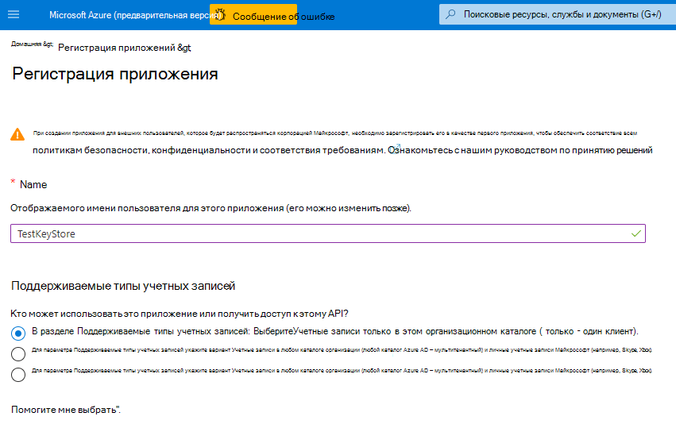

# <a name="double-key-encryption-for-microsoft-365"></a><span data-ttu-id="41a4c-103">Шифрование с двойным ключом для Microsoft 365</span><span class="sxs-lookup"><span data-stu-id="41a4c-103">Double Key Encryption for Microsoft 365</span></span>

> <span data-ttu-id="41a4c-104">*Область применения: шифрование с двойным ключом для Microsoft 365, [соответствие требованиям microsoft 365](https://www.microsoft.com/microsoft-365/business/compliance-management), [Azure Information Protection](https://azure.microsoft.com/pricing/details/information-protection)*</span><span class="sxs-lookup"><span data-stu-id="41a4c-104">*Applies to: Double Key Encryption for Microsoft 365, [Microsoft 365 Compliance](https://www.microsoft.com/microsoft-365/business/compliance-management), [Azure Information Protection](https://azure.microsoft.com/pricing/details/information-protection)*</span></span>
>
> <span data-ttu-id="41a4c-105">*Инструкции для: [клиент единой метки Azure Information Protection для Windows](https://docs.microsoft.com/azure/information-protection/faqs#whats-the-difference-between-the-azure-information-protection-classic-and-unified-labeling-clients)*</span><span class="sxs-lookup"><span data-stu-id="41a4c-105">*Instructions for: [Azure Information Protection unified labeling client for Windows](https://docs.microsoft.com/azure/information-protection/faqs#whats-the-difference-between-the-azure-information-protection-classic-and-unified-labeling-clients)*</span></span>
>
> <span data-ttu-id="41a4c-106">*Описание службы: [соответствие требованиям Microsoft 365](https://docs.microsoft.com/office365/servicedescriptions/microsoft-365-service-descriptions/microsoft-365-tenantlevel-services-licensing-guidance/microsoft-365-security-compliance-licensing-guidance)*</span><span class="sxs-lookup"><span data-stu-id="41a4c-106">*Service description for: [Microsoft 365 Compliance](https://docs.microsoft.com/office365/servicedescriptions/microsoft-365-service-descriptions/microsoft-365-tenantlevel-services-licensing-guidance/microsoft-365-security-compliance-licensing-guidance)*</span></span>

<span data-ttu-id="41a4c-107">С помощью двойного шифрования (ДКЕ) для доступа к защищенному содержимому используются два ключа.</span><span class="sxs-lookup"><span data-stu-id="41a4c-107">Double Key Encryption (DKE) uses two keys together to access protected content.</span></span> <span data-ttu-id="41a4c-108">Корпорация Майкрософт хранит один ключ в Microsoft Azure, и вы держите другой ключ.</span><span class="sxs-lookup"><span data-stu-id="41a4c-108">Microsoft stores one key in Microsoft Azure, and you hold the other key.</span></span> <span data-ttu-id="41a4c-109">Вы обеспечиваете полный контроль над одним из ваших ключей с помощью службы шифрования двойных ключей.</span><span class="sxs-lookup"><span data-stu-id="41a4c-109">You maintain full control of one of your keys using the Double Key Encryption service.</span></span> <span data-ttu-id="41a4c-110">Вы применяете защиту, используя унифицированный клиент меток Azure Information Protection к высоко конфиденциальному контенту.</span><span class="sxs-lookup"><span data-stu-id="41a4c-110">You apply protection using The Azure Information Protection unified labeling client to your highly sensitive content.</span></span>

<span data-ttu-id="41a4c-111">Двойное шифрование поддерживает развертывания как в облаке, так и в локальных развертываниях.</span><span class="sxs-lookup"><span data-stu-id="41a4c-111">Double Key Encryption supports both cloud and on-premises deployments.</span></span> <span data-ttu-id="41a4c-112">Эти развертывания помогают убедиться, что зашифрованные данные остаются непрозрачными везде, где хранятся защищенные данные.</span><span class="sxs-lookup"><span data-stu-id="41a4c-112">These deployments help to ensure that encrypted data remains opaque wherever you store the protected data.</span></span>

<span data-ttu-id="41a4c-113">Дополнительные сведения о корневых ключах облачных клиентов по умолчанию можно найти в статье [планирование и реализация ключа клиента Azure Information Protection](https://docs.microsoft.com/azure/information-protection/plan-implement-tenant-key).</span><span class="sxs-lookup"><span data-stu-id="41a4c-113">For more information about the default, cloud-based tenant root keys, see [Planning and implementing your Azure Information Protection tenant key](https://docs.microsoft.com/azure/information-protection/plan-implement-tenant-key).</span></span>

## <a name="when-your-organization-should-adopt-dke"></a><span data-ttu-id="41a4c-114">Когда Организация должна принять ДКЕ</span><span class="sxs-lookup"><span data-stu-id="41a4c-114">When your organization should adopt DKE</span></span>

<span data-ttu-id="41a4c-115">Двойное ключевое Шифрование предназначено для наиболее важных данных, которые подчиняются самым жестким требованиям к защите.</span><span class="sxs-lookup"><span data-stu-id="41a4c-115">Double Key Encryption is intended for your most sensitive data that is subject to the strictest protection requirements.</span></span> <span data-ttu-id="41a4c-116">ДКЕ не предназначен для всех данных.</span><span class="sxs-lookup"><span data-stu-id="41a4c-116">DKE is not intended for all data.</span></span> <span data-ttu-id="41a4c-117">Как правило, вы будете использовать двойное шифрование ключа для защиты только очень небольшой части общих данных.</span><span class="sxs-lookup"><span data-stu-id="41a4c-117">In general, you'll be using Double Key Encryption to protect only a very small part of your overall data.</span></span> <span data-ttu-id="41a4c-118">Для определения правильных данных, которые будут обсуждаться с этим решением перед развертыванием, следует выполнить эту экспертизу.</span><span class="sxs-lookup"><span data-stu-id="41a4c-118">You should do due diligence in identifying the right data to cover with this solution before you deploy.</span></span> <span data-ttu-id="41a4c-119">В некоторых случаях может потребоваться сузить область и использовать другие решения для большинства данных, таких как защита информации Майкрософт с помощью управляемых Майкрософт ключей или БЙОК.</span><span class="sxs-lookup"><span data-stu-id="41a4c-119">In some cases, you might need to narrow your scope and make use of other solutions for the majority of your data such as Microsoft Information Protection with Microsoft-managed keys or BYOK.</span></span> <span data-ttu-id="41a4c-120">Эти решения достаточны для документов, которые не подвержены повышенной защите и нормативным требованиям.</span><span class="sxs-lookup"><span data-stu-id="41a4c-120">These solutions are sufficient for documents that aren't subject to enhanced protections and regulatory requirements.</span></span> <span data-ttu-id="41a4c-121">Кроме того, эти решения позволяют использовать самые мощные службы Office 365. службы, которые нельзя использовать с зашифрованным содержимым ДКЕ.</span><span class="sxs-lookup"><span data-stu-id="41a4c-121">Also, these solutions enable you to use the most powerful Office 365 services; services that you can't use with DKE encrypted content.</span></span> <span data-ttu-id="41a4c-122">Например:</span><span class="sxs-lookup"><span data-stu-id="41a4c-122">For example:</span></span>

- <span data-ttu-id="41a4c-123">Правила транспорта, в том числе защита от вредоносных программ и спама, требующих отображения вложения</span><span class="sxs-lookup"><span data-stu-id="41a4c-123">Transport rules including anti-malware and spam that require visibility into the attachment</span></span>
- <span data-ttu-id="41a4c-124">Microsoft delve</span><span class="sxs-lookup"><span data-stu-id="41a4c-124">Microsoft Delve</span></span>
- <span data-ttu-id="41a4c-125">Обнаружение электронных данных</span><span class="sxs-lookup"><span data-stu-id="41a4c-125">eDiscovery</span></span>
- <span data-ttu-id="41a4c-126">Поиск контента и индексирование</span><span class="sxs-lookup"><span data-stu-id="41a4c-126">Content search and indexing</span></span>
- <span data-ttu-id="41a4c-127">Office Web Apps, включая функции совместного редактирования</span><span class="sxs-lookup"><span data-stu-id="41a4c-127">Office Web Apps including co-authoring functionality</span></span>

<span data-ttu-id="41a4c-128">Все внешние приложения и службы, не интегрированные с ДКЕ через пакет SDK МИП, не смогут выполнять действия с зашифрованными данными.</span><span class="sxs-lookup"><span data-stu-id="41a4c-128">Any external applications or services that are not integrated with DKE through the MIP SDK will be unable to perform actions on the encrypted data.</span></span>

<span data-ttu-id="41a4c-129">Пакет SDK Microsoft Information Protection 1.7 + поддерживает шифрование с двойным ключом; приложения, которые интегрируются с нашим пакетом SDK, смогут по полагаться на эти данные с достаточными разрешениями и интеграцией.</span><span class="sxs-lookup"><span data-stu-id="41a4c-129">The Microsoft Information Protection SDK 1.7+ supports Double Key Encryption; applications that integrate with our SDK will be able to reason over this data with sufficient permissions and integrations in place.</span></span>

<span data-ttu-id="41a4c-130">Мы рекомендуем организациям использовать возможности Microsoft Information Protection (классификацию и метки) для защиты большинства конфиденциальных данных и использовать только ДКЕ для важных данных.</span><span class="sxs-lookup"><span data-stu-id="41a4c-130">We recommend organizations use Microsoft Information protection capabilities (classification and labeling) to protect most of their sensitive data and only use DKE for their mission-critical data.</span></span> <span data-ttu-id="41a4c-131">Двойное ключевое шифрование особенно важно для чрезвычайно конфиденциальных данных в строго регулируемых отраслях, таких как финансовые услуги и здравоохранение.</span><span class="sxs-lookup"><span data-stu-id="41a4c-131">Double Key Encryption is particularly relevant for extremely sensitive data in highly regulated industries such as Financial services and Healthcare.</span></span>

<span data-ttu-id="41a4c-132">Если у вашей организации есть какие – либо из следующих требований, вы можете использовать ДКЕ для защиты своего содержимого:</span><span class="sxs-lookup"><span data-stu-id="41a4c-132">If your organizations have any of the following requirements, you can use DKE to help secure your content:</span></span>

- <span data-ttu-id="41a4c-133">Вы хотите убедиться, что *только вы* можете расшифровывать защищенный контент при всех обстоятельствах.</span><span class="sxs-lookup"><span data-stu-id="41a4c-133">You want to ensure that *only you* can ever decrypt protected content, under all circumstances.</span></span>
- <span data-ttu-id="41a4c-134">Вы не хотите, чтобы у корпорации Майкрософт был доступ к защищенным данным самостоятельно.</span><span class="sxs-lookup"><span data-stu-id="41a4c-134">You don't want Microsoft to have access to protected data on its own.</span></span>
- <span data-ttu-id="41a4c-135">Соблюдение нормативных требований для хранения ключей в пределах географической границы.</span><span class="sxs-lookup"><span data-stu-id="41a4c-135">You have regulatory requirements to hold keys within a geographical boundary.</span></span> <span data-ttu-id="41a4c-136">Все ключи, которые вы удерживаете для шифрования и расшифровки данных, поддерживаются в центре обработки данных.</span><span class="sxs-lookup"><span data-stu-id="41a4c-136">All of the keys that you hold for data encryption and decryption are maintained in your data center.</span></span>

## <a name="system-and-licensing-requirements-for-dke"></a><span data-ttu-id="41a4c-137">Требования к системе и лицензированию для ДКЕ</span><span class="sxs-lookup"><span data-stu-id="41a4c-137">System and licensing requirements for DKE</span></span>

<span data-ttu-id="41a4c-138">С **двойным ключом шифрования для microsoft 365** поставляется Microsoft 365 а и Office 365.</span><span class="sxs-lookup"><span data-stu-id="41a4c-138">**Double Key Encryption for Microsoft 365** comes with Microsoft 365 E5 and Office 365 E5.</span></span> <span data-ttu-id="41a4c-139">Если у вас нет лицензии на Microsoft 365, вы можете зарегистрироваться для получения [пробной версии](https://aka.ms/M365E5ComplianceTrial).</span><span class="sxs-lookup"><span data-stu-id="41a4c-139">If you don’t have a Microsoft 365 E5 license, you can sign up for a [trial](https://aka.ms/M365E5ComplianceTrial).</span></span> <span data-ttu-id="41a4c-140">Для получения дополнительных сведений об этих лицензиях обратитесь к разделу [руководство по лицензированию Microsoft 365 для обеспечения безопасности & соответствия требованиям](https://docs.microsoft.com/office365/servicedescriptions/microsoft-365-service-descriptions/microsoft-365-tenantlevel-services-licensing-guidance/microsoft-365-security-compliance-licensing-guidance).</span><span class="sxs-lookup"><span data-stu-id="41a4c-140">For more information about these licenses, see [Microsoft 365 licensing guidance for security & compliance](https://docs.microsoft.com/office365/servicedescriptions/microsoft-365-service-descriptions/microsoft-365-tenantlevel-services-licensing-guidance/microsoft-365-security-compliance-licensing-guidance).</span></span>

<span data-ttu-id="41a4c-141">**Azure Information Protection**.</span><span class="sxs-lookup"><span data-stu-id="41a4c-141">**Azure Information Protection**.</span></span> <span data-ttu-id="41a4c-142">ДКЕ работает с метками конфиденциальности и требует использования Azure Information Protection.</span><span class="sxs-lookup"><span data-stu-id="41a4c-142">DKE works with sensitivity labels and requires Azure Information Protection.</span></span>

<span data-ttu-id="41a4c-143">Метки конфиденциальности ДКЕ становятся доступными для конечных пользователей с помощью ленты "чувствительность" в приложениях Office для настольных ПК.</span><span class="sxs-lookup"><span data-stu-id="41a4c-143">DKE sensitivity labels are made available to end-users through the sensitivity ribbon in Office Desktop Apps.</span></span> <span data-ttu-id="41a4c-144">Установите эти компоненты на каждом клиентском компьютере, на котором требуется защитить и использовать защищенные документы.</span><span class="sxs-lookup"><span data-stu-id="41a4c-144">Install these prerequisites on each client computer where you want to protect and consume protected documents.</span></span>

<span data-ttu-id="41a4c-145">**Приложения Microsoft Office для Enterprise** версии \*. 12711 или более поздней (настольные версии Word, PowerPoint и Excel) в Windows.</span><span class="sxs-lookup"><span data-stu-id="41a4c-145">**Microsoft Office Apps for enterprise** version \*.12711 or later (Desktop versions of Word, PowerPoint, and Excel) on Windows.</span></span>

<span data-ttu-id="41a4c-146">**Azure Information Protection единой метки версий клиентов** 2.7.93.0 или более поздней версии.</span><span class="sxs-lookup"><span data-stu-id="41a4c-146">**Azure Information Protection Unified Labeling Client** versions 2.7.93.0 or later.</span></span> <span data-ttu-id="41a4c-147">Скачайте и установите клиент единой метки из [центра загрузки Майкрософт](https://www.microsoft.com/download/details.aspx?id=53018).</span><span class="sxs-lookup"><span data-stu-id="41a4c-147">Download and install the Unified Labeling client from the [Microsoft download center](https://www.microsoft.com/download/details.aspx?id=53018).</span></span>

## <a name="supported-environments-for-storing-and-viewing-dke-protected-content"></a><span data-ttu-id="41a4c-148">Поддерживаемые среды для хранения и просмотра защищенного ДКЕ контента</span><span class="sxs-lookup"><span data-stu-id="41a4c-148">Supported environments for storing and viewing DKE-protected content</span></span>

<span data-ttu-id="41a4c-149">**Поддерживаемые приложения**.</span><span class="sxs-lookup"><span data-stu-id="41a4c-149">**Supported applications**.</span></span> <span data-ttu-id="41a4c-150">[Приложения Microsoft 365 для корпоративных](https://www.microsoft.com/microsoft-365/business/microsoft-365-apps-for-enterprise-product) клиентов в Windows, в том числе Word, Excel и PowerPoint.</span><span class="sxs-lookup"><span data-stu-id="41a4c-150">[Microsoft 365 Apps for enterprise](https://www.microsoft.com/microsoft-365/business/microsoft-365-apps-for-enterprise-product) clients on Windows, including Word, Excel, and PowerPoint.</span></span>

<span data-ttu-id="41a4c-151">**Поддержка интерактивного содержимого**.</span><span class="sxs-lookup"><span data-stu-id="41a4c-151">**Online content support**.</span></span> <span data-ttu-id="41a4c-152">Документы и файлы, хранящиеся в Интернете, поддерживаются как в Microsoft SharePoint, так и в OneDrive для бизнеса.</span><span class="sxs-lookup"><span data-stu-id="41a4c-152">Documents and files stored online in both Microsoft SharePoint and OneDrive for Business are supported.</span></span> <span data-ttu-id="41a4c-153">Вы можете предоставить доступ к зашифрованному содержимому по электронной почте, но вы не можете просматривать зашифрованные документы и файлы в Интернете.</span><span class="sxs-lookup"><span data-stu-id="41a4c-153">You can share encrypted content by email, but you can't view encrypted documents and files online.</span></span> <span data-ttu-id="41a4c-154">Вместо этого необходимо просмотреть защищенный контент с помощью классических приложений на локальном компьютере.</span><span class="sxs-lookup"><span data-stu-id="41a4c-154">Instead, you must view protected content using the desktop apps on your local computer.</span></span>

## <a name="overview-of-deploying-dke"></a><span data-ttu-id="41a4c-155">Общие сведения о развертывании ДКЕ</span><span class="sxs-lookup"><span data-stu-id="41a4c-155">Overview of deploying DKE</span></span>

<span data-ttu-id="41a4c-156">Ниже приведены общие действия по настройке ДКЕ.</span><span class="sxs-lookup"><span data-stu-id="41a4c-156">You'll follow these general steps to set up DKE.</span></span> <span data-ttu-id="41a4c-157">После выполнения этих действий конечные пользователи смогут защищать конфиденциальные данные с помощью двойного шифрования.</span><span class="sxs-lookup"><span data-stu-id="41a4c-157">Once you've completed these steps, your end users will be able to protect your highly sensitive data with Double Key Encryption.</span></span>

1. <span data-ttu-id="41a4c-158">Разверните службу ДКЕ, как описано в этой статье.</span><span class="sxs-lookup"><span data-stu-id="41a4c-158">Deploy the DKE service as described in this article.</span></span>

2. <span data-ttu-id="41a4c-159">Создайте метку с двойным шифрованием.</span><span class="sxs-lookup"><span data-stu-id="41a4c-159">Create a label with Double Key Encryption.</span></span> <span data-ttu-id="41a4c-160">Перейдите к разделу защита информации в [центре соответствия требованиям Microsoft 365](https://compliance.microsoft.com) и создайте новую метку с двойным ключом шифрования.</span><span class="sxs-lookup"><span data-stu-id="41a4c-160">Navigate to Information protection under the [Microsoft 365 compliance center](https://compliance.microsoft.com) and create a new label with Double Key Encryption.</span></span> <span data-ttu-id="41a4c-161">[В разделе ограничение доступа к содержимому с помощью меток конфиденциальности для применения шифрования](https://docs.microsoft.com/microsoft-365/compliance/encryption-sensitivity-labels).</span><span class="sxs-lookup"><span data-stu-id="41a4c-161">See [Restrict access to content by using sensitivity labels to apply encryption](https://docs.microsoft.com/microsoft-365/compliance/encryption-sensitivity-labels).</span></span>

3. <span data-ttu-id="41a4c-162">Используйте двойные метки шифрования ключей.</span><span class="sxs-lookup"><span data-stu-id="41a4c-162">Use Double Key Encryption labels.</span></span> <span data-ttu-id="41a4c-163">Защитите данные, выбрав двойную зашифрованную метку на ленте "чувствительность" в Microsoft Office.</span><span class="sxs-lookup"><span data-stu-id="41a4c-163">Protect data by selecting the Double Key Encrypted label from the Sensitivity ribbon in Microsoft Office.</span></span>

<span data-ttu-id="41a4c-164">Существует несколько способов выполнить некоторые действия по развертыванию двойного шифрования ключа.</span><span class="sxs-lookup"><span data-stu-id="41a4c-164">There are several ways you can complete some of the steps to deploy Double Key Encryption.</span></span> <span data-ttu-id="41a4c-165">В этой статье приводятся подробные инструкции, позволяющие менее опытным администраторам успешно развертывать службу.</span><span class="sxs-lookup"><span data-stu-id="41a4c-165">This article provides detailed instructions so that less experienced admins successfully deploy the service.</span></span> <span data-ttu-id="41a4c-166">Если вы умеете, можете использовать собственные методы.</span><span class="sxs-lookup"><span data-stu-id="41a4c-166">If you're comfortable doing so, you can choose to use your own methods.</span></span>

## <a name="deploy-dke"></a><span data-ttu-id="41a4c-167">Развертывание ДКЕ</span><span class="sxs-lookup"><span data-stu-id="41a4c-167">Deploy DKE</span></span>

<span data-ttu-id="41a4c-168">В этой статье и видео о развертывании используется Azure в качестве места назначения развертывания для службы ДКЕ.</span><span class="sxs-lookup"><span data-stu-id="41a4c-168">This article and the deployment video use Azure as the deployment destination for the DKE service.</span></span> <span data-ttu-id="41a4c-169">При развертывании в другом расположении необходимо указать собственные значения.</span><span class="sxs-lookup"><span data-stu-id="41a4c-169">If you're deploying to another location, you'll need to provide your own values.</span></span>

<span data-ttu-id="41a4c-170">Просмотрите [видеоролик о развертывании двойных ключей](https://youtu.be/vDWfHN_kygg) , чтобы просмотреть пошаговые инструкции по концепциям, описанным в этой статье.</span><span class="sxs-lookup"><span data-stu-id="41a4c-170">Watch the [Double Key Encryption deployment video](https://youtu.be/vDWfHN_kygg) to see a step-by-step overview of the concepts in this article.</span></span> <span data-ttu-id="41a4c-171">Для завершения видеоролика потребуется около 18 минут.</span><span class="sxs-lookup"><span data-stu-id="41a4c-171">The video takes about 18 minutes to complete.</span></span>

<span data-ttu-id="41a4c-172">Ниже приведены общие действия по настройке шифрования с двойным ключом для Организации.</span><span class="sxs-lookup"><span data-stu-id="41a4c-172">You'll follow these general steps to set up Double Key Encryption for your organization.</span></span>

1. [<span data-ttu-id="41a4c-173">Установка необходимого программного обеспечения для службы ДКЕ</span><span class="sxs-lookup"><span data-stu-id="41a4c-173">Install software prerequisites for the DKE service</span></span>](#install-software-prerequisites-for-the-dke-service)
1. [<span data-ttu-id="41a4c-174">Клонировать репозиторий GitHub шифрования с двойным ключом</span><span class="sxs-lookup"><span data-stu-id="41a4c-174">Clone the Double Key Encryption GitHub repository</span></span>](#clone-the-dke-github-repository)
1. [<span data-ttu-id="41a4c-175">Изменение параметров приложения</span><span class="sxs-lookup"><span data-stu-id="41a4c-175">Modify application settings</span></span>](#modify-application-settings)
1. [<span data-ttu-id="41a4c-176">Создание тестовых ключей</span><span class="sxs-lookup"><span data-stu-id="41a4c-176">Generate test keys</span></span>](#generate-test-keys)
1. [<span data-ttu-id="41a4c-177">Построение проекта</span><span class="sxs-lookup"><span data-stu-id="41a4c-177">Build the project</span></span>](#build-the-project)
1. [<span data-ttu-id="41a4c-178">Развертывание службы ДКЕ и публикация хранилища ключей</span><span class="sxs-lookup"><span data-stu-id="41a4c-178">Deploy the DKE service and publish the key store</span></span>](#deploy-the-dke-service-and-publish-the-key-store)
1. [<span data-ttu-id="41a4c-179">Проверка развертывания</span><span class="sxs-lookup"><span data-stu-id="41a4c-179">Validate your deployment</span></span>](#validate-your-deployment)
1. [<span data-ttu-id="41a4c-180">Регистрация своего хранилища ключей</span><span class="sxs-lookup"><span data-stu-id="41a4c-180">Register your key store</span></span>](#register-your-key-store)
1. [<span data-ttu-id="41a4c-181">Создание меток конфиденциальности с помощью ДКЕ</span><span class="sxs-lookup"><span data-stu-id="41a4c-181">Create sensitivity labels using DKE</span></span>](#create-sensitivity-labels-using-dke)
1. [<span data-ttu-id="41a4c-182">Включение ДКЕ в клиенте</span><span class="sxs-lookup"><span data-stu-id="41a4c-182">Enable DKE in your client</span></span>](#enable-dke-in-your-client)
1. [<span data-ttu-id="41a4c-183">Перенос защищенных файлов из меток ХЙОК в метки ДКЕ</span><span class="sxs-lookup"><span data-stu-id="41a4c-183">Migrate protected files from HYOK labels to DKE labels</span></span>](#migrate-protected-files-from-hyok-labels-to-dke-labels)

<span data-ttu-id="41a4c-184">После этого вы сможете зашифровать документы и файлы с помощью ДКЕ.</span><span class="sxs-lookup"><span data-stu-id="41a4c-184">When you're done, you can encrypt documents and files using DKE.</span></span> <span data-ttu-id="41a4c-185">Сведения о том, [как применить метки конфиденциальности к файлам и электронной почте в Office](https://support.microsoft.com/office/2f96e7cd-d5a4-403b-8bd7-4cc636bae0f9).</span><span class="sxs-lookup"><span data-stu-id="41a4c-185">For information, see [Apply sensitivity labels to your files and email in Office](https://support.microsoft.com/office/2f96e7cd-d5a4-403b-8bd7-4cc636bae0f9).</span></span>

### <a name="install-software-prerequisites-for-the-dke-service"></a><span data-ttu-id="41a4c-186">Установка необходимого программного обеспечения для службы ДКЕ</span><span class="sxs-lookup"><span data-stu-id="41a4c-186">Install software prerequisites for the DKE service</span></span>

<span data-ttu-id="41a4c-187">Установите эти компоненты на компьютер, на котором необходимо установить службу ДКЕ.</span><span class="sxs-lookup"><span data-stu-id="41a4c-187">Install these prerequisites on the computer where you want to install the DKE service.</span></span>

<span data-ttu-id="41a4c-188">**Пакет SDK для .NET Core 3,1**.</span><span class="sxs-lookup"><span data-stu-id="41a4c-188">**.NET Core 3.1 SDK**.</span></span> <span data-ttu-id="41a4c-189">Скачайте и установите пакет SDK из центра [загрузки .NET Core 3,1](https://dotnet.microsoft.com/download/dotnet-core/3.1).</span><span class="sxs-lookup"><span data-stu-id="41a4c-189">Download and install the SDK from [Download .NET Core 3.1](https://dotnet.microsoft.com/download/dotnet-core/3.1).</span></span>

<span data-ttu-id="41a4c-190">**Visual Studio Code**.</span><span class="sxs-lookup"><span data-stu-id="41a4c-190">**Visual Studio Code**.</span></span> <span data-ttu-id="41a4c-191">Скачайте Visual Studio Code FROM [https://code.visualstudio.com/](https://code.visualstudio.com) .</span><span class="sxs-lookup"><span data-stu-id="41a4c-191">Download Visual Studio Code from [https://code.visualstudio.com/](https://code.visualstudio.com).</span></span> <span data-ttu-id="41a4c-192">После установки запустите Visual Studio Code и выберите **View** \> **Extensions**.</span><span class="sxs-lookup"><span data-stu-id="41a4c-192">Once installed, run Visual Studio Code and select **View** \> **Extensions**.</span></span> <span data-ttu-id="41a4c-193">Установите эти расширения.</span><span class="sxs-lookup"><span data-stu-id="41a4c-193">Install these extensions.</span></span>

- <span data-ttu-id="41a4c-194">C# для Visual Studio Code</span><span class="sxs-lookup"><span data-stu-id="41a4c-194">C# for Visual Studio Code</span></span>

- <span data-ttu-id="41a4c-195">Диспетчер пакетов NuGet</span><span class="sxs-lookup"><span data-stu-id="41a4c-195">NuGet Package Manager</span></span>

<span data-ttu-id="41a4c-196">**Ресурсы Git**.</span><span class="sxs-lookup"><span data-stu-id="41a4c-196">**Git resources**.</span></span> <span data-ttu-id="41a4c-197">Скачайте и установите один из следующих элементов.</span><span class="sxs-lookup"><span data-stu-id="41a4c-197">Download and install one of the following.</span></span>

- [<span data-ttu-id="41a4c-198">Git</span><span class="sxs-lookup"><span data-stu-id="41a4c-198">Git</span></span>](https://git-scm.com/downloads)

- [<span data-ttu-id="41a4c-199">Классическое приложение GitHub</span><span class="sxs-lookup"><span data-stu-id="41a4c-199">GitHub Desktop</span></span>](https://desktop.github.com/)

- [<span data-ttu-id="41a4c-200">GitHub Enterprise</span><span class="sxs-lookup"><span data-stu-id="41a4c-200">GitHub Enterprise</span></span>](https://github.com/enterprise)

<span data-ttu-id="41a4c-201">**OpenSSL** Для [создания тестовых ключей](#generate-test-keys) после развертывания дке необходимо установить [OpenSSL](https://slproweb.com/products/Win32OpenSSL.html) .</span><span class="sxs-lookup"><span data-stu-id="41a4c-201">**OpenSSL** You must have [OpenSSL](https://slproweb.com/products/Win32OpenSSL.html) installed to [generate test keys](#generate-test-keys) after you deploy DKE.</span></span> <span data-ttu-id="41a4c-202">Убедитесь, что вы правильно вызываете его из пути переменных среды.</span><span class="sxs-lookup"><span data-stu-id="41a4c-202">Make sure you're invoking it correctly from your environment variables path.</span></span> <span data-ttu-id="41a4c-203">Например, [https://www.osradar.com/install-openssl-windows/](https://www.osradar.com/install-openssl-windows/) для получения дополнительных сведений обратитесь к разделу "Добавление каталога установки по пути".</span><span class="sxs-lookup"><span data-stu-id="41a4c-203">For example, see "Add the installation directory to PATH" at [https://www.osradar.com/install-openssl-windows/](https://www.osradar.com/install-openssl-windows/) for details.</span></span>

### <a name="clone-the-dke-github-repository"></a><span data-ttu-id="41a4c-204">Клонирование репозитория ДКЕ GitHub</span><span class="sxs-lookup"><span data-stu-id="41a4c-204">Clone the DKE GitHub repository</span></span>

<span data-ttu-id="41a4c-205">Майкрософт предоставляет исходные файлы ДКЕ в репозитории GitHub.</span><span class="sxs-lookup"><span data-stu-id="41a4c-205">Microsoft supplies the DKE source files in a GitHub repository.</span></span> <span data-ttu-id="41a4c-206">Необходимо клонировать репозиторий, чтобы создать проект локально для использования в Организации.</span><span class="sxs-lookup"><span data-stu-id="41a4c-206">You clone the repository to build the project locally for your organization's use.</span></span> <span data-ttu-id="41a4c-207">Репозиторий GitHub ДКЕ находится по адресу [https://github.com/Azure-Samples/DoubleKeyEncryptionService](https://github.com/Azure-Samples/DoubleKeyEncryptionService) .</span><span class="sxs-lookup"><span data-stu-id="41a4c-207">The DKE GitHub repository is located at [https://github.com/Azure-Samples/DoubleKeyEncryptionService](https://github.com/Azure-Samples/DoubleKeyEncryptionService).</span></span>

<span data-ttu-id="41a4c-208">Следующие инструкции предназначены для неопытных пользователей Git или Visual Studio Code:</span><span class="sxs-lookup"><span data-stu-id="41a4c-208">The following instructions are intended for inexperienced git or Visual Studio Code users:</span></span>

1. <span data-ttu-id="41a4c-209">В браузере перейдите по адресу: [https://github.com/Azure-Samples/DoubleKeyEncryptionService](https://github.com/Azure-Samples/DoubleKeyEncryptionService) .</span><span class="sxs-lookup"><span data-stu-id="41a4c-209">In your browser, go to: [https://github.com/Azure-Samples/DoubleKeyEncryptionService](https://github.com/Azure-Samples/DoubleKeyEncryptionService).</span></span>

2. <span data-ttu-id="41a4c-210">В правой части экрана выберите **код**.</span><span class="sxs-lookup"><span data-stu-id="41a4c-210">Towards the right side of the screen, select **Code**.</span></span> <span data-ttu-id="41a4c-211">В вашей версии пользовательского интерфейса может отображаться кнопка " **Копировать" или "скачать** ".</span><span class="sxs-lookup"><span data-stu-id="41a4c-211">Your version of the UI might show a **Clone or download** button.</span></span> <span data-ttu-id="41a4c-212">Затем в появившемся раскрывающемся меню выберите значок Копировать, чтобы скопировать URL-адрес в буфер обмена.</span><span class="sxs-lookup"><span data-stu-id="41a4c-212">Then, in the dropdown that appears, select the copy icon to copy the URL to your clipboard.</span></span>

    <span data-ttu-id="41a4c-213">Например:</span><span class="sxs-lookup"><span data-stu-id="41a4c-213">For example:</span></span>

   

3. <span data-ttu-id="41a4c-215">В Visual Studio Code выберите пункт **Просмотреть** \> **палитру команд** и выберите **Git: Clone**.</span><span class="sxs-lookup"><span data-stu-id="41a4c-215">In Visual Studio Code, select **View** \> **Command Palette** and select **Git: Clone**.</span></span> <span data-ttu-id="41a4c-216">Чтобы перейти к параметру в списке, начните ввод, `git: clone` чтобы отфильтровать записи, а затем выберите его в раскрывающемся списке.</span><span class="sxs-lookup"><span data-stu-id="41a4c-216">To jump to the option in the list, start typing `git: clone` to filter the entries and then select it from the drop-down.</span></span> <span data-ttu-id="41a4c-217">Например:</span><span class="sxs-lookup"><span data-stu-id="41a4c-217">For example:</span></span>

   

4. <span data-ttu-id="41a4c-219">В текстовом поле вставьте URL-адрес, который вы скопировали из Git, и выберите **клон из GitHub**.</span><span class="sxs-lookup"><span data-stu-id="41a4c-219">In the text box, paste the URL that you copied from Git and select **Clone from GitHub**.</span></span>

5. <span data-ttu-id="41a4c-220">В появившемся диалоговом окне **Выбор папки** найдите и выберите расположение для хранения репозитория.</span><span class="sxs-lookup"><span data-stu-id="41a4c-220">In the **Select Folder** dialog that appears, browse to and select a location to store the repository.</span></span> <span data-ttu-id="41a4c-221">В командной строки нажмите кнопку **Открыть**.</span><span class="sxs-lookup"><span data-stu-id="41a4c-221">At the prompt, select **Open**.</span></span>

    <span data-ttu-id="41a4c-222">Репозиторий откроется в Visual Studio Code и отобразит текущую ветвь Git внизу слева.</span><span class="sxs-lookup"><span data-stu-id="41a4c-222">The repository opens in Visual Studio Code, and displays the current Git branch at the bottom left.</span></span> <span data-ttu-id="41a4c-223">Ветвь должна быть **основной**.</span><span class="sxs-lookup"><span data-stu-id="41a4c-223">The branch should be **master**.</span></span>

    <span data-ttu-id="41a4c-224">Например:</span><span class="sxs-lookup"><span data-stu-id="41a4c-224">For example:</span></span>

   

6. <span data-ttu-id="41a4c-226">Выберите **образец** Word в списке ветвей.</span><span class="sxs-lookup"><span data-stu-id="41a4c-226">Select the word **master** from the list of branches.</span></span>

   > [!IMPORTANT]
   > <span data-ttu-id="41a4c-227">Выбор главной ветви позволяет убедиться, что у вас есть правильные файлы для построения проекта.</span><span class="sxs-lookup"><span data-stu-id="41a4c-227">Selecting the master branch ensures that you have the correct files to build the project.</span></span> <span data-ttu-id="41a4c-228">Если не выбрать подходящую ветвь, произойдет ошибка развертывания.</span><span class="sxs-lookup"><span data-stu-id="41a4c-228">If you do not choose the correct branch your deployment will fail.</span></span>

<span data-ttu-id="41a4c-229">Теперь исходный репозиторий ДКЕ настроен локально.</span><span class="sxs-lookup"><span data-stu-id="41a4c-229">You now have your DKE source repository set up locally.</span></span> <span data-ttu-id="41a4c-230">Затем [измените параметры приложения](#modify-application-settings) для своей организации.</span><span class="sxs-lookup"><span data-stu-id="41a4c-230">Next, [modify application settings](#modify-application-settings) for your organization.</span></span>

### <a name="modify-application-settings"></a><span data-ttu-id="41a4c-231">Изменение параметров приложения</span><span class="sxs-lookup"><span data-stu-id="41a4c-231">Modify application settings</span></span>

<span data-ttu-id="41a4c-232">Чтобы развернуть службу ДКЕ, необходимо изменить следующие типы параметров приложений:</span><span class="sxs-lookup"><span data-stu-id="41a4c-232">To deploy the DKE service, you must modify the following types of application settings:</span></span>

- [<span data-ttu-id="41a4c-233">Параметры доступа к ключам</span><span class="sxs-lookup"><span data-stu-id="41a4c-233">Key access settings</span></span>](#key-access-settings)
- [<span data-ttu-id="41a4c-234">Параметры клиента и ключа</span><span class="sxs-lookup"><span data-stu-id="41a4c-234">Tenant and key settings</span></span>](#tenant-and-key-settings)

<span data-ttu-id="41a4c-235">Вы изменяете параметры приложения в appsettings.jsв файле.</span><span class="sxs-lookup"><span data-stu-id="41a4c-235">You modify application settings in the appsettings.json file.</span></span> <span data-ttu-id="41a4c-236">Этот файл находится в репозитории Даублекэйенкриптионсервице, который вы клонированы локально в Даублекэйенкриптионсервице\срк\кустомер-Кэй-Сторе.</span><span class="sxs-lookup"><span data-stu-id="41a4c-236">This file is located in the DoubleKeyEncryptionService repo you cloned locally under DoubleKeyEncryptionService\src\customer-key-store.</span></span> <span data-ttu-id="41a4c-237">Например, в Visual Studio Code можно перейти к файлу, как показано на рисунке ниже.</span><span class="sxs-lookup"><span data-stu-id="41a4c-237">For example, in Visual Studio Code, you can browse to the file as shown in the following picture.</span></span>


#### <a name="key-access-settings"></a><span data-ttu-id="41a4c-239">Параметры доступа к ключам</span><span class="sxs-lookup"><span data-stu-id="41a4c-239">Key access settings</span></span>

<span data-ttu-id="41a4c-240">Укажите, следует ли использовать авторизацию электронной почты или ролей.</span><span class="sxs-lookup"><span data-stu-id="41a4c-240">Choose whether to use email or role authorization.</span></span> <span data-ttu-id="41a4c-241">ДКЕ поддерживает только один из этих методов проверки подлинности за раз.</span><span class="sxs-lookup"><span data-stu-id="41a4c-241">DKE supports only one of these authentication methods at a time.</span></span>

- <span data-ttu-id="41a4c-242">**Авторизация электронной почты**.</span><span class="sxs-lookup"><span data-stu-id="41a4c-242">**Email authorization**.</span></span> <span data-ttu-id="41a4c-243">Позволяет Организации авторизовать доступ к ключам только в соответствии с адресами электронной почты.</span><span class="sxs-lookup"><span data-stu-id="41a4c-243">Allows your organization to authorize access to keys based on email addresses only.</span></span>

- <span data-ttu-id="41a4c-244">**Авторизация ролей**.</span><span class="sxs-lookup"><span data-stu-id="41a4c-244">**Role authorization**.</span></span> <span data-ttu-id="41a4c-245">Позволяет Организации авторизовать доступ к ключам на основе групп Active Directory и требовать, чтобы веб-служба могла запрашивать LDAP.</span><span class="sxs-lookup"><span data-stu-id="41a4c-245">Allows your organization to authorize access to keys based on Active Directory groups, and requires that the web service can query LDAP.</span></span>

<span data-ttu-id="41a4c-246">**Настройка параметров доступа к ключам для ДКЕ с помощью авторизации электронной почты**</span><span class="sxs-lookup"><span data-stu-id="41a4c-246">**To set key access settings for DKE using email authorization**</span></span>

1. <span data-ttu-id="41a4c-247">Откройте **appsettings.js** файла и выберите `AuthorizedEmailAddress` параметр.</span><span class="sxs-lookup"><span data-stu-id="41a4c-247">Open the **appsettings.json** file and locate the `AuthorizedEmailAddress` setting.</span></span>

2. <span data-ttu-id="41a4c-248">Добавьте адрес электронной почты или адреса, которые вы хотите авторизовать.</span><span class="sxs-lookup"><span data-stu-id="41a4c-248">Add the email address or addresses that you want to authorize.</span></span> <span data-ttu-id="41a4c-249">Разделяйте адреса электронной почты двойными кавычками и запятыми.</span><span class="sxs-lookup"><span data-stu-id="41a4c-249">Separate multiple email addresses with double quotes and commas.</span></span> <span data-ttu-id="41a4c-250">Например:</span><span class="sxs-lookup"><span data-stu-id="41a4c-250">For example:</span></span>

   ```json
   "AuthorizedEmailAddress": ["email1@company.com", "email2@company.com ", "email3@company.com"]
   ```

3. <span data-ttu-id="41a4c-251">Нахождение `LDAPPath` параметра и удаление текста `If you use role authorization (AuthorizedRoles) then this is the LDAP path.` между двойными кавычками.</span><span class="sxs-lookup"><span data-stu-id="41a4c-251">Locate the `LDAPPath` setting and remove the text `If you use role authorization (AuthorizedRoles) then this is the LDAP path.` between the double quotes.</span></span> <span data-ttu-id="41a4c-252">Оставьте двойные кавычки на месте.</span><span class="sxs-lookup"><span data-stu-id="41a4c-252">Leave the double quotes in place.</span></span> <span data-ttu-id="41a4c-253">По завершении этот параметр должен выглядеть так, как показано ниже.</span><span class="sxs-lookup"><span data-stu-id="41a4c-253">When you're finished, the setting should look like this.</span></span>

   ```json
   "LDAPPath": ""
   ```

4. <span data-ttu-id="41a4c-254">Нахождение `AuthorizedRoles` параметра и удаление всей строки.</span><span class="sxs-lookup"><span data-stu-id="41a4c-254">Locate the `AuthorizedRoles` setting and delete the entire line.</span></span>

<span data-ttu-id="41a4c-255">На этом рисунке показано, как правильно отформатировать **appsettings.jsв** файле для авторизации электронной почты.</span><span class="sxs-lookup"><span data-stu-id="41a4c-255">This image shows the **appsettings.json** file correctly formatted for email authorization.</span></span>

   

<span data-ttu-id="41a4c-257">**Настройка параметров доступа к ключам для ДКЕ с помощью авторизации ролей**</span><span class="sxs-lookup"><span data-stu-id="41a4c-257">**To set key access settings for DKE using role authorization**</span></span>

1. <span data-ttu-id="41a4c-258">Откройте **appsettings.js** файла и выберите `AuthorizedRoles` параметр.</span><span class="sxs-lookup"><span data-stu-id="41a4c-258">Open the **appsettings.json** file and locate the `AuthorizedRoles` setting.</span></span>

2. <span data-ttu-id="41a4c-259">Добавьте имена групп Active Directory, которые вы хотите авторизовать.</span><span class="sxs-lookup"><span data-stu-id="41a4c-259">Add the Active Directory group names you want to authorize.</span></span> <span data-ttu-id="41a4c-260">Разделяйте имена групп двойными кавычками и запятыми.</span><span class="sxs-lookup"><span data-stu-id="41a4c-260">Separate multiple group names with double quotes and commas.</span></span> <span data-ttu-id="41a4c-261">Например:</span><span class="sxs-lookup"><span data-stu-id="41a4c-261">For example:</span></span>

   ```json
   "AuthorizedRoles": ["group1", "group2", "group3"]
   ```

3. <span data-ttu-id="41a4c-262">Нахождение `LDAPPath` параметра и добавление домена Active Directory.</span><span class="sxs-lookup"><span data-stu-id="41a4c-262">Locate the `LDAPPath` setting and add the Active Directory domain.</span></span> <span data-ttu-id="41a4c-263">Например:</span><span class="sxs-lookup"><span data-stu-id="41a4c-263">For example:</span></span>

   ```json
   "LDAPPath": "contoso.com"
   ```

4. <span data-ttu-id="41a4c-264">Нахождение `AuthorizedEmailAddress` параметра и удаление всей строки.</span><span class="sxs-lookup"><span data-stu-id="41a4c-264">Locate the `AuthorizedEmailAddress` setting and delete the entire line.</span></span>

<span data-ttu-id="41a4c-265">На этом рисунке показано, как правильно отформатировать **appsettings.jsв** файле для авторизации роли.</span><span class="sxs-lookup"><span data-stu-id="41a4c-265">This image shows the **appsettings.json** file correctly formatted for role authorization.</span></span>

   

#### <a name="tenant-and-key-settings"></a><span data-ttu-id="41a4c-267">Параметры клиента и ключа</span><span class="sxs-lookup"><span data-stu-id="41a4c-267">Tenant and key settings</span></span>

<span data-ttu-id="41a4c-268">Параметры клиента и ключа ДКЕ находятся в **appsettings.js** в файле.</span><span class="sxs-lookup"><span data-stu-id="41a4c-268">DKE tenant and key settings are located in the **appsettings.json** file.</span></span>

<span data-ttu-id="41a4c-269">**Настройка параметров клиента и ключа для ДКЕ**</span><span class="sxs-lookup"><span data-stu-id="41a4c-269">**To configure tenant and key settings for DKE**</span></span>

1. <span data-ttu-id="41a4c-270">Откройте **appsettings.jsв** файле.</span><span class="sxs-lookup"><span data-stu-id="41a4c-270">Open the **appsettings.json** file.</span></span>

2. <span data-ttu-id="41a4c-271">Укажите `ValidIssuers` параметр и замените `<tenantid>` идентификатором клиента.</span><span class="sxs-lookup"><span data-stu-id="41a4c-271">Locate the `ValidIssuers` setting and replace `<tenantid>` with your tenant ID.</span></span> <span data-ttu-id="41a4c-272">Вы можете определить идентификатор клиента, перейдя на портал Azure и просмотрев [Свойства клиента](https://aad.portal.azure.com/#blade/Microsoft_AAD_IAM/ActiveDirectoryMenuBlade/Properties).</span><span class="sxs-lookup"><span data-stu-id="41a4c-272">You can locate your tenant ID by going to the Azure portal and viewing the [tenant properties](https://aad.portal.azure.com/#blade/Microsoft_AAD_IAM/ActiveDirectoryMenuBlade/Properties).</span></span> <span data-ttu-id="41a4c-273">Например:</span><span class="sxs-lookup"><span data-stu-id="41a4c-273">For example:</span></span>

   ```json
   "ValidIssuers": [
     "https://sts.windows.net/9c99431e-b513-44be-a7d9-e7b500002d4b/"
   ]
   ```

<span data-ttu-id="41a4c-274">Откройте файл `JwtAudience` .</span><span class="sxs-lookup"><span data-stu-id="41a4c-274">Locate the `JwtAudience`.</span></span> <span data-ttu-id="41a4c-275">Замените `<yourhostname>` на имя узла компьютера, на котором будет запускаться служба дке.</span><span class="sxs-lookup"><span data-stu-id="41a4c-275">Replace `<yourhostname>` with the hostname of the machine where the DKE service will run.</span></span> <span data-ttu-id="41a4c-276">Например:</span><span class="sxs-lookup"><span data-stu-id="41a4c-276">For example:</span></span>

  > [!IMPORTANT]
  > <span data-ttu-id="41a4c-277">Значение `JwtAudience` должно *точно*совпадать с именем узла.</span><span class="sxs-lookup"><span data-stu-id="41a4c-277">The value for `JwtAudience` must match the name of your host *exactly*.</span></span> <span data-ttu-id="41a4c-278">При отладке вы можете использовать **localhost: 5001** .</span><span class="sxs-lookup"><span data-stu-id="41a4c-278">You may use **localhost:5001** while debugging.</span></span> <span data-ttu-id="41a4c-279">Однако после завершения отладки обязательно обновите это значение с помощью имени узла сервера.</span><span class="sxs-lookup"><span data-stu-id="41a4c-279">However, When you're done debugging, make sure to update this value to the server's hostname.</span></span>

- <span data-ttu-id="41a4c-280">`TestKeys:Name`.</span><span class="sxs-lookup"><span data-stu-id="41a4c-280">`TestKeys:Name`.</span></span> <span data-ttu-id="41a4c-281">Введите имя для ключа.</span><span class="sxs-lookup"><span data-stu-id="41a4c-281">Enter a name for your key.</span></span> <span data-ttu-id="41a4c-282">Пример: `TestKey1`</span><span class="sxs-lookup"><span data-stu-id="41a4c-282">For example: `TestKey1`</span></span>
- <span data-ttu-id="41a4c-283">`TestKeys:Id`.</span><span class="sxs-lookup"><span data-stu-id="41a4c-283">`TestKeys:Id`.</span></span> <span data-ttu-id="41a4c-284">Создайте GUID и введите его в качестве `TestKeys:ID` значения.</span><span class="sxs-lookup"><span data-stu-id="41a4c-284">Create a GUID and enter it as the `TestKeys:ID` value.</span></span> <span data-ttu-id="41a4c-285">Например, `DCE1CC21-FF9B-4424-8FF4-9914BD19A1BE`.</span><span class="sxs-lookup"><span data-stu-id="41a4c-285">For example, `DCE1CC21-FF9B-4424-8FF4-9914BD19A1BE`.</span></span> <span data-ttu-id="41a4c-286">Для случайного создания GUID можно использовать сайт, например, [генератор GUID в Интернете](https://guidgenerator.com/) .</span><span class="sxs-lookup"><span data-stu-id="41a4c-286">You can use a site like [Online GUID Generator](https://guidgenerator.com/) to randomly generate a GUID.</span></span>

<span data-ttu-id="41a4c-287">На этом рисунке показан правильный формат параметров клиента и ключей в **appsettings.json**.</span><span class="sxs-lookup"><span data-stu-id="41a4c-287">This image shows the correct format for tenant and keys settings in **appsettings.json**.</span></span> <span data-ttu-id="41a4c-288">`LDAPPath` настроена для авторизации роли.</span><span class="sxs-lookup"><span data-stu-id="41a4c-288">`LDAPPath` is configured for role authorization.</span></span>


### <a name="generate-test-keys"></a><span data-ttu-id="41a4c-290">Создание тестовых ключей</span><span class="sxs-lookup"><span data-stu-id="41a4c-290">Generate test keys</span></span>

<span data-ttu-id="41a4c-291">После определения параметров приложения вы можете создать общедоступные и закрытые тестовые ключи.</span><span class="sxs-lookup"><span data-stu-id="41a4c-291">Once you have your application settings defined, you're ready to generate public and private test keys.</span></span>

<span data-ttu-id="41a4c-292">Для создания ключей:</span><span class="sxs-lookup"><span data-stu-id="41a4c-292">To generate keys:</span></span>

1. <span data-ttu-id="41a4c-293">В меню Пуск Windows выполните командную строку OpenSSL.</span><span class="sxs-lookup"><span data-stu-id="41a4c-293">From the Windows Start menu, run the OpenSSL Command Prompt.</span></span>

2. <span data-ttu-id="41a4c-294">Перейдите к папке, в которой вы хотите сохранить тестовые ключи.</span><span class="sxs-lookup"><span data-stu-id="41a4c-294">Change to the folder where you want to save the test keys.</span></span> <span data-ttu-id="41a4c-295">Файлы, создаваемые при выполнении действий, описанных в этой задаче, хранятся в одной папке.</span><span class="sxs-lookup"><span data-stu-id="41a4c-295">The files you create by completing the steps in this task are stored in the same folder.</span></span>

3. <span data-ttu-id="41a4c-296">Создайте новый тестовый ключ.</span><span class="sxs-lookup"><span data-stu-id="41a4c-296">Generate the new test key.</span></span>

   ```dos
   openssl req -x509 -newkey rsa:2048 -keyout key.pem -out cert.pem -days 365
   ```

4. <span data-ttu-id="41a4c-297">Создайте закрытый ключ.</span><span class="sxs-lookup"><span data-stu-id="41a4c-297">Generate the private key.</span></span>

   ```dos
   openssl rsa -in key.pem -out privkeynopass.pem
   ```

5. <span data-ttu-id="41a4c-298">Создайте открытый ключ.</span><span class="sxs-lookup"><span data-stu-id="41a4c-298">Generate the public key.</span></span>

   ```dos
   openssl rsa -in key.pem -pubout > pubkeyonly.pem
   ```

6. <span data-ttu-id="41a4c-299">В текстовом редакторе откройте **пубкэйонли. pem**.</span><span class="sxs-lookup"><span data-stu-id="41a4c-299">In a text editor, open **pubkeyonly.pem**.</span></span> <span data-ttu-id="41a4c-300">Скопируйте весь контент из файла **пубкэйонли. pem** , за исключением первой и последней строки, в `PublicPem` раздел **appsettings.js** файла.</span><span class="sxs-lookup"><span data-stu-id="41a4c-300">Copy all of the content in the **pubkeyonly.pem** file, except the first and last lines, into the `PublicPem` section of the **appsettings.json** file.</span></span>

7. <span data-ttu-id="41a4c-301">В текстовом редакторе откройте **привкэйнопасс. pem**.</span><span class="sxs-lookup"><span data-stu-id="41a4c-301">In a text editor, open **privkeynopass.pem**.</span></span> <span data-ttu-id="41a4c-302">Скопируйте весь контент из файла **привкэйнопасс. pem** , за исключением первой и последней строки, в `PrivatePem` раздел **appsettings.js** файла.</span><span class="sxs-lookup"><span data-stu-id="41a4c-302">Copy all of the content in the **privkeynopass.pem** file, except the first and last lines, into the `PrivatePem` section of the **appsettings.json** file.</span></span>

8. <span data-ttu-id="41a4c-303">Удалите все пробелы и символы новой строки в `PublicPem` разделах и и `PrivatePem` .</span><span class="sxs-lookup"><span data-stu-id="41a4c-303">Remove all blank spaces and newlines in both the `PublicPem` and `PrivatePem` sections.</span></span>

    > [!IMPORTANT]
    > <span data-ttu-id="41a4c-304">При копировании этого контента не удаляйте какие бы то ни было данные PEM.</span><span class="sxs-lookup"><span data-stu-id="41a4c-304">When you copy this content, do not delete any of the PEM data.</span></span>

9. <span data-ttu-id="41a4c-305">В Visual Studio Code перейдите к файлу **Startup.CS** .</span><span class="sxs-lookup"><span data-stu-id="41a4c-305">In Visual Studio Code, browse to the **Startup.cs** file.</span></span> <span data-ttu-id="41a4c-306">Этот файл находится в репозитории Даублекэйенкриптионсервице, который вы клонированы локально в Даублекэйенкриптионсервице\срк\кустомер-Кэй-сторе\.</span><span class="sxs-lookup"><span data-stu-id="41a4c-306">This file is located in the DoubleKeyEncryptionService repo you cloned locally under DoubleKeyEncryptionService\src\customer-key-store\.</span></span>

10. <span data-ttu-id="41a4c-307">Откройте следующие строки:</span><span class="sxs-lookup"><span data-stu-id="41a4c-307">Locate the following lines:</span></span>

   ```c#
        #if USE_TEST_KEYS
        #error !!!!!!!!!!!!!!!!!!!!!! Use of test keys is only supported for testing,
        DO NOT USE FOR PRODUCTION !!!!!!!!!!!!!!!!!!!!!!!!!!!!!
        services.AddSingleton<ippw.IKeyStore, ippw.TestKeyStore>();
        #endif
   ```

11. <span data-ttu-id="41a4c-308">Замените эти строки следующим текстом:</span><span class="sxs-lookup"><span data-stu-id="41a4c-308">Replace these lines with the following text:</span></span>

   ```csharp
   services.AddSingleton<ippw.IKeyStore, ippw.TestKeyStore>();
   ```

   <span data-ttu-id="41a4c-309">Конечный результат должен выглядеть примерно так, как показано ниже.</span><span class="sxs-lookup"><span data-stu-id="41a4c-309">The end results should look similar to the following.</span></span>

   

<span data-ttu-id="41a4c-311">Теперь вы готовы к [созданию проекта дке](#build-the-project).</span><span class="sxs-lookup"><span data-stu-id="41a4c-311">Now you're ready to [build your DKE project](#build-the-project).</span></span>

### <a name="build-the-project"></a><span data-ttu-id="41a4c-312">Построение проекта</span><span class="sxs-lookup"><span data-stu-id="41a4c-312">Build the project</span></span>

<span data-ttu-id="41a4c-313">Используйте следующие инструкции для локального создания проекта ДКЕ:</span><span class="sxs-lookup"><span data-stu-id="41a4c-313">Use the following instructions to build the DKE project locally:</span></span>

1. <span data-ttu-id="41a4c-314">В Visual Studio Code в репозитории службы дке выберите пункт **Просмотреть** \> **палитру команд** и введите в командной строки команду **Build** .</span><span class="sxs-lookup"><span data-stu-id="41a4c-314">In Visual Studio Code, in the DKE service repository, select **View** \> **Command Palette** and then type **build** at the prompt.</span></span>

2. <span data-ttu-id="41a4c-315">В списке выберите **задачи: выполнение задачи сборки**.</span><span class="sxs-lookup"><span data-stu-id="41a4c-315">From the list, choose **Tasks: Run build task**.</span></span>

   <span data-ttu-id="41a4c-316">Если задач сборки нет, выберите **настроить задачу построения** и создайте ее для .NET Core следующим образом.</span><span class="sxs-lookup"><span data-stu-id="41a4c-316">If there are no build tasks found, select **Configure Build Task** and create one for .NET core as follows.</span></span>

   

   1. <span data-ttu-id="41a4c-318">Выберите **создать tasks.jsна основе шаблона**.</span><span class="sxs-lookup"><span data-stu-id="41a4c-318">Choose **Create tasks.json from template**.</span></span>

      

   2. <span data-ttu-id="41a4c-320">В списке типов шаблонов выберите **.NET Core**.</span><span class="sxs-lookup"><span data-stu-id="41a4c-320">From the list of template types, select **.NET Core**.</span></span>

      

   3. <span data-ttu-id="41a4c-322">В разделе Build (построение) выберите путь к файлу **кустомеркэйсторе. csproj** .</span><span class="sxs-lookup"><span data-stu-id="41a4c-322">In the build section, locate the path to the **customerkeystore.csproj** file.</span></span> <span data-ttu-id="41a4c-323">Если это не так, добавьте следующую строку:</span><span class="sxs-lookup"><span data-stu-id="41a4c-323">If it's not there, add the following line:</span></span>

      ```json
      "${workspaceFolder}/src/customer-key-store/customerkeystore.csproj",
      ```

   4. <span data-ttu-id="41a4c-324">Снова запустите построение.</span><span class="sxs-lookup"><span data-stu-id="41a4c-324">Run the build again.</span></span>

3. <span data-ttu-id="41a4c-325">Убедитесь, что в окне вывода нет красных ошибок.</span><span class="sxs-lookup"><span data-stu-id="41a4c-325">Verify that there are no red errors in the output window.</span></span>

   <span data-ttu-id="41a4c-326">При наличии красных ошибок проверьте вывод консоли.</span><span class="sxs-lookup"><span data-stu-id="41a4c-326">If there are red errors, check the console output.</span></span> <span data-ttu-id="41a4c-327">Убедитесь, что все предыдущие действия выполнены правильно, и в них имеются правильные версии сборки.</span><span class="sxs-lookup"><span data-stu-id="41a4c-327">Ensure that you completed all the previous steps correctly and the correct build versions are present.</span></span>

4. <span data-ttu-id="41a4c-328">Чтобы отладить процесс, нажмите кнопку **выполнить** \> **Запуск отладки** .</span><span class="sxs-lookup"><span data-stu-id="41a4c-328">Select **Run** \> **Start Debugging** to debug the process.</span></span> <span data-ttu-id="41a4c-329">Если вам будет предложено выбрать среду, выберите пункт **.NET Core**.</span><span class="sxs-lookup"><span data-stu-id="41a4c-329">If you're prompted to select an environment, select **.NET core**.</span></span>

<span data-ttu-id="41a4c-330">Основной отладчик .NET обычно запускается в `https://localhost:5001` .</span><span class="sxs-lookup"><span data-stu-id="41a4c-330">The .NET core debugger typically launches to `https://localhost:5001`.</span></span> <span data-ttu-id="41a4c-331">Чтобы просмотреть тестовый ключ, перейдите в раздел `https://localhost:5001` и добавьте косую черту (/) и имя ключа.</span><span class="sxs-lookup"><span data-stu-id="41a4c-331">To view your test key, go to `https://localhost:5001` and append a forward slash (/) and the name of your key.</span></span> <span data-ttu-id="41a4c-332">Например:</span><span class="sxs-lookup"><span data-stu-id="41a4c-332">For example:</span></span>

```https
https://localhost:5001/TestKey1
```

<span data-ttu-id="41a4c-333">Ключ должен отображаться в формате JSON.</span><span class="sxs-lookup"><span data-stu-id="41a4c-333">The key should display in JSON format.</span></span>

<span data-ttu-id="41a4c-334">Теперь настройка завершена.</span><span class="sxs-lookup"><span data-stu-id="41a4c-334">Your setup is now complete.</span></span> <span data-ttu-id="41a4c-335">Перед публикацией хранилища ключей в appsettings.jsдля параметра Жвтаудиенце убедитесь, что значение Hostname точно соответствует имени узла службы приложений.</span><span class="sxs-lookup"><span data-stu-id="41a4c-335">Before you publish the keystore, in appsettings.json, for the JwtAudience setting, ensure the value for hostname exactly matches your App Service host name.</span></span> <span data-ttu-id="41a4c-336">Возможно, вы изменили его на localhost, чтобы устранить неполадки с построением.</span><span class="sxs-lookup"><span data-stu-id="41a4c-336">You may have changed it to localhost to troubleshoot the build.</span></span>

### <a name="deploy-the-dke-service-and-publish-the-key-store"></a><span data-ttu-id="41a4c-337">Развертывание службы ДКЕ и публикация хранилища ключей</span><span class="sxs-lookup"><span data-stu-id="41a4c-337">Deploy the DKE service and publish the key store</span></span>

<span data-ttu-id="41a4c-338">Для производственных развертываний необходимо развернуть службу в стороннем облаке или [опубликовать в локальной системе](https://docs.microsoft.com/aspnet/core/tutorials/publish-to-iis?view=aspnetcore-3.1&preserve-view=true&tabs=netcore-cli).</span><span class="sxs-lookup"><span data-stu-id="41a4c-338">For production deployments, deploy the service either in a third-party cloud or [publish to an on-premises system](https://docs.microsoft.com/aspnet/core/tutorials/publish-to-iis?view=aspnetcore-3.1&preserve-view=true&tabs=netcore-cli).</span></span>

<span data-ttu-id="41a4c-339">Вы можете предпочесть другие методы для развертывания ключей.</span><span class="sxs-lookup"><span data-stu-id="41a4c-339">You may prefer other methods to deploy your keys.</span></span> <span data-ttu-id="41a4c-340">Выберите метод, который лучше всего подходит для вашей организации.</span><span class="sxs-lookup"><span data-stu-id="41a4c-340">Select the method that works best for your organization.</span></span>

<span data-ttu-id="41a4c-341">Для пилотных развертываний вы можете развернуть в Azure и начать работу немедленно.</span><span class="sxs-lookup"><span data-stu-id="41a4c-341">For pilot deployments, you can deploy in Azure and get started right away.</span></span>

<span data-ttu-id="41a4c-342">**Создание экземпляра веб-приложения Azure для размещения развертывания ДКЕ**</span><span class="sxs-lookup"><span data-stu-id="41a4c-342">**To create an Azure Web App instance to host your DKE deployment**</span></span>

<span data-ttu-id="41a4c-343">Чтобы опубликовать хранилище ключей, вы создадите экземпляр службы приложений Azure для размещения вашего развертывания ДКЕ.</span><span class="sxs-lookup"><span data-stu-id="41a4c-343">To publish the key store, you'll create an Azure App Service instance to host your DKE deployment.</span></span> <span data-ttu-id="41a4c-344">Теперь вы публикуете созданные ключи в Azure.</span><span class="sxs-lookup"><span data-stu-id="41a4c-344">Next, you'll publish your generated keys to Azure.</span></span>

1. <span data-ttu-id="41a4c-345">В браузере Войдите на [портал Microsoft Azure](https://ms.portal.azure.com)и перейдите к разделу Добавление **служб приложений**  >  **Add**.</span><span class="sxs-lookup"><span data-stu-id="41a4c-345">In your browser, sign in to the [Microsoft Azure portal](https://ms.portal.azure.com), and go to **App Services** > **Add**.</span></span>

2. <span data-ttu-id="41a4c-346">Выберите свою подписку и группу ресурсов и определите сведения об экземпляре.</span><span class="sxs-lookup"><span data-stu-id="41a4c-346">Select your subscription and resource group and define your instance details.</span></span>

    - <span data-ttu-id="41a4c-347">Введите имя узла компьютера, на котором необходимо установить службу ДКЕ.</span><span class="sxs-lookup"><span data-stu-id="41a4c-347">Enter the hostname of the computer where you want to install the DKE service.</span></span> <span data-ttu-id="41a4c-348">Убедитесь, что это то же имя, которое задано для параметра Жвтаудиенце в [**appsettings.js**](#tenant-and-key-settings) файла.</span><span class="sxs-lookup"><span data-stu-id="41a4c-348">Make sure it's the same name as the one defined for the JwtAudience setting in the [**appsettings.json**](#tenant-and-key-settings) file.</span></span> <span data-ttu-id="41a4c-349">Значение, которое вы задаете для имени, также равно Вебаппинстанценаме.</span><span class="sxs-lookup"><span data-stu-id="41a4c-349">The value you provide for the name is also the WebAppInstanceName.</span></span>

    - <span data-ttu-id="41a4c-350">Для **публикации**выберите **код**и для **стека времени выполнения**выберите **.NET Core 3,1**.</span><span class="sxs-lookup"><span data-stu-id="41a4c-350">For **Publish**, select **code**, and for **Runtime stack**, select **.NET Core 3.1**.</span></span>

    <span data-ttu-id="41a4c-351">Например:</span><span class="sxs-lookup"><span data-stu-id="41a4c-351">For example:</span></span>

   

3. <span data-ttu-id="41a4c-353">В нижней части страницы выберите пункт Просмотр и **Создание**, а затем нажмите кнопку **Добавить**.</span><span class="sxs-lookup"><span data-stu-id="41a4c-353">At the bottom of the page, select **Review + create**, and then select **Add**.</span></span>

4. <span data-ttu-id="41a4c-354">Выполните одно из следующих действий, чтобы опубликовать созданные ключи:</span><span class="sxs-lookup"><span data-stu-id="41a4c-354">Do one of the following to publish your generated keys:</span></span>

    - [<span data-ttu-id="41a4c-355">Публикация с помощью Зипдеплойуи</span><span class="sxs-lookup"><span data-stu-id="41a4c-355">Publish via ZipDeployUI</span></span>](#publish-via-zipdeployui)
    - [<span data-ttu-id="41a4c-356">Опубликовать через FTP</span><span class="sxs-lookup"><span data-stu-id="41a4c-356">Publish via FTP</span></span>](#publish-via-ftp)
    - [<span data-ttu-id="41a4c-357">Публикация с помощью Visual Studio 2019 или более поздней версии</span><span class="sxs-lookup"><span data-stu-id="41a4c-357">Publish via Visual Studio 2019 or later</span></span>](https://docs.microsoft.com/aspnet/core/tutorials/)

#### <a name="publish-via-zipdeployui"></a><span data-ttu-id="41a4c-358">Публикация с помощью Зипдеплойуи</span><span class="sxs-lookup"><span data-stu-id="41a4c-358">Publish via ZipDeployUI</span></span>

1. <span data-ttu-id="41a4c-359">Перейдите на сайт `https://<WebAppInstanceName>.scm.azurewebsites.net/ZipDeployUI`.</span><span class="sxs-lookup"><span data-stu-id="41a4c-359">Go to `https://<WebAppInstanceName>.scm.azurewebsites.net/ZipDeployUI`.</span></span>

    <span data-ttu-id="41a4c-360">Пример: https://dkeservice.scm.azurewebsites.net/ZipDeployUI</span><span class="sxs-lookup"><span data-stu-id="41a4c-360">For example: https://dkeservice.scm.azurewebsites.net/ZipDeployUI</span></span>

2. <span data-ttu-id="41a4c-361">В базе кода для хранилища ключей перейдите в папку **Кустомер-Кэй-сторе\срк\кустомер-Кэй-Сторе** и убедитесь, что эта папка содержит файл **кустомеркэйсторе. csproj** .</span><span class="sxs-lookup"><span data-stu-id="41a4c-361">In the codebase for the key store, go to the **customer-key-store\src\customer-key-store** folder, and verify that this folder contains the **customerkeystore.csproj** file.</span></span>

3. <span data-ttu-id="41a4c-362">Выполнить: **Публикация DotNet**</span><span class="sxs-lookup"><span data-stu-id="41a4c-362">Run: **dotnet publish**</span></span>

     <span data-ttu-id="41a4c-363">В окне вывода отображается каталог, в котором была развернута публикация.</span><span class="sxs-lookup"><span data-stu-id="41a4c-363">The output window displays the directory where the publish was deployed.</span></span>

    <span data-ttu-id="41a4c-364">Пример: `customer-key-store\src\customer-key-store\bin\Debug\netcoreapp3.1\publish\`</span><span class="sxs-lookup"><span data-stu-id="41a4c-364">For example: `customer-key-store\src\customer-key-store\bin\Debug\netcoreapp3.1\publish\`</span></span>

4. <span data-ttu-id="41a4c-365">Отправьте все файлы в каталоге публикации в ZIP-файл.</span><span class="sxs-lookup"><span data-stu-id="41a4c-365">Send all files in the publish directory to a .zip file.</span></span> <span data-ttu-id="41a4c-366">При создании ZIP-файла убедитесь, что все файлы в каталоге находятся на корневом уровне ZIP-файла.</span><span class="sxs-lookup"><span data-stu-id="41a4c-366">When creating the .zip file, make sure that all files in the directory are at the root level of the .zip file.</span></span>

5. <span data-ttu-id="41a4c-367">Перетащите созданный ZIP-файл на сайт Зипдеплойуи, который вы открыли ранее.</span><span class="sxs-lookup"><span data-stu-id="41a4c-367">Drag and drop the .zip file you create to the ZipDeployUI site you opened above.</span></span> <span data-ttu-id="41a4c-368">Пример: https://dkeservice.scm.azurewebsites.net/ZipDeployUI</span><span class="sxs-lookup"><span data-stu-id="41a4c-368">For example: https://dkeservice.scm.azurewebsites.net/ZipDeployUI</span></span>

<span data-ttu-id="41a4c-369">ДКЕ развернута, и вы можете перейти к созданным тестовым ключам.</span><span class="sxs-lookup"><span data-stu-id="41a4c-369">DKE is deployed and you can browse to the test keys you've created.</span></span> <span data-ttu-id="41a4c-370">Продолжите [проверку развертывания](#validate-your-deployment) ниже.</span><span class="sxs-lookup"><span data-stu-id="41a4c-370">Continue to [Validate your deployment](#validate-your-deployment) below.</span></span>

#### <a name="publish-via-ftp"></a><span data-ttu-id="41a4c-371">Опубликовать через FTP</span><span class="sxs-lookup"><span data-stu-id="41a4c-371">Publish via FTP</span></span>

1. <span data-ttu-id="41a4c-372">Подключитесь к службе приложений, созданной [ранее](#deploy-the-dke-service-and-publish-the-key-store).</span><span class="sxs-lookup"><span data-stu-id="41a4c-372">Connect to the App Service you created [above](#deploy-the-dke-service-and-publish-the-key-store).</span></span>

    <span data-ttu-id="41a4c-373">В браузере перейдите по адресу: **Azure portal**  >  центр развертывания**службы приложений**портала Azure  >  **Deployment Center**  >  **развертывание**  >  **FTP**  >  **панели мониторинга**FTP.</span><span class="sxs-lookup"><span data-stu-id="41a4c-373">In your browser, go to: **Azure portal** > **App Service** > **Deployment Center** > **Manual Deployment** > **FTP** > **Dashboard**.</span></span>

2. <span data-ttu-id="41a4c-374">Скопируйте строки подключения, отображаемые в локальный файл.</span><span class="sxs-lookup"><span data-stu-id="41a4c-374">Copy the connection strings displayed to a local file.</span></span> <span data-ttu-id="41a4c-375">Эти строки будут использоваться для подключения к службе веб-приложений и отправки файлов через FTP.</span><span class="sxs-lookup"><span data-stu-id="41a4c-375">You'll use these strings to connect to the Web App Service and upload files via FTP.</span></span>

    <span data-ttu-id="41a4c-376">Например:</span><span class="sxs-lookup"><span data-stu-id="41a4c-376">For example:</span></span>

   

3. <span data-ttu-id="41a4c-378">В базе кода для хранилища ключей перейдите в **Каталог Кустомер-Кэй-сторе\срк\кустомер-Кэй-Сторе**.</span><span class="sxs-lookup"><span data-stu-id="41a4c-378">In the codebase for the key storage, go to the **customer-key-store\src\customer-key-store directory**.</span></span>

4. <span data-ttu-id="41a4c-379">Убедитесь, что этот каталог содержит файл **кустомеркэйсторе. csproj** .</span><span class="sxs-lookup"><span data-stu-id="41a4c-379">Verify that this directory contains the **customerkeystore.csproj** file.</span></span>

5. <span data-ttu-id="41a4c-380">Выполнить: **Публикация DotNet**</span><span class="sxs-lookup"><span data-stu-id="41a4c-380">Run: **dotnet publish**</span></span>

    <span data-ttu-id="41a4c-381">Выходные данные содержат каталог, в котором развернута публикация.</span><span class="sxs-lookup"><span data-stu-id="41a4c-381">The output contains the directory where the publish was deployed.</span></span>

    <span data-ttu-id="41a4c-382">Пример: `customer-key-store\src\customer-key-store\bin\Debug\netcoreapp3.1\publish\`</span><span class="sxs-lookup"><span data-stu-id="41a4c-382">For example: `customer-key-store\src\customer-key-store\bin\Debug\netcoreapp3.1\publish\`</span></span>

6. <span data-ttu-id="41a4c-383">Отправьте все файлы в каталоге публикации в ZIP-файл.</span><span class="sxs-lookup"><span data-stu-id="41a4c-383">Send all files in the publish directory to a zip file.</span></span> <span data-ttu-id="41a4c-384">При создании ZIP-файла убедитесь, что все файлы в каталоге находятся на корневом уровне ZIP-файла.</span><span class="sxs-lookup"><span data-stu-id="41a4c-384">When creating the .zip file, make sure that all files in the directory are at the root level of the .zip file.</span></span>

7. <span data-ttu-id="41a4c-385">В клиенте FTP используйте сведения о подключении, скопированные для подключения к службе приложений.</span><span class="sxs-lookup"><span data-stu-id="41a4c-385">From your FTP client, use the connection information you copied to connect to your App Service.</span></span> <span data-ttu-id="41a4c-386">Отправьте ZIP-файл, созданный на предыдущем шаге, в корневой каталог веб-приложения.</span><span class="sxs-lookup"><span data-stu-id="41a4c-386">Upload the .zip file you created in the previous step to the root directory of your Web App.</span></span>

<span data-ttu-id="41a4c-387">ДКЕ развернута, и вы можете перейти к созданным тестовым ключам.</span><span class="sxs-lookup"><span data-stu-id="41a4c-387">DKE is deployed and you can browse to the test keys you'd created.</span></span> <span data-ttu-id="41a4c-388">Затем [Подтвердите развертывание](#validate-your-deployment).</span><span class="sxs-lookup"><span data-stu-id="41a4c-388">Next, [Validate your deployment](#validate-your-deployment).</span></span>

### <a name="validate-your-deployment"></a><span data-ttu-id="41a4c-389">Проверка развертывания</span><span class="sxs-lookup"><span data-stu-id="41a4c-389">Validate your deployment</span></span>

<span data-ttu-id="41a4c-390">После развертывания ДКЕ с помощью одного из методов, описанных выше, проверяйте развертывание и параметры хранилища ключей.</span><span class="sxs-lookup"><span data-stu-id="41a4c-390">After deploying DKE using one of the methods described above, validate the deployment and the key store settings.</span></span>

<span data-ttu-id="41a4c-391">Выполняем</span><span class="sxs-lookup"><span data-stu-id="41a4c-391">Run:</span></span>

<span data-ttu-id="41a4c-392">src\customer-key-store\scripts\key_store_tester.ps1 дкесервицеурл/микэй</span><span class="sxs-lookup"><span data-stu-id="41a4c-392">src\customer-key-store\scripts\key_store_tester.ps1 dkeserviceurl/mykey</span></span>

<span data-ttu-id="41a4c-393">Например:</span><span class="sxs-lookup"><span data-stu-id="41a4c-393">For example:</span></span>

<span data-ttu-id="41a4c-394">key_store_tester.ps1 https://mydkeservice.com/mykey</span><span class="sxs-lookup"><span data-stu-id="41a4c-394">key_store_tester.ps1 https://mydkeservice.com/mykey</span></span>

<span data-ttu-id="41a4c-395">Убедитесь, что в выходных данных не отображаются ошибки.</span><span class="sxs-lookup"><span data-stu-id="41a4c-395">Ensure that no errors appear in the output.</span></span> <span data-ttu-id="41a4c-396">Когда вы будете готовы, [Зарегистрируйте свое хранилище ключей](#register-your-key-store).</span><span class="sxs-lookup"><span data-stu-id="41a4c-396">When you're ready, [register your key store](#register-your-key-store).</span></span>

## <a name="register-your-key-store"></a><span data-ttu-id="41a4c-397">Регистрация своего хранилища ключей</span><span class="sxs-lookup"><span data-stu-id="41a4c-397">Register your key store</span></span>

<span data-ttu-id="41a4c-398">Следующие действия позволяют зарегистрировать службу ДКЕ.</span><span class="sxs-lookup"><span data-stu-id="41a4c-398">The following steps enable you to register your DKE service.</span></span> <span data-ttu-id="41a4c-399">Регистрация службы ДКЕ — это последний шаг в развертывании ДКЕ, прежде чем можно будет создать метки.</span><span class="sxs-lookup"><span data-stu-id="41a4c-399">Registering your DKE service is the last step in deploying DKE before you can start creating labels.</span></span>

<span data-ttu-id="41a4c-400">Чтобы зарегистрировать службу ДКЕ, выполните указанные ниже действия.</span><span class="sxs-lookup"><span data-stu-id="41a4c-400">To register the DKE service:</span></span>

1. <span data-ttu-id="41a4c-401">В браузере откройте [портал Microsoft Azure](https://ms.portal.azure.com/)и перейдите ко **всем** \> **Identity** \> **регистрациям приложений**удостоверений для служб.</span><span class="sxs-lookup"><span data-stu-id="41a4c-401">In your browser, open the [Microsoft Azure portal](https://ms.portal.azure.com/), and go to **All Services** \> **Identity** \> **App Registrations**.</span></span>

2. <span data-ttu-id="41a4c-402">Нажмите кнопку **создать регистрацию**и введите понятное имя.</span><span class="sxs-lookup"><span data-stu-id="41a4c-402">Select **New registration**, and enter a meaningful name.</span></span>

3. <span data-ttu-id="41a4c-403">Выберите тип учетной записи в отображаемых параметрах.</span><span class="sxs-lookup"><span data-stu-id="41a4c-403">Select an account type from the options displayed.</span></span>

    <span data-ttu-id="41a4c-404">Если вы используете Microsoft Azure с нестандартным доменом, например **onmicrosoft.com**, выберите **учетные записи только в данном организационном каталоге (только Microsoft — один клиент).**</span><span class="sxs-lookup"><span data-stu-id="41a4c-404">If you're using Microsoft Azure with a non-custom domain, such as **onmicrosoft.com**, select **Accounts in this organizational directory only (Microsoft only - Single tenant).**</span></span>

    <span data-ttu-id="41a4c-405">Например:</span><span class="sxs-lookup"><span data-stu-id="41a4c-405">For example:</span></span>

   

4. <span data-ttu-id="41a4c-407">В нижней части страницы выберите пункт **Регистрация** , чтобы создать новую регистрацию приложения.</span><span class="sxs-lookup"><span data-stu-id="41a4c-407">At the bottom of the page, select **Register** to create the new App Registration.</span></span>

5. <span data-ttu-id="41a4c-408">В разделе Управление новой регистрацией приложения в разделе **Управление**выберите **Проверка подлинности**.</span><span class="sxs-lookup"><span data-stu-id="41a4c-408">In your new App Registration, in the left pane, under **Manage**, select **Authentication**.</span></span>

6. <span data-ttu-id="41a4c-409">Выберите **элемент добавить платформу**.</span><span class="sxs-lookup"><span data-stu-id="41a4c-409">Select **Add a platform**.</span></span>

7. <span data-ttu-id="41a4c-410">В меню **Настройка платформы** выберите пункт **веб**.</span><span class="sxs-lookup"><span data-stu-id="41a4c-410">On the **Configure platforms** popup, select **Web**.</span></span>

8. <span data-ttu-id="41a4c-411">В разделе **URI перенаправления**введите универсальный код ресурса (URI) для службы шифрования двойных ключей.</span><span class="sxs-lookup"><span data-stu-id="41a4c-411">Under **Redirect URIs**, enter the URI of your double key encryption service.</span></span> <span data-ttu-id="41a4c-412">Введите URL-адрес службы приложений, включая имя узла и домен.</span><span class="sxs-lookup"><span data-stu-id="41a4c-412">Enter the App Service URL, including both the hostname and domain.</span></span>

    <span data-ttu-id="41a4c-413">Пример: https://mydkeservicetest.com</span><span class="sxs-lookup"><span data-stu-id="41a4c-413">For example: https://mydkeservicetest.com</span></span>

    - <span data-ttu-id="41a4c-414">Введенный URL-адрес должен быть соответствующим имени узла, на котором развернута служба ДКЕ.</span><span class="sxs-lookup"><span data-stu-id="41a4c-414">The URL you enter must match the hostname where your DKE service is deployed.</span></span>
    - <span data-ttu-id="41a4c-415">Если вы тестируете локально с помощью Visual Studio, используйте **https://localhost:5001** .</span><span class="sxs-lookup"><span data-stu-id="41a4c-415">If you're testing locally with Visual Studio, use **https://localhost:5001**.</span></span>
    - <span data-ttu-id="41a4c-416">Во всех случаях схема должна иметь значение **HTTPS**.</span><span class="sxs-lookup"><span data-stu-id="41a4c-416">In all cases, the scheme must be **https**.</span></span>

    <span data-ttu-id="41a4c-417">Убедитесь, что имя узла точно соответствует имени узла службы приложения.</span><span class="sxs-lookup"><span data-stu-id="41a4c-417">Ensure the hostname exactly matches your App Service hostname.</span></span> <span data-ttu-id="41a4c-418">Возможно, вы изменили его на `localhost` "Устранение неполадок сборки".</span><span class="sxs-lookup"><span data-stu-id="41a4c-418">You may have changed it to `localhost` to troubleshoot the build.</span></span> <span data-ttu-id="41a4c-419">В **appsettings.json**это имя узла, для которого задано значение `JwtAudience` .</span><span class="sxs-lookup"><span data-stu-id="41a4c-419">In **appsettings.json**, this value is the hostname you set for `JwtAudience`.</span></span>

9. <span data-ttu-id="41a4c-420">В разделе **неявное предоставление разрешений**установите флажок **маркеры ID** .</span><span class="sxs-lookup"><span data-stu-id="41a4c-420">Under **Implicit grant**, select the **ID tokens** checkbox.</span></span>

10. <span data-ttu-id="41a4c-421">Нажмите кнопку **Сохранить**, чтобы сохранить изменения.</span><span class="sxs-lookup"><span data-stu-id="41a4c-421">Select **Save** to save your changes.</span></span>

11. <span data-ttu-id="41a4c-422">В левой области выберите **Показать API**, а затем рядом с URI идентификатора приложения выберите **Set (установить**).</span><span class="sxs-lookup"><span data-stu-id="41a4c-422">On the left pane, select **Expose an API**, then next to Application ID URI, select **Set**.</span></span>

12. <span data-ttu-id="41a4c-423">По-прежнему откройте страницу **API** , в области **области, определяемые этой** областью API выберите **Добавить область**.</span><span class="sxs-lookup"><span data-stu-id="41a4c-423">Still on the **Expose an API** page, in the **Scopes defined by this API** area, select **Add a scope**.</span></span> <span data-ttu-id="41a4c-424">В новой области:</span><span class="sxs-lookup"><span data-stu-id="41a4c-424">In the new scope:</span></span>

    1. <span data-ttu-id="41a4c-425">Определите имя области как **user_impersonation**.</span><span class="sxs-lookup"><span data-stu-id="41a4c-425">Define the scope name as **user_impersonation**.</span></span>

    2. <span data-ttu-id="41a4c-426">Выберите администраторов и пользователей, которым разрешено согласие.</span><span class="sxs-lookup"><span data-stu-id="41a4c-426">Select the administrators and users who can consent.</span></span>

    3. <span data-ttu-id="41a4c-427">Определите все остальные необходимые значения.</span><span class="sxs-lookup"><span data-stu-id="41a4c-427">Define any remaining values required.</span></span>

    4. <span data-ttu-id="41a4c-428">Нажмите кнопку **Добавить область**.</span><span class="sxs-lookup"><span data-stu-id="41a4c-428">Select **Add scope**.</span></span>

    5. <span data-ttu-id="41a4c-429">В верхней части нажмите кнопку **сохранить** , чтобы сохранить изменения.</span><span class="sxs-lookup"><span data-stu-id="41a4c-429">Select **Save** at the top to save your changes.</span></span>

13. <span data-ttu-id="41a4c-430">По-прежнему на странице " **предоставление доступа к API** " в области **Авторизованные клиентские приложения** выберите **добавить клиентское приложение**.</span><span class="sxs-lookup"><span data-stu-id="41a4c-430">Still on the **Expose an API** page, in the **Authorized client applications** area, select **Add a client application**.</span></span>

    <span data-ttu-id="41a4c-431">В новом клиентском приложении:</span><span class="sxs-lookup"><span data-stu-id="41a4c-431">In the new client application:</span></span>

    1. <span data-ttu-id="41a4c-432">Определите идентификатор клиента как **d3590ed6-52b3-4102-aeff-aad2292ab01c**.</span><span class="sxs-lookup"><span data-stu-id="41a4c-432">Define the Client ID as **d3590ed6-52b3-4102-aeff-aad2292ab01c**.</span></span> <span data-ttu-id="41a4c-433">Это значение является ИДЕНТИФИКАТОРом клиента Microsoft Office и позволяет Office получить маркер доступа для вашего хранилища ключей.</span><span class="sxs-lookup"><span data-stu-id="41a4c-433">This value is the Microsoft Office client ID, and enables Office to obtain an access token for your key store.</span></span>

    2. <span data-ttu-id="41a4c-434">В разделе **Разрешенные области**выберите область **user_impersonation** .</span><span class="sxs-lookup"><span data-stu-id="41a4c-434">Under **Authorized scopes**, select the **user_impersonation** scope.</span></span>

    3. <span data-ttu-id="41a4c-435">Нажмите кнопку **Добавить приложение**.</span><span class="sxs-lookup"><span data-stu-id="41a4c-435">Select **Add application**.</span></span>

    4. <span data-ttu-id="41a4c-436">В верхней части нажмите кнопку **сохранить** , чтобы сохранить изменения.</span><span class="sxs-lookup"><span data-stu-id="41a4c-436">Select **Save** at the top to save your changes.</span></span>

<span data-ttu-id="41a4c-437">Теперь ваша служба ДКЕ зарегистрирована.</span><span class="sxs-lookup"><span data-stu-id="41a4c-437">Your DKE service is now registered.</span></span> <span data-ttu-id="41a4c-438">Продолжите [Создание меток с помощью дке](#create-sensitivity-labels-using-dke).</span><span class="sxs-lookup"><span data-stu-id="41a4c-438">Continue by [creating labels using DKE](#create-sensitivity-labels-using-dke).</span></span>

## <a name="create-sensitivity-labels-using-dke"></a><span data-ttu-id="41a4c-439">Создание меток конфиденциальности с помощью ДКЕ</span><span class="sxs-lookup"><span data-stu-id="41a4c-439">Create sensitivity labels using DKE</span></span>

<span data-ttu-id="41a4c-440">В центре соответствия требованиям Microsoft 365 создайте новую метку чувствительности и примените шифрование, как в противном случае.</span><span class="sxs-lookup"><span data-stu-id="41a4c-440">In the Microsoft 365 compliance center, create a new sensitivity label and apply encryption as you would otherwise.</span></span> <span data-ttu-id="41a4c-441">Выберите **использовать шифрование с двойным ключом** и введите URL-адрес конечной точки для своего ключа.</span><span class="sxs-lookup"><span data-stu-id="41a4c-441">Select **Use Double Key Encryption** and enter the endpoint URL for your key.</span></span>

<span data-ttu-id="41a4c-442">Например:</span><span class="sxs-lookup"><span data-stu-id="41a4c-442">For example:</span></span>


<span data-ttu-id="41a4c-444">Все добавляемые метки ДКЕ будут отображаться для пользователей в последних версиях приложений Microsoft 365 для предприятий.</span><span class="sxs-lookup"><span data-stu-id="41a4c-444">Any DKE labels you add will start appearing for users in the latest versions of Microsoft 365 Apps for enterprise.</span></span>

> [!NOTE]
> <span data-ttu-id="41a4c-445">Для обновления клиентов с новыми метками может потребоваться до 24 часов.</span><span class="sxs-lookup"><span data-stu-id="41a4c-445">It may take up to 24 hours for the clients to refresh with the new labels.</span></span>

### <a name="enable-dke-in-your-client"></a><span data-ttu-id="41a4c-446">Включение ДКЕ в клиенте</span><span class="sxs-lookup"><span data-stu-id="41a4c-446">Enable DKE in your client</span></span>

<span data-ttu-id="41a4c-447">Если вы являетесь участником программы предварительной оценки Office, ДКЕ включается.</span><span class="sxs-lookup"><span data-stu-id="41a4c-447">If you're an Office Insider, DKE is enabled for you.</span></span> <span data-ttu-id="41a4c-448">В противном случае включите ДКЕ для клиента, добавив следующие разделы реестра:</span><span class="sxs-lookup"><span data-stu-id="41a4c-448">Otherwise, enable DKE for your client by adding the following registry keys:</span></span>

```properties
    [HKEY_LOCAL_MACHINE\SOFTWARE\WOW6432Node\Microsoft\MSIPC\flighting]
    "DoubleKeyProtection"=dword:00000001

    [HKEY_LOCAL_MACHINE\SOFTWARE\Microsoft\MSIPC\flighting]
    "DoubleKeyProtection"=dword:00000001
```

## <a name="migrate-protected-files-from-hyok-labels-to-dke-labels"></a><span data-ttu-id="41a4c-449">Перенос защищенных файлов из меток ХЙОК в метки ДКЕ</span><span class="sxs-lookup"><span data-stu-id="41a4c-449">Migrate protected files from HYOK labels to DKE labels</span></span>

<span data-ttu-id="41a4c-450">Если вы хотите настроить ДКЕ, вы можете перенести содержимое, защищенное с помощью меток ХЙОК, в метки ДКЕ.</span><span class="sxs-lookup"><span data-stu-id="41a4c-450">If you want, once you're finished setting up DKE, you can migrate content that you've protected using HYOK labels to DKE labels.</span></span> <span data-ttu-id="41a4c-451">Для переноса используется сканер АДМИНИСТРАТИВной установки.</span><span class="sxs-lookup"><span data-stu-id="41a4c-451">To migrate, you'll use the AIP scanner.</span></span> <span data-ttu-id="41a4c-452">Чтобы приступить к работе со сканером, посмотрите, [что представляет собой сканер единой метки Azure Information Protection?](https://docs.microsoft.com/azure/information-protection/deploy-aip-scanner).</span><span class="sxs-lookup"><span data-stu-id="41a4c-452">To get started using the scanner, see [What is the Azure Information Protection unified labeling scanner?](https://docs.microsoft.com/azure/information-protection/deploy-aip-scanner).</span></span>

<span data-ttu-id="41a4c-453">Если вы не переносите содержимое, защищенный контент ХЙОК останется без изменений.</span><span class="sxs-lookup"><span data-stu-id="41a4c-453">If you don't migrate content, your HYOK protected content will remain unaffected.</span></span>
