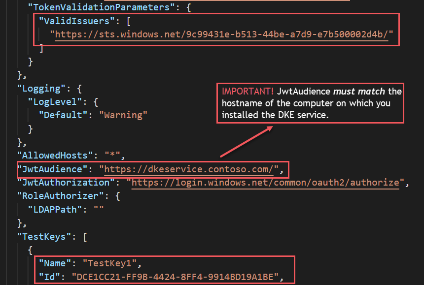
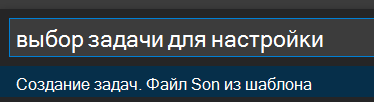

# <a name="double-key-encryption-for-microsoft-365"></a><span data-ttu-id="35dd9-103">Шифрование двойных ключей для Microsoft 365</span><span class="sxs-lookup"><span data-stu-id="35dd9-103">Double Key Encryption for Microsoft 365</span></span>

> <span data-ttu-id="35dd9-104">*Применяется к: Двойное шифрование ключей для Microsoft 365, [Microsoft 365 Compliance,](https://www.microsoft.com/microsoft-365/business/compliance-management) [Azure Information Protection](https://azure.microsoft.com/pricing/details/information-protection)*</span><span class="sxs-lookup"><span data-stu-id="35dd9-104">*Applies to: Double Key Encryption for Microsoft 365, [Microsoft 365 Compliance](https://www.microsoft.com/microsoft-365/business/compliance-management), [Azure Information Protection](https://azure.microsoft.com/pricing/details/information-protection)*</span></span>
>
> <span data-ttu-id="35dd9-105">*Инструкции по: [клиент унифицированной маркировки Azure Information Protection для Windows](/azure/information-protection/faqs#whats-the-difference-between-the-azure-information-protection-classic-and-unified-labeling-clients)*</span><span class="sxs-lookup"><span data-stu-id="35dd9-105">*Instructions for: [Azure Information Protection unified labeling client for Windows](/azure/information-protection/faqs#whats-the-difference-between-the-azure-information-protection-classic-and-unified-labeling-clients)*</span></span>
>
> <span data-ttu-id="35dd9-106">*Описание службы: [Соответствие требованиям Microsoft 365](/office365/servicedescriptions/microsoft-365-service-descriptions/microsoft-365-tenantlevel-services-licensing-guidance/microsoft-365-security-compliance-licensing-guidance)*</span><span class="sxs-lookup"><span data-stu-id="35dd9-106">*Service description for: [Microsoft 365 Compliance](/office365/servicedescriptions/microsoft-365-service-descriptions/microsoft-365-tenantlevel-services-licensing-guidance/microsoft-365-security-compliance-licensing-guidance)*</span></span>

<span data-ttu-id="35dd9-107">Двойное шифрование ключей (DKE) использует два ключа для доступа к защищенного контента.</span><span class="sxs-lookup"><span data-stu-id="35dd9-107">Double Key Encryption (DKE) uses two keys together to access protected content.</span></span> <span data-ttu-id="35dd9-108">Microsoft хранит один ключ в Microsoft Azure, а другой — у вас.</span><span class="sxs-lookup"><span data-stu-id="35dd9-108">Microsoft stores one key in Microsoft Azure, and you hold the other key.</span></span> <span data-ttu-id="35dd9-109">Вы поддерживаете полный контроль над одним из ключей с помощью службы шифрования двойных ключей.</span><span class="sxs-lookup"><span data-stu-id="35dd9-109">You maintain full control of one of your keys using the Double Key Encryption service.</span></span> <span data-ttu-id="35dd9-110">Защита применяется с помощью клиента единой маркировки Azure Information Protection к вашему высокочувствительному контенту.</span><span class="sxs-lookup"><span data-stu-id="35dd9-110">You apply protection using The Azure Information Protection unified labeling client to your highly sensitive content.</span></span>

<span data-ttu-id="35dd9-111">Шифрование двойных ключей поддерживает как облачные, так и локальное развертывание.</span><span class="sxs-lookup"><span data-stu-id="35dd9-111">Double Key Encryption supports both cloud and on-premises deployments.</span></span> <span data-ttu-id="35dd9-112">Эти развертывания помогают гарантировать, что зашифрованные данные остаются непрозрачной везде, где хранятся защищенные данные.</span><span class="sxs-lookup"><span data-stu-id="35dd9-112">These deployments help to ensure that encrypted data remains opaque wherever you store the protected data.</span></span>

<span data-ttu-id="35dd9-113">Дополнительные сведения о корневых клавишах клиента по умолчанию, основанных на облачных решениях, см. в сведениях [Planning and implementing your Azure Information Protection tenant key.](/azure/information-protection/plan-implement-tenant-key)</span><span class="sxs-lookup"><span data-stu-id="35dd9-113">For more information about the default, cloud-based tenant root keys, see [Planning and implementing your Azure Information Protection tenant key](/azure/information-protection/plan-implement-tenant-key).</span></span>

## <a name="when-your-organization-should-adopt-dke"></a><span data-ttu-id="35dd9-114">Когда ваша организация должна принять DKE</span><span class="sxs-lookup"><span data-stu-id="35dd9-114">When your organization should adopt DKE</span></span>

<span data-ttu-id="35dd9-115">Двойное шифрование ключей предназначено для наиболее конфиденциальных данных, которые подчиняются самым строгим требованиям защиты.</span><span class="sxs-lookup"><span data-stu-id="35dd9-115">Double Key Encryption is intended for your most sensitive data that is subject to the strictest protection requirements.</span></span> <span data-ttu-id="35dd9-116">DKE не предназначен для всех данных.</span><span class="sxs-lookup"><span data-stu-id="35dd9-116">DKE is not intended for all data.</span></span> <span data-ttu-id="35dd9-117">В общем, для защиты только небольшой части общих данных используется шифрование двойных ключей.</span><span class="sxs-lookup"><span data-stu-id="35dd9-117">In general, you'll be using Double Key Encryption to protect only a small part of your overall data.</span></span> <span data-ttu-id="35dd9-118">Перед развертыванием необходимо тщательно определить нужные данные для покрытия с помощью этого решения.</span><span class="sxs-lookup"><span data-stu-id="35dd9-118">You should do due diligence in identifying the right data to cover with this solution before you deploy.</span></span> <span data-ttu-id="35dd9-119">В некоторых случаях может потребоваться сузить область действия и использовать другие решения для большинства данных, таких как Microsoft Information Protection с помощью ключей под управлением Майкрософт или BYOK.</span><span class="sxs-lookup"><span data-stu-id="35dd9-119">In some cases, you might need to narrow your scope and make use of other solutions for most your data such as Microsoft Information Protection with Microsoft-managed keys or BYOK.</span></span> <span data-ttu-id="35dd9-120">Этих решений достаточно для документов, которые не подлежат усиленной защите и нормативным требованиям.</span><span class="sxs-lookup"><span data-stu-id="35dd9-120">These solutions are sufficient for documents that aren't subject to enhanced protections and regulatory requirements.</span></span> <span data-ttu-id="35dd9-121">Кроме того, эти решения позволяют использовать самые мощные службы Office 365; службы, которые нельзя использовать с зашифрованным контентом DKE.</span><span class="sxs-lookup"><span data-stu-id="35dd9-121">Also, these solutions enable you to use the most powerful Office 365 services; services that you can't use with DKE encrypted content.</span></span> <span data-ttu-id="35dd9-122">Пример:</span><span class="sxs-lookup"><span data-stu-id="35dd9-122">For example:</span></span>

- <span data-ttu-id="35dd9-123">Правила транспорта, в том числе анти-вредоносные программы и спам, которые требуют видимости вложения</span><span class="sxs-lookup"><span data-stu-id="35dd9-123">Transport rules including anti-malware and spam that require visibility into the attachment</span></span>
- <span data-ttu-id="35dd9-124">Microsoft Delve</span><span class="sxs-lookup"><span data-stu-id="35dd9-124">Microsoft Delve</span></span>
- <span data-ttu-id="35dd9-125">Обнаружение электронных данных (eDiscovery)</span><span class="sxs-lookup"><span data-stu-id="35dd9-125">eDiscovery</span></span>
- <span data-ttu-id="35dd9-126">Поиск и индексация контента</span><span class="sxs-lookup"><span data-stu-id="35dd9-126">Content search and indexing</span></span>
- <span data-ttu-id="35dd9-127">Веб-приложения Office, включая функции совместной работы</span><span class="sxs-lookup"><span data-stu-id="35dd9-127">Office Web Apps including coauthoring functionality</span></span>

<span data-ttu-id="35dd9-128">Любые внешние приложения или службы, которые не интегрированы с DKE через SDK MIP, не смогут выполнять действия на зашифрованных данных.</span><span class="sxs-lookup"><span data-stu-id="35dd9-128">Any external applications or services that are not integrated with DKE through the MIP SDK will be unable to perform actions on the encrypted data.</span></span>

<span data-ttu-id="35dd9-129">Microsoft Information Protection SDK 1.7+ поддерживает шифрование двойных ключей; Приложения, которые интегрируются с нашим SDK, смогут аргументировать эти данные достаточными разрешениями и интеграцией на месте.</span><span class="sxs-lookup"><span data-stu-id="35dd9-129">The Microsoft Information Protection SDK 1.7+ supports Double Key Encryption; applications that integrate with our SDK will be able to reason over this data with sufficient permissions and integrations in place.</span></span>

<span data-ttu-id="35dd9-130">Мы рекомендуем организациям использовать возможности microsoft Information Protection (классификация и маркировка) для защиты большей части конфиденциальных данных и использовать DKE только для критически важных данных.</span><span class="sxs-lookup"><span data-stu-id="35dd9-130">We recommend organizations use Microsoft Information protection capabilities (classification and labeling) to protect most of their sensitive data and only use DKE for their mission-critical data.</span></span> <span data-ttu-id="35dd9-131">Шифрование двойных ключей актуально для конфиденциальных данных в строго регулируемых отраслях, таких как финансовые службы и здравоохранение.</span><span class="sxs-lookup"><span data-stu-id="35dd9-131">Double Key Encryption is relevant for sensitive data in highly regulated industries such as Financial services and Healthcare.</span></span>

<span data-ttu-id="35dd9-132">Если у организаций есть какие-либо из следующих требований, вы можете использовать DKE для защиты контента:</span><span class="sxs-lookup"><span data-stu-id="35dd9-132">If your organizations have any of the following requirements, you can use DKE to help secure your content:</span></span>

- <span data-ttu-id="35dd9-133">Необходимо обеспечить, чтобы *только* вы могли расшифровать защищенный контент при любых обстоятельствах.</span><span class="sxs-lookup"><span data-stu-id="35dd9-133">You want to ensure that *only you* can ever decrypt protected content, under all circumstances.</span></span>
- <span data-ttu-id="35dd9-134">Корпорация Майкрософт не должна иметь доступ к защищенным данным самостоятельно.</span><span class="sxs-lookup"><span data-stu-id="35dd9-134">You don't want Microsoft to have access to protected data on its own.</span></span>
- <span data-ttu-id="35dd9-135">У вас есть нормативные требования для удержания ключей в пределах географической границы.</span><span class="sxs-lookup"><span data-stu-id="35dd9-135">You have regulatory requirements to hold keys within a geographical boundary.</span></span> <span data-ttu-id="35dd9-136">Все ключи, которые вы сохраняете для шифрования и расшифровки данных, сохраняются в центре обработки данных.</span><span class="sxs-lookup"><span data-stu-id="35dd9-136">All of the keys that you hold for data encryption and decryption are maintained in your data center.</span></span>

## <a name="system-and-licensing-requirements-for-dke"></a><span data-ttu-id="35dd9-137">Требования к системе и лицензированию для DKE</span><span class="sxs-lookup"><span data-stu-id="35dd9-137">System and licensing requirements for DKE</span></span>

<span data-ttu-id="35dd9-138">**Двойное шифрование ключей для Microsoft 365 поставляется** с Microsoft 365 E5.</span><span class="sxs-lookup"><span data-stu-id="35dd9-138">**Double Key Encryption for Microsoft 365** comes with Microsoft 365 E5.</span></span> <span data-ttu-id="35dd9-139">Если у вас нет лицензии Microsoft 365 E5, вы можете зарегистрироваться для [пробной пробной записи.](https://aka.ms/M365E5ComplianceTrial)</span><span class="sxs-lookup"><span data-stu-id="35dd9-139">If you don’t have a Microsoft 365 E5 license, you can sign up for a [trial](https://aka.ms/M365E5ComplianceTrial).</span></span> <span data-ttu-id="35dd9-140">Дополнительные сведения об этих лицензиях см. в руководстве по лицензированию [Microsoft 365](/office365/servicedescriptions/microsoft-365-service-descriptions/microsoft-365-tenantlevel-services-licensing-guidance/microsoft-365-security-compliance-licensing-guidance)для & соответствия требованиям.</span><span class="sxs-lookup"><span data-stu-id="35dd9-140">For more information about these licenses, see [Microsoft 365 licensing guidance for security & compliance](/office365/servicedescriptions/microsoft-365-service-descriptions/microsoft-365-tenantlevel-services-licensing-guidance/microsoft-365-security-compliance-licensing-guidance).</span></span>

<span data-ttu-id="35dd9-141">**Azure Information Protection**.</span><span class="sxs-lookup"><span data-stu-id="35dd9-141">**Azure Information Protection**.</span></span> <span data-ttu-id="35dd9-142">DKE работает с метами конфиденциальности и требует Azure Information Protection.</span><span class="sxs-lookup"><span data-stu-id="35dd9-142">DKE works with sensitivity labels and requires Azure Information Protection.</span></span>

<span data-ttu-id="35dd9-143">Метки чувствительности DKE доступны конечным пользователям с помощью ленты конфиденциальности в Office Desktop Apps.</span><span class="sxs-lookup"><span data-stu-id="35dd9-143">DKE sensitivity labels are made available to end users through the sensitivity ribbon in Office Desktop Apps.</span></span> <span data-ttu-id="35dd9-144">Установите эти необходимые условия на каждый клиентский компьютер, на котором необходимо защищать и потреблять защищенные документы.</span><span class="sxs-lookup"><span data-stu-id="35dd9-144">Install these prerequisites on each client computer where you want to protect and consume protected documents.</span></span>

<span data-ttu-id="35dd9-145">**Microsoft Office для корпоративной** версии 2009 или более поздней версии (настольные версии Word, PowerPoint и Excel) в Windows.</span><span class="sxs-lookup"><span data-stu-id="35dd9-145">**Microsoft Office Apps for enterprise** version 2009 or later (Desktop versions of Word, PowerPoint, and Excel) on Windows.</span></span>

<span data-ttu-id="35dd9-146">**Azure Information Protection Unified Labeling Client** versions 2.7.93.0 or later.</span><span class="sxs-lookup"><span data-stu-id="35dd9-146">**Azure Information Protection Unified Labeling Client** versions 2.7.93.0 or later.</span></span> <span data-ttu-id="35dd9-147">Скачайте и установите клиент единой маркировки из [центра загрузки Майкрософт.](https://www.microsoft.com/download/details.aspx?id=53018)</span><span class="sxs-lookup"><span data-stu-id="35dd9-147">Download and install the Unified Labeling client from the [Microsoft download center](https://www.microsoft.com/download/details.aspx?id=53018).</span></span>

## <a name="supported-environments-for-storing-and-viewing-dke-protected-content"></a><span data-ttu-id="35dd9-148">Поддерживаемые среды для хранения и просмотра контента, защищенного от DKE</span><span class="sxs-lookup"><span data-stu-id="35dd9-148">Supported environments for storing and viewing DKE-protected content</span></span>

<span data-ttu-id="35dd9-149">**Поддерживаемые приложения.**</span><span class="sxs-lookup"><span data-stu-id="35dd9-149">**Supported applications**.</span></span> <span data-ttu-id="35dd9-150">[Приложения Microsoft 365 для корпоративных](https://www.microsoft.com/microsoft-365/business/microsoft-365-apps-for-enterprise-product) клиентов в Windows, включая Word, Excel и PowerPoint.</span><span class="sxs-lookup"><span data-stu-id="35dd9-150">[Microsoft 365 Apps for enterprise](https://www.microsoft.com/microsoft-365/business/microsoft-365-apps-for-enterprise-product) clients on Windows, including Word, Excel, and PowerPoint.</span></span>

<span data-ttu-id="35dd9-151">**Поддержка контента в Интернете.**</span><span class="sxs-lookup"><span data-stu-id="35dd9-151">**Online content support**.</span></span> <span data-ttu-id="35dd9-152">Вы можете хранить документы и файлы, защищенные с помощью шифрования двойных ключей в Интернете в Microsoft SharePoint и OneDrive для бизнеса.</span><span class="sxs-lookup"><span data-stu-id="35dd9-152">You can store documents and files protected with Double Key Encryption online in both Microsoft SharePoint and OneDrive for Business.</span></span> <span data-ttu-id="35dd9-153">Перед отправкой в эти места необходимо маркировать и защищать документы и файлы с помощью DKE поддерживаемых приложений.</span><span class="sxs-lookup"><span data-stu-id="35dd9-153">You must label and protect documents and files with DKE by supported applications before you upload to these locations.</span></span> <span data-ttu-id="35dd9-154">Вы можете обмениваться зашифрованным контентом по электронной почте, но вы не можете просматривать зашифрованные документы и файлы в Интернете.</span><span class="sxs-lookup"><span data-stu-id="35dd9-154">You can share encrypted content by email, but you can't view encrypted documents and files online.</span></span> <span data-ttu-id="35dd9-155">Вместо этого необходимо просматривать защищенный контент с помощью поддерживаемых настольных приложений и клиентов на локальном компьютере.</span><span class="sxs-lookup"><span data-stu-id="35dd9-155">Instead, you must view protected content using the supported desktop applications and clients on your local computer.</span></span>

## <a name="overview-of-deploying-dke"></a><span data-ttu-id="35dd9-156">Обзор развертывания DKE</span><span class="sxs-lookup"><span data-stu-id="35dd9-156">Overview of deploying DKE</span></span>

<span data-ttu-id="35dd9-157">Вы выполните эти общие действия, чтобы настроить DKE.</span><span class="sxs-lookup"><span data-stu-id="35dd9-157">You'll follow these general steps to set up DKE.</span></span> <span data-ttu-id="35dd9-158">После завершения этих действий конечные пользователи смогут защищать высокочувствительные данные с помощью шифрования двойных ключей.</span><span class="sxs-lookup"><span data-stu-id="35dd9-158">Once you've completed these steps, your end users will can protect your highly sensitive data with Double Key Encryption.</span></span>

1. <span data-ttu-id="35dd9-159">Развертывание службы DKE, как описано в этой статье.</span><span class="sxs-lookup"><span data-stu-id="35dd9-159">Deploy the DKE service as described in this article.</span></span>

2. <span data-ttu-id="35dd9-160">Создайте метку с двойным шифрованием ключей.</span><span class="sxs-lookup"><span data-stu-id="35dd9-160">Create a label with Double Key Encryption.</span></span> <span data-ttu-id="35dd9-161">Перейдите к защите информации в центре соответствия [требованиям Microsoft 365](https://compliance.microsoft.com) и создайте новую метку с двойным шифрованием ключей.</span><span class="sxs-lookup"><span data-stu-id="35dd9-161">Navigate to Information protection under the [Microsoft 365 compliance center](https://compliance.microsoft.com) and create a new label with Double Key Encryption.</span></span> <span data-ttu-id="35dd9-162">См. [ограничение доступа к содержимому с помощью меток конфиденциальности для применения шифрования.](./encryption-sensitivity-labels.md)</span><span class="sxs-lookup"><span data-stu-id="35dd9-162">See [Restrict access to content by using sensitivity labels to apply encryption](./encryption-sensitivity-labels.md).</span></span>

3. <span data-ttu-id="35dd9-163">Используйте метки шифрования двойных ключей.</span><span class="sxs-lookup"><span data-stu-id="35dd9-163">Use Double Key Encryption labels.</span></span> <span data-ttu-id="35dd9-164">Защитите данные, выбрав метку Double Key Encrypted из ленты "Чувствительность" в Microsoft Office.</span><span class="sxs-lookup"><span data-stu-id="35dd9-164">Protect data by selecting the Double Key Encrypted label from the Sensitivity ribbon in Microsoft Office.</span></span>

<span data-ttu-id="35dd9-165">Существует несколько способов выполнения некоторых действий по развертыванию шифрования двойных ключей.</span><span class="sxs-lookup"><span data-stu-id="35dd9-165">There are several ways you can complete some of the steps to deploy Double Key Encryption.</span></span> <span data-ttu-id="35dd9-166">В этой статье описаны подробные инструкции, чтобы менее опытные администраторы успешно развертывали службу.</span><span class="sxs-lookup"><span data-stu-id="35dd9-166">This article provides detailed instructions so that less experienced admins successfully deploy the service.</span></span> <span data-ttu-id="35dd9-167">Если вам это удобно, вы можете использовать собственные методы.</span><span class="sxs-lookup"><span data-stu-id="35dd9-167">If you're comfortable doing so, you can choose to use your own methods.</span></span>

## <a name="deploy-dke"></a><span data-ttu-id="35dd9-168">Развертывание DKE</span><span class="sxs-lookup"><span data-stu-id="35dd9-168">Deploy DKE</span></span>

<span data-ttu-id="35dd9-169">В этой статье и видео развертывания Azure используется в качестве назначения развертывания для службы DKE.</span><span class="sxs-lookup"><span data-stu-id="35dd9-169">This article and the deployment video use Azure as the deployment destination for the DKE service.</span></span> <span data-ttu-id="35dd9-170">При развертывании в другом расположении необходимо предоставить собственные значения.</span><span class="sxs-lookup"><span data-stu-id="35dd9-170">If you're deploying to another location, you'll need to provide your own values.</span></span>

<span data-ttu-id="35dd9-171">Просмотрите [видео развертывания шифрования](https://youtu.be/vDWfHN_kygg) двойных ключей, чтобы просмотреть пошаговую обзор концепций в этой статье.</span><span class="sxs-lookup"><span data-stu-id="35dd9-171">Watch the [Double Key Encryption deployment video](https://youtu.be/vDWfHN_kygg) to see a step-by-step overview of the concepts in this article.</span></span> <span data-ttu-id="35dd9-172">Видео занимает около 18 минут.</span><span class="sxs-lookup"><span data-stu-id="35dd9-172">The video takes about 18 minutes to complete.</span></span>

<span data-ttu-id="35dd9-173">Вы выполните эти общие действия, чтобы настроить шифрование двойных ключей для вашей организации.</span><span class="sxs-lookup"><span data-stu-id="35dd9-173">You'll follow these general steps to set up Double Key Encryption for your organization.</span></span>

1. [<span data-ttu-id="35dd9-174">Установка необходимых условий программного обеспечения для службы DKE</span><span class="sxs-lookup"><span data-stu-id="35dd9-174">Install software prerequisites for the DKE service</span></span>](#install-software-prerequisites-for-the-dke-service)
1. [<span data-ttu-id="35dd9-175">Клонировать репозиторий шифрования двух ключей GitHub</span><span class="sxs-lookup"><span data-stu-id="35dd9-175">Clone the Double Key Encryption GitHub repository</span></span>](#clone-the-dke-github-repository)
1. [<span data-ttu-id="35dd9-176">Изменение параметров приложения</span><span class="sxs-lookup"><span data-stu-id="35dd9-176">Modify application settings</span></span>](#modify-application-settings)
1. [<span data-ttu-id="35dd9-177">Создание тестовых ключей</span><span class="sxs-lookup"><span data-stu-id="35dd9-177">Generate test keys</span></span>](#generate-test-keys)
1. [<span data-ttu-id="35dd9-178">Сборка проекта</span><span class="sxs-lookup"><span data-stu-id="35dd9-178">Build the project</span></span>](#build-the-project)
1. [<span data-ttu-id="35dd9-179">Развертывание службы DKE и публикация магазина ключей</span><span class="sxs-lookup"><span data-stu-id="35dd9-179">Deploy the DKE service and publish the key store</span></span>](#deploy-the-dke-service-and-publish-the-key-store)
1. [<span data-ttu-id="35dd9-180">Проверка развертывания</span><span class="sxs-lookup"><span data-stu-id="35dd9-180">Validate your deployment</span></span>](#validate-your-deployment)
1. [<span data-ttu-id="35dd9-181">Регистрация магазина ключей</span><span class="sxs-lookup"><span data-stu-id="35dd9-181">Register your key store</span></span>](#register-your-key-store)
1. [<span data-ttu-id="35dd9-182">Создание меток конфиденциальности с помощью DKE</span><span class="sxs-lookup"><span data-stu-id="35dd9-182">Create sensitivity labels using DKE</span></span>](#create-sensitivity-labels-using-dke)
1. [<span data-ttu-id="35dd9-183">Включить DKE в клиенте</span><span class="sxs-lookup"><span data-stu-id="35dd9-183">Enable DKE in your client</span></span>](#enable-dke-in-your-client)
1. [<span data-ttu-id="35dd9-184">Перенос защищенных файлов с меток HYOK на метки DKE</span><span class="sxs-lookup"><span data-stu-id="35dd9-184">Migrate protected files from HYOK labels to DKE labels</span></span>](#migrate-protected-files-from-hyok-labels-to-dke-labels)

<span data-ttu-id="35dd9-185">После этого можно шифровать документы и файлы с помощью DKE.</span><span class="sxs-lookup"><span data-stu-id="35dd9-185">When you're done, you can encrypt documents and files using DKE.</span></span> <span data-ttu-id="35dd9-186">Сведения см. в [материалах Apply sensitivity labels to your files and email in Office.](https://support.microsoft.com/office/2f96e7cd-d5a4-403b-8bd7-4cc636bae0f9)</span><span class="sxs-lookup"><span data-stu-id="35dd9-186">For information, see [Apply sensitivity labels to your files and email in Office](https://support.microsoft.com/office/2f96e7cd-d5a4-403b-8bd7-4cc636bae0f9).</span></span>

### <a name="install-software-prerequisites-for-the-dke-service"></a><span data-ttu-id="35dd9-187">Установка необходимых условий программного обеспечения для службы DKE</span><span class="sxs-lookup"><span data-stu-id="35dd9-187">Install software prerequisites for the DKE service</span></span>

<span data-ttu-id="35dd9-188">Установите эти необходимые условия на компьютер, на котором необходимо установить службу DKE.</span><span class="sxs-lookup"><span data-stu-id="35dd9-188">Install these prerequisites on the computer where you want to install the DKE service.</span></span>

<span data-ttu-id="35dd9-189">**.NET Core 3.1 SDK**.</span><span class="sxs-lookup"><span data-stu-id="35dd9-189">**.NET Core 3.1 SDK**.</span></span> <span data-ttu-id="35dd9-190">Скачайте и установите SDK из [Download .NET Core 3.1](https://dotnet.microsoft.com/download/dotnet-core/3.1).</span><span class="sxs-lookup"><span data-stu-id="35dd9-190">Download and install the SDK from [Download .NET Core 3.1](https://dotnet.microsoft.com/download/dotnet-core/3.1).</span></span>

<span data-ttu-id="35dd9-191">**Visual Studio код**.</span><span class="sxs-lookup"><span data-stu-id="35dd9-191">**Visual Studio Code**.</span></span> <span data-ttu-id="35dd9-192">Скачайте Visual Studio код из [https://code.visualstudio.com/](https://code.visualstudio.com) .</span><span class="sxs-lookup"><span data-stu-id="35dd9-192">Download Visual Studio Code from [https://code.visualstudio.com/](https://code.visualstudio.com).</span></span> <span data-ttu-id="35dd9-193">После установки запустите Visual Studio код и выберите **расширения** \> **представления.**</span><span class="sxs-lookup"><span data-stu-id="35dd9-193">Once installed, run Visual Studio Code and select **View** \> **Extensions**.</span></span> <span data-ttu-id="35dd9-194">Установите эти расширения.</span><span class="sxs-lookup"><span data-stu-id="35dd9-194">Install these extensions.</span></span>

- <span data-ttu-id="35dd9-195">C# для Visual Studio кода</span><span class="sxs-lookup"><span data-stu-id="35dd9-195">C# for Visual Studio Code</span></span>

- <span data-ttu-id="35dd9-196">NuGet диспетчер пакетов</span><span class="sxs-lookup"><span data-stu-id="35dd9-196">NuGet Package Manager</span></span>

<span data-ttu-id="35dd9-197">**Ресурсы Git**.</span><span class="sxs-lookup"><span data-stu-id="35dd9-197">**Git resources**.</span></span> <span data-ttu-id="35dd9-198">Скачайте и установите один из следующих.</span><span class="sxs-lookup"><span data-stu-id="35dd9-198">Download and install one of the following.</span></span>

- [<span data-ttu-id="35dd9-199">Git</span><span class="sxs-lookup"><span data-stu-id="35dd9-199">Git</span></span>](https://git-scm.com/downloads)

- [<span data-ttu-id="35dd9-200">Рабочий стол GitHub</span><span class="sxs-lookup"><span data-stu-id="35dd9-200">GitHub Desktop</span></span>](https://desktop.github.com/)

- [<span data-ttu-id="35dd9-201">GitHub Enterprise</span><span class="sxs-lookup"><span data-stu-id="35dd9-201">GitHub Enterprise</span></span>](https://github.com/enterprise)

<span data-ttu-id="35dd9-202">**OpenSSL** Необходимо установить [OpenSSL для](https://slproweb.com/products/Win32OpenSSL.html) создания [тестовых ключей](#generate-test-keys) после развертывания DKE.</span><span class="sxs-lookup"><span data-stu-id="35dd9-202">**OpenSSL** You must have [OpenSSL](https://slproweb.com/products/Win32OpenSSL.html) installed to [generate test keys](#generate-test-keys) after you deploy DKE.</span></span> <span data-ttu-id="35dd9-203">Убедитесь, что вы правильно назовите его с пути переменных среды.</span><span class="sxs-lookup"><span data-stu-id="35dd9-203">Make sure you're invoking it correctly from your environment variables path.</span></span> <span data-ttu-id="35dd9-204">Например, дополнительные сведения см. в материале "Добавление каталога установки в [https://www.osradar.com/install-openssl-windows/](https://www.osradar.com/install-openssl-windows/) PATH".</span><span class="sxs-lookup"><span data-stu-id="35dd9-204">For example, see "Add the installation directory to PATH" at [https://www.osradar.com/install-openssl-windows/](https://www.osradar.com/install-openssl-windows/) for details.</span></span>

### <a name="clone-the-dke-github-repository"></a><span data-ttu-id="35dd9-205">Клонировать репозиторий DKE GitHub</span><span class="sxs-lookup"><span data-stu-id="35dd9-205">Clone the DKE GitHub repository</span></span>

<span data-ttu-id="35dd9-206">Корпорация Майкрософт поставляет исходные файлы DKE в репозитории GitHub.</span><span class="sxs-lookup"><span data-stu-id="35dd9-206">Microsoft supplies the DKE source files in a GitHub repository.</span></span> <span data-ttu-id="35dd9-207">Вы клонировали репозиторий для локальной сборки проекта для использования в организации.</span><span class="sxs-lookup"><span data-stu-id="35dd9-207">You clone the repository to build the project locally for your organization's use.</span></span> <span data-ttu-id="35dd9-208">Репозиторий DKE GitHub расположен по адресу [https://github.com/Azure-Samples/DoubleKeyEncryptionService](https://github.com/Azure-Samples/DoubleKeyEncryptionService) .</span><span class="sxs-lookup"><span data-stu-id="35dd9-208">The DKE GitHub repository is located at [https://github.com/Azure-Samples/DoubleKeyEncryptionService](https://github.com/Azure-Samples/DoubleKeyEncryptionService).</span></span>

<span data-ttu-id="35dd9-209">Следующие инструкции предназначены для неопытных пользователей git или Visual Studio кода:</span><span class="sxs-lookup"><span data-stu-id="35dd9-209">The following instructions are intended for inexperienced git or Visual Studio Code users:</span></span>

1. <span data-ttu-id="35dd9-210">В браузере перейдите к: [https://github.com/Azure-Samples/DoubleKeyEncryptionService](https://github.com/Azure-Samples/DoubleKeyEncryptionService) .</span><span class="sxs-lookup"><span data-stu-id="35dd9-210">In your browser, go to: [https://github.com/Azure-Samples/DoubleKeyEncryptionService](https://github.com/Azure-Samples/DoubleKeyEncryptionService).</span></span>

2. <span data-ttu-id="35dd9-211">В правой части экрана выберите **Код**.</span><span class="sxs-lookup"><span data-stu-id="35dd9-211">Towards the right side of the screen, select **Code**.</span></span> <span data-ttu-id="35dd9-212">В вашей версии пользовательского интерфейса может быть кнопка **клонирования или скачивания.**</span><span class="sxs-lookup"><span data-stu-id="35dd9-212">Your version of the UI might show a **Clone or download** button.</span></span> <span data-ttu-id="35dd9-213">Затем в выпадаемом фрагменте выберите значок копирования, чтобы скопировать URL-адрес в буфер обмена.</span><span class="sxs-lookup"><span data-stu-id="35dd9-213">Then, in the dropdown that appears, select the copy icon to copy the URL to your clipboard.</span></span>

    <span data-ttu-id="35dd9-214">Пример:</span><span class="sxs-lookup"><span data-stu-id="35dd9-214">For example:</span></span>

   > [!div class="mx-imgBorder"]
   > <span data-ttu-id="35dd9-215"></span><span class="sxs-lookup"><span data-stu-id="35dd9-215"></span></span>

3. <span data-ttu-id="35dd9-216">В Visual Studio выберите **палитру команд представления** и \>  выберите **Git: Clone**.</span><span class="sxs-lookup"><span data-stu-id="35dd9-216">In Visual Studio Code, select **View** \> **Command Palette** and select **Git: Clone**.</span></span> <span data-ttu-id="35dd9-217">Чтобы перейти к параметру в списке, начните вводить для фильтрации записей, а затем выберите его из `git: clone` выпадаемого.</span><span class="sxs-lookup"><span data-stu-id="35dd9-217">To jump to the option in the list, start typing `git: clone` to filter the entries and then select it from the drop-down.</span></span> <span data-ttu-id="35dd9-218">Пример:</span><span class="sxs-lookup"><span data-stu-id="35dd9-218">For example:</span></span>

   > [!div class="mx-imgBorder"]
   > <span data-ttu-id="35dd9-219"></span><span class="sxs-lookup"><span data-stu-id="35dd9-219"></span></span>

4. <span data-ttu-id="35dd9-220">В текстовом окне вите URL-адрес, скопированный из Git, и выберите **Клон из GitHub.**</span><span class="sxs-lookup"><span data-stu-id="35dd9-220">In the text box, paste the URL that you copied from Git and select **Clone from GitHub**.</span></span>

5. <span data-ttu-id="35dd9-221">В **диалоговом окте Select Folder,** который отображается, просмотрите и выберите расположение для хранения репозитория.</span><span class="sxs-lookup"><span data-stu-id="35dd9-221">In the **Select Folder** dialog that appears, browse to and select a location to store the repository.</span></span> <span data-ttu-id="35dd9-222">В запросе выберите **Открыть**.</span><span class="sxs-lookup"><span data-stu-id="35dd9-222">At the prompt, select **Open**.</span></span>

    <span data-ttu-id="35dd9-223">Репозиторий открывается в Visual Studio коде и отображает текущую ветвь Git в левом нижнем конце.</span><span class="sxs-lookup"><span data-stu-id="35dd9-223">The repository opens in Visual Studio Code, and displays the current Git branch at the bottom left.</span></span> <span data-ttu-id="35dd9-224">Например, ветвь должна быть **основной**.</span><span class="sxs-lookup"><span data-stu-id="35dd9-224">For example,  The branch should be **main**.</span></span> <span data-ttu-id="35dd9-225">Пример:</span><span class="sxs-lookup"><span data-stu-id="35dd9-225">For example:</span></span>

   

6. <span data-ttu-id="35dd9-227">Если вы не в основном филиале, вам необходимо выбрать его.</span><span class="sxs-lookup"><span data-stu-id="35dd9-227">If you're not on the main branch, you'll need to select it.</span></span> <span data-ttu-id="35dd9-228">В Visual Studio коде выберите ветвь и **выберите** главную из списка ветвей, которые отображаются.</span><span class="sxs-lookup"><span data-stu-id="35dd9-228">In Visual Studio Code, select the branch and choose **main** from the list of branches that displays.</span></span>

   > [!IMPORTANT]
   > <span data-ttu-id="35dd9-229">Выбор основной ветви гарантирует, что у вас есть правильные файлы для создания проекта.</span><span class="sxs-lookup"><span data-stu-id="35dd9-229">Selecting the main branch ensures that you have the correct files to build the project.</span></span> <span data-ttu-id="35dd9-230">Если вы не выберете правильную ветвь, развертывание не будет работать.</span><span class="sxs-lookup"><span data-stu-id="35dd9-230">If you don't choose the correct branch your deployment will fail.</span></span>

<span data-ttu-id="35dd9-231">Теперь исходный репозиторий DKE настроен локально.</span><span class="sxs-lookup"><span data-stu-id="35dd9-231">You now have your DKE source repository set up locally.</span></span> <span data-ttu-id="35dd9-232">Затем [измените параметры приложений](#modify-application-settings) для организации.</span><span class="sxs-lookup"><span data-stu-id="35dd9-232">Next, [modify application settings](#modify-application-settings) for your organization.</span></span>

### <a name="modify-application-settings"></a><span data-ttu-id="35dd9-233">Изменение параметров приложения</span><span class="sxs-lookup"><span data-stu-id="35dd9-233">Modify application settings</span></span>

<span data-ttu-id="35dd9-234">Чтобы развернуть службу DKE, необходимо изменить следующие типы параметров приложений:</span><span class="sxs-lookup"><span data-stu-id="35dd9-234">To deploy the DKE service, you must modify the following types of application settings:</span></span>

- [<span data-ttu-id="35dd9-235">Параметры ключевого доступа</span><span class="sxs-lookup"><span data-stu-id="35dd9-235">Key access settings</span></span>](#key-access-settings)
- [<span data-ttu-id="35dd9-236">Параметры клиента и ключей</span><span class="sxs-lookup"><span data-stu-id="35dd9-236">Tenant and key settings</span></span>](#tenant-and-key-settings)

<span data-ttu-id="35dd9-237">Вы измените параметры приложения в appsettings.jsфайле.</span><span class="sxs-lookup"><span data-stu-id="35dd9-237">You modify application settings in the appsettings.json file.</span></span> <span data-ttu-id="35dd9-238">Этот файл расположен в репо DoubleKeyEncryptionService, клонированном локально в магазине DoubleKeyEncryptionService\src\customer-key-store.</span><span class="sxs-lookup"><span data-stu-id="35dd9-238">This file is located in the DoubleKeyEncryptionService repo you cloned locally under DoubleKeyEncryptionService\src\customer-key-store.</span></span> <span data-ttu-id="35dd9-239">Например, в Visual Studio коде можно просмотреть файл, как показано на следующем рисунке.</span><span class="sxs-lookup"><span data-stu-id="35dd9-239">For example, in Visual Studio Code, you can browse to the file as shown in the following picture.</span></span>


#### <a name="key-access-settings"></a><span data-ttu-id="35dd9-241">Параметры ключевого доступа</span><span class="sxs-lookup"><span data-stu-id="35dd9-241">Key access settings</span></span>

<span data-ttu-id="35dd9-242">Выберите, следует ли использовать авторизацию электронной почты или роли.</span><span class="sxs-lookup"><span data-stu-id="35dd9-242">Choose whether to use email or role authorization.</span></span> <span data-ttu-id="35dd9-243">DKE поддерживает только один из этих методов проверки подлинности одновременно.</span><span class="sxs-lookup"><span data-stu-id="35dd9-243">DKE supports only one of these authentication methods at a time.</span></span>

- <span data-ttu-id="35dd9-244">**Авторизация электронной почты.**</span><span class="sxs-lookup"><span data-stu-id="35dd9-244">**Email authorization**.</span></span> <span data-ttu-id="35dd9-245">Позволяет вашей организации разрешить доступ к ключам только на основе адресов электронной почты.</span><span class="sxs-lookup"><span data-stu-id="35dd9-245">Allows your organization to authorize access to keys based on email addresses only.</span></span>

- <span data-ttu-id="35dd9-246">**Авторизация ролей**.</span><span class="sxs-lookup"><span data-stu-id="35dd9-246">**Role authorization**.</span></span> <span data-ttu-id="35dd9-247">Позволяет организации авторизировать доступ к клавишам на основе групп Active Directory и требует, чтобы веб-служба запрашивала LDAP.</span><span class="sxs-lookup"><span data-stu-id="35dd9-247">Allows your organization to authorize access to keys based on Active Directory groups, and requires that the web service can query LDAP.</span></span>

<span data-ttu-id="35dd9-248">**Настройка параметров доступа к ключам для DKE с помощью авторизации электронной почты**</span><span class="sxs-lookup"><span data-stu-id="35dd9-248">**To set key access settings for DKE using email authorization**</span></span>

1. <span data-ttu-id="35dd9-249">Откройтеappsettings.js **файл** и найдите `AuthorizedEmailAddress` параметр.</span><span class="sxs-lookup"><span data-stu-id="35dd9-249">Open the **appsettings.json** file and locate the `AuthorizedEmailAddress` setting.</span></span>

2. <span data-ttu-id="35dd9-250">Добавьте адрес электронной почты или адреса, которые необходимо авторизовать.</span><span class="sxs-lookup"><span data-stu-id="35dd9-250">Add the email address or addresses that you want to authorize.</span></span> <span data-ttu-id="35dd9-251">Разделять несколько адресов электронной почты с двойными кавычками и запятой.</span><span class="sxs-lookup"><span data-stu-id="35dd9-251">Separate multiple email addresses with double quotes and commas.</span></span> <span data-ttu-id="35dd9-252">Пример:</span><span class="sxs-lookup"><span data-stu-id="35dd9-252">For example:</span></span>

   ```json
   "AuthorizedEmailAddress": ["email1@company.com", "email2@company.com ", "email3@company.com"]
   ```

3. <span data-ttu-id="35dd9-253">Найдите `LDAPPath` параметр и удалите текст между `If you use role authorization (AuthorizedRoles) then this is the LDAP path.` двойными кавычками.</span><span class="sxs-lookup"><span data-stu-id="35dd9-253">Locate the `LDAPPath` setting and remove the text `If you use role authorization (AuthorizedRoles) then this is the LDAP path.` between the double quotes.</span></span> <span data-ttu-id="35dd9-254">Оставьте двойные котировки на месте.</span><span class="sxs-lookup"><span data-stu-id="35dd9-254">Leave the double quotes in place.</span></span> <span data-ttu-id="35dd9-255">Когда вы закончите, параметр должен выглядеть так.</span><span class="sxs-lookup"><span data-stu-id="35dd9-255">When you're finished, the setting should look like this.</span></span>

   ```json
   "LDAPPath": ""
   ```

4. <span data-ttu-id="35dd9-256">Найдите `AuthorizedRoles` параметр и удалите всю строку.</span><span class="sxs-lookup"><span data-stu-id="35dd9-256">Locate the `AuthorizedRoles` setting and delete the entire line.</span></span>

<span data-ttu-id="35dd9-257">На этом изображении **показанappsettings.jsв** файле, правильно отформатированный для авторизации электронной почты.</span><span class="sxs-lookup"><span data-stu-id="35dd9-257">This image shows the **appsettings.json** file correctly formatted for email authorization.</span></span>

   

<span data-ttu-id="35dd9-259">**Настройка параметров доступа к ключам для DKE с помощью авторизации ролей**</span><span class="sxs-lookup"><span data-stu-id="35dd9-259">**To set key access settings for DKE using role authorization**</span></span>

1. <span data-ttu-id="35dd9-260">Откройтеappsettings.js **файл** и найдите `AuthorizedRoles` параметр.</span><span class="sxs-lookup"><span data-stu-id="35dd9-260">Open the **appsettings.json** file and locate the `AuthorizedRoles` setting.</span></span>

2. <span data-ttu-id="35dd9-261">Добавьте имена групп Active Directory, которые необходимо авторизировать.</span><span class="sxs-lookup"><span data-stu-id="35dd9-261">Add the Active Directory group names you want to authorize.</span></span> <span data-ttu-id="35dd9-262">Разделим несколько имен групп с двойными кавычками и запятой.</span><span class="sxs-lookup"><span data-stu-id="35dd9-262">Separate multiple group names with double quotes and commas.</span></span> <span data-ttu-id="35dd9-263">Пример:</span><span class="sxs-lookup"><span data-stu-id="35dd9-263">For example:</span></span>

   ```json
   "AuthorizedRoles": ["group1", "group2", "group3"]
   ```

3. <span data-ttu-id="35dd9-264">Найдите `LDAPPath` параметр и добавьте домен Active Directory.</span><span class="sxs-lookup"><span data-stu-id="35dd9-264">Locate the `LDAPPath` setting and add the Active Directory domain.</span></span> <span data-ttu-id="35dd9-265">Пример:</span><span class="sxs-lookup"><span data-stu-id="35dd9-265">For example:</span></span>

   ```json
   "LDAPPath": "contoso.com"
   ```

4. <span data-ttu-id="35dd9-266">Найдите `AuthorizedEmailAddress` параметр и удалите всю строку.</span><span class="sxs-lookup"><span data-stu-id="35dd9-266">Locate the `AuthorizedEmailAddress` setting and delete the entire line.</span></span>

<span data-ttu-id="35dd9-267">На этом изображении **показанappsettings.jsв** файле, правильно отформатированный для авторизации ролей.</span><span class="sxs-lookup"><span data-stu-id="35dd9-267">This image shows the **appsettings.json** file correctly formatted for role authorization.</span></span>

   

#### <a name="tenant-and-key-settings"></a><span data-ttu-id="35dd9-269">Параметры клиента и ключей</span><span class="sxs-lookup"><span data-stu-id="35dd9-269">Tenant and key settings</span></span>

<span data-ttu-id="35dd9-270">Клиент DKE и параметры ключей находятся вappsettings.js **файле.**</span><span class="sxs-lookup"><span data-stu-id="35dd9-270">DKE tenant and key settings are located in the **appsettings.json** file.</span></span>

<span data-ttu-id="35dd9-271">**Настройка параметров клиента и ключей для DKE**</span><span class="sxs-lookup"><span data-stu-id="35dd9-271">**To configure tenant and key settings for DKE**</span></span>

1. <span data-ttu-id="35dd9-272">Откройтеappsettings.js **файл.**</span><span class="sxs-lookup"><span data-stu-id="35dd9-272">Open the **appsettings.json** file.</span></span>

2. <span data-ttu-id="35dd9-273">Найдите `ValidIssuers` параметр и `<tenantid>` замените его ид клиента.</span><span class="sxs-lookup"><span data-stu-id="35dd9-273">Locate the `ValidIssuers` setting and replace `<tenantid>` with your tenant ID.</span></span> <span data-ttu-id="35dd9-274">Вы можете найти свой ID клиента, переехав на портал Azure и просмотрев [свойства клиента.](https://aad.portal.azure.com/#blade/Microsoft_AAD_IAM/ActiveDirectoryMenuBlade/Properties)</span><span class="sxs-lookup"><span data-stu-id="35dd9-274">You can locate your tenant ID by going to the Azure portal and viewing the [tenant properties](https://aad.portal.azure.com/#blade/Microsoft_AAD_IAM/ActiveDirectoryMenuBlade/Properties).</span></span> <span data-ttu-id="35dd9-275">Пример:</span><span class="sxs-lookup"><span data-stu-id="35dd9-275">For example:</span></span>

   ```json
   "ValidIssuers": [
     "https://sts.windows.net/9c99431e-b513-44be-a7d9-e7b500002d4b/"
   ]
   ```

<span data-ttu-id="35dd9-276">Найдите `JwtAudience` .</span><span class="sxs-lookup"><span data-stu-id="35dd9-276">Locate the `JwtAudience`.</span></span> <span data-ttu-id="35dd9-277">Замените `<yourhostname>` имя хост-компьютера, на котором будет работать служба DKE.</span><span class="sxs-lookup"><span data-stu-id="35dd9-277">Replace `<yourhostname>` with the hostname of the machine where the DKE service will run.</span></span> <span data-ttu-id="35dd9-278">Пример:</span><span class="sxs-lookup"><span data-stu-id="35dd9-278">For example:</span></span>

  > [!IMPORTANT]
  > <span data-ttu-id="35dd9-279">Значение должно `JwtAudience` точно совпадать с именем вашего хоста.</span><span class="sxs-lookup"><span data-stu-id="35dd9-279">The value for `JwtAudience` must match the name of your host *exactly*.</span></span> <span data-ttu-id="35dd9-280">При **отладе можно использовать localhost:5001.**</span><span class="sxs-lookup"><span data-stu-id="35dd9-280">You may use **localhost:5001** while debugging.</span></span> <span data-ttu-id="35dd9-281">Однако после отладки не забудьте обновить это значение до имени хост-сервера.</span><span class="sxs-lookup"><span data-stu-id="35dd9-281">However, When you're done debugging, make sure to update this value to the server's hostname.</span></span>

- <span data-ttu-id="35dd9-282">`TestKeys:Name`.</span><span class="sxs-lookup"><span data-stu-id="35dd9-282">`TestKeys:Name`.</span></span> <span data-ttu-id="35dd9-283">Введите имя ключа.</span><span class="sxs-lookup"><span data-stu-id="35dd9-283">Enter a name for your key.</span></span> <span data-ttu-id="35dd9-284">Пример: `TestKey1`</span><span class="sxs-lookup"><span data-stu-id="35dd9-284">For example: `TestKey1`</span></span>
- <span data-ttu-id="35dd9-285">`TestKeys:Id`.</span><span class="sxs-lookup"><span data-stu-id="35dd9-285">`TestKeys:Id`.</span></span> <span data-ttu-id="35dd9-286">Создайте GUID и введите его в качестве `TestKeys:ID` значения.</span><span class="sxs-lookup"><span data-stu-id="35dd9-286">Create a GUID and enter it as the `TestKeys:ID` value.</span></span> <span data-ttu-id="35dd9-287">Например, `DCE1CC21-FF9B-4424-8FF4-9914BD19A1BE`.</span><span class="sxs-lookup"><span data-stu-id="35dd9-287">For example, `DCE1CC21-FF9B-4424-8FF4-9914BD19A1BE`.</span></span> <span data-ttu-id="35dd9-288">Для случайного создания GUID можно использовать такой сайт, как [Генератор GUID](https://guidgenerator.com/) в Интернете.</span><span class="sxs-lookup"><span data-stu-id="35dd9-288">You can use a site like [Online GUID Generator](https://guidgenerator.com/) to randomly generate a GUID.</span></span>

<span data-ttu-id="35dd9-289">На этом изображении показан правильный формат параметров клиента и ключей в **appsettings.js.**</span><span class="sxs-lookup"><span data-stu-id="35dd9-289">This image shows the correct format for tenant and keys settings in **appsettings.json**.</span></span> <span data-ttu-id="35dd9-290">`LDAPPath` настраивается для авторизации ролей.</span><span class="sxs-lookup"><span data-stu-id="35dd9-290">`LDAPPath` is configured for role authorization.</span></span>



### <a name="generate-test-keys"></a><span data-ttu-id="35dd9-292">Создание тестовых ключей</span><span class="sxs-lookup"><span data-stu-id="35dd9-292">Generate test keys</span></span>

<span data-ttu-id="35dd9-293">После определения параметров приложения вы будете готовы создавать общедоступные и закрытые тестовые ключи.</span><span class="sxs-lookup"><span data-stu-id="35dd9-293">Once you have your application settings defined, you're ready to generate public and private test keys.</span></span>

<span data-ttu-id="35dd9-294">Для создания ключей:</span><span class="sxs-lookup"><span data-stu-id="35dd9-294">To generate keys:</span></span>

1. <span data-ttu-id="35dd9-295">Из меню "Пуск Windows" запустите командную подсказку OpenSSL.</span><span class="sxs-lookup"><span data-stu-id="35dd9-295">From the Windows Start menu, run the OpenSSL Command Prompt.</span></span>

2. <span data-ttu-id="35dd9-296">Измените папку, в которой необходимо сохранить тестовые ключи.</span><span class="sxs-lookup"><span data-stu-id="35dd9-296">Change to the folder where you want to save the test keys.</span></span> <span data-ttu-id="35dd9-297">Файлы, которые вы создаете после выполнения действий в этой задаче, хранятся в одной папке.</span><span class="sxs-lookup"><span data-stu-id="35dd9-297">The files you create by completing the steps in this task are stored in the same folder.</span></span>

3. <span data-ttu-id="35dd9-298">Создание нового тестового ключа.</span><span class="sxs-lookup"><span data-stu-id="35dd9-298">Generate the new test key.</span></span>

   ```console
   openssl req -x509 -newkey rsa:2048 -keyout key.pem -out cert.pem -days 365
   ```

4. <span data-ttu-id="35dd9-299">Создание закрытого ключа.</span><span class="sxs-lookup"><span data-stu-id="35dd9-299">Generate the private key.</span></span>

   ```console
   openssl rsa -in key.pem -out privkeynopass.pem
   ```

5. <span data-ttu-id="35dd9-300">Создание общедоступных ключей.</span><span class="sxs-lookup"><span data-stu-id="35dd9-300">Generate the public key.</span></span>

   ```console
   openssl rsa -in key.pem -pubout > pubkeyonly.pem
   ```

6. <span data-ttu-id="35dd9-301">В текстовом редакторе откройте **pubkeyonly.pem**.</span><span class="sxs-lookup"><span data-stu-id="35dd9-301">In a text editor, open **pubkeyonly.pem**.</span></span> <span data-ttu-id="35dd9-302">Скопируйте все содержимое в **файле pubkeyonly.pem,** за исключением первой и последней строк, в разделappsettings.js`PublicPem` **файле.**</span><span class="sxs-lookup"><span data-stu-id="35dd9-302">Copy all of the content in the **pubkeyonly.pem** file, except the first and last lines, into the `PublicPem` section of the **appsettings.json** file.</span></span>

7. <span data-ttu-id="35dd9-303">В текстовом редакторе откройте **privkeynopass.pem**.</span><span class="sxs-lookup"><span data-stu-id="35dd9-303">In a text editor, open **privkeynopass.pem**.</span></span> <span data-ttu-id="35dd9-304">Скопируйте все содержимое в **файле privkeynopass.pem,** за исключением первой и последней строк, в разделappsettings.js`PrivatePem` **файла.**</span><span class="sxs-lookup"><span data-stu-id="35dd9-304">Copy all of the content in the **privkeynopass.pem** file, except the first and last lines, into the `PrivatePem` section of the **appsettings.json** file.</span></span>

8. <span data-ttu-id="35dd9-305">Удалите все пробелы и новые линии как в разделах, `PublicPem` так и `PrivatePem` в разделах.</span><span class="sxs-lookup"><span data-stu-id="35dd9-305">Remove all blank spaces and newlines in both the `PublicPem` and `PrivatePem` sections.</span></span>

    > [!IMPORTANT]
    > <span data-ttu-id="35dd9-306">При копировании этого контента не удаляйте данные PEM.</span><span class="sxs-lookup"><span data-stu-id="35dd9-306">When you copy this content, do not delete any of the PEM data.</span></span>

9. <span data-ttu-id="35dd9-307">В Visual Studio коде просмотрите **файл Startup.cs.**</span><span class="sxs-lookup"><span data-stu-id="35dd9-307">In Visual Studio Code, browse to the **Startup.cs** file.</span></span> <span data-ttu-id="35dd9-308">Этот файл расположен в репо DoubleKeyEncryptionService, клонированном локально в DoubleKeyEncryptionService\src\customer-key-store\.</span><span class="sxs-lookup"><span data-stu-id="35dd9-308">This file is located in the DoubleKeyEncryptionService repo you cloned locally under DoubleKeyEncryptionService\src\customer-key-store\.</span></span>

10. <span data-ttu-id="35dd9-309">Найдите следующие строки:</span><span class="sxs-lookup"><span data-stu-id="35dd9-309">Locate the following lines:</span></span>

    ```csharp
        #if USE_TEST_KEYS
        #error !!!!!!!!!!!!!!!!!!!!!! Use of test keys is only supported for testing,
        DO NOT USE FOR PRODUCTION !!!!!!!!!!!!!!!!!!!!!!!!!!!!!
        services.AddSingleton<ippw.IKeyStore, ippw.TestKeyStore>();
        #endif
    ```

11. <span data-ttu-id="35dd9-310">Замените эти строки следующим текстом:</span><span class="sxs-lookup"><span data-stu-id="35dd9-310">Replace these lines with the following text:</span></span>

    ```csharp
    services.AddSingleton<ippw.IKeyStore, ippw.TestKeyStore>();
    ```

    <span data-ttu-id="35dd9-311">Конечные результаты должны выглядеть так же, как и следующие.</span><span class="sxs-lookup"><span data-stu-id="35dd9-311">The end results should look similar to the following.</span></span>

    

<span data-ttu-id="35dd9-313">Теперь вы готовы к созданию [проекта DKE.](#build-the-project)</span><span class="sxs-lookup"><span data-stu-id="35dd9-313">Now you're ready to [build your DKE project](#build-the-project).</span></span>

### <a name="build-the-project"></a><span data-ttu-id="35dd9-314">Построение проекта</span><span class="sxs-lookup"><span data-stu-id="35dd9-314">Build the project</span></span>

<span data-ttu-id="35dd9-315">Для локальной сборки проекта DKE используйте следующие инструкции:</span><span class="sxs-lookup"><span data-stu-id="35dd9-315">Use the following instructions to build the DKE project locally:</span></span>

1. <span data-ttu-id="35dd9-316">В Visual Studio коде в репозитории службы DKE выберите **палитру** команд представления и введите сборку \>  по  запросу.</span><span class="sxs-lookup"><span data-stu-id="35dd9-316">In Visual Studio Code, in the DKE service repository, select **View** \> **Command Palette** and then type **build** at the prompt.</span></span>

2. <span data-ttu-id="35dd9-317">Из списка выберите **Задачи: Выполнить задачу сборки.**</span><span class="sxs-lookup"><span data-stu-id="35dd9-317">From the list, choose **Tasks: Run build task**.</span></span>

   <span data-ttu-id="35dd9-318">Если задачи сборки не найдены, выберите **Настройте** задачу сборки и создайте ее для ядра .NET следующим образом.</span><span class="sxs-lookup"><span data-stu-id="35dd9-318">If there are no build tasks found, select **Configure Build Task** and create one for .NET core as follows.</span></span>

   

   1. <span data-ttu-id="35dd9-320">Выберите **Создать tasks.jsиз шаблона**.</span><span class="sxs-lookup"><span data-stu-id="35dd9-320">Choose **Create tasks.json from template**.</span></span>

      

   2. <span data-ttu-id="35dd9-322">Из списка типов шаблонов выберите **.NET Core**.</span><span class="sxs-lookup"><span data-stu-id="35dd9-322">From the list of template types, select **.NET Core**.</span></span>

      

   3. <span data-ttu-id="35dd9-324">В разделе сборка найдите путь к **файлу customerkeystore.csproj.**</span><span class="sxs-lookup"><span data-stu-id="35dd9-324">In the build section, locate the path to the **customerkeystore.csproj** file.</span></span> <span data-ttu-id="35dd9-325">Если его нет, добавьте следующую строку:</span><span class="sxs-lookup"><span data-stu-id="35dd9-325">If it's not there, add the following line:</span></span>

      ```json
      "${workspaceFolder}/src/customer-key-store/customerkeystore.csproj",
      ```

   4. <span data-ttu-id="35dd9-326">Запустите сборку снова.</span><span class="sxs-lookup"><span data-stu-id="35dd9-326">Run the build again.</span></span>

3. <span data-ttu-id="35dd9-327">Убедитесь, что в окне вывода нет красных ошибок.</span><span class="sxs-lookup"><span data-stu-id="35dd9-327">Verify that there are no red errors in the output window.</span></span>

   <span data-ttu-id="35dd9-328">При красных ошибках проверьте выход консоли.</span><span class="sxs-lookup"><span data-stu-id="35dd9-328">If there are red errors, check the console output.</span></span> <span data-ttu-id="35dd9-329">Убедитесь, что вы выполнили все предыдущие действия правильно и правильные версии сборки присутствуют.</span><span class="sxs-lookup"><span data-stu-id="35dd9-329">Ensure that you completed all the previous steps correctly and the correct build versions are present.</span></span>

4. <span data-ttu-id="35dd9-330">Выберите **отладку** запуска запуска для \>  отладки процесса.</span><span class="sxs-lookup"><span data-stu-id="35dd9-330">Select **Run** \> **Start Debugging** to debug the process.</span></span> <span data-ttu-id="35dd9-331">Если вам предложено выбрать среду, выберите **ядро .NET.**</span><span class="sxs-lookup"><span data-stu-id="35dd9-331">If you're prompted to select an environment, select **.NET core**.</span></span>

   <span data-ttu-id="35dd9-332">Отладка ядра .NET обычно запускается в `https://localhost:5001` .</span><span class="sxs-lookup"><span data-stu-id="35dd9-332">The .NET core debugger typically launches to `https://localhost:5001`.</span></span> <span data-ttu-id="35dd9-333">Чтобы просмотреть тестовый ключ, перейдите к и придайте форвардную полосу `https://localhost:5001` (/) и имя ключа.</span><span class="sxs-lookup"><span data-stu-id="35dd9-333">To view your test key, go to `https://localhost:5001` and append a forward slash (/) and the name of your key.</span></span> <span data-ttu-id="35dd9-334">Пример:</span><span class="sxs-lookup"><span data-stu-id="35dd9-334">For example:</span></span>

   ```https
   https://localhost:5001/TestKey1
   ```

   <span data-ttu-id="35dd9-335">Ключ должен отображаться в формате JSON.</span><span class="sxs-lookup"><span data-stu-id="35dd9-335">The key should display in JSON format.</span></span>

<span data-ttu-id="35dd9-336">Ваша настройка завершена.</span><span class="sxs-lookup"><span data-stu-id="35dd9-336">Your setup is now complete.</span></span> <span data-ttu-id="35dd9-337">Перед публикацией магазина ключей в appsettings.jsв параметре JwtAudience убедитесь, что значение имени хост-имени точно соответствует имени хост-службы приложения.</span><span class="sxs-lookup"><span data-stu-id="35dd9-337">Before you publish the keystore, in appsettings.json, for the JwtAudience setting, ensure the value for hostname exactly matches your App Service host name.</span></span> <span data-ttu-id="35dd9-338">Возможно, вы изменили его на localhost для устранения неполадок сборки.</span><span class="sxs-lookup"><span data-stu-id="35dd9-338">You may have changed it to localhost to troubleshoot the build.</span></span>

### <a name="deploy-the-dke-service-and-publish-the-key-store"></a><span data-ttu-id="35dd9-339">Развертывание службы DKE и публикация магазина ключей</span><span class="sxs-lookup"><span data-stu-id="35dd9-339">Deploy the DKE service and publish the key store</span></span>

<span data-ttu-id="35dd9-340">Для развертывания производства разверни службу либо в сторонном облаке, либо опубликуй в [локальной системе.](/aspnet/core/tutorials/publish-to-iis?preserve-view=true&tabs=netcore-cli&view=aspnetcore-3.1)</span><span class="sxs-lookup"><span data-stu-id="35dd9-340">For production deployments, deploy the service either in a third-party cloud or [publish to an on-premises system](/aspnet/core/tutorials/publish-to-iis?preserve-view=true&tabs=netcore-cli&view=aspnetcore-3.1).</span></span>

<span data-ttu-id="35dd9-341">Вы можете использовать другие методы для развертывания ключей.</span><span class="sxs-lookup"><span data-stu-id="35dd9-341">You may prefer other methods to deploy your keys.</span></span> <span data-ttu-id="35dd9-342">Выберите метод, который лучше всего работает для вашей организации.</span><span class="sxs-lookup"><span data-stu-id="35dd9-342">Select the method that works best for your organization.</span></span>

<span data-ttu-id="35dd9-343">В пилотных развертываниях можно развернуться в Azure и сразу же начать работу.</span><span class="sxs-lookup"><span data-stu-id="35dd9-343">For pilot deployments, you can deploy in Azure and get started right away.</span></span>

<span data-ttu-id="35dd9-344">**Создание экземпляра Azure Web App для размещения развертывания DKE**</span><span class="sxs-lookup"><span data-stu-id="35dd9-344">**To create an Azure Web App instance to host your DKE deployment**</span></span>

<span data-ttu-id="35dd9-345">Чтобы опубликовать хранилище ключей, создадим экземпляр службы приложений Azure для размещения развертывания DKE.</span><span class="sxs-lookup"><span data-stu-id="35dd9-345">To publish the key store, you'll create an Azure App Service instance to host your DKE deployment.</span></span> <span data-ttu-id="35dd9-346">Далее вы опубликуйте созданные ключи в Azure.</span><span class="sxs-lookup"><span data-stu-id="35dd9-346">Next, you'll publish your generated keys to Azure.</span></span>

1. <span data-ttu-id="35dd9-347">В браузере войдите на портал [Microsoft Azure](https://ms.portal.azure.com)и перейдите к добавлению **служб**  >  **Приложений.**</span><span class="sxs-lookup"><span data-stu-id="35dd9-347">In your browser, sign in to the [Microsoft Azure portal](https://ms.portal.azure.com), and go to **App Services** > **Add**.</span></span>

2. <span data-ttu-id="35dd9-348">Выберите подписку и группу ресурсов и определите сведения об экземпляре.</span><span class="sxs-lookup"><span data-stu-id="35dd9-348">Select your subscription and resource group and define your instance details.</span></span>

   - <span data-ttu-id="35dd9-349">Введите имя хозяина компьютера, на котором необходимо установить службу DKE.</span><span class="sxs-lookup"><span data-stu-id="35dd9-349">Enter the hostname of the computer where you want to install the DKE service.</span></span> <span data-ttu-id="35dd9-350">Убедитесь, что это то же имя, что и имя, определенное для параметра JwtAudience вappsettings.js [**файле.**](#tenant-and-key-settings)</span><span class="sxs-lookup"><span data-stu-id="35dd9-350">Make sure it's the same name as the one defined for the JwtAudience setting in the [**appsettings.json**](#tenant-and-key-settings) file.</span></span> <span data-ttu-id="35dd9-351">Значение, которое вы предоставляете для имени, также является WebAppInstanceName.</span><span class="sxs-lookup"><span data-stu-id="35dd9-351">The value you provide for the name is also the WebAppInstanceName.</span></span>

   - <span data-ttu-id="35dd9-352">Для **публикации** выберите **код** и стек **runtime** выберите **.NET Core 3.1**.</span><span class="sxs-lookup"><span data-stu-id="35dd9-352">For **Publish**, select **code**, and for **Runtime stack**, select **.NET Core 3.1**.</span></span>

   <span data-ttu-id="35dd9-353">Пример:</span><span class="sxs-lookup"><span data-stu-id="35dd9-353">For example:</span></span>

   > [!div class="mx-imgBorder"]
   > <span data-ttu-id="35dd9-354"></span><span class="sxs-lookup"><span data-stu-id="35dd9-354"></span></span>

3. <span data-ttu-id="35dd9-355">В нижней части страницы выберите **Обзор + создайте,** а затем выберите **Добавить**.</span><span class="sxs-lookup"><span data-stu-id="35dd9-355">At the bottom of the page, select **Review + create**, and then select **Add**.</span></span>

4. <span data-ttu-id="35dd9-356">У одного из следующих публикации созданных ключей:</span><span class="sxs-lookup"><span data-stu-id="35dd9-356">Do one of the following to publish your generated keys:</span></span>

   - [<span data-ttu-id="35dd9-357">Публикация с помощью ZipDeployUI</span><span class="sxs-lookup"><span data-stu-id="35dd9-357">Publish via ZipDeployUI</span></span>](#publish-via-zipdeployui)
   - [<span data-ttu-id="35dd9-358">Публикация с помощью FTP</span><span class="sxs-lookup"><span data-stu-id="35dd9-358">Publish via FTP</span></span>](#publish-via-ftp)
   - [<span data-ttu-id="35dd9-359">Публикация в Visual Studio 2019 г. или более поздней</span><span class="sxs-lookup"><span data-stu-id="35dd9-359">Publish via Visual Studio 2019 or later</span></span>](/aspnet/core/tutorials/)

#### <a name="publish-via-zipdeployui"></a><span data-ttu-id="35dd9-360">Публикация с помощью ZipDeployUI</span><span class="sxs-lookup"><span data-stu-id="35dd9-360">Publish via ZipDeployUI</span></span>

1. <span data-ttu-id="35dd9-361">Перейдите на сайт `https://<WebAppInstanceName>.scm.azurewebsites.net/ZipDeployUI`.</span><span class="sxs-lookup"><span data-stu-id="35dd9-361">Go to `https://<WebAppInstanceName>.scm.azurewebsites.net/ZipDeployUI`.</span></span>

   <span data-ttu-id="35dd9-362">Пример: https://dkeservice.scm.azurewebsites.net/ZipDeployUI</span><span class="sxs-lookup"><span data-stu-id="35dd9-362">For example: https://dkeservice.scm.azurewebsites.net/ZipDeployUI</span></span>

2. <span data-ttu-id="35dd9-363">В базе кода для магазина ключей перейдите в папку **customer-key-store\src\customer-key-store** и убедитесь, что эта папка содержит файл **customerkeystore.csproj.**</span><span class="sxs-lookup"><span data-stu-id="35dd9-363">In the codebase for the key store, go to the **customer-key-store\src\customer-key-store** folder, and verify that this folder contains the **customerkeystore.csproj** file.</span></span>

3. <span data-ttu-id="35dd9-364">Запуск: **публикация dotnet**</span><span class="sxs-lookup"><span data-stu-id="35dd9-364">Run: **dotnet publish**</span></span>

   <span data-ttu-id="35dd9-365">В окне вывода отображается каталог, в котором была развернута публикация.</span><span class="sxs-lookup"><span data-stu-id="35dd9-365">The output window displays the directory where the publish was deployed.</span></span>

   <span data-ttu-id="35dd9-366">Пример: `customer-key-store\src\customer-key-store\bin\Debug\netcoreapp3.1\publish\`</span><span class="sxs-lookup"><span data-stu-id="35dd9-366">For example: `customer-key-store\src\customer-key-store\bin\Debug\netcoreapp3.1\publish\`</span></span>

4. <span data-ttu-id="35dd9-367">Отправьте все файлы в каталог публикации в файл .zip.</span><span class="sxs-lookup"><span data-stu-id="35dd9-367">Send all files in the publish directory to a .zip file.</span></span> <span data-ttu-id="35dd9-368">При создании файла .zip убедитесь, что все файлы в каталоге находятся на корневом уровне файла .zip.</span><span class="sxs-lookup"><span data-stu-id="35dd9-368">When creating the .zip file, make sure that all files in the directory are at the root level of the .zip file.</span></span>

5. <span data-ttu-id="35dd9-369">Перетащите и сбросите файл .zip, который вы создаете, на открытый выше сайт ZipDeployUI.</span><span class="sxs-lookup"><span data-stu-id="35dd9-369">Drag and drop the .zip file you create to the ZipDeployUI site you opened above.</span></span> <span data-ttu-id="35dd9-370">Пример: https://dkeservice.scm.azurewebsites.net/ZipDeployUI</span><span class="sxs-lookup"><span data-stu-id="35dd9-370">For example: https://dkeservice.scm.azurewebsites.net/ZipDeployUI</span></span>

<span data-ttu-id="35dd9-371">Развертывается DKE, и вы можете просмотреть созданные тестовые ключи.</span><span class="sxs-lookup"><span data-stu-id="35dd9-371">DKE is deployed and you can browse to the test keys you've created.</span></span> <span data-ttu-id="35dd9-372">Продолжить [проверку развертывания ниже.](#validate-your-deployment)</span><span class="sxs-lookup"><span data-stu-id="35dd9-372">Continue to [Validate your deployment](#validate-your-deployment) below.</span></span>

#### <a name="publish-via-ftp"></a><span data-ttu-id="35dd9-373">Публикация с помощью FTP</span><span class="sxs-lookup"><span data-stu-id="35dd9-373">Publish via FTP</span></span>

1. <span data-ttu-id="35dd9-374">Подключение к созданной выше службе [приложений.](#deploy-the-dke-service-and-publish-the-key-store)</span><span class="sxs-lookup"><span data-stu-id="35dd9-374">Connect to the App Service you created [above](#deploy-the-dke-service-and-publish-the-key-store).</span></span>

   <span data-ttu-id="35dd9-375">В браузере перейдите к панели **мониторинга**  >    >    >    >  **ftP-мониторинга**  >  развертывания центра ручного развертывания службы приложений Azure.</span><span class="sxs-lookup"><span data-stu-id="35dd9-375">In your browser, go to: **Azure portal** > **App Service** > **Deployment Center** > **Manual Deployment** > **FTP** > **Dashboard**.</span></span>

2. <span data-ttu-id="35dd9-376">Скопируйте строки подключения, отображаемые в локальном файле.</span><span class="sxs-lookup"><span data-stu-id="35dd9-376">Copy the connection strings displayed to a local file.</span></span> <span data-ttu-id="35dd9-377">Вы будете использовать эти строки для подключения к службе веб-приложений и отправки файлов с помощью FTP.</span><span class="sxs-lookup"><span data-stu-id="35dd9-377">You'll use these strings to connect to the Web App Service and upload files via FTP.</span></span>

   <span data-ttu-id="35dd9-378">Пример:</span><span class="sxs-lookup"><span data-stu-id="35dd9-378">For example:</span></span>

   

3. <span data-ttu-id="35dd9-380">В базе кода для хранилища ключей перейдите в каталог магазина ключа **клиента\src\customer-key-store.**</span><span class="sxs-lookup"><span data-stu-id="35dd9-380">In the codebase for the key storage, go to the **customer-key-store\src\customer-key-store directory**.</span></span>

4. <span data-ttu-id="35dd9-381">Убедитесь, что этот каталог содержит **файл customerkeystore.csproj.**</span><span class="sxs-lookup"><span data-stu-id="35dd9-381">Verify that this directory contains the **customerkeystore.csproj** file.</span></span>

5. <span data-ttu-id="35dd9-382">Запуск: **публикация dotnet**</span><span class="sxs-lookup"><span data-stu-id="35dd9-382">Run: **dotnet publish**</span></span>

   <span data-ttu-id="35dd9-383">Вывод содержит каталог, в котором была развернута публикация.</span><span class="sxs-lookup"><span data-stu-id="35dd9-383">The output contains the directory where the publish was deployed.</span></span>

   <span data-ttu-id="35dd9-384">Пример: `customer-key-store\src\customer-key-store\bin\Debug\netcoreapp3.1\publish\`</span><span class="sxs-lookup"><span data-stu-id="35dd9-384">For example: `customer-key-store\src\customer-key-store\bin\Debug\netcoreapp3.1\publish\`</span></span>

6. <span data-ttu-id="35dd9-385">Отправьте все файлы в каталоге публикации в почтовый файл.</span><span class="sxs-lookup"><span data-stu-id="35dd9-385">Send all files in the publish directory to a zip file.</span></span> <span data-ttu-id="35dd9-386">При создании файла .zip убедитесь, что все файлы в каталоге находятся на корневом уровне файла .zip.</span><span class="sxs-lookup"><span data-stu-id="35dd9-386">When creating the .zip file, make sure that all files in the directory are at the root level of the .zip file.</span></span>

7. <span data-ttu-id="35dd9-387">В клиенте FTP используйте скопированные сведения о подключении к службе приложений.</span><span class="sxs-lookup"><span data-stu-id="35dd9-387">From your FTP client, use the connection information you copied to connect to your App Service.</span></span> <span data-ttu-id="35dd9-388">Загрузите файл .zip, созданный на предыдущем шаге, в корневой каталог веб-приложения.</span><span class="sxs-lookup"><span data-stu-id="35dd9-388">Upload the .zip file you created in the previous step to the root directory of your Web App.</span></span>

<span data-ttu-id="35dd9-389">Развертывается DKE, и вы можете просмотреть созданные тестовые ключи.</span><span class="sxs-lookup"><span data-stu-id="35dd9-389">DKE is deployed and you can browse to the test keys you'd created.</span></span> <span data-ttu-id="35dd9-390">Далее проверьте [развертывание.](#validate-your-deployment)</span><span class="sxs-lookup"><span data-stu-id="35dd9-390">Next, [Validate your deployment](#validate-your-deployment).</span></span>

### <a name="validate-your-deployment"></a><span data-ttu-id="35dd9-391">Проверка развертывания</span><span class="sxs-lookup"><span data-stu-id="35dd9-391">Validate your deployment</span></span>

<span data-ttu-id="35dd9-392">После развертывания DKE с помощью одного из описанных выше методов проверьте параметры развертывания и хранения ключей.</span><span class="sxs-lookup"><span data-stu-id="35dd9-392">After deploying DKE using one of the methods described above, validate the deployment and the key store settings.</span></span>

<span data-ttu-id="35dd9-393">Выполните команду: </span><span class="sxs-lookup"><span data-stu-id="35dd9-393">Run:</span></span>

```powershell
src\customer-key-store\scripts\key_store_tester.ps1 dkeserviceurl/mykey
```

<span data-ttu-id="35dd9-394">Пример:</span><span class="sxs-lookup"><span data-stu-id="35dd9-394">For example:</span></span>

```powershell
key_store_tester.ps1 https://mydkeservice.com/mykey
```

<span data-ttu-id="35dd9-395">Убедитесь, что в выходе не отображаются ошибки.</span><span class="sxs-lookup"><span data-stu-id="35dd9-395">Ensure that no errors appear in the output.</span></span> <span data-ttu-id="35dd9-396">Когда вы будете готовы, [зарегистрируйте свой магазин ключей.](#register-your-key-store)</span><span class="sxs-lookup"><span data-stu-id="35dd9-396">When you're ready, [register your key store](#register-your-key-store).</span></span>

<span data-ttu-id="35dd9-397">Ключевое имя — деликатный случай.</span><span class="sxs-lookup"><span data-stu-id="35dd9-397">The key name is case sensitive.</span></span> <span data-ttu-id="35dd9-398">Введите имя ключа, как оно отображается в appsettings.jsфайле.</span><span class="sxs-lookup"><span data-stu-id="35dd9-398">Enter the key name as it appears in the appsettings.json file.</span></span>

## <a name="register-your-key-store"></a><span data-ttu-id="35dd9-399">Регистрация магазина ключей</span><span class="sxs-lookup"><span data-stu-id="35dd9-399">Register your key store</span></span>

<span data-ttu-id="35dd9-400">Следующие действия позволяют зарегистрировать службу DKE.</span><span class="sxs-lookup"><span data-stu-id="35dd9-400">The following steps enable you to register your DKE service.</span></span> <span data-ttu-id="35dd9-401">Регистрация службы DKE — это последний шаг в развертывании DKE перед началом создания меток.</span><span class="sxs-lookup"><span data-stu-id="35dd9-401">Registering your DKE service is the last step in deploying DKE before you can start creating labels.</span></span>

<span data-ttu-id="35dd9-402">Чтобы зарегистрировать службу DKE:</span><span class="sxs-lookup"><span data-stu-id="35dd9-402">To register the DKE service:</span></span>

1. <span data-ttu-id="35dd9-403">В браузере откройте портал [Microsoft Azure](https://ms.portal.azure.com/)  и перейдите на регистрацию приложений идентификации \>  \> **всех служб.**</span><span class="sxs-lookup"><span data-stu-id="35dd9-403">In your browser, open the [Microsoft Azure portal](https://ms.portal.azure.com/), and go to **All Services** \> **Identity** \> **App Registrations**.</span></span>

2. <span data-ttu-id="35dd9-404">Выберите **новую регистрацию** и введите содержательное имя.</span><span class="sxs-lookup"><span data-stu-id="35dd9-404">Select **New registration**, and enter a meaningful name.</span></span>

3. <span data-ttu-id="35dd9-405">Выберите тип учетной записи из отображаемого параметра.</span><span class="sxs-lookup"><span data-stu-id="35dd9-405">Select an account type from the options displayed.</span></span>

   <span data-ttu-id="35dd9-406">Если вы используете Microsoft Azure с нестандартным доменом, например **onmicrosoft.com,** выберите учетные записи только в этом организационном каталоге **(только Microsoft - Один клиент).**</span><span class="sxs-lookup"><span data-stu-id="35dd9-406">If you're using Microsoft Azure with a non-custom domain, such as **onmicrosoft.com**, select **Accounts in this organizational directory only (Microsoft only - Single tenant).**</span></span>

   <span data-ttu-id="35dd9-407">Пример:</span><span class="sxs-lookup"><span data-stu-id="35dd9-407">For example:</span></span>

   > [!div class="mx-imgBorder"]
   > <span data-ttu-id="35dd9-408"></span><span class="sxs-lookup"><span data-stu-id="35dd9-408"></span></span>

4. <span data-ttu-id="35dd9-409">В нижней части страницы выберите **Регистрация** для создания новой регистрации приложений.</span><span class="sxs-lookup"><span data-stu-id="35dd9-409">At the bottom of the page, select **Register** to create the new App Registration.</span></span>

5. <span data-ttu-id="35dd9-410">В новой регистрации приложений в левой области в **статье Управление** выберите **проверку подлинности.**</span><span class="sxs-lookup"><span data-stu-id="35dd9-410">In your new App Registration, in the left pane, under **Manage**, select **Authentication**.</span></span>

6. <span data-ttu-id="35dd9-411">Выберите **Добавить платформу.**</span><span class="sxs-lookup"><span data-stu-id="35dd9-411">Select **Add a platform**.</span></span>

7. <span data-ttu-id="35dd9-412">В **всплывающее всплывающее всплывающее устройство** Настройка платформ выберите **Веб.**</span><span class="sxs-lookup"><span data-stu-id="35dd9-412">On the **Configure platforms** popup, select **Web**.</span></span>

8. <span data-ttu-id="35dd9-413">В **статье Перенаправление** URL-адресов введите URI службы шифрования двойных ключей.</span><span class="sxs-lookup"><span data-stu-id="35dd9-413">Under **Redirect URIs**, enter the URI of your double key encryption service.</span></span> <span data-ttu-id="35dd9-414">Введите URL-адрес службы приложений, включая имя и домен хост-сайта.</span><span class="sxs-lookup"><span data-stu-id="35dd9-414">Enter the App Service URL, including both the hostname and domain.</span></span>

   <span data-ttu-id="35dd9-415">Пример: https://mydkeservicetest.com</span><span class="sxs-lookup"><span data-stu-id="35dd9-415">For example: https://mydkeservicetest.com</span></span>

   - <span data-ttu-id="35dd9-416">Url-адрес, который вы вводите, должен соответствовать имени хост-адреса, в котором развернута служба DKE.</span><span class="sxs-lookup"><span data-stu-id="35dd9-416">The URL you enter must match the hostname where your DKE service is deployed.</span></span>
   - <span data-ttu-id="35dd9-417">Если вы тестируете локально с Visual Studio, используйте **https://localhost:5001** .</span><span class="sxs-lookup"><span data-stu-id="35dd9-417">If you're testing locally with Visual Studio, use **https://localhost:5001**.</span></span>
   - <span data-ttu-id="35dd9-418">Во всех случаях схема должна быть **https**.</span><span class="sxs-lookup"><span data-stu-id="35dd9-418">In all cases, the scheme must be **https**.</span></span>

   <span data-ttu-id="35dd9-419">Убедитесь, что имя хост-хозяйки точно соответствует имени хост-имени службы приложений.</span><span class="sxs-lookup"><span data-stu-id="35dd9-419">Ensure the hostname exactly matches your App Service hostname.</span></span> <span data-ttu-id="35dd9-420">Возможно, вы изменили его на `localhost` устранение неполадок сборки.</span><span class="sxs-lookup"><span data-stu-id="35dd9-420">You may have changed it to `localhost` to troubleshoot the build.</span></span> <span data-ttu-id="35dd9-421">В **appsettings.js,** это значение является имям хост-код, заданной `JwtAudience` для .</span><span class="sxs-lookup"><span data-stu-id="35dd9-421">In **appsettings.json**, this value is the hostname you set for `JwtAudience`.</span></span>

9. <span data-ttu-id="35dd9-422">В **рамках неявного** гранта выберите почтовый ящик **маркеров ID.**</span><span class="sxs-lookup"><span data-stu-id="35dd9-422">Under **Implicit grant**, select the **ID tokens** checkbox.</span></span>

10. <span data-ttu-id="35dd9-423">Нажмите кнопку **Сохранить**, чтобы сохранить изменения.</span><span class="sxs-lookup"><span data-stu-id="35dd9-423">Select **Save** to save your changes.</span></span>

11. <span data-ttu-id="35dd9-424">На левой области выберите **Expose aPI,** а затем рядом с URI ID приложения выберите **Set**.</span><span class="sxs-lookup"><span data-stu-id="35dd9-424">On the left pane, select **Expose an API**, then next to Application ID URI, select **Set**.</span></span>

12. <span data-ttu-id="35dd9-425">Все еще на странице **Expose aPI** в области, определенные этой областью **API,** выберите **Добавить область**.</span><span class="sxs-lookup"><span data-stu-id="35dd9-425">Still on the **Expose an API** page, in the **Scopes defined by this API** area, select **Add a scope**.</span></span> <span data-ttu-id="35dd9-426">В новой области:</span><span class="sxs-lookup"><span data-stu-id="35dd9-426">In the new scope:</span></span>

    1. <span data-ttu-id="35dd9-427">Определите имя области **как user_impersonation**.</span><span class="sxs-lookup"><span data-stu-id="35dd9-427">Define the scope name as **user_impersonation**.</span></span>

    2. <span data-ttu-id="35dd9-428">Выберите администраторов и пользователей, которые могут дать согласие.</span><span class="sxs-lookup"><span data-stu-id="35dd9-428">Select the administrators and users who can consent.</span></span>

    3. <span data-ttu-id="35dd9-429">Определите все необходимые оставшиеся значения.</span><span class="sxs-lookup"><span data-stu-id="35dd9-429">Define any remaining values required.</span></span>

    4. <span data-ttu-id="35dd9-430">Нажмите кнопку **Добавить область**.</span><span class="sxs-lookup"><span data-stu-id="35dd9-430">Select **Add scope**.</span></span>

    5. <span data-ttu-id="35dd9-431">Выберите **Сохранить** в верхней части, чтобы сохранить изменения.</span><span class="sxs-lookup"><span data-stu-id="35dd9-431">Select **Save** at the top to save your changes.</span></span>

13. <span data-ttu-id="35dd9-432">Все еще на странице **Expose aPI** в области **авторизованного** клиентского приложения выберите **Добавить клиентскую заявку.**</span><span class="sxs-lookup"><span data-stu-id="35dd9-432">Still on the **Expose an API** page, in the **Authorized client applications** area, select **Add a client application**.</span></span>

    <span data-ttu-id="35dd9-433">В новом клиентской приложении:</span><span class="sxs-lookup"><span data-stu-id="35dd9-433">In the new client application:</span></span>

    1. <span data-ttu-id="35dd9-434">Определите ИД клиента как `d3590ed6-52b3-4102-aeff-aad2292ab01c` .</span><span class="sxs-lookup"><span data-stu-id="35dd9-434">Define the Client ID as `d3590ed6-52b3-4102-aeff-aad2292ab01c`.</span></span> <span data-ttu-id="35dd9-435">Это значение является Microsoft Office и позволяет Office получить маркер доступа для вашего магазина ключей.</span><span class="sxs-lookup"><span data-stu-id="35dd9-435">This value is the Microsoft Office client ID, and enables Office to obtain an access token for your key store.</span></span>

    2. <span data-ttu-id="35dd9-436">В **уполномоченных сферах** выберите область **user_impersonation** области.</span><span class="sxs-lookup"><span data-stu-id="35dd9-436">Under **Authorized scopes**, select the **user_impersonation** scope.</span></span>

    3. <span data-ttu-id="35dd9-437">Нажмите кнопку **Добавить приложение**.</span><span class="sxs-lookup"><span data-stu-id="35dd9-437">Select **Add application**.</span></span>

    4. <span data-ttu-id="35dd9-438">Выберите **Сохранить** в верхней части, чтобы сохранить изменения.</span><span class="sxs-lookup"><span data-stu-id="35dd9-438">Select **Save** at the top to save your changes.</span></span>

    5. <span data-ttu-id="35dd9-439">Повторите эти действия, но на этот раз определите ИД клиента как `c00e9d32-3c8d-4a7d-832b-029040e7db99` .</span><span class="sxs-lookup"><span data-stu-id="35dd9-439">Repeat these steps, but this time, define the client ID as `c00e9d32-3c8d-4a7d-832b-029040e7db99`.</span></span> <span data-ttu-id="35dd9-440">Это значение — унифицированный ИД клиента azure Information Protection.</span><span class="sxs-lookup"><span data-stu-id="35dd9-440">This value is the Azure Information Protection unified labeling client ID.</span></span> 

<span data-ttu-id="35dd9-441">Ваша служба DKE теперь зарегистрирована.</span><span class="sxs-lookup"><span data-stu-id="35dd9-441">Your DKE service is now registered.</span></span> <span data-ttu-id="35dd9-442">Продолжить создание [меток с помощью DKE](#create-sensitivity-labels-using-dke).</span><span class="sxs-lookup"><span data-stu-id="35dd9-442">Continue by [creating labels using DKE](#create-sensitivity-labels-using-dke).</span></span>

## <a name="create-sensitivity-labels-using-dke"></a><span data-ttu-id="35dd9-443">Создание меток конфиденциальности с помощью DKE</span><span class="sxs-lookup"><span data-stu-id="35dd9-443">Create sensitivity labels using DKE</span></span>

<span data-ttu-id="35dd9-444">В центре соответствия требованиям Microsoft 365 создайте новую метку конфиденциальности и применяйте шифрование так, как в противном случае.</span><span class="sxs-lookup"><span data-stu-id="35dd9-444">In the Microsoft 365 compliance center, create a new sensitivity label and apply encryption as you would otherwise.</span></span> <span data-ttu-id="35dd9-445">Выберите **использование двойного шифрования** ключей и введите URL-адрес конечной точки для ключа.</span><span class="sxs-lookup"><span data-stu-id="35dd9-445">Select **Use Double Key Encryption** and enter the endpoint URL for your key.</span></span>

<span data-ttu-id="35dd9-446">Пример:</span><span class="sxs-lookup"><span data-stu-id="35dd9-446">For example:</span></span>

> [!div class="mx-imgBorder"]
> <span data-ttu-id="35dd9-447"></span><span class="sxs-lookup"><span data-stu-id="35dd9-447"></span></span>

<span data-ttu-id="35dd9-448">Все добавленные метки DKE начнут отображаться для пользователей в последних версиях Microsoft 365 Apps для предприятия.</span><span class="sxs-lookup"><span data-stu-id="35dd9-448">Any DKE labels you add will start appearing for users in the latest versions of Microsoft 365 Apps for enterprise.</span></span>

> [!NOTE]
> <span data-ttu-id="35dd9-449">Обновление новых меток может занять до 24 часов.</span><span class="sxs-lookup"><span data-stu-id="35dd9-449">It may take up to 24 hours for the clients to refresh with the new labels.</span></span>

### <a name="enable-dke-in-your-client"></a><span data-ttu-id="35dd9-450">Включить DKE в клиенте</span><span class="sxs-lookup"><span data-stu-id="35dd9-450">Enable DKE in your client</span></span>

<span data-ttu-id="35dd9-451">Если вы инсайдер Office, DKE включен для вас.</span><span class="sxs-lookup"><span data-stu-id="35dd9-451">If you're an Office Insider, DKE is enabled for you.</span></span> <span data-ttu-id="35dd9-452">В противном случае включить DKE для клиента, добавив следующие клавиши реестра:</span><span class="sxs-lookup"><span data-stu-id="35dd9-452">Otherwise, enable DKE for your client by adding the following registry keys:</span></span>

```console
   [HKEY_LOCAL_MACHINE\SOFTWARE\WOW6432Node\Microsoft\MSIPC\flighting]
   "DoubleKeyProtection"=dword:00000001

   [HKEY_LOCAL_MACHINE\SOFTWARE\Microsoft\MSIPC\flighting]
   "DoubleKeyProtection"=dword:00000001
```

## <a name="migrate-protected-files-from-hyok-labels-to-dke-labels"></a><span data-ttu-id="35dd9-453">Перенос защищенных файлов с меток HYOK на метки DKE</span><span class="sxs-lookup"><span data-stu-id="35dd9-453">Migrate protected files from HYOK labels to DKE labels</span></span>

<span data-ttu-id="35dd9-454">Если вы хотите, по завершению настройки DKE можно перенести защищенный контент с помощью меток HYOK на метки DKE.</span><span class="sxs-lookup"><span data-stu-id="35dd9-454">If you want, once you're finished setting up DKE, you can migrate content that you've protected using HYOK labels to DKE labels.</span></span> <span data-ttu-id="35dd9-455">Для миграции используется сканер AIP.</span><span class="sxs-lookup"><span data-stu-id="35dd9-455">To migrate, you'll use the AIP scanner.</span></span> <span data-ttu-id="35dd9-456">Чтобы начать работу со сканером, см. в этой ленте "Что такое сканер единой маркировки [Azure Information Protection"?](/azure/information-protection/deploy-aip-scanner).</span><span class="sxs-lookup"><span data-stu-id="35dd9-456">To get started using the scanner, see [What is the Azure Information Protection unified labeling scanner?](/azure/information-protection/deploy-aip-scanner).</span></span>

<span data-ttu-id="35dd9-457">Если вы не переносите контент, защищенный контент HYOK останется без изменений.</span><span class="sxs-lookup"><span data-stu-id="35dd9-457">If you don't migrate content, your HYOK protected content will remain unaffected.</span></span>
