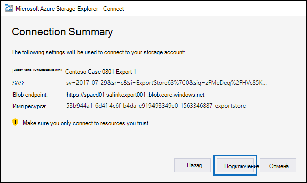

# Загрузка рабочих мест экспорта в случае с расширенным электронным открытиемDownload export jobs in an Advanced eDiscovery case

При экспорте документов из набора отзывов в случае с расширенным открытием электронных данных эти документы загружаются в расположение Хранилища Azure, предоставленное Майкрософт, или в хранилище Azure, управляемое вашей организацией.When you export documents from a review set in an Advanced eDiscovery case, the documents are uploaded to a Microsoft-provided Azure Storage location or to an Azure Storage location managed by your organization. Тип используемого расположения хранилища Azure зависит от того, какой параметр был выбран при экспорте документов.The type of Azure Storage location used depends on which option was selected when the documents were exported.

В этой статье указаны инструкции по использованию проводника хранения Microsoft Azure для подключения к расположению Хранилища Azure для просмотра и загрузки экспортных документов.This article provides instructions for how to use the Microsoft Azure Storage Explorer to connect to an Azure Storage location to browse and download the exported documents. Дополнительные сведения о Azure Storage Explorer см. в [обзоре Quickstart: Use Azure Storage Explorer.](/azure/storage/blobs/storage-quickstart-blobs-storage-explorer)For more information about Azure Storage Explorer, see [Quickstart: Use Azure Storage Explorer](/azure/storage/blobs/storage-quickstart-blobs-storage-explorer).

## Шаг 1. Установка проводника хранения AzureStep 1: Install the Azure Storage Explorer

Первым шагом является загрузка и установка Azure Storage Explorer.The first step is to download and install the Azure Storage Explorer. Инструкции см. в [средстве Azure Storage Explorer.](https://go.microsoft.com/fwlink/p/?LinkId=544842)For instructions, see [Azure Storage Explorer tool](https://go.microsoft.com/fwlink/p/?LinkId=544842). Этот инструмент используется для подключения и загрузки экспортируемой документации в шаге 3.You use this tool to connect to and download the exported documents in Step 3.

## Шаг 2. Получение URL-адреса SAS из задания экспортаStep 2: Obtain the SAS URL from the export job

Следующий шаг — получение URL-адреса подписи общего доступа (SAS), который создается при работе по экспорту для экспорта документов из [набора отзывов.](export-documents-from-review-set.md)The next step is to obtain the shared access signature (SAS) URL that's generated when you created the export job to [export documents from a review set](export-documents-from-review-set.md). Вы можете скопировать URL-адрес SAS для документов, загруженных в хранилище Azure, предоставленное Майкрософт, или в хранилище Azure, управляемое вашей организацией.You can copy the SAS URL for documents that are uploaded to a Microsoft-provided Azure Storage location or an Azure Storage location managed by your organization. В любом случае URL-адрес SAS используется для подключения к расположению Azure Storage в шаге 3.In either case, you use the SAS URL to connect to the Azure Storage location in Step 3.

1. На странице **Advanced eDiscovery** перейдите к делу, а затем щелкните вкладку **Экспорт.**On the **Advanced eDiscovery** page, go to the case, and then click the **Exports** tab.

2. На **вкладке Экспорт** щелкните задание экспорта, которое необходимо скачать.On the **Exports** tab, click the export job that you want to download.

3. На странице вылет, в **статье Locations,** скопируйте URL-адрес SAS, отображаемый.On the flyout page, under **Locations**, copy the SAS URL that's displayed. При необходимости можно сохранить его в файле, чтобы получить к нему доступ на шаге 3.If necessary, you can save it to a file so you can access it in Step 3.
 
   

## Шаг 3. Подключение к расположению хранилища AzureStep 3: Connect to the Azure Storage location

На заключительном этапе необходимо использовать Azure Storage Explorer и URL-адрес SAS для подключения к расположению Хранилища Azure и загрузки документов, экспортируемого на локальный компьютер.The final step is to use the Azure Storage Explorer and the SAS URL to connect to the Azure Storage location and download the documents that you exported to a local computer.

1. Откройте azure Storage Explorer, установленный в шаге 1.Open the Azure Storage Explorer that you installed in Step 1.

2. Щелкните **значок Добавить учетную запись.**Click the **Add account** icon. Кроме того, вы можете щелкнуть правой кнопкой мыши **учетные записи хранения**.Alternatively, you can right-click **Storage Accounts**.

   

3. На странице **Подключение к Azure Storage** нажмите кнопку Использование URI подписи общего доступа **(SAS)** и нажмите **кнопку Далее**.On the **Connect to Azure Storage** page, click **Use a shared access signature (SAS) URI** and then click **Next**.

    

4. На странице **Attach with SAS URI** щелкните поле URI и вложите URL-адрес SAS, полученный в шаге 2.On the **Attach with SAS URI** page, click in the URI box, and then paste the SAS URL that you obtained in Step 2. 

    

    Обратите внимание, что часть URL-адреса SAS отображается в поле **Имя отображения.**Notice that a portion of the SAS URL is displayed in the **Display name** box. Это будет использоваться в качестве отображаемого имени контейнера, созданного в учетных записях **хранилища** после подключения к расположению хранилища.This will be used as the display name of the container that's created under the **Storage accounts** after you connect to the storage location. Это имя состоит из идентификатора дела advanced eDiscovery и уникального идентификатора.This name consists of the ID of the Advanced eDiscovery case is from and a unique identifier. Вы можете сохранить имя отображения по умолчанию или изменить его.You can keep the default display name or change it. Если вы измените его, имя отображения должно быть уникальным.If you change it, the display name must be unique.

5. Нажмите кнопку **Далее**.Click **Next**.

    Отображается **страница сводки** подключения.The **Connection summary** page is displayed.

    

6. На странице **Сводка подключения** просмотрите сведения о подключении и нажмите кнопку **Подключиться**.On the **Connection summary** page, review the connection information, and then click **Connect**.

    Открывается **узел контейнеров Blob** (под **учетными** записями хранилища  >  **(Присоединенные** \> контейнеры).The **Blob containers** node (under **Storage Accounts** > **(Attached Containers)** \> is opened.

    

    Он содержит контейнер с именем отображения с шага 4.It contains a container named with the display name from step 4. Этот контейнер содержит папку для каждой созданной вами экспортной работы.This container contains a folder for each export job that you've created. Эти папки называются с ИД, соответствующий ID задания экспорта.These folders are named with an ID that corresponds to the ID of the export job. Эти экспортные документы (и имя экспорта) можно  найти на странице поддержки для  каждого задания по подготовке данных для экспорта, перечисленных на вкладке **Jobs.**You can find these export IDs (and the name of the export) under **Support information** on the flyout page for each **Preparing data for export** job listed on the **Jobs** tab.

7. Дважды щелкните папку задания экспорта, чтобы открыть ее.Double-click the export job folder to open it.

   Отображается список папок и отчетов об экспорте.A list of folders and export reports is displayed.
   
    

   Папка задания экспорта содержит следующие элементы.The export job folder contains the following items. Фактические элементы в папке экспорта определяются вариантами экспорта, настроенными при создания задания экспорта.The actual items in the export folder are determined by the export options configured when the export job was created. Дополнительные сведения см. [в документе Export documents from a review set.](export-documents-from-review-set.md)For more information, see [Export documents from a review set](export-documents-from-review-set.md).

    - Export_load_file.csv. Этот CSV-файл — это отчет о экспорте подробных сведений, содержащий сведения о каждом экспортируемом документе.Export_load_file.csv: This CSV file is a detail export report that contains information about each exported document. Файл состоит из столбца для каждого свойства метаданных для документа.The file consists of a column for each metadata property for a document. Список и описание метаданных, включенных в этот отчет, см. в статье Столбец имя экспортируемого поля в таблице в полях метаданных документов в [области advanced eDiscovery.](document-metadata-fields-in-advanced-ediscovery.md) For a list and description of the metadata that's included in this report, see the **Exported field name** column in the table in [Document metadata fields in Advanced eDiscovery](document-metadata-fields-in-advanced-ediscovery.md).
    
    - Summary.txt: текстовый файл, содержащий сводку экспорта, включая статистику экспорта.Summary.txt: A text file that contains a summary of the export including export statistics.
    
    - Extracted_text_files. Эта папка содержит текстовую версию каждого экспортируемого документа.Extracted_text_files: This folder contains a text file version of each exported document.
     
    - NativeFiles. Эта папка содержит родную версию файла каждого экспортируемого документа.NativeFiles: This folder contains a native file version of each exported document.
    
    - Error_files: Эта папка включает следующие элементы, когда в экспортной работе содержатся файлы ошибок:Error_files: This folder includes the following items when the export job contains any error files: 
        
      - ExtractionError.csv. Этот CSV-файл содержит доступные метаданные для файлов, которые не были должным образом извлечены из родительского элемента.ExtractionError.csv: This CSV file contains the available metadata for files that weren't properly extracted from their parent item.
        
      - ProcessingError. Эта папка содержит документы с ошибками обработки.ProcessingError: This folder contains documents with processing errors. Это содержимое находится на уровне элемента, что означает, что если у вложения была ошибка обработки, документ, содержащий вложение, также будет включен в эту папку.This content is at an item level, which means if an attachment had a processing error, the document that contains the attachment will also be included in this folder.
 
8. Чтобы экспортировать все содержимое в экспорте, выберите папку экспорта и нажмите кнопку **Скачать**.To export all contents in the export, select the export folder, and then click **Download**.

9. Укажите расположение, в котором необходимо скачать экспортируемую папку, а затем нажмите кнопку Выберите папку.Specify the location where you want to download the exported files, and then click Select folder.

    Проводник хранения Azure запускает процесс экспорта.The Azure Storage Explorer starts the export process. Состояние загрузки экспортных элементов отображается в области **Действия.**The status of the downloading the exported items is displayed in the **Activities** pane. Сообщение отображается по завершению загрузки.A message is displayed when the download is finished.

    

> [!NOTE]
> Вместо загрузки всей экспортной работы можно выбрать конкретные элементы для скачивания.Instead of downloading the entire export job, you can select specific items to download. Вместо загрузки элементов можно дважды щелкнуть элемент, чтобы просмотреть его.And instead of downloading items, you can double-click an item to view it.