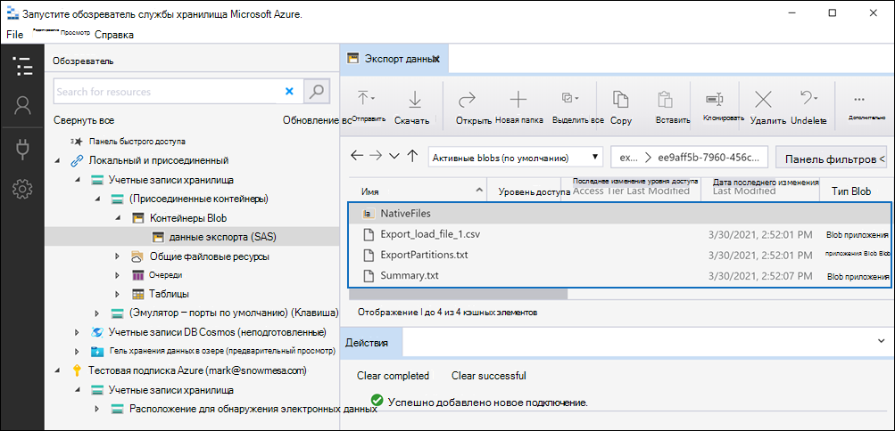

# Экспорт документов в обзорной учетной записи Azure Storage

При экспорте документов из набора отзывов в случае с расширенным открытием электронных данных вы можете экспортировать их в учетную запись Azure Storage, управляемой вашей организацией. Если вы использовали этот параметр, документы загружаются в хранилище Azure. После их экспорта вы можете получить доступ к документам (и загрузить их на локальный компьютер или другое расположение) с помощью Azure Storage Explorer. В этой статье данная статья содержит инструкции по экспорту документов в учетную запись Azure Storage и использованию Проводника хранения Azure для подключения к расположению хранилища Azure для загрузки экспортных документов. Дополнительные сведения о Azure Storage Explorer см. в дополнительных сведениях [Об использовании Azure Storage Explorer.](/azure/storage/blobs/storage-quickstart-blobs-storage-explorer)

## Перед экспортом документов из набора отзывов

- Для экспорта документов из набора отзывов необходимо предоставить маркер подписи общего доступа (SAS) для учетной записи Azure Storage и URL-адрес определенного контейнера в учетной записи хранилища. Убедитесь, что они под рукой (например, скопированные в текстовый файл) при выполнении шага 2

  - **Маркер SAS.** Не забудьте получить маркер SAS для учетной записи Azure Storage (а не для контейнера). Вы можете создать маркер SAS для вашей учетной записи в Azure Storage. Для этого перейдите к учетной записи Azure Storage и выберите подпись доступа к Share под настройками **параметров** в лезвии учетной записи хранилища.  Используйте параметры по умолчанию и разрешайте все типы ресурсов при создании маркера SAS.

  - **URL-адрес** контейнера. Для загрузки документов набора отзывов необходимо создать контейнер, а затем получить копию URL-адреса для контейнера; например, `https://ediscoverydata.blob.core.windows.net/exportdata` . Чтобы получить URL-адрес, перейдите в контейнер  в Azure Storage и выберите Свойства в разделе **Параметры** в лезвии контейнера.

- Скачайте и установите Azure Storage Explorer. Инструкции см. в [средстве Azure Storage Explorer.](https://go.microsoft.com/fwlink/p/?LinkId=544842) Этот инструмент используется для подключения к контейнеру в учетной записи Azure Storage и загрузки документов, экспортируемого в шаге 1.

## Шаг 1. Экспорт документов из набора отзывов

Первым шагом является создание задания экспорта для экспорта документов из набора отзывов. Дополнительные инструкции по всем вариантам экспорта см. в документе [Export documents from a review set.](export-documents-from-review-set.md) В следующей процедуре выделены параметры экспорта документов в учетную запись Azure Storage организации.

1. В центре соответствия требованиям Microsoft 365 откройте дело Advanced  eDiscovery, выберите вкладку Наборы отзывов и выберите набор отзывов, который необходимо экспортировать.

2. В наборе обзоров щелкните **Действие**  >  **Экспорт**.

3. На странице **флажок** "Параметры экспорта" введите имя (обязательно) и описание (необязательно) для экспорта.

4. Настройка параметров в разделах документы, метаданные, контент и параметры. Дополнительные сведения об этих параметрах см. в документе [Export documents from a review set.](export-documents-from-review-set.md)

5. В разделе **Параметры вывода** выберите структуру **сжатого** каталога, экспортируемую в вашу учетную запись Azure Storage.

6. Вклейте URL-адрес контейнера и маркер SAS для учетной записи хранилища в соответствующих полях.

   

7. Нажмите **кнопку Экспорт** для создания задания экспорта.

## Шаг 2. Получение URL-адреса SAS из задания экспорта

Следующий шаг — получение URL-адреса SAS, который создается после создания задания экспорта в шаге 1. URL-адрес SAS используется для подключения к контейнеру в учетной записи Azure Storage, в которую экспортируются документы набора отзывов.

1. На странице **Advanced eDiscovery** перейдите к делу, а затем щелкните вкладку **Экспорт.**

2. На **вкладке Экспорт** щелкните задание экспорта, которое необходимо скачать. Это задание экспорта, созданное в шаге 1.

3. На странице вылет, в **статье Locations,** скопируйте URL-адрес SAS, отображаемый. При необходимости можно сохранить его в текстовом файле, чтобы получить к нему доступ на шаге 3.

   

   > [!TIP]
   > URL-адрес SAS, отображаемый в экспортной работе, является конкатуцией URL-адреса контейнера и маркера SAS для учетной записи хранения Azure. Вы можете скопировать его из задания экспорта или создать его самостоятельно, объединив URL-адрес и маркер SAS.

## Шаг 3. Подключение к контейнеру хранения Azure

На заключительном этапе необходимо использовать azure Storage Explorer и URL-адрес SAS для подключения к контейнеру в учетной записи Azure Storage и загрузки экспортных документов на локальный компьютер.

1. Запустите лазурный проводник хранения, который вы скачали и установили.

2. Щелкните **значок Диалоговое окно Open Connect.**

   

3. На странице **Подключение к лазурным хранилищам** щелкните **контейнер Blob**.

4. На странице **Выбор метода проверки подлинности** выберите параметр Подпись общего доступа **(SAS)** и нажмите **кнопку Далее**.

5. На странице **Enter Connection Info** введите URL-адрес SAS (полученный в экспортной работе в шаге 2) в поле URL-адрес SAS контейнера **Blob.**

    

    Обратите внимание, что имя контейнера отображается в поле **Отображения имен.** Вы можете изменить это имя.

6. Нажмите **кнопку Далее,** чтобы отобразить **страницу сводки,** а затем нажмите **кнопку Подключиться**.

    Открывается **узел контейнеров Blob** (под **учетными** записями хранилища  >  **(Присоединенные** \> контейнеры).

    

    Он содержит контейнер с именем отображения из шага 5. Этот контейнер содержит папку для каждой экспортной работы, которую вы скачали в контейнер в учетной записи Azure Storage. Эти папки называются с ИД, соответствующий ID задания экспорта. Эти документы экспорта (и имя экспорта) можно найти  на странице Поддержки для  каждого задания подготовки данных для экспорта, перечисленных на вкладке **Jobs** в деле Advanced eDiscovery.

7. Дважды щелкните папку задания экспорта, чтобы открыть ее.

   Отображается список папок и отчетов об экспорте.

    

8. Чтобы экспортировать все содержимое из задания экспорта, щелкните стрелку **Up,** чтобы вернуться в папку задания экспорта, а затем нажмите кнопку **Скачать**.

9. Укажите расположение, в котором необходимо скачать экспортируемую папку, а затем нажмите кнопку Выберите папку.

    Проводник хранилища Azure запускает процесс загрузки. Состояние загрузки экспортных элементов отображается в области **Действия.** Сообщение отображается после завершения загрузки.

> [!NOTE]
> Вместо загрузки всей экспортной работы в Azure Storage Explorer можно выбрать определенные элементы для скачивания и просмотра.

## Дополнительная информация

- Папка задания экспорта содержит следующие элементы. Фактические элементы в папке экспорта определяются вариантами экспорта, настроенными при создания задания экспорта. Дополнительные сведения об этих параметрах см. в [документе Export documents from a review set.](export-documents-from-review-set.md)

  - Export_load_file.csv. Этот CSV-файл — это отчет о экспорте подробных сведений, содержащий сведения о каждом экспортируемом документе. Файл состоит из столбца для каждого свойства метаданных для документа. Список и описание метаданных, включенных в этот отчет, см. в статье Столбец имя экспортируемого поля в таблице в полях метаданных документов в [области advanced eDiscovery.](document-metadata-fields-in-advanced-ediscovery.md) 

  - Summary.txt: текстовый файл, содержащий сводку экспорта, включая статистику экспорта.

  - Extracted_text_files. Эта папка содержит текстовую версию каждого экспортируемого документа.

  - NativeFiles. Эта папка содержит родную версию файла каждого экспортируемого документа.

  - Error_files: Эта папка включает следующие элементы, когда в экспортной работе содержатся файлы ошибок:

    - ExtractionError.csv. Этот CSV-файл содержит доступные метаданные для файлов, которые не были должным образом извлечены из родительского элемента.

    - ProcessingError. Эта папка содержит документы с ошибками обработки. Это содержимое находится на уровне элемента, что означает, что если у вложения была ошибка обработки, документ, содержащий вложение, также будет включен в эту папку.
