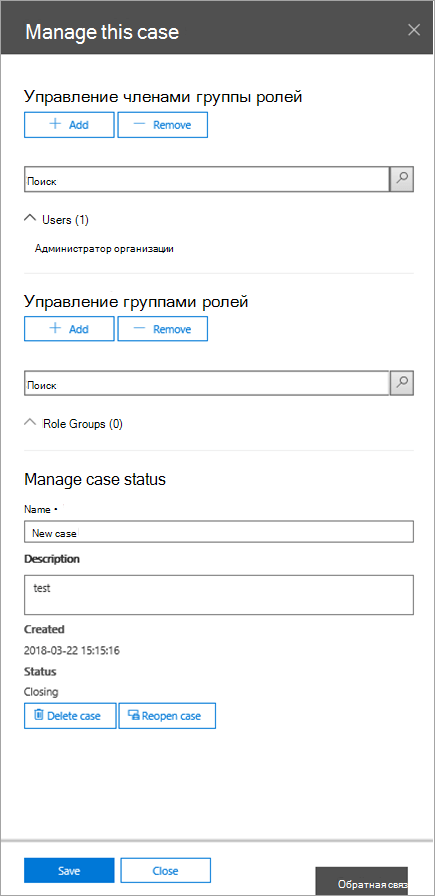
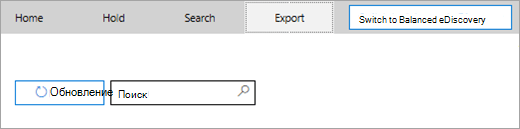

# <a name="manage-ediscovery-cases-in-the-security--compliance-center"></a><span data-ttu-id="001f7-105">Управление делами обнаружения электронных данных в Центре безопасности и соответствия требованиям</span><span class="sxs-lookup"><span data-stu-id="001f7-105">Manage eDiscovery cases in the Security & Compliance Center</span></span>

<span data-ttu-id="001f7-106">С помощью вариантов обнаружения электронных данных в центре соответствия требованиям в Office 365 и Microsoft 365 можно управлять тем, кто может создавать и управлять делами обнаружения электронных данных в Организации.</span><span class="sxs-lookup"><span data-stu-id="001f7-106">You can use eDiscovery cases in the compliance center in Office 365 and Microsoft 365 to control who can create, access, and manage eDiscovery cases in your organization.</span></span> <span data-ttu-id="001f7-107">Если у вашей организации есть подписка на Office 365, вы также можете использовать случаи обнаружения электронных данных для анализа результатов поиска с помощью Office 365 Advanced eDiscovery.</span><span class="sxs-lookup"><span data-stu-id="001f7-107">If your organization has an Office 365 E5 subscription, you can also use eDiscovery cases to analyze search results by using Office 365 Advanced eDiscovery.</span></span>
  
<span data-ttu-id="001f7-108">Дело обнаружения электронных данных позволяет добавлять участников в дело, разрешать или запрещать им выполнять определенные действия, ставить на удержание расположения контента, необходимые для судебных дел, и сопоставлять несколько операций поиска контента с одним делом.</span><span class="sxs-lookup"><span data-stu-id="001f7-108">An eDiscovery case allows you to add members to a case, control what types of actions that specific case members can perform, place a hold on content locations relevant to a legal case, and associate multiple Content Searches with a single case.</span></span> <span data-ttu-id="001f7-109">Кроме того, вы можете экспортировать результаты любого поиска контента, связанного с обращением, или подготовить результаты поиска для анализа в Advanced eDiscovery.</span><span class="sxs-lookup"><span data-stu-id="001f7-109">You can also export the results of any Content Search that is associated with a case or prepare search results for analysis in Advanced eDiscovery.</span></span> <span data-ttu-id="001f7-110">Дела обнаружения электронных данных — хороший способ ограничивать доступ к операциям поиска контента и результатам поиска для конкретных судебных дел в организации.</span><span class="sxs-lookup"><span data-stu-id="001f7-110">eDiscovery cases are a good way to limit who has access to Content Searches and search results for a specific legal case in your organization.</span></span>
  
<span data-ttu-id="001f7-111">Используйте следующий рабочий процесс, чтобы настроить и использовать случаи обнаружения электронных данных в центре безопасности & соответствия требованиям и Advanced eDiscovery.</span><span class="sxs-lookup"><span data-stu-id="001f7-111">Use the following workflow to set-up and use eDiscovery cases in the Security & Compliance Center and Advanced eDiscovery.</span></span>

[<span data-ttu-id="001f7-112">Step 1: Assign eDiscovery permissions to potential case members</span><span class="sxs-lookup"><span data-stu-id="001f7-112">Step 1: Assign eDiscovery permissions to potential case members</span></span>](#step-1-assign-ediscovery-permissions-to-potential-case-members)

[<span data-ttu-id="001f7-113">Шаг 2: создание нового дела</span><span class="sxs-lookup"><span data-stu-id="001f7-113">Step 2: Create a new case</span></span>](#step-2-create-a-new-case)

[<span data-ttu-id="001f7-114">Шаг 3: Добавление участников в обращение</span><span class="sxs-lookup"><span data-stu-id="001f7-114">Step 3: Add members to a case</span></span>](#step-3-add-members-to-a-case)

[<span data-ttu-id="001f7-115">Шаг 4: размещение расположений содержимого на удержании</span><span class="sxs-lookup"><span data-stu-id="001f7-115">Step 4: Place content locations on hold</span></span>](#step-4-place-content-locations-on-hold)

[<span data-ttu-id="001f7-116">Шаг 5: создание и выполнение поиска контента, связанного с обращением</span><span class="sxs-lookup"><span data-stu-id="001f7-116">Step 5: Create and run a Content Search associated with a case</span></span>](#step-5-create-and-run-a-content-search-associated-with-a-case)

[<span data-ttu-id="001f7-117">Шаг 6: экспорт результатов поиска контента, связанных с обращением</span><span class="sxs-lookup"><span data-stu-id="001f7-117">Step 6: Export the results of a Content Search associated with a case</span></span>](#step-6-export-the-results-of-a-content-search-associated-with-a-case)

[<span data-ttu-id="001f7-118">Шаг 7: подготовка результатов поиска для расширенного обнаружения электронных данных</span><span class="sxs-lookup"><span data-stu-id="001f7-118">Step 7: Prepare search results for Advanced eDiscovery</span></span>](#step-7-prepare-search-results-for-advanced-ediscovery)

[<span data-ttu-id="001f7-119">Шаг 8: переход к обращению в Advanced eDiscovery</span><span class="sxs-lookup"><span data-stu-id="001f7-119">Step 8: Go to the case in Advanced eDiscovery</span></span>](#step-8-go-to-the-case-in-advanced-ediscovery)

[<span data-ttu-id="001f7-120">Необязательно Шаг 9: закрытие дела</span><span class="sxs-lookup"><span data-stu-id="001f7-120">(Optional) Step 9: Close a case</span></span>](#optional-step-9-close-a-case)

[<span data-ttu-id="001f7-121">Необязательно Шаг 10: повторное открытие закрытого дела</span><span class="sxs-lookup"><span data-stu-id="001f7-121">(Optional) Step 10: Re-open a closed case</span></span>](#optional-step-10-re-open-a-closed-case)

[<span data-ttu-id="001f7-122">Дополнительные сведения</span><span class="sxs-lookup"><span data-stu-id="001f7-122">More information</span></span>](#more-information)
  
## <a name="step-1-assign-ediscovery-permissions-to-potential-case-members"></a><span data-ttu-id="001f7-123">Шаг 1. Назначение разрешений на обнаружение электронных данных возможным членам дела</span><span class="sxs-lookup"><span data-stu-id="001f7-123">Step 1: Assign eDiscovery permissions to potential case members</span></span>

<span data-ttu-id="001f7-124">Первым шагом является назначение соответствующих разрешений обнаружения электронных данных пользователям, чтобы их можно было добавить в дело обнаружения электронных данных на этапе 2.</span><span class="sxs-lookup"><span data-stu-id="001f7-124">The first step is to assign the appropriate eDiscovery-related permissions to people so you can add them to an eDiscovery case in Step 2.</span></span> <span data-ttu-id="001f7-125">Для назначения разрешений обнаружения электронных данных необходимо быть членом группы ролей "Управление организацией" (или назначить роль управления ролями) в центре безопасности & соответствия требованиям.</span><span class="sxs-lookup"><span data-stu-id="001f7-125">You have to be a member of the Organization Management role group (or be assigned the Role Management role) in the Security & Compliance Center to assign eDiscovery permissions.</span></span> <span data-ttu-id="001f7-126">В следующем списке описываются группы ролей, связанные с eDiscovery, в центре безопасности & соответствия требованиям.</span><span class="sxs-lookup"><span data-stu-id="001f7-126">The following list describes the eDiscovery-related role groups in the Security & Compliance Center.</span></span> 
  
- <span data-ttu-id="001f7-127">**Рецензент.**</span><span class="sxs-lookup"><span data-stu-id="001f7-127">**Reviewer.**</span></span> <span data-ttu-id="001f7-128">Для этой группы разрешения, связанные с eDiscovery, самые строгие.</span><span class="sxs-lookup"><span data-stu-id="001f7-128">This role group has the most restrictive eDiscovery-related permissions.</span></span> <span data-ttu-id="001f7-129">Основная цель этой группы ролей — разрешить участникам просматривать и получать доступ к данным о делах в [Advanced eDiscovery (Classic)](office-365-advanced-ediscovery.md) (также известном как *Advanced eDiscovery v1*).</span><span class="sxs-lookup"><span data-stu-id="001f7-129">The primary purpose of this role group is to allow members to view and access case data in [Advanced eDiscovery (classic)](office-365-advanced-ediscovery.md) (also known as *Advanced eDiscovery v1*).</span></span> <span data-ttu-id="001f7-130">Участники этой группы могут просматривать и открывать список обращений на странице **обнаружения электронных** данных в центре безопасности & соответствия требованиям, участником которых они являются.</span><span class="sxs-lookup"><span data-stu-id="001f7-130">Members of this group can only see and open the list of the cases on the **eDiscovery** page in the Security & Compliance Center that they are members of.</span></span> <span data-ttu-id="001f7-131">После того как пользователь попытается получить доступ к случаю в центре безопасности и соответствия требованиям, он может нажать кнопку **переключиться на расширенные функции обнаружения электронных** данных для доступа и анализа данных дела в Advanced eDiscovery.</span><span class="sxs-lookup"><span data-stu-id="001f7-131">After the user accesses a case in the security and compliance center, they can click **Switch to Advanced eDiscovery** to access and analyze the case data in Advanced eDiscovery.</span></span> <span data-ttu-id="001f7-132">Они не могут создавать обращения, добавлять участников в обращение, создавать удержания, создавать поиски, просматривать результаты поиска, экспортировать результаты поиска и подготавливать результаты для расширенного обнаружения электронных данных.</span><span class="sxs-lookup"><span data-stu-id="001f7-132">They can't create cases, add members to a case, create holds, create searches, preview search results, export search results, or prepare results for Advanced eDiscovery.</span></span> 

   > [!NOTE]
   > <span data-ttu-id="001f7-133">В настоящее время пользователи, являющиеся членами группы ролей проверяющего, не могут получать доступ к данным в [приложении Advanced eDiscovery в Microsoft 365](overview-ediscovery-20.md) (также известном как *Advanced eDiscovery v2*).</span><span class="sxs-lookup"><span data-stu-id="001f7-133">At this time, users who are member of the Reviewer role group can't access data in [Advanced eDiscovery in Microsoft 365](overview-ediscovery-20.md) (also known as *Advanced eDiscovery v2*).</span></span> <span data-ttu-id="001f7-134">Чтобы добавить участников к обращению в Advanced eDiscovery v2, чтобы они могли просматривать данные о делах, пользователь должен быть членом группы ролей "Диспетчер обнаружения электронных данных".</span><span class="sxs-lookup"><span data-stu-id="001f7-134">To add members to a case in Advanced eDiscovery v2 so that they can review case data, a user must be a member of the eDiscovery Manager role group.</span></span>
    
- <span data-ttu-id="001f7-135">**Диспетчер обнаружения электронных данных.**</span><span class="sxs-lookup"><span data-stu-id="001f7-135">**eDiscovery Manager.**</span></span> <span data-ttu-id="001f7-136">Члены этой группы ролей могут создавать дела обнаружения электронных данных и управлять ими.</span><span class="sxs-lookup"><span data-stu-id="001f7-136">Members of this role group can create and manage eDiscovery cases.</span></span> <span data-ttu-id="001f7-137">Они могут добавлять и удалять элементы, размещать расположения содержимого на удержании, создавать и редактировать поиск контента, связанные с обращением, экспортировать результаты поиска контента и подготовить результаты поиска для анализа в Advanced eDiscovery.</span><span class="sxs-lookup"><span data-stu-id="001f7-137">They can add and remove members, place content locations on hold, create and edit Content Searches associated with a case, export the results of a Content Search, and prepare search results for analysis in Advanced eDiscovery.</span></span> <span data-ttu-id="001f7-138">В этой группе ролей есть две подгруппы.</span><span class="sxs-lookup"><span data-stu-id="001f7-138">There are two subgroups in this role group.</span></span> <span data-ttu-id="001f7-139">Разница между этими подгруппами заключается в области их действия.</span><span class="sxs-lookup"><span data-stu-id="001f7-139">The difference between these subgroups is based on scope.</span></span>
    
  - <span data-ttu-id="001f7-140">**Диспетчер обнаружения электронных данных.**</span><span class="sxs-lookup"><span data-stu-id="001f7-140">**eDiscovery Manager.**</span></span> <span data-ttu-id="001f7-141">Возможность просмотра и управления делами обнаружения электронных данных, которые они создают или являются участниками.</span><span class="sxs-lookup"><span data-stu-id="001f7-141">Can view and manage the eDiscovery cases they create or are a member of.</span></span> <span data-ttu-id="001f7-142">Если другой диспетчер обнаружения электронных данных создает обращение, но не добавляет второго диспетчера обнаружения электронных данных в качестве участника этого случая, второй диспетчер обнаружения электронных данных не сможет просмотреть или открыть это обращение на странице **обнаружения электронных** данных в центре безопасности & соответствия требованиям.</span><span class="sxs-lookup"><span data-stu-id="001f7-142">If another eDiscovery Manager creates a case but doesn't add a second eDiscovery Manager as a member of that case, the second eDiscovery Manager won't be able to view or open the case on the **eDiscovery** page in the Security & Compliance Center.</span></span> <span data-ttu-id="001f7-143">Диспетчеры обнаружения электронных данных также могут получать доступ к своим случаям в Advanced eDiscovery для выполнения задач анализа.</span><span class="sxs-lookup"><span data-stu-id="001f7-143">eDiscovery Managers can also access their cases in Advanced eDiscovery to perform analysis tasks.</span></span> 
    
  - <span data-ttu-id="001f7-144">\**Администратор обнаружения электронных данных *.**</span><span class="sxs-lookup"><span data-stu-id="001f7-144">**eDiscovery Administrator\*.**</span></span> <span data-ttu-id="001f7-145">Может выполнять все задачи по управлению делами, которые выполняет руководитель службы обнаружения электронных данных.</span><span class="sxs-lookup"><span data-stu-id="001f7-145">Can perform all case management tasks that an eDiscovery Manager can do.</span></span> <span data-ttu-id="001f7-146">Кроме того, администратор, ответственный за обнаружение электронных данных, может выполнять указанные ниже действия.</span><span class="sxs-lookup"><span data-stu-id="001f7-146">Additionally, an eDiscovery Administrator can:</span></span>
    
    - <span data-ttu-id="001f7-147">Просматривать все дела, отображаемые на странице **Обнаружение электронных данных**.</span><span class="sxs-lookup"><span data-stu-id="001f7-147">View all cases that are listed on the **eDiscovery** page.</span></span> 
    
    - <span data-ttu-id="001f7-148">Управление любыми делами в Организации после добавления их в качестве участника дела.</span><span class="sxs-lookup"><span data-stu-id="001f7-148">Manage any case in the organization after they add themself as a member of the case.</span></span>
    
    - <span data-ttu-id="001f7-149">Доступ к данным обращения в Advanced eDiscovery для любого случая в Организации.</span><span class="sxs-lookup"><span data-stu-id="001f7-149">Access case data in Advanced eDiscovery for any case in the organization.</span></span>
    
    <span data-ttu-id="001f7-150">Причины, по которым организации нужен администратор, ответственный за обнаружение электронных данных, см. в разделе [More information](#more-information).</span><span class="sxs-lookup"><span data-stu-id="001f7-150">See the [More information](#more-information) section for reasons why you may want an eDiscovery Administrator in your organization.</span></span> 

<span data-ttu-id="001f7-151">Дополнительные сведения о разрешениях обнаружения электронных данных приведены в разделе [Назначение разрешений обнаружения электронных](assign-ediscovery-permissions.md)данных.</span><span class="sxs-lookup"><span data-stu-id="001f7-151">For more information about eDiscovery permissions, see [Assign eDiscovery permissions](assign-ediscovery-permissions.md).</span></span>
  
 <span data-ttu-id="001f7-152">**Чтобы назначить разрешения на обнаружение электронных данных:**</span><span class="sxs-lookup"><span data-stu-id="001f7-152">**To assign eDiscovery permissions:**</span></span>
  
1. <span data-ttu-id="001f7-153">Перейдите по ссылке [https://protection.office.com](https://protection.office.com).</span><span class="sxs-lookup"><span data-stu-id="001f7-153">Go to [https://protection.office.com](https://protection.office.com).</span></span>
    
2. <span data-ttu-id="001f7-154">Войдите в Office 365 с помощью своей рабочей или учебной учетной записи.</span><span class="sxs-lookup"><span data-stu-id="001f7-154">Sign in to Office 365 using your work or school account.</span></span>
    
3. <span data-ttu-id="001f7-155">В центре безопасности & соответствия требованиям нажмите **разрешения**, а затем выполните одно из следующих действий на основе разрешений обнаружения электронных данных, которые нужно назначить.</span><span class="sxs-lookup"><span data-stu-id="001f7-155">In the Security & Compliance Center, click **Permissions**, and then do one of the following based on the eDiscovery permissions that you want to assign.</span></span>
    
    - <span data-ttu-id="001f7-156">Чтобы назначить разрешения рецензенту, выберите группу ролей **проверяющего** , а затем рядом с пунктом **элементы**нажмите кнопку **изменить**.</span><span class="sxs-lookup"><span data-stu-id="001f7-156">To assign Reviewer permissions, select the **Reviewer** role group, and then next to **Members**, click **Edit**.</span></span> <span data-ttu-id="001f7-157">Нажмите **выбрать участников**, нажмите кнопку **изменить**,  значок **Добавить**, выберите пользователя, которого нужно добавить в группу ролей рецензента, а затем нажмите кнопку **Добавить**.</span><span class="sxs-lookup"><span data-stu-id="001f7-157">Click **Choose members**, click **Edit**, click  **Add**, select the user that you want to add to the Reviewer role group, and then click **Add**.</span></span>
    
    - <span data-ttu-id="001f7-158">Чтобы назначить разрешения для диспетчера обнаружения электронных данных, выберите группу ролей **Диспетчер** обнаружения электронных данных, а затем рядом с элементом **Диспетчер обнаружения электронных**данных нажмите кнопку **изменить**.</span><span class="sxs-lookup"><span data-stu-id="001f7-158">To assign eDiscovery Manager permissions, select the **eDiscovery Manager** role group, and then next to **eDiscovery Manager**, click **Edit**.</span></span> <span data-ttu-id="001f7-159">Нажмите кнопку **выберите Диспетчер обнаружения электронных**данных, нажмите  \* \* добавить \* \*, выберите пользователя, которого нужно добавить в качестве диспетчера обнаружения электронных данных, а затем нажмите кнопку **Добавить**.</span><span class="sxs-lookup"><span data-stu-id="001f7-159">Click **Choose eDiscovery Manager**, click **Edit**, click  \*\* Add \*\*, select the user that you want to add as an eDiscovery Manager, and then click **Add**.</span></span>
    
    - <span data-ttu-id="001f7-160">Чтобы назначить разрешения администратора обнаружения электронных данных, выберите группу ролей **Диспетчер обнаружения** электронных данных, а затем рядом с элементом **Администратор обнаружения электронных**данных нажмите кнопку **изменить**.</span><span class="sxs-lookup"><span data-stu-id="001f7-160">To assign eDiscovery Administrator permissions, select the **eDiscovery Manager** role group, and then next to **eDiscovery Administrator**, click **Edit**.</span></span> <span data-ttu-id="001f7-161">Нажмите **выбрать администратора обнаружения электронных**данных **Edit**нажмите кнопку Изменить  добавить значок **Добавить**, выберите пользователя, которого вы хотите добавить в качестве администратора обнаружения электронных данных, а затем нажмите кнопку **Добавить**.</span><span class="sxs-lookup"><span data-stu-id="001f7-161">Click **Choose eDiscovery Administrator**, click **Edit**, click  **Add**, select the user that you want to add as an eDiscovery Administrator, and then click **Add**.</span></span>
    
4. <span data-ttu-id="001f7-162">После добавления всех пользователей нажмите кнопку **Готово**, нажмите кнопку **сохранить** , чтобы сохранить изменения, внесенные в группу ролей, а затем нажмите кнопку **Закрыть**.</span><span class="sxs-lookup"><span data-stu-id="001f7-162">After you have added all the users, click **Done**, click **Save** to save the changes to the role group, and then click **Close**.</span></span>

## <a name="step-2-create-a-new-case"></a><span data-ttu-id="001f7-163">Шаг 2: создание нового дела</span><span class="sxs-lookup"><span data-stu-id="001f7-163">Step 2: Create a new case</span></span>

<span data-ttu-id="001f7-164">Следующий шаг — создание дела eDiscovery.</span><span class="sxs-lookup"><span data-stu-id="001f7-164">The next step is to create a eDiscovery case.</span></span> <span data-ttu-id="001f7-165">Чтобы вы могли создавать такие дела, вы должны быть членом группы ролей "Руководители службы обнаружения электронных данных".</span><span class="sxs-lookup"><span data-stu-id="001f7-165">You must be a member of the eDiscovery Managers role group to create eDiscovery cases.</span></span> <span data-ttu-id="001f7-166">Как описывалось ранее, после создания дела в центре безопасности & соответствия требованиям вы (и другие элементы Case) смогут получать доступ к этому же регистру в Advanced eDiscovery, если у вашей организации есть подписка на Office 365.</span><span class="sxs-lookup"><span data-stu-id="001f7-166">As previously explained, after you create a case in the Security & Compliance Center, you (and other case members) will be able to access that same case in Advanced eDiscovery if your organization has an Office 365 E5 subscription.</span></span>
  
1. <span data-ttu-id="001f7-167">Перейдите по ссылке [https://protection.office.com](https://protection.office.com).</span><span class="sxs-lookup"><span data-stu-id="001f7-167">Go to [https://protection.office.com](https://protection.office.com).</span></span>
    
2. <span data-ttu-id="001f7-168">Войдите в Office 365 с помощью своей рабочей или учебной учетной записи.</span><span class="sxs-lookup"><span data-stu-id="001f7-168">Sign in to Office 365 using your work or school account.</span></span>
    
3. <span data-ttu-id="001f7-169">В центре безопасности & соответствия **требованиям выберите** \> **Обнаружение**электронных данных и нажмите кнопку  **создать обращение**.</span><span class="sxs-lookup"><span data-stu-id="001f7-169">In the Security & Compliance Center, click **eDiscovery** \> **eDiscovery**, and then click  **Create a case**.</span></span>
    
4. <span data-ttu-id="001f7-170">На странице **новый вариант** укажите имя, введите необязательное описание, а затем нажмите кнопку **сохранить**.</span><span class="sxs-lookup"><span data-stu-id="001f7-170">On the **New Case** page, give the case a name, type an optional description, and then click **Save**.</span></span> <span data-ttu-id="001f7-171">Имя дела должно быть уникальным в Организации.</span><span class="sxs-lookup"><span data-stu-id="001f7-171">The case name must be unique in your organization.</span></span>
    
    
  
    <span data-ttu-id="001f7-173">Новый вариант отображается в списке обращений на странице **Обнаружение электронных** данных.</span><span class="sxs-lookup"><span data-stu-id="001f7-173">The new case is displayed in the list of cases on the **eDiscovery** page.</span></span> <span data-ttu-id="001f7-174">Вы можете навести указатель мыши на имя обращения, чтобы отобразить сведения о нем, в том числе состояние обращения (**активное** или **закрытое**), описание варианта (созданного на предыдущем шаге), а также когда обращение было изменено последним и кем оно было изменено.</span><span class="sxs-lookup"><span data-stu-id="001f7-174">You can hover the cursor over a case name to display information about the case, including the status of the case (**Active** or **Closed**), the description of the case (that was created in the previous step), and when the case was changed last and who changed it.</span></span>
    
    > [!TIP]
    > <span data-ttu-id="001f7-175">После создания нового дела вы можете переименовать его в любое время.</span><span class="sxs-lookup"><span data-stu-id="001f7-175">After you create a new case, you can rename it anytime.</span></span> <span data-ttu-id="001f7-176">Просто щелкните имя варианта на странице **Обнаружение электронных** данных.</span><span class="sxs-lookup"><span data-stu-id="001f7-176">Just click the name of the case on the **eDiscovery** page.</span></span> <span data-ttu-id="001f7-177">На всплывающей странице **Управление этим вариантом** измените имя, отображаемое в поле **имя**, а затем сохраните изменения.</span><span class="sxs-lookup"><span data-stu-id="001f7-177">On the **Manage this case** flyout page, change the name displayed in the box under **Name**, and then save the change.</span></span> 
## <a name="step-3-add-members-to-a-case"></a><span data-ttu-id="001f7-178">Шаг 3: Добавление участников в обращение</span><span class="sxs-lookup"><span data-stu-id="001f7-178">Step 3: Add members to a case</span></span>

<span data-ttu-id="001f7-179">После создания такого случая необходимо добавить в него участников.</span><span class="sxs-lookup"><span data-stu-id="001f7-179">After you create a case, the next step is to add members to the case.</span></span> <span data-ttu-id="001f7-180">Диспетчер обнаружения электронных данных, создавший обращение, автоматически добавляется в качестве участника.</span><span class="sxs-lookup"><span data-stu-id="001f7-180">The eDiscovery Manager who created the case is automatically added as a member.</span></span> <span data-ttu-id="001f7-181">Как описывалось ранее, членам необходимо назначить соответствующие разрешения обнаружения электронных данных, чтобы они могли получать доступ к случаю после их добавления.</span><span class="sxs-lookup"><span data-stu-id="001f7-181">As previously explained, members have to assign the appropriate eDiscovery permissions so they can access the case after you add them.</span></span>
  
1. <span data-ttu-id="001f7-182">В центре безопасности & соответствия требованиям нажмите **Обнаружение** электронных данных **обнаружения электронных** \> данных, чтобы отобразить список дел в Организации.</span><span class="sxs-lookup"><span data-stu-id="001f7-182">In the Security & Compliance Center, click **eDiscovery** \> **eDiscovery** to display the list of cases in your organization.</span></span> 

2. <span data-ttu-id="001f7-183">Щелкните имя обращения, в которое требуется добавить участников.</span><span class="sxs-lookup"><span data-stu-id="001f7-183">Click the name of the case that you want to add members to.</span></span>

    <span data-ttu-id="001f7-184">Отображается раскрывающаяся страница **Управление этим обращением** .</span><span class="sxs-lookup"><span data-stu-id="001f7-184">The **Manage this case** flyout page is displayed.</span></span> 

    
  
3. <span data-ttu-id="001f7-186">В разделе **Управление участниками**нажмите  значок **Добавить** , чтобы добавить участников в обращение.</span><span class="sxs-lookup"><span data-stu-id="001f7-186">Under **Manage members**, click  **Add** to add members to the case.</span></span> 

    <span data-ttu-id="001f7-187">Вы также можете добавить группу ролей в дело.</span><span class="sxs-lookup"><span data-stu-id="001f7-187">You can also choose to add a role group to the case.</span></span> <span data-ttu-id="001f7-188">В разделе **Управление группами ролей**нажмите  значок **Добавить**.</span><span class="sxs-lookup"><span data-stu-id="001f7-188">Under **Manage role groups**, click  **Add**.</span></span>

    > [!NOTE]
    > <span data-ttu-id="001f7-189">Группы ролей управляют тем, кто может назначать элементы для случая обнаружения электронных данных.</span><span class="sxs-lookup"><span data-stu-id="001f7-189">Role groups control who can assign members to an eDiscovery case.</span></span> <span data-ttu-id="001f7-190">Это означает, что вы можете назначить только те группы ролей, участником которых вы являетесь.</span><span class="sxs-lookup"><span data-stu-id="001f7-190">That means you can only assign the role groups that you are a member of to a case.</span></span>

4. <span data-ttu-id="001f7-191">В списке пользователей или групп ролей, которые можно добавить в качестве членов этого случая установите флажки рядом с именами пользователей или групп ролей, которые нужно добавить.</span><span class="sxs-lookup"><span data-stu-id="001f7-191">In the list of people or role groups that can be added as members of the case, click the check box next to the names of the people or role groups that you want to add.</span></span>

    > [!TIP]
    > <span data-ttu-id="001f7-192">Если у вас есть большой список людей, которые могут добавляться в качестве участников, используйте поле **поиска** для поиска определенного пользователя в списке.</span><span class="sxs-lookup"><span data-stu-id="001f7-192">If you have a large list of people who can added as members, use the **Search** box to search for a specific person in the list.</span></span> 
  
5. <span data-ttu-id="001f7-193">После выбора пользователей или групп ролей, добавляемых в качестве участников группы, нажмите кнопку **Добавить**.</span><span class="sxs-lookup"><span data-stu-id="001f7-193">After you select the people or role groups to add as members of the group, click **Add**.</span></span>
    
    <span data-ttu-id="001f7-194">В разделе **Управление этим случаем**нажмите кнопку **сохранить** , чтобы сохранить новый список элементов дела.</span><span class="sxs-lookup"><span data-stu-id="001f7-194">In **Manage this case**, click **Save** to save the new list of case members.</span></span> 
    
6. <span data-ttu-id="001f7-195">Нажмите кнопку **сохранить** , чтобы сохранить новый список элементов дела.</span><span class="sxs-lookup"><span data-stu-id="001f7-195">Click **Save** to save the new list of case members.</span></span> 
  
## <a name="step-4-place-content-locations-on-hold"></a><span data-ttu-id="001f7-196">Шаг 4: размещение расположений содержимого на удержании</span><span class="sxs-lookup"><span data-stu-id="001f7-196">Step 4: Place content locations on hold</span></span>

<span data-ttu-id="001f7-197">С помощью дела обнаружения электронных данных вы можете создавать удержания, чтобы сохранить контент, который может быть связан с делом.</span><span class="sxs-lookup"><span data-stu-id="001f7-197">You can use an eDiscovery case to create holds to preserve content that might be relevant to the case.</span></span> <span data-ttu-id="001f7-198">Вы можете поместить удержание на сайты почтовых ящиков и OneDrive для бизнеса для людей, которые custodians в случае.</span><span class="sxs-lookup"><span data-stu-id="001f7-198">You can place a hold on the mailboxes and OneDrive for Business sites of people who are custodians in the case.</span></span> <span data-ttu-id="001f7-199">Вы также можете поместить удержание на сайт группового почтового ящика, сайта SharePoint и сайта OneDrive для бизнеса для группы Office 365.</span><span class="sxs-lookup"><span data-stu-id="001f7-199">You can also place a hold on the group mailbox, SharePoint site, and OneDrive for Business site for an Office 365 Group.</span></span> <span data-ttu-id="001f7-200">Аналогичным образом можно заблокировать почтовые ящики и сайты, связанные с Microsoft Teams или группами Yammer.</span><span class="sxs-lookup"><span data-stu-id="001f7-200">Similarly, you can place a hold on the mailboxes and sites that are associated with Microsoft Teams or Yammer Groups.</span></span> <span data-ttu-id="001f7-201">При помещении расположений контента в удержание содержимое удерживается до тех пор, пока не будет удалено место хранения контента или не будет удалено удержание.</span><span class="sxs-lookup"><span data-stu-id="001f7-201">When you place content locations on hold, content is held until you remove the hold from the content location or until you delete the hold.</span></span>

> [!NOTE]
> <span data-ttu-id="001f7-202">После размещения содержимого на удержании он занимает до 24 часов, чтобы удержание вступило в силу.</span><span class="sxs-lookup"><span data-stu-id="001f7-202">After you place a content location on hold, it takes up to 24 hours for the hold to take effect.</span></span> 

<span data-ttu-id="001f7-203">При создании удержания вы можете использовать следующие параметры для определения области контента, который хранится в указанных расположениях контента:</span><span class="sxs-lookup"><span data-stu-id="001f7-203">When you create a hold, you have the following options to scope the content that is held in the specified content locations:</span></span>
  
- <span data-ttu-id="001f7-204">Вы создаете бесконечное удержание, в котором все содержимое размещается на удержании.</span><span class="sxs-lookup"><span data-stu-id="001f7-204">You create an infinite hold where all content is placed on hold.</span></span> <span data-ttu-id="001f7-205">Кроме того, вы можете создать удержание на основе запроса, в котором на удержание помещается только содержимое, соответствующее поисковому запросу.</span><span class="sxs-lookup"><span data-stu-id="001f7-205">Alternatively, you can create a query-based hold where only content that matches a search query is placed on hold.</span></span>
    
- <span data-ttu-id="001f7-206">Вы можете указать диапазон дат, в течение которого будет храниться только содержимое, которое было отправлено, получено или создано в пределах этого диапазона дат.</span><span class="sxs-lookup"><span data-stu-id="001f7-206">You can specify a date range to hold only the content that was sent, received, or created within that date range.</span></span> <span data-ttu-id="001f7-207">Кроме того, вы можете хранить все содержимое независимо от того, когда оно было отправлено, получено или создано.</span><span class="sxs-lookup"><span data-stu-id="001f7-207">Alternatively, you can hold all content regardless of when it was sent, received, or created.</span></span>
    
> [!NOTE]
> <span data-ttu-id="001f7-208">Вы можете использовать до 10 000 политик хранения для всех вариантов обнаружения электронных данных в Организации.</span><span class="sxs-lookup"><span data-stu-id="001f7-208">You can have a maximum of 10,000 hold policies across all eDiscovery cases in your organization.</span></span> 
  
<span data-ttu-id="001f7-209">Чтобы создать удержание для случая обнаружения электронных данных, выполните указанные ниже действия.</span><span class="sxs-lookup"><span data-stu-id="001f7-209">To create a hold for an eDiscovery case:</span></span>
  
1. <span data-ttu-id="001f7-210">В центре безопасности & соответствия требованиям нажмите **Обнаружение** электронных данных **обнаружения электронных** \> данных, чтобы отобразить список дел в Организации.</span><span class="sxs-lookup"><span data-stu-id="001f7-210">In the Security & Compliance Center, click **eDiscovery** \> **eDiscovery** to display the list of cases in your organization.</span></span> 
    
2. <span data-ttu-id="001f7-211">Нажмите кнопку **Открыть** рядом с тем случае, в котором нужно создать удержания.</span><span class="sxs-lookup"><span data-stu-id="001f7-211">Click **Open** next to the case that you want to create the holds in.</span></span> 
    
3. <span data-ttu-id="001f7-212">На **домашней** странице для обращения перейдите на вкладку **удержание** .</span><span class="sxs-lookup"><span data-stu-id="001f7-212">On the **Home** page for the case, click the **Hold** tab.</span></span> 
    
    
  
4. <span data-ttu-id="001f7-214">На странице **удержание** нажмите кнопку  **создать**.</span><span class="sxs-lookup"><span data-stu-id="001f7-214">On the **Hold** page, click  **Create**.</span></span>
    
5. <span data-ttu-id="001f7-215">На странице **имя хранения** укажите имя для удержания.</span><span class="sxs-lookup"><span data-stu-id="001f7-215">On the **Name your hold** page, give the hold a name.</span></span> <span data-ttu-id="001f7-216">Имя удержания должно быть уникальным в пределах организации.</span><span class="sxs-lookup"><span data-stu-id="001f7-216">The name of the hold must be unique in your organization.</span></span> 
    
    
  
6. <span data-ttu-id="001f7-218">Необязательно В поле **Описание** добавьте описание удержания.</span><span class="sxs-lookup"><span data-stu-id="001f7-218">(Optional) In the **Description** box, add a description of the hold.</span></span> 
    
7. <span data-ttu-id="001f7-219">Нажмите кнопку **Далее**.</span><span class="sxs-lookup"><span data-stu-id="001f7-219">Click **Next**.</span></span>
    
8. <span data-ttu-id="001f7-220">Выберите расположения контента, которые необходимо разместить на удержании.</span><span class="sxs-lookup"><span data-stu-id="001f7-220">Choose the content locations that you want to place on hold.</span></span> <span data-ttu-id="001f7-221">Вы можете размещать почтовые ящики, сайты и общедоступные папки на удержании.</span><span class="sxs-lookup"><span data-stu-id="001f7-221">You can place mailboxes, sites, and public folders on hold.</span></span>
    
    
  
   <span data-ttu-id="001f7-223">а)</span><span class="sxs-lookup"><span data-stu-id="001f7-223">a.</span></span> <span data-ttu-id="001f7-224">**Электронная почта Exchange** : выберите пункт **Выбор пользователей, групп или команд** , а затем снова нажмите кнопку **выбрать пользователей, группы или Teams** .</span><span class="sxs-lookup"><span data-stu-id="001f7-224">**Exchange email** - Click **Choose users, groups, or teams** and then click **Choose users, groups, or teams** again.</span></span> <span data-ttu-id="001f7-225">, чтобы указать почтовые ящики, которые необходимо разместить на удержании.</span><span class="sxs-lookup"><span data-stu-id="001f7-225">to specify mailboxes to place on hold.</span></span> <span data-ttu-id="001f7-226">Используйте поле поиска для поиска почтовых ящиков пользователей и групп рассылки (чтобы заблокировать почтовые ящики участников группы), чтобы разместить их на удержании.</span><span class="sxs-lookup"><span data-stu-id="001f7-226">Use the search box to find user mailboxes and distribution groups (to place a hold on the mailboxes of group members) to place on hold.</span></span> <span data-ttu-id="001f7-227">Вы также можете разместить удержание на связанном почтовом ящике для команды Майкрософт, группы Yammer или группы Office 365.</span><span class="sxs-lookup"><span data-stu-id="001f7-227">You can also place a hold on the associated mailbox for a Microsoft Team, a Yammer Group, or an Office 365 Group.</span></span> <span data-ttu-id="001f7-228">Установите флажок Пользователь, группа, группа, нажмите кнопку **выбрать**, а затем нажмите кнопку **Готово**.</span><span class="sxs-lookup"><span data-stu-id="001f7-228">Select the user, group, team check box, click **Choose**, and then click **Done**.</span></span>
    
    > [!NOTE]
    > <span data-ttu-id="001f7-229">При нажатии кнопки **выбрать пользователей, группы или Teams** для указания почтовых ящиков, которые будут храниться, отображается пустое средство выбора почтовых ящиков.</span><span class="sxs-lookup"><span data-stu-id="001f7-229">When you click **Choose users, groups, or teams** to specify mailboxes to place on hold, the mailbox picker that's displayed is empty.</span></span> <span data-ttu-id="001f7-230">Это вызвано мерами по повышению скорости работы.</span><span class="sxs-lookup"><span data-stu-id="001f7-230">This is by design to enhance performance.</span></span> <span data-ttu-id="001f7-231">Чтобы добавить пользователей в этот список, введите в поле поиска имя (не менее 3 символов).</span><span class="sxs-lookup"><span data-stu-id="001f7-231">To add people to this list, type a name (a minimum of 3 characters) in the search box.</span></span> 

   <span data-ttu-id="001f7-232">б)</span><span class="sxs-lookup"><span data-stu-id="001f7-232">b.</span></span> <span data-ttu-id="001f7-233">**Сайты SharePoint** — нажмите кнопку **выбрать сайты** , а затем нажмите кнопку **выбрать сайты** еще раз, чтобы указать сайты SharePoint и OneDrive для бизнеса, которые необходимо разместить на удержании.</span><span class="sxs-lookup"><span data-stu-id="001f7-233">**SharePoint sites** - Click **Choose sites** and then click **Choose sites** again to specify SharePoint and OneDrive for Business sites to place on hold.</span></span> <span data-ttu-id="001f7-234">Укажите URL-адрес каждого сайта, который вы хотите поставить на удержание.</span><span class="sxs-lookup"><span data-stu-id="001f7-234">Type the URL for each site that you want to place on hold.</span></span> <span data-ttu-id="001f7-235">Вы также можете добавить URL-адрес сайта SharePoint для группы Майкрософт, группы Yammer или группы Office 365.</span><span class="sxs-lookup"><span data-stu-id="001f7-235">You can also add the URL for the SharePoint site for a Microsoft Team, a Yammer Group, or a, Office 365 Group.</span></span> <span data-ttu-id="001f7-236">Нажмите кнопку **выбрать**, а затем кнопку **Готово**.</span><span class="sxs-lookup"><span data-stu-id="001f7-236">Click **Choose**, and then click **Done**.</span></span>
    
    <span data-ttu-id="001f7-237">В разделе [More Information](#more-information) представлены советы по размещению групп Microsoft Teams, Yammer и Office 365 в удержании.</span><span class="sxs-lookup"><span data-stu-id="001f7-237">See the [More information](#more-information) section for tips on putting Microsoft Teams, Yammer Groups, and Office 365 Groups on hold.</span></span> 
    
    > [!NOTE]
    > <span data-ttu-id="001f7-238">В редких случаях, когда имя участника-пользователя (UPN) изменено, URL-адрес его учетной записи OneDrive также изменится на включение нового имени участника-пользователя.</span><span class="sxs-lookup"><span data-stu-id="001f7-238">In the rare case that a person's user principal name (UPN) is changed, the URL for their OneDrive account will also be changed to incorporate the new UPN.</span></span> <span data-ttu-id="001f7-239">В таком случае необходимо изменить удержание, добавив новый URL-адрес OneDrive пользователя и удалив старый.</span><span class="sxs-lookup"><span data-stu-id="001f7-239">If this happens, you'll have to modify the hold by adding the user's new OneDrive URL and removing the old one.</span></span> <span data-ttu-id="001f7-240">Для получения дополнительных сведений Узнайте, [как изменения UPN влияют на URL-адрес OneDrive](https://docs.microsoft.com/onedrive/upn-changes).</span><span class="sxs-lookup"><span data-stu-id="001f7-240">For more information, see [How UPN changes affect the OneDrive URL](https://docs.microsoft.com/onedrive/upn-changes).</span></span>
  
   <span data-ttu-id="001f7-241">в.</span><span class="sxs-lookup"><span data-stu-id="001f7-241">c.</span></span> <span data-ttu-id="001f7-242">**Общедоступные папки Exchange.**</span><span class="sxs-lookup"><span data-stu-id="001f7-242">**Exchange public folders.**</span></span> <span data-ttu-id="001f7-243">Переместите переключатель выключатель в положение все, чтобы поместить все общедоступные папки в организации Exchange Online на удержание. **All** </span><span class="sxs-lookup"><span data-stu-id="001f7-243">Move the toggle switch  to the **All** position to put all public folders in your Exchange Online organization on hold.</span></span> <span data-ttu-id="001f7-244">Вы не можете выбрать определенные общедоступные папки, которые следует включить в удержание.</span><span class="sxs-lookup"><span data-stu-id="001f7-244">You can't choose specific public folders to put on hold.</span></span> <span data-ttu-id="001f7-245">Если вы не хотите хранить данные в общедоступных папках, оставьте переключатель переключатель в **положение нет** .</span><span class="sxs-lookup"><span data-stu-id="001f7-245">Leave the toggle switch set to **None** if you don't want to put a hold on public folders.</span></span>
    
9. <span data-ttu-id="001f7-246">Когда вы закончите Добавление расположений содержимого в удержание, нажмите кнопку **Далее**.</span><span class="sxs-lookup"><span data-stu-id="001f7-246">When you're done adding content locations to the hold, click **Next**.</span></span>
    
10. <span data-ttu-id="001f7-247">Чтобы создать удержание на основе запроса с условиями, выполните приведенные ниже условия.</span><span class="sxs-lookup"><span data-stu-id="001f7-247">To create a query-based hold with conditions, complete the following.</span></span> <span data-ttu-id="001f7-248">В противном случае нажмите кнопку **Далее**</span><span class="sxs-lookup"><span data-stu-id="001f7-248">Otherwise, click **Next**</span></span>
    
    
  
    
       <span data-ttu-id="001f7-250">а)</span><span class="sxs-lookup"><span data-stu-id="001f7-250">a.</span></span> <span data-ttu-id="001f7-251">В поле **Ключевые слова**введите поисковый запрос в поле, чтобы на удержание поместилось только содержимое, соответствующее условиям поиска.</span><span class="sxs-lookup"><span data-stu-id="001f7-251">In the box under **Keywords**, type a search query in the box so that only the content that meets the search criteria is placed on hold.</span></span> <span data-ttu-id="001f7-252">Можно указать ключевые слова, свойства сообщений или свойства документа, например имена файлов.</span><span class="sxs-lookup"><span data-stu-id="001f7-252">You can specify keywords, message properties, or document properties, such as file names.</span></span> <span data-ttu-id="001f7-253">Кроме того, можно использовать более сложные запросы, которые используют логический оператор, например **and**, **or**и **Not**.</span><span class="sxs-lookup"><span data-stu-id="001f7-253">You can also use more complex queries that use a Boolean operator, such as **AND**, **OR**, or **NOT**.</span></span> <span data-ttu-id="001f7-254">Если оставить поле ключевое слово пустым, то весь контент, расположенный в указанных расположениях контента, будет помещен на удержание.</span><span class="sxs-lookup"><span data-stu-id="001f7-254">If you leave the keyword box empty, then all content located in the specified content locations will be placed on hold.</span></span>
    
    <span data-ttu-id="001f7-255">б)</span><span class="sxs-lookup"><span data-stu-id="001f7-255">b.</span></span> <span data-ttu-id="001f7-256">Нажмите  значок **Добавить условия** , чтобы добавить одно или несколько условий для сужения поискового запроса для удержания.</span><span class="sxs-lookup"><span data-stu-id="001f7-256">Click  **Add conditions** to add one or more conditions to narrow the search query for the hold.</span></span> <span data-ttu-id="001f7-257">Каждое условие добавляет в запрос поиска KQL предложение, созданное и выполняемое при создании удержания.</span><span class="sxs-lookup"><span data-stu-id="001f7-257">Each condition adds a clause to the KQL search query that is created and run when you create the hold.</span></span> <span data-ttu-id="001f7-258">Например, можно указать диапазон дат, чтобы документы электронной почты или документы сайта, созданные в пределах даты, помещаются на удержание.</span><span class="sxs-lookup"><span data-stu-id="001f7-258">For example, you can specify a date range so that email or site documents that were created within the date ranged are placed on hold.</span></span> <span data-ttu-id="001f7-259">Условие логически соединяется с запросом по ключевому слову (указанному в соответствующем поле) оператором **AND**.</span><span class="sxs-lookup"><span data-stu-id="001f7-259">A condition is logically connected to the keyword query (specified in the keyword box) by the **AND** operator.</span></span> <span data-ttu-id="001f7-260">Это означает, что элементы должны удовлетворять как запрос ключевых слов, так и условие, которое должно быть включено в удержание.</span><span class="sxs-lookup"><span data-stu-id="001f7-260">That means that items have to satisfy both the keyword query and the condition to be placed on hold.</span></span>

    <span data-ttu-id="001f7-261">Для получения дополнительных сведений о создании поискового запроса и использовании условий просмотрите [запросы ключевых слов и условия поиска контента](keyword-queries-and-search-conditions.md).</span><span class="sxs-lookup"><span data-stu-id="001f7-261">For more information about creating a search query and using conditions, see [Keyword queries and search conditions for Content Search](keyword-queries-and-search-conditions.md).</span></span>
    
11. <span data-ttu-id="001f7-262">После того как вы настраиваете удержание на основе запроса, нажмите кнопку **Далее**.</span><span class="sxs-lookup"><span data-stu-id="001f7-262">After configuring a query-based hold, click **Next**.</span></span>
    
12. <span data-ttu-id="001f7-263">Проверьте параметры и нажмите кнопку **создать удержание**.</span><span class="sxs-lookup"><span data-stu-id="001f7-263">Review your settings, and then click **Create this hold**.</span></span>
    
### <a name="hold-statistics"></a><span data-ttu-id="001f7-264">Статистика удержания</span><span class="sxs-lookup"><span data-stu-id="001f7-264">Hold statistics</span></span>

<span data-ttu-id="001f7-265">Через некоторое время сведения о новом удержании отображаются в области сведений на странице **удержаний** для выбранного удержания.</span><span class="sxs-lookup"><span data-stu-id="001f7-265">After a while, information about the new hold is displayed in the details pane on the **Holds** page for the selected hold.</span></span> <span data-ttu-id="001f7-266">Эта информация включает в себя количество почтовых ящиков и сайтов на удержании и статистику по содержимому, которое было включено в удержание, например общее число и размер элементов, включенных в удержание, а также время последнего расчета статистики удержания.</span><span class="sxs-lookup"><span data-stu-id="001f7-266">This information includes the number of mailboxes and sites on hold and statistics about the content that was placed on hold, such as the total number and size of items placed on hold and the last time the hold statistics were calculated.</span></span> <span data-ttu-id="001f7-267">Эти статистические данные помогают определить, какой объем содержимого, связанного с вариантом обнаружения электронных данных, было занято.</span><span class="sxs-lookup"><span data-stu-id="001f7-267">These hold statistics help you identify how much content that's related to the eDiscovery case is being held.</span></span> 
  

  
<span data-ttu-id="001f7-269">Имейте в виду следующие моменты, касающиеся сбора статистики хранения:</span><span class="sxs-lookup"><span data-stu-id="001f7-269">Keep the following things in mind about hold statistics:</span></span>
  
- <span data-ttu-id="001f7-270">Общее количество элементов на удержании указывает количество элементов из всех источников контента, размещаемых на удержании.</span><span class="sxs-lookup"><span data-stu-id="001f7-270">The total number of items on hold indicates the number of items from all content sources that are placed on hold.</span></span> <span data-ttu-id="001f7-271">Если вы создали удержание на основе запроса, эта статистика указывает количество элементов, которые совпадают с запросом.</span><span class="sxs-lookup"><span data-stu-id="001f7-271">If you've created a query-based hold, this statistic indicates the number of items that match the query.</span></span>
    
- <span data-ttu-id="001f7-272">Количество элементов на удержании также включает неиндексированные элементы, найденные в расположениях содержимого.</span><span class="sxs-lookup"><span data-stu-id="001f7-272">The number of items on hold also includes unindexed items found in the content locations.</span></span> <span data-ttu-id="001f7-273">Если вы создаете удержание на основе запроса, все неиндексированные элементы в расположениях содержимого помещаются на удержание.</span><span class="sxs-lookup"><span data-stu-id="001f7-273">If you create a query-based hold, all unindexed items in the content locations are placed on hold.</span></span> <span data-ttu-id="001f7-274">Сюда входят неиндексированные элементы, которые не соответствуют критериям поиска для хранения на основе запроса и неиндексированных элементов, которые могут находиться за пределами диапазона дат.</span><span class="sxs-lookup"><span data-stu-id="001f7-274">This includes unindexed items that don't match the search criteria of a query-based hold and unindexed items that might fall outside of a date range condition.</span></span> <span data-ttu-id="001f7-275">Это отличается от того, что происходит при выполнении поиска контента, если неиндексированные элементы, которые не отвечают поисковому запросу или исключены с помощью условия диапазона дат, не включаются в результаты поиска.</span><span class="sxs-lookup"><span data-stu-id="001f7-275">This is different than what happens when you run a Content Search, in which unindexed items that don't match the search query or are excluded by a date range condition aren't included in the search results.</span></span> <span data-ttu-id="001f7-276">Для получения дополнительных сведений о неиндексированных элементах просмотрите раздел " [частично индексированные элементы" в разделе Поиск контента в Office 365](partially-indexed-items-in-content-search.md).</span><span class="sxs-lookup"><span data-stu-id="001f7-276">For more information about unindexed items, see [Partially indexed items in Content Search in Office 365](partially-indexed-items-in-content-search.md).</span></span>
    
- <span data-ttu-id="001f7-277">Вы можете получить последнюю статистику хранения, нажав кнопку **Обновить статистику** , чтобы повторно выполнить оценку поиска, которая вычисляет текущее количество элементов на удержании.</span><span class="sxs-lookup"><span data-stu-id="001f7-277">You can get the latest hold statistics by clicking **Update statistics** to re-run a search estimate that calculates the current number of items on hold.</span></span> <span data-ttu-id="001f7-278">При необходимости щелкните **Обновить** обновления на панели инструментов, чтобы обновить статистику удержания в области сведений.</span><span class="sxs-lookup"><span data-stu-id="001f7-278">If necessary, click **Refresh** in the toolbar to update the hold statistics in the details pane.</span></span> 
    
- <span data-ttu-id="001f7-279">Обычно количество элементов на удержании увеличивается, так как пользователи, чьи почтовые ящики или сайты на удержании обычно отправляют и получают новые сообщения электронной почты, а также для создания документов SharePoint и OneDrive для бизнеса.</span><span class="sxs-lookup"><span data-stu-id="001f7-279">It's normal for the number of items on hold to increase over time because users whose mailbox or site is on hold are typically sending or receiving new email message and creating new SharePoint and OneDrive for Business documents.</span></span>
    
> [!NOTE]
> <span data-ttu-id="001f7-280">Если сайт SharePoint или учетная запись OneDrive перемещаются в другой регион в среде с поддержкой нескольких регионов, статистика для этого сайта не будет включаться в статистику удержания.</span><span class="sxs-lookup"><span data-stu-id="001f7-280">If a SharePoint site or OneDrive account is moved to a different region in a multi-geo environment, the statistics for that site won't be included in the hold statistics.</span></span> <span data-ttu-id="001f7-281">Однако контент сайта по-прежнему останется на удержании.</span><span class="sxs-lookup"><span data-stu-id="001f7-281">However, the content in the site will still be on hold.</span></span> <span data-ttu-id="001f7-282">Кроме того, если сайт перемещен в другой регион, URL-адрес, который отображается в удержании, не будет обновлен.</span><span class="sxs-lookup"><span data-stu-id="001f7-282">Also, if a site is moved to a different region the URL that's displayed in the hold will not be updated.</span></span> <span data-ttu-id="001f7-283">Необходимо изменить удержание и обновить URL-адрес.</span><span class="sxs-lookup"><span data-stu-id="001f7-283">You'll have to edit the hold and update the URL.</span></span> 
  
## <a name="step-5-create-and-run-a-content-search-associated-with-a-case"></a><span data-ttu-id="001f7-284">Шаг 5: создание и выполнение поиска контента, связанного с обращением</span><span class="sxs-lookup"><span data-stu-id="001f7-284">Step 5: Create and run a Content Search associated with a case</span></span>

<span data-ttu-id="001f7-285">После создания случая обнаружения электронных данных и всех custodians, связанных с обращением, на удержание вы можете создать и запустить один или несколько операций поиска контента, связанных с обращением.</span><span class="sxs-lookup"><span data-stu-id="001f7-285">After an eDiscovery case is created and any custodians related to the case are placed on hold, you can create and run one or more Content Searches that are associated with the case.</span></span> <span data-ttu-id="001f7-286">Поиск контента, связанный с вариантом, не отображается на странице **поиска** в центре безопасности & соответствия требованиям.</span><span class="sxs-lookup"><span data-stu-id="001f7-286">Content Searches associated with a case aren't listed on the **Search** page in the Security & Compliance Center.</span></span> <span data-ttu-id="001f7-287">Это означает, что запросы на поиск контента, связанные с обращением, доступны только для членов Case, которые также являются участниками группы ролей "Диспетчер eDiscovery".</span><span class="sxs-lookup"><span data-stu-id="001f7-287">This means that Content Searches associated with a case can only be accessed by case members who are also members of the eDiscovery Manager role group.</span></span> 
  
1. <span data-ttu-id="001f7-288">В центре безопасности & соответствия требованиям нажмите **Обнаружение** электронных данных **обнаружения электронных** \> данных, чтобы отобразить список дел в Организации.</span><span class="sxs-lookup"><span data-stu-id="001f7-288">In the Security & Compliance Center, click **eDiscovery** \> **eDiscovery** to display the list of cases in your organization.</span></span> 
    
2. <span data-ttu-id="001f7-289">Нажмите кнопку **Открыть** рядом с тем случае, когда требуется создать поиск контента в.</span><span class="sxs-lookup"><span data-stu-id="001f7-289">Click **Open** next to the case that you want to create a Content Search in.</span></span> 
    
3. <span data-ttu-id="001f7-290">На **домашней** странице для обращения перейдите на вкладку **Поиск** .</span><span class="sxs-lookup"><span data-stu-id="001f7-290">On the **Home** page for the case, click the **Search** tab.</span></span> 
    
    
  
4. <span data-ttu-id="001f7-292">На странице **Поиск** щелкните Добавить значок  " **Новый поиск**".</span><span class="sxs-lookup"><span data-stu-id="001f7-292">On the **Search** page, click  **New search**.</span></span> 
    
5. <span data-ttu-id="001f7-293">На странице **Новый поиск** можно добавить ключевые слова и условия для создания поискового запроса.</span><span class="sxs-lookup"><span data-stu-id="001f7-293">On the **New search** page, you can add keywords and conditions to create the search query.</span></span> 
    
    
  
6. <span data-ttu-id="001f7-295">Вы можете указать ключевые слова, свойства сообщений, такие как даты отправки и получения, или свойства документа, такие как имена файлов или Дата последнего изменения документа.</span><span class="sxs-lookup"><span data-stu-id="001f7-295">You can specify keywords, message properties, such as sent and received dates, or document properties, such as file names or the date that a document was last changed.</span></span> <span data-ttu-id="001f7-296">Можно использовать более сложные запросы, использующие логические операторы, такие как **and**, **or**, **Not**, **NEAR**или **ONEAR**.</span><span class="sxs-lookup"><span data-stu-id="001f7-296">You can use more complex queries that use a Boolean operator, such as **AND**, **OR**, **NOT**, **NEAR**, or **ONEAR**.</span></span> <span data-ttu-id="001f7-297">Кроме того, возможен поиск конфиденциальной информации (например, номера социального страхования) в документах или поиск документов, доступ к которым получали внешние пользователи.</span><span class="sxs-lookup"><span data-stu-id="001f7-297">You can also search for sensitive information (such as social security numbers) in documents, or search for documents that have been shared externally.</span></span> <span data-ttu-id="001f7-298">Если оставить поле ключевое слово пустым, в результаты поиска будут включены все содержимое, расположенное в указанных расположениях контента.</span><span class="sxs-lookup"><span data-stu-id="001f7-298">If you leave the keyword box empty, all content located in the specified content locations will be included in the search results.</span></span> 
    
7. <span data-ttu-id="001f7-299">Можно щелкнуть флажок **Показать список ключевых слов** и ввести ключевое слово в каждой строке.</span><span class="sxs-lookup"><span data-stu-id="001f7-299">You can click the **Show keyword list** check box and the type a keyword in each row.</span></span> <span data-ttu-id="001f7-300">В этом случае ключевые слова в каждой строке будут соединены оператором **or** в созданном запросе поиска.</span><span class="sxs-lookup"><span data-stu-id="001f7-300">If you do this, the keywords on each row are connected by the **OR** operator in the search query that's created.</span></span> 
    
    
  
    <span data-ttu-id="001f7-302">Зачем использовать список ключевых слов?</span><span class="sxs-lookup"><span data-stu-id="001f7-302">Why use the keyword list?</span></span> <span data-ttu-id="001f7-303">Вы можете получить статистические сведения о том, сколько элементов соответствует каждому ключевому слову.</span><span class="sxs-lookup"><span data-stu-id="001f7-303">You can get statistics that show how many items match each keyword.</span></span> <span data-ttu-id="001f7-304">Это поможет быстро определить, какие ключевые слова наиболее (и наименее) эффективны.</span><span class="sxs-lookup"><span data-stu-id="001f7-304">This can help you quickly identify which keywords are the most (and least) effective.</span></span> <span data-ttu-id="001f7-305">В строке можно также использовать ключевую фразу (в скобках).</span><span class="sxs-lookup"><span data-stu-id="001f7-305">You can also use a keyword phrase (surrounded by parentheses) in a row.</span></span> <span data-ttu-id="001f7-306">Дополнительные сведения о статистике поиска см. в статье [Просмотр статистики ключевых слов для результатов поиска контента](view-keyword-statistics-for-content-search.md).</span><span class="sxs-lookup"><span data-stu-id="001f7-306">For more information about search statistics, see [View keyword statistics for Content Search results](view-keyword-statistics-for-content-search.md).</span></span>
    
    <span data-ttu-id="001f7-307">Для получения дополнительных сведений об использовании списка "Ключевые слова", ознакомьтесь со статьей [Создание поискового запроса](content-search.md#building-a-search-query).</span><span class="sxs-lookup"><span data-stu-id="001f7-307">For more information about using the keywords list, see [Building a search query](content-search.md#building-a-search-query).</span></span>
    
8. <span data-ttu-id="001f7-308">В разделе **условия**добавьте условия в поисковый запрос, чтобы сузить поиск и получить более уточненный набор результатов.</span><span class="sxs-lookup"><span data-stu-id="001f7-308">Under **Conditions**, add conditions to a search query to narrow a search and return a more refined set of results.</span></span> <span data-ttu-id="001f7-309">Каждое условие добавляет выражение к создаваемому поисковому запросу KQL, который запускается, когда вы начинаете поиск.</span><span class="sxs-lookup"><span data-stu-id="001f7-309">Each condition adds a clause to the KQL search query that is created and run when you start the search.</span></span> <span data-ttu-id="001f7-310">Условие логически связано с запросом по ключевым словам, указанном в поле для ввода ключевых слов, с помощью оператора **AND**.</span><span class="sxs-lookup"><span data-stu-id="001f7-310">A condition is logically connected to the keyword query (specified in the keyword box) by the **AND** operator.</span></span> <span data-ttu-id="001f7-311">Это означает, что элементы попадают в результаты поиска, если соответствуют как запросу по ключевому слову, так и условию.</span><span class="sxs-lookup"><span data-stu-id="001f7-311">That means that items have to satisfy both the keyword query and the condition to be included in the results.</span></span> <span data-ttu-id="001f7-312">Таким образом условия помогают сузить область результатов поиска.</span><span class="sxs-lookup"><span data-stu-id="001f7-312">This is how conditions help to narrow your results.</span></span> 
    
    <span data-ttu-id="001f7-313">Дополнительные сведения о создании поисковых запросов и использовании условий см. в статье [Keyword queries for Content Search](keyword-queries-and-search-conditions.md).</span><span class="sxs-lookup"><span data-stu-id="001f7-313">For more information about creating a search query and using conditions, see [Keyword queries for Content Search](keyword-queries-and-search-conditions.md).</span></span>
    
9. <span data-ttu-id="001f7-314">В разделе **расположения: расположения на удержании**выберите расположения контента, которые требуется найти.</span><span class="sxs-lookup"><span data-stu-id="001f7-314">Under **Locations: locations on hold**, choose the content locations that you want to search.</span></span> <span data-ttu-id="001f7-315">Поиск можно выполнять в почтовых ящиках, сайтах и общедоступных папках.</span><span class="sxs-lookup"><span data-stu-id="001f7-315">You can search mailboxes, sites, and public folders in the same search.</span></span>
    
    
  
    - <span data-ttu-id="001f7-317">**Все расположения** — выберите этот параметр для поиска всех расположений контента в Организации.</span><span class="sxs-lookup"><span data-stu-id="001f7-317">**All locations** - Select this option to search all content locations in your organization.</span></span> <span data-ttu-id="001f7-318">При выборе этого параметра можно выбрать поиск во всех почтовых ящиках Exchange (включая почтовые ящики для всех групп Microsoft Teams, Yammer и Office 365), всех сайтов SharePoint и OneDrive для бизнеса (включающих сайты для всех групп Microsoft Teams, Yammer и Office 365) и всех общедоступных папок.</span><span class="sxs-lookup"><span data-stu-id="001f7-318">When you select this option, you can choose to search all Exchange mailboxes (which includes the mailboxes for all Microsoft Teams, Yammer Groups, and Office 365 Groups), all SharePoint and OneDrive for Business sites (which includes the sites for all Microsoft Teams, Yammer Groups, and Office 365 Groups), and all public folders.</span></span>
    
    - <span data-ttu-id="001f7-319">**Все расположения на удержании.**</span><span class="sxs-lookup"><span data-stu-id="001f7-319">**All locations on hold.**</span></span> <span data-ttu-id="001f7-320">Выберите этот параметр, чтобы выполнить поиск по всем расположениям контента, которые были размещены в случае удержания.</span><span class="sxs-lookup"><span data-stu-id="001f7-320">Select this option to search all the content locations that have been placed on hold in the case.</span></span> <span data-ttu-id="001f7-321">Если регистр содержит несколько удержаний, при выборе этого параметра будут выполняться поиск расположений контента из всех удержаний.</span><span class="sxs-lookup"><span data-stu-id="001f7-321">If the case contains multiple holds, the content locations from all holds will be searched when you select this option.</span></span> <span data-ttu-id="001f7-322">Кроме того, если расположение содержимого было размещено на удержании на основе запроса, при выполнении поиска контента, созданного на этом этапе, будет выполняться поиск только элементов, находящихся на удержании.</span><span class="sxs-lookup"><span data-stu-id="001f7-322">Additionally, if a content location was placed on a query-based hold, only the items that are on hold will be searched when you run the content search that you're creating in this step.</span></span> <span data-ttu-id="001f7-323">Например, если пользователь поместился на удержание на основе запроса, в котором сохраняются элементы, отправленные или созданные до определенной даты, только эти элементы будут искаться с помощью критериев поиска контента.</span><span class="sxs-lookup"><span data-stu-id="001f7-323">For example, if a user was placed on query-based case hold that preserves items that were sent or created before a specific date, only those items would be searched by using the search criteria of the content search.</span></span> <span data-ttu-id="001f7-324">Это достигается путем подключения запроса на удержание дел и поискового запроса к содержимому с помощью оператора **и** .</span><span class="sxs-lookup"><span data-stu-id="001f7-324">This is accomplished by connecting the case hold query and the content search query by an **AND** operator.</span></span> <span data-ttu-id="001f7-325">В разделе [More Information (Дополнительные сведения](#more-information) ) в конце этой статьи вы найдете дополнительные сведения о поиске в контенте дела.</span><span class="sxs-lookup"><span data-stu-id="001f7-325">See the [More information](#more-information) section at the end of this article for more details about searching case content.</span></span> 
    
    - <span data-ttu-id="001f7-326">**Определенных расположениях.**</span><span class="sxs-lookup"><span data-stu-id="001f7-326">**Specific locations.**</span></span> <span data-ttu-id="001f7-327">Выберите этот параметр, чтобы выбрать почтовые ящики и сайты, в которых вы хотите выполнить поиск.</span><span class="sxs-lookup"><span data-stu-id="001f7-327">Select this option to select the mailboxes and sites that you want to search.</span></span> <span data-ttu-id="001f7-328">При выборе этого параметра и нажатии кнопки **изменить**отображается список расположений.</span><span class="sxs-lookup"><span data-stu-id="001f7-328">When you select this option and click **Modify**, a list of locations appears.</span></span> <span data-ttu-id="001f7-329">Можно выбрать поиск всех или всех пользователей, групп, групп или расположений сайтов.</span><span class="sxs-lookup"><span data-stu-id="001f7-329">You can choose to search any or all users, groups, teams, or site locations.</span></span>
    
      
  
      <span data-ttu-id="001f7-331">Кроме того, можно выбрать поиск во всех общедоступных папках в Организации, но если выбрать этот параметр и выполнить поиск по расположению содержимого, которое находится на удержании, то запрос на удержание на основе запроса не будет применен к поисковому запросу.</span><span class="sxs-lookup"><span data-stu-id="001f7-331">You can also choose to search all public folders in your organization, but if you select this option and search any content location that's on hold, any query from a query-based case hold won't be applied to the search query.</span></span> <span data-ttu-id="001f7-332">Другими словами, поиск выполняется по всему содержимому, а не только к содержимому, которое сохраняется с учетом регистра на основе запроса.</span><span class="sxs-lookup"><span data-stu-id="001f7-332">In other words, all content in a location is searched, not just the content that is preserved by a query-based case hold.</span></span>
    
      <span data-ttu-id="001f7-333">Вы можете удалить предварительно заполненные места для контента с вариантами или добавить новые.</span><span class="sxs-lookup"><span data-stu-id="001f7-333">You can remove the pre-populated case content locations or add new ones.</span></span> <span data-ttu-id="001f7-334">Если выбран этот вариант, вы также можете выполнять поиск по всем расположениям для определенной службы (например, искать все почтовые ящики Exchange) или выполнять поиск определенных расположений содержимого для службы.</span><span class="sxs-lookup"><span data-stu-id="001f7-334">If you choose this option, you also have flexibility to search all content locations for a specific service (such as searching all Exchange mailboxes) or you can search specific content locations for a service.</span></span> <span data-ttu-id="001f7-335">Вы также можете выбрать, следует ли выполнять поиск в общедоступных папках в Организации.</span><span class="sxs-lookup"><span data-stu-id="001f7-335">You can also choose whether to search the public folders in your organization.</span></span>
    
      <span data-ttu-id="001f7-336">При добавлении расположений контента для поиска учитывайте следующие моменты.</span><span class="sxs-lookup"><span data-stu-id="001f7-336">Keep these things in mind when adding content locations to search:</span></span>
    
      - <span data-ttu-id="001f7-337">Если нажать кнопку **выбрать пользователей, группы или Teams** , чтобы указать почтовые ящики для поиска, отображается пустое средство выбора почтовых ящиков.</span><span class="sxs-lookup"><span data-stu-id="001f7-337">When you click **Choose users, groups, or teams** to specify mailboxes to search, the mailbox picker that's displayed is empty.</span></span> <span data-ttu-id="001f7-338">Это вызвано мерами по повышению скорости работы.</span><span class="sxs-lookup"><span data-stu-id="001f7-338">This is by design to enhance performance.</span></span> <span data-ttu-id="001f7-339">Чтобы добавить получателей в этот список, щелкните **Выбор пользователей, групп или групп**, введите имя (не менее 3 символов) в поле поиска, установите флажок рядом с именем и нажмите кнопку **выбрать**.</span><span class="sxs-lookup"><span data-stu-id="001f7-339">To add recipients to this list, click **Choose users, groups, or teams**, type a name (a minimum of 3 characters) in the search box, select the check box next to the name, and then click **Choose**.</span></span> 
    
      - <span data-ttu-id="001f7-340">Можно добавить Неактивные почтовые ящики, Microsoft Teams, группы Yammer, группы Office 365 и группы рассылки в список почтовых ящиков, в которых выполняется поиск.</span><span class="sxs-lookup"><span data-stu-id="001f7-340">You can add inactive mailboxes, Microsoft Teams, Yammer Groups, Office 365 Groups, and distribution groups to the list of mailboxes to search.</span></span> <span data-ttu-id="001f7-341">Динамические группы рассылки не поддерживаются.</span><span class="sxs-lookup"><span data-stu-id="001f7-341">Dynamic distribution groups aren't supported.</span></span> <span data-ttu-id="001f7-342">Если вы добавляете Microsoft Teams, группы Yammer или группы Office 365, выполняется поиск группы или почтового ящика группы. не выполняется поиск почтовых ящиков членов группы.</span><span class="sxs-lookup"><span data-stu-id="001f7-342">If you add Microsoft Teams, Yammer Groups, or Office 365 Groups, the group or team mailbox is searched; the mailboxes of the group members aren't searched.</span></span>
    
      - <span data-ttu-id="001f7-343">Чтобы добавить сайты, нажмите кнопку **выбрать сайты**, еще раз нажмите кнопку **выбрать сайты** , а затем введите URL-адрес для каждого сайта, который требуется найти.</span><span class="sxs-lookup"><span data-stu-id="001f7-343">To add sites click **Choose sites**, click **Choose sites** again, and then type the URL for each site that you want to search.</span></span> <span data-ttu-id="001f7-344">Вы также можете добавить URL-адрес сайта SharePoint для группы Майкрософт, группы Yammer или группы Office 365.</span><span class="sxs-lookup"><span data-stu-id="001f7-344">You can also add the URL for the SharePoint site for a Microsoft Team, a Yammer Group, or an Office 365 Group.</span></span> 
    
10. <span data-ttu-id="001f7-345">Выбрав расположения контента для поиска, нажмите кнопку Done ( **Готово** ), а затем **сохранить**.</span><span class="sxs-lookup"><span data-stu-id="001f7-345">After you select the content locations to search, click **Done** and then click **Save**.</span></span>
    
11. <span data-ttu-id="001f7-346">На странице **Новый поиск** нажмите кнопку **сохранить** , а затем введите имя для поиска.</span><span class="sxs-lookup"><span data-stu-id="001f7-346">On the **New search** page, click **Save** and then type a name for the search.</span></span> <span data-ttu-id="001f7-347">Поиск контента, связанный с обращением, должен иметь имена, уникальные в пределах организации Office 365.</span><span class="sxs-lookup"><span data-stu-id="001f7-347">Content Searches associated with a case must have names that are unique within your Office 365 organization.</span></span> 
    
12. <span data-ttu-id="001f7-348">Нажмите **кнопку &amp; сохранить** , чтобы сохранить параметры поиска.</span><span class="sxs-lookup"><span data-stu-id="001f7-348">Click **Save &amp; run** to save the search settings.</span></span> 
    
13. <span data-ttu-id="001f7-349">Введите уникальное имя поиска и нажмите кнопку **сохранить** , чтобы начать поиск.</span><span class="sxs-lookup"><span data-stu-id="001f7-349">Enter a unique name for the search, and click **Save** to start the search.</span></span> 
    
    <span data-ttu-id="001f7-350">Поиск начинается.</span><span class="sxs-lookup"><span data-stu-id="001f7-350">The search begins.</span></span> <span data-ttu-id="001f7-351">Через некоторое время в области сведений отображается оценка результатов поиска.</span><span class="sxs-lookup"><span data-stu-id="001f7-351">After a while, an estimate of the search results is displayed in the details pane.</span></span> <span data-ttu-id="001f7-352">Оценка включает общий размер и количество элементов, которые удовлетворяют условиям поиска.</span><span class="sxs-lookup"><span data-stu-id="001f7-352">The estimate includes the total size and number of items that matched the search criteria.</span></span> <span data-ttu-id="001f7-353">Оценка поиска также включает количество неиндексированных элементов в расположениях контента, в которых выполнялся поиск.</span><span class="sxs-lookup"><span data-stu-id="001f7-353">The search estimate also includes the number of unindexed items in the content locations that were searched.</span></span> <span data-ttu-id="001f7-354">Количество неиндексированных элементов, которые не соответствуют условиям поиска, включаются в поиск статистических данных, отображаемых в области сведений.</span><span class="sxs-lookup"><span data-stu-id="001f7-354">The number of unindexed items that don't meet the search criteria will be included in the search statistics displayed in the details pane.</span></span> <span data-ttu-id="001f7-355">Если неиндексированный элемент соответствует поисковому запросу (так как другие свойства сообщения или документа соответствуют критериям поиска), он не будет включен в оценочное количество неиндексированных элементов.</span><span class="sxs-lookup"><span data-stu-id="001f7-355">If an unindexed item matches the search query (because other message or document properties meet the search criteria), it won't be included in the estimated number of unindexed items.</span></span> <span data-ttu-id="001f7-356">Если неиндексируемый элемент исключен критериями поиска, он также не будет включаться в оценку неиндексированных элементов.</span><span class="sxs-lookup"><span data-stu-id="001f7-356">If an unindexed item is excluded by the search criteria, it also won't be included in the estimate of unindexed items.</span></span>
    
  <span data-ttu-id="001f7-357">После завершения поиска можно просмотреть его результаты.</span><span class="sxs-lookup"><span data-stu-id="001f7-357">After the search is completed, you can preview the search results.</span></span> <span data-ttu-id="001f7-358">При необходимости нажмите кнопку **Обновить** обновления, чтобы обновить сведения в области сведений.</span><span class="sxs-lookup"><span data-stu-id="001f7-358">If necessary, click **Refresh** to update the information in the details pane.</span></span> 
    
## <a name="step-6-export-the-results-of-a-content-search-associated-with-a-case"></a><span data-ttu-id="001f7-359">Шаг 6: экспорт результатов поиска контента, связанных с обращением</span><span class="sxs-lookup"><span data-stu-id="001f7-359">Step 6: Export the results of a Content Search associated with a case</span></span>

<span data-ttu-id="001f7-360">После успешного выполнения поиска вы можете экспортировать результаты поиска.</span><span class="sxs-lookup"><span data-stu-id="001f7-360">After a search is successfully run, you can export the search results.</span></span> <span data-ttu-id="001f7-361">При экспорте результатов поиска элементы почтового ящика загружаются в PST-файлах или отдельных сообщениях.</span><span class="sxs-lookup"><span data-stu-id="001f7-361">When you export search results, mailbox items are downloaded in PST files or as individual messages.</span></span> <span data-ttu-id="001f7-362">При экспорте контента из сайтов SharePoint и OneDrive для бизнеса выполняется экспорт копий собственных документов Office и других документов.</span><span class="sxs-lookup"><span data-stu-id="001f7-362">When you export content from SharePoint and OneDrive for Business sites, copies of native Office documents and other documents are exported.</span></span> <span data-ttu-id="001f7-363">Также экспортируется файл манифеста (в формате XML), содержащий сведения о каждом из результатов поиска.</span><span class="sxs-lookup"><span data-stu-id="001f7-363">A manifest file (in XML format) that contains information about every search result is also exported.</span></span>
  
<span data-ttu-id="001f7-364">Вы можете экспортировать результаты [одного поиска, связанного с обращением](#export-the-results-of-a-single-search-associated-with-a-case) , или экспортировать результаты [нескольких поисков, связанных с обращением](#export-the-results-of-multiple-searches-associated-with-a-case).</span><span class="sxs-lookup"><span data-stu-id="001f7-364">You can export the results of a [single search associated with a case](#export-the-results-of-a-single-search-associated-with-a-case) or you can export the results of [multiple searches associated with a case](#export-the-results-of-multiple-searches-associated-with-a-case).</span></span>
  
### <a name="export-the-results-of-a-single-search-associated-with-a-case"></a><span data-ttu-id="001f7-365">Экспорт результатов одного поиска, связанного с обращением</span><span class="sxs-lookup"><span data-stu-id="001f7-365">Export the results of a single search associated with a case</span></span>

1. <span data-ttu-id="001f7-366">В центре безопасности & соответствия требованиям нажмите **Обнаружение** электронных данных **обнаружения электронных** \> данных, чтобы отобразить список дел в Организации.</span><span class="sxs-lookup"><span data-stu-id="001f7-366">In the Security & Compliance Center, click **eDiscovery** \> **eDiscovery** to display the list of cases in your organization.</span></span> 
    
2. <span data-ttu-id="001f7-367">Нажмите кнопку **Открыть** рядом с обращением, из которого требуется экспортировать Поиск.</span><span class="sxs-lookup"><span data-stu-id="001f7-367">Click **Open** next to the case that you want to export search from.</span></span> 
    
3. <span data-ttu-id="001f7-368">На **домашней** странице для обращения нажмите кнопку **Поиск**.</span><span class="sxs-lookup"><span data-stu-id="001f7-368">On the **Home** page for the case, click **Search**.</span></span>
    
4. <span data-ttu-id="001f7-369">В списке результатов поиска выберите Поиск, из которого нужно экспортировать результаты  **, щелкните значок экспорта**результатов поиска, а затем выберите пункт **Экспорт результатов** из раскрывающегося списка.</span><span class="sxs-lookup"><span data-stu-id="001f7-369">In the list of searches for the case, click the search that you want to export search results from, click  **More**, and then select **Export results** from the drop-down list.</span></span> 
    
    <span data-ttu-id="001f7-370">Отобразится страница **результатов экспорта** .</span><span class="sxs-lookup"><span data-stu-id="001f7-370">The **Export results** page is displayed.</span></span> 
    
    
  
    <span data-ttu-id="001f7-372">Для экспорта результатов из поиска контента, сопоставленного с делом, используется тот же процесс, что и для экспорта результатов поиска на странице **Поиск контента**.</span><span class="sxs-lookup"><span data-stu-id="001f7-372">The workflow to export the results from a Content Search associated with a case is that same as exporting the search results for a search on the **Content search** page.</span></span> <span data-ttu-id="001f7-373">Пошаговые инструкции приведены в разделе [Экспорт результатов поиска контента](export-search-results.md).</span><span class="sxs-lookup"><span data-stu-id="001f7-373">For step-by-step instructions, see [Export Content Search results](export-search-results.md).</span></span>
    
    > [!NOTE]
    > <span data-ttu-id="001f7-374">При экспорте результатов поиска можно включить функцию дедупликации, чтобы экспортировать только одну копию сообщения электронной почты, несмотря на то, что в почтовых ящиках, в которых выполнялся поиск, могут быть найдены несколько экземпляров одного и того же сообщения.</span><span class="sxs-lookup"><span data-stu-id="001f7-374">When you export search results, you have the option to enable de-duplication so that only one copy of an email message is exported even though multiple instances of the same message might have been found in the mailboxes that were searched.</span></span> <span data-ttu-id="001f7-375">Дополнительные сведения о дедупликации и способе определения дубликатов элементов приведены в статье отмена [дублирования в результатах поиска обнаружения электронных](de-duplication-in-ediscovery-search-results.md)данных.</span><span class="sxs-lookup"><span data-stu-id="001f7-375">For more information about de-duplication and how duplicate items are identified, see [De-duplication in eDiscovery search results](de-duplication-in-ediscovery-search-results.md).</span></span> 
  
5. <span data-ttu-id="001f7-376">Перейдите на вкладку **Экспорт** , чтобы отобразить список заданий экспорта, которые существуют для этого обращения.</span><span class="sxs-lookup"><span data-stu-id="001f7-376">Click the **Export** tab to display the list of export jobs that exist for that case.</span></span> 
    
    
  
    <span data-ttu-id="001f7-378">Возможно, потребуется нажать кнопку **Обновить** , чтобы обновить список заданий экспорта, чтобы отобразить созданное задание экспорта.</span><span class="sxs-lookup"><span data-stu-id="001f7-378">You might have to click **Refresh** to update the list of export jobs so that it shows the export job that you created.</span></span> <span data-ttu-id="001f7-379">Задания экспорта имеют то же имя, что и соответствующий поиск контента с **_Export** добавленные в конец имени поиска.</span><span class="sxs-lookup"><span data-stu-id="001f7-379">Export jobs have the same name as the corresponding Content Search with **_Export** appended to the end of search name.</span></span> 
    
6. <span data-ttu-id="001f7-380">Щелкните задание экспорта, которое вы только что создали, чтобы отобразить сведения о состоянии в области сведений.</span><span class="sxs-lookup"><span data-stu-id="001f7-380">Click the export job that you just created to display status information in the details pane.</span></span> <span data-ttu-id="001f7-381">Эти сведения включают процент элементов, которые были перенесены в область хранилища Azure в облаке Майкрософт.</span><span class="sxs-lookup"><span data-stu-id="001f7-381">This information includes the percentage of items that have been transferred to an Azure Storage area in the Microsoft cloud.</span></span>
    
    <span data-ttu-id="001f7-382">После переноса всех элементов нажмите кнопку **скачать результаты** , чтобы скачать результаты поиска на локальный компьютер.</span><span class="sxs-lookup"><span data-stu-id="001f7-382">After all items have been transferred, click **Download results** to download the search results to your local computer.</span></span> <span data-ttu-id="001f7-383">Для получения дополнительных сведений см. шаг 2 при [экспорте результатов поиска контента](export-search-results.md)</span><span class="sxs-lookup"><span data-stu-id="001f7-383">For more information, see Step 2 in [Export Content Search results](export-search-results.md)</span></span>
    
### <a name="export-the-results-of-multiple-searches-associated-with-a-case"></a><span data-ttu-id="001f7-384">Экспорт результатов нескольких поисков, связанных с обращением</span><span class="sxs-lookup"><span data-stu-id="001f7-384">Export the results of multiple searches associated with a case</span></span>

<span data-ttu-id="001f7-385">В качестве альтернативы экспортированию результатов одного поиска контента, связанного с обращением, можно экспортировать результаты нескольких поисков из одного и того же случая в единый экспорт.</span><span class="sxs-lookup"><span data-stu-id="001f7-385">As an alternative to exporting the results of a single Content Search associated with a case, you can export the results of multiple searches from the same case in a single export.</span></span> <span data-ttu-id="001f7-386">Экспорт результатов нескольких поисков выполняется быстрее и проще, чем экспортировать результаты по одному поиску за раз.</span><span class="sxs-lookup"><span data-stu-id="001f7-386">Exporting the results of multiple searches is faster and easier than exporting the results one search at a time.</span></span>
  
> [!NOTE]
> <span data-ttu-id="001f7-387">Вы не можете экспортировать результаты нескольких поисков, если один из этих поисков настроился для поиска по всему содержимому обращения.</span><span class="sxs-lookup"><span data-stu-id="001f7-387">You can't export the results of multiple searches if one of those searches was configured to search all case content.</span></span> <span data-ttu-id="001f7-388">экспортировать результаты поиска только по нескольким операциям поиска, связанным с вариантом обнаружения электронных данных.</span><span class="sxs-lookup"><span data-stu-id="001f7-388">only export the results of multiple searches for searches that are associated with an eDiscovery case.</span></span> <span data-ttu-id="001f7-389">Вы не можете экспортировать результаты нескольких поисков, перечисленных на странице " **Поиск контента** " в центре безопасности & соответствия требованиям.</span><span class="sxs-lookup"><span data-stu-id="001f7-389">You can't export the results of multiple searches listed on the **Content search** page in the Security & Compliance Center.</span></span> 
  
1. <span data-ttu-id="001f7-390">В центре безопасности & соответствия требованиям нажмите **Обнаружение** электронных данных **обнаружения электронных** \> данных, чтобы отобразить список дел в Организации.</span><span class="sxs-lookup"><span data-stu-id="001f7-390">In the Security & Compliance Center, click **eDiscovery** \> **eDiscovery** to display the list of cases in your organization.</span></span> 
    
2. <span data-ttu-id="001f7-391">Нажмите кнопку **Открыть** рядом с обращением, из которого требуется экспортировать результаты поиска.</span><span class="sxs-lookup"><span data-stu-id="001f7-391">Click **Open** next to the case that you want to export search results from.</span></span> 
    
3. <span data-ttu-id="001f7-392">На **домашней** странице для обращения нажмите кнопку **Поиск**.</span><span class="sxs-lookup"><span data-stu-id="001f7-392">On the **Home** page for the case, click **Search**.</span></span>
    
4. <span data-ttu-id="001f7-393">В списке результатов поиска выберите два или более операций поиска, из которых требуется экспортировать результаты поиска.</span><span class="sxs-lookup"><span data-stu-id="001f7-393">In the list of searches for the case, select two or more searches that you want to export search results from.</span></span>
    
    > [!NOTE]
    > <span data-ttu-id="001f7-394">Чтобы выбрать несколько операций поиска, нажмите клавишу CTRL при каждом поиске.</span><span class="sxs-lookup"><span data-stu-id="001f7-394">To select multiple searches, press Ctrl as you click each search.</span></span> <span data-ttu-id="001f7-395">Вы также можете выбрать несколько смежных поисков, нажав первый поиск, удерживая клавишу Shift, а затем щелкнув последний поиск.</span><span class="sxs-lookup"><span data-stu-id="001f7-395">Or you can select multiple adjacent searches by clicking the first search, holding down the Shift key, and then clicking the last search.</span></span> 
  
5. <span data-ttu-id="001f7-396">После выбора результатов поиска отображается страница **групповых действий** .</span><span class="sxs-lookup"><span data-stu-id="001f7-396">After you select the searches, the **Bulk actions** page appears.</span></span> 
    
    
  
    
6. <span data-ttu-id="001f7-398">Щелкните  поиска " **экспортировать результаты**".</span><span class="sxs-lookup"><span data-stu-id="001f7-398">Click  **Export results**.</span></span>

7. <span data-ttu-id="001f7-399">На странице **результатов экспорта** укажите уникальное имя для экспорта, выберите параметры вывода и укажите, как будет выполняться экспорт контента.</span><span class="sxs-lookup"><span data-stu-id="001f7-399">On the **Export results** page, give the export a unique name, select output options, and choose how your content will be exported.</span></span> <span data-ttu-id="001f7-400">Щелкните **Экспорт**.</span><span class="sxs-lookup"><span data-stu-id="001f7-400">Click **Export**.</span></span>
    
    <span data-ttu-id="001f7-401">Рабочий процесс экспорта результатов из нескольких поисков контента, связанных с обращением, выполняется так же, как экспорт результатов поиска для одного поиска.</span><span class="sxs-lookup"><span data-stu-id="001f7-401">The workflow to export the results from multiple content searches associated with a case is the same as exporting the search results for a single search.</span></span> <span data-ttu-id="001f7-402">Пошаговые инструкции приведены в разделе [Экспорт результатов поиска контента](export-search-results.md).</span><span class="sxs-lookup"><span data-stu-id="001f7-402">For step-by-step instructions, see [Export Content Search results](export-search-results.md).</span></span>
    
    > [!NOTE]
    > <span data-ttu-id="001f7-403">При экспорте результатов поиска из нескольких поисков, связанных с обращением, можно включить функцию дедупликации, чтобы экспортировать только одну копию сообщения электронной почты, несмотря на то, что в почтовых ящиках, в которых был выполнен поиск, обнаружено несколько экземпляров одного и того же сообщения.</span><span class="sxs-lookup"><span data-stu-id="001f7-403">When you export search results from multiple searches associated with a case, you also have the option to enable de-duplication so that only one copy of an email message is exported even though multiple instances of the same message might have been found in the mailboxes that were searched in one or more of the searches.</span></span> <span data-ttu-id="001f7-404">Дополнительные сведения о дедупликации и способе определения дубликатов элементов приведены в статье отмена [дублирования в результатах поиска обнаружения электронных](de-duplication-in-ediscovery-search-results.md)данных.</span><span class="sxs-lookup"><span data-stu-id="001f7-404">For more information about de-duplication and how duplicate items are identified, see [De-duplication in eDiscovery search results](de-duplication-in-ediscovery-search-results.md).</span></span> 
  
8. <span data-ttu-id="001f7-405">После того как вы начнете экспорт, перейдите на вкладку **Экспорт** , чтобы отобразить список заданий экспорта для этого случая.</span><span class="sxs-lookup"><span data-stu-id="001f7-405">After you start the export, click the **Export** tab to display the list of export jobs for that case.</span></span> 
    
    
  
    <span data-ttu-id="001f7-407">Возможно, потребуется нажать кнопку **Обновить**  , чтобы обновить список заданий экспорта, чтобы отображалось созданное задание экспорта.</span><span class="sxs-lookup"><span data-stu-id="001f7-407">You might have to click **Refresh**  to update the list of export jobs to display the export job that you created.</span></span> <span data-ttu-id="001f7-408">Поиск, включенный в задание экспорта, отображается в столбце " **поиски** ".</span><span class="sxs-lookup"><span data-stu-id="001f7-408">The searches that were included in the export job are listed in the **Searches** column.</span></span> 
    
8. <span data-ttu-id="001f7-409">Щелкните задание экспорта, которое вы только что создали, чтобы отобразить сведения о состоянии в области сведений.</span><span class="sxs-lookup"><span data-stu-id="001f7-409">Click the export job that you just created to display status information in the details pane.</span></span> <span data-ttu-id="001f7-410">Эти сведения включают процент элементов, которые были перенесены в область хранилища Azure в облаке Майкрософт.</span><span class="sxs-lookup"><span data-stu-id="001f7-410">This information includes the percentage of items that have been transferred to an Azure Storage area in the Microsoft cloud.</span></span>
    
9. <span data-ttu-id="001f7-411">После переноса всех элементов нажмите кнопку **скачать результаты** , чтобы скачать результаты поиска на локальный компьютер.</span><span class="sxs-lookup"><span data-stu-id="001f7-411">After all items have been transferred, click **Download results** to download the search results to your local computer.</span></span> <span data-ttu-id="001f7-412">Дополнительные сведения приведены в шаге 2 при [экспорте результатов поиска контента](export-search-results.md).</span><span class="sxs-lookup"><span data-stu-id="001f7-412">For more information, see Step 2 in [Export Content Search results](export-search-results.md).</span></span>
    
#### <a name="more-information-about-exporting-the-results-of-multiple-searches"></a><span data-ttu-id="001f7-413">Дополнительные сведения об экспорте результатов нескольких поисков</span><span class="sxs-lookup"><span data-stu-id="001f7-413">More information about exporting the results of multiple searches</span></span>

- <span data-ttu-id="001f7-414">При экспорте результатов нескольких поисков запросы поиска из всех операций поиска объединяются с помощью операторов **or** , а затем Объединенный поиск запускается.</span><span class="sxs-lookup"><span data-stu-id="001f7-414">When you export the results of multiple searches, the search queries from all the searches are combined by using **OR** operators, and then the combined search is started.</span></span> <span data-ttu-id="001f7-415">Оценочные результаты объединенного поиска отображаются в области сведений выбранного задания экспорта.</span><span class="sxs-lookup"><span data-stu-id="001f7-415">The estimated results of the combined search are displayed in the details pane of the selected export job.</span></span> <span data-ttu-id="001f7-416">После этого результаты поиска переносятся в область хранилища Azure в облаке Майкрософт.</span><span class="sxs-lookup"><span data-stu-id="001f7-416">The search results are then transferred to the Azure Storage area in the Microsoft cloud.</span></span> <span data-ttu-id="001f7-417">Состояние перемещения также отображается в области сведений.</span><span class="sxs-lookup"><span data-stu-id="001f7-417">The status of the transfer is also displayed in the details pane.</span></span> <span data-ttu-id="001f7-418">Как было сказано ранее, после того, как все результаты поиска будут перенесены, их можно загрузить на локальный компьютер.</span><span class="sxs-lookup"><span data-stu-id="001f7-418">As previously stated, after all the search results have been transferred, you can download them to your local computer.</span></span> 
    
- <span data-ttu-id="001f7-419">Максимальное количество ключевых слов во всех запросах поиска для экспорта — 500.</span><span class="sxs-lookup"><span data-stu-id="001f7-419">The maximum number of keywords from the search queries for all searches that you want to export is 500.</span></span> <span data-ttu-id="001f7-420">(это то же ограничение для одного поиска контента).</span><span class="sxs-lookup"><span data-stu-id="001f7-420">(this is the same limit for a single Content Search).</span></span> <span data-ttu-id="001f7-421">Это связано с тем, что задание экспорта объединяет все поисковые запросы с помощью оператора **or** .</span><span class="sxs-lookup"><span data-stu-id="001f7-421">That's because the export job combines all the search queries by using the **OR** operator.</span></span> <span data-ttu-id="001f7-422">При превышении этого ограничения будет возвращена ошибка.</span><span class="sxs-lookup"><span data-stu-id="001f7-422">If you exceed this limit, an error will be returned.</span></span> <span data-ttu-id="001f7-423">В этом случае необходимо экспортировать результаты из меньшего числа поисков или упростить поисковые запросы, которые требуется экспортировать.</span><span class="sxs-lookup"><span data-stu-id="001f7-423">In this case, you have to export the results from fewer searches or simplify the search queries of the searches that you want to export.</span></span> 
    
- <span data-ttu-id="001f7-424">Экспортированные результаты поиска упорядочиваются по источнику контента, в котором был найден элемент.</span><span class="sxs-lookup"><span data-stu-id="001f7-424">The search results that are exported are organized by the content source the item was found in.</span></span> <span data-ttu-id="001f7-425">Это означает, что источник контента в результатах экспорта может иметь элементы, возвращаемые разными поисковыми операциями.</span><span class="sxs-lookup"><span data-stu-id="001f7-425">That means a content source in the export results might have items returned by different searches.</span></span> <span data-ttu-id="001f7-426">Например, если вы выбрали экспорт сообщений электронной почты в один PST-файл для каждого почтового ящика, то PST-файл может получить результаты из нескольких поисков.</span><span class="sxs-lookup"><span data-stu-id="001f7-426">For example, if you chose to export email messages in one PST file for each mailbox, the PST file might have results from multiple searches.</span></span>
    
- <span data-ttu-id="001f7-427">Если один и тот же документ электронной почты или документ из одного расположения контента возвращается несколькими экспортируемыми поисковыми элементами, будет экспортирована только одна копия элемента.</span><span class="sxs-lookup"><span data-stu-id="001f7-427">If the same email item or document from the same content location is returned by more than one of the searches that you export, only one copy of the item will be exported.</span></span>
    
- <span data-ttu-id="001f7-428">Вы не можете редактировать экспорт для нескольких поисков после его создания.</span><span class="sxs-lookup"><span data-stu-id="001f7-428">You can't edit an export for multiple searches after you create it.</span></span> <span data-ttu-id="001f7-429">Например, вы не можете добавлять или удалять операции поиска из экспорта.</span><span class="sxs-lookup"><span data-stu-id="001f7-429">For example, you can't add or remove searches from the export.</span></span> <span data-ttu-id="001f7-430">Чтобы изменить экспортируемые результаты поиска, необходимо создать задание экспорта.</span><span class="sxs-lookup"><span data-stu-id="001f7-430">You have to create an export job to change which search results are exported.</span></span> <span data-ttu-id="001f7-431">После создания задания экспорта можно скачать результаты на компьютер, перезапустить экспорт или удалить задание экспорта.</span><span class="sxs-lookup"><span data-stu-id="001f7-431">After an export job is created, you only can download the results to a computer, restart the export, or delete the export job.</span></span>
    
- <span data-ttu-id="001f7-432">Если вы перезапустите экспорт, любые изменения в запросах на поиск, которые составляют задание экспорта, не повлияют на результаты поиска, которые будут получены.</span><span class="sxs-lookup"><span data-stu-id="001f7-432">If you restart the export, any changes to the queries of the searches that make up the export job won't affect the search results that will be retrieved.</span></span> <span data-ttu-id="001f7-433">При перезапуске экспорта выполняется одно и то же комбинированное задание поискового запроса, которое выполнялось при создании задания экспорта.</span><span class="sxs-lookup"><span data-stu-id="001f7-433">When you restart an export, the same combined search query job that was run when the export job was created will be run again.</span></span>
    
- <span data-ttu-id="001f7-434">Если вы перезапустите экспорт со страницы **экспорты** в случае обнаружения электронных данных, результаты поиска, которые передаются в область хранилища Azure, перезапишут предыдущие результаты.</span><span class="sxs-lookup"><span data-stu-id="001f7-434">If you restart an export from the **Exports** page in an eDiscovery case, the search results that are transferred to the Azure Storage area overwrites the previous results.</span></span> <span data-ttu-id="001f7-435">Предыдущие результаты, которые были перенесены, не будут доступны для скачивания.</span><span class="sxs-lookup"><span data-stu-id="001f7-435">The previous results there were transferred won't be available to be downloaded.</span></span> 
    
- <span data-ttu-id="001f7-436">Подготовка результатов нескольких поисков для анализа в Advanced eDiscovery недоступна.</span><span class="sxs-lookup"><span data-stu-id="001f7-436">Preparing the results of multiple searches for analysis in Advanced eDiscovery isn't available.</span></span> <span data-ttu-id="001f7-437">Вы можете подготавливать только результаты одного поиска для анализа в Advanced eDiscovery.</span><span class="sxs-lookup"><span data-stu-id="001f7-437">You can only prepare the results of a single search for analysis in Advanced eDiscovery.</span></span>

## <a name="step-7-prepare-search-results-for-advanced-ediscovery"></a><span data-ttu-id="001f7-438">Шаг 7: подготовка результатов поиска для расширенного обнаружения электронных данных</span><span class="sxs-lookup"><span data-stu-id="001f7-438">Step 7: Prepare search results for Advanced eDiscovery</span></span>

<span data-ttu-id="001f7-439">Если у вашей организации есть подписка на Office 365, вы можете подготовить результаты операций поиска контента, связанных с обращением, для анализа в Advanced eDiscovery.</span><span class="sxs-lookup"><span data-stu-id="001f7-439">If your organization has an Office 365 E5 subscription, you can prepare the results of Content Searches associated with a case for analysis in Advanced eDiscovery.</span></span> <span data-ttu-id="001f7-440">После подготовки результатов поиска вы можете перейти к расширенному eDiscovery (см. [Шаг 8: переход к обращению в Advanced eDiscovery](#step-8-go-to-the-case-in-advanced-ediscovery)) и обработка данных результатов поиска для дальнейшего анализа в Advanced eDiscovery.</span><span class="sxs-lookup"><span data-stu-id="001f7-440">After you prepare search results, you can go to Advanced eDiscovery (see [Step 8: Go to the case in Advanced eDiscovery](#step-8-go-to-the-case-in-advanced-ediscovery)) and process the search result data for further analysis in Advanced eDiscovery.</span></span>
  
<span data-ttu-id="001f7-441">Когда вы готовите результаты поиска для расширенного обнаружения электронных данных, функция оптического распознавания символов (OCR) автоматически извлекает текст из изображений.</span><span class="sxs-lookup"><span data-stu-id="001f7-441">When you prepare search results for Advanced eDiscovery, optical character recognition (OCR) functionality automatically extracts text from images.</span></span> <span data-ttu-id="001f7-442">Распознавание текста поддерживается для свободных файлов, вложений электронной почты и внедренных изображений.</span><span class="sxs-lookup"><span data-stu-id="001f7-442">OCR is supported for loose files, email attachments, and embedded images.</span></span> <span data-ttu-id="001f7-443">Это позволяет применять аналитические средства расширенного обнаружения текста (почти-дубликатов, почтовых потоков, тем и прогнозирующих кодов) к любому тексту в файлах изображений.</span><span class="sxs-lookup"><span data-stu-id="001f7-443">This allows you to apply the text analytic capabilities of Advanced eDiscovery (near-duplicates, email threading, themes, and predictive coding) to any text in image files.</span></span>
  
> [!NOTE]
> <span data-ttu-id="001f7-444">Чтобы проанализировать данные пользователя с помощью расширенного обнаружения электронных данных, пользователю (хранитель данных) должна быть назначена лицензия Office 365.</span><span class="sxs-lookup"><span data-stu-id="001f7-444">To analyze a user's data using Advanced eDiscovery, the user (the custodian of the data) must be assigned an Office 365 E5 license.</span></span> <span data-ttu-id="001f7-445">Кроме того, для пользователей с лицензией на Office 365 E1 или E3 может быть назначена Расширенная лицензия eDiscovery.</span><span class="sxs-lookup"><span data-stu-id="001f7-445">Alternatively, users with an Office 365 E1 or E3 license can be assigned an Advanced eDiscovery standalone license.</span></span> <span data-ttu-id="001f7-446">Администраторам и должностным лицам, назначенным для обращений и использующим расширенные функции обнаружения электронных данных для анализа данных, не требуется лицензия "водо".</span><span class="sxs-lookup"><span data-stu-id="001f7-446">Administrators and compliance officers who are assigned to cases and use Advanced eDiscovery to analyze data don't need an E5 license.</span></span> 
  
1. <span data-ttu-id="001f7-447">В центре безопасности & соответствия требованиям нажмите **Обнаружение** электронных данных **обнаружения электронных** \> данных, чтобы отобразить список дел в Организации.</span><span class="sxs-lookup"><span data-stu-id="001f7-447">In the Security & Compliance Center, click **eDiscovery** \> **eDiscovery** to display the list of cases in your organization.</span></span> 
    
2. <span data-ttu-id="001f7-448">Нажмите кнопку **Открыть** рядом с тем случае, когда требуется подготовить результаты поиска для анализа в Advanced eDiscovery.</span><span class="sxs-lookup"><span data-stu-id="001f7-448">Click **Open** next to the case that you want to prepare search results for analysis in Advanced eDiscovery.</span></span> 
    
3. <span data-ttu-id="001f7-449">На **домашней** странице для обращения нажмите кнопку **Поиск**, а затем выберите Поиск.</span><span class="sxs-lookup"><span data-stu-id="001f7-449">On the **Home** page for the case, click **Search**, and then select the search.</span></span>
    
4. <span data-ttu-id="001f7-450">В области сведений  **щелкните значок экспорта**результатов поиска, а затем нажмите кнопку **подготовить для расширенного обнаружения электронных**данных.</span><span class="sxs-lookup"><span data-stu-id="001f7-450">In the details pane, click  **More**, and then click **Prepare for Advanced eDiscovery**.</span></span>
    
    
  
5. <span data-ttu-id="001f7-452">На странице **Подготовка к работе с расширенным обнаружением электронных** данных выберите, чтобы подготовить один из следующих вариантов:</span><span class="sxs-lookup"><span data-stu-id="001f7-452">On the **Prepare for Advanced eDiscovery** page, choose to prepare one of the following:</span></span> 
    
    - <span data-ttu-id="001f7-453">Все элементы, за исключением тех, которые имеют неизвестный формат, шифруются или не индексируются по другим причинам.</span><span class="sxs-lookup"><span data-stu-id="001f7-453">All items, excluding those with unrecognized format, are encrypted, or weren't indexed for other reasons.</span></span>
    
    - <span data-ttu-id="001f7-454">Все элементы, в том числе имеющие неопознанный формат, шифруются или не индексируются по другим причинам.</span><span class="sxs-lookup"><span data-stu-id="001f7-454">All items, including those that have unrecognized format, are encrypted, or weren't indexed for other reasons.</span></span>
    
    - <span data-ttu-id="001f7-455">Только элементы с нераспознаваемым форматом шифруются или не индексируются по другим причинам.</span><span class="sxs-lookup"><span data-stu-id="001f7-455">Only items that have an unrecognizable format, are encrypted, or weren't indexed for other reasons.</span></span>
    
6. <span data-ttu-id="001f7-456">Необязательно Установите флажок **включить версии для файлов SharePoint** .</span><span class="sxs-lookup"><span data-stu-id="001f7-456">(Optional) Click the **Include versions for SharePoint files** check box.</span></span> 
    
7. <span data-ttu-id="001f7-457">Нажмите кнопку **Подготовка**.</span><span class="sxs-lookup"><span data-stu-id="001f7-457">Click **Prepare**.</span></span>
    
    <span data-ttu-id="001f7-458">Результаты поиска подготавливаются для анализа с помощью расширенного обнаружения электронных данных.</span><span class="sxs-lookup"><span data-stu-id="001f7-458">The search results are prepared for analysis with Advanced eDiscovery.</span></span>
    
8. <span data-ttu-id="001f7-459">Нажмите кнопку **Закрыть** , чтобы закрыть область сведений.</span><span class="sxs-lookup"><span data-stu-id="001f7-459">Click **Close** to close the details pane.</span></span> 
    
## <a name="step-8-go-to-the-case-in-advanced-ediscovery"></a><span data-ttu-id="001f7-460">Шаг 8: переход к обращению в Advanced eDiscovery</span><span class="sxs-lookup"><span data-stu-id="001f7-460">Step 8: Go to the case in Advanced eDiscovery</span></span>

<span data-ttu-id="001f7-461">После создания дела в центре безопасности & соответствия требованиям можно перейти к тому же регистру в Advanced eDiscovery.</span><span class="sxs-lookup"><span data-stu-id="001f7-461">After you create a case in the Security & Compliance Center, you can go to the same case in Advanced eDiscovery.</span></span>
  
<span data-ttu-id="001f7-462">Чтобы перейти к делу в Advanced eDiscovery:</span><span class="sxs-lookup"><span data-stu-id="001f7-462">To go to a case in Advanced eDiscovery:</span></span>
  
1. <span data-ttu-id="001f7-463">В центре безопасности & соответствия требованиям нажмите **Обнаружение** электронных данных **обнаружения электронных** \> данных, чтобы отобразить список дел в Организации.</span><span class="sxs-lookup"><span data-stu-id="001f7-463">In the Security & Compliance Center, click **eDiscovery** \> **eDiscovery** to display the list of cases in your organization.</span></span> 
    
2. <span data-ttu-id="001f7-464">Нажмите кнопку **Открыть** рядом с обращением, к которому вы хотите перейти в разделе Advanced eDiscovery.</span><span class="sxs-lookup"><span data-stu-id="001f7-464">Click **Open** next to the case that you want to go to in Advanced eDiscovery.</span></span> 
    
3. <span data-ttu-id="001f7-465">На **домашней** странице для этого варианта нажмите кнопку **переключиться на дополнительные функции обнаружения электронных**данных.</span><span class="sxs-lookup"><span data-stu-id="001f7-465">On the **Home** page for the case, click **Switch to Advanced eDiscovery**.</span></span>
    
    
  
    <span data-ttu-id="001f7-467">Отображается панель **подключения к расширенному** индикатору выполнения обнаружения электронных данных.</span><span class="sxs-lookup"><span data-stu-id="001f7-467">The **Connecting to Advanced eDiscovery** progress bar is displayed.</span></span> <span data-ttu-id="001f7-468">При подключении к расширенному обнаружению электронных данных на странице отображается список контейнеров.</span><span class="sxs-lookup"><span data-stu-id="001f7-468">When you're connected to Advanced eDiscovery, a list of containers is displayed on the page.</span></span> 
    
    
  
    <span data-ttu-id="001f7-470">Эти контейнеры представляют результаты поиска, подготовленные для анализа в ходе расширенного обнаружения электронных данных на шаге 7.</span><span class="sxs-lookup"><span data-stu-id="001f7-470">These containers represent the search results that you prepared for analysis in Advanced eDiscovery in Step 7.</span></span> <span data-ttu-id="001f7-471">Имя контейнера имеет то же имя, что и поиск контента, в случае в центре безопасности & соответствия требованиям.</span><span class="sxs-lookup"><span data-stu-id="001f7-471">The name of the container has the same name as Content Search in the case in the Security & Compliance Center.</span></span> <span data-ttu-id="001f7-472">Контейнеры в списке подготовлены.</span><span class="sxs-lookup"><span data-stu-id="001f7-472">The containers in the list are the ones that you prepared.</span></span> <span data-ttu-id="001f7-473">Если для расширенного обнаружения электронных данных были подготовлены другие пользовательские результаты поиска, соответствующие контейнеры не будут включены в список.</span><span class="sxs-lookup"><span data-stu-id="001f7-473">If a different user prepared search results for Advanced eDiscovery, the corresponding containers won't be included in the list.</span></span>
    
4. <span data-ttu-id="001f7-474">Чтобы загрузить данные результатов поиска из контейнера в дело с дополнительным обнаружением электронных данных, выберите контейнер и нажмите кнопку **обработать**.</span><span class="sxs-lookup"><span data-stu-id="001f7-474">To load the search result data from a container to the case in Advanced eDiscovery, select a container and click **Process**.</span></span>
    
    <span data-ttu-id="001f7-475">Сведения о том, как обрабатывать контейнеры, можно найти [в статье запуск модуля процесса и загрузка данных в Office 365 Advanced eDiscovery](run-the-process-module-and-load-data-in-advanced-ediscovery.md).</span><span class="sxs-lookup"><span data-stu-id="001f7-475">For information about how to process containers, see [Run the Process module and load data in Office 365 Advanced eDiscovery](run-the-process-module-and-load-data-in-advanced-ediscovery.md).</span></span>
    
> [!TIP]
> <span data-ttu-id="001f7-476">Нажмите кнопку **переключиться на обнаружение электронных** данных, чтобы вернуться к тому же случаю в центре безопасности & соответствия требованиям.</span><span class="sxs-lookup"><span data-stu-id="001f7-476">Click **Switch to eDiscovery** to go back to the same case in the Security & Compliance Center.</span></span> 
  
## <a name="optional-step-9-close-a-case"></a><span data-ttu-id="001f7-477">Необязательно Шаг 9: закрытие дела</span><span class="sxs-lookup"><span data-stu-id="001f7-477">(Optional) Step 9: Close a case</span></span>

<span data-ttu-id="001f7-478">При наличии судебного разбирательства или расследования, поддерживаемого вариантом обнаружения электронных данных, можно закрыть обращение.</span><span class="sxs-lookup"><span data-stu-id="001f7-478">When the legal case or investigation supported by an eDiscovery case is completed, you can close the case.</span></span> <span data-ttu-id="001f7-479">Вот что происходит при закрытии дела:</span><span class="sxs-lookup"><span data-stu-id="001f7-479">Here's what happens when you close a case:</span></span>
  
- <span data-ttu-id="001f7-480">Если обращение содержит какие – либо расположения контента на удержании, эти удержания будут отключены.</span><span class="sxs-lookup"><span data-stu-id="001f7-480">If the case contains any content locations on hold, those holds will be turned off.</span></span> <span data-ttu-id="001f7-481">Это может привести к необратимому удалению или очистке контента либо пользователем, либо автоматическим процессом, например политики удаления.</span><span class="sxs-lookup"><span data-stu-id="001f7-481">This might result in content being permanently deleted or purged, either by the user or by an automated process, such as a deletion policy.</span></span>
    
- <span data-ttu-id="001f7-482">При закрытии обращения отключаются только удержания, связанные с этим обращением.</span><span class="sxs-lookup"><span data-stu-id="001f7-482">Closing a case only turns off the holds that are associated with that case.</span></span> <span data-ttu-id="001f7-483">Если в расположении содержимого есть другие удержания (например, удержание для судебного разбирательства).</span><span class="sxs-lookup"><span data-stu-id="001f7-483">If other holds are place on a content location (such as a Litigation Hold.</span></span> <span data-ttu-id="001f7-484">Политика сохранения или удержание из другого случая обнаружения электронных данных.) эти удержания будут поддерживаться.</span><span class="sxs-lookup"><span data-stu-id="001f7-484">a Preservation Policy, or a hold from a different eDiscovery case) those holds will still be maintained.</span></span>
    
- <span data-ttu-id="001f7-485">Обращение по-прежнему отображается на странице Обнаружение электронных данных в центре безопасности & соответствия требованиям.</span><span class="sxs-lookup"><span data-stu-id="001f7-485">The case is still listed on the eDiscovery page in the Security & Compliance Center.</span></span> <span data-ttu-id="001f7-486">Сохраняются сведения, удержания, Поиск и элементы закрытого обращения.</span><span class="sxs-lookup"><span data-stu-id="001f7-486">The details, holds, searches, and members of a closed case are retained.</span></span>
    
- <span data-ttu-id="001f7-487">Вы можете изменить обращение после его закрытия.</span><span class="sxs-lookup"><span data-stu-id="001f7-487">You can edit a case after it's closed.</span></span> <span data-ttu-id="001f7-488">Например, вы можете добавлять и удалять элементы, создавать поисковые запросы, экспортировать результаты поиска и подготавливать результаты поиска для анализа в Advanced eDiscovery.</span><span class="sxs-lookup"><span data-stu-id="001f7-488">For example, you can add or removing members, create searches, export search results, and prepare search result for analysis in Advanced eDiscovery.</span></span> <span data-ttu-id="001f7-489">Основное различие между активными и закрытыми случаями заключается в том, что при закрытом обращении удержания отключаются.</span><span class="sxs-lookup"><span data-stu-id="001f7-489">The primary difference between active and closed cases is that holds are turned off when a case is closed.</span></span>
    
<span data-ttu-id="001f7-490">Чтобы закрыть ситуацию, выполните следующие действия:</span><span class="sxs-lookup"><span data-stu-id="001f7-490">To close a case:</span></span>
  
1. <span data-ttu-id="001f7-491">В центре безопасности & соответствия требованиям нажмите **Обнаружение** электронных данных **обнаружения электронных** \> данных, чтобы отобразить список дел в Организации.</span><span class="sxs-lookup"><span data-stu-id="001f7-491">In the Security & Compliance Center, click **eDiscovery** \> **eDiscovery** to display the list of cases in your organization.</span></span> 
    
2. <span data-ttu-id="001f7-492">Щелкните имя обращения, которое нужно закрыть.</span><span class="sxs-lookup"><span data-stu-id="001f7-492">Click the name of the case that you want to close.</span></span>
    
    <span data-ttu-id="001f7-493">Отображается раскрывающаяся страница **Управление этим обращением** .</span><span class="sxs-lookup"><span data-stu-id="001f7-493">The **Manage this case** flyout page is displayed.</span></span> 
    
3. <span data-ttu-id="001f7-494">В разделе **Управление состоянием обращения**нажмите кнопку  **вариант закрытия**кнопки просмотра.</span><span class="sxs-lookup"><span data-stu-id="001f7-494">Under **Manage case status**, click  **Close case**.</span></span>
    
    <span data-ttu-id="001f7-495">Отображается предупреждение о том, что удержания, связанные с обращением, будут отключены.</span><span class="sxs-lookup"><span data-stu-id="001f7-495">A warning is displayed saying that the holds associated with the case will be turned off.</span></span>
    
4. <span data-ttu-id="001f7-496">Нажмите кнопку **Да** , чтобы закрыть обращение.</span><span class="sxs-lookup"><span data-stu-id="001f7-496">Click **Yes** to close the case.</span></span> 
    
    <span data-ttu-id="001f7-497">Состояние на всплывающей странице " **Управление этим обращением** " изменяется с " **активно** " на " **закрытие**".</span><span class="sxs-lookup"><span data-stu-id="001f7-497">The status on the **Manage this case** flyout page is changed from **Active** to **Closing**.</span></span>
    
5. <span data-ttu-id="001f7-498">Закройте страницу **Управление этим обращением** .</span><span class="sxs-lookup"><span data-stu-id="001f7-498">Close the **Manage this case** page.</span></span> 
    
6. <span data-ttu-id="001f7-499">На странице **Обнаружение электронных** данных нажмите  значок **Обновить** , чтобы обновить состояние закрытого дела.</span><span class="sxs-lookup"><span data-stu-id="001f7-499">On the **eDiscovery** page, click  **Refresh** to update the status of the closed case.</span></span> <span data-ttu-id="001f7-500">Завершение процесса закрытия может занимать до 60 минут.</span><span class="sxs-lookup"><span data-stu-id="001f7-500">It might take up to 60 minutes for the closing process to complete.</span></span> 
    
    <span data-ttu-id="001f7-501">По завершении процесса состояние обращения изменяется на " **закрыто** " на странице **обнаружения электронных** данных.</span><span class="sxs-lookup"><span data-stu-id="001f7-501">When the process is complete, the status of the case is changed to **Closed** on the **eDiscovery** page.</span></span> <span data-ttu-id="001f7-502">Щелкните имя этого случая еще раз, чтобы отобразить раскрывающуюся страницу **Управление этим обращением** , которая содержит сведения о том, когда обращение было закрыто и кто его закрыл.</span><span class="sxs-lookup"><span data-stu-id="001f7-502">Click the name of the case again to display the **Manage this case** flyout page, which contains information about when the case was closed and who closed it.</span></span> 
     
## <a name="optional-step-10-re-open-a-closed-case"></a><span data-ttu-id="001f7-503">Необязательно Шаг 10: повторное открытие закрытого дела</span><span class="sxs-lookup"><span data-stu-id="001f7-503">(Optional) Step 10: Re-open a closed case</span></span>

<span data-ttu-id="001f7-504">При повторном открытии случая все удержания, которые были выполнены, когда обращение было закрыто, не будут автоматически возобновлены.</span><span class="sxs-lookup"><span data-stu-id="001f7-504">When you reopen a case, any holds that were in place when the case was closed won't be automatically reinstated.</span></span> <span data-ttu-id="001f7-505">После повторного открытия обращения необходимо перейти на страницу **хранения** и включить предыдущие удержания.</span><span class="sxs-lookup"><span data-stu-id="001f7-505">After the case is reopened, you'll have to go to the **Hold** page and turn on the previous holds.</span></span> <span data-ttu-id="001f7-506">Чтобы включить удержание, выберите его и нажмите **включить** в области сведений.</span><span class="sxs-lookup"><span data-stu-id="001f7-506">To turn on a hold, select it and click **Turn it on** in the details pane.</span></span> 
  
1. <span data-ttu-id="001f7-507">В центре безопасности & соответствия требованиям нажмите **Обнаружение** электронных данных **обнаружения электронных** \> данных, чтобы отобразить список дел в Организации.</span><span class="sxs-lookup"><span data-stu-id="001f7-507">In the Security & Compliance Center, click **eDiscovery** \> **eDiscovery** to display the list of cases in your organization.</span></span> 
    
2. <span data-ttu-id="001f7-508">Щелкните имя обращения, которое необходимо повторно открыть.</span><span class="sxs-lookup"><span data-stu-id="001f7-508">Click the name of the case that you want to reopen.</span></span>
    
    <span data-ttu-id="001f7-509">Отображается раскрывающаяся страница **Управление этим обращением** .</span><span class="sxs-lookup"><span data-stu-id="001f7-509">The **Manage this case** flyout page is displayed.</span></span> 
    
3. <span data-ttu-id="001f7-510">В разделе **Управление состоянием обращения**нажмите кнопку **повторно открыть регистр**.</span><span class="sxs-lookup"><span data-stu-id="001f7-510">Under **Manage case status**, click **Reopen case**.</span></span>
    
    <span data-ttu-id="001f7-511">Отображается предупреждение о том, что удержания, связанные с обращением, когда оно было закрыто, не будут включены автоматически.</span><span class="sxs-lookup"><span data-stu-id="001f7-511">A warning is displayed saying that the holds that were associated with the case when it was closed won't be turned on automatically.</span></span>
    
4. <span data-ttu-id="001f7-512">Нажмите кнопку **Да** , чтобы снова открыть обращение.</span><span class="sxs-lookup"><span data-stu-id="001f7-512">Click **Yes** to reopen the case.</span></span> 
    
    <span data-ttu-id="001f7-513">Состояние всплывающей страницы " **Управление этим обращением** " меняется с " **закрыто** " на " **активно**".</span><span class="sxs-lookup"><span data-stu-id="001f7-513">The status on the **Manage this case** flyout page is changed from **Closed** to **Active**.</span></span>
    
5. <span data-ttu-id="001f7-514">Закройте страницу **Управление этим обращением** .</span><span class="sxs-lookup"><span data-stu-id="001f7-514">Close the **Manage this case** page.</span></span> 
    
6. <span data-ttu-id="001f7-515">На странице **Обнаружение электронных** данных нажмите  значок **Обновить** , чтобы обновить состояние повторно открытого случая.</span><span class="sxs-lookup"><span data-stu-id="001f7-515">On the **eDiscovery** page, click  **Refresh** to update the status of the reopened case.</span></span> <span data-ttu-id="001f7-516">Для завершения процесса повторного открытия может потребоваться до 60 минут.</span><span class="sxs-lookup"><span data-stu-id="001f7-516">It might take up to 60 minutes for the reopening process to complete.</span></span> 
    
    <span data-ttu-id="001f7-517">По завершении процесса состояние обращения изменяется на " **активно** " на странице **обнаружения электронных** данных.</span><span class="sxs-lookup"><span data-stu-id="001f7-517">When the process is complete, the status of the case is changed to **Active** on the **eDiscovery** page.</span></span> 
  
## <a name="optional-step-11-delete-a-case"></a><span data-ttu-id="001f7-518">Необязательно Шаг 11: Удаление обращения</span><span class="sxs-lookup"><span data-stu-id="001f7-518">(Optional) Step 11: Delete a case</span></span>

<span data-ttu-id="001f7-519">Вы также можете удалять активные и закрытые обращения.</span><span class="sxs-lookup"><span data-stu-id="001f7-519">You can also delete active and closed cases.</span></span> <span data-ttu-id="001f7-520">При удалении случая все операции поиска и экспорта в случае удаляются и удаляются из списка вариантов на странице **Обнаружение электронных** данных в центре безопасности & соответствия требованиям.</span><span class="sxs-lookup"><span data-stu-id="001f7-520">When you delete a case all searches and exports in the case are deleted, and it's removed from the list of cases on the **eDiscovery** page in the Security & Compliance Center.</span></span> <span data-ttu-id="001f7-521">Невозможно повторно открыть удаленное обращение.</span><span class="sxs-lookup"><span data-stu-id="001f7-521">You can't re-open a deleted case.</span></span> 

<span data-ttu-id="001f7-522">Прежде чем можно будет удалить обращение (независимо от того, является ли оно активным или закрытым), необходимо сначала удалить *все* удержания, связанные с обращением.</span><span class="sxs-lookup"><span data-stu-id="001f7-522">Before you can delete a case (whether it's active or closed), you must first delete *all* holds associated with the case.</span></span> <span data-ttu-id="001f7-523">Включает в себя удаление удержаний со статусом " **отключено**".</span><span class="sxs-lookup"><span data-stu-id="001f7-523">That includes deleting holds with a status of **Off**.</span></span> 

<span data-ttu-id="001f7-524">Чтобы удалить удержание, сделайте следующее:</span><span class="sxs-lookup"><span data-stu-id="001f7-524">To delete a hold:</span></span>

1. <span data-ttu-id="001f7-525">Перейдите на вкладку **удержания** в случае, когда нужно удалить.</span><span class="sxs-lookup"><span data-stu-id="001f7-525">Go the **Holds** tab in case that you want to delete.</span></span>

2. <span data-ttu-id="001f7-526">Щелкните удержание, которое нужно удалить.</span><span class="sxs-lookup"><span data-stu-id="001f7-526">Click the hold that you want to delete.</span></span>

3. <span data-ttu-id="001f7-527">На всплывающей странице нажмите кнопку **Удалить удержание**.</span><span class="sxs-lookup"><span data-stu-id="001f7-527">On the flyout page, click **Delete hold**.</span></span>

<span data-ttu-id="001f7-528">Чтобы удалить обращение:</span><span class="sxs-lookup"><span data-stu-id="001f7-528">To delete a case:</span></span>

1. <span data-ttu-id="001f7-529">В центре безопасности & соответствия требованиям нажмите **Обнаружение** электронных данных **обнаружения электронных** \> данных, чтобы отобразить список дел в Организации.</span><span class="sxs-lookup"><span data-stu-id="001f7-529">In the Security & Compliance Center, click **eDiscovery** \> **eDiscovery** to display the list of cases in your organization.</span></span> 
    
2. <span data-ttu-id="001f7-530">Щелкните имя случая, который требуется удалить.</span><span class="sxs-lookup"><span data-stu-id="001f7-530">Click the name of the case that you want to delete.</span></span>

3. <span data-ttu-id="001f7-531">В разделе **Управление состоянием дел** на всплывающей странице щелкните **Удалить обращение**.</span><span class="sxs-lookup"><span data-stu-id="001f7-531">Under **Manage case status** on the flyout page, click **Delete case**.</span></span>

<span data-ttu-id="001f7-532">Если попытка удалить все еще содержит удержания, появится сообщение об ошибке.</span><span class="sxs-lookup"><span data-stu-id="001f7-532">If the case you're trying to delete still contains holds, you'll receive an error message.</span></span> <span data-ttu-id="001f7-533">Необходимо удалить все удержания, связанные с обращением, а затем попробовать еще раз, чтобы удалить обращение.</span><span class="sxs-lookup"><span data-stu-id="001f7-533">You'll have to delete all holds associated with the case and then try again to delete the case.</span></span>

## <a name="more-information"></a><span data-ttu-id="001f7-534">Дополнительные сведения</span><span class="sxs-lookup"><span data-stu-id="001f7-534">More information</span></span>

- <span data-ttu-id="001f7-535">**Существуют ли какие либо предельные варианты обнаружения электронных данных или удержания, связанные с делами обнаружения электронных данных?**</span><span class="sxs-lookup"><span data-stu-id="001f7-535">**Are there any limits for eDiscovery cases or holds associated with an eDiscovery case?**</span></span> <span data-ttu-id="001f7-536">В приведенной ниже таблице перечислены пределы случаев обнаружения электронных данных и их удержания.</span><span class="sxs-lookup"><span data-stu-id="001f7-536">The following table lists the limits for eDiscovery cases and case holds.</span></span>
    
  |<span data-ttu-id="001f7-537">**Описание ограничения**</span><span class="sxs-lookup"><span data-stu-id="001f7-537">**Description of limit**</span></span>|<span data-ttu-id="001f7-538">**Ограничение**</span><span class="sxs-lookup"><span data-stu-id="001f7-538">**Limit**</span></span>|
  |:-----|:-----|
  |<span data-ttu-id="001f7-539">Максимальное количество обращений в Организации</span><span class="sxs-lookup"><span data-stu-id="001f7-539">Maximum number of cases for an organization</span></span>  <br/> |<span data-ttu-id="001f7-540">Нет ограничений</span><span class="sxs-lookup"><span data-stu-id="001f7-540">No limit</span></span>  <br/> |
  |<span data-ttu-id="001f7-541">Максимальное количество удержаний для Организации</span><span class="sxs-lookup"><span data-stu-id="001f7-541">Maximum number of case holds for an organization</span></span>  <br/> |<span data-ttu-id="001f7-542">10 000</span><span class="sxs-lookup"><span data-stu-id="001f7-542">10,000</span></span>  <br/> |
  |<span data-ttu-id="001f7-543">Максимальное количество почтовых ящиков в едином случае удержания</span><span class="sxs-lookup"><span data-stu-id="001f7-543">Maximum number of mailboxes in a single case hold</span></span>  <br/> |<span data-ttu-id="001f7-544">1,000</span><span class="sxs-lookup"><span data-stu-id="001f7-544">1,000</span></span>  <br/> |
  |<span data-ttu-id="001f7-545">Максимальное количество сайтов SharePoint и OneDrive для бизнеса в случае единого удержания</span><span class="sxs-lookup"><span data-stu-id="001f7-545">Maximum number of SharePoint and OneDrive for Business sites in a single case hold</span></span>  <br/> |<span data-ttu-id="001f7-546">100</span><span class="sxs-lookup"><span data-stu-id="001f7-546">100</span></span>  <br/> |
  |<span data-ttu-id="001f7-547">Максимальное число вариантов, отображаемых на домашней странице обнаружения электронных данных, и максимальное количество элементов, отображаемых на вкладках удержания, поиска и экспорта в случае.</span><span class="sxs-lookup"><span data-stu-id="001f7-547">Maximum number of cases displayed on the eDiscovery home page, and the maximum number of items displayed on the Holds, Searches, and Export tabs within a case.</span></span> <span data-ttu-id="001f7-548"><sup>1,1</sup></span><span class="sxs-lookup"><span data-stu-id="001f7-548"><sup>1</sup></span></span> |<span data-ttu-id="001f7-549">1,000</span><span class="sxs-lookup"><span data-stu-id="001f7-549">1,000</span></span>|
  |||

   > [!NOTE]
   > <span data-ttu-id="001f7-550"><sup>1</sup> чтобы просмотреть список более чем 1 000 обращений, удержаний, поисков или экспортов, вы можете использовать соответствующий командлет PowerShell для безопасности & соответствия требованиям для Office 365:</span><span class="sxs-lookup"><span data-stu-id="001f7-550"><sup>1</sup> To view a list of more than 1,000 cases, holds, searches, or exports, you can use the corresponding Office 365 Security & Compliance PowerShell cmdlet:</span></span><br/> [<span data-ttu-id="001f7-551">Get — ComplianceCase</span><span class="sxs-lookup"><span data-stu-id="001f7-551">Get-ComplianceCase</span></span>](https://docs.microsoft.com/powershell/module/exchange/policy-and-compliance-ediscovery/get-compliancecase) <br/> [<span data-ttu-id="001f7-552">Get — Caseholdpolicy позволяет</span><span class="sxs-lookup"><span data-stu-id="001f7-552">Get-CaseHoldPolicy</span></span>](https://docs.microsoft.com/powershell/module/exchange/policy-and-compliance-ediscovery/get-caseholdpolicy)<br/> [<span data-ttu-id="001f7-553">Get-ComplianceSearch</span><span class="sxs-lookup"><span data-stu-id="001f7-553">Get-ComplianceSearch</span></span>](https://docs.microsoft.com/powershell/module/exchange/policy-and-compliance-content-search/get-compliancesearch)<br/> [<span data-ttu-id="001f7-554">Get — ComplianceSearchAction</span><span class="sxs-lookup"><span data-stu-id="001f7-554">Get-ComplianceSearchAction</span></span>](https://docs.microsoft.com/powershell/module/exchange/policy-and-compliance-content-search/get-compliancesearchaction)


- <span data-ttu-id="001f7-555">**Что насчет обращений, созданных на странице управления делами в Advanced eDiscovery?**</span><span class="sxs-lookup"><span data-stu-id="001f7-555">**What about cases that were created on the case management page in Advanced eDiscovery?**</span></span> <span data-ttu-id="001f7-556">Чтобы получить доступ к списку старых расширенных случаев обнаружения электронных данных, щелкните ссылку внизу страницы **обнаружения электронных** данных в центре безопасности & соответствия требованиям.</span><span class="sxs-lookup"><span data-stu-id="001f7-556">You can access a list of older Advanced eDiscovery cases by clicking the link at the bottom on the **eDiscovery** page in the Security & Compliance Center.</span></span> <span data-ttu-id="001f7-557">Тем не менее, для работы с более старыми случаями необходимо обратиться в службу поддержки Office 365 и запросить, чтобы обращение было перемещено на новое место обнаружения электронных данных в центре безопасности & соответствия требованиям.</span><span class="sxs-lookup"><span data-stu-id="001f7-557">However, to do any work in an older case, you have to contact Office 365 Support and request that the case be moved to a new eDiscovery case in the Security & Compliance Center.</span></span> 
    
- <span data-ttu-id="001f7-558">**Зачем создавать администратора, ответственного за обнаружение электронных данных?**</span><span class="sxs-lookup"><span data-stu-id="001f7-558">**Why create an eDiscovery Administrator?**</span></span> <span data-ttu-id="001f7-559">Как объяснялось ранее, администратор обнаружения электронных данных входит в группу ролей "Диспетчер eDiscovery" и может просматривать все дела eDiscovery в организации.</span><span class="sxs-lookup"><span data-stu-id="001f7-559">As previously explained, an eDiscovery Administrator is member of the eDiscovery Manager role group who can view and access all eDiscovery cases in your organization.</span></span> <span data-ttu-id="001f7-560">Эта возможность доступа ко всем делам eDiscovery имеет две важные цели:</span><span class="sxs-lookup"><span data-stu-id="001f7-560">This ability to access all the eDiscovery cases has two important purposes:</span></span>
    
  - <span data-ttu-id="001f7-561">Если единственный член дела eDiscovery уволится из вашей организации, никто (в том числе члены группы ролей "Управление организацией" или другой участник группы ролей "Диспетчер eDiscovery") не сможет получить доступ к этому делу, так как никто не является его членом.</span><span class="sxs-lookup"><span data-stu-id="001f7-561">If a person who is the only member of an eDiscovery case leaves your organization, no one (including members of the Organization Management role group or another member of the eDiscovery Manager role group) can access that eDiscovery case because they aren't a member of a case.</span></span> <span data-ttu-id="001f7-562">В этой ситуации доступ к данным в деле будет невозможен.</span><span class="sxs-lookup"><span data-stu-id="001f7-562">In this situation, there would be no way to access the data in the case.</span></span> <span data-ttu-id="001f7-563">Но поскольку администратор обнаружения электронных данных может получить доступ ко всем делам обнаружения электронных данных в Организации, они могут просматривать их в центре безопасности & соответствия требованиям, а также добавлять себя или другой диспетчер eDiscovery в качестве участника дела.</span><span class="sxs-lookup"><span data-stu-id="001f7-563">But because an eDiscovery Administrator can access all eDiscovery cases in the organization, they can view the case in the Security & Compliance Center and add themselves or another eDiscovery manager as a member of the case.</span></span>
    
  - <span data-ttu-id="001f7-564">Так как администратор обнаружения электронных данных может просматривать все случаи обнаружения электронных данных и получать к ним доступ, они могут выполнять аудит и наблюдение за всеми случаями и связанными с ними операция</span><span class="sxs-lookup"><span data-stu-id="001f7-564">Because an eDiscovery Administrator can view and access all eDiscovery cases, they can audit and oversee all cases and associated Content Searches.</span></span> <span data-ttu-id="001f7-565">Это позволяет предотвратить неправильное использование операций поиска контента и дел обнаружения электронных данных.</span><span class="sxs-lookup"><span data-stu-id="001f7-565">This can help to prevent any misuse of Content Searches or eDiscovery cases.</span></span> <span data-ttu-id="001f7-566">А так как администраторы, ответственные за обнаружение электронных данных, могут получать доступ к потенциально конфиденциальным сведениям в результатах поиска контента, следует ограничить количество таких администраторов.</span><span class="sxs-lookup"><span data-stu-id="001f7-566">And because eDiscovery Administrators can access potentially sensitive information in the results of a Content Search, you should limit the number of people who are eDiscovery Administrators.</span></span>
    
    <span data-ttu-id="001f7-567">Наконец, как описано выше, администраторы обнаружения электронных данных в центре безопасности & соответствия требованиям автоматически добавляются в качестве администраторов в Advanced eDiscovery.</span><span class="sxs-lookup"><span data-stu-id="001f7-567">Finally, as previous explained, eDiscovery Administrators in the Security & Compliance Center are automatically added as administrators in Advanced eDiscovery.</span></span> <span data-ttu-id="001f7-568">Это означает, что пользователь, который является администратором обнаружения электронных данных, может выполнять задачи администрирования в Advanced eDiscovery, например настраивать пользователей, создавать обращения и добавлять данные в обращения.</span><span class="sxs-lookup"><span data-stu-id="001f7-568">That means a person who is an eDiscovery Administrator can perform administrative tasks in Advanced eDiscovery, such as setting up users, creating cases, and adding data to cases.</span></span>
    
- <span data-ttu-id="001f7-569">**Каковы требования лицензирования для размещения контента при удержании?**</span><span class="sxs-lookup"><span data-stu-id="001f7-569">**What are the licensing requirements to place content locations on hold?**</span></span> <span data-ttu-id="001f7-570">Как правило, организациям требуется подписка на Office 365 E3 или более поздней версии для размещения расположений содержимого на удержании.</span><span class="sxs-lookup"><span data-stu-id="001f7-570">In general, organizations require an Office 365 E3 subscription or higher to place content locations on hold.</span></span> <span data-ttu-id="001f7-571">Чтобы помещать почтовые ящики на удержание, необходима лицензия на Exchange Online (план 2) для почтового ящика, который необходимо разместить на удержании.</span><span class="sxs-lookup"><span data-stu-id="001f7-571">To place mailboxes on hold, an Exchange Online Plan 2 license is required for the mailbox you want to place on hold.</span></span>
    
- <span data-ttu-id="001f7-572">**Что еще нужно знать о поиске всех почтовых материалов на шаге 5?**</span><span class="sxs-lookup"><span data-stu-id="001f7-572">**What else should you know about searching all case content in Step 5?**</span></span> <span data-ttu-id="001f7-573">Как описывалось ранее, вы можете выполнить поиск в расположениях контента, сохраненных в случае удержания.</span><span class="sxs-lookup"><span data-stu-id="001f7-573">As previously explained, you can search the content locations that have been placed on hold in the case.</span></span> <span data-ttu-id="001f7-574">При этом поиск будет выполняться только для контента, который соответствует условиям удержания.</span><span class="sxs-lookup"><span data-stu-id="001f7-574">When you do this, only the content that matches the hold criteria is search.</span></span> <span data-ttu-id="001f7-575">Если условия удержания отсутствуют, выполняется поиск по всему содержимому.</span><span class="sxs-lookup"><span data-stu-id="001f7-575">If there is no hold criteria, all content is searched.</span></span> <span data-ttu-id="001f7-576">Если содержимое находится на удержании на основе запроса, в результатах поиска возвращается только содержимое, которое соответствует обоим критериям хранения (из удержания, сохраненных в шаге 4), и критериям поиска (из поиска на шаге 5).</span><span class="sxs-lookup"><span data-stu-id="001f7-576">If contents are on a query-based hold, only the content that matches both hold criteria (from the hold placed in Step 4) and the search criteria (from the search in Step 5) is returned with the search results.</span></span>
    
    <span data-ttu-id="001f7-577">Ниже приведены некоторые другие моменты, которые необходимо учитывать при поиске контента всех вариантов.</span><span class="sxs-lookup"><span data-stu-id="001f7-577">Here are some other things to keep in mind when searching all case content:</span></span>
    
  - <span data-ttu-id="001f7-578">Если расположение контента является частью нескольких удержаний в одном случае, запросы на удержание объединяются оператором **or** при поиске этого расположения контента с помощью параметра "весь контент обращения".</span><span class="sxs-lookup"><span data-stu-id="001f7-578">If a content location is part of multiple holds within the same case, the hold queries are combined by an **OR** operator when you search that content location using the all case content option.</span></span> <span data-ttu-id="001f7-579">Аналогично, если расположение контента является частью двух различных удержаний, где используется запрос, а второй — бесконечное удержание (то есть, когда весь контент размещается на удержании), весь контент будет выполнять поиск по причине неограниченного удержания.</span><span class="sxs-lookup"><span data-stu-id="001f7-579">Similarly, if a content location is part of two different holds, where one is query-based and the other is an infinite hold (where all content is placed on hold), then all content is search because of the infinite hold.</span></span> 
    
  - <span data-ttu-id="001f7-580">Если поиск контента предназначен для случая и вы настроили его для поиска во всех контентах, а затем вы изменяете удержание (путем добавления или удаления расположения контента или изменения запроса на удержание), конфигурация поиска обновляется с этими изменениями.</span><span class="sxs-lookup"><span data-stu-id="001f7-580">If a content search is for a case and you've configured it to search all case content and then you change a hold (by adding or removing a content location or changing the hold query), the search configuration is updated with those changes.</span></span> <span data-ttu-id="001f7-581">Тем не менее, чтобы обновить результаты поиска, необходимо повторно запустить поиск после изменения удержания.</span><span class="sxs-lookup"><span data-stu-id="001f7-581">However, you have to re-run the search after the hold is changed to update the search results.</span></span>
    
  - <span data-ttu-id="001f7-582">Если для расположения содержимого в футляре eDiscovery задано несколько регистров, а для поиска выбран поиск по всему контенту, максимальное число ключевых слов для поискового запроса равно 500.</span><span class="sxs-lookup"><span data-stu-id="001f7-582">If multiple case holds are placed on a content location in an eDiscovery case and you select to search all case content, the maximum number of keywords for that search query is 500.</span></span> <span data-ttu-id="001f7-583">Это связано с тем, что при поиске контента все удержания на основе запросов объединяются с помощью оператора **or** .</span><span class="sxs-lookup"><span data-stu-id="001f7-583">That's because the content search combines all the query-based holds by using the **OR** operator.</span></span> <span data-ttu-id="001f7-584">Если в Объединенных запросах на удержание и поиск контента содержится более 500 ключевых слов, то выполняется поиск по всему содержимому почтового ящика, а не только к содержимому, которое соответствует любому регистру на основе запроса.</span><span class="sxs-lookup"><span data-stu-id="001f7-584">If there are more than 500 keywords in the combined hold queries and the content search query, then all content in the mailbox is searched, not just that content that matches any query-based case holds.</span></span> 
    
  - <span data-ttu-id="001f7-585">Если заблокировано состояние с учетом регистра **, вы**по-прежнему можете выполнять поиск в расположении контента для случая, когда включается удержание.</span><span class="sxs-lookup"><span data-stu-id="001f7-585">If a case hold has a status of **Turning on**, you can still search the case content locations while the hold is being turned on.</span></span>
    
  - <span data-ttu-id="001f7-586">Как отмечалось ранее, если поиск настроен для поиска всего контента, то вы не можете включить этот поиск, если хотите экспортировать результаты нескольких поисков.</span><span class="sxs-lookup"><span data-stu-id="001f7-586">As previously stated, if a search is configured to search all case content, then you can't include that search if you want to export the results of multiple searches.</span></span> <span data-ttu-id="001f7-587">Если поиск настроен для поиска всех материалов, необходимо экспортировать результаты одного поиска.</span><span class="sxs-lookup"><span data-stu-id="001f7-587">If a search is configured to search all case content, then you have to export the results of that single search.</span></span>
    
- <span data-ttu-id="001f7-588">**Если почтовый ящик, сайт SharePoint или учетная запись OneDrive, которая находится на удержании, перемещается в другой регион в среде с поддержкой нескольких регионов, будет ли удержание по-прежнему применяться?**</span><span class="sxs-lookup"><span data-stu-id="001f7-588">**If a mailbox, SharePoint site, or OneDrive account that is on hold is moved to a different region in a multi-geo environment, will the hold still apply?**</span></span> <span data-ttu-id="001f7-589">Во всех случаях содержимое почтового ящика, сайта или службы OneDrive по-прежнему будет сохранено.</span><span class="sxs-lookup"><span data-stu-id="001f7-589">In all cases, the content in a mailbox, site, or OneDrive account will still be retained.</span></span> <span data-ttu-id="001f7-590">Однако статистика удержания больше не будет включать элементы из расположения контента, перемещенного в другой регион.</span><span class="sxs-lookup"><span data-stu-id="001f7-590">However, the hold statistics will no longer include items from a content location that's been moved to a different region.</span></span> <span data-ttu-id="001f7-591">Чтобы включить статистику хранения перемещенного содержимого, необходимо изменить удержание и обновить URL-адрес (или SMTP-адрес почтового ящика), чтобы расположение контента снова включалось в статистику удержания.</span><span class="sxs-lookup"><span data-stu-id="001f7-591">To include hold statistics for a content location that's been moved, you have to edit the hold and update the URL (or SMTP address of a mailbox) so that the content location is once again included in the hold statistics.</span></span> 
    
- <span data-ttu-id="001f7-592">**Что насчет размещения удержания в группах Office 365 и Microsoft Teams?**</span><span class="sxs-lookup"><span data-stu-id="001f7-592">**What about placing a hold on Office 365 Groups and Microsoft Teams?**</span></span> <span data-ttu-id="001f7-593">Microsoft Teams построен на основе групп Office 365.</span><span class="sxs-lookup"><span data-stu-id="001f7-593">Microsoft Teams is built on Office 365 Groups.</span></span> <span data-ttu-id="001f7-594">Таким образом, помещение на удержание в случае обнаружения электронных данных аналогично.</span><span class="sxs-lookup"><span data-stu-id="001f7-594">Therefore, placing them on hold in an eDiscovery case is similar.</span></span> <span data-ttu-id="001f7-595">При размещении групп Office 365 и Microsoft Teams на удержании учитывайте следующие моменты.</span><span class="sxs-lookup"><span data-stu-id="001f7-595">Keep the following things in mind when placing Office 365 Groups and Microsoft Teams on hold.</span></span> 
    
  - <span data-ttu-id="001f7-596">Чтобы поместить контент, размещенный в группах Office 365 и Microsoft Teams, на удержании, необходимо указать почтовый ящик и сайт SharePoint, связанный с группой или командой.</span><span class="sxs-lookup"><span data-stu-id="001f7-596">To place content located in Office 365 Groups and Microsoft Teams on hold, you have to specify the mailbox and SharePoint site that associated with a group or team.</span></span>
    
  - <span data-ttu-id="001f7-597">Выполните командлет **Get-UnifiedGroup** в Exchange Online, чтобы просмотреть свойства группы Office 365 или Microsoft Team.</span><span class="sxs-lookup"><span data-stu-id="001f7-597">Run the **Get-UnifiedGroup** cmdlet in Exchange Online to view properties for an Office 365 Group or Microsoft Team.</span></span> <span data-ttu-id="001f7-598">Это хороший способ получения URL-адреса для сайта, связанного с группой Office 365 или группой Майкрософт.</span><span class="sxs-lookup"><span data-stu-id="001f7-598">This is a good way to get the URL for the site that's associated with an Office 365 Group or a Microsoft Team.</span></span> <span data-ttu-id="001f7-599">Например, следующая команда отображает выбранные свойства для группы Office365 с именем "Senior Leadership Team":</span><span class="sxs-lookup"><span data-stu-id="001f7-599">For example, the following command displays selected properties for an Office 365 Group named Senior Leadership Team:</span></span> 
    
       ```text
       Get-UnifiedGroup "Senior Leadership Team" | FL DisplayName,Alias,PrimarySmtpAddress,SharePointSiteUrl

       DisplayName            : Senior Leadership Team
       Alias                  : seniorleadershipteam
       PrimarySmtpAddress     : seniorleadershipteam@contoso.onmicrosoft.com
       SharePointSiteUrl      : https://contoso.sharepoint.com/sites/seniorleadershipteam
       ```

    > [!NOTE]
    > <span data-ttu-id="001f7-600">Чтобы запустить командлет **Get-UnifiedGroup**, в Exchange Online вам должна быть назначена роль "получатели только для чтения" или вы должны входить в группу пользователей, которым она назначена.</span><span class="sxs-lookup"><span data-stu-id="001f7-600">To run the **Get-UnifiedGroup** cmdlet, you have to be assigned the View-Only Recipients role in Exchange Online or be a member of a role group that's assigned the View-Only Recipients role.</span></span> 
  
  - <span data-ttu-id="001f7-601">При поиске в почтовом ящике пользователя все группы Office 365 или Microsoft, участником которых является пользователь, не будут выполнять поиск.</span><span class="sxs-lookup"><span data-stu-id="001f7-601">When a user's mailbox is searched, any Office 365 Group or Microsoft Team that the user is a member of won't be searched.</span></span> <span data-ttu-id="001f7-602">Аналогично, при помещении группы Office 365 или удержания для группы, в удержание помещаются только почтовый ящик группы и сайт группы.</span><span class="sxs-lookup"><span data-stu-id="001f7-602">Similarly, when you place an Office 365 Group or Microsoft Team hold, only the group mailbox and group site are placed on hold.</span></span> <span data-ttu-id="001f7-603">Почтовые ящики и сайты OneDrive для бизнеса участников группы не помещаются в удержание, если вы не добавите их в удержание явным образом.</span><span class="sxs-lookup"><span data-stu-id="001f7-603">The mailboxes and OneDrive for Business sites of group members aren't placed on hold unless you explicitly add them to the hold.</span></span> <span data-ttu-id="001f7-604">Таким образом, если вы хотите разместить группу Office 365 или группу Майкрософт по юридическим причинам, рекомендуем добавить почтовые ящики и сайты OneDrive для бизнеса для участников группы и группы в то же удержание.</span><span class="sxs-lookup"><span data-stu-id="001f7-604">Therefore, if you the need to place an Office 365 Group or Microsoft Team on hold for a legal reason, consider adding the mailboxes and OneDrive for Business sites for group and team members on the same hold.</span></span>
    
  - <span data-ttu-id="001f7-605">Чтобы получить список членов группы Office 365 или Microsoft Team, можно просмотреть свойства на странице " **домашние \> группы** " центра администрирования Microsoft 365.</span><span class="sxs-lookup"><span data-stu-id="001f7-605">To get a list of the members of an Office 365 Group or Microsoft Team, you can view the properties on the **Home \> Groups** page in the Microsoft 365 admin center.</span></span> <span data-ttu-id="001f7-606">Или можно выполнить следующую команду в Exchange Online PowerShell:</span><span class="sxs-lookup"><span data-stu-id="001f7-606">Alternatively, you can run the following command in Exchange Online PowerShell:</span></span> 
    
    ```powershell
    Get-UnifiedGroupLinks <group or team name> -LinkType Members | FL DisplayName,PrimarySmtpAddress 
    ```

    > [!NOTE]
    > <span data-ttu-id="001f7-607">Чтобы запустить командлет **Get-UnifiedGroupLinks**, в Exchange Online вам должна быть назначена роль "получатели только для чтения" или вы должны входить в группу пользователей, которым она назначена.</span><span class="sxs-lookup"><span data-stu-id="001f7-607">To run the **Get-UnifiedGroupLinks** cmdlet, you have to be assigned the View-Only Recipients role in Exchange Online or be a member of a role group that's assigned the View-Only Recipients role.</span></span> 
  
  - <span data-ttu-id="001f7-608">Беседы, являющиеся частью канала Microsoft Teams, хранятся в почтовом ящике, связанном с командой Microsoft Teams.</span><span class="sxs-lookup"><span data-stu-id="001f7-608">Conversations that are part of a Microsoft Teams channel are stored in the mailbox that's associated with the Microsoft Team.</span></span> <span data-ttu-id="001f7-609">Файлы, которыми обмениваются участники команды, также сохраняются на сайте команды SharePoint.</span><span class="sxs-lookup"><span data-stu-id="001f7-609">Similarly, files that team members share in a channel are stored on the team's SharePoint site.</span></span> <span data-ttu-id="001f7-610">Поэтому для сохранения бесед и файлов в канале необходимо поместить почтовый ящик группы Майкрософт и сайт SharePoint на удержание.</span><span class="sxs-lookup"><span data-stu-id="001f7-610">Therefore, you have to place the Microsoft Team mailbox and SharePoint site on hold to retain conversations and files in a channel.</span></span>
    
    <span data-ttu-id="001f7-611">Кроме того, беседы, являющиеся частью списка чата в Microsoft Teams, хранятся в почтовом ящике пользователя, который участвует в чате.</span><span class="sxs-lookup"><span data-stu-id="001f7-611">Alternatively, conversations that are part of the Chat list in Microsoft Teams are stored in the mailbox of the user's who participate in the chat.</span></span> <span data-ttu-id="001f7-612">И файлы, которые пользователь предоставляет в беседах беседы, хранятся на сайте OneDrive для бизнеса пользователя, который совместно использует файл.</span><span class="sxs-lookup"><span data-stu-id="001f7-612">And files that a user shares in Chat conversations are stored in the OneDrive for Business site of the user who shares the file.</span></span> <span data-ttu-id="001f7-613">Таким образом, для сохранения бесед и файлов в списке чата необходимо поместить почтовые ящики пользователей и сайты OneDrive для бизнеса на удержание.</span><span class="sxs-lookup"><span data-stu-id="001f7-613">Therefore, you have to place the individual user mailboxes and OneDrive for Business sites on hold to retain conversations and files in the Chat list.</span></span> <span data-ttu-id="001f7-614">Именно поэтому рекомендуется размещать почтовые ящики участников группы Майкрософт в дополнение к размещению почтового ящика группы (и сайта) на удержании.</span><span class="sxs-lookup"><span data-stu-id="001f7-614">That's why it's a good idea to place a hold on the mailboxes of members of a Microsoft Team in addition to placing the team mailbox (and site) on hold.</span></span>
    
    > [!IMPORTANT]
    > <span data-ttu-id="001f7-615">Пользователи, которые участвуют в беседах, входящих в список чата в Microsoft Teams, должны иметь почтовые ящики Exchange Online (на основе облака), чтобы сохранять беседы в чате, когда почтовый ящик размещается на удержании eDiscovery.</span><span class="sxs-lookup"><span data-stu-id="001f7-615">Users who participate in conversations that are part of the Chat list in Microsoft Teams must have an Exchange Online (cloud-based) mailbox in order to retain chat conversations when the mailbox is placed on an eDiscovery hold.</span></span> <span data-ttu-id="001f7-616">Это связано с тем, что беседы, являющиеся частью списка чата, хранятся в облачных почтовых ящиках участников чата.</span><span class="sxs-lookup"><span data-stu-id="001f7-616">That's because conversations that are part of the Chat list are stored in the cloud-based mailboxes of the chat participants.</span></span> <span data-ttu-id="001f7-617">Если у участника чата нет почтового ящика Exchange Online, вы не сможете сохранять беседы в чате.</span><span class="sxs-lookup"><span data-stu-id="001f7-617">If a chat participant doesn't have an Exchange Online mailbox, you won't be able to retain chat conversations.</span></span> <span data-ttu-id="001f7-618">Например, в гибридном развертывании Exchange пользователи с локальным почтовым ящиком могут участвовать в беседах, входящих в список чата в Microsoft Teams.</span><span class="sxs-lookup"><span data-stu-id="001f7-618">For example, in an Exchange hybrid deployment, users with an on-premises mailbox might be able to participate in conversations that are part of the Chat list in Microsoft Teams.</span></span> <span data-ttu-id="001f7-619">Однако в этом случае контент из этих бесед невозможно сохранить, так как у пользователей нет облачных почтовых ящиков.</span><span class="sxs-lookup"><span data-stu-id="001f7-619">However in this case, content from these conversation can't be retained because the users don't have cloud-based mailboxes.</span></span> 
  
  - <span data-ttu-id="001f7-620">Каждая команда Майкрософт или канал группы содержит вики-сайт для заметок и совместной работы.</span><span class="sxs-lookup"><span data-stu-id="001f7-620">Every Microsoft Team or team channel contains a Wiki for note-taking and collaboration.</span></span> <span data-ttu-id="001f7-621">Содержимое вики-сайта автоматически сохраняется в файле формата MHT.</span><span class="sxs-lookup"><span data-stu-id="001f7-621">The Wiki content is automatically saved to a file with a .mht format.</span></span> <span data-ttu-id="001f7-622">Этот файл хранится в библиотеке документов Teams Wiki Data на сайте команды в SharePoint.</span><span class="sxs-lookup"><span data-stu-id="001f7-622">This file is stored in the Teams Wiki Data document library on the team's SharePoint site.</span></span> <span data-ttu-id="001f7-623">Вы можете поместить контент на вики-сайт на удержании, поместив на удержание сайт группы SharePoint.</span><span class="sxs-lookup"><span data-stu-id="001f7-623">You can place the content in the Wiki on hold by placing the team's SharePoint site on hold.</span></span>
    
    > [!NOTE]
    > <span data-ttu-id="001f7-624">Возможность сохранения контента вики-сайта для группы или канала группы Майкрософт (при помещении сайта SharePoint для группы в удержание) выпущен 22 июня 2017 г.</span><span class="sxs-lookup"><span data-stu-id="001f7-624">The capability to retain Wiki content for a Microsoft Team or team channel (when you place the team's SharePoint site on hold) was released on June 22, 2017.</span></span> <span data-ttu-id="001f7-625">Если сайт группы находится на удержании, контент Wiki будет храниться в этот день.</span><span class="sxs-lookup"><span data-stu-id="001f7-625">If a team site is on hold, the Wiki content will be retained starting on that date.</span></span> <span data-ttu-id="001f7-626">Тем не менее, если сайт группы находится на удержании, а вики-контент был удален до 22 июня 2017, контент wiki не был сохранен.</span><span class="sxs-lookup"><span data-stu-id="001f7-626">However, if a team site is on hold and the Wiki content was deleted before June 22, 2017, the Wiki content was not retained.</span></span> 

- <span data-ttu-id="001f7-627">**Как найти URL-адрес сайтов OneDrive для бизнеса?**</span><span class="sxs-lookup"><span data-stu-id="001f7-627">**How do I find the URL for OneDrive for Business sites?**</span></span> <span data-ttu-id="001f7-628">Чтобы собрать список URL-адресов для сайтов OneDrive для бизнеса в Организации, чтобы вы могли добавить их в удержание или поиск, связанный с вариантом обнаружения электронных данных, ознакомьтесь со статьей [Создание списка всех расположений OneDrive в Организации](https://support.office.com/article/8e200cb2-c768-49cb-88ec-53493e8ad80a).</span><span class="sxs-lookup"><span data-stu-id="001f7-628">To collect a list of the URLs for the OneDrive for Business sites in your organization so you can add them to a hold or search associated with an eDiscovery case, see [Create a list of all OneDrive locations in your organization](https://support.office.com/article/8e200cb2-c768-49cb-88ec-53493e8ad80a).</span></span> <span data-ttu-id="001f7-629">Скрипт в этой статье создает текстовый файл, содержащий список всех сайтов OneDrive.</span><span class="sxs-lookup"><span data-stu-id="001f7-629">This script in this article creates a text file that contains a list of all OneDrive sites.</span></span> <span data-ttu-id="001f7-630">Чтобы запустить этот скрипт, требуется установить и использовать командную консоль SharePoint Online.</span><span class="sxs-lookup"><span data-stu-id="001f7-630">To run this script, you have to install and use the SharePoint Online Management Shell.</span></span> <span data-ttu-id="001f7-631">Не забудьте добавить URL-адрес домена личного сайта вашей организации к каждому сайту OneDrive, на котором нужно выполнить поиск.</span><span class="sxs-lookup"><span data-stu-id="001f7-631">Be sure to append the URL for your organization's MySite domain to each OneDrive site that you want to search.</span></span> <span data-ttu-id="001f7-632">Это домен, содержащий все хранилище OneDrive. Пример: `https://contoso-my.sharepoint.com`.</span><span class="sxs-lookup"><span data-stu-id="001f7-632">This is the domain that contains all your OneDrive; for example,  `https://contoso-my.sharepoint.com`.</span></span> <span data-ttu-id="001f7-633">Вот пример URL-адреса для сайта OneDrive пользователя: `https://contoso-my.sharepoint.com/personal/sarad_contoso_onmicrosoft.com`.</span><span class="sxs-lookup"><span data-stu-id="001f7-633">Here's an example of a URL for a user's OneDrive site:  `https://contoso-my.sharepoint.com/personal/sarad_contoso_onmicrosoft.com`.</span></span>
