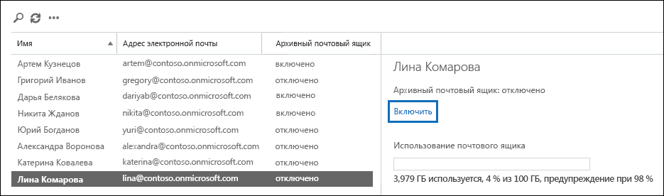

# <a name="enable-archive-mailboxes-in-the-security--compliance-center"></a><span data-ttu-id="62b13-103">Включение архивных почтовых ящиков в Центре безопасности и соответствия требованиям</span><span class="sxs-lookup"><span data-stu-id="62b13-103">Enable archive mailboxes in the Security & Compliance Center</span></span>

<span data-ttu-id="62b13-104">Архивация в Office 365 (также называемая архивацией на месте) позволяет пользователям освободить место в почтовых ящиках.</span><span class="sxs-lookup"><span data-stu-id="62b13-104">Archiving in Office 365 (also called In-Place Archiving) provides users with additional mailbox storage space.</span></span> <span data-ttu-id="62b13-105">После включения архивных почтовых ящиков пользователи могут открывать и хранить сообщения в своих архивных почтовых ящиках с помощью Microsoft Outlook и Outlook в Интернете (прежнее название — Outlook Web App). </span><span class="sxs-lookup"><span data-stu-id="62b13-105">After you turn on archive mailboxes, users can access and store messages in their archive mailboxes by using Microsoft Outlook and Outlook on the web (formerly known as Outlook Web App).</span></span> <span data-ttu-id="62b13-106">Пользователи также могут перемещать или копировать сообщения между основным почтовым ящиком и архивом.</span><span class="sxs-lookup"><span data-stu-id="62b13-106">Users can also move or copy messages between their primary mailbox and their archive mailbox.</span></span> <span data-ttu-id="62b13-107">Кроме того, они могут восстанавливать удаленные элементы из папки "Элементы с возможностью восстановления" в архивном почтовом ящике с помощью средства восстановления удаленных элементов.</span><span class="sxs-lookup"><span data-stu-id="62b13-107">They can also recover deleted items from the Recoverable Items folder in their archive mailbox by using the Recover Deleted Items tool.</span></span>

> [!NOTE]
> <span data-ttu-id="62b13-108">Автоматически расширяющийся архив в Office 365 обеспечивает дополнительное пространство в архивных почтовых ящиках.</span><span class="sxs-lookup"><span data-stu-id="62b13-108">The auto-expanding archiving feature in Office 365 provides additional storage in archive mailboxes.</span></span> <span data-ttu-id="62b13-109">Если включено автоматическое расширение архивации и достигается первоначальная квота хранилища в архивном почтовом ящике пользователя, Office 365 автоматически добавляет дополнительное дисковое пространство.</span><span class="sxs-lookup"><span data-stu-id="62b13-109">When auto-expanding  archiving is turned on, and then the initial storage quota in a user's archive mailbox is reached, Office 365 automatically adds additional storage space.</span></span> <span data-ttu-id="62b13-110">Это значит, что пользователям всегда будет хватать места для хранения почтовых ящиков, а вам не придется ничем управлять после того, как вы включите архивный почтовый ящик и автоматическое расширение архивации в своей организации.</span><span class="sxs-lookup"><span data-stu-id="62b13-110">This means that users won't run out of mailbox storage space and you won't have to manage anything after you initially enable the archive mailbox and turn on auto-expanding archiving for your organization.</span></span> <span data-ttu-id="62b13-111">Дополнительные сведения см. в статье [Общие сведения о неограниченной архивации в Office 365](unlimited-archiving.md).</span><span class="sxs-lookup"><span data-stu-id="62b13-111">For more information, see [Overview of unlimited archiving in Office 365](unlimited-archiving.md).</span></span>

## <a name="get-the-necessary-permissions"></a><span data-ttu-id="62b13-112">Получение необходимых разрешений</span><span class="sxs-lookup"><span data-stu-id="62b13-112">Get the necessary permissions</span></span>

<span data-ttu-id="62b13-113">Чтобы включать и отключать архивные почтовые ящики, вам должна быть назначена роль "Получатели почты" в Exchange Online.</span><span class="sxs-lookup"><span data-stu-id="62b13-113">You have to be assigned the Mail Recipients role in Exchange Online to enable or disable archive mailboxes.</span></span> <span data-ttu-id="62b13-114">По умолчанию эта роль назначается группам ролей "Управление организацией" и "Управление получателями" на странице **Разрешения** в Центре администрирования Exchange.</span><span class="sxs-lookup"><span data-stu-id="62b13-114">By default, this role is assigned to the Recipient Management and Organization Management role groups on the **Permissions** page in the Exchange admin center.</span></span> <span data-ttu-id="62b13-115">Если вы не видите страницу **Архив** в Центре безопасности и соответствия требованиям, попросите администратора назначить необходимые разрешения.</span><span class="sxs-lookup"><span data-stu-id="62b13-115">If you don't see the **Archive** page in the Security & Compliance Center, ask your administrator to assign you the necessary permissions.</span></span>

## <a name="enable-an-archive-mailbox"></a><span data-ttu-id="62b13-116">Включение архивного почтового ящика</span><span class="sxs-lookup"><span data-stu-id="62b13-116">Enable an archive mailbox</span></span>

1. <span data-ttu-id="62b13-117">Перейдите на сайт <https://protection.office.com>.</span><span class="sxs-lookup"><span data-stu-id="62b13-117">Go to <https://protection.office.com>.</span></span>

2. <span data-ttu-id="62b13-118">Выполните вход с помощью учетной записи вашей организации или учебного заведения.</span><span class="sxs-lookup"><span data-stu-id="62b13-118">Sign in using your work or school account.</span></span>

3. <span data-ttu-id="62b13-119">В левой области Центра безопасности и соответствия требованиям выберите **Управление информацией** \> **Архив**.</span><span class="sxs-lookup"><span data-stu-id="62b13-119">In the left pane of the Security & Compliance Center, click **Information governance** \> **Archive**.</span></span>

   <span data-ttu-id="62b13-p104">Отобразится страница **Архив**. В столбце **Архивный почтовый ящик** указывается, включен ли архивный почтовый ящик для соответствующего пользователя.</span><span class="sxs-lookup"><span data-stu-id="62b13-p104">The **Archive** page is displayed. The **Archive mailbox** column indicates whether an archive mailbox is enabled or disabled for each user.</span></span>

   > [!NOTE]
   > <span data-ttu-id="62b13-122">На странице **Архив** отображается максимум 500 пользователей.</span><span class="sxs-lookup"><span data-stu-id="62b13-122">The **Archive** page shows a maximum of 500 users.</span></span>

4. <span data-ttu-id="62b13-123">В списке почтовых ящиков выберите пользователя, для которого вы хотите включить архивный почтовый ящик.</span><span class="sxs-lookup"><span data-stu-id="62b13-123">In the list of mailboxes, select the user that you want to enable the archive mailbox for.</span></span>

   

5. <span data-ttu-id="62b13-125">В области сведений для выбранного пользователя нажмите кнопку **Включить**.</span><span class="sxs-lookup"><span data-stu-id="62b13-125">In the details pane for the selected user, click **Enable**.</span></span>

   <span data-ttu-id="62b13-126">Появится предупреждение о том, что при включении архивного почтового ящика те элементы почтового ящика пользователя, которые старше возраста, указанного в назначенной политике архивации, будут перемещаться в этот новый архивный почтовый ящик.</span><span class="sxs-lookup"><span data-stu-id="62b13-126">A warning is displayed saying that if you enable the archive mailbox, items in the user's mailbox that are older than the archiving policy assigned to the mailbox will be moved to the new archive mailbox.</span></span> <span data-ttu-id="62b13-127">Согласно политике архивации по умолчанию, входящей в назначенную для почтовых ящиков Exchange Online политику хранения, элементы основного почтового ящика перемещаются в архивный спустя два года с момента их создания или доставки.</span><span class="sxs-lookup"><span data-stu-id="62b13-127">The default archive policy that is part of the retention policy assigned to Exchange Online mailboxes moves items to the archive mailbox two years after the date the item was delivered to the mailbox or created by the user.</span></span> <span data-ttu-id="62b13-128">Подробную информацию см. в разделе **Дополнительные сведения** этой статьи.</span><span class="sxs-lookup"><span data-stu-id="62b13-128">For more information, see the **More info** section in this article.</span></span>

6. <span data-ttu-id="62b13-129">Нажмите кнопку **Да**, чтобы включить архивный почтовый ящик.</span><span class="sxs-lookup"><span data-stu-id="62b13-129">Click **Yes** to enable the archive mailbox.</span></span>

   <span data-ttu-id="62b13-130">Создание архивного почтового ящика займет какое-то время.</span><span class="sxs-lookup"><span data-stu-id="62b13-130">It might take a few moments to create the archive mailbox.</span></span> <span data-ttu-id="62b13-131">После этого в области сведений для выбранного пользователя появится надпись **Архивный почтовый ящик: включен**.</span><span class="sxs-lookup"><span data-stu-id="62b13-131">When it's created, **Archive mailbox: enabled** is displayed in the details pane for the selected user.</span></span> <span data-ttu-id="62b13-132">Чтобы данные в области сведений обновились, может потребоваться щелкнуть значок **Обновить** .</span><span class="sxs-lookup"><span data-stu-id="62b13-132">You might have to click **Refresh**  to update the information in the details pane.</span></span>

> [!TIP]
> <span data-ttu-id="62b13-p107">Вы также можете включить архивные почтовые ящики сразу для нескольких пользователей, выбрав их с помощью клавиши SHIFT или CTRL. Выбрав несколько почтовых ящиков, нажмите кнопку **Включить** в области сведений.</span><span class="sxs-lookup"><span data-stu-id="62b13-p107">You can also bulk-enable archive mailboxes by selecting multiple users with disabled archive mailboxes (use the Shift or Ctrl keys). After selecting multiple mailboxes, click **Enable** in the details pane.</span></span>

## <a name="disable-an-archive-mailbox"></a><span data-ttu-id="62b13-135">Отключение архивного почтового ящика</span><span class="sxs-lookup"><span data-stu-id="62b13-135">Disable an archive mailbox</span></span>

<span data-ttu-id="62b13-136">Отключить архивный почтовый ящик пользователя можно на странице **Архив** в Центре безопасности и соответствия требованиям.</span><span class="sxs-lookup"><span data-stu-id="62b13-136">You can also use the **Archive** page in the Security & Compliance Center to disable a user's archive mailbox.</span></span> <span data-ttu-id="62b13-137">Вы можете повторно подключить его к основному почтовому ящику пользователя в течение 30 дней после отключения.</span><span class="sxs-lookup"><span data-stu-id="62b13-137">After you disable an archive mailbox, you can reconnect it to the user's primary mailbox within 30 days of disabling it.</span></span> <span data-ttu-id="62b13-138">В этом случае восстанавливается исходное содержимое архивного почтового ящика.</span><span class="sxs-lookup"><span data-stu-id="62b13-138">In this case, the original contents of the archive mailbox are restored.</span></span> <span data-ttu-id="62b13-139">По истечении 30 дней исходное содержимое архивного почтового ящика окончательно удаляется и не подлежит восстановлению.</span><span class="sxs-lookup"><span data-stu-id="62b13-139">After 30 days, the contents of the original archive mailbox are permanently deleted and can't be recovered.</span></span> <span data-ttu-id="62b13-140">Поэтому при повторном включении архива по прошествии более 30 дней с момента его отключения создается новый архивный почтовый ящик.</span><span class="sxs-lookup"><span data-stu-id="62b13-140">So if you re-enable the archive more than 30 days after disabling it, a new archive mailbox is created.</span></span>

<span data-ttu-id="62b13-141">Обратите внимание, что согласно политике архивации по умолчанию, назначенной для почтовых ящиков пользователей, сообщения перемещаются в архивный почтовый ящик через два года с момента их доставки.</span><span class="sxs-lookup"><span data-stu-id="62b13-141">Note that the default archive policy assigned to users' mailboxes moves items to the archive mailbox two years after the date the item is delivered.</span></span> <span data-ttu-id="62b13-142">Если вы отключите архивный почтовый ящик пользователя, никакие действия над элементами основного почтового ящика выполняться не будут и они будут оставаться там же.</span><span class="sxs-lookup"><span data-stu-id="62b13-142">If you disable a user's archive mailbox, no action will be taken on mailbox items and they will remain in the user's primary mailbox.</span></span>

<span data-ttu-id="62b13-143">Чтобы отключить архивный почтовый ящик, сделайте следующее:</span><span class="sxs-lookup"><span data-stu-id="62b13-143">To disable an archive mailbox:</span></span>

1. <span data-ttu-id="62b13-144">Перейдите на сайт <https://protection.office.com>.</span><span class="sxs-lookup"><span data-stu-id="62b13-144">Go to <https://protection.office.com>.</span></span>

2. <span data-ttu-id="62b13-145">Выполните вход с помощью учетной записи вашей организации или учебного заведения.</span><span class="sxs-lookup"><span data-stu-id="62b13-145">Sign in using your work or school account.</span></span>

3. <span data-ttu-id="62b13-146">В левой области Центра безопасности и соответствия требованиям выберите **Управление информацией** \> **Архив**.</span><span class="sxs-lookup"><span data-stu-id="62b13-146">In the left pane of the Security & Compliance Center, click **Information governance** \> **Archive**.</span></span>

   <span data-ttu-id="62b13-p110">Отобразится страница **Архив**. В столбце **Архивный почтовый ящик** указывается, включен ли архивный почтовый ящик для соответствующего пользователя.</span><span class="sxs-lookup"><span data-stu-id="62b13-p110">The **Archive** page is displayed. The **Archive mailbox** column indicates whether an archive mailbox is enabled or disabled for each user.</span></span>

   > [!NOTE]
   > <span data-ttu-id="62b13-149">На странице **Архив** отображается максимум 500 пользователей.</span><span class="sxs-lookup"><span data-stu-id="62b13-149">The **Archive** page shows a maximum of 500 users.</span></span>

4. <span data-ttu-id="62b13-150">В списке почтовых ящиков выберите пользователя, для которого вы хотите выключить архивный почтовый ящик.</span><span class="sxs-lookup"><span data-stu-id="62b13-150">In the list of mailboxes, select the user that you want to disable the archive mailbox for.</span></span>

5. <span data-ttu-id="62b13-151">В области сведений нажмите кнопку **Отключить**.</span><span class="sxs-lookup"><span data-stu-id="62b13-151">In the details pane, click **Disable**.</span></span>

   <span data-ttu-id="62b13-152">Появится предупреждение о том, что у вас есть 30 дней на повторное включение архивного почтового ящика, а по истечении 30 дней все сведения в архиве будут окончательно удалены.</span><span class="sxs-lookup"><span data-stu-id="62b13-152">A warning message is displayed saying that you'll have 30 days to re-enable the archive mailbox, and that after 30 days, all information in the archive will be permanently deleted.</span></span>

6. <span data-ttu-id="62b13-153">Нажмите кнопку **Да**, чтобы отключить архивный почтовый ящик.</span><span class="sxs-lookup"><span data-stu-id="62b13-153">Click **Yes** to disable the archive mailbox.</span></span>

   <span data-ttu-id="62b13-154">Отключение может занять несколько секунд.</span><span class="sxs-lookup"><span data-stu-id="62b13-154">It might take a few moments to disable the archive mailbox.</span></span> <span data-ttu-id="62b13-155">После этого в области сведений для выбранного пользователя появится надпись **Архивный почтовый ящик: отключен**.</span><span class="sxs-lookup"><span data-stu-id="62b13-155">When it's disabled, **Archive mailbox: disabled** is displayed in the details pane for the selected user.</span></span> <span data-ttu-id="62b13-156">Чтобы данные в области сведений обновились, может потребоваться щелкнуть значок **Обновить** .</span><span class="sxs-lookup"><span data-stu-id="62b13-156">You might have to click **Refresh**  to update the information in the details pane.</span></span>

> [!TIP]
> <span data-ttu-id="62b13-p112">Вы также можете отключить архивные почтовые ящики сразу для нескольких пользователей, выбрав их с помощью клавиши SHIFT или CTRL. Выбрав несколько почтовых ящиков, нажмите кнопку **Отключить** в области сведений.</span><span class="sxs-lookup"><span data-stu-id="62b13-p112">You can also bulk-disable archive mailboxes by selecting multiple users with enabled archive mailboxes (use the Shift or Ctrl keys). After selecting multiple mailboxes, click **Disable** in the details pane.</span></span>

## <a name="use-exchange-online-powershell-to-enable-or-disable-archive-mailboxes"></a><span data-ttu-id="62b13-159">Включение и отключение архивных почтовых ящиков с помощью Exchange Online PowerShell</span><span class="sxs-lookup"><span data-stu-id="62b13-159">Use Exchange Online PowerShell to enable or disable archive mailboxes</span></span>

<span data-ttu-id="62b13-160">Вы также можете использовать Exchange Online PowerShell для включения архивных почтовых ящиков.</span><span class="sxs-lookup"><span data-stu-id="62b13-160">You can also use Exchange Online PowerShell to enable archive mailboxes.</span></span> <span data-ttu-id="62b13-161">Главная причина использования PowerShell — быстрое включение архивных почтовых ящиков для всех пользователей в организации.</span><span class="sxs-lookup"><span data-stu-id="62b13-161">The primary reason to use PowerShell is that you can quickly enable the archive mailbox for all users in your organization.</span></span>

<span data-ttu-id="62b13-162">Первый шаг — подключение к Exchange Online PowerShell.</span><span class="sxs-lookup"><span data-stu-id="62b13-162">The first step is to connect to Exchange Online PowerShell.</span></span> <span data-ttu-id="62b13-163">Инструкции см. в статье [Подключение к Exchange Online PowerShell](https://docs.microsoft.com/powershell/exchange/connect-to-exchange-online-powershell).</span><span class="sxs-lookup"><span data-stu-id="62b13-163">For instructions, see [Connect to Exchange Online PowerShell](https://docs.microsoft.com/powershell/exchange/connect-to-exchange-online-powershell).</span></span>

<span data-ttu-id="62b13-164">После подключения к Exchange Online можно выполнить команды, приведенные в следующих разделах, для включения или отключения архивных почтовых ящиков.</span><span class="sxs-lookup"><span data-stu-id="62b13-164">After you're connected to Exchange Online, you can run the commands in the following sections to enable or disable archive mailboxes.</span></span>

### <a name="enable-archive-mailboxes"></a><span data-ttu-id="62b13-165">Включение архивных почтовых ящиков</span><span class="sxs-lookup"><span data-stu-id="62b13-165">Enable archive mailboxes</span></span>

<span data-ttu-id="62b13-166">Выполните следующую команду, чтобы включить архивный почтовый ящик для одного пользователя.</span><span class="sxs-lookup"><span data-stu-id="62b13-166">Run the following command to enable the archive mailbox for a single user.</span></span>

```powershell
Enable-Mailbox -Identity <username> -Archive
```

<span data-ttu-id="62b13-167">Выполните следующую команду, чтобы включить архивный почтовый ящик для всех пользователей в организации (чей архивный почтовый ящик в настоящее время не включен).</span><span class="sxs-lookup"><span data-stu-id="62b13-167">Run the following command to enable the archive mailbox for all users in your organization (whose archive mailbox is currently not enabled).</span></span>

```powershell
Get-Mailbox -Filter {ArchiveStatus -Eq "None" -AND RecipientTypeDetails -eq "UserMailbox"} | Enable-Mailbox -Archive
```

### <a name="disable-archive-mailboxes"></a><span data-ttu-id="62b13-168">Отключение архивных почтовых ящиков</span><span class="sxs-lookup"><span data-stu-id="62b13-168">Disable archive mailboxes</span></span>

<span data-ttu-id="62b13-169">Выполните следующую команду, чтобы отключить архивный почтовый ящик для одного пользователя.</span><span class="sxs-lookup"><span data-stu-id="62b13-169">Run the following command to disable the archive mailbox for a single user.</span></span>

```powershell
Disable-Mailbox -Identity <username> -Archive
```

<span data-ttu-id="62b13-170">Выполните следующую команду, чтобы отключить архивный почтовый ящик для всех пользователей в организации (чей архивный почтовый ящик в настоящее время включен).</span><span class="sxs-lookup"><span data-stu-id="62b13-170">Run the following command to disable the archive mailbox for all users in your organization (whose archive mailbox is currently enabled).</span></span>

```powershell
Get-Mailbox -Filter {ArchiveStatus -Eq "Active" -AND RecipientTypeDetails -eq "UserMailbox"} | Disable-Mailbox -Archive
```

## <a name="more-information"></a><span data-ttu-id="62b13-171">Дополнительные сведения</span><span class="sxs-lookup"><span data-stu-id="62b13-171">More information</span></span>

- <span data-ttu-id="62b13-172">Если архивный почтовый ящик включен, пользователи могут хранить сообщения в архивном почтовом ящике.</span><span class="sxs-lookup"><span data-stu-id="62b13-172">When an archive mailbox is enabled, users can store messages in their archive mailbox.</span></span> <span data-ttu-id="62b13-173">Для доступа к своим архивным почтовым ящикам пользователи могут использовать Microsoft Outlook и Outlook в Интернете.</span><span class="sxs-lookup"><span data-stu-id="62b13-173">Users can access their archive mailboxes by using Microsoft Outlook and Outlook on the web.</span></span> <span data-ttu-id="62b13-174">Используя одно из этих клиентских приложений, пользователи могут просматривать сообщения в архивных почтовых ящиках, а также перемещать и копировать их из архивного в основной и наоборот.</span><span class="sxs-lookup"><span data-stu-id="62b13-174">Using either of these client applications, users can view messages in their archive mailbox and move or copy messages between their primary mailbox and their archive mailbox.</span></span> <span data-ttu-id="62b13-175">Пользователи также могут восстанавливать удаленные элементы из папки "Элементы с возможностью восстановления" в архивном почтовом ящике с помощью средства восстановления удаленных элементов.</span><span class="sxs-lookup"><span data-stu-id="62b13-175">Users can also recover deleted items from the Recoverable Items folder in their archive mailbox by using the Recover Deleted Items tool.</span></span>

  <span data-ttu-id="62b13-176">Список лицензий Outlook, поддерживающих архивацию на месте, см. в статье [Лицензионные требования к Outlook для функций Exchange](https://support.microsoft.com/office/46b6b7c5-c3ca-43e5-8424-1e2807917c99).</span><span class="sxs-lookup"><span data-stu-id="62b13-176">For a list of Outlook licenses that support In-Place Archiving, see [Outlook license requirements for Exchange features](https://support.microsoft.com/office/46b6b7c5-c3ca-43e5-8424-1e2807917c99).</span></span>

- <span data-ttu-id="62b13-177">Архивные почтовые ящики помогают вам и вашим пользователям выполнять требования организации к хранению, обнаружению электронных данных и удержанию.</span><span class="sxs-lookup"><span data-stu-id="62b13-177">Archive mailboxes help you and your users to meet your organization's retention, eDiscovery, and hold requirements.</span></span> <span data-ttu-id="62b13-178">Например, вы можете использовать политику хранения Exchange для перемещения содержимого почтовых ящиков в архивные почтовые ящики.</span><span class="sxs-lookup"><span data-stu-id="62b13-178">For example, you can use your organization's Exchange retention policy to move mailbox content to users' archive mailbox.</span></span> <span data-ttu-id="62b13-179">Если вы используете средство "Поиск контента" в Центре безопасности и соответствия требованиям для поиска определенного содержимого в почтовом ящике пользователя, поиск также будет выполняться в архивном почтовом ящике пользователя.</span><span class="sxs-lookup"><span data-stu-id="62b13-179">When you use the Content Search tool in the Security & Compliance Center to search a user's mailbox for specific content, the user's archive mailbox will also be searched.</span></span> <span data-ttu-id="62b13-180">Кроме того, если вы применяете удержание для судебного разбирательства или политику хранения к почтовому ящику пользователя, элементы в архивном почтовом ящике также сохраняются.</span><span class="sxs-lookup"><span data-stu-id="62b13-180">And, when you place a Litigation Hold or apply a retention policy to a user's mailbox, items in the archive mailbox are also retained.</span></span>

- <span data-ttu-id="62b13-181">После включения архивных почтовых ящиков организация может использовать стандартную политику хранения Exchange (также называемую политикой управления записями сообщений или политикой MRM), которая автоматически назначается каждому почтовому ящику.</span><span class="sxs-lookup"><span data-stu-id="62b13-181">After archive mailboxes are enabled, your organization can take advantage of the default Exchange retention policy (also called Messaging Records Management or MRM policy) that is automatically assigned to every mailbox.</span></span> <span data-ttu-id="62b13-182">После включения архивного почтового ящика стандартная политика хранения Exchange автоматически выполняет следующие действия:</span><span class="sxs-lookup"><span data-stu-id="62b13-182">When an archive mailbox is enabled, the default Exchange retention policy automatically does the following:</span></span>

  - <span data-ttu-id="62b13-183">Перемещает элементы, которые хранились два года или дольше, из основного почтового ящика пользователя в архивный.</span><span class="sxs-lookup"><span data-stu-id="62b13-183">Moves items that are two years or older from a user's primary mailbox to their archive mailbox.</span></span>

  - <span data-ttu-id="62b13-184">Перемещает элементы, которые хранились 14 дней или дольше, из папки "Элементы для восстановления" в основном почтовом ящике пользователя в такую же папку архивного почтового ящика.</span><span class="sxs-lookup"><span data-stu-id="62b13-184">Moves items that are 14 days or older from the Recoverable Items folder in the user's primary mailbox to the Recoverable Items folder in their archive mailbox.</span></span>

- <span data-ttu-id="62b13-185">Дополнительные сведения об архивных почтовых ящиках и политиках хранения Exchange приведены в следующих статьях:</span><span class="sxs-lookup"><span data-stu-id="62b13-185">For more information about archive mailboxes and Exchange retention policies, see:</span></span>

  - [<span data-ttu-id="62b13-186">Теги хранения и политики хранения в Exchange Online</span><span class="sxs-lookup"><span data-stu-id="62b13-186">Retention tags and retention policies in Exchange Online</span></span>](https://docs.microsoft.com/exchange/security-and-compliance/messaging-records-management/retention-tags-and-policies)

  - [<span data-ttu-id="62b13-187">Политика хранения по умолчанию в Exchange Online</span><span class="sxs-lookup"><span data-stu-id="62b13-187">Default Retention Policy in Exchange Online</span></span>](https://docs.microsoft.com/exchange/security-and-compliance/messaging-records-management/default-retention-policy)

  - [<span data-ttu-id="62b13-188">Настройка политики архивации и удаления для почтовых ящиков в организации</span><span class="sxs-lookup"><span data-stu-id="62b13-188">Set up an archive and deletion policy for mailboxes in your organization</span></span>](set-up-an-archive-and-deletion-policy-for-mailboxes.md)
