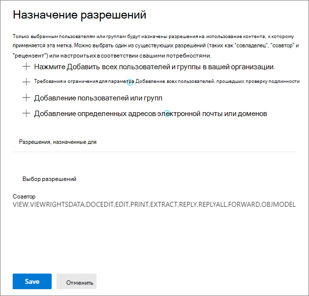
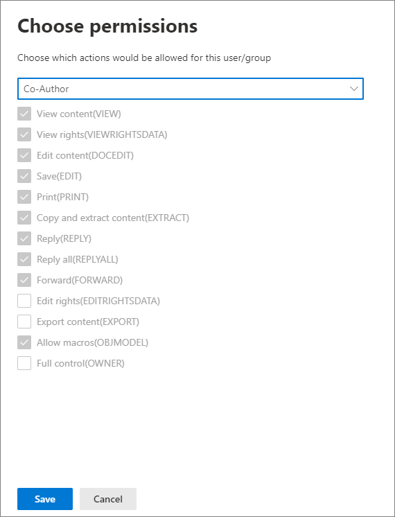

# Ограничение доступа к содержимому с помощью меток конфиденциальности для применения шифрованияRestrict access to content by using sensitivity labels to apply encryption 

При создании метки конфиденциальности можно ограничить доступ к содержимому, которому будет присвоена метка. Например параметры шифрования метки конфиденциальности позволяют обеспечить защиту содержимого, чтобы:When you create a sensitivity label, you can restrict access to content that the label will be applied to. For example, with the encryption settings for a sensitivity label, you can protect content so that:

- только пользователи организации могли открывать конфиденциальные документы или сообщения электронной почты;Only users within your organization can open a confidential document or email.
- только пользователи в отделе маркетинга могли редактировать и выводить на печать документы рекламных объявлений или сообщения электронной почты, а всем остальным пользователям вашей организации они были доступны только для чтения;Only users in the marketing department can edit and print the promotion announcement document or email, while all other users in your organization can only read it.
- пользователи не могли пересылать сообщения электронной почты или копировать данные из них, если в них содержатся новости о внутренней реорганизации;Users cannot forward an email or copy information from it that contains news about an internal reorganization.
- текущий список цен, отправляемый бизнес-партнерам, нельзя было открыть после определенной даты.The current price list that is sent to business partners cannot be opened after a specified date.

Если документ или сообщение электронной почты шифруются, доступ к содержимому ограничивается, чтобы:When a document or email is encrypted, access to the content is restricted, so that it:

- его могли расшифровать только пользователи, которым были предоставлены соответствующие права доступа параметрами шифрования метки;Can be decrypted only by users authorized by the label’s encryption settings.
- оно оставалось зашифрованным независимо от того, где находится, внутри или за пределами вашей организации, даже если файл будет переименован;Remains encrypted no matter where it resides, inside or outside your organization, even if the file’s renamed.
- оно оставалось зашифрованным во время хранения (например, в учетной записи OneDrive) и при передаче (например, при отправлении электронной почты).Is encrypted both at rest (for example, in a OneDrive account) and in transit (for example, a sent email).

Наконец, являясь администратором, при настройке метки конфиденциальности для применения шифрования вы можете по своему усмотрению выбрать одно из действий ниже.Finally, as an admin, when you configure a sensitivity label to apply encryption, you can choose either to:

- **Назначить разрешения**, чтобы указать конкретных пользователей и разрешения, которые они получат на содержимое с такой меткой.**Assign permissions now**, so that you determine exactly which users get which permissions to content with that label.
- **Разрешить пользователям назначать разрешения** при применении метки к содержимому.**Let users assign permissions** when they apply the label to content. Таким образом, вы обеспечите пользователям вашей организации определенную гибкость, которая может быть необходима для совместной работы и выполнения рабочих задач.This way, you can allow people in your organization some flexibility that they might need to collaborate and get their work done.

Параметры шифрования доступны при [создании метки конфиденциальности](create-sensitivity-labels.md) в Центре соответствия требованиям Microsoft 365, Центре безопасности Microsoft 365 и Центре безопасности и соответствия требованиям Office 365.The encryption settings are available when you [create a sensitivity label](create-sensitivity-labels.md) in the Microsoft 365 compliance center, Microsoft 365 security center, or Office 365 Security & Compliance Center.

## Как работает шифрованиеHow encryption works

При шифровании используется служба управления правами Azure (Azure RMS) из Azure Information Protection.Encryption uses the Azure Rights Management service (Azure RMS) from Azure Information Protection. Это решение защиты использует политики шифрования, удостоверений и авторизации.This protection solution uses encryption, identity, and authorization policies. Дополнительные сведения см. в статье [Управление правами Azure](https://docs.microsoft.com/azure/information-protection/what-is-azure-rms) из документации по Azure Information Protection.To learn more, see [What is Azure Rights Management?](https://docs.microsoft.com/azure/information-protection/what-is-azure-rms) from the Azure Information Protection documentation. 

При использовании этого решения шифрования функция **суперпользователей** гарантирует, что авторизованные пользователи и службы всегда смогут считывать и проверять данные, зашифрованные для вашей организации.When you use this encryption solution, the **super user** feature ensures that authorized people and services can always read and inspect the data that has been encrypted for your organization. При необходимости шифрование затем можно удалить или изменить.If necessary, the encryption can then be removed or changed. Дополнительные сведения см. в статье [Настройка суперпользователей для Azure Information Protection и служб обнаружения или восстановления данных](https://docs.microsoft.com/azure/information-protection/configure-super-users).For more information, see [Configuring super users for Azure Information Protection and discovery services or data recovery](https://docs.microsoft.com/azure/information-protection/configure-super-users).

## Настройка метки для шифрованияConfiguring a label for encryption

При [создании или изменении метки конфиденциальности](create-sensitivity-labels.md#create-and-configure-sensitivity-labels) на странице **Шифрование** мастера вы можете выбрать один из следующих параметров:When you [create or edit a sensitivity label](create-sensitivity-labels.md#create-and-configure-sensitivity-labels), on the **Encryption** page of the wizard, you can select one of the following options:

- **Нет**. Параметр по умолчанию для новой метки.**None**: The default setting for a new label. Новое шифрование не применяется.No new encryption is applied.
- **Применить**. Включает шифрование, после чего вы указываете параметры шифрования.**Apply**: Turns on encryption, and you then specify encryption settings.
- **Удалить**. Удаляет шифрование, если документ или письмо зашифровано.**Remove**: Removes encryption if the document or email is encrypted.

> [!NOTE]
> Параметр **Удалить** поддерживается только клиентом унифицированных меток Azure Information Protection.The **Remove** option is supported by the Azure Information Protection unified labeling client only. Если используются встроенные метки, метка с этим параметром отображается в приложениях Office, а при ее выборе действие шифрования совпадает с параметром **Нет**.When you use built-in labeling, a label with this option is visible in Office apps and if selected, the encryption behavior is the same as **None**.

Настройка параметров шифрования:Configuring the encryption options:

### Что происходит с существующим шифрованием при применении меткиWhat happens to existing encryption when a label's applied

Если к незашифрованному содержимому применяется метка конфиденциальности, результат доступных параметров шифрования можно понять без объяснений.If a sensitivity label is applied to unencrypted content, the outcome of the encryption options you can select is self-explanatory. Например, если для шифрования выбран параметр **Нет**, содержимое остается незашифрованным.For example, if encryption is set to **None**, the content remains unencrypted.

Но содержимое может быть уже зашифрованным.However, the content might be already encrypted. Например, другой пользователь мог применить:For example, another user might have applied:

- Собственные разрешения, включающие определяемые пользователем разрешения при запросе меткой, настраиваемые разрешения клиента Azure Information Protection и защиту документа **Ограниченный доступ** из приложения Office.Their own permissions, which include user-defined permissions when prompted by a label, custom permissions by the Azure Information Protection client, and the **Restricted Access** document protection from within an Office app.
- Шаблон защиты службы управления правами Azure, шифрующий содержимое независимо от метки.An Azure Rights Management protection template that encrypts the content independently from a label. В эту категорию входят правила потока обработки почты, применяющие шифрование с помощью защиты прав.This category includes mail flow rules that apply encryption by using rights protection.
- Метку, применяющую шифрование с разрешениями, назначенными администратором.A label that applies encryption with permissions assigned by the administrator.

В следующей таблице указано, что происходит с существующим шифрованием при применении к содержимому метки конфиденциальности.The following table identifies what happens to existing encryption when a sensitivity label is applied to that content:

| |**Шифрование: Нет****Encryption: None**|**Шифрование: Применить****Encryption: Apply**|**Шифрование: Удалить****Encryption: Remove**|
|:-----|:-----|:-----|:-----|
|**Разрешения, указанные пользователем****Permissions specified by a user**|Исходное шифрование сохраняетсяOriginal encryption is preserved|Применяется новое шифрованиеNew label encryption is applied|Исходное шифрование удаляетсяOriginal encryption is removed|
|**Шаблон защиты****Protection template**|Исходное шифрование сохраняетсяOriginal encryption is preserved|Применяется новое шифрованиеNew label encryption is applied|Исходное шифрование удаляетсяOriginal encryption is removed|
|**Метка с разрешениями, определенными администратором****Label with administator-defined permissions**|Исходное шифрование удаляетсяOriginal encryption is removed|Применяется новое шифрованиеNew label encryption is applied|Исходное шифрование удаляетсяOriginal encryption is removed|

Обратите внимание, что в случаях применения нового шифрования с меткой или удаления исходного шифрования эти действия выполняются, только если у пользователя, применяющего метку, есть право на использование или роль, поддерживающие это действие:Note that in the cases where the new label encryption is applied or the original encryption is removed, this happens only if the user applying the label has a usage right or role that supports this action:
- [Право на использование](https://docs.microsoft.com/azure/information-protection/configure-usage-rights.md#usage-rights-and-descriptions) экспорта или полного доступа.The [usage right](https://docs.microsoft.com/azure/information-protection/configure-usage-rights.md#usage-rights-and-descriptions) Export or Full Control.
- Роль [издателя в службе управления правами или владельца в службе управления правами](https://docs.microsoft.com/azure/information-protection/configure-usage-rights#rights-management-issuer-and-rights-management-owner) или [суперпользователя](https://docs.microsoft.com/azure/information-protection/configure-super-users).The role of [Rights Management issuer or Rights Management owner](https://docs.microsoft.com/azure/information-protection/configure-usage-rights#rights-management-issuer-and-rights-management-owner), or [super user](https://docs.microsoft.com/azure/information-protection/configure-super-users).

Если у пользователя нет одного из этих прав или ролей, метка не может быть применена и поэтому сохраняется исходное шифрование.If the user doesn't have one of these rights or roles, the label can't be applied and so the original encryption is preserved. Для пользователя отображается следующее сообщение: **У вас нет разрешения на внесение изменений в метку конфиденциальности. Обратитесь к владельцу содержимого.**The user sees the following message: **You don't have permission to make this change to the sensitivity label. Please contact the content owner.**

Например, пользователь, применяющий параметр "Не пересылать" к сообщению электронной почты, может изменить метку цепочки, чтобы заменить шифрование или удалить его, так как он является владельцем в службе управления правами для электронной почты.For example, the person who applies Do Not Forward to an email message can relabel the thread to replace the encryption or remove it, because they are the Rights Management owner for the email. Но за исключением суперпользователей получатели этого сообщения не могут изменять его метку, так как у них нет необходимых прав на использование.But with the exception of super users, recipients of this email can't relabel it because they don't have the required usage rights.

#### Вложения электронной почты для зашифрованных писемEmail attachments for encrypted email messages

Если сообщение электронной почты зашифровано любым способом, все незашифрованные документы Office, вложенные в письмо, автоматически наследуют те же параметры шифрования.When an email message is encrypted by any method, any unencrypted Office documents that are attached to the email automatically inherit the same encryption settings.

Предварительно зашифрованные документы, добавленные в качестве вложений, всегда сохраняют исходное шифрование.Documents that are already encrypted and then added as attachments always preserve their original encryption. 

## Как настроить параметры шифрования для метки конфиденциальностиHow to configure encryption settings for a sensitivity label

При использовании параметра **Применить** на странице **Шифрование** мастера создания или изменения метки конфиденциальности укажите, нужно ли выполнять следующее:When you select **Apply** on the **Encryption** page of the wizard to create or edit a sensitivity label, choose whether to:

- **Назначить разрешения сразу**, чтобы указать конкретных пользователей и разрешения, которые они получат на содержимое с примененной меткой.**Assign permissions now**, so that you can determine exactly which users get which permissions to content that has the label applied. Дополнительные сведения см. в следующем разделе [Назначение разрешений](#assign-permissions-now).For more information, see the next section [Assign permissions now](#assign-permissions-now).
- **Разрешить пользователям назначать разрешения**, когда они применяют метку к содержимому.**Let users assign permissions** when your users apply the label to content. С помощью этого параметра вы обеспечите пользователям вашей организации определенную гибкость, которая может быть необходима для совместной работы и выполнения рабочих задач.With this option, you can allow people in your organization some flexibility that they might need to collaborate and get their work done. Дополнительные сведения см. в разделе [Предоставление пользователям возможности назначать разрешения](#let-users-assign-permissions) на этой странице.For more information, see the [Let users assign permissions](#let-users-assign-permissions) section on this page.

Например, если у вас метка конфиденциальности с именем **Строго конфиденциально**, которая будет применяться к данным самого высокого уровня конфиденциальности, вам может понадобиться сразу указать пользователей, которые получат разрешение на такое содержимое, а также тип разрешений.For example, if you have a sensitivity label named **Highly Confidential** that will be applied to your most sensitive content, you might want to decide now who gets what type of permissions to that content.

Кроме того, если у вас метка конфиденциальности с именем **Деловые контракты**, а рабочий процесс вашей организации требует, чтобы пользователи по мере необходимости работали над таким содержимым совместно с разными специалистами, вы можете позволить пользователям самостоятельно указывать, кто получит разрешения, при назначении метки.Alternatively, if you have a sensitivity label named **Business Contracts**, and your organization's workflow requires that your people collaborate on this content with different people on an ad hoc basis, you might want to allow your users to decide who gets permissions when they assign the label. Такая гибкость способствует продуктивной работе пользователей и сокращает количество обращений к администраторам с просьбой обновить или создать новые метки конфиденциальности в соответствии с определенными сценариями.This flexibility both helps your users' productivity and reduces the requests for your admins to update or create new sensitivity labels to address specific scenarios.

Выбор, нужно ли назначать разрешения сразу или разрешить пользователям назначать разрешения:Choosing whether to assign permissions now or let users assign permissions: 

## Назначить разрешенияAssign permissions now

С помощью следующих вариантов можно выбрать пользователей, получающих доступ к электронной почте или документам, которым присваивается эта метка.Use the following options to control who can access email or documents to which this label is applied. Вы можете выполнить указанные ниже действия.You can:

1. **Разрешение окончания срока действия доступа к содержимому с присвоенной меткой** на определенную дату или после определенного количества дней, после того как метка будет применена. После этого пользователи не смогут открывать элемент с меткой. Если указать дату, действительным сроком ее наступления будет считаться соответствующая дата на момент полночи в вашем текущем часовом поясе. (Обратите внимание, что некоторые почтовые клиенты могут не применять срок действия и отображают письма после истечения их срока действия, что связано с их механизмами кэширования.)**Allow access to labeled content to expire**, either on a specific date or after a specific number of days after the label is applied. After this time, users won’t be able to open the labeled item. If you specify a date, it is effective midnight on that date in your current time zone. (Note that some email clients might not enforce expiration and show emails past their expiration date, due to their caching mechanisms.)

2. **Разрешение доступа в режиме автономной работы** с вариантами "никогда", "всегда" или "на определенное количество дней", после того как метка будет присвоена. Если вы ограничиваете доступ в режиме автономной работы вариантом "никогда" или "на определенное количество дней", при достижении соответствующего порогового значения пользователи должны повторить аутентификацию, а сведения об их доступе записываются в журнал. Дополнительные сведения см. следующем разделе о лицензии на использование службы управления правами.**Allow offline access** never, always, or for a specific number of days after the label is applied. If you restrict offline access to never or a number of days, when that threshold is reached, users must be reauthenticated and their access is logged. For more information, see the next section on the Rights Management use license.

Параметры для управления доступом к зашифрованному содержимому:Settings for access control for encrypted content:

### Служба управления правами использует лицензию для доступа в режиме автономной работыRights Management use license for offline access

Когда пользователь открывает документ или сообщение электронной почты, защищенное с помощью шифрования службы управления правами Azure, ему предоставляется лицензия службы управления правами Azure на использование этого содержимого.When a user opens a document or email that’s been protected by encryption from the Azure Rights Management service, an Azure Rights Management use license for that content is granted to the user. Эта лицензия на использование является сертификатом, содержащим права пользователя на использование документа или сообщения электронной почты, а также ключ шифрования, примененный для шифрования содержимого.This use license is a certificate that contains the user's usage rights for the document or email, and the encryption key that was used to encrypt the content. Лицензия на использование также содержит дату окончания срока действия, если она установлена, и срок действия лицензии на использование.The use license also contains an expiration date if this has been set, and how long the use license is valid.

Если дата окончания срока действия не задана, срок действия лицензии на использование для клиента по умолчанию составляет 30 дней. На протяжении срока действия лицензии на использование пользователь не проходит повторные проверки подлинности и прав доступа. Этот процесс позволяет пользователю открывать защищенный документ или электронную почту без подключения к Интернету. По истечении срока действия лицензии на использование, когда в следующий раз пользователь будет выполнять доступ к защищенному документу или электронной почте, ему потребуется повторно пройти проверку подлинности и прав доступа.If no expiration date has been set, the default use license validity period for a tenant is 30 days. For the duration of the use license, the user is not reauthenticated or reauthorized for the content. This process lets the user continue to open the protected document or email without an internet connection. When the use license validity period expires, the next time the user accesses the protected document or email, the user must be reauthenticated and reauthorized.

Помимо повторной проверки подлинности переоцениваются параметры шифрования и принадлежность пользователя к группе.In addition to reauthentication, the encryption settings and user group membership is reevaluated. Это означает, что результаты доступа к одну и тому же документу или сообщению для пользователей могут быть разными, если изменены параметры шифрования или участие в группе со времени последнего доступа к содержимому.This means that users could experience different access results for the same document or email if there are changes in the encryption settings or group membership from when they last accessed the content.

Чтобы узнать, как изменить стандартный параметр 30-дневного срока действия, см. раздел [Лицензия на использования службы Microsoft Azure AD Rights Management](https://docs.microsoft.com/azure/information-protection/configure-usage-rights#rights-management-use-license).To learn how to change the default 30-day setting, see [Rights Management use license](https://docs.microsoft.com/azure/information-protection/configure-usage-rights#rights-management-use-license).

### Назначение разрешений определенным пользователям или группамAssign permissions to specific users or groups

Вы можете предоставить разрешения определенным людям, чтобы только они могли работать с содержимым, которому присвоена метка:You can grant permissions to specific people so that only they can interact with the labeled content:

1. Сначала добавьте пользователей или группы, которым будут назначены разрешения в отношении содержимого с присвоенной меткой.First, add users or groups that will be assigned permissions to the labeled content.

2. Затем выберите, какие разрешения должны быть у этих пользователей в отношении содержимого с присвоенной меткой.Then, choose which permissions those users should have for the labeled content.

Назначение разрешений:Assigning permissions:

#### Добавление пользователей или группAdd users or groups

Когда вы назначаете разрешения, вы можете выбрать один из приведенных ниже вариантов.When you assign permissions, you can choose:

- Все сотрудники вашей организации (все участники клиента). Этот параметр исключает гостевые учетные записи.Everyone in your organization (all tenant members). This setting excludes guest accounts.
- Все прошедшие проверку подлинности пользователи.Any authenticated users. Изучите [требования и ограничения](#requirements-and-limitations-for-add-any-authenticated-users) этого параметра перед его выбором.Make sure you understand the [requirements and limitations](#requirements-and-limitations-for-add-any-authenticated-users) of this setting before selecting it.
- Любой конкретный пользователь или группа безопасности с поддержкой электронной почты, группа рассылки, группа Office 365 или динамическая группа рассылки.Any specific user or email-enabled security group, distribution group, Office 365 group, or dynamic distribution group. 
- Любой адрес электронной почты или домен вне вашей организации, например gmail.com, hotmail.com или outlook.com.Any email address or domain outside your organization, such as gmail.com, hotmail.com, or outlook.com. 

Если вы выбираете всех пользователей клиента или указываете каталог, пользователи или группы должны иметь адрес электронной почты.When you choose all tenant members or browse the directory, the users or groups must have an email address.

Оптимальной практикой является использование групп, а не отдельных пользователей. Такая стратегия позволяет упростить всю конфигурацию.As a best practice, use groups rather than users. This strategy keeps your configuration simpler.

##### Требования и ограничения для параметра **Добавление всех пользователей, прошедших проверку подлинности**Requirements and limitations for **Add any authenticated users**

Этот параметр не ограничивает список пользователей, которым доступно содержимое, зашифрованное меткой, при этом он шифрует содержимое и предоставляет возможности ограничить использование содержимого (разрешения) и доступ к нему (срок действия и автономный доступ).This setting doesn't restrict who can access the content that the label encrypts, while still encrypting the content and providing you with options to restrict how the content can be used (permissions), and accessed (expiry and offline access). Однако приложение, открывающее зашифрованное содержимое, должно поддерживать используемую проверку подлинности.However, the application opening the encrypted content must be able to support the authentication being used. По этой причине федеративные поставщики социальных служб, такие как Google, и проверка подлинности с одноразовым секретным кодом поддерживаются только для электронной почты и только при использовании Exchange Online и новых возможностей службы шифрования сообщений Office 365.For this reason, federated social providers such as Google, and onetime passcode authentication work for email only, and only when you use Exchange Online and the new capabilities from Office 365 Message Encryption. Учетные записи Майкрософт можно использовать в приложениях Office 365 и [средстве просмотра Azure Information Protection](https://portal.azurerms.com/#/download).Microsoft accounts can be used with Office 365 apps and the [Azure Information Protection viewer](https://portal.azurerms.com/#/download).

Некоторые типичные сценарии для параметра добавления всех пользователей, прошедших проверку подлинности:Some typical scenarios for the any authenticated users setting:
- Вы разрешаете всем пользователям просматривать содержимое, но хотите ограничить способ его использования.You don't mind who views the content, but you want to restrict how it is used. Например, вы не хотите, чтобы содержимое изменялось, копировалось или распечатывалось.For example, you don't want the content to be edited, copied, or printed.
- Вам не нужно ограничивать получателей доступа к содержимому, но требуется возможность подтверждения тех, кто его открывает.You don't need to restrict who accesses the content, but you want to be able to confirm who opens it.
- Вам требуется, чтобы содержимое было зашифровано при хранении и перемещении, но нет необходимости в элементах управления доступом.You have a requirement that the content must be encrypted at rest and in transit, but it doesn't require access controls.

#### Выбор разрешенийChoose permissions

При выборе того, какие разрешения следует предоставить определенным пользователям или группам, вы можете выбрать один из приведенных ниже вариантов.When you choose which permissions to allow for those users or groups, you can select either:

- [Заранее определенный уровень разрешений](https://docs.microsoft.com/azure/information-protection/configure-usage-rights#rights-included-in-permissions-levels) с предварительно заданной группой прав, например "Соавтор" или "Рецензент".A [predefined permissions level](https://docs.microsoft.com/azure/information-protection/configure-usage-rights#rights-included-in-permissions-levels) with a preset group of rights, such as Co-Author or Reviewer.
- Настраиваемая группа прав, в которой вы можете выбрать, какие разрешения вам нужны.A Custom group of rights, where you choose whichever permissions you want.

Дополнительные сведения по каждому конкретному виду разрешений см. в статье [Права на использование и их описание](https://docs.microsoft.com/azure/information-protection/configure-usage-rights#usage-rights-and-descriptions).For more information on each specific permission, see [Usage rights and descriptions](https://docs.microsoft.com/azure/information-protection/configure-usage-rights#usage-rights-and-descriptions).  

Обратите внимание, что одна и та же метка может предоставлять разные разрешения для разных пользователей. Например, одна метка может назначить некоторых пользователей как проверяющих, а одного — как соавтора, как показано на следующем снимке экрана.Note that the same label can grant different permissions to different users. For example, a single label can assign some users as Reviewer and a different user as Co-author, as shown in the following screenshot.

Чтобы сделать это, добавьте пользователей или группы, назначьте им разрешения и сохраните эти параметры. Затем повторите эти действия — добавление пользователей и назначение им разрешений, каждый раз сохраняя параметры. Эту настройку можно повторять столько раз, сколько требуется, чтобы определить разные разрешения для разных пользователей.To do this, add users or groups, assign them permissions, and save those settings. Then repeat these steps, adding users and assigning them permissions, saving the settings each time. You can repeat this configuration as often as necessary, to define different permissions for different users.

#### У издателя в службе управления правами (пользователь, применяющий метку конфиденциальности) всегда остается полный контрольRights Management issuer (user applying the sensitivity label) always has Full Control

Шифрование для метки конфиденциальности использует службу управления правами Azure из Azure Information Protection.Encryption for a sensitivity label uses the Azure Rights Management service from Azure Information Protection. Когда пользователь применяет метку конфиденциальности для защиты документа или электронной почты с помощью шифрования, он становится издателем в службе управления правами для такого содержимого.When a user applies a sensitivity label to protect a document or email by using encryption, that user becomes the Rights Management issuer for that content.

Издателю в службе управления правами всегда предоставляются разрешения на полный доступ для документа или электронной почты, а также приведенные ниже полномочия.The Rights Management issuer is always granted Full Control permissions for the document or email, and in addition:

- Если в параметрах шифрования есть дата окончания срока действия, издатель в службе управления правами по-прежнему может открывать и редактировать документ или сообщения электронной почты после этой даты.If the encryption settings include an expiration date, the Rights Management issuer can still open and edit the document or email after that date.
- Издатель в службе управления правами всегда может получить доступ к документу или электронной почте в режиме автономной работы.The Rights Management issuer can always access the document or email offline.
- Издатель в службе управления правами по-прежнему может открывать документ после того, как тот будет отозван.The Rights Management issuer can still open a document after it is revoked.

Дополнительные сведения см. в статье [Издатель в службе управления правами и владелец в службе управления правами](https://docs.microsoft.com/azure/information-protection/configure-usage-rights#rights-management-issuer-and-rights-management-owner).For more information, see [Rights Management issuer and Rights Management owner](https://docs.microsoft.com/azure/information-protection/configure-usage-rights#rights-management-issuer-and-rights-management-owner).

## Предоставление пользователям возможности назначать разрешенияLet users assign permissions

Вы можете использовать варианты, описанные ниже, чтобы позволить пользователям назначать разрешения, когда они вручную применяют метку конфиденциальности к содержимому.You can use these options to let users assign permissions when they manually apply a sensitivity label to content:

- В Outlook пользователь может выбрать ограничения, эквивалентные параметру [Не пересылать](https://docs.microsoft.com/azure/information-protection/configure-usage-rights#do-not-forward-option-for-emails) для определенных получателей.In Outlook, a user can select restrictions equivalent to the [Do Not Forward](https://docs.microsoft.com/azure/information-protection/configure-usage-rights#do-not-forward-option-for-emails) option for their chosen recipients.

- В Word, PowerPoint и Excel пользователю предлагается выбрать собственные разрешения для определенных пользователей, групп или организаций.In Word, PowerPoint, and Excel, a user is prompted to select their own permissions for specific users, groups, or organizations. 
    > [!NOTE]
    > Этот параметр для Word, PowerPoint и Excel поддерживается клиентом унифицированных меток Azure Information Protection.This option for Word, PowerPoint, and Excel is supported by the Azure Information Protection unified labeling client. В приложениях, использующих встроенные метки, в настоящее время поддержка доступна в [предварительной версии для Windows и Mac](sensitivity-labels-office-apps.md#sensitivity-label-capabilities-in-word-excel-and-powerpoint).For apps that use built-in labeling, support is currently in [preview for Windows and Mac](sensitivity-labels-office-apps.md#sensitivity-label-capabilities-in-word-excel-and-powerpoint). 
    > 
    > Если этот параметр выбран, но не поддерживается в пользовательском приложении, эта метка не отображается для пользователя или (возможность развертывается в настоящее время в предварительной версии для iOS и Android) она отображается для единообразия, но ее нельзя применить, а для пользователей выводится сообщение с разъяснением.If this option is selected but isn't supported for a user's app, either that label doesn't display to the user, or (currently rolling out in preview for iOS and Android) the label displays for consistency, but it can't be applied with an explanation message to users.

Если параметры поддерживаются, используйте следующую таблицу, чтобы определить, когда пользователям будет отображаться метка конфиденциальности:When the options are supported, use the following table to identify when users see the sensitivity label:

|ПараметрSetting |Метка отображается в OutlookLabel visible in Outlook|Метка отображается в Word, Excel, PowerPointLabel visible in Word, Excel, PowerPoint|
|:-----|:-----|:-----|:-----|
|**В Outlook применить ограничения, эквивалентные параметру "Не пересылать"****In Outlook, enforce restrictions equivalent to the Do Not Forward option**|ДаYes |НетNo |
|**В Word, PowerPoint и Excel предлагать пользователям задать разрешения****In Word, PowerPoint, and Excel, prompt users to specify permissions**|НетNo |ДаYes|

При выборе обоих параметров метка будет отображаться как в Outlook, так и в Word, Excel и PowerPoint.When both settings are selected, the label is therefore visible in both Outlook and in Word, Excel, and PowerPoint.

Метку конфиденциальности, которая позволяет пользователям назначать разрешения, можно применять к содержимому только вручную; она не может применяться автоматически или использоваться в качестве рекомендуемой метки.A sensitivity label that lets users assign permissions can be applied to content only manually by users; it can't be auto-applied or used as a recommended label.

Настройка назначаемых пользователем разрешений:Configuring the user-assigned permissions:

### Ограничения для OutlookOutlook restrictions

В Outlook, когда пользователь применяет метку конфиденциальности, которая позволяет ему назначать разрешения сообщению, ограничения соответствуют параметру "Не пересылать".In Outlook, when a user applies a sensitivity label that lets them assign permissions to a message, the restrictions are the same as the Do Not Forward option. Пользователь видит имя и описание метки в верхней части сообщения, что указывает на защиту содержимого.The user will see the label name and description at the top of the message, which indicates the content's being protected. В отличие от Word, PowerPoint и Excel (см. [следующий раздел](#word-powerpoint-and-excel-permissions)), пользователям не предлагается выбрать определенные разрешения.Unlike Word, PowerPoint, and Excel (see the [next section](#word-powerpoint-and-excel-permissions)), users aren't prompted to select specific permissions.

Если к сообщению электронной почты применяется параметр "Не пересылать", оно зашифровано, а получатели будут должны пройти проверку подлинности.When the Do Not Forward option is applied to an email, the email is encrypted and recipients must be authenticated. В этом случае получатели не смогут пересылать или печатать сообщение, а также копировать из него фрагменты.Then, the recipients cannot forward it, print it, or copy from it. Например, в клиенте Outlook кнопка "Переслать", пункты меню "Сохранить как" и "Печать" будут недоступны, и вы не сможете добавить или изменить получателей в полях "Кому", "Копия" или "СК".For example, in the Outlook client, the Forward button is not available, the Save As and Print menu options are not available, and you cannot add or change recipients in the To, Cc, or Bcc boxes.

Незашифрованные документы Office, вложенные в сообщение электронной почты, автоматически наследуют такие же ограничения.Unencrypted Office documents that are attached to the email automatically inherit the same restrictions. Права на использование, применяемые к таким документам, — "Редактировать содержимое", "Редактировать", "Сохранить", "Просмотреть", "Открыть", "Прочесть" и "Разрешить макросы".The usage rights applied to these documents are Edit Content, Edit; Save; View, Open, Read; and Allow Macros. Если пользователю необходимы другие права на использование для вложения, или вложение не является документом Office и не поддерживает наследование защиты, пользователю нужно будет защитить файл, прежде чем вложить его в сообщение электронной почты.If the user wants different usage rights for an attachment, or the attachment is not an Office document that supports this inherited protection, the user needs to protect the file before attaching it to the email.

### Разрешения для Word, PowerPoint и ExcelWord, PowerPoint, and Excel permissions

В Word, PowerPoint и Excel, когда пользователь применяет метку конфиденциальности, которая позволяет назначать разрешения документу, ему предлагается выбрать пользователей и разрешения при применении шифрования.In Word, PowerPoint, and Excel, when a user applies a sensitivity label that lets them assign permissions to a document, they are prompted to specify their choice of users and permissions when the encryption is applied.

Например, при использовании клиента унифицированных меток Azure Information Protection пользователи могут:For example, with the Azure Information Protection unified labeling client, users can:

- Выбрать уровень разрешения, например "Пользователь с правом на просмотр" (при этом назначается разрешение "Только просмотр") или "Совместное редактирование" (при этом назначаются разрешения на просмотр, редактирование, копирование и печать).Select a permission level, such as Viewer (which assigns View Only permission) or Co-Author (which assigns View, Edit, Copy, and Print permissions).
- Выбрать пользователей, группы или организации.Select users, groups, or organizations. Сюда могут входить пользователи внутри организации или за ее пределами.This can include people both inside or outside your organizations.
- Задать срок действия, после которого выбранные пользователи не смогут получить доступ к содержимому.Set an expiration date, after which the selected users cannot access the content. Дополнительные сведения см. в разделе выше [Лицензия на использование службы управления правами для доступа в режиме автономной работы](#rights-management-use-license-for-offline-access).For more information, see the above section [Rights Management use license for offline access](#rights-management-use-license-for-offline-access).

При использовании встроенных меток для пользователей отображается такое же диалоговое окно, если они выбирают следующее:For built-in labeling, users see the same dialog box if they select the following:

- Windows: вкладка **Файл** > **Сведения** > **Защитить документ** > **Ограничить доступ** > **Ограниченный доступ**Windows: **File** tab > **Info** > **Protect Document** > **Restrict Access** > **Restricted Access**

- MacOS: вкладка **Рецензирование** > **Защита** > **Разрешения** > **Ограниченный доступ**MacOS: **Review** tab > **Protection** > **Permissions** > **Restricted Access**

## Сведения для зашифрованного содержимогоConsiderations for encrypted content

Шифрование наиболее конфиденциальных документов и писем позволяет гарантировать, что только авторизованные пользователи смогут получить доступ к этим данным.Encrypting your most sensitive documents and emails helps to ensure that only authorized people can access this data. Однако следует учитывать некоторые моменты:However, there are some considerations to take into account:

- Если в вашей организации не [включены метки конфиденциальности для файлов Office в SharePoint и OneDrive (общедоступная предварительная версия)](sensitivity-labels-sharepoint-onedrive-files.md):If your organization hasn't [enabled sensitivity labels for Office files in SharePoint and OneDrive (public preview)](sensitivity-labels-sharepoint-onedrive-files.md):
    
    - Поиск, обнаружение электронных данных и Delve не будут поддерживать зашифрованные файлы.Search, eDiscovery, and Delve will not work for encrypted files. 
    - Политики защиты от потери данных применяются к метаданным этих зашифрованных файлов, включая сведения о метках хранения (но не к содержимому файлов, например номерам кредитных карт).DLP policies work for the metadata of these encrypted files (including retention label information) but not the content of these files (such as credit card numbers within files).
    - Пользователи не могут открывать зашифрованные файлы с помощью Office в Интернете.Users can't open encrypted files using Office on the web. Если метки конфиденциальности для файлов Office в SharePoint и OneDrive включены, пользователи могут использовать Office в Интернете для открытия зашифрованных файлов с некоторыми [ограничениями](sensitivity-labels-sharepoint-onedrive-files.md#limitations), включающими шифрование, примененное с помощью локального ключа (другое название — "собственный ключ" или HYOK), и шифрование, примененное независимо от метки конфиденциальности.When sensitivity labels for Office files in SharePoint and OneDrive is enabled, users can use Office on the web to open encrypted files, with some [limitations](sensitivity-labels-sharepoint-onedrive-files.md#limitations) that include encryption that has been applied with an on-premises key (known as "hold your own key", or HYOK), and encryption that has been applied independently from a sensitivity label.

- Чтобы несколько пользователей могли одновременно редактировать зашифрованный файл, они все должны использовать Office в Интернете.For multiple users to edit an encrypted file at the same time, they must all be using Office for the web. В противном случае, если файл уже открыт:If this isn't the case, and the file is already open:
    
    - В приложениях Office (Windows, Mac, Android и iOS) для пользователей отобразится сообщение **Файл используется** с именем пользователя, который извлек файл.In Office apps (Windows, Mac, Android, and iOS), users see a **File In Use** message with the name of the person who has checked out the file. После этого они смогут просмотреть копию файла, предназначенную только для чтения, или сохранить и изменить копию файла, а также получать уведомления о доступности файла.They can then view a read-only copy or save and edit a copy of the file, and receive notification when the file is available.
    - В Office в Интернете пользователям выводится ошибка с сообщением о том, что они не могут редактировать документ с другими людьми.In Office for the web, users see an error message that they can't edit the document with other people. После этого они смогут выбрать команду **Открыть в режиме чтения**.They can then select **Open in Reading View**.

- Функция [автосохранения](https://support.office.com/article/what-is-autosave-6d6bd723-ebfd-4e40-b5f6-ae6e8088f7a5) в приложениях Office (Windows, Mac, Android и iOS) отключена для зашифрованных файлов.The [AutoSave](https://support.office.com/article/what-is-autosave-6d6bd723-ebfd-4e40-b5f6-ae6e8088f7a5) functionality in Office apps (Windows, Mac, Android, and iOS) is disabled for encrypted files. Для пользователей отображается сообщение о том, что в файле есть ограниченные разрешения, которые требуется удалить, чтобы можно было включить автосохранение.Users see a message that the file has restricted permissions that must be removed before AutoSave can be turned on.

- Открытие зашифрованных файлов в приложениях Office (Windows, Mac, Android и iOS) может выполняться дольше.Encrypted files might take longer to open in Office apps (Windows, Mac, Android, and iOS).

- Следующие действия с зашифрованными файлами не поддерживаются в приложениях Office (Windows, Mac, Android и iOS), а для пользователей отображается сообщение об ошибке.The following actions for encrypted files aren't supported from Office apps (Windows, Mac, Android, and iOS), and users see an error message that something went wrong. Однако в качестве альтернативы можно использовать возможности SharePoint:However, SharePoint functionality can be used as an alternative:
    
    - Просмотр, восстановление и сохранение копий предыдущих версий.View, restore, and save copies of previous versions. В качестве альтернативы пользователи могут выполнять эти действия с помощью Office в Интернете, если [включено и настроено управление версиями для списка или библиотеки](https://support.office.com/article/enable-and-configure-versioning-for-a-list-or-library-1555d642-23ee-446a-990a-bcab618c7a37).As an alternative, users can do these actions using Office on the web when you [enable and configure versioning for a list or library](https://support.office.com/article/enable-and-configure-versioning-for-a-list-or-library-1555d642-23ee-446a-990a-bcab618c7a37). 
    - Изменение имени или расположения файлов.Change the name or location of files. В качестве альтернативы пользователи могут [переименовать файл, папку или ссылку в библиотеке документов](https://support.office.com/article/rename-a-file-folder-or-link-in-a-document-library-bc493c1a-921f-4bc1-a7f6-985ce11bb185) в SharePoint.As an alternative, users can [rename a file, folder, or link in a document library](https://support.office.com/article/rename-a-file-folder-or-link-in-a-document-library-bc493c1a-921f-4bc1-a7f6-985ce11bb185) in SharePoint.

Для оптимальной совместной работы над файлами, зашифрованными с помощью меток конфиденциальности, рекомендуется использовать [метки конфиденциальности для файлов Office в SharePoint и OneDrive](sensitivity-labels-sharepoint-onedrive-files.md) и Office в Интернете.For the best collaboration experience for files that are encrypted by a sensitivity label, we recommend you use [sensitivity labels for Office files in SharePoint and OneDrive](sensitivity-labels-sharepoint-onedrive-files.md) and Office for the web. 

## Важные предварительные условияImportant prerequisites

Прежде чем вы сможете использовать шифрование, вам может понадобиться выполнить некоторые задачи настройки.Before you can use encryption, you might need to do some configuration tasks.

### Активация защиты из Azure Information ProtectionActivate protection from Azure Information Protection

Чтобы метки конфиденциальности применяли шифрование, в вашем клиенте должна быть активирована служба защиты (Azure Rights Management) из Azure Information Protection.For sensitivity labels to apply encryption, the protection service (Azure Rights Management) from Azure Information Protection must be activated for your tenant. В новых клиентах этот параметр используется по умолчанию, но вам может потребоваться активировать службу вручную.In newer tenants, this is the default setting, but you might need to manually activate the service. Дополнительные сведения см. в статье [Активация службы защиты из Azure Information Protection](https://docs.microsoft.com/azure/information-protection/activate-service).For more information, see [Activating the protection service from Azure Information Protection](https://docs.microsoft.com/azure/information-protection/activate-service).

### Настройка Exchange для Microsoft Azure Information ProtectionConfigure Exchange for Azure Information Protection

Службу Exchange не нужно настраивать для Azure Information Protection, прежде чем пользователи смогут применять метки в Outlook, чтобы защитить свои сообщения электронной почты. Тем не менее, пока служба Exchange не будет настроена для Azure Information Protection, вы не сможете задействовать все функции при использовании защиты Microsoft Azure AD Rights Management с Exchange.Exchange does not have to be configured for Azure Information Protection before users can apply labels in Outlook to protect their emails. However, until Exchange is configured for Azure Information Protection, you do not get the full functionality of using Azure Rights Management protection with Exchange.
 
Например, пользователи не могут просматривать защищенную электронную почту с мобильных телефонов или с помощью веб-версии Outlook, защищенные сообщения электронной почты нельзя проиндексировать для поиска, а также невозможно настроить Exchange Online DLP для защиты службы управления правами.For example, users cannot view protected emails on mobile phones or with Outlook on the web, protected emails cannot be indexed for search, and you cannot configure Exchange Online DLP for Rights Management protection. 

Чтобы убедиться в том, что служба Exchange сможет поддерживать такие дополнительные сценарии, см. ниже.To ensure that Exchange can support these additional scenarios, see the following:

- Для Exchange Online см. инструкции для [Exchange Online: настройка IRM](https://docs.microsoft.com/azure/information-protection/configure-office365#exchangeonline-irm-configuration).For Exchange Online, see the instructions for [Exchange Online: IRM Configuration](https://docs.microsoft.com/azure/information-protection/configure-office365#exchangeonline-irm-configuration).
- Для использования Exchange в локальной среде необходимо развертывание [соединителя RMS и настройка серверов Exchange](https://docs.microsoft.com/azure/information-protection/deploy-rms-connector).For Exchange on-premises, you must deploy the [RMS connector and configure your Exchange servers](https://docs.microsoft.com/azure/information-protection/deploy-rms-connector). 
